# 项目进度与决策记录

功能清单看 [README.md](./README.md)，这里只记**过程**：为什么做成这样、哪些结论被推翻过、验证要靠什么手段、还剩什么没做。

最后更新：2026-09-24 傍晚（**第十四轮：上一轮那 8 个「量到了没归因」的簇从此有机制了，而 WebKit 那一栏从今天起读得到 `fc` —— 产品代码照旧一个字节没动**（`index.html` 仍是 **224,685 字节 / `a6901f4616a21af55ffd43660fc4ebd3`**，`git diff --numstat HEAD -- index.html` 现读**空**，连续第二轮产品零字节）。**那 8 个簇的机制是两枚骰子，不是一枚**：对象是 `spill-33` 第 01 张里那 4 段 **1×6 窄条**（蓝色「进行中」徽标里小方框的下沿）—— **骰子① 是那枚窄条的对象字典里有没有 `/Interpolate true`**（单独抹掉 / 点亮它 = **185 格 / 6 行 / 最大|Δ| 21**，两侧各自独立复现同一个 185），**骰子② 是那 18 个采样点是纯的还是 ±1 抖动的**（flag 拉平后残差 **82 格 / 6 行 / 最大|Δ| 1**，两条独立的路走到同一个数），两枚各掷一次的净效果 **223 格 / 8 行 = 185 + 38** 拆得开，**其余 17 枚 flag 全是惰性的**（HEAD 关全部 → 0 格）。像素一个字节没改、几何一动没动，改的只是**画它的时候采不采平滑**。**跨尺度那一环是预测出来的**：页面尺度与拼图尺度各用 8 对独立解最小二乘，两轴倍率差 **0.0002**，拿它预测 16 个点残差全 ≤ **0.6px** ⇒ 那 8 簇全在**同一张纸**（第 01 张那 8 枚徽标的下沿），第 02 张那一格 **0 格差异**；排除项四条各留对家（不是 `fit()` —— 三份独立存档的 `fc` 一字不差；不是产品；不是事实档案；**不是整页平移** —— 那 8 行每行墨格数两侧完全相等、Δ 恒 0）。**它换来的是一句新欠账**：这两枚骰子每遍各掷一次、谁都不知道下一遍落在哪一面，而这条通道**还没有骰子自己的历史基线**。**WebKit 那一栏添的是 `fc`**：探针把每张纸的 `--fc` / `--nat` 随页序带回，`safari_paged.py` 与 Chromium 的 `geom[].fc` **逐张相减**印一行 Δ，并立一道硬闸（任一张读不到就点名 `fc 没读全 <例>:[张次…]` 退 **1**，且与「需要看的」同源）。**只减 `fc` 不减高度**：Chromium 的 `nat` 是内容自然高、WebKit 的 `--nat` 恒等于纸盒 1047px，两个量不同名（第 78 条在这一栏上的形状）。**首读数三遍独立、同一串**：27 张里 **25 张 `+0.0000`**、`spill-33` **`+0.0043` / `+0.0054`**、`spill-persons` **`+0.0024` / `+0.0024`**、五例纸盒高逐张全 **`+0`** —— 纸盒两边一样大，而 WebKit 那一侧**少缩了一点**就落进了同一个盒子；**没有换算成毫米**，因为现算证明 `budget` / `nat` / `visual` 里**没有一个扮演 `fc` 的分母**（陷阱 95），这一栏是 #41 那条定点问句的**起点**不是答案。**装置是一支守门人** `.preview/mut_fcgate.py`（三档 M0/M1/M2 ＋ 一颗产物变异，**不进回归**：三档约六分钟、比其余 25 步加起来还贵，而它的对象是闸自己），**它本轮抓到两件自己的事**：① 第一版把整份 `out/` 符号链接进臂目录 ⇒ 三档**共写同一批真产物**、末臂覆盖了回归第 25 步留下的那份出纸档案 —— 被覆盖的不是判据读数，是**下一支装置要读的那份东西本身**；现在只链要**读**的那一份、**写**留在臂目录，跑完当场对真 `out/` 的 md5 名单，那颗变异就摆在跑法里（`FCGATE_LEAK=1 python3 .preview/mut_fcgate.py M0` 今天红，点名 **32 份**被碰，陷阱 88）；② 「本臂该落几份」第一版抄常数写死 `== 27`，忘了每例还落一份合档的 `{name}.pdf` ⇒ **三档全部**报「写到别处去了」、整支退 **1**，一个红在守门人自己账上的假红；真数 **32** = 27 张分档 + 5 份合档，由这一臂自己写的 facts 现算（陷阱 89）。改完今天这一遍：三档 **0 / 1 / 0** 全按指名的方式，产物闸「跑前 **33** 份 → 跑后 **33** 份，被碰的：没有」。**跟着换名的还有一格旧账**：「还欠着的」第 6 条那句「借道 20」今天按**机制**重数 —— `.preview/*.py` 去冲突副本 **98** 支、开页 **62**、接闸 **9**（11 个文件）、真借 `open_job` 过闸 **4**、**没过 = 49 = 62 − 9 − 4**（分解 16 有罩 · 3 开线上页 · 2 双臂 · 28 历史，加减两条路都到 49），而「20」只有拿语法判法才复现得出来（陷阱 99：一档的名字要用机制命名，不用 import 关系）。**「测量陷阱」添 13 条：88–100**，最后那条是**今天最贵的一条**：**`REGRESS_EXIT=0` 这句话没有判据价值** —— 那条命令的退码是脚本最后一句 `echo` 的退码，而今天整条 26 步里有一条真红（第 17 步 `matrix_diff.py` 一次 30s `Page.goto` 超时；单独重跑绿、读数一字不差；ThreadingHTTPServer 那句 `ps` 现数**正面排除**了「单线程台面被堵住」那个候选，剩下两个没拆开），**一个恒 0 的总退码比没有总退码更坏，因为它读起来像有人在把关**。**留档 33 张 / 十四批 / facts 24 行三个数一个没动**，「第十四批之后没有新批」有了**第二个实例**（同一条口径两个实例，它才勉强算站得住）：排在回归之后现数 `git status --porcelain -- docs` = **2 行**（上一轮 3 行），两条各只一条一行的带（`shots_outband` 读 **`LINE=2  SAME=31`、退 0**），带里仍是目录页那颗钟（`persons2` `11:25:13 → 14:24:25`、`weeks8` `11:25:09 → 14:24:22` —— **这一对我第一版写反了，裁开整行放大读字才读对**），而第三张 `nil-spill` 这一遍**与 `HEAD` 逐字节相同**（`bb4d5959…`）：骰子落在了档案那一面，同一份产品一天里两枚两面。**回归仍 26 步**（本轮真实的新闸长在 `safari_paged.py` 内部 = 第 25 步），收尾 14:24 落 `ALL DONE`、日志 **463 行**、`EXIT=0` **25** ＋ 非零 **1**，工作树 **28 条 = 4 个 `M` + 24 份 iCloud 冲突副本**（「这一格只能现数」第六次应验，而这一遍它两样都撞了：冲突副本从上一轮的 23 份长到 24 份（`PROGRESS 17.md` 是新的），而本笔初稿还把 `M` 数成了 3 —— 后者见决策 27 收尾那一段）。两支真站只读冒烟通过、读数与第十一至十三轮一字不差，`curl` 部署产物仍 **211,066 / `8e86e66e…`** → **未 push 的是第九至十四这六轮，等的还是一句话**；本轮没有新标记可进清单（产品零字节）。**提交号不能自指**，照第七轮 `7abbe3c`、第十一轮 `1bd296e`、第十二轮 `1a1c7a4`、第十三轮 `df2896c`→`ed423d2` 那条路追记 —— 本轮本体已随 `17f9837` 入库（4 个文件 = 本文 + `README.md` + 那 2 张被第 26 步重出的 WebKit 拼图，`index.html` 不在其中），入库后 15:01:12 再 `curl` 一遍仍 211,066 / `8e86e66e…`、`git status --porcelain` 改读 24 条且 `M` 归 0，全数见「当前状态」线上版本那一格末尾。**照旧欠着的三件**：⌘P 那五份 PDF（只能真按一次）、`REV / 新增` 在纸上怎么说（要人拍板）、以及本轮新开的「骰子没有历史基线」。**紧接下面的那一大段是第十三轮落稿时的原话，留着不动**（它开头那句「最后更新：2026-09-24 午间」指的是第十三轮；它登记的那笔口径 —— 「未 push 指的是第九至十三这五轮」—— 到本轮入库之前照旧算数）：最后更新：2026-09-24 午间（**第十三轮：第十二轮那两格「量到了但没归因」各有了名字，而「绕开字体闸」这件事从人的记性挪进了函数 —— 产品代码一个字节都没动**（`index.html` 仍是 **224,685 字节 / `a6901f4616a21af55ffd43660fc4ebd3`**，`git diff --numstat HEAD -- index.html` 现读**空**）。**两格各自的答案**：① **`continuation-2` 纸底那条整幅 ±1 的带 = 下一张纸的顶边阴影探进了裁框下沿** —— `.preview/probe_r13_shadowband.py` 六臂，A0 与已入库那张**逐字节相同**（复现成立），A1 挪裁框 0.30px / A2 关纸自己的阴影 / A3 关那层背景 / A4 把 `--fc` 摁成 1.0000 **全是反例**，**只有 A5（摘掉目标纸之后的所有纸）逐字复现 `y2134–2149 墨 144,246`**；于是这条带**不是缺陷、是 `band` 这种裁法的取样窗口**，本轮**没有为此动 `PAD`、一张图也没重拍**（把它「修掉」等于刷新整份像素档案来让一条已经命名的带消失）。② **尾张那 4px（成品像素 563 vs DOM 反算 567）= 两把尺子的取样差** —— `.preview/probe_r13_whitegap.py` 五步，期望值**由 CSSOM 现算**（`.column::after` 那枚标记 `bottom:-5px` ⇒ CSS 859.92–869.92 ⇒ 设备 853–873 落在白色带里），四臂 **T0 874 / T1 866 / T2 874 / T3 866**（摘掉标记少 8 设备像素），`dom_gap` 现读 **568.08**、与成品 563 差 **5.08** = 标记那 4 CSS px ＋ 列的 1px 下边框 ＋ 0.08 的格心取整。**①归完之后 `band` 那一族多了一条新规矩**（陷阱 81）：`band` 只有 **14 CSS px** 的纸外余量，而阴影触到 **18 CSS px** —— **非末页的 `band` 底部那几行根本不是那张纸的**，谁重拍一张非末页裁条，就会先把第 76 条那一类「几何 vs 像素」对账判据弄红。**方法上本轮交出去一把最贵的尺**：第一版那句预测是**抄来的常数**，而抄法本身有 bug —— `const cs = (e) => getComputedStyle(e)` **把第二个参数吞了**，伪元素整棵树读不出来，预测错 **10 个设备行**、当场退 1；改法不是放宽判据，是**期望值必须由 CSSOM 现算**（含往 `@media` 里递归），写进陷阱 **82、83**。**装置那一侧**：`fontgate.py` 多两个口子 `block_fonts(pg)`（`route.abort()` 掉那两个域）与 `arm_or_gate(pg, label, arm)`（到场臂过闸、断连臂绕闸并当场印「这一臂的读数不许抄」），**退码 1 从今天起也意味着「那一臂根本没造出来」、绝不退 3**（退 3 会把人支去开代理，那一格是装置的错）；守门人 `.preview/mut_fontwire.py` **五颗变异 + 三档对照全部按指名的方式红或绿**，跑完 `fontgate.py` 与 `probe_r10_look.py` **逐字节还原**。「还欠着的」第 6 条那笔债还到了它点名的那两支：`probe_r9_longbadge` / `probe_r10_look` 各走两臂（`臂 live FACES=305` / `臂 dead FACES=2`，下限 100），五格候选裁条 **386/297/386/542/542 vs 385/296/385/541/541 —— 每格恰短 1 CSS px**，而那 1px 归到了位：**25 个元素各 −1.00、容器 `.sheet-board` 反过来 +2.00**（其子树 85 个元素里 Δbot>0 的只有它自己，`grow=1`）——**那 1px 不在徽标身上，在徽标上面，而且被 board 吞掉了一半**。普查同判法现数 **开页 62 / 接闸 9 / 借道 20 / 没过 33**（33 的档次分解与「要不要每支各接」那句留在第 6 条末段）。**本轮五支新装置一支都不进回归**（它们是归因不是不变量，且红绿绑在已入库的两张图上），所以**回归仍 26 步**，而挂回来的条件写在「怎么验证」那段。**留档 33 张 / 十四批一字不动**，并且是「一批 = 一次动过留档的出图动作」那口径下的**第一种「零批」形状**（`shoot.py` 与 `safari_contact.py` 本轮一次没跑；两把尺子：`git status --porcelain -- docs` **0 行**、`find docs -newermt "2026-09-24 08:39:00"` **0 个文件**。**这两句在收尾那遍回归之后各有一个第二读数，登记在这里而不是改上面那一句**：`safari_contact.py` 正是那条回归的第 26 步，它跑了两次（回归那遍 11:17、复现实验那遍 11:25），于是第一把尺子改读 **3 行**、第二把改读 **5 条**（`docs` 与 `docs/screenshots` 两个目录 ＋ 那三张图，mtime 11:25:35 / 11:25:36）—— 第二把那 5 条证的不是「没动过」，是「动的只有这三张，此外没有别的」；三张里两张是目录页那颗钟（`08:17:43 → 11:17:30 → 11:25:13`，**入库的是最后一份**，读出来的整句在「版面留档」末段），第三张 `nil-spill` 那 8 个簇**归因没做出来**，开成「还欠着的」**第 8 条**；「一批」那一档因此多分一档，规矩记在陷阱 **87**）。**「测量陷阱」添六条：81–86**（84 = 通宽那根细线本身就是这一行的众数、85 = 两臂 DOM 要按文档序配、86 = 三把尺子共用一个「带」字而那两个 567 同值不同源）。**登记一次口径**：`origin/main` 仍是 **`b331c57`**（第八轮那份 211,066 / `8e86e66e…`），第九、十、十一、十二这四轮的**代码**已在仓库里、第十三**只有文档**，**五轮一起未 push，等的还是一句话**；本轮没有新标记可进清单（产品零字节，第 20 条那条「先在本地命中过」的规矩本轮没有对象）。**它自己的提交号不能自指**，照第七轮 `7abbe3c`、第十一轮 `1bd296e`、第十二轮 `333508d` 那条路追记。**顺带记一件环境漂移**：iCloud 的冲突副本已经长进仓库外的 `.preview/`（现数 **11 份**，其中一份正是 `probe_r13_whitegap 2.py`，拿 `probe_r13_*.py` 通配去数装置会当场重计一份），所以「凡普查先去冲突副本」那条规矩从今天起**不只管仓库**。**紧接下面的那一大段是第十二轮落稿时的原话，留着不动**（它开头那句「最后更新：2026-09-24 白天」指的是第十二轮；它登记的那笔口径 —— 「未 push 指的是第九、十、十一、十二这四轮」—— 到本轮入库之前照旧算数）：最后更新：2026-09-24 白天（**第十二轮：压到读不清之前，先换一张纸 —— 续排预算的除数从 `FIT_FLOOR`(.66) 换成 `COMFORT_FLOOR` = 7.5 ÷ 8.5 = `.8824`**，它是十二轮里第一处「改的是判据的**依据**、不是判据本身」：第九轮把图框从配平里救出来时顺手把除数写成 .66，于是**预算允许一张纸装下 1.51 倍纸高的自然内容**，图面最小的字掉到 **5.61px**，比图框那三格钉死的 **7.5px** 还小 —— 那一轮救回来的三格，比它牺牲掉的那一块**更好读**。产品代码只有「一个常数加一次除法」（`index.html` 对 `HEAD` = **36 增 / 8 删**），六档 A/B 表称出来的落点写在决策 25：**真数据零代价**（日常那几档张数逐张不变、`fc` 仍是 1.0000）、代价集中在应力档（11 例里 6 例张数不变、5 例各多一张）、**已经续排的纸配平反而抬上去**（6/5/6/5 那一档 `0.6724 → 0.9079` —— **收尾两处就地标注**：那份落盘表现在是「两档 × 11 例」，而这一档是 **URL 门**那批卡，FILL 门同一个案例名这一轮是 `2 张 [24,9] → 3 张 [16,16,1]`，两句都是读数，见决策 25 末段与「测量陷阱」第 71 条）。判据 `.preview/verify_comfort.py` **461 条 / 56 张纸 / 12 例 + 例 I**，守门人 `.preview/mut_comfort.py` **11 颗**全部红在指名下。**留档 32 → 33 张、分十四批（本节编号第 15 条）**：新添那张是 `2026-09-24-sheet-continuation-3.png`，添它的理由不是「有了新构件」，是「旧命题最极端的那次实例此前一张证据都没有」—— 换了除数之后 `continuation` 那一例从两张摊成三张、尾巴上只剩一枚卡，而「每一段都是完整的一张纸」（决策 12）此前只拍过前两段；先量（`.preview/probe_r12_lastpage.py`，**7 条判据**）再落，落完看图又照出两句只写在 `why` 里没处证的话，守门人 `.preview/mut_lastpage.py` **9 颗**（其中一颗：把「逐格相等」放宽成「不少于」时真量那一趟是绿的，只有 `--selftest` 那档合成读数抓得住）。**「测量陷阱」添两条**：76（往留档里加一张图，会先把「几何 vs 像素」那一类对账判据弄红 —— 豁免要走名单，不许靠缺图）、77（`::after` 生成的字 `need_re` 那道闸恒照不到；两把「空白带」尺子不是同一把，读数不许互相引用）。**登记一次口径**：`origin/main` 仍是 `b331c57`（第八轮），第九、十、十一这三轮**只未 push**；第十二轮这份在收尾时一次入库（代码与文档同一笔），它自己的号只能写在「时间线」最后一行末尾 —— 提交号不能自指，与第七轮 `7abbe3c`、第十一轮那笔只动文档的补号是同一条路。**08:38:49 这一格落地（登记第二次，同一格的第二次现数）**：第十二轮已随 **`333508d`** 入库（19 个文件 = `index.html` + 本文 + `README.md` + `docs/sheet-facts.json` + 14 张被重拍的留档图 + 那张新图，`git diff --numstat` 合计 **326 增 / 94 删**），`git status --porcelain` 读 **22 条、`M` 归 0**（22 条全是 iCloud 冲突副本），所以本文往后说「未提交」依然谁都不指，说**未 push** 指的是**第九、十、十一、十二这四轮**（`origin/main` 仍是 `b331c57` = 第八轮那份 211,066 / `8e86e66e…`）；补这一笔的仍是紧接其后的一个只动本文的提交 —— 同一条路再走一次，它自己的号也不再往回写。**11:48:31 这一格落地（登记第三次，同一格的第三次现数）**：第十三轮已随 **`df2896c`** 入库（**5 个文件 = 本文 + `README.md` + 那三张 WebKit 拼图**，`git show --stat` 读 **53 增 / 4 删**，三张图的字节数 687,410→687,426 / 689,515→689,262 / 791,163→791,172。**`index.html` 不在这 5 个文件里**，它一个字节没动，而那三张图进来的原因不是有人按了重拍，是回归自己跑了第 25、26 步，见陷阱 87（我落这一格时顺手想写成「这条时间线上第一笔『产品零字节、仓库却收了图』的入库」—— 现查 `git log --format=%h` 逐笔数图片与 `index.html`，早于它的 `e3f018c` 5 张、`88703e5` 6 张、`cf4bacd` 4 张、`6301718` 3 张全是「图进了、`index.html` 没动」，那句「第一笔」当场不成立，改成右边这句）），`git status --porcelain` 改读 **23 条、`M` 归 0**（入库前那一遍是 **28 条 = 5 `M` + 23 `??`**，那 5 个 `M` 正是这一笔吃掉的；23 条 `??` 全是 iCloud 冲突副本：`PROGRESS 2…16.md` 十五份 + `README 2…5.md` 四份 + `index 2…5.html` 四份，照旧不入库、照旧不进任何 `grep`），`origin/main` 仍是 **`b331c57`**（第八轮那份 211,066 / `8e86e66e…`；入库之后 11:51:18 又 `curl` 了一遍，仍 **211,066 字节 / md5 `8e86e66eab876f6b9901a540f3538396`**、`http=200`，与本地 `a6901f46…` 不同串），所以本文往后说**未 push** 指的是**第九、十、十一、十二、十三这五轮**；补这一笔的仍是紧接其后的一个只动本文的提交（同一条路第三次，它自己的号也不往回写）。**紧接下面的那一大段是第十一轮落稿时的原话，留着不动**（它开头那句「最后更新：2026-09-24 凌晨」指的是第十一轮；它登记的那笔口径 —— 「第十一轮本体已随 `ad675de` 入库，未 push 指的是第九、十、十一这三轮」—— 到本轮收尾之前照旧算数）：最后更新：2026-09-24 凌晨（**第十一轮已随 `ad675de` 入库、仍未 push：`fit()` 量不到的那一遍从此不说上一册的数 —— 摘要里「图面配平 n%」与「n 张压到下限仍超纸面」那两句，不会再拿着旧册子的读数开口**（走 bail 时把 `minFit` / `spillPages` 清成 `null` / `0`，`null` 才是「这一册没量」，`1` 是「量过了、不用缩」）。**同一处还清了第二笔**：那句 `classList.remove('sheet-preview')` 原来写在 bail 分支里无条件执行，而 `borrow` 是拿「有没有矩形」算的 —— 「看不见」有两种成因（不在预览层 / 整页被藏），旧代码把两种都当成「是我借的」，于是走 bail 时把**应用自己的**预览层一并摘走（落到屏幕上是一片空白，图没丢）。现在归还前先问 `had`。见决策 24、「时间线」最后一行与「版面留档」第 13 批（那一节里编号第 14 条）。**登记一次口径**：第十轮已于 23:01 随 `2972718` 提交，所以本文往后说「未提交」只指第十一轮这一份；`origin/main` 仍是 `b331c57`，第九、十两轮连本轮都算**未 push**。**这一句在 01:16 之后自己也要改口一次**（第 68 条第三次执行）：第十一轮本体已随 `ad675de` 入库（11 个文件 / 106 增 / 33 删），所以「未提交」从本轮起谁都不指了，说**未 push** 指的是第九、十、十一这三轮；补这一笔的是紧接其后的一个只动文档的提交（它自己的号写在「时间线」最后一行末尾那句里 —— 提交号不能自指，这是第七轮 `7abbe3c` 走过的同一条路）。**紧接下面的那一大段是第十轮落稿时的原话，留着不动**（它开头那句「最后更新：2026-09-23 夜」指的是第十轮；它说「未提交」时只包括第十轮那一份，而第十轮已经入库了 —— 那句「第九轮要改口成未 push」照旧算数）：最后更新：2026-09-23 夜（**未提交的第十轮：`第 N 周` 那枚徽标在「断过一周以上」的活上从此印成 `断后第 N 周`**，目录脚注跟着多一句「其中 n 项印的是『断后第 N 周』」，见决策 23、「时间线」最后一行与「版面留档」第 12 批（那一节里编号第 13 条）。**同一条时间线上还有一件事改了口径**：第九轮连它的尾巴已于 18:27 随 `cf138db` 提交，所以本文往后说「未提交」都只指第十轮那一份，第九轮要改口成**未 push**（`origin/main` 仍是 `b331c57`）。下面那一大段从「配平」起写的全是第九轮本体，留着当本轮的对照，不再动它的措辞。本轮序号在本文一律按「`b331c57` 之后这份工作树里攒了几轮」数，见「当前状态」的线上版本一行）。**「配平」这个词从此换了一个意思：缩的只有图面，图框那三格不吃缩放** —— 起因不是有人抱怨读不清，是一张**剂量—反应表**（`.preview/probe_r9_dose.py`）：把一册从空灌到满**连压九档**（每人 0/1/2/3/4/5/6/8/10 项）去量每一档最矮的字（下面这五个读数是**改之前那一版**量的，正是它们指错了方向），**九档里最矮的那一格每一档都是图框里的那一行**（`span.anno`：1.984 / 1.843 / 1.619 / 1.443 / 1.441mm —— 是**五个**不同读数不是九个：`k=4/5/6/8/10` 那五档首张 `nat` 与 `fc` 完全相同，都读 `1440 / 0.7263`，那五档**张数从 1 涨到 2**，最矮的字却一档也没再变小）。页眉张次、统计条、图签栏这三格是**装订时拿来核对用的**，旧算法却把它们和图面按同一个 `fc` 一起缩 —— 于是**越是压到读不清，先读不清的恰恰是那三格用来核对的字**。做法是把一个 `--fc` 拆成两个：`--pvs` 给整块（屏上就是 `--fv`，`@media print` 里钉成 1），`--fc` 只给图面（`FLOW_SEL` = `.sheet-board/.sheet-flow/.sheet-nil/.toc`），图框走 `FRAME_SEL` 恒为 1，图签栏靠 `fit()` 写的一条**参与布局的负 margin** 把图面缩出来的那段空白收掉。跟着换的是预算：一个全局 `BUDGET()=1586` 变成按页型的 `_budgetFor()`（数据页 **1461.57** / 目录与占位页 **1503.68**），因为图框先占掉 **197.6px = 一张纸的 19.6%**（实测；目录与占位页没有统计条，那是 116.7）。**先量后改八遍**（`probe_r9_frame` / `fcsweep` / `dose` / `width` / `look` / `aged` / `ab` / `pair`，全表与推演在决策 22）：八用例 25 张纸三种预算模型对账（现行超预算 **0** 张、钉住后超新预算 **2** 张、另两种模型各 **6** 张）、真数据 **110 张纸 `fc` 全 1.0000、被压 0 张**（「今天一个也没有」这句是量出来的）、图面缩回原宽是 1460 → 2171px 而**高 +0.00px、28/24 个任务名一个也没重排**、`aged` 那遍给出现行实现里「反白 ≥4 周」那枚徽标在负荷柱与横表里只落到 **4 格 4 项**（另 15 格在窗口外）—— 那是**信号稀**不是缺陷，进尾巴。**代价是一笔诚实的再分配，不是一句「都变清楚了」**：图框钉在 ≥1.984mm（被压时原本 1.344–1.441mm），换来**图面独自吃下整份缩放**、最矮到 **1.422mm（4.03pt，那一格是图面里的 `th@8`「版次」）**；切口因此前移（`continuation` 卡数 **28/5 → 24/9**、`natH 1474 → 1318`、`fc .7096 → .7480`），但**张数一张没变**（四组对上来 `6/6`、`10/10`、`9/9`、`9/9`，真出 PDF 仍 `9/9/9/1/2/5`）——「单看一张纸的判断给不出张数」这句写在决策 22 末段。摘要四格跟着改口（`配平 n%` → **`图面配平 n%`**，读数 72→66 / 71→75 / 71→75 / 68→71），`beforeprint` 里那句 1586 也换成两个新预算。**判据 `.preview/verify_framescale.py` 17 张纸 / 8 例**，守门人挨**五颗变异**（`mut_framescale.py`，第五颗**测的是装置**，按第 43 条标成测装置而不是当产品判据）。**本轮两次交出证伪能力**：① WebKit 纸盒从此恒为 1512×1047，「逐张自然高 WebKit−Chromium」这把尺子 26 页全读 `+0` 成了恒真式，而它唯一一次抓到东西就是被切开那张的 −4 / −2px（第 39 条）；② 中途那两条「−393 / −366 缺陷」是**读数量错了对象** —— `natH` 在图框钉住后不能再直读 `scrollHeight`，`shoot.py` 就地改写那一格并新增 `visH`（第 39、40 条）。**留档 29 张一张没新增**（**同日午后稍晚那条尾巴把这句读成「第九轮本体 0、尾巴 1」，全篇现在是 30 张 / 十一批**），对开工前拷的基线 **19 同 / 10 差 / 0 新增 / 0 缺失**（排在回归之后量的，中途那遍是 22 同 / 7 差，见「版面留档」第 11 条）：该动的只有被压的那几张 —— 三张 fixture 图（含**整页**的 `tenure-ramp`）与四道 `band` 裁条（连续第三轮）逐字节相同，**看板那侧本轮第一次能说出「没变」**；`webkit-nil-spill` 那 −228 设备像素一路归到底（塌的那一行 = 被配平缩过的盒 489.4 → 356.8 CSS px，差的 36px 是**图注那句假话改口之后多折的一行**），而那句「纸盒就是缩后的自己」**是看图看出来的**，`safari_contact.py` 跟着多一道 `sheetCssPx != [1512,1047]` 当场退 1 的闸。**观感这一轮翻面**：四对「图框字 vs 图面字」的大小关系在 `fc` ≈ 0.70–0.93 之间会换个儿（1.6667 那一 pair 恒不翻面），**今天真数据看不见**，跟着进尾巴。**线上**：检查点 0（`b331c57`）已把第 1–8 轮入库并 push，`curl` 部署产物与本地第八轮那份**逐字节同一串**（211,066 / `8e86e66e…`）、那九个标记线上命中次数与本地一字不差（1 / 4 / 6 / 9 / 6 / 3 / 3 / 3 / 15）；**本轮未上线**（五个新标记先在本地命中过：`图面配平` 2 / `_budgetFor` 6 / `FLOW_SEL` 3 / `FRAME_SEL` 3 / `--pvs` 10，对线上 `grep -c` **全 0**；候选里的 `不参与配平` 本地就 0 命中，所以**没资格进清单** —— 第 20 条那条规矩第一次在开工前挡住一条恒真项），收尾 `.preview/live_smoke_sheet.py` 对线上只读再跑 → **通过**。见「关键决策」第 22 条与「测量陷阱」第 39–44 条（**尾巴另添 48–50，见「时间线」最后一行**）。一轮前（2026-09-23 上午，第八轮，**已随 `b331c57` 入库并上线**）：**卡右上角从此有第三枚徽标：`第 N 周`** —— 「同一个人名下同名任务连续在册到第几周（含本周）」，屏上看板与纸上印的是同一个数。前七轮在出图这条轨道上一直往「装订」上加东西（续排、上限、张数、卷内、小计），而**读一叠纸的人真正会问的第一句是「这一项压在他身上第几周了」**，那件事此前只有两枚**反着说**的标记（`新增` = 上一周没有、`REV n` = 定义字段改过），中间那一格是空的：一条排到第五周的活与一条刚排第二周的活，在纸上长得一模一样。`index.html` 从 204,020 / `f957cf22…` 变成 **211,066 字节 / `8e86e66eab876f6b9901a540f3538396`**（相对第七轮结尾那一份：**+7,046 字节 / 24 处 / +139 −34 行**；`git diff` 对 `HEAD` 则是 677 增 90 删 64 处，因为 `HEAD` 还停在 `7abbe3c`、八轮都没提交）。实现收在**一处判断**：`DataModel.weekOrdinal()` 把「周」化成一个可比的整数（**三道关**：非字符串 / `parseWeekStr` 的形状 / 拿 `getISOWeek(monday)` 回写核对 —— 写法对但那一周压根不存在（`2025-W53`）必须判 `null`，否则 `weekStrToMonday` 一路加出界、两条本来不同周的任务拿到**同一个序号**、册数凭空多出一周），`tenureCtx()` 一次遍历搭好 `at`（身份 → 在册周集合）与 `sig`（身份 + 周 → 定义字段签名）两张表，`taskMarks()` **只往回看**（`while (n < 60 && s.has(o - n)) n++`），`_revChips()` 是全页唯一印它的地方，而整板 `_weekMarks()` / 改完一张卡的 `patchCard()` / 出图铺纸三条路摊的都是**同一份 ctx** —— 所以「上一周没有」与「第 1 周」是同一句话，不会出现一枚徽标说没有、另一枚说有。印的判据：`streak > 1` 且 `status !== '已完成'`，`streak >= 4` 整枚反白（`--rust` 底、`--paper-raised` 字），「第 1 周」永不印（那件事虚线云线 + `新增` 已经在说）。**先量后改**这一轮量在卡上：新量具 `.preview/probe_r8_cost.py`（把 `.chip.ten` 整枚 `display:none` 再量一遍、逐卡报涨在谁身上）先给出一条行高律 —— **`.card-row` 里只要有任意一枚徽标就是 15px、全空才是 13px**，所以这枚徽标**每张卡收 2px**，而槽里已经挂着 `REV` 的那张卡**一点不涨**；全部留档里因此只有两格读数动了：`fit-strip` 自然高 **1450 → 1455**（`--fc` `0.7213 → 0.7189`）、`mobile-board-long` 整页高 **2696 → 2703**（第四条列顶 2004 → 2010）。归因归到了卡：那 5 枚里有 4 枚是槽里唯一的一枚（各 +2px，其中 **3 枚落在易灿那一列**）、第 5 枚是 `T`+`R` 同槽所以 0 成本；四条 `.column` 被 flex 拉平成同一个高（藏与不藏两遍都是四列等值），所以「列高」不是四张独立的账 —— 于是**涨得最多的那一列 +6px 而纸只 +5px、看板的卡共涨 8px 而整页只 +7px，两处都差 1px、同一方向**，疑似 `scrollHeight` 取整而**没证**，记成未归因（第 35 条）。量具自己也交了一格账：同一份代码、同一颗种子跑两遍，**绝对值差 2px（1453/1448 与 1455/1450）而差值两遍都是 +5** —— 「藏起来再量」这种装置能信的是差值不是读数。判据 `.preview/verify_tenure.py` **75 条**（六组，条数由脚本自己打印）：对账用的是**页面之外另算一遍**，而且**故意换个写法**（那边 `date.toordinal()//7`，产品里是 `getTime()/6048e5` 再四舍五入 —— 拿同一套代码算出来的数去对同一套代码画的画，永远对得上），纸 ↔ 周的对关系从**纸面标题**读、不按张次猜；八周册 18 枚逐周对、persons 册 14 枚**逐卷逐周**对（整册摊平会把「刘新金第 2 周 + 杨威第 2 周」这种串账平均掉），fixture 那五件边界**归到卡名上**对，外加「同一枚槽里既 `新增` 又『第 N 周』必须恒 0」而 `第 N 周` 与 `REV` **应当**能同槽（那是它的对家）、颜色比的是**这一作用域解出来的 `--rust` / `--amber` / `--blueprint` 两两不等**（不写死 hex，第 20 条那条规矩沿用）、`weekOrdinal` 连踩 700 周每次恰好 +1（跨 13 个 ISO 年界、含 53 周那一年）、`patchCard` 五条（点成已完成徽标当场消失、点回去原样复现、**改名即换身份**、那圈虚线与徽标同源）。守门人自己挨了 **8 颗变异**（`.preview/mut_tenure.py`：身份键少了人 / 第 1 周也印 / 已完成也印 / 反白早一档 / 回看写成往前看 / 「新增」认下一周 / 幻影周放行 / `patchCard` 复用旧的虚线答案），**全部被抓到且每颗都红在指名下那条判据上**（红 11 / 29 / 19 / 1 / 30 / 8 / 2 / 1 条，点名命中 3 / 11 / 4 / 1 / 12 / 5 / 1 / 1 条），跑完 `index.html` 与开头逐字节相同。**边界靠第三颗 fixture**：`.preview/make_fixture_seed.py` 多造一颗 `seed-tenure.json`（23 条、五条链：连排五周 / 中间断一周 / 同名不同人 / 同周两行 / 整段已完成），并且**把每条链的日期钉在各链第一周** —— `_deltaSig` 比的是 priority/startDate/dueDate/notes，日期跟着周走就等于每周都「改过一次」，那量出来的就不是这枚徽标而是满纸假 `REV`。**留档 25 → 29 张**（四张全走 fixture：`tenure-strip` 卡下沿那一条、`tenure-firstweek` 上一张纸、`tenure-ramp` 整页观感、`tenure-note` 脚注整句），`shoot.py` 从此多了一道 `need` 闸：一个 job 可以在纸上指定「必须数到几枚哪些选择器」，不够就**当场退 1 不出图** —— 这一轮的 `band: 250` 拍出来是一张**只有页眉、统计块和四个列头**的空条（一枚徽标都没有），看着完全像在干活；`docs/sheet-facts.json` **16 → 20 行**并多出 `tenure` 那一格（逐张册子记徽标数 / 每枚文本 / 反白几枚 / `新增` / `REV` / 脚注整句），其中三条 `n=0` 顺带把脚注那句**另一支**（「未完成里没有一条排到第 2 周」）第一次留进读数。**像素这一遍该动的都动了**：开工前拷 25 张基线，全量重拍后 **11 张逐字节相同 / 14 张有差异 / 4 张新增 / 0 张缺失** —— 差异从上一轮的 3 张涨到 14 张是**这一轮第一次改卡面**（上一轮那条「只有时钟」的读法不再适用），而归因仍然分得开：**上一轮立的那条规矩第二次成立**，四张 `band` 裁条（单卷 / 零欠项 / 卷小计 / 页眉）**逐字节相同**，16 条共有读数里 `natH` / `fc` / `heads` / `volsums` / `matrix` 只动了上面那两格，其余 14 格的全部变化就是新添的 `tenure` 一格（`null` → 有数）。回归十二条对最终产物整跑（`EXIT` 逐个 0，唯一非 0 的是 `head_geom.py cmp`：它报的正是本轮那两格 —— 四周连排第 06 张自然高 1121 → **1126**、配平 `0.9330 → 0.9289`，同一个 +5px，见「怎么验证」那条注），`verify_sheet.py` 十例全过、真出 PDF 仍 `9/9/9/1/2/5`、A/B/C 9/1/9、对比度 **52 / 50 / 10 类、0 未达标**（persons 两周那册 49 → 50、weeks 八周那册 51 → 52 —— 对比度那两例量的就是 `count=8 mode=weeks` 与 `count=2 mode=persons` 这两册，与决策 21 读数是另一版：那一格数徽标的 `count=8 mode=persons` 被 `clampCount` 压到 3 周、13 张纸、14 枚徽标，两版别混着引），两册涨的都是同一类 `span.chip.ten@8.5` —— 这一句本轮起不是猜的：`.preview/probe_r8_contrast.py` 把那一族整枚 `visibility:hidden` 后类数各回到 49 / 51、消失的键各只有一个、该键整页 18 / 10 个元素全在这一族之内，28 枚逐元素比值**全 5.65:1**（含反白那 6 枚 —— 它们与描边那枚共用一个键，审计自己的日志里从没露过脸，第 37 条）；最紧的仍是 5.42 那三格）、`matrix_diff.py` 横表自身 191px 一字未动，**下推那一格本轮两册读成两个数**：八周册 `605 → 388`＝217px、两周册 `686 → 468`＝**218px**（这句原来写的是「与下推 217px 一字未动」，独立复核那一遍拿 `/tmp/regress_r22.txt` 对出来两周册那一遍印的是 218，本轮之前它确实一直读 217 —— 那 1px **没归因**，与第 35 条那两个 1px 同一档、未归因，出处与量过的数写在 :728 的复核注里）、`blank_band` 305 / 323 未变、`cap_papers` 六例 66 条、`summary_gap_probe` 五册差值全 0、系统 WebKit 五例三账 `9/9/9`、`9/9/9`、`1/1/1`、`2/2/2`、`5/5/5` 且 0 缺陷、26 页图签栏逐格 `ok`。**线上照旧没上**：`curl` 部署产物仍是 172,041 字节 / `e6ae9cf3…`，九个本轮标记（`chip ten` 1 / `连续在册` 4 / `tenureCtx` 6 / `taskMarks` 9 / `_weekMarks` 6 / `weekOrdinal` 3 / `_deltaSig` 3 / `第 1 周` 3 / `streak` 15）本地各命中过、线上 `grep -c` **全 0**（这条清单按第 20 条立的规矩每个都在本地命中过才进），收尾再跑 `.preview/live_smoke_sheet.py` → **通过**。见「关键决策」第 21 条。**一轮前（同日更早，未提交的第七轮，同样还没提交）**：**这一轮产品代码一个字节都没动**（`index.html` 仍是 204,020 字节 / `f957cf22…`），做的是上一轮自己留下的两块空白：一条**还没开工就该被量一次**的提案，和两条写在第 18 条末段的「**构造不出来**」。**提案是「一张纸装得下几周」**（按人成册一本摊成 13 张 A3，留档图上肉眼可见下半张纸是空的）—— 先量再决定，新量具 `.preview/probe_sparsity.py` 六种排法一张表（第 19 条）：persons 一张纸**卡数中位 3**、最后一条墨迹到图签栏上沿那段空白**中位 508–667px**（纸面高 1047），12 张数据纸合计空掉 **7,052px ≈ 6.7 张整幅**；weeks 两周那册空白中位只有 **116px**、八周那册那 3 张 ≤2 卡的纸**卡数是 0**（排空的周）。**否决**，四条理由里最硬的两条：把四个人同一周的活钉回一张纸**就是 `weeks` 模式**（两套模式的区别从来不是省纸，是这叠纸按什么分给谁），而决策 17、18 两轮的读数全建在「**一卷 = 纸张表上一段连续区间**」上，合并之后一张纸同时属于几卷，`plan.volumes` 的连续性前提当场不成立。表里还掉出一条附赠的读数：persons **四周与八周两行每一个数一字未变**（13 / 12 / 3-1-4 / 667-669 / 6 / 7,052），因为 `clampCount` 把它压到 3 周 —— 「八周」那个下拉选项在 persons 模式下是死的（第 26 条那个坑的同类）。**两条「构造不出来」本轮造出来了**：判断是它们**互斥的是日常那份种子、不是代码**，缺的是种子 —— `.preview/make_fixture_seed.py` 造两颗 fixture（单卷那一册 / 整卷零欠项那一册）并各自建 preview，**生成器自带读回校验**（把注进 HTML 的那串 JSON 抽回来 parse，逐条核周次落点、`week` 与 `startDate` 的 ISO 周号自洽、人名在 `C.MEMBERS` 内、`currentWeek` 是本周、两颗种子 id 不撞；**第一版就在最后这一条上退 1**：两边都用 `fx1…fx6`，`fx5_杨威` 撞了）。判据 `.preview/verify_volgate.py` **18 条**（条数由脚本自己打印 —— 差一点在文档里写成 17）：单卷那一例先证明它**有**目录页（`withToc` 真、`volumes` 长度 1、纸 3 张），再咬三处闸全关（小计 0 条 / 页眉无「本卷」/ 脚注不解释），并反向钉住图签 `VOL 01` **必须还在**、索引表张次仍从 `02` 起；零欠项那一例钉的是「恰好一句 `欠 0 项`、它在 `<i class="ok">` 里、它的计算色**等于这一作用域解出来的 `--sage` 且不等于 `--rust`**、这一行仍是纯 `<th colspan=8>`、另一卷照旧铁锈红、`__net` 0」—— **颜色一律不写死 hex**，纸面与屏上两套主题下同一个令牌是两种值，写死等于把断言绑在一种主题上。四个变异（三道闸 `> 1` → `>= 1`、`ok` 类写死成空）**1 / 1 / 1 / 3 条 FAIL** 全被咬住，`index.html` 一个字节不碰，跑完两份 preview 与开头逐字节相同。**留档 23 → 25 张**（两张目录页裁条：单卷那一册、零欠项那一册），`sheet-facts.json` **14 → 16 行**（单卷那册 `volsums` 是**空数组**、`heads` 三格都不含「本卷」；零欠项那册那句 `VOL 02 · 杨威 … 任务 3 项 · 欠 0 项` 第一次进读数），`shoot.py` 从此支持 job 自带 `base`、放行名单只有打码版与两颗 fixture（真种子的名字一旦能进 `base`，「只准打码版出图」那条规矩就漏了）。**像素这一遍仍然只动了时钟**：开工前拷 23 张基线，全量重拍（`EXIT` 0、控制台干净）后 **20 张逐字节相同 / 3 张有差异 / 2 张新增 / 0 张缺失**，那 3 张各差在纸面那句「数据截至 …秒」那一行上（bbox 高 18–23 设备像素的一条横带，位置各不相同：`y 1495–1513` / `1331–1354` / `1627–1650`）。**这一格本轮被自己纠了两次**：先是把三条带写成了同一条（照 `toc-range` 的坐标抄的，回去数坐标才发现同一类差异**不必**在同一位置）；接着收尾时**为了排除来路不明又整跑了一遍 `shoot.py`**，同一份代码、同一颗种子、隔十分钟，那三张的强像素从 **770 / 1,584 / 1,584** 变成 **156 / 2,750 / 2,750**，bbox 也从 553×23 缩到 82×18 —— **变的只是哪几位数字翻了**。所以这一类差异**只有「哪三张」是稳定的，量级根本不可复现**，往后报留档 diff 要报的是「相同 / 有差异 / 新增 / 缺失」这四档加差异落在哪一行，**别把强弱像素数当回归基线**（第 4 条那一族又多一个样本）。反过来说，本轮量到的最有用的一条是：**四张 `band` 裁条（单卷、零欠项、卷小计、页眉）跨这两遍重拍逐字节相同，`docs/sheet-facts.json` 也逐字节相同** —— 裁条把「数据截至」那行裁在框外，于是它成了这套留档里**唯一可以逐字节比对的稳定基线**，而整页那批永远做不到（第 33 条）。**定性是拿对照实验做的，不是眼看**：同一个 job、同一份代码隔几分钟重拍一次 → 与全量那遍差 **902 强 / 3,680 弱**，基线 vs 这张重拍 → 差 **251 强 / 3,649 弱**，同一条带、数量级随「变了几位数字」摆。这一步顺带**推翻了我自己当时的一个读图结论**：把那条带从两张图里各裁一条叠起来看，我读成「图签 `审图` 那一格变成了 `审核`」，而 `_tbCells()` 那十格里（部门 / 图名 / 周期 / 图号 / 册 / 张次 / 签发 / 比例 / 版次 / 制图）**既没有「审图」也没有「审核」，`审` 字在 `index.html` 里出现 0 次** —— 十来像素的纸面小字，肉眼读出的是期望不是像素，规矩写进「测量陷阱」第 33 条；同一条里还有第 32 条（祖先的 `display:none` 不会写进后代自己的 computed `display`，所以「按元素自身样式跳过」的对比度审计照单全收：`probe_f3.py` 量到小计行可见 49 类、`visibility:hidden` 后 47 类、`display:none` 后**仍是 49 类**）。文档这一轮也**再一次交出去独立复核**（只读子代理 + 我自己逐条重跑），回来 **7 条，全部当场复现成立**、没有一条是假阳：`blank_band` 两周那册现在读 **227 / 243** 而不是 289 / 307（那句「差的就是 0.787 缩放取整那半格」同时撤回归因，两册引擎差是 +18 / +16，记成未归因）、那一处引用应该指**决策 15**（决策 14 通篇没有这对数）、对比度那两类真正的身份是 **`i@10.5` 与 `th@10.5`**（`<b>@10.5` 在同一页行外还有 8 个，按键去重它一类都不多贡献 —— 见第 33 条那个教训怎么落在同一轮里）、`summary_gap_probe` 的结论是「**五册**差值全 0 + 占位页那一册改判」而不是「六册差值全 0」、线上标记清单里 `volsums` **不承重**（它是 `sheet-facts.json` 的字段名，在 `index.html` 里恒 0 命中，所以它既不能证明没上线也不能证明没做）、WebKit 纸盒那对单位折错了（1101×1046 **用户单位 = 388.4×369.0mm**，早先那行是把同一对数字当 CSS px 按 96dpi 折的）。见「关键决策」第 19、20 条。上一轮（2026-09-23 凌晨，未提交的第六轮，同样**还没提交**）：**目录页上每一卷多了一条自己的小计**：`VOL 01 · 易榆乔 本卷 2 张 · 第 02–03 张 · 任务 2 项 · 欠 2 项`。上一轮页眉那个卷内号回答的是「这一卷摊开几张、我是第几张」，可它印在**纸上** —— 要核对四卷各几张，得把一叠纸摊开来数；而目录页是装订之前唯一一眼看得全四卷的地方，上面那张表却按「张」列（13 行里自己找 `VOL 02` 那三行、再手加任务数），四个问题一个都答不了。所以给每卷加一条**组头行**，四个数各有一处**独立的**对家：张数与起止张次 ← `plan.volumes`（页眉用的就是这张表），任务与欠项 ← 它下面那几行「任务 / 完成」两列之和，再把四卷各自加总与全册卡数、横表右下角那格各对一次。跟着页眉**同一道闸**（`plan.volumes.length > 1`）：一册只有一卷时不印。它同时**替掉了换卷那道加重横线** —— `vol-break` 从此只在没有小计的那一卷首行才加，两个记号说的都是「这里换卷了」，画两遍是给自己添一条线。版面代价是先量的（新量具 `.preview/vol_footprint.py`：同一 URL 拍两遍，第二遍把 `tr.toc-vol` 注成 `display:none`）：一条小计 **21px**，三册 persons 的索引表都 **+81px**（262→343 / 382→463 / 142→223），weeks 那册 262→262 **一格未动**；目录页 `--nat` 恒 1047px、`--fc` 恒 1.0000，`.toc` 的 `scrollHeight == offsetHeight == 890`（不出滚动条），说明文字底下最坏那一册还剩 **72px**（约三条小计），这一格从本轮起是硬断言。判据是 `verify_sheet.py` 目录段多出来的那一圈（四个数各一条 + 三条形状断言：只画在目录第一张纸、`toc=0` 时一处都不许有、必须是纯 `<th colspan="8">`），并拿**四个变异体**逐条验过不空转：任务数 +1 → **15** 条失败、`<th>` 换成 `<td>` → **38** 条、每行都印小计 → **38** 条、张次区间末位 +1 → **10** 条。`<th>` 那一条是**结构承重不是审美**：目录的张次对账取的是 `tbody tr > td:first-child`，小计行一旦有 `td`，就会被读成一张纸的张次（那 38 条里第一条正是这么报的）。两条 coverage 边界是量出来的、不当「测过了」：① 「单卷 + 有目录 → 不许有小计」构造不出来（`withToc` 要 `sheets.length > 1`，而单卷意味着只有一人有活）—— 与第 17 条的 ⑤ 是同一块空白；② 目录页自己续排不可达（persons 被 `clampCount` 压到 3 周 × 4 人 = 12 行 + 4 条小计 = 16 行，最坏那册实测 `--nat` 恒 1047），所以「小计必须排在自家第一行之前」今天测的是**顺序**、不是**续排**。顺带一条量具的账：`build.py` 那个 `?stressw` 灌任务的口子连着三次「跑了没效果」，查到底不是注入没生效，是 `clampCount` 把 persons 压到 3 周、灌进 W32–W36 的任务全落在 `plan.weeks` 外面 —— 一个静默的空操作，长得跟缺陷一模一样（「测量陷阱」第 26 条）。回归对最终产物（`index.html` **204,020 字节 / `f957cf22…`**，上一版是 200,963 / `a8c6bfe1…`）整条重跑、`EXIT` 逐个 0：`verify_sheet.py` 十例全过、真出 PDF 仍 `9/9/9/1/2/5`、A/B/C 9/1/9、对比度 **51 / 49 / 10 类、0 未达标**（persons 那册 47 → 49，多出来的是小计那句里的 **`<i>`（`欠 n 项`）与整行那个 `<th>`** —— 原话写的是「`<b>` 与 `<i>`」，本轮拿 `.preview/probe_f3.py` 量过才改口：那个 `<b>@10.5` 在同一页行外还有 8 个，审计按键去重，它一类都不多贡献，见决策 18 末段与「测量陷阱」第 32 条；最紧的仍是 5.42 —— 那三格是 `prio-med` 的「中」、`chip.new` 的「新增」与统计条的「67%」；**这三个数回归日志里没有**，`tail -18` 之后 `audit_sheet_contrast.py` 那一节只剩最后一册，整份输出本轮单独跑到 `/tmp/contrast_full_r14.txt`，见第 31 条；新增那句「欠 2 项」10.5px 铁锈红压白 **5.65:1**；weeks 那册照旧 51 类，它一条小计都不画，是本轮的对照组）、`matrix_diff` 两册 `1047 / 1.0000`、`cap_papers` 六例 66 条、`summary_gap_probe` 五册差值全 0（最慢 `updateSummary` **15.8ms**，日志末尾那句结论跟着写的就是它）、`head_geom.py cmp` **0 FAIL**（本轮没动页眉 —— 那 29 格 `右块宽 120 → 248` 是上一轮的账，基线仍是决策 16 那份；**日志里只留得下 15 条**，见「测量陷阱」第 31 条）、`blank_band` 八周那册 305 / 323px 未变、系统 WebKit 五例三账全等且 0 缺陷、26 页图签栏逐格 `ok`。留档 22 → **23 张**（新增 `2026-09-23-sheet-toc-volsum.png`：目录页裁条，`band: 300`），`sheet-facts.json` 13 → **14 行**并新增 `volsums` 一格（每卷小计整句抄进读数，11 条出图记录里 5 条非空）。拿开工前拷的基线（`/tmp/shots-r13`，22 张）逐张量回去：**16 张逐字节相同、6 张有差异、新增 1 张**。六条差异里两条是这一轮**该动的**（persons 那两张目录页图，强 110,964 / 102,867 —— 小计以下整页下移 80 CSS px），一条是**同一件事在另一个引擎上的像素证据**（`webkit-suite-persons2` 强 7,817：目录那一格缩略图里四句小计真的印出来了，连「欠 n 项」那截铁锈红都在，图注自己把字数算了进去 —— 目录那一格 `1129 字` → `1431 字`，两版那一页的 PDF 文字逐行 diff 过：**多出来的只有那四句小计**（外加脚注时间戳的一位秒数），302 与 190 之间的差是提取器把行首 `VOL nn · ` 重复了四遍，见「版面留档」第 8 条④），剩下三条才是时间戳与拼图重出的抗锯齿抖动（weeks 那两张 + 占位页那张，其中 `webkit-nil-spill` **强 0**，它本来就没有目录页；见「版面留档」第 8 条）。见「关键决策」第 18 条。上一轮（2026-09-23 凌晨，未提交的第五轮，同样**还没提交**）：**按人成册的每张纸现在还会报自己那一卷的张数**：页眉右侧那句从 `第 07 / 09 张` 变成 `第 07 / 09 张 · 本卷 02 / 02`。装订位置回答的是「这张在整册第几张」，回答不了「杨威那一卷是不是少了一张」——一叠 13 张纸摊在桌上要分给四个人的时候，后一个问题才是实际会问的，而图签栏那三格（`SHT`、`本图 n/m`、`VOL nn`）没有一个是卷内读数。实现是 `_paginate()` 末尾按人聚合出 `plan.volumes`（一个人在册里是连着排的，所以一卷就是纸张表上一段连续区间），`volPos` / `volPapers` 走 `_mark()` 进 meta，**图签栏那三格一格不动**；**一册里只有一卷时不印**（那是给自己添一格数字），目录脚注那句解释跟着同一道闸。版面代价是先量再改的：`.sh-right` 是 nowrap、右块 120 → 248px、它左边还有九百多像素空白，改完 `.preview/head_geom.py cmp` 五册——**任何一张纸的行高、自然高、配平值一字未动**，weeks 两册页眉逐张相同；脚注那句解释**没有多出一行**（拿 `Range.getClientRects()` 数过：persons 与 weeks 两册的 `.toc-note` 都是三行、76px，那句话挤在首行尾巴上），`matrix_diff.py` 量的目录页仍 `--nat=1047px / --fc=1.0000`。判据 `verify_sheet.py` 七例 → **十例**（多出来的三例全是卷内）、卷内五条断言各咬一种错法，并拿**三个变异体**逐条验过它们不空转（`「VOL 01 · 易榆乔」卷内号 [1, 1, 2] 不连号`、`分母 [5, 5] 而这一卷实得 2 张`、`各卷纸数之和 36 + 目录 1 ≠ 全册 9 张`）。这一轮还顺手补了量具自己的两笔账，都比产品的更难看：`verify_sheet.py` 无论判得多狠都**恒退 0**（串在 `&&` 流水线上等于最后一道从来没把关），`cap_papers.py` 里手搓的 `h.split("/")[1]` 在页眉多出第二个 `/` 之后当场报出一条**根本不存在的**分母缺陷——同一句读数在两个脚本里两套解析，这是第 16 条那条规矩在量具侧的重演。回归对最终产物（`index.html` **200,963 字节 / `a8c6bfe1…`**）整条重跑、`EXIT` 逐个 0：真出 PDF 仍 `9/9/9/1/2/5`、A/B/C 9/1/9、对比度 51/47/10 类 0 未达标、`cap_papers` 六例 **66** 条、`summary_gap_probe` 五册差值全 0、WebKit 五例三账全等且 0 缺陷、26 页图签栏逐格 `ok`。留档 21 → **22 张**（新增一张页眉裁条：整页缩进文档表格后那 15px 等宽字是一团墨，`shoot.py` 因此多了 `band` 这种裁法），`sheet-facts.json` 12 → 13 行并新增 `heads` 一格——**把整册页眉逐张抄进读数**，因为卷内号对不对要看的是整卷，单看留档那一张永远查不出漏号。22 张图逐张量回去：**15 张逐字节相同、6 张有差异**（差异只在页眉那一条、脚注换行与日期串三处），加 1 张新增（见「版面留档」第 7 条）。**本轮还把自己刚写出去的文档交出去复核了一遍**，抓出四处错，全在文档与注释里、一处不用动代码：两套「第 N 轮」并存（已统一成「工作树里未提交第几轮」，本文往后都这么数）、图注把数组下标 `paper: 6` 写成了「第 6 张纸」（纸上印的是第 07 张）、同一句把 `VOL 03 · 易灿` 那一卷说成了杨威、`verify_sheet.py` 里一处注释把 2 张纸写成 3 张；自己复测又推翻了一处（「脚注换行多出一行」其实是**三行未变**，那半句挤在首行尾巴上）；另外记下一块**写下来的空转** —— 脚注那条判据（⑤）在单卷那一例上从来没进过循环，因为那一例压根没有目录页，见第 17 条末段。见「关键决策」第 17 条。上一轮（2026-09-23 凌晨，未提交的第四轮，同样**还没提交**）：**出图对话框那行的「N 张」从此数的是纸，不是页**：摘要那一行由 `updateSummary()` 算，而它只走 `plan()`（**逻辑页**），真铺纸走 `build()` → `_paginate()`（**物理纸张**）—— 同一件事两套算法，于是册子里只要有一张被续排切开，对话框就少报一张。2026-09-23 凌晨量过三册：四周连排说 5 真 6、八周那册说 9 真 10，连「两周 + 目录」都是说 3 真 4。修法不是给对话框补一个估算，而是把 `build()` 里那一圈「排册 + 上限复核」抽成 `planPapers()`，两条路**共用同一套实现**（这是同一条毛病第三次冒头：前两次是打脸的压周说明与跟着换册子的配平读数，都记在第 15 条里）。代价实测：`updateSummary()` 从 ~2ms 变成 2.9–20.3ms（最慢是按人成册两周那册），落在下拉框与分段按钮的 change 上量不出手感；**唯一仍然量不到的是配平** —— 那要 `fit()`，而 `fit()` 要真 DOM，所以对话框里就是不写配平，这一条边界被 `cap_papers.py` ⑥ 例钉住了（同一行不许残留上一册的「配平」，而属于这一册自己的「丢掉 n 周」「续排」必须都在）。判据：`.preview/summary_gap_probe.py` 从「量口子」变成「守口子」（五册数值差值全 0，占位页那一册改判「此页无图 + 真铺 1 张 + `weekOptions()` 不含它」），`cap_papers.py` ⑥ 例重写后六例 **66** 条断言。**版面一格未动，这句还是量出来的**：`pdf_sheet.py` 六例真出 PDF 仍 `9/9/9/1/2/5`、`verify_sheet.py` 七例全过、A/B/C 三条对照 9/1/9、对比度 51/47/10 类 0 未达标、`sheet-facts.json` 与上一版 `cmp` 逐字节相同、系统 WebKit 五例三账全等且 0 缺陷。留档那 21 张图本轮跨了午夜：对同一份基线逐张量回去，**10 张逐字节相同、11 张有差异，而 11 张的差异全在日期那串字与细线上的抗锯齿**（见「版面留档」第 6 条）。见「关键决策」第 16 条。两轮前（2026-09-22 深夜，未提交的第三轮，同样**还没提交**）：**摘要里那句「上限 16 张」从此是真的**：`MAX_PAGES` 原来只经 `clampCount()` 压**请求周数**，而跨页续排发生在它之后 —— 一张纸被切成两半，物理纸张就往上涨，所以那个 16 是个**假上限**。现在切完纸再按**实际纸张**复核一次：超了就从**最旧的周**起丢一整周、**整册重排**（张次、目录里的张次区间、图签的分母全都建立在完整的一册上，不能从尾巴上摘两张纸）；丢到只剩一周还超，就照原样出纸、摘要写「已超上限 n 张（只剩一周，没有可丢的周）」——**宁可行文承认超限，也不悄悄少印一张**（省掉的那张可能正是别人的活）。摘要里那两句会互相打脸的压周说明同时改口：两处都命中时说「从最旧的周起丢掉 3 周（其中续排顶出 1 周），实排 1 周」，只 `clampCount` 出手时那句老话**一字未改**。这条分支在界面上够不着（日常最满的一周 11 项，25 项才撞配平下限），所以新量具 `.preview/cap_papers.py` 把上限**临时改小**成 3 / 9 / 1 去逼它走：六例 64 条断言，里面记着一桩用例挑选的坑（第一版「上限 6 · 按人成册」被 `clampCount` 抢先压到 1 周，根本没轮到续排）。第六例是查摘要查出来的：点「出图」打开对话框时，`updateSummary()` 只清了 `trimmed` / `overCap`，没清 `minFit` / `spillPages`，于是上一册量到的「配平 73%」被带进这一册的摘要里说了一遍 —— 同一族的第三句假话，跟着修了。最坏代价实测：重排 2 遍 / 53ms（对最终代码整条重跑的那一遍是 12–53ms；早先同一批用例量到 25–56ms，那几毫秒的差是这台机器的噪声，不是代码的差）。**日常路径一格未动，这句是量出来的**：`pdf_sheet.py` 六例真出 PDF 仍 `9/9/9/1/2/5`、系统 WebKit 五例三账与逐张读数一字未变、`docs/sheet-facts.json` 重跑后 `cmp` 逐字节相同、`blank_band.py` 那两条空白带仍是 305 / 323 与 289 / 307 CSS px、`verify_sheet.py` 七例与对比度审计全过。见「关键决策」第 15 条。**Safari 打印面板的分页仍未证**——那一眼还是要真按一次 ⌘P（收件口见「怎么验证」）。三轮前（同日更早，未提交的第二轮，同样**还没提交**）：**目录页有了第二张表**：人 × 周的「任务分布 · Task Matrix」。上面那张按「张」排，读图的人要问的却是「这周压在谁身上、这一格还欠几项」——那是另一个轴，只能另起一张表。格内写「未完成 / 任务数」，格底一道按**全表最满的一格**归一的负荷条（与看板列头那串迷你格同一套语汇），行尾合计列与表底全组合计行**都不画条**（另一种量，不用同一把尺子）。三条毛病是自己抓出来的，全都成了断言或注释：`r.map(td)` 把数组下标当第二个实参喂进了 `isSum`（于是每行只有第 0 格画得出条）、目录切行的选择器裸写 `.toc table tbody > tr` 会把横表那五行当成目录行切一刀（必须限定 `table.toc-index`）、负荷条通栏时在两周那一册里胖成两块墨板（封顶 132px 并居中，八周与两周的条从此一样长）。它**没有改变任何一张纸的张数与配平**：只画在目录第一张纸上，负荷条绝对定位不参与行高，试排那份草稿带着它所以量出的 `limit` 只会偏保守。检查仍是五路，且全部对**最终代码**重跑：`verify_sheet.py` 七例 + 横表逐格对账（每格与 `tasksFor` 现算的数一比、负荷条只许出现在 4×N 网格里、空格不得有条、合计格不得有条、最满的一格恒 100%、右下角那格 == `plan.cards`）全过；`pdf_sheet.py` 六例真出 PDF `9/9/9/1/2/5`；`audit_sheet_contrast.py` 三种版面 51 / 47 / 10 类文字 **0 未达标**；`ab_print_path.py` A 9 页 / B 1 页 / C 9 页；系统 WebKit 五例三账全等（`9/9/9`、`9/9/9`、`1/1/1`、`2/2/2`、`5/5/5`）、0 空白 / 0 身份错位 / 0 出界，三张 WebKit 拼图随之重出。留档 +1 张（`2026-09-22-sheet-task-matrix.png`），横表自己的像素足迹另用 `.preview/matrix_diff.py` 单独量了一遍（见「版面留档」末段）。四轮前（同日更早，未提交的第一轮，同样**还没提交**）：**把「装不下」变成了一件有手续的事**——一张纸超过 1586px 的下限预算，按「一张卡」为最小单位切开续排，切出来的每一段都是完整的一张纸（自己的页眉、自己的图签、自己的配平）；张次同时改口径，分母是**物理纸张数**，被拆开的图再带一格 `· 本图 n/m`，目录表那一行写成区间 `03–04`；顺带修掉四条（`fit()` 借来的预览态没还、harness 把探针的 `display:none` 抄到屏上、字体后落地只重压不重排、配平系数四舍五入顶出 1047.03px）与一条老账（张次少一格）。见「关键决策」第 12、13 条与「测量陷阱」第 19–23 条。

## 当前状态

| | |
| --- | --- |
| 线上版本 | `4df9d64`（= `origin/main`：分页修复 `ebf3016` + 留档三张 `cf4bacd` + 两份文档）。**第 3 次轮询（约 42s）内容与本地逐字节一致**：本地 `e6ae9cf35752ae4ca1727434928cf53c` / 172041 字节，前两次仍是上一版 `cbf55842…` / 171477 字节。独立证据两条：grep 部署产物，新规则 `#print-stack, body.sheet-preview #print-stack` 命中 1 处、旧的裸复位写法 0 处、注释里那句「第二张之后的纸静默消失」也在；再用 `.preview/live_pdf_pages.py` 拿**真站点 + 真云端数据**出一次纸——`?sheet&from=2026-W29&count=8&mode=weeks&toc=1` → 摘要「9 张 · A3 横排 · WTP-2026-W22–29」、60 张卡、DOM 9 张纸 → **PDF 9 页**、420×297mm、0 空白页、print 媒体下 `#print-stack` computed `static`，13 条请求全是 GET。这个比对口径每轮上线后都该做一次，命令见「怎么验证」。**2026-09-22 夜里更新**：`origin/main` 已经是 `7abbe3c`（WebKit 那三张留档图 + 两份文档 + 时间线补号），`index.html` 到那一步仍是一字未改，线上产物还是 `e6ae9cf35752ae4ca1727434928cf53c` / 172041 字节。**但这两轮（跨页续排 + 张次 + 四条修复 / 目录页任务分布横表）都还没提交、更没 push**，所以线上那份**既没有**切开续排**也没有**第二张表——超过 1586px 的那张纸在线上仍是「压到 66% 然后整块流页」，目录页仍只有按「张」那一列。**2026-09-22 深夜再补：第三轮（纸张上限压到实际纸张，决策 15）同样未提交、未 push**，三轮攒在同一份工作树里（**2026-09-23 凌晨按 `git status --porcelain` 记的实际形状**：`index.html` + `PROGRESS.md` + `README.md` + `docs/sheet-facts.json` 是 `M`，另有 **8 张 `M` 的留档图**（五张 09-21 的 Chromium 出图：`fit-strip` / `nil-page` / `toc-volumes` / `volume-page` / `weeks-suite`，加三张 09-22 的 WebKit 拼图）与 **6 张 `??` 的新留档图**（续排两张、目录张次区间、任务分布横表、上一轮的页眉裁条、本轮的目录裁条），一共 **14 张**图等着进仓库；`HEAD` 仍是 `7abbe3c` == `origin/main`）。`??` 里另外那几份 `PROGRESS 2.md` / `PROGRESS 3.md` / `PROGRESS 4.md` / `PROGRESS 5.md` / `README 2.md` / `index 2.html` **是 iCloud 的冲突副本，不是内容，永远别提交**（本轮从四份长到了六份 —— 它还在跟这份工作树抢，每开一次编辑器就可能多一份。**第七轮收尾时又冒出第七份 `index 3.html`**（200,963 字节，mtime 09-23 00:46，是第五轮那一份的旧快照，比仓库里那份小 3,057 字节 —— 它不是本轮产物，别拿它当对照），所以这一格的真实读数是「**每次都要现数**」，别照抄上一轮的六份）。上线后要按上面那条口径再对一次：拿一个会切开的配置出真 PDF，页数应当 == DOM 纸数，而不是像现在这样多出一页没图签的续页。**2026-09-23 凌晨第四轮（同一个数两套算法，决策 16）也落在同一份工作树里，同样没提交、没 push**；这一轮不改任何一张纸的排法，所以线上那份不会因为缺它而少印或多印一张 —— 缺它只是让对话框那行的张数在**有纸被切开时少报一张**。**同夜第五轮（卷内张次，决策 17）同样未提交、未 push**，五轮全在这一份工作树里；它也**不改排法**（只在页眉多印一句、多算一张 `plan.volumes`），所以线上那份不会因为缺它而少印一张，缺的是「这一卷是不是少了一张」那句能查出来的话。**同夜第六轮（目录页卷小计，决策 18）同样未提交、未 push**，六轮全在这一份工作树里；它**连页眉都不动**，只在目录第一张纸上多印一条组头行（`plan.volumes` 上一轮就已经算好了，本轮一个函数都没添），所以线上那份不会因为缺它而少印或多印一张 —— 缺的是「不用把一叠纸摊开，就能核对每卷几张、起止第几张、几项活、欠几项」那句话。**这一轮交出去之前又跑了一次独立自查**，回来十二条，逐条自己重跑一遍，**十二条全部落地**：十处改文档（`head_geom` 那 13 格先是改成 15、再改成 **29** —— 15 是回归日志 `tail -18` 的窗口，见第 31 条、`updateSummary` 最慢 15.8ms 不是 20.6、第四条变异当时那遍根本没跑到、`+302 字`不能整笔记在小计头上、有 `volsums` 的 5 条读数只覆盖两册、`杨威两卷合计` 那句算错、`blank_band` 两周那册早不是 289/307、`353 → 433` 挂错了量具、四条小计不是 21×4、「十条 Chromium」里有两条不开浏览器），一处是量具自己的 bug（`probe_volbreak_cost.py` 拿 `nth-child` 造那一遍，挂错了行，修完那条线从 8px 变成 12px），一处是「读数真、仪器没了」（第 28 条那对 491/445 当时唯一的证据被我覆盖掉，本轮补了 `probe_28.py` 重读一遍）。原话与错因按「不悄悄改史」留在原地（决策 18 三处标注 + 第 27、28 条末段）；本轮**一个字都没动产品代码**，`index.html` 仍是 204,020 字节 / `f957cf22…`，工作树形状照旧：12 个 `M`（含 `index.html`）+ 6 张待入库的留档图 + 6 份 iCloud 冲突副本。**第七轮（决策 19、20，2026-09-23 上午）同样未提交、未 push**，七轮全攒在这一份工作树里；它比第六轮更轻 —— **`index.html` 一个字节都没添**（`md5` 与上一轮结尾记的那一份相同），所以线上那份不会因为缺它而少印或多印一张纸，缺的是「那两个判据从今天起造得出来」与一条量完否决的提案。工作树形状跟着变：待入库的留档图从 6 张涨到 **8 张**（两张新目录页裁条），`M` 仍是 **12 个**（含 `index.html`），iCloud 冲突副本从 **6 份涨到 7 份**（收尾时数出来的，多一份 `index 3.html`；这一格只能现数，不能照抄上一轮）—— 它还在跟这份工作树抢，每开一次编辑器就可能多一份。**第八轮（决策 21，2026-09-23 上午）同样未提交、未 push**，八轮全攒在这一份工作树里；这一轮**改了产品代码**（`index.html` 204,020 → **211,066 字节 / `8e86e66eab876f6b9901a540f3538396`**，相对第七轮 +7,046 字节 / 24 处），所以线上那份缺的是**整件事**：屏上看板与纸上都没有那枚 `第 N 周`，目录脚注也没有那一句。工作树形状本轮现数（`git status --porcelain`）：`M` **15 个** = `index.html` + `PROGRESS.md` + `README.md` + `docs/sheet-facts.json` + **11 张被重拍的留档图**；`??` 里待入库的留档图从 8 张涨到 **12 张**（本轮新添那四张 fixture 图）；**iCloud 冲突副本从 7 份涨到 15 份**（`PROGRESS 2…12.md` 十一份 + `README 2.md` / `README 3.md` + `index 2.html` / `index 3.html`）—— 「这一格只能现数」这句第三次应验，而且它这一轮不是多一份、是**翻倍**（还是那句：**那是 iCloud 的副本不是内容，永远别提交**）。**2026-09-23 午后：检查点 0 把第 1–8 轮一次入库并 push（`b331c57`，`HEAD` == `origin/main`），上面那一大段「八轮都没提交」从此是历史**；**第九轮（图框不参与配平）是这一串里第一份未提交的改动**，工作树现数（`git status --porcelain`）：`M` **14 个** = `index.html`（217,333 字节 / `32e6f466f852e769e3cdf6cfa877f730`，相对第八轮 +6,267 字节 / `git diff --stat HEAD` 173 行 = 133 增 40 删）+ `PROGRESS.md` + `README.md` + `docs/sheet-facts.json` + **10 张被重拍的留档图**（**这一格落稿时那串分解式全对、总数写的是 13 —— 4 项文本加 10 张图是 14，收尾拿 `git status --porcelain` 现数才发现，错在加法不在读数，见第 47 条**）；`??` **19 份**（**尾巴之前是 18 份**，多的那一份不是冲突副本，是尾巴那张要入库的新留档图 `docs/screenshots/2026-09-23-sheet-longbadge-real.png`；冲突副本照旧是 18 份：`PROGRESS 2…12.md` 十一份 + `README 2/3/4.md` 三份 + `index 2/3/4/5.html` 四份）——**待入库的留档图：第九轮本体 0 张，尾巴 1 张**（29 张已随检查点 0 进仓库，本轮改的是其中 10 张，`docs/sheet-facts.json` 随尾巴整跑从 20 行涨到 **21 行**）。本轮改的是**每一张纸怎么缩**，所以线上那份缺的不是「多一句话」而是**被压那一档纸的字号**：线上仍是「整块连图框一起压到 66%」，第九轮之后图框那三格钉在 1.984mm、吃缩的只有图面（决策 22）。**2026-09-23 18:27 追记（不改上面任何一格的说法，只把它们读法换过来）**：第九轮与它的尾巴已随 `cf138db`（「feat: 第九轮 图框不参与配平…」，`git show --stat` 15 files / +527 −98）**提交**、**没有 push** —— `HEAD` = `cf138db`、`origin/main` 仍是 `b331c57`，所以线上仍是第八轮那一份，上面那些「未提交」从今天起要读成「已入库、未上线」。**第十轮（`断后第 N 周`，决策 23）落在 `cf138db` 之后的同一份工作树里，才是现在真正未提交的那一份**，收尾这一遍 `git status --porcelain` 现数：`M` **18 个** = `index.html`（**220,615 字节 / `5e69096a740ef2bf878e09b02bffa7cb`**，`git diff --numstat HEAD` = **50 增 / 13 删 = 63 行**；本文中途写过「65 行 = 51 增 14 删」，两次不一样是因为它是**对 `HEAD` 的差**、`HEAD` 换过一次，规矩写在第 56 条）+ `PROGRESS.md` + `README.md` + `docs/sheet-facts.json` + **14 张被重拍的留档图**；`??` **22 份** = 本轮两张**要入库的新图**（`docs/screenshots/2026-09-23-sheet-broken-row.png` / `…-broken-real.png`）+ **20 份 iCloud 冲突副本**（`PROGRESS 2…13.md` 十二份 + `README 2…5.md` 四份 + `index 2…5.html` 四份 —— 上一格记的是 18 份，本轮又长两份；这一格照旧只能现数）。**第十一轮追记（本轮，收尾现数）**：第十轮已于 23:01 随 `2972718` 入库，`origin/main` 仍是 `b331c57` —— **线上那一份至今是第八轮的 `211,066 / 8e86e66e…`，第九、十、十一三轮都没上线**。工作树指纹（**回归打印 `ALL DONE` 之后取**，理由见「测量陷阱」第 65 条）：`index.html` **221,703 字节 / md5 `bd3fc01816c6ea91ad2454551d6af559`**，`git diff --numstat HEAD -- index.html` = **18 增 / 3 删 = 21 行**。`git status --porcelain` **30 条** = **10 个 `M` + 20 份 iCloud 冲突副本**（10 个 `M` 是 `index.html` + `PROGRESS.md` + `README.md` + `docs/sheet-facts.json` + **6 张留档图** —— `2026-09-21-sheet-toc-volumes` / `2026-09-22-sheet-task-matrix` / `2026-09-22-sheet-toc-range` 三张 Chromium 的、`2026-09-22-webkit-suite-persons2` / `…-weeks8` 两张 WebKit 拼图的、`2026-09-23-sheet-tenure-note` 一张，六张动的都只是纸面那句时钟，逐条来路写在「版面留档」第 13 批。**这一格在提交前又被第 68 条的下半场重取了一遍**：01:01–01:02 那第二遍回归把三张 WebKit 拼图又重出一遍，而这一遍**跨了午夜**，图签栏那句「签发 2026.09.23」翻成「2026.09.24」，于是 `…-webkit-nil-spill` 也从「与 HEAD 相同」变成「有差异」—— 01:03:30 现数 **31 条 = 11 个 `M` + 20 份 iCloud 冲突副本**（11 个 `M` = 上面那四个文件 + **7 张留档图**，多出来的第七张正是 `…-webkit-nil-spill`）；`index.html` 的指纹在 `ALL DONE` 之后重取仍是 `bd3fc01816c6ea91ad2454551d6af559` / 221,703 / 18 增 3 删，一格未动。七张的逐条归因写在「版面留档」第 13 批与「测量陷阱」第 69 条。**`README.md` 本轮也在那 10 格里，而这里先记一笔自己推翻自己的账**：这一格更早那一版写的是「README 本轮不在那 9 格里、功能清单上无新事可写」（理由是真的：本轮改的两处都在「量不到」与「归还」上，出纸路径走不到）。错在只看了「功能」那一面 —— README 末尾那一格其实在报**三个数**：留档「第几轮之后」、分几**批**、`sheet-facts.json` 几条记录。本轮批次从十二涨到十三（那一批新增 0 张，但「一批 = 一次动过留档的出图动作、哪怕一张都没多」这个口径钉在「版面留档」开头），所以那一格必须跟着动；顺手现数还查出它那里的「十六条记录」从第九轮起就旧了（facts 现在 **23** 条，与回归 artifact 同一口径）。**README 本轮 `git diff --numstat` = 1 增 / 1 删**（两处都在同一行：「三十二张版面截图（第十一轮之后，分十三批 …）」与那条 facts 计数），而上一轮那位是 **4 增 / 3 删**（`git show --numstat 2972718 -- README.md`：新加一条「断后第 N 周」+ 末尾张数）。完整那条规矩记在「测量陷阱」第 68 条）；20 份 = `PROGRESS 2…13.md` 十二份 + `README 2…5.md` 四份 + `index 2…5.html` 四份，一律不入库）。**本轮缺的那件事**：`origin/main` 与刚入库的 `2972718` 里，`fit()` 走 bail 那条分支时 `this.minFit` / `this.spillPages` 仍是**上一册的读数**，而那句 `classList.remove('sheet-preview')` 仍**无条件执行**。线上**不会因为缺它而少印或多印一张纸** —— 那条分支在打印路径上今天够不着（`@media print` 下 `body` 是 `display: block`），缺的是一条**口径**：摘要不许替一本没量过的册子说话，以及「借来量」不等于「我挂上去的」（它今天是**仪器**在用的那条路，见决策 24 末段）。**01:16 入库之后这一格再数一遍**：`git log --oneline -1` = **`ad675de`**（第十一轮本体，11 个文件 / 106 增 / 33 删），`git status --porcelain` 读 **20 条、`M` 归 0**（那 20 条全是 iCloud 冲突副本，照旧一律不入库），`origin/main` 仍是 `b331c57` —— **没 push，等一句话**。上面那三遍工作树计数（9/29 → 10/30 → 11/31）与这一遍的 0/20 是同一晚同一格上的四个读数，谁都没被划掉，来路全在第 68、69 条。 **本轮缺的那件事**：`origin/main` 与 `cf138db` 都没有「断后」这两个字 —— 线上与仓库里那份 `第 N 周` 在**断过再重开**的活上印的是同一枚、读不出它断过；目录脚注也少那半句「其中 n 项印的是『断后第 N 周』」（**上面这一段是第十轮留下的，本轮的追记在它前面**）**（第十二轮就地追记，收尾时现数**：`git log --oneline -1` = **`1bd296e`**（第十一轮那笔只动文档的补号），`origin/main` 仍是 **`b331c57`**（第八轮）—— 第九、十、十一这三轮照旧**未 push，等一句话**；第十二轮这份还在工作树：`index.html` **224,685 字节 / `a6901f4616a21af55ffd43660fc4ebd3`**、对 `HEAD` **36 增 / 8 删**，`git status --porcelain` 读 **18 个 `M` / 共 39 条**（多的那 21 条 = 20 份 iCloud 冲突副本 + 新添那张 `2026-09-24-sheet-continuation-3.png`，前者照旧一律不入库、后者要入）。**（这一格在文档落稿之后又数了一遍：`M` 仍是 18 个，总数 39 → 40 —— 涨的那一条是 iCloud 冲突副本，`PROGRESS 2…14.md` 十三份 + `README 2…5.md` 四份 + `index 2…5.html` 四份 = **21 份**，加那张新图 = 22 条 `??`。18 个 `M` 的分解现数：4 份文本（`index.html` / `PROGRESS.md` / `README.md` / `docs/sheet-facts.json`）+ **14 张留档图**，而那 14 张**逐名与「版面留档」第 15 条那「有差异 14」一字不差**（九条裁条与 `dialog` / `board-dragging` / `mobile-board-long` 因为与 HEAD 逐字节相同，所以不在 `M` 里 —— 这是第 15 条那笔账与 `git status` 这两把互不相干的尺子对上的读数）。`index.html` 那一遍重取仍是 224,685 / `a6901f46…` / 36 增 8 删，一格未动）。**（第三遍，提交前 08:24:51 现数）**：`M` 仍是 18 个（4 文本 + 14 图），总数 40 → **41 条**，涨的那一条还是 iCloud 冲突副本 —— 多的是 `PROGRESS 15.md`（646,486 字节、mtime 09-24 07:43:27，本轮文档那一遍改到一半时落的快照），构成从此是 `PROGRESS 2…15` 十四份 + `README 2…5.md` 四份 + `index 2…5.html` 四份 = **22 份**，加那张新图 = **23 条 `??`**。同一遍顺手把两把尺子的名字清单做了逐位比对：`git status` 那 14 张 `M` 图与 `shots_diff` 那 14 张「有差异」`diff` 输出 **0 行、退码 0**（`/tmp/r12_names_cmp.txt`），而 `shots_outband` 在同一对目录上读 `LINE=7 MULTI=7 SAME=18` / `EXIT=1`（`/tmp/r12_outband_final.txt`，与「版面留档」第 15 条那三个数一字未变 —— 这一遍是**排在整条回归之后**重跑的，第 30 条那条规矩）**。**线上从此缺的不只是一句话，是一条除法**：`COMFORT_FLOOR` 线上没有（仍按 `.66` 压到底），而 `.66` 那一档压出来的图面最小字是 **5.61px**，比图框那三格钉死的 **7.5px** 还小 —— 「压到底就读不清」这件事本轮第一次有一条能重跑的读数（`verify_comfort.py` 例 I 现场造那张 4000px 不可切的墙：`fc 0.6600 == FIT_FLOOR`、图框 7.5000px vs 图面 5.6100px、**Δ −1.8900px**）。留档 32 → **33 张**、facts 23 → **24 行**、`shoot.py` 23 → **24 条 job**（`shot_sheet_jobs()` 那道筛子仍滤 3 条 → **21 条** sheet job））**。**08:38:49 入库之后这一格再数一遍**：`git log --oneline -1` = **`333508d`**（第十二轮本体：19 个文件 = 4 份文本 + 14 张被重拍的留档图 + 那张新图，`git diff --numstat` 合计 **326 增 / 94 删**），`git status --porcelain` 读 **22 条、`M` 归 0**（那 22 条全是 iCloud 冲突副本：`PROGRESS 2…15.md` 十四份 + `README 2…5.md` 四份 + `index 2…5.html` 四份，照旧一律不入库），库内 `index.html` 仍是 **224,685 字节 / `a6901f46…`**（工作文件同一遍重取，一字未动），`origin/main` 仍是 **`b331c57`** —— **没 push，等一句话**。上面那四遍工作树计数（39 → 40 → 41 → 这一遍的 22）谁都没被划掉，涨的那几条始终是 iCloud 自己落的副本，「这一格只能现数」第四次应验。**（第十三轮收尾现数，`ALL DONE` 之后取，第 65 条）**：`git log --oneline -1` = **`1a1c7a4`**（第十二轮那笔只动本文的补号），`origin/main` 仍是 **`b331c57`**（第八轮）；工作树里 `index.html` **224,685 字节 / `a6901f4616a21af55ffd43660fc4ebd3`**、`git diff --numstat HEAD -- index.html` 现读**空** —— 本轮**产品零字节**，库内与工作文件同一串，所以这一格第一次出现「指纹相同而**不是**因为没改代码、是因为**改的全在文档与仓库外的量具上**」。`git status --porcelain` 现数 **28 条 = 5 个 `M` + 23 份 `??`**：5 个 `M` 是 `PROGRESS.md` + `README.md` + **那三张 WebKit 拼图**（回归第 25、26 步重出的，逐条归因写在「版面留档」末段那格第二把尺子里 —— 两张是目录页那颗钟 `08:17:43 → 11:17:30 → 11:25:13`（入库的是最后一份），一张是 `nil-spill` 那 8 簇**未归因**的新账），23 份 `??` **全是 iCloud 冲突副本**（`PROGRESS 2…16.md` 十五份 + `README 2…5.md` 四份 + `index 2…5.html` 四份 —— 上一格记 22 份，本轮又长一份，**「这一格只能现数」第五次应验**，一律不入库）。**线上照旧是第八轮那一份**：`curl` 部署产物 **211,066 字节 / md5 `8e86e66eab876f6b9901a540f3538396`**（= `b331c57` 里那份），与本地 `a6901f46…` **不同串** → **第九、十、十一、十二、十三这五轮都不在线上**；本轮**没有任何新标记可进清单**（产品零字节，第 20 条那条「先在本地命中过」的规矩本轮没有对象）。两支真站只读冒烟照跑、照通过，读数与第十一、十二轮**一字不差**：`live_smoke_sheet.py` → 「通过」（1 张纸、`tbGapExtra=[0]`、`padBottom=18`、`hintShown=0`、`flexGrow=['1']`、`nilPages=0`、页眉 `第 01 / 01 张`、13 条请求全 GET，含一条匿名 `api.github.com/gists/1c847a7d…`）；`live_smoke_tenure.py` → 「通过（全程只有 GET，13 条请求）」，单周例「纸 1 张 / `--fc` 1.0000 / spill 0 / 徽标 ten 0 枚 / 行高 `[]` / 最小字号 7.50px」、八周例「纸 9 张 / 九张全 1.0000 / 徽标 0 枚」。**上一格那句「样本是空的」照旧成立**（云端最新的周只到 `2026-W29`、`currentWeek` 是 `W39`），所以这两遍证的是「线上没退化」，不是「这五轮上线了」。**提交号不能自指，所以这一格末尾登记的是上一笔的号 —— 而它自己那一笔是 11:48:31 的 `df2896c`**（第十三轮本体：**5 个文件 = 本文 + `README.md` + 那三张 WebKit 拼图**，`git show --stat` 读 **53 增 / 4 删**，三张图的字节数 687,410→687,426 / 689,515→689,262 / 791,163→791,172；**`index.html` 不在这 5 个文件里** —— 这一笔是「产品零字节、仓库却收了图」，图进来的原因不是有人按了重拍，是回归自己跑了第 25、26 步，陷阱 87；早于它的 `e3f018c` / `88703e5` / `cf4bacd` / `6301718` 四笔同样是「图进了、`index.html` 没动」，所以这一格不写「第一笔」）。入库之后这一格再数一遍：`git log --oneline -1` = **`df2896c`**，`git status --porcelain` 从上面钉的 **28 条**改读 **23 条、`M` 归 0**（那 5 个 `M` 正是这一笔吃掉的，23 份 `??` 仍是同样那 23 份 iCloud 冲突副本），`origin/main` 仍是 **`b331c57`**，11:51:18 再 `curl` 一遍仍 **211,066 字节 / `8e86e66eab876f6b9901a540f3538396`**（`http=200`，`/tmp/r13_live_after_commit.html`）—— 上面那句「与本地 `a6901f46…` 不同串」在这一笔之后**仍然成立**，因为库内那份 `index.html` 一个字没被写过；**未 push 的口径从这一格起是第九至十三这五轮，等的还是一句话**。登记这一笔的仍是紧接其后的一个只动本文的提交（`7abbe3c` / `1bd296e` / `1a1c7a4` 走过的同一条路，号不往回写）。**（同一遍顺手量的，记在这一格里防手滑）**：这一行（整行就是一格）的粗体配对本来就是坏的，本笔没修它 —— 数法：**先把反引号包住的字面摘掉、再数粗体标记的颗数**，逐版现数 `1bd296e` 那一份 **188（偶）** → `333508d` **239（奇）** → `1a1c7a4` **253** → `df2896c` **293** → 加上本行上面那一段（自己 **22 颗、成对**）**315** → 连这一句一起 **349**。**奇数从第十二轮那一笔起就没回头**（那一笔往这一行里插了 51 颗，51 自身是奇数）。我没去猜它该在哪一颗粒合上：同一把尺子在这个文件里还数出 **9 行**是奇数颗 —— 行号 `19 / 589 / 770 / 860 / 1020 / 1021 / 1022 / 1131 / 1168`，哪一行是「引文里又嵌了一层粗体」、哪一行真漏了一颗闭合，本轮只数了颗数、没逐行查，而猜就是改错。**顺手一条尺子账，它绊了我一次**：还有一把更省事的数法是不摘字面、照字面数星号对 —— **这一格落稿的第一版上两把尺子不同读数**（那时有个被反引号包住的字面标记，脏的那把读 **336**、干净那把读 **335**），改写这一句时那个字面被换成了话，两把尺子重新合流（都读 349）。所以这条要读成「**它曾经差过一颗，差多少取决于摘不摘字面**」，不是「它现在差一颗」。**这一格往后每加一笔，先数自己那几颗成对不成对，别指望整行的奇偶** **（第十四轮就地登记，收尾现数，`ALL DONE` 之后取，第 65 条）**：`git log --oneline -1` = **`ed423d2`**（第十三轮那笔只动本文的补号），`origin/main` 仍是 **`b331c57`** = 第八轮那一份；本轮**产品零字节**（`index.html` 仍是 **224,685 字节 / `a6901f4616a21af55ffd43660fc4ebd3`**，`git diff --numstat HEAD -- index.html` 现读**空**），所以**没有任何新标记可进清单**（第 20 条那条「先在本地命中过」的规矩本轮没有对象，连续第二轮）。**14:41:33 `curl` 部署产物**仍是 **211,066 字节 / md5 `8e86e66eab876f6b9901a540f3538396`**（`http=200`，`/tmp/r14_live_final.html`）→ **未 push 的口径从这一格起是第九至十四这六轮，等的还是一句话**，而库内与工作树那份 `index.html` 自第十二轮起**一个字没被写过**，所以「与本地 `a6901f46…` 不同串」这一句到本轮仍然成立。两支真站只读冒烟通过、读数与第十一至十三轮**一字不差**（`live_smoke_sheet` 14:41:49：1 张纸 / `tbGapExtra=[0]` / `padBottom=18` / `hintShown=0` / `flexGrow=['1']` / `nilPages=0` / 页眉 `第 01 / 01 张` / 13 条请求全 GET，含一条匿名 `api.github.com/gists/1c847a7d…`；`live_smoke_tenure` 14:42:05：单周例「纸 1 张 / `--fc` 1.0000 / spill 0 / 徽标 ten 0 枚 / 行高 `[]` / 最小字号 7.50px」、八周例「纸 9 张 / 九张全 1.0000 / 徽标 0 枚」），上面那句「**样本是空的**」照旧成立（云端最新的周只到 `2026-W29`、`currentWeek` 是 `W39`），所以这两遍证的还是「线上没退化」，不是「这六轮上线了」。**提交号不能自指**，所以这一格末尾登记的仍是上一笔的号，本轮自己那一笔由下一轮像 `df2896c` → `ed423d2` 那样往后追。**这一笔自己数过粗体颗数**（按上一格立的规矩，摘掉反引号字面那把**干净尺**）：同一行 `git show HEAD:PROGRESS.md` 那一份读 **349**（奇，与上一格那句「都读 349」接得上），当前这一份读 **395**（仍奇），本笔新增 **46 颗 = 偶、成对**；不摘字面那把**脏尺**读 349 → **396**、差 **47** 是奇 —— 两把尺子这一遍**又差了一颗**，差的正是这一句里被反引号包住的那对星号（`**` 当字面写出来），上一格那句「它曾经差过一颗，差多少取决于摘不摘字面」在这一格当场第二次应验。这一句自己返工过一次：第一次把读数填进去时给三个数各套了一对星号，于是被数的东西被填数这个动作改了（干净尺从 391 跳到 395）—— 往后填这一格的数只许改数字、不许改星号，改完必须重数一遍，这一句本身不含新星号。（第十四轮本体入库之后的追记，15:01 现数，这一笔一颗星号没加）：本轮本体已随 `17f9837` 入库 —— 4 个文件 = 本文 + `README.md` + 那 2 张被第 26 步重出的 WebKit 拼图，`git show --numstat 17f9837` 读 `PROGRESS.md` 63 增 / 4 删、`README.md` 1 增 / 1 删、那两张图各一行 `-`，`index.html` 不在其中（`a6901f4616a21af55ffd43660fc4ebd3` / 224,685 字节，产品零字节连续第二轮）；`git status --porcelain` 从入库前那遍的 28 条（4 个 `M` + 24 份 `??`）改读 24 条、`M` 归 0——那 24 份全是 iCloud 冲突副本（`PROGRESS 2…17.md` 十六份 + `README 2…5.md` 四份 + `index 2…5.html` 四份，`PROGRESS 17.md` 正是本轮新长的那一份）；`origin/main` 仍是 `b331c57`，入库之后 15:01:12 再 `curl` 一遍仍 `http=200` / 211,066 字节 / md5 `8e86e66eab876f6b9901a540f3538396`（`/tmp/r14_live_after_commit.html`）→ 本文往后说未 push 指的是第九至十四这六轮。上面那三串历史读数（349 → 395 / 396、「第五次」「第六次」）一个字不动，本笔新增星号 0 颗，追记落完同一对尺子重读仍是 395 / 396 —— 而这句「0 颗」是第一遍写完就作废、第二遍才成立的：初稿给「24 条、`M` 归 0」那一串套了一对星号，正好犯了上一格刚立的那条规矩，摘掉之后才敢填这个 0。 |
| ⚠ 分页缺陷（已修上线） | 曾经线上从 `18d9a47` 起带的缺陷：只要纸铺在预览层里（点「预览 → 晒图」，或直接开 `?sheet` 直链），打印/另存 PDF 时**第一张之后的纸静默消失**——`body.sheet-preview #print-stack` 特异性压过了 `@media print` 的复位，容器到打印时仍是 `position:fixed` 的一屏。九张纸的册子只能出一张，屏上看不出任何异常；绕过预览层按 Cmd+P 反而正常。修复见 `ebf3016` 与「关键决策」第 10 条，上线证据见上一行 |
| 引擎对账（WebKit 真机） | **一张纸一次**那条通道跑通了：`safari-pdf --mode=paged` 用系统 WebKit 把五种排法逐张出 PDF，DOM 纸数 → WebKit 页数 → Chromium 页数**三账全等**（`9/9/9`、`9/9/9`、`1/1/1`、`2/2/2`、`5/5/5`），0 空白页、0 出界、0 盒内溢出。每页两路身份：ASCII 图号（`WTP-2026-W32`…）+ 张次 `SHT nn/nn`（被切开的那两页共用一枚图号，只有张次分得开它们），九张纸的图签栏逐页用像素判据钉住（`safari_contact.py` 的 `band_state()`：离底 20–100px 之间有横向墨迹且通宽 ≥80%）。纸面 1512×1047 CSS px = 400×277mm，与 Chromium 那批 420×297mm 是同一张纸（差的是 `@page` 那 10mm 页边）；被切开那张的 WebKit 纸盒是 **1101×1046 用户单位 = 388.4×369.0mm**（**这一格本轮改过口径**：原来写成「291.3×276.8mm（= 1101×1046pt）」——那两个毫米数是拿 1101×1046 当 **CSS px** 按 96dpi 折出来的（1101÷96×25.4），可 PDF 里那两位数字本身就是**用户单位 / pt**，折 mm 要除 72，同一个数两种折法差 1.333 倍。这张纸面在同一行里被三把尺子量过：CSS px（1512×1047）、按 96dpi 折的 mm（400×277）、PDF 的 pt/mm（1512×1047pt = 533.4×369.4mm），**并列写就必须各标各的单位**，否则下一轮就会拿 400mm 去比 420mm），也就是它**自己被配平缩过之后的盒子**（WebKit 按自己量到的 1436px 算出 `fc≈0.7284`，Chromium 按 1440px 算出 `0.7263`）——**这条通道的 MediaBox 不等于 A3**，别拿它当纸面尺寸的证据（「测量陷阱」第 22 条）。** 第九轮（决策 22）之后这一整格作废，原话留着**：图框不再吃配平之后，盒就是纸，**五例纸盒全部读到 `[(400.0, 277.0)]mm`（= 1512×1047 CSS px = A3 横排）**，1101×1046 那一对数字从此不再出现，`safari_contact.py` 跟着多了一道硬闸（任何一例 `sheetCssPx[0] != [1512,1047]` 当场 `sys.exit`）。**跟着一起交出去的还有「逐张自然高 WebKit−Chromium」这把尺子**：本轮对最终代码重跑五例，26 页纸盒高差**全是 `+0`**（`+0×9`、`+0×9`、`+0`、`+0/+0`、`+0×5`），三账照旧全等 `9/9/9`、`9/9/9`、`1/1/1`、`2/2/2`、`5/5/5`、0 空白 / 0 身份错位 / 0 截断 / 0 盒内溢出、26 页图签栏逐格 `ok` —— **盒不再被缩，这一格就恒真了**，它从今往后只能证明「通道没坏」，**证明不了两引擎对同一张纸的自然高是否一致**（那件事此前唯一一次露脸就是被切开那张的 −4 / −2px）。**跨引擎自然高这件事本轮失去了仪器**，见「还欠着的」。逐张自然高 WebKit−Chromium：没被切开的纸上正好 0，被切开那张 −4 / −2px。**决策 15 那一轮之后这五例整条重跑，上面每个读数一字未变**（`9/9/9`、`9/9/9`、`1/1/1`、`2/2/2`、`5/5/5`，纸盒 400.0×277.0 / 291.3×276.8mm，逐张差 `+0×9`、`+0×9`、`+0`、`-4/+0`、`-2/+0×4`），三张拼图随之重出。**这不等于 Safari 会分页**——见「关键决策」第 11 条 |
| 数据 schema | v3（带 `tombstones`），可读 v1/v2 并自动升级 |
| 云端数据 | 69 条任务，覆盖 2026-W21 … W29。**2026-09-22 深夜又拉了一次**：`schemaVersion` 仍是 **2**、`tombstones` 0 条、`history` 字段 69 条**全部缺席**（不是空数组），按状态 `未开始 20 / 进行中 32 / 已完成 17`；`W30` 往后一条没有，所以线上看到的当前周本来就是空的 |
| 同步 | 已打通。一次真实 PATCH 验证过非破坏性（69→69，0 条增删，只有 `order` 字段补齐、`currentWeek` W29→W39） |
| 出图 | 从「单张 A3 + 底部图签」升级为**图册**：按周连排或按人成册，1–8 周，可加图纸目录页，逐张配平缩放，零张纸时出「此页无图」占位页。**装不下的那张现在按卡切开续排**，每一段都是完整的一张纸（页眉 / 图签 / 配平齐全），张次分母是物理纸张数、被拆开的图带 `· 本图 n/m`。目录页有**两张表**：按「张」的图纸目录 + 按「人 × 周」的任务分布横表（格内「未完成 / 任务数」，格底负荷条按最满的一格归一）。**出纸已按真 PDF 数过页数**（六种排法 9/9/9/1/2/5 页，全部 A3 横排，0 空白页、0 张还带 `is-spill`）。**「上限 16 张」这句现在是真的**：切完纸之后按**实际纸张**复核一次上限，超了从最旧的周起丢整周再重排；只剩一周还超就照原样出并在摘要里明说超了几张（决策 15）。**对话框那一行开头的「N 张」数的也是纸**：它和真铺纸共用 `planPapers()`，**五册**实测差值全 0、第六册（占位页）不是差值而是改判「此页无图 + 真铺 1 张 + `weekOptions()` 不含它」（决策 16 —— 那一步自己日志末尾的原话就是「五册数值差值全 0；占位页那一册改判…」，本文早先在这里写成「六册实测差值全 0」，把改判那一册也算进了差值，本轮按量具的原话改回来）。**按人成册时每张纸还报自己那一卷的张数**：页眉右侧 `第 07 / 09 张 · 本卷 02 / 02`，一卷就是纸张表上一段连续区间（`plan.volumes`），装订位置与卷内位置各说各的；一册里只有一卷时不印这一格（决策 17）。**目录页上每卷还有一条自己的小计**：`VOL 01 · 易榆乔 本卷 2 张 · 第 02–03 张 · 任务 2 项 · 欠 2 项`，四个数各有独立的对家（张数与起止 ← `plan.volumes`，任务与欠项 ← 下面那几行的「任务 / 完成」两列之和，再把四卷加总与全册卡数、横表右下角那格各对一次），跟着页眉同一道闸、一册只有一卷时不印，并替掉了原来那道换卷加重线（决策 18）。**卡片右上角从此有第三枚徽标 `第 N 周`**：同一个人名下同名任务**连续在册**到第几周（含本周），屏上看板与纸上印的是同一个数（`DataModel.taskMarks()` 一处判断，`Renderer._revChips()` 是全页唯一印它的地方，`weekOrdinal()` 把周化成可比整数、**三道关**挡掉 `2025-W53` 那种幻影周）；`>= 4` 周整枚反白（铁锈底白字），「第 1 周」**永不印**（那件事由 `新增` 那一枚 + 卡片一圈虚线云线说，判据同源），已完成的整条不印；目录脚注跟着多出一句 `未完成里 N 项已连续在册到第 2 周以上，最长的一项在纸上印着「第 M 周」`，两个数都能在册子里一枚一枚数出来（决策 21）。代价是量的：`+2px` / 每张卡（行高律 —— 那一行槽里有任何一枚徽标就是 15px、全空才是 13px；槽里已挂着 `REV` 的卡**一点不涨**）。**第九轮起「配平」这个词换了一个意思：缩的只有图面**：页眉、统计条、图签栏那三格（合称**图框**，实测 197.6px = 一张纸的 19.6%）从此**不吃缩放**，钉在 1.984mm（约 8pt）；`--fc` 只压 `.sheet-board/.sheet-flow/.sheet-nil/.toc` 那块（`FLOW_SEL`），图框走 `--pvs` 恒为 1（`FRAME_SEL` 那三格不参与）。跟着换的是**预算**：原来一张纸一个全局 `BUDGET()=1586`，现在按页型给 —— `_budgetFor()` 数据页 **1461.57** / 目录与占位页 **1503.68**（图框占掉的额度先扣掉，剩下的才是图面的）。**摘要里那句「配平 n%」从此印的是「图面配平 n%」**（四格摘要都跟着改口，见决策 22 末段）。**张数一张没变**：改前改后同一批用例各跑一遍，四组对上来都是 `6/6`、`10/10`、`9/9`、`9/9`，`pdf_sheet.py` 六例真出 PDF 仍 `9/9/9/1/2/5`（切口确实前移了，可纸数一格没动 —— 见决策 22「诚实的再分配」末段）。**第十一轮在这一格里挪不动任何东西，这一句是说出来的也是数出来的**：本轮改的两处全在 `fit()` 的「量不到」与「归还」两条路上，一条纸都不经过 —— 少配一次平只是不缩，`sheet-preview` 那枚 class 是屏上的事，而 `@media print` 里 `body` 是 `display: block`（:1114）、产品里没有任何一处把 body 或它的祖先藏起来，所以这条分支**出纸时进不去**；本轮因此**一张真纸都没重出**，`pdf_sheet.py` 六例仍 `9/9/9/1/2/5`、WebKit 五例三账仍 `9/9/9`、`9/9/9`、`1/1/1`、`2/2/2`、`5/5/5`（回归第 22、23 步）。还有一条要说清楚：摘要那两句**本来就不在纸上** —— `summaryText` 只往 `#pv-set` 那一行和对话框里写（:3225 / :3238 / :3253 / :3352），纸面从头到尾不印它，所以本轮这一改的读者是**用工具的人**，不是**看图的人** |
| 待办 | 版面留档**三十二张**（第十轮整跑重拍后对 `cf138db` 的基线 **16 张逐字节相同 / 14 张有差异**，另添两张新图 `2026-09-23-sheet-broken-row.png` / `…-broken-real.png`；上一格「第九轮本体 29 张未动、尾巴 +1」那两笔照旧算数） + `docs/sheet-facts.json` **二十三条**读数；分页修复已上线（真站点出纸 9→9 页复核过）；**跨页续排**、**目录页任务分布横表**、**纸张上限压到实际纸张**、**对话框张数改数纸**、**卷内张次**、**目录页卷小计**、**跨周在册条数 `第 N 周`**这**七处改动**做完并在两个引擎上对完账（它们是工作树里第 1–6 与第 8 轮；第 7 轮一字未改代码，所以不在这串里），但**都还没提交、没 push**（见「线上版本」那行）。**这一句 2026-09-23 午后作废了一半：检查点 0 已把那八轮一次入库并 push（`b331c57`），线上现在有那枚 `第 N 周` 了**；**未提交的那一件已于 18:27 随 `cf138db` 入库、但仍没 push，所以它对线上仍是「没有」**（`origin/main` == `b331c57`），**现在真正未提交的是第十轮（`断后第 N 周`，决策 23）**，它改的是纸上那两个字的有无；第九轮本身改的是「哪一块吃缩放」与「一页的预算是多少」，所以线上那份缺的是**被压那一档纸上的字号**（仍是整块连图框压到 66%）与摘要里那句「图面配平」；剩 **Safari 打印面板的分页**（等真 ⌘P 那五份 PDF）和 iOS 真机没验过；另外三位同事还没各自配 Token（详见文末「还欠着的」）。「出图深化」这条轨道上，尾巴①（假上限）与尾巴③（对话框按逻辑页报张数）都已补，还留着**目录页自己续排**那条不可达分支与工时维度那一条 —— 本轮把「不可达」从推断变成了算式：persons 被 `clampCount` 压到 3 周 × 4 人 = 12 行，加 4 条小计才 16 行，最坏那册实测目录页 `--nat` 恒 1047px、`--fc` 1.0000，离 1586px 那道判据还有一整页（见第 18 条末段与「还欠着的」）。第七轮把**造数据**这件事补上了：决策 17 的 ⑤ 与决策 18 的 ①③ 那三处「构造不出来 / 没有纸面证据」现在是能跑的判据 —— `.preview/make_fixture_seed.py` 造两颗 fixture，`.preview/verify_volgate.py` **18 条断言**、`.preview/mut_volgate.py` **四个变异全被咬住**（见第 19 条），剩下的不可达只有**目录页自己续排**那一条，加上工时维度。**第八轮把「判据上纸」这件事补上了**：第三颗 fixture（`seed-tenure.json`）+ `verify_tenure.py` **75 条** + `mut_tenure.py` **八颗变异全被咬住** + 四张纸面证据，同时这是**第一次「卡面」进入代价账**的一轮 —— 两格读数动了（`fit-strip` 1450→1455、`mobile-board-long` 2696→2703），两处 1px **未归因**（第 35 条），而「留档裁条必须自己数得见判据」这条新规矩（第 34 条）就是被一张**拍了个空**的裁条教出来的。**第九轮之后还有一条尾巴（同日午后稍晚，不改产品代码）**：把「反白那一档只有 fixture 撑得起」这笔债补掉了 —— 一张真数据、`fc=1.0000` 的整尺寸裁条 + 一支现算毫米与比值的探针（`probe_r9_longbadge.py`，零新依赖），「有数没图」那一格就地改口；顺带把第 34 条那道 `need` 闸**第二次**逼出来（第一版 `band` 差 14px，第 48 条），并按第 9 条的规矩整跑收尾，于是 facts 与留档的**可复现性**多了一遍四小时之外的独立证据。**第十轮（本轮）在这一格里只挪得动两条**：① 上面那句「线上现在有那枚 `第 N 周`」到今天仍只算第八轮那一份 —— `cf138db` 与本轮都没 push，所以「断后」这两个字此刻**既不在 `origin/main`、也不在线上**（本轮这一份随收尾整跑之后入库、**按用户定的口径不 push**，sha 由下一轮像第九轮那样在「线上版本」那格末尾追记）；② 「反白那一档有数没图」那笔债本轮还了两次（Chromium 侧 `broken-row` 一张 `fc=1.0000` 的整尺寸裁条 + `broken-real` 一张带断后的真数据纸；WebKit 侧第一次不看像素 —— `probe_r10_webkit_text.py` 直接抽四册 PDF 的文本层，见「版面留档」第 13 条②），**但 ⌘P 那五份 PDF 照旧缺**（「还欠着的」第 1 条，只能真按一次，本轮没替它添任何证据）。**第十一轮（本轮）在这一格里改三个数、还一笔债**：① 留档**张数不变**（仍 **32 张**、本轮**新增 0 张**、缺失 0 张），但那笔对账换了一版基线 —— 对 `2972718`（`git archive HEAD`，**可重建**，命令在文末代码块那一节）现读 **26 逐字节相同 / 6 有差异**，六张动的全是纸面那句「数据截至 …」的时钟：新尺子 `shots_outband.py` 按行分段判 **每一处差异都关在一条一行的带里**（`LINE=6 SAME=26`、`EXIT=0`）；**而提交前那第二遍回归（01:01–01:02 重出拼图）跨了午夜，同一把尺子对同一份 HEAD 基线改读 `LINE=4 MULTI=3 SAME=25`、`EXIT=1`，也就是 25 相同 / 7 有差异** —— 三条 `MULTI` 逐条摊开（每条 6 列宽 × 7 行高、灰差 ≥128 的只有 5~12 个像素 = 一位数字的量）之后仍是时钟：一句「数据截至 …」加图签栏「签发」那一位日期翻格，账记在第 69 条，**版面仍是一格未动**；另有一条不靠像素的锚 —— `docs/sheet-facts.json` 里 **16 处**时间戳换成同一占位之后与基线**逐字节相同**；② 整条回归从 21 步长到 **23 步**（本轮那两支 `verify_fitbail` / `mut_fitbail` 挂成第 7、8 步），**`EXIT` 逐个 0**、末尾 `ALL DONE`；③ 仪器清点重跑一遍读 **49 / 36**（上一遍 45 / 34）。**还的那笔债**是「还欠着的」里那条 `fit()` bail 的账（原文划掉留在原地，理由写在它末尾）。**照旧欠着、本轮一格没碰的两件**：⌘P 那五份 PDF（「还欠着的」第 1 条 —— 本轮改的东西**不经过纸**，所以它连「顺带证了一下」都算不上），和 `REV / 新增` 在纸上怎么说这件事要人拍板（第 2 条）。**第十二轮（决策 25，本轮）在这一格里改五个数、新记一笔债**：① 留档 **32 → 33 张**（新增一张 `2026-09-24-sheet-continuation-3.png`，就是「只剩一枚卡的那张纸」，见「版面留档」第 15 条），facts **23 → 24 行**，`shoot.py` **23 → 24 条 job**（`shot_sheet_jobs()` 那道筛子仍滤 3 条 → **21 条** sheet job），回归 **23 → 26 步**（`verify_comfort` / `mut_comfort` 两条 `run` 加一道 `gate preflight_fonts`，而这道算术从今天起不能只 `grep -c '^ *run '` —— 见本节后那格装置账），仪器清点 **58 支开页 / 7 支直接接闸**（另三支是「借别人的 `open_job`」，第 6 条末段）；② 上面那一串「未提交」的口径不变 —— `HEAD` 仍是 `1bd296e`、`origin/main` 仍是 **`b331c57`**（第八轮），第九至十一轮在仓库里、第十二轮在工作树里，**四轮一起等一句话才 push**；③ **线上缺的从「一句话」升格成「一条除法」**：`COMFORT_FLOOR` .8824 线上没有，仍按 `.66` 压到底，而 `.66` 那一档压出来的图面最小字 **5.61px 比图框钉死的 7.5px 还小** —— 这是本轮第一次有一条能重跑的读数说明「压到底就读不清」（`verify_comfort.py` 例 I）；④ 决策 25 落在纸面上的读数：**全表最压的那一档从 `0.6639` 抬到 `0.8907`（+0.2268），而 `spill` 非零的行两边都是 0**，也就是没有任何一张纸因为换除数而被标上溢出；⑤ **新记的那笔债是「量到了但没归因」两格**（「还欠着的」第 7 条）：`continuation-2` 纸底那条整幅 ±1 的渐隐带，和尾张那 4px（成品像素 563 vs DOM 反算 567）—— 两格都不影响任何一张纸的读数与张数，欠的是「我能不能说出这一条带是谁画的」那句话本身。⌘P 那五份 PDF 与 `REV / 新增` 那两枚照旧欠着，本轮一格没碰。**第十三轮（决策 26，本轮）在这一格里改三个数、清两笔债、开一笔新账**：① **整条回归 26 步一格没长**（本轮那五支新装置一支都不挂进来，理由与「什么时候该挂回来」写在「怎么验证」那段），收尾这一遍 **10:58 开工 → 11:17:53 `ALL DONE`、26 步 `EXIT` 逐个 0**，末尾 artifact 那一格印 `a6901f4616a21af55ffd43660fc4ebd3` / **224,685 字节** / 留档 **33 张** / facts **24 行**（与第十二轮入库前那一遍同一串，这一格是装置自己印的）；② 留档那三个数**一个没动**（33 张 / 十四批 / 24 行），但「一批」那一档从今天起分**三档**：动过留档 / 重拍了而一张没新增 / 出图动作根本没发生 —— 而本轮占的**不是干净的第二、第三档**：`shoot.py` 一次没跑（Chromium 那 30 张与 facts 与 `HEAD` 逐字节相同），可回归第 25、26 步**每次都会重出那三张 WebKit 拼图**，于是 `git status --porcelain -- docs` 同一天读 **0 行 → 3 行**（**陷阱 87**：谁有权说「留档没动」）；③ **「还欠着的」第 7 条那两格归完了**（`continuation-2` 纸底那条带 = 下一张纸的顶边阴影探进裁框下沿，六臂里只有 A5 复现；尾张那 4px = 两把尺子的取样差，`dom_gap` 568.08 与成品 563 那 **Δ5.08** 拆成标记 4 CSS px ＋ 列 1px 下边框 ＋ 0.08 格心取整），**第 6 条那笔债还到了它点名的那两支**（`fontgate.arm_or_gate` 两臂 + 守门人 `mut_fontwire.py` 五颗变异三档对照），同判法现数 **开页 62 / 接闸 9 / 借道 20 / 没过 33**，33 的分解 **11 有罩 · 1 走 WebKit · 3 开线上页 · 2 自带证人 · 16 旧账**，「要不要每支各接」那一格**仍然没定**；④ **新开第 8 条**：`2026-09-22-webkit-nil-spill.png` 与 `HEAD` 之间那 **8 个簇**（全图只有 6 行有差、最大通道差 17/255、那条带里墨 8890 → 8831 即 **Δ −59 / −0.66%**、**逐行 Δ 全 ≤0 ⇒ 不是平移**；同一台面两遍**逐字节相同 ⇒ 不是运行间噪声**；`index.html` 与 `sheet-facts.json` 与 `HEAD` 逐字节相同 ⇒ 不是版面）—— **量到了、排除了三条、机制没说出口**，下一轮开工第一句问的是「WebKit 那侧的逐张 `fc` 有没有一份可比的历史档案」（今天它只往 `.preview/out/` 写、不进仓库）；⑤ ⌘P 那五份 PDF 与 `REV / 新增` 那两枚**照旧欠着，本轮一格没碰**；`origin/main` 仍是 **`b331c57`**，第九至十三这五轮一起等一句话才 push。**（第十四轮（决策 27，本轮）在这一格里改三个数、还一笔旧账、开一笔新账**：① **回归仍 26 步、留档那三个数一个没动**（33 张 / 十四批 / facts 24 行 —— 「第十四批之后没有新批」这件事的**第二个实例**，口径同第十三轮那一格），收尾这一遍 14:24 落 `ALL DONE`（日志 **463 行**、`EXIT=0` **25** 条 ＋ 非零 **1** 条 = 第 17 步 `matrix_diff.py` 一次 30s `Page.goto` 超时；单独重跑是绿的、读数一字不差，两个幸存候选没拆开），**而总退码那句从今天起不算数**（陷阱 100：那条命令的退码是脚本最后一句 `echo` 的退码，判据只能数 `^EXIT=0` 与 `^EXIT=[1-9]` 两串）；② **「还欠着的」第 8 条那 8 个簇归了因** —— 两枚 Quartz **每出一遍纸各掷一次**的 flag：`/Interpolate`（**185 格 / 6 行 / 最大|Δ| 21**，两侧各自独立复现同一个 185）＋ 那 18 个采样点纯不纯（**82 格 / 6 行 / 最大|Δ| 1**），净 **223 格 / 8 行 = 185 + 38**，**其余 17 枚 flag 惰性**；跨尺度那一环是**预测**出来的（8 对行号与 8 对列沿各自独立解最小二乘，两轴倍率差 **0.0002**，预测 16 点残差全 ≤ **0.6px**）⇒ 那 8 簇全在 `spill-33` **第 01 张**那 8 枚徽标的下沿，第 02 张那一格 **0 格差异**。**它换来的新账**：这两枚骰子**没有历史基线**（那 22 份 `spill-33*.pdf` 快照数不清是谁跑的、哪一版跑的）；③ **WebKit 那一栏从此有 `fc` 档案，而且带一道硬闸** —— `safari_pdf.swift` 的探针把每张纸的 `--fc` 带回、`safari_paged.py` 与 Chromium 逐张相减并印一行 Δ，任一张读不到就点名 `fc 没读全 <例>:[张次…]` 并退 **1**（挂在**回归第 25 步内部**，所以步数不动），三遍独立读数**同一串**：27 张里 **25 张 `+0.0000`**、`spill-33` **`+0.0043` / `+0.0054`**、`spill-persons` **`+0.0024` / `+0.0024`**、五例**纸盒高逐张全 `+0`**。**#41 那条定点问句从今天起有起点、还没有答案**：`fc` 的分母在两家都还没找到（`budget` / `nat` / `visual` 三个数一个都不是，陷阱 95），所以那几个 Δ **没有换算成毫米**；④ **还的那笔旧账是「借道 20」那一格换了名字** —— 第 6 条今天按**机制**重数：`.preview/*.py` 去冲突副本 **98** 支、开页 **62**、接闸 **9**（11 个文件）、真借 `open_job` 过闸 **4**、**没过 = 49 = 62 − 9 − 4**（分解 16 有罩 · 3 开线上页 · 2 双臂 · 28 历史，加法减法两条路都到 49），而那句「20」只有拿语法判法才复现得出来（陷阱 99）；「要不要给其余旧量具各接一道字体闸」**仍然没定**，但它的对象从此是 **49** 不是 33；⑤ ⌘P 那五份 PDF 与 `REV / 新增` 那两枚**照旧欠着、本轮一格没碰**；`origin/main` 仍是 **`b331c57`**，第九至十四这**六轮**一起等一句话才 push；工作树收尾现数 **28 条 = 4 个 `M`（本文 + `README.md` + 那 2 张被第 26 步重出的拼图）+ 24 份 iCloud 冲突副本**，「这一格只能现数」**第六次应验**。 |
| 线上产物实况（2026-09-23 凌晨复核，最终代码那一遍） | curl 部署产物 **172,041 字节 / md5 `e6ae9cf35752ae4ca1727434928cf53c`**（本地那份已是 **204,020 字节 / `f957cf2251d05a0593796813e5a30a2c`**），对**十四个**新标记 `grep -c` **全部 0**（`toc-matrix` / `_tocMatrix` / `本图` / `NOTHING FURTHER` / `_sliceGroups` / `任务分布` / `没有可丢的周` / `续排后超出上限` / `trimmed` / `planPapers` / `本卷` / `toc-vol` / `卷小计` / `volsums`）→ 这六轮都没上线，与上一行说的一致。**这串里有 1 个不承重，本轮查出来了**：`volsums` 是 `docs/sheet-facts.json` 的**字段名**，产品代码里从来就没有它 —— 本地 `grep -c volsums index.html` 也是 **0**（同一把尺子在 `sheet-facts.json` 里数到 11 处），所以它命中 0 既不能证明「没上线」也不能证明「没做」，纯粹是清单里一条恒真的项。**规矩**：拿 grep 当部署判据，每个标记都要在**本地那份产物上先命中过一次**才有资格进清单；承重的因此是**十三个**，第十四条留在清单里当反例。无头打开线上页：四条人列照常渲染、**控制台干净**、全程只有两条 GET（页面本身 + `api.github.com/gists/…`），`_toc` 打头的那个族线上只有 `_tocSheet` 一个（本地多一个 `_tocMatrix`），而**整个分页那一族线上一个都没有**；本轮那一格「本卷」**不靠 grep 也证了一遍**：把两边的 `SheetSet._head` 用 `Function.prototype.toString` 拉出来各自的源码里找字面量，线上 `false`、本地 `true`（屏上 DOM 里 `本卷` 也是 0 命中 / 本地命中）——**改动没上线这件事，函数体和图面两处都看得见**。**同一把尺子本轮又量了一次目录页**：`SheetSet._tocSheet` 的源码线上 **2,864** 字符 / 本地 **4,812** 字符（差的正是小计那一段），屏上 `tr.toc-vol` 线上 **0** 个 / 本地 **4** 个，而 `SheetSet.lastPlan` 的键里线上**根本没有 `volumes`** 这一格。**自有函数按 `Object.getOwnPropertyNames` 当场枚举：线上 **31** 个 / 本地 **43** 个，差 **12** 个（`BUDGET` `_dropProbe` `_mark` `_paginate` `_probe` `_probeFits` `_sheetGeom` `_sliceFlow` `_sliceGroups` `_tocMatrix` `planPapers` `pos`），**这六轮里最后两轮一个新函数都没添 —— 卷内那一轮只在 `_paginate` 末尾多算一张表，小计这一轮长在 `_tocSheet` 里面**；本轮顺手把口径写清楚：同一个 `getOwnPropertyNames` **不筛类型**是线上 **41** / 本地 **55**，多出来的两个非函数属性是 `overCap` 与 `trimmed`（决策 15 加的状态字段），所以「差 12 个」那一句从今天起写的是**函数**、不是**属性**；两边 `MAX_PAGES` 都还是 16。**看板 0 条卡不是因为没配 Token**：匿名拉云端本来就读得着（下一行），是这份数据里最新的周只到 `2026-W29`，`W30`–`W39` 一条没有，当前周确实是空的（顺带解释了为什么线上永远走占位/空周那条分支）。换到有数据的那一周再试一次：`?sheet&from=2026-W29` 在**无 Token 的全新无头 profile** 里出 **1 张纸、4 张真卡**（四列分别 1/1/0/2 张），控制台干净、全程只有 GET —— 所以「新成员打开页面就能看到板子」这句是量过的，不是推断。**两份文档定稿之后再复核一次**（那之后的改动全在文档与量具注释里、没碰代码）：`curl` 仍是 **172,041 字节 / `e6ae9cf3…`**，`本卷` / `planPapers` / `_paginate` / `volumes` / `_tocMatrix` 五个标记各 **0** 命中、`MAX_PAGES` 仍 4 处；`.preview/live_smoke_sheet.py` 对最终部署产物再跑一遍仍**通过**（1 张纸、图签贴边 0、编辑提示 0、13 条请求全是 GET，其中一条是匿名 `api.github.com/gists/…`）——**这一句是文档全部落定之后又跑一遍的结果**：那一遍与前面那遍之间只改过文档与量具注释，`index.html` 的 md5 仍是 `f957cf22…`，两条读数一字未变。**第八轮收尾再量一次（本轮）**：`curl` 回来仍是 **172,041 字节 / md5 `e6ae9cf35752ae4ca1727434928cf53c`**，而本地那份已经是 **211,066 字节 / `8e86e66eab876f6b9901a540f3538396`**；本轮那九个标记按上一条的规矩**先在本地逐个命中过**才进清单（`chip ten` 1 / `连续在册` 4 / `tenureCtx` 6 / `taskMarks` 9 / `_weekMarks` 6 / `weekOrdinal` 3 / `_deltaSig` 3 / `第 1 周` 3 / `streak` 15），对线上那份 `grep -c` **九项全 0** → 这枚徽标整件事没上线；`.preview/live_smoke_sheet.py` 对同一份部署产物再跑一遍 → **通过**。**检查点 0 之后（2026-09-23 午后）这一格整个翻面，而且是量出来的**：`curl` 部署产物现在是 **211,066 字节 / md5 `8e86e66eab876f6b9901a540f3538396`**，与本地第八轮那份**逐字节同一串**（不再是 172,041 / `e6ae9cf3…`），上面那九个标记在线上**逐个都命中了、而且次数与本地一字不差**（1 / 4 / 6 / 9 / 6 / 3 / 3 / 3 / 15）—— 那枚 `第 N 周` 从今天起是**线上实况**不是本地待办。**第九轮那五个标记按同一条规矩先在本地命中过才进清单**（`图面配平` 2 / `_budgetFor` 6 / `FLOW_SEL` 3 / `FRAME_SEL` 3 / `--pvs` 10），对线上 `grep -c` **五项全 0** → 本轮没上线（本地 `index.html` 已是 217,333 / `32e6f466…`）；顺手记一条**清单纪律的实证**：本轮候选标记里还有一个 `不参与配平`，它在本地 `index.html` 上就命中 **0** 次（那句话只写在注释与文档里），所以它**没资格进清单** —— 第 20 条那条规矩本轮第一次在**开工前**就挡下一条恒真的项。**收尾再跑 `.preview/live_smoke_sheet.py`（对线上、只读）→ 通过**：1 张纸、图签贴边 `tbGapExtra=[0]`、`hintShown=0`、`flexGrow=['1']`、`nilPages=0`、页眉读到 `第 01 / 01 张`，13 条请求全 GET（含一条匿名 `api.github.com/gists/…`）。**第九轮那条尾巴之后又量了一遍（17:05 前后）**：`curl` 回来仍是 **211,066 字节 / `8e86e66eab876f6b9901a540f3538396`**（与第八轮本地那份同串，即线上还停在检查点 0），那五个标记对线上 `grep -c` **仍全 0**、对本地仍 **2 / 6 / 3 / 3 / 10** 一字未变，`.preview/live_smoke_sheet.py` 再跑一遍**通过**（同一组读数：1 张纸、`tbGapExtra=[0]`、`hintShown=0`、`flexGrow=['1']`、`nilPages=0`、页眉 `第 01 / 01 张`、13 条请求全 GET）—— 尾巴没碰产品代码，这一遍就是去确认这句话在真站点上成立。**尾巴的文档那一遍收尾（17:32）又量了一次**：`curl` 回来仍是 **211,066 字节 / `8e86e66eab876f6b9901a540f3538396`**、`live_smoke_sheet.py` 再跑仍**通过**（同一组读数：1 张纸、`tbGapExtra=[0]`、`padBottom=18`、`hintShown=0`、`nilPages=0`、页眉 `第 01 / 01 张`、13 条请求全 GET，其中一条是匿名 `api.github.com/gists/…`）—— 这一遍**没有**重跑那五个标记的 `grep -c`，所以它只证「线上还是第八轮那份」，不重复证标记。**第十轮收尾再量（`curl` 21:46 / `live_smoke_sheet` 21:46 / `live_smoke_tenure` 22:48）**：`curl` 回来仍是 **211,066 字节 / md5 `8e86e66eab876f6b9901a540f3538396`**（与第八轮本地那份同串 —— 即线上仍停在检查点 0，`cf138db` 与本轮都没上线）。本轮四个新标记按第 20 条的规矩**先在本地命中过**才进清单，线上 / 本地 `grep -c` 读数是 `断后` **0 / 6**、`earlier` **0 / 13**、`longestBroken` **0 / 4**、`resum` **0 / 3**，第五条 `broken`（`taskMarks()` 里那张 Map 的名字，:2119 起）**0 / 7** —— 但**它不承重**：`grep -c` 数的是**行**，`longestBroken` 那四行本身都含 `broken`，所以它的 7 里有 4 是重复计数，`longestBroken` 归零它就归零，**真正独立的只有四条**（与 `volsums` 那条同一族，第 20 条；「时间线」尾巴行把五个数并列写在那儿，读的时候要带着这一句）；第九轮那五个照例再对一遍，仍是 `图面配平` 0 / 2、`_budgetFor` 0 / 6、`FLOW_SEL` 0 / 3、`FRAME_SEL` 0 / 3、`--pvs` 0 / 10，与上一格那一遍一字未变 → 两轮都不在线上。**两条只读冒烟都对线上跑过、都通过**：`live_smoke_sheet.py` → 1 张纸、`tbGapExtra=[0]`、`padBottom=18`、`hintShown=0`、`flexGrow=['1']`、`nilPages=0`、页眉 `第 01 / 01 张`、13 条请求全 GET（含一条匿名 `api.github.com/gists/1c847a7d…`）；`live_smoke_tenure.py` → 单周那一例「纸 1 张 / `--fc` 1.0000 / spill 0 / **徽标 ten 0 枚（`.long` 0 / 有底色 0）** / 行高集合 `[]` / 纸面最小字号 7.50px」、八周连排那一例「纸 9 张 / 九张 `--fc` 全 1.0000 / spill 0 / **徽标 0 枚** / 最小字号 7.50px」、结论「通过（全程只有 GET，13 条请求）」。**这一格必须把那个 0 说清楚，别读成「断后在线上数到了 0 枚，所以没问题」**：它不是判据没触发，是**云端那份数据最新的周只到 `2026-W29`**、而 `currentWeek` 是 `W39`，那两例打的都是 `?sheet&from=2026-W39&count=1\|8&mode=weeks&toc=1`，摊的是 W39 与 W32–W39，而云端最新的周只到 W29 —— 整条区间一条任务都没有 —— 所以线上这两例连一枚 `第 N 周` 都印不出来，谈不上带不带「断后」前缀。**结论**：本轮这两个字**在线上不可证**，它的全部纸面证据只有离线那两条（Chromium 裁条 + WebKit 四册 PDF 文本层），这一格记的是「仪器跑通了、样本是空的」，不是「验过了」。**第十一轮收尾那一遍（2026-09-24 凌晨，工作树那一份仍未 push）**：curl 部署产物**两次独立抓取逐字节相同** —— `/tmp/live_r11.html`（mtime 00:10:31）与 `.preview/out/r11/live_r11b.html`（00:28:38）都是 **211,066 字节 / md5 `8e86e66eab876f6b9901a540f3538396`**，也就是第八轮那一份，与上一格末尾「第九、十两轮都还没上线」接得上。**本轮的标记本轮现数过，而且数出两句不能用的**：真标记只有三句 —— `const had = document.body.classList.contains('sheet-preview')`、`if (!had && !stack.getClientRects().length)`、`borrow = true`，**线上 0 / `2972718` 0 / 工作树 1** 三版各数一遍，三值不全等才有资格当标记；另外两句看着最像标记其实**不承重** —— `if (borrow)` 线上 **2** = 工作树 **2**（线上那两处是 `:3042` 的 add 与 `:3062` 的 remove，工作树那两处是 `:3145` / `:3206` 两处 remove，**同一个数底下换的是语义不是条数**），`this.minFit = null; this.spillPages = 0` 线上 **1** = 工作树 **1**（那 1 处两边都是 `updateSummary` 里的老账：线上 `:3205` / 工作树 `:3349`），**而本轮新写的那一处源码里是分两行写的，这条 grep 数不到它** —— 拿它当「已上线」会假阳，拿它当「未上线」会假阴，账记在「测量陷阱」第 67 条。两支真站只读冒烟照旧全绿：`live_smoke_sheet.py` → 「通过」（1 张纸、`tbGapExtra=[0]`、`hintShown=0`、`nilPages=0`、`padBottom=18`、`flexGrow=['1']`、13 条请求里 `api.github.com` 只有 1 条匿名 GET）；`live_smoke_tenure.py` → 「通过（全程只有 GET，13 条请求）」，单周例「纸 1 张 / `--fc` 1.0000 / spill 0 / 徽标 ten 0 枚 / 行高 `[]` / 纸面最小字号 7.50px」、八周例「纸 9 张 / 九张 `--fc` 全 1.0000 / spill 0 / 徽标 0 枚」，两份日志留在 `.preview/out/r11/`（mtime 00:30:17 / 00:30:54）。上一格那句「**样本是空的**」本轮照旧成立（云端最新的周只到 `2026-W29`、`currentWeek` 是 `W39`），而本轮这两遍的**证据边界比上一轮更窄一层**：本轮改的那条分支在真站点上不可能被撞到（要它就得整页 `display:none`），所以这两遍读到的是「**线上没退化**」，不是「**本轮修好了**」 —— 后一句只有离线那四例二十二条加七颗变异撑得住 |
| ⚠ 云端那份数据的可读性（本轮实测，不是推断） | 它是 **secret gist**（API 回 `public: false`）而**不是 access-controlled**：不带任何凭据的 `GET /gists/1c847a7d…` 加 `Cache-Control: no-cache` 回 **HTTP 200 / 79,247 字节 / `files` 齐全**，把 ID 末位改一个字符的对照组回 **404** —— 不是缓存造出来的假象。而 **ID 写在一个 public 仓库里**（`GET /repos/yiyuqiao2748/weekly-tracker` 匿名回 200、`private: false`、`visibility: public`；index.html 与 README 各命中该 ID 两处），链条就是「找到仓库 → 拿到 ID → 读到 69 条任务的真实项目名与对接人」。三条出路：仓库转 private（代价：Pages 与「同事直接开链接」全断）／数据挪到需要凭据才读得到的地方（代价：多一个后端）／**接受它**，只把 ID 从仓库里挪进各人浏览器（代价：新成员要手配，且已 push 的历史里那串 ID 还在）。**这条只报一次**（内部工具，精力按用户定的放在视觉与交互上）——但它成立的前提是「项目名与对接人不算敏感」，那一句得用户判 |

## 时间线

| 提交 | 日期 | 做了什么 |
| --- | --- | --- |
| `fff4ac4`…`27c9af0` | 2026-05-18 | 最初的单页周看板 |
| `57123a2` `ee212c6` | 2026-05-18 | 接上 GitHub Gist 同步，做成「零配置」——Gist ID 和 Token 直接写进源码 |
| `e13a04f` | 2026-05-18 | 悬浮保存条 + 实时状态 |
| `5bfd45d` | 2026-05-20 | 进度改成点击拖动尺寸线，不再是数字输入框 |
| `da3dca8` | 2026-05-25 | 搜索过滤、统计面板、日期编辑修复、删除撤销 |
| `91710b2` | 2026-06-03 | 手机端进度条拖动灵敏度 |
| （停摆） | 2026-07-20 → 09-21 | 源码里的 `ghp_…` 被 GitHub secret scanning 吊销，**同步静默失败约两个月**——云端 `updated_at` 停在 2026-07-20T05:26:51Z 就是证据。这四个人的本地各成一张孤本 |
| `3eaf2cc` | 2026-09-20 | 图纸化视觉重构（网格、图签、云线、剖面线、晒图术语）；打开页面默认回到本周 |
| `58f3392` | 2026-09-21 | 晒图模式：A3 横排图纸 + 图签栏 + 裁切标记 + SHT 页号 |
| `38361a5` | 2026-09-21 | 卡片拖拽排序（跨列即改派）+ 20 级撤销 |
| `9340ddc` | 2026-09-21 | 修订表、周对比云线、个人负荷条；字体离线身份与本地备份导入导出 |
| `c22070c` | 2026-09-21 | **同步改为先拉后推**，杜绝用本地孤本覆盖云端 |
| `83ec75e` | 2026-09-21 | 删除墓碑（schema v3）：删掉的任务不会被云端还回来 |
| `793b54d` | 2026-09-21 | 关页面前用 `pagehide` + `keepalive` 补发未上传的改动 |
| `744ccd2` | 2026-09-21 | 小控件点击热区放大；两处复核结论落成注释 |
| `18d9a47` | 2026-09-21 深夜 | **出图重做成图册**：`SheetSet` 模块 + 晒图设置对话框（截止周 / 连排周数 / 分册方式 / 收录范围 / 目录开关）+ 图纸目录页 + 预览层 + 逐张配平缩放与续页告警；图签栏从「屏上隐藏的单块 `#title-block`」变成每张纸都有；`?sheet&from=&count=&mode=&scope=&toc=` 直连 |
| `542a52c` `79b902d` | 2026-09-21 深夜 | 两份文档跟上；`.gitignore` 收掉 `.DS_Store` |
| `e5eca4e` | 2026-09-21 深夜 | **占位页**：零张纸时出「此页无图 · NIL」，并说清零张的原因（区间没数据 / 收录范围滤空）。线上只读冒烟撞出来的分支，离线 harness 造不出来 |
| `9c982bc` | 2026-09-21 深夜 | 这两份文档补上图册与占位页的决策、数字、自证方法；连同上一个提交一起 push，并按「比内容不比状态码」复核上线 |
| `b466a50` | 2026-09-21 21:31 | 只动文档：记下占位页在真站点的只读复核，以及 Pages 缓存翻转的实测秒数（前两次约 45s 仍是旧版） |
| `2e0efe9` `88703e5` `4b3facb` | 2026-09-21 深夜 | **版面留档 + 两条观感修复**：`.preview/shoot.py`（无头 Chromium 出图留档，仓库外）拍六张进 `docs/screenshots/`，版面读数落 `docs/sheet-facts.json`；看图当场揪出「图签栏浮在纸中间」和「纸上印着编辑提示」，`index.html` 只加 12 行 CSS（`flex:1 1 auto` 贴下边线、`.placeholder` 隐藏 + `:has()` 补 `（未命名）`），**配平数字一位没变**。三份一起 push，Pages 第 2 次轮询（约 20s）即与本地一致 |
| `bc20985` | 2026-09-21 深夜 | 只动文档：把「当前状态」从待办口径改成实际上线复核口径（第 2 次轮询即一致 + 真站点只读冒烟断言） |
| `ebf3016` `cf4bacd` `4df9d64` | 2026-09-21 深夜 | **修掉一条分页缺陷**：`.preview/pdf_sheet.py` 把出图真跑成 PDF 数页数，发现四种排法全部只出 1 页——`body.sheet-preview #print-stack` 特异性压过 `@media print` 的复位，从预览层出纸时第一张之后的纸静默消失。`index.html` 只动那一条规则（+8/−3，其中 5 行是注释），修后 9→9、9→9、1→1、1→2 页、0 空白页；harness 侧两次改 `build.py`（补屏上复位 + print 复制收窄成 `@media screen`），九张留档图重跑后八张逐字节相同，第九张只换了目录页脚的生成时间。同时补齐留档三张（对话框 / 拖拽中 / 手机长版面）+ 纸面对比度审计（43/39/10 类文字，0 未达标，最紧 5.42:1）。三份一起 push，第 3 次轮询（约 42s）内容与本地一致，并用 `.preview/live_pdf_pages.py` 在真站点上出了一次真纸：**9 张 → 9 页** |
| （`6301718`） | 2026-09-22 | **第一次让系统 WebKit 真出纸**：`.preview/safari_pdf.swift` 加 `--mode=paged`（一张纸一次 `createPDF(rect:)`）和 `--mode=rect`（手给 rect 做坐标实验），`safari_paged.py` 出四例逐张 PDF + `safari-paged-facts.json`，`safari_contact.py` 拼三张留档图并逐页判图签栏。账：9/9/9、9/9/9、1/1/1、1/1/2，0 空白页，逐页身份对上（**这是当时的账**：末例是「压到 66% 仍超」的溢出图，当时只当一张纸排、出纸却变 2 页；续排之后同一例是 2/2/2，见下一行）。中途一条假案（「WebKit 不画图签栏」）追到的是通道自己的 `rect.y>0` 掉下沿，垫空高后对齐到原点即全部齐；`index.html` 一个字节没动。Safari 打印面板的分页仍未证——这台机器零台打印机，`NSPrintOperation(.save)` 走不通，见「关键决策」第 11 条 |
| （**未提交第一轮**） | 2026-09-22 夜里 | **跨页续排**：`SheetSet` 加探针 `_probe` / `_sheetGeom` / `_sliceGroups` / `_sliceFlow` / `_paginate`，自然高超过 1586px 的那张按「一张卡」为最小单位切开，每段自带页眉、图签与配平；张次分母改成**物理纸张数**，被拆开的图加 `· 本图 n/m`，目录表那一行写区间 `03–04`，图名上的「· 续」只留给第二页起。顺带修掉四条：`fit()` 借来的 `body.sheet-preview` 没还、`build.py` 把 `#sheet-probe{display:none}` 抄到屏上（**续排整条路静默失效**）、字体后落地只重压不重排（`preview()` 与 `beforeprint` 两处都改成「报超就重排一次册」）、配平系数改成 `(H−1)` 向下截断（`toFixed` 的四舍五入会把占位顶到 1047.03px，出纸机多吐一张空白续页）。另外补一条老账：**张次少一格**（九张纸印 `SHT 01/09…SHT 08/09`，目录页没让号）现在由 `_paginate` 统一发 `pos`，目录占第 01 张。**重出留档时又看图揪出同族第三条假话**：续页上被搬空的那一列印「待补充 / TO BE ADDED」，叫读图的人去补一张本来就在前页的卡 —— 改成 `.sheet-cont` 下的「本张无余项 / NOTHING FURTHER」，只换文案不换盒子（纸面高度未动，探针的账不作废），列头那串「n 项」则**故意仍按整周算**。验证扩到三层：`verify_sheet.py` 七例张次 / 续排 / 几何断言 + `_sliceGroups` 性质检查 + ⌘P 前重排一例，`pdf_sheet.py` 六例真出 PDF，`safari_paged.py` 五例三账全等。留档 +3 张（续排前半 / 后半 / 目录区间）、WebKit 拼图重出 3 张。见「关键决策」第 12、13 条与「测量陷阱」第 19–23 条 |
| （**未提交第二轮**） | 2026-09-22 深夜 | **目录页第二张表「人 × 周 · 任务分布」**：`SheetSet._tocMatrix()` 排一张 4 人 × N 周的横表（+ 行尾合计列 + 表底全组合计行），格内「未完成 / 任务数」，格底一道负荷条按**全表最满的一格**归一并封顶 132px；只画在目录**第一张纸**上。动它时撞出三条毛病，全部落成断言或注释：`r.map(td)` 把下标当 `isSum` 传进去（每行只有第 0 格画得出条）、`_paginate` 的切行选择器裸写会把第二张表的行当目录行切（收窄成 `.toc table.toc-index tbody > tr`）、条通栏在两周那册里胖成墨板。张数与配平**一格未动**（六例仍 `9/9/9/1/2/5`，目录页 `--nat=1047px / --fc=1.0000`）。五路检查全部对最终代码重跑：`verify_sheet.py`（含横表逐格与 `tasksFor` 对账）、`pdf_sheet.py`、`audit_sheet_contrast.py`（51/47/10 类，0 未达标）、`ab_print_path.py`、`safari_paged.py` + `safari_contact.py`（五例三账全等、0 缺陷、三张拼图重出）。留档 +1 张、`sheet-facts.json` 到 12 条，另加 `.preview/matrix_diff.py` 单独量横表的像素足迹。见「关键决策」第 14 条 |
| （**未提交第三轮**） | 2026-09-22 深夜 | **纸张上限从「假上限」变成真账**：`MAX_PAGES: 16` 原来只经 `clampCount()` 压**请求周数**，而续排发生在它之后 —— 一张纸切成两半，物理纸张就往上涨，所以那条上限管不住实际出纸。现在 `build()` 在切完纸之后按**实际纸张**复核一次：超了就从**最旧的周**起丢一整周再**整册重排**（张次、目录区间、图签分母都建立在完整的一册上，不能从尾巴上摘纸）；丢到只剩一周还超就照原样出，摘要写「已超上限 n 张（只剩一周，没有可丢的周）」，**不悄悄少印**。摘要那两句压周说明同时改口：`clampCount` 与新循环都命中时只说一句（「丢掉 3 周，其中续排顶出 1 周」），只 `clampCount` 命中时那句老话一字未改。上限这个数没动，`SheetSet.cfg.count` 也不动（重开对话框下拉仍是用户要的那几周）。新增量具 `.preview/cap_papers.py`（把上限临时改小 3 / 9 / 1 逼那条分支走，六例 64 条断言，含「② 第一版被 `clampCount` 抢先压掉」那桩用例挑选的坑）。第六例查出一句同族的假话并修掉：`updateSummary()` 只清了 `trimmed`/`overCap`，`minFit`/`spillPages` 留着上一册的读数，于是刚排完一本「配平 73%」的册子、再打开对话框看另一本，摘要会把那个 73% 跟着说一遍 —— 现在这两个字段一并清零（实测旧值确为 `0.7263`），而 `preview()` / `printNow()` 那两条路照旧量得出配平。**日常路径实测零影响**：六例真出 PDF 仍 `9/9/9/1/2/5`、WebKit 五例三账全等、`sheet-facts.json` 十二条与上一版逐字段相同、对比度与空白带读数一字未变，最坏代价是重排 2 遍 / 53ms（最终代码重跑那一遍，五例 12–53ms）。见「关键决策」第 15 条 |
| （**未提交第四轮**） | 2026-09-23 凌晨 | **出图对话框那行的「N 张」改数纸，不改数页**：摘要由 `updateSummary()` 算，它只走 `plan()`（**逻辑页**），真铺纸走 `build()` → `_paginate()`（**物理纸张**）—— 同一件事两套算法，册子里只要有一张被续排切开，对话框就少报一张（凌晨量过三册：四周连排 **5 说 / 6 真**、八周 **9 / 10**、两周+目录 **3 / 4**）。修法不是给对话框补一份估算，而是把 `build()` 里那一圈「排纸 + 上限复核」抽成 `planPapers(base)`，两条路**共用一套实现**，`plan.total` 也在它里面一次改写成纸张数（`build()` 那一行重复赋值同时删掉 —— 留两处就是留两处将来会各说各话的地方）。代价实测：`updateSummary()` 从 ~2ms 到 **2.9–20.3ms**（最慢是按人成册两周那册；八周连排 16.6ms），落在下拉框 / 分段按钮 / 复选框的 change 上，量不出手感差异。**仍然量不到配平**：`minFit` / `spillPages` 要 `fit()`，`fit()` 要真 DOM，所以对话框就是不写那两句 —— 这条边界连同「属于这一册自己的『丢掉 n 周』『续排』必须在」一起由 `cap_papers.py` ⑥ 例钉住（⑥ 整段重写，六例断言 64 → **66** 条）。`.preview/summary_gap_probe.py` 从「量口子」转成「守口子」：五册数值差值全 0，占位页那一册改判「此页无图 + 真铺 1 张 + `weekOptions()` 不含它」。**版面一格未动**：`verify_sheet.py` 七例、`pdf_sheet.py` 六例仍 `9/9/9/1/2/5`、A/B/C 9/1/9、对比度 51/47/10 类 0 未达标、`sheet-facts.json` 与上一版 `cmp` 逐字节相同、WebKit 五例三账全等且 0 缺陷；21 张留档图本轮因**跨午夜**多了两处日期串差异，按强弱与行段落得清（见「版面留档」第 5 条）。见「关键决策」第 16 条 |
| （**未提交第五轮**） | 2026-09-23 凌晨 | **按人成册的每张纸开始报自己那一卷的张数**：页眉右侧那句从 `第 07 / 09 张` 变成 `第 07 / 09 张 · 本卷 02 / 02`。装订位置回答的是「这张在整册第几张」，回答不了「杨威那一卷是不是少了一张」——一叠纸摊在桌上分给四个人时，后一个问题才是实际会问的。`_paginate()` 末尾按人聚合出 `plan.volumes`（一个人在册里连着排，所以一卷就是纸张表上一段连续区间），`volPos` / `volPapers` 经 `_mark()` 进 meta；**图签栏那三格一格不动**（`SHT` 是装订位置、`本图 n/m` 是一张图自己的页次、`VOL nn` 是卷身份，见第 13 条）。**只在一册里不止一卷时印**，目录脚注那句解释跟着同一道闸。版面代价先量后改：`.sh-right` nowrap、右块 120 → 248px、左边还有九百多像素空白，改完 `head_geom.py cmp` 五册**零格行高 / 自然高 / 配平变动**，weeks 两册页眉逐张相同；脚注那句**没多出一行**（两册的 `.toc-note` 都是三行 / 76px，挤在首行尾巴上），目录页也仍 `1047 / 1.0000`。判据 `verify_sheet.py` 七例 → **十例**、卷内五条断言（卷表 vs 逻辑页表两条路对账 / 各卷之和+目录==total / 区间首尾相接 / 按图签「册」分组连号与分母 / 脚注同闸），并用**三个变异体**逐条验过不空转（`[1, 1, 2] 不连号`、`分母 [5, 5] … 实得 2 张`、`各卷纸数之和 36 + 目录 1 ≠ 9`）。顺带补量具两笔账：`verify_sheet.py` 原来**恒退 0**（串在 `&&` 上等于最后一道没把关），`cap_papers.py` 的 `denom()` 手搓 `split("/")[1]` 在页眉多一个 `/` 后自己崩出一条**不存在的**分母缺陷（同一句读数两套解析——比第 16 条更硬，那条是产品里两套算法）。回归全绿：真出 PDF 仍 `9/9/9/1/2/5`、A/B/C 9/1/9、对比度 51/47/10 类 0 未达标、`cap_papers` 六例 66 条、`summary_gap_probe` 五册差值全 0、WebKit 五例三账全等 0 缺陷、26 页图签栏逐格 `ok`。留档 21 → **22 张**（新增页眉裁条，`shoot.py` 因此多了 `band` 裁法）、`sheet-facts.json` 12 → 13 行并新增 `heads`（整册页眉逐张进读数）。见「关键决策」第 17 条 |
| （**未提交第六轮**） | 2026-09-23 凌晨 | **目录页给每一卷加了一条「卷小计」**：`VOL 01 · 易榆乔 本卷 2 张 · 第 02–03 张 · 任务 2 项 · 欠 2 项`。上一轮那个卷内号印在**纸上**，要核对「杨威那一卷几张、有没有少」得把一叠纸摊开；目录页才是装订之前一眼看得全四卷的地方，而它上面那张表按「张」列，四个数一个都答不了。`_tocSheet()` 里按 `plan.volumes` 在每卷**第一行前面**插一条 `<tr class="toc-vol"><th colspan="8" scope="row">`，跟着页眉**同一道闸**（`volumes.length > 1`），并**替掉**原来那道换卷加重线（`vol-break` 从此只在没有小计时才给首行加 —— 两个记号说的都是「这里换卷了」）。**`<th>` 是承重的不是审美的**：目录的张次对账取的是 `tbody tr > td:first-child`，这一行只要有 `td`，`VOL 01 · 易榆乔…` 就会被读成一张纸的张次。四个数各有独立对家（张数与起止 ← 卷表；任务与欠项 ← 它下面那几行「任务 / 完成」两列之和；四卷各自加总再与 `plan.cards` 和横表右下角那格对一次），`verify_sheet.py` 目录段为此多出一圈断言（含「只画在目录第一张纸」、「`toc=0` 时一处都不许有」、「纯 `<th>` 且 `colspan=8`」），并拿**四个变异体**逐条验过不空转：任务数 +1 → **15** 条失败、`<th>` 换成 `<td>` → **38** 条、每行都印小计 → **38** 条、张次区间末位 +1 → **10** 条。**版面代价先量后改**：新量具 `.preview/vol_footprint.py` 同一 URL 拍两遍（第二遍把 `tr.toc-vol` 注成 `display:none`，注入是否生效看**可见矩形**数不数得到），一条小计 **21px**、三册 persons 的索引表各 **+81px**（262→343 / 382→463 / 142→223）、weeks 那册 262→262 一格未动；目录页 `--nat` 恒 1047px / `--fc` 恒 1.0000、`.toc` 的 `scrollHeight == offsetHeight == 890`（不出滚动条）、说明文字底下最坏那册还剩 **72px**（约三条小计，这一格从本轮起是硬断言）。**两条不可达写清楚、不当「测过了」**：① 「单卷 + 有目录 → 不许有小计」在这套种子上构造不出来（`withToc` 要 `sheets.length > 1`，而单卷意味着只有一人有活）—— 与第 17 条的 ⑤ 是同一块空白；**（第七轮：这一条造出来了，缺的是种子不是代码，见第 20 条与那两张 fixture 裁条；② 那条仍然够不着）**；② 目录页自己续排够不着（persons 被 `clampCount` 压到 3 周 × 4 人 = 12 行，加 4 条小计才 16 行），所以「小计必须排在自家第一行之前」今天测的是**顺序**不是**续排**。另记一条量具的账：`build.py` 那个 `?stressw` 连着三次「跑了没效果」，真因是 `clampCount` 把灌进 W32–W36 的任务挡在 `plan.weeks` 外面 —— 静默的空操作，长得跟缺陷一模一样（「测量陷阱」第 26 条）。**张数与配平一格未动**：回归对最终产物（`index.html` **204,020 字节 / `f957cf22…`**）整条重跑、`EXIT` 逐个 0 —— 真出 PDF 仍 `9/9/9/1/2/5`、A/B/C 9/1/9、`verify_sheet` 十例、对比度 51 / **49** / 10 类 **0** 未达标（persons 那册 47 → 49，多出来的正是小计那句；**这句本轮被自己推翻**——按去重键算，涨的两类是 `i@10.5`「欠 n 项」与 `th@10.5` 那个组头，`VOL 01 · 易榆乔` 的 `<b>@10.5` 行外还有 8 个所以一类都不多贡献，见第 19 条与 `.preview/probe_f3.py`；weeks 那册照旧 51，是本轮对照组）、`cap_papers` 六例 66 条、`summary_gap_probe` 五册差值全 0、`head_geom.py cmp` **0 FAIL**（本轮没动页眉，那 29 格 `120 → 248` 是上一轮的账，日志窗口只留下 15 条）、系统 WebKit 五例三账全等 0 缺陷、26 页图签栏逐格 `ok`。留档 22 → **23 张**（新增目录页裁条 `2026-09-23-sheet-toc-volsum.png`）、`sheet-facts.json` 13 → **14 行**并新增 `volsums`（每卷小计整句进读数，11 条出图记录里 5 条非空）；拿开工前拷的 22 张基线逐张量回去 **16 同 / 6 差 / 1 新增**，六条差异里两条是这一轮该动的（persons 那两张目录页，强 110,964 / 102,867），四条是时间戳与 WebKit 拼图重出（见「版面留档」第 8 条）。见「关键决策」第 18 条 |
| （**一轮前，未提交第七轮**） | 2026-09-23 上午 | **产品代码一个字节都没动**（`index.html` 仍是 204,020 字节 / `f957cf22…`），做的是上一轮自己留下的两块空白。**一块提案量完否决**：留档图上肉眼可见按人成册一本摊成 13 张 A3、下半张纸是空的，「一张纸装得下几周」这个念头自然到不值得直接开做 —— 新量具 `.preview/probe_sparsity.py` 六种排法一张表（persons 卡数中位 **3**、空白中位 **508–667px**、12 张数据纸合计空掉 **7,052px ≈ 6.7 张整幅**；weeks 两周那册空白中位只有 **116px**、八周那册那 3 张 ≤2 卡的纸**卡数是 0**，那是排空的周），四条理由否决，最硬的两条是「把四人同一周钉回一张纸**就是 `weeks` 模式**」与「决策 17、18 的读数全建在**一卷 = 一段连续区间**上」；附赠一条读数：persons 四周与八周两行**每个数一字未变**（`clampCount` 压到 3 周，「八周」那个选项在 persons 下是死的）。见第 19 条。**两条「构造不出来」造出来了**：判断是它们互斥的是**日常那份种子、不是代码**，于是 `.preview/make_fixture_seed.py` 造两颗 fixture（单卷那一册 / 整卷零欠项那一册）并各自建 preview，生成器自带读回校验（第一版就在「两颗种子 id 不撞」那条上退 1）；判据 `.preview/verify_volgate.py` **18 条**（条数由脚本自己打印，差一点在文档里写成 17），颜色一律不写死 hex；`.preview/mut_volgate.py` 四个变异（三道闸 `> 1` → `>= 1`、`ok` 类写死成空）**1 / 1 / 1 / 3 条 FAIL** 全被咬住、`index.html` 一字节不碰、跑完两份 preview 与开头逐字节相同。见第 20 条。**上一轮的三处说法本轮各纠一处**：persons 那册对比度 47 → 49 涨的两类**不是** `<b>`（`.preview/probe_f3.py` 把审计取键的 JS 原样抠出来跑，键集合差是 `i@10.5` 与 `th@10.5`，两者行外 0 个）、`289 / 307` 那对数记在**决策 15** 不是 14、线上标记里的 `volsums` **不承重**（它是 `sheet-facts.json` 的字段名，本地 `index.html` 恒 0 —— 承重的因此是**十三个**）。**留档 23 → 25 张**（两张目录页裁条：单卷那一册、零欠项那一册）、`sheet-facts.json` **14 → 16 行**，`shoot.py` 从此支持 job 自带 `base`、放行名单只有打码版与两颗 fixture。**像素这一遍只动了时钟**：开工前拷 23 张基线，全量重拍（`EXIT` 0、控制台干净）后 **20 张逐字节相同 / 3 张有差异 / 2 张新增 / 0 张缺失**，那 3 张各差在纸面那句「数据截至 …秒」那一行（高 18–23 设备像素的一条横带，`y 1495` / `1331` / `1627` 三处各不相同）——**收尾时整跑了一遍 `shoot.py` 排除来路不明，同一份代码隔十分钟再量，那三张的强像素从 770 / 1,584 / 1,584 变成 156 / 2,750 / 2,750**：这一类差异只有「哪三张」可复现，量级不可复现（见第 33 条）；倒是**四张 `band` 裁条与 `sheet-facts.json` 两遍逐字节相同**，裁条把时间戳裁在框外，成了这套留档里唯一能逐字节比对的基线—— **定性是拿对照实验做的不是拿眼睛看的**：同码重拍一次对照，同一条带上仍是 902 / 251 个强像素，所以它是时钟不是版面（那条时间戳带（`x 389–942, y 1627–1650`）我一度读成图签上有一格从「审图」改成了「审核」，三头证伪：`审` 在 `index.html` 里 **0** 命中、`_tbCells()` 没有那一格、密列剖面是整行平移）。**线上照旧**：`curl` 仍 172,041 字节 / `e6ae9cf3…`、十四个标记全 0，收尾再跑一遍 `.preview/live_smoke_sheet.py` → **通过**（1 张纸、图签贴边 0、编辑提示 0、13 条请求全 GET） |
| （**第八轮 → 已随 `b331c57` 入库并上线**） | 2026-09-23 上午 | **卡右上角多了第三枚徽标：`第 N 周`** —— 同一人名下同名任务连续在册到第几周（含本周），看板与纸上同一个数。动机不是装订而是**读图的第一句提问**：此前只有两枚反着说的标记（`新增` = 上一周没有、`REV n` = 定义字段改过），一条排到第五周的活与一条刚第二周的活在纸上长得一模一样。`index.html` **204,020 / `f957cf22…` → 211,066 字节 / `8e86e66e…`**（相对第七轮 +7,046 字节 / 24 处 / **+139 −34 行**）。实现全收在一处判断：`weekOrdinal()`（三道关：非字符串 / `parseWeekStr` 形状 / `getISOWeek` **回写核对** —— `2025-W53` 这种写法对而不存在的周必须判 `null`，否则两条不同周的任务拿到同一序号、册数凭空多一周）→ `tenureCtx()` 一次遍历搭 `at` + `sig` → `taskMarks()` **只往回看** → `_revChips()` 唯一印它的地方；整板 `_weekMarks()` / `patchCard()` / 出图铺纸三条路摊同一份 ctx，所以「上一周没有」与「第 1 周」是同一句话。判据 `streak > 1 && status !== '已完成'`，`>= 4` 整枚反白，「第 1 周」永不印。**版面代价先量后改**（新量具 `.preview/probe_r8_cost.py`，把 `.chip.ten` 整枚 `display:none` 再量一遍 + 逐卡归因）：行高律是**槽里有任何一枚徽标就是 15px、全空才是 13px** → 每张卡 2px，而 `REV` 同槽那张**零成本**；全部留档只有两格因此动了 —— `fit-strip` 自然高 **1450 → 1455**（`--fc` `.7213 → .7189`）、`mobile-board-long` 整页 **2696 → 2703**（列顶 2004 → 2010）。两笔各差 1px 未归因（那一列 +6 而纸 +5；卡共涨 8 而整页 +7），且四条 `.column` 被 flex 拉平、不是四张独立的账（第 35、36 条）。**判据 `.preview/verify_tenure.py` 75 条 / 六组**（条数由脚本自己打印）：拿**另一套写法**在页面之外重算一遍（`date.toordinal()//7` 对产品的 `getTime()/6048e5`）；纸 ↔ 周从**纸面标题**认、不按张次猜；八周册 18 枚逐周对、persons 册 14 枚**逐卷逐周**对（摊平均会把串账抹平）、fixture 五件边界**归到卡名上**对；`新增` 与「第 N 周」同槽恒 0 而「第 N 周」与 `REV` 同槽**应当**有（对家）；颜色比的是本作用域解出的 `--rust` / `--amber` / `--blueprint` **两两不等**；`weekOrdinal` 连踩 700 周每次 +1（跨 13 个 ISO 年界、含 53 周年）；`patchCard` 五条含「改名即换身份」。守门人挨 `.preview/mut_tenure.py` **8 颗变异**（身份少人 / 第 1 周也印 / 已完成也印 / 反白早一档 / 回看写成往前看 / 「新增」认下一周 / 幻影周放行 / 虚线复用旧答案），**8 颗全被抓到且各红在指名下那条**（红 11 / 29 / 19 / 1 / 30 / 8 / 2 / 1，点名命中 3 / 11 / 4 / 1 / 12 / 5 / 1 / 1），跑完产品逐字节还原。边界靠**第三颗 fixture** `seed-tenure.json`（23 条、五条链：连排五周 / 断一周 / 同名不同人 / 同周两行 / 整段已完成），并把**每条链的日期钉在各链第一周** —— 日期跟着周走 = 每周都「改过一次」= 满纸假 `REV`。**留档 25 → 29 张**（四张走 fixture：卡下沿裁条 / 上一张纸 / 整页观感 / 脚注整句），`shoot.py` 从此多一道 **`need` 闸**（纸上数不够指定枚数就**退 1 不出图**）—— 起因是本轮 `band: 250` 拍出来是一张只有页眉和四个列头的**空条**，一枚徽标都没有却完全看着像在干活；`sheet-facts.json` **16 → 20 行**并多 `tenure` 一格（其中三条 `n=0`，脚注那句**另一支**「没有一条排到第 2 周」第一次进读数）。**像素 11 同 / 14 差 / 4 新增 / 0 缺失** —— 差异从上一轮的 3 张涨到 14 张是本轮**第一次改卡面**，而上一轮立的规矩第二次成立：四张 `band` 裁条**逐字节相同**，16 条共有读数里除那两格外全部变化只有新添的 `tenure`（`null` → 有数）。回归十二条对最终产物整跑 `EXIT` 逐个 0，**唯一非 0 是 `head_geom.py cmp` 且它报的正是本轮那两格**（四周连排第 06 张 `1121 → 1126`、配平 `.9330 → .9289`，同一个 +5px）；`verify_sheet` 十例、真出 PDF `9/9/9/1/2/5`、A/B/C 9/1/9、对比度 **52 / 50 / 10 类 0 未达标**（persons 那册 49 → 50 涨的正是 `span.chip.ten@8.5`，5.65:1；最紧仍是 5.42）、`matrix_diff` 191px 未动、下推 217（八周）/ 218（两周）、`blank_band` 305 / 323 未变、`cap_papers` 66 条、`summary_gap_probe` 五册差值全 0、WebKit 五例三账 `9/9/9`…`5/5/5` 0 缺陷、26 页图签栏逐格 `ok`。**线上照旧**：`curl` 仍 172,041 字节 / `e6ae9cf3…`，九个新标记本地各命中 1/4/6/9/6/3/3/3/15 处、线上 `grep -c` **全 0**，`.preview/live_smoke_sheet.py` 收尾再跑一遍 → **通过**。见「关键决策」第 21 条 |
| `b331c57`（**检查点 0**） | 2026-09-23 午后 | **第 1–8 轮一次入库并 push**（`index.html` 211,066 / `8e86e66e…` + 两份文档 + `sheet-facts.json` + **23 张新留档图**，`git show --stat` 读数是 **27 files changed / +2,197 −163**；仓库里从此有 **29** 张 `docs/screenshots/*.png`），`HEAD` == `origin/main`。上线后按「怎么验证」那条口径复核：`curl` 部署产物与本地那份**逐字节同一串**（211,066 / `8e86e66eab876f6b9901a540f3538396`，不再是 172,041 / `e6ae9cf3…`），第八轮那九个标记线上**逐个命中且次数与本地一字不差**（1 / 4 / 6 / 9 / 6 / 3 / 3 / 3 / 15），`.preview/live_smoke_sheet.py` 对线上只读再跑一遍 → **通过**。从此「八轮都没提交」那一大段成为历史 |
| （**本轮，未提交第九轮**） | 2026-09-23 午后 | **配平从此只压图面，图框那三格钉住**：`index.html` 211,066 / `8e86e66e…` → **217,333 字节 / `32e6f466…`**（`git diff --stat HEAD`：173 行 = 133 增 40 删）。起因是一张**剂量—反应表**（`.preview/probe_r9_dose.py`）：把一册从空灌到满连压九档（每人 0/1/2/3/4/5/6/8/10 项），每一档最矮的字**都是图框里的那一行**（`span.anno`：1.984 / 1.843 / 1.619 / 1.443 / 1.441mm，末五档读数相同所以只有五个），也就是说**越是压到读不清，先读不清的越是那三格用来核对的字**（页眉张次、统计条、图签栏）。做法是把一个 `--fc` 拆成两个：`--pvs` 给整块（屏上等于 `--fv`，`@media print` 钉成 1），`--fc` 只给图面（`FLOW_SEL` = `.sheet-board/.sheet-flow/.sheet-nil/.toc`），图框走 `FRAME_SEL` 恒不吃缩；图签栏靠 `fit()` 写的一条**参与布局的负 margin** 把图面缩出来的空白收掉。**先量后改**量了八遍（`probe_r9_frame` / `fcsweep` / `dose` / `width` / `look` / `aged` / `ab` / `pair`）：图框 F 实测 **197.6px = 一张纸的 19.6%**（数据页）/ 116.7（目录与占位页），可用高 **808.4 / 889.3**，于是全局 `BUDGET()=1586` 换成按页型的 `_budgetFor()` = **1461.57 / 1503.68**；八用例 25 张纸三种预算模型对账（现行超预算 **0** 张、钉住后超新预算 **2** 张、另两种模型各 **6** 张），真数据 110 张纸 `fc` 全 1.0000、**被压 0 张**（「今天一个也没有」这句是量出来的），`width` 那遍给出缩回原宽的代价（图面 1460 → 2171px、高 **+0.00px**、28/24 个任务名**一个也没重排**）。**代价是一笔诚实的再分配**：图框钉在 ≥1.984mm，图面自己最矮读到 **1.422mm（4.03pt，比纸上的「版次」还小）**，被压那两档里图框贡献 0 类新字号（59 类含图框 19）；切口因此前移（stress-22/23/24 搬家、continuation 卡数 **28/5 → 24/9**、`natH 1474 → 1318`、`fc .7096 → .7480`），但**张数一张没变**（四组对上来 `6/6`、`10/10`、`9/9`、`9/9`，`pdf_sheet.py` 仍 `9/9/9/1/2/5`）。摘要四格跟着改口（`配平 n%` → **`图面配平 n%`**：72→66、71→75、71→75、68→71），`beforeprint` 那句 1586 也换成两个新预算。**判据 `.preview/verify_framescale.py` 17 张纸 / 8 例**，守门人挨**五颗变异**（`mut_framescale.py`：图框跟着缩 / 负 margin 不写 / 预算漏一类页型 / `--pvs` 忘在 print 里钉 / 最后一颗**测的是装置**），全被抓到。**跨引擎跟着换口径**：那条改动让 WebKit 纸盒恒为 1512×1047，于是「逐张自然高 WebKit−Chromium」这把尺子**从今往后恒真**（26 页全 `+0`），它此前唯一一次露脸就是被切开那张的 −4 / −2px —— **本轮交出去的证伪能力，记在第 39 条**；一度报出的 −393 / −366 两条「缺陷」是读数量错了对象（`natH` 被就地改写 + 新增 `visH`），纸盒五例全是 400.0×277.0mm，「MediaBox ≠ A3」那句随之作废。**留档 29 张一张没新增**（尾巴那一行把它改成「本体 0、尾巴 1」，见下一行），对开工前拷的基线（`/tmp/shots_r9base/docs/screenshots`）**19 同 / 10 差 / 0 新增 / 0 缺失**（排在回归之后量的，中途那遍是 22 同 / 7 差）：该动的只有被压的那几张 —— 三张 fixture 图（含**整页**的 `tenure-ramp`）与四道 `band` 裁条（连续第三轮）逐字节相同，**看板那侧本轮第一次能说出「没变」**；`webkit-nil-spill` 那 −228 设备像素归到了底（塌的一行 = 被配平缩过的盒 489.4 → 356.8 CSS px，差的 36px 是**图注那句假话被改口之后多折的一行**），而那句假话「纸盒就是缩后的自己」是**看图看出来的**，`safari_contact.py` 从此多一道 `sheetCssPx != [1512,1047]` 当场退 1 的闸（第 33 条那条规矩第一次用在拼图自己的说明文字上）。**观感这一轮翻面**：四对「图框字 vs 图面字」的大小关系在 `fc` ≈ 0.70–0.93 之间会换个儿（1.6667 那一 pair 恒不翻面），**今天真数据看不见**，记成尾巴。**线上照旧没上**：`curl` 仍是 211,066 / `8e86e66e…`，本轮五个标记先在本地命中过（`图面配平` 2 / `_budgetFor` 6 / `FLOW_SEL` 3 / `FRAME_SEL` 3 / `--pvs` 10）、线上 `grep -c` **全 0**（候选里的 `不参与配平` 本地就 0 命中，所以**没资格进清单** —— 第 20 条那条规矩第一次在开工前挡住一条恒真项），`.preview/live_smoke_sheet.py` 收尾再跑 → **通过**。见「关键决策」第 22 条与「测量陷阱」第 39–44 条（**这一格落稿时是 39–44；文档那一遍收尾又添了 45–47，下面那条尾巴添了 48–50**）。**入库状态补一句、不改上面那格的说法**：本轮与下面那条尾巴已于 2026-09-23 18:27 随 `cf138db` 提交（标题「第九轮 图框不参与配平…」），**没有 push** —— `origin/main` 仍是 `b331c57`，线上因此还是第八轮那份；本文写下「未提交」那两格的时候它确实未提交，此后只在这里追记 |
| （**第九轮的尾巴，未提交**） | 2026-09-23 午后稍晚 | **产品代码一个字节都没动**（`index.html` 仍是 217,333 字节 / `32e6f466f852e769e3cdf6cfa877f730`），做的是第九轮自己记下的一条尾巴：反白那一档（`>= 4` 周）**从来没有在没被压的真数据纸上留过影** —— 三处证据全在 fixture 上，主种子那册 facts 里 `long=3` 是「有数没图」，`fit-strip` 那一枚又印在被压的图面里。补了一张 `docs/screenshots/2026-09-23-sheet-longbadge-real.png`（按周连排八周那册第 08 / 09 张，`"paper": 7, "band": 698`，九张纸 `--fc` 全 1.0000，框内两枚反白并排两枚描边，8.5px → **2.249mm / 6.38pt / 5.65:1**）与一支现算毫米与比值的探针 `.preview/probe_r9_longbadge.py`（三例 19 张纸 / 33 枚在册 / 7 枚反白，与 facts 对账前先比 `pages`，不同册就明说没有对账对象）。**两道规矩各自第二次生效**：`need` 闸挡下第一版差 14px 的 `band`（第 48 条：探针报**纸面坐标**、`shoot.py` 的 clip 原点却是**纸顶 − PAD(14)**，跨装置传几何量要先写清原点），第 9 条「`--only` 出过要入库的图就得整跑收尾」也照做了一遍 —— 于是顺手量到**整跑可复现**这件事比原先记的更宽：`shots_diff` 与第八轮基线仍是 **19 同 / 10 差 / 1 新增 / 0 缺**，同样的十个文件名，四小时前后两次整跑里 13 张重拍图逐字节不变（含**整页级**的 `weeks-suite` / `volume-page` / `tenure-ramp`，不只是裁条），十张差异里动的只有四张、全是「数据截至」那一行；`sheet-facts.json` 20 → 21 行，13 条变化**全部只落在 `tenure.note` 的时钟上**，版面字段一行没动。**（这一格落稿时排在回归之前，17:11 那遍跑完又量了一次：`19 同 / 10 差 / 1 新增 / 0 缺` 与那十个文件名一字未变，但那"十张里动的只有四张"要读成"拍摄清单内动的只有四张" —— 清单外两张 WebKit 拼图的强弱数被回归最后一格重出后又换一档，`persons2` 66 → 101、`weeks8` 78 → 70，同一张图对同一份基线四次出图四档数，记在第 12 条与第 30 条。）****留档 29 → 30 张 / 分 10 → 11 批**，`??` 18 → 19 份（多一份是要入库的图，不是冲突副本）。**还添了一条测量陷阱，而且它记的不是踩坑是「翻供」**：收尾时改 `shoot.py` 的一句注释，正改在回归跑动之中（**第 5～8 步那一段**：两端钉在 17:05:41 第 4 步最后一份产物、与 17:08:53–54 第 8 步收尾，具体哪一步查不出来，见第 49 条），我先用一条读错来源的 mtime 把这次越界「洗清」成「开工之前 17 秒」，复核才发现锚点是第 8 步收尾的重搭台面 —— 第 49 条把这来回两次一起记着，规矩是**「这一遍的账干净」与「我没犯错」是两句话**，前者要指得出哪一句可查。见「版面留档」第 11 批与「测量陷阱」第 48–50 条 |
| （**本轮，未提交第十轮**） | 2026-09-23 傍晚 | **「断过」这件事第一次印在纸上**：`第 N 周` 那枚徽标长出第二种说法 —— 断过之后重开的印「**断后第 N 周**」，一直连着的照旧印「第 N 周」，**同一枚、同一色、同一字号，只差前面两个字**。起因是第八轮自己记下的尾巴 ①（「两枚『第 2 周』在纸上是同一句话，断过只有点开卡片或看横表才知道」），当时故意没动，第九轮反白站稳之后它变成这枚徽标唯一还缺的那半句话。`index.html` **217,333 / `32e6f466…` → 220,615 字节 / `5e69096a740ef2bf878e09b02bffa7cb`**（`git diff --numstat HEAD -- index.html`：**63 行 = 50 增 13 删**，收尾这一遍现读，与产物指纹绑在一起：220,615 字节 / md5 `5e69096a740ef2bf878e09b02bffa7cb`。**本文早些时候那一版这一格写的是 65 行 = 51 增 14 删** —— 两遍不可能同时为真，除非落那一遍时 `index.html` 还是另一个状态，而那一遍没给指纹留档，所以按第 30 条那一族改口径：**diff 那几格往后必须连 md5 一起记**，见「测量陷阱」第 56 条）。做法：`taskMarks()` 添 `earlier`（这一段起点之前还有几周在册，`first = o − n + 1` 之外一律不计、保险烧掉时不计），`_weekMarks()` 多带一张 `broken`，`_revChips()` 拼 `${e ? '断后' : ''}`；**不添新元素、不添新颜色、不把周数改成带分母的写法**。**九个候选写法一起量过**（`probe_r10_broken.py`，三册 18 / 14 / 14 枚，每册先复原 DOM 自证文本一字不差）：折行 0、行内溢出增量 0 是**全体候选共同的结论**，选中的「断后」最贵 +19.1px、吃完留白还剩 127.4px，最贵的「第 N 周（曾 E 周）」+56px 后剩 90.5px —— **版面这一关定不了选哪个，它只证明随便选都不会弄坏纸**，真正的原因是三条判断（带分母会被读成「一个四周的活」、符号类纸上没有第二处解释它、汉字与旁边那串同字族不用学）。**脚注多一个分号**（`其中 K 项印的是「断后第 N 周」`，K 与纸上印不印前缀同一个判据）＋**引号里那串字必须与纸面一致**（`longestBroken` 是「并列最长**全**断过」的「与」，不是「最后一个」）。**判据 75 → 119 条，守门人 8 → 14 颗**（新增六颗各红 2 / 43 / 39 / 6 / 2 / 1 条，两颗只在新搭的 `[8]` 那一组上才露得出来 —— 现造三颗小种子经 `localStorage` 换种子走真路径，因为两颗现成种子里最长那一档都没断过，那条分支在 fixture 上永远进不去）。**留档是本轮最贵的一笔**：fixture 添第六条链 TF（断后连四周）之后，`count=5` 的窗口从 W35 起、**看不见断口也看不见起头**，那批四张整批重拍（`count` 5 → 6，`strip` 5→6 / `ramp` 3→4 是同一周往后挪，`firstweek` **换的是拍哪一周** W38 → W36，`note` 换的是句里那两个数 11 项 → 14 项），`paper` / `band` / `need` / `need_re` 全部由 `probe_r10_look.py` 那条「带子刻度」重量；新添两张（`broken-row` 三枚同为描边并排、判「分不分得开」，`broken-real` 真数据那一枚旁边就有「第 3 周」对照），按人成册那个候选**量出来同页无对照，抄进 `shoot.py` 之前就放弃了**。**逐字节对账**（`shots_diff.py` 比 `git archive` 出来的 `HEAD` 那 30 张，不是上一轮那份 10:08 的手工拷贝 —— 那份早于第九轮入库，拿它比会把第九轮的账算到本轮头上）：**相同 16 / 有差异 14 / 新增 2 / 缺失 0，十四处差异逐条归因**（四处是目录页脚注那一带通宽 64px、三处是卡右下角一枚徽标变宽、一处只抖抗锯齿强 0、三张是换了窗口重拍的 fixture 图 —— 这四加三加一加三 = **本轮那 11 张**；另外**三张是系统 WebKit 的拼图**（`persons2` 强 545 / `weeks8` 393 / `nil-spill` 12；**这两遍之间它们自己漂了一次** —— 20:34 那遍读 327，收尾 21:2x 那遍读 393，动的还是图注那行时钟，见「版面留档」第 13 条），它们不是本轮改产品代码改出来的，是回归第 12 步 `safari_contact.py` 拿改过的 `index.html` 把三张拼图**原样重出**了一遍；4+3+1+3+3 = 14，一处不多一处不少）。**这一遍必须排在回归之后**：回归前同一把尺子读的是 `19 相同 / 11 差异`，中间差的正是那三张拼图 —— 「测量陷阱」第 30 条那句话本轮在同一处又应验一次，而 `nil-spill` 那 12 个强像素是本轮**第一份 WebKit 侧的「断后」证据**（逐条来路写在「版面留档」第 13 条），而 `weeks-suite` 与 `longbadge-real` 两张「看着该变」的**逐字节未变**——那两格框里没有断过的链、脚注也不在框里，「没变」同样是量出来的。**回归 21 步 `EXIT` 逐个 0**，`safari_paged` / `safari_contact` 五例三账仍 `9/9/9`、`9/9/9`、`1/1/1`、`2/2/2`、`5/5/5`；真站只读冒烟**通过**（1 张纸、`tbGapExtra=[0]`、`hintShown=0`、`nilPages=0`、非 GET 0 条），线上仍是 `211,066 / 8e86e66e…`（第八轮那份），本轮五个标记本地命中 `断后` 6 / `earlier` 13 / `broken` 7 / `longestBroken` 4 / `resum` 3、线上**全 0**（**其中 `broken` 不独立**：`grep -c` 数行，`longestBroken` 那四行都含它，承重的是另外四条，见「当前状态」线上产物实况那一格），第九轮那五个也仍全 0 —— 第九、十两轮都还没上线。见「关键决策」第 23 条、「版面留档」第 12 批与「测量陷阱」第 51–55 条（**这一格落稿时是 51–55，收尾那一遍又添了 56、57 两条**，入库标题写的是 51–57）。**入库状态补一句、不改上面那格的说法**：本轮已于 2026-09-23 23:01 随 `2972718` 提交（标题「第十轮 「断后第 N 周」上纸…」），**没有 push** —— `origin/main` 仍是 `b331c57`，线上因此还是第八轮那一份 |
| （**本轮，未提交第十一轮**） | 2026-09-23 深夜 | **「这一册没量到」从此不说上一册的数，而「借预览态来量」那笔账里还藏着第二笔**：`index.html` 220,615 / `5e69096a…` → **221,703 字节 / `bd3fc018…`**（`git diff --numstat HEAD` = **18 增 / 3 删 = 21 行**，两处改动全在 `fit()` 里；「两个 hunk」是 `git diff **-U0**` 那一遍的读数（`@@ -3129,2 +3129,10 @@` 与 `@@ -3132 +3140,8 @@`），**不带 `-U0` 时默认 3 行上下文会把它们并成一格** `@@ -3126,10 +3126,25 @@` —— 往后引用「几格 hunk」要连 flag 一起抄，这一句是第 63 条那条毛病换到 diff 输出上重演）。开工理由是决策 17 记下的一条尾巴：`fit()` 连借一次预览态都量不到时走 `return { worst: 1, spill: 0, skipped: true }`，可 `this.minFit` / `this.spillPages` 写在函数**末尾**，那条路上它俩**留着上一册的读数**，而摘要「图面配平 n%」「n 张压到下限仍超纸面」认的就是这两格。**先量后改量出的是两笔不是一笔**（`.preview/probe_r11_fitbail.py` 四模式 differential）：灌 6/5/6/5 那一册 `minFit 0.748` → 把整页 `display:none` 再叫一次 `fit()` → 返回 `skipped: True`，可 `minFit` 仍是 **0.748**，拿产品自己的 `summaryText` 重渲染，那句「图面配平 75%」一字未动地还在；而探针自己在第 ④ 步红了 —— 红的是产品：那句 `classList.remove('sheet-preview')` 写在 bail 分支里**无条件**执行，`borrow` 又是拿「有没有矩形」算的，而「看不见」有两种成因（不在预览层 / 整页被藏），旧代码把两种都当成「是我借的」，于是走 bail 时把**应用自己的**预览层一并摘走 —— **整片空白、图还在 DOM 里**（这一步后来改成两步对照自证）。两行修法：bail 里 `this.minFit = null; this.spillPages = 0;` 之后再 return（**`null` 才是「没量」，`1` 是「量过了、不用缩」**，两者在摘要里长得一样，所以判据两侧都钉）；函数开头先问 `const had = …contains('sheet-preview')`，只在 `!had && 量不到` 时才算「我借的」，两处归还都跟着 `if (borrow)`（**不是把那句删掉**：借来量那条本身有用，要修的只是「谁挂上去的谁摘」）。**判据 `.preview/verify_fitbail.py` 四例二十二条**（A 借了要还 / B 在预览层里量不许拆预览层 / C bail 那一遍的三笔账含 C0 仪表自检 / D 两种沉默分得开 + 借来量与真预览量的 `--fc` 逐张一字不差），**守门人 `.preview/mut_fitbail.py` 七颗变异**全部被抓、每颗都红在指名下那条上（第五颗第一版指错，换成真有独立指纹的那一颗，记第 60 条）。**回归 23 步全 `EXIT=0`**（本轮把 `verify_fitbail` / `mut_fitbail` 挂成第 7、8 步），收尾 artifact：`bd3fc018…` / 221,703 / 32 张图 / facts 23 行。**留档那一格是量出来的**：对 `git archive HEAD` 那份基线，`shots_diff` 读 **26 逐字节相同 / 6 有差异 / 新增 0**，六张动的全是纸面那句「数据截至 …」的时钟 —— 本轮新写 `.preview/shots_outband.py`（按行分段判「几条带、每条几行高」）读出 `LINE=6 SAME=26 EXIT=0`；**提交前那第二遍回归跨了午夜，同一把尺子改读 `LINE=4 MULTI=3 SAME=25 EXIT=1`（25 相同 / 7 有差异），三条 `MULTI` 逐条摊开仍是一位数字宽的日期位翻位，见第 69 条**，另加一条不靠像素的锚：facts 里 **16 处**时间戳换成同一占位之后与基线**逐字节相同**。见「版面留档」第 13 批（那一节里编号第 14 条）与「测量陷阱」第 58–65 条（**这一格落稿时写的是 58–65，收尾那几遍又添了四条**：66 = 这台机器的 `wc -m` / `cut -c` 数的是字节不是字、67 = 两句「最像本轮标记」的 grep 一句会假阳一句会假阴、68 = 本文那句「README 本轮不用改」被同一晚稍后的现数推翻、69 = 新立那把按行分段的尺子会把「过了午夜」读成 `MULTI`）。同一条时间线上 README 那一格因此动了 1 增 / 1 删，工作树从 9 个 `M` / 29 条变成 **10 个 `M` / 30 条**（00:43:46 重数），**提交前第三遍重数（01:03:30）是 11 个 `M` / 31 条** —— 第二遍回归跨午夜重出拼图，`…-webkit-nil-spill` 的签发日期翻了一位。**两条本轮自己给自己的账**：① 那条分支在产品里今天仍然够不着（`@media print` 下 `body` 是 `display: block`），所以「修好了」这句只能由仪器说 —— 与第十轮那句「仪器跑通了、样本是空的 ≠ 验过了」同一族；② 开工时担心过两条台子并跑（第 61 条），查了 mtime 才敢说没有：回归第 23 步那三张 WebKit 拼图落在 **23:45:05–06**，`shoot.py` 那 23 张落在 **23:48:06–23:48:55**，两段不相交。**收尾**：01:16 本轮本体随 **`ad675de`** 入库（11 个文件 / 106 增 / 33 删，`git status --porcelain` 的 `M` 归 0、只剩 20 份 iCloud 冲突副本），`origin/main` 仍是 `b331c57` —— **第十一轮未 push，等一句话** |
| （**本轮，未提交第十二轮**） | 2026-09-24 白天 | **续排预算的除数从 `FIT_FLOOR`(.66) 换成 `COMFORT_FLOOR` = 7.5 ÷ 8.5 = `.8824` —— 压到读不清之前，先换一张纸**：`index.html` 221,703 / `bd3fc018…` → **224,685 字节 / `a6901f46…`**（`git diff --numstat HEAD -- index.html` = **36 增 / 8 删**，收尾现读，与产物指纹绑在一起）。产品侧只有「一个常数加一次除法」：`FIT_FLOOR: .66` 一字节没删，它退到 `fit()` 里只兜「切无可切（一张卡本身就高过一张纸）」那一路，现读 `COMFORT_FLOOR` 命中 7 行 / `FIT_FLOOR` 5 行。**开工的理由是第九轮自己留下的一笔**：那一轮把图框三格从配平里救出来时**顺手把预算的除数写成 .66**，于是预算允许一张纸吃下 1 ÷ .66 = **1.51 倍纸高**的自然内容，图面最小的字掉到 **5.61px**，比它刚从配平里钉出来的图签那三格 **7.5px 还小** —— 救回来的三格比它牺牲掉的那一块更好读，这是十二轮里第一处「改的是判据的**依据**、不是判据本身」。**常数不是挑的，是六档称出来的**（`probe_r12_floor.py`：0.66 / 0.75 / 0.80 / 0.85 / 0.8824 / 0.9259，同一构建 11 例逐张对账，表 `baselines/r12_ab.txt`）：① **真数据零代价**（真种子单周 `1→1`、八周 `9→9`、按人两周 `9→9`，日常那几档逐张 `fc` 仍 1.0000，今天没有一张纸因此多印）；② 代价集中在**应力档**（11 例里 **6 例张数不变、5 例各多一张**：每人 2 项 `1→2`、每人 3 项 `1→2`、每人 10 项 `2→3`、八周+每人 3 `9→10`、一人 30 项按人 `5→6`）；③ **已经续排的纸配平反而抬上去**（URL 门 6/5/6/5 那档 `fc 0.6724 → 0.9079` 张数不变，而 `shoot.py` 那一例同一次改动是 `2 张 [24,9] → 3 张 [16,16,1]`、`0.7480 → 0.9079` —— **「张数不变」只在 URL 门成立，两扇门的 `6/5/6/5` 不是同一批卡**，第 71 条用三臂实验把这件事量清了：长注差 10 个字 → 卡高 146 → 163px → 第一张吃 20 枚还是 16 枚）；④ 想连「项目名比图签**中文格值**小」那一档也翻回来要 `.9259`，量到的代价是**每人 1 项就多一张纸**，那已经不是「读得清」是「宁可多印」，所以停在 `.8824`（项目名落纸最小值从 `.66` 那档的 2.402–2.520mm 变成 3.243–3.572mm）。**读数落在整册上**：现读两份 facts，全表最小 `minFit` **0.6639 → 0.8907（+0.2268）**，有 `minFit` 的那格 20 → 21 张（新那张也带），**两侧 `spill` 非零都是 0 张** —— 换除数买的就是这条不变量「图面压到底仍不比图框小」，而它此前没有任何一条判据在守。**判据 `.preview/verify_comfort.py` 461 条 / 56 张纸 / 12 例 + 例 I**（条数由脚本末尾自己印），守门人 `.preview/mut_comfort.py` **十一颗**全部被抓、每颗红在指名下那条上；回归 **23 → 26 步**（第 10、11 步挂 `verify_comfort` / `mut_comfort`，第 3 步是本轮新立那道闸 `gate preflight_fonts.py`）。**留档 32 → 33 张、第十四批**：新那张 `2026-09-24-sheet-continuation-3.png` 添它的理由不是「有了新构件」，是**「旧命题最极端的那次实例此前一张证据都没有」** —— 换除数之后 `continuation` 那一例从两张摊成三张、尾上只剩一枚卡，而「每一段都是完整的一张纸」（决策 12）此前只拍过前两段；先量后落（`probe_r12_lastpage.py` 七条判据 L1–L7，含**数成品图那条纯白带**，另加 `--selftest` 四档合成读数；守门人 `mut_lastpage.py` **九颗**，其中一颗专抓「把 `==` 放宽成 `>=` 时真跑那一趟是绿的、只有自测抓得住」）。**本轮替装置自己立了两道账**：`fontgate.py` + `preflight_fonts.py` 把「远程挂的那套 Noto Serif SC 到没到场」变成**退 3 = 台面不干净**（born 的原因是一条读数：`probe_r12_font.py` 三臂量到同例两张纸 `fc [0.9079, 1]` vs `[0.9102, 1]`，而张数 / CSS 字号 / 图面 `scrollHeight` 三样**整数读数一模一样** —— 一次网络事件动的是整页度量，见第 70 条）；`probe_r12_reshoot.py` 给「纸上有两颗时钟」补了**唯一一个不依赖带形状的对家**（同一份 build 原样重拍十张：六张逐字节相同、四张动的每张只一条 **23px** 带、位置逐位复现，而「签发」那 17px 带两趟之间一条没动；同一条带三遍墨数 7,351 / 21,163 / 15,132 —— 位置三遍全同、墨数三遍全不同，第 4、9、11 条那一族从此有「同一份代码」这个更干净的对家，第 79 条）。**它也交了两笔自己的账**：① `probe_r12_clock.py` 的 K6 在收尾那遍**崩而不是红**（取数域是整个 `docs/screenshots/`，而消息构造器 `n.split("sheet-")[1]` 只认得出出图 job 的名字，回归最后两步重出的拼图里没有 `sheet-`）—— 修法是取数域收到那 21 张 + 一个对最难看名字也成立的短标 + 对家可用 `--pix` 指走，六条全绿、几何那四张与像素那四张同一批（SEL 1 / NO_NOTE 5 / OFFPAPER 9 / BAND 3 / FULL 3 = 21，无重无漏），第 78 条；② 文档那句「挑十张重拍」与探针默认名单**九张**同宽不了，第十张是 `--jobs` 临时添的、stdout 没落盘、产物又被第二遍覆盖，补进名单跑第二遍才逐位复现，第 80 条（与第 78 条互为反号：一个宽过、一个窄过它能命名的集合）。**两条量到了但没归因的，写在「还欠着的」第 7 条**：`continuation-2` 纸底那条整幅 ±1 的带（y2134–2149、16px、墨 144,246；同 build 两趟之间不出现 ⇒ 抖动已排除，两个候选【随 `--fc` 缩的纸下阴影 / 那层背景元素高度变了】没分开，下一轮怎么分已经指定），以及尾张那 4px（成品像素 563 vs DOM 反算 567，负 margin 那条候选已被现数排除）。**「测量陷阱」第 70–80 条是本轮的（11 条）**，「还欠着的」第 6 条末段记了字体闸还没接的那几支（`probe_r9_longbadge.py` 与 `probe_r10_look.py` 一族：随字体动的是 `band` 那个裁切位置，错了就框不住那枚徽标 —— 下一轮开工第一件事）。**工作树在提交前现数三遍：39 → 40（07:4x，本文那一格落稿时）→ 41（08:24:51，最终一遍）= 18 `M`（4 份文本 + 14 张留档图）+ 23 `??`（22 份 iCloud 冲突副本 + 那张要入库的新图）**，多的那一份是 `PROGRESS 15.md`（646,486 字节、mtime 09-24 07:43:27 —— 正是本轮文档那一遍改到一半时 iCloud 自己落的快照；它盖的是同步那一刻的时间、不说自己何时生成，第 49 条那一族），冲突副本的构成因此是 `PROGRESS 2…15` 十四份 + `README 2…5` 四份 + `index 2…5` 四份。那 14 张 `M` 图的名字与 `shots_diff` 读的「有差异 14」**逐个相同**（两份清单 `diff` 输出 0 行、退码 0，`/tmp/r12_names_cmp.txt`）—— 两把互不相干的尺子对上的。**线上照旧没上**：`curl` 部署产物仍是 `b331c57` 那一份（**211,066 / `8e86e66e…`**，第八轮），本轮五个标记本地命中 `COMFORT_FLOOR` 7 行 / `\.8824` 7 行 8 处 / `舒适下限` 3 行 / `1153` 2 行 / `1163` 2 行、线上 `grep -c` **全 0**（**`压到舒适下限` 那 1 行不独立**：它被 `舒适下限` 那 3 行整个包住，第 67 条那一族），第九、十、十一那三轮的标记也仍全 0。**收尾**：本轮**代码与文档同一笔入库**（第十轮那种「先提代码、再补文档号」的两笔路本轮不走，理由写在文档开头那个口径登记里），所以它自己的提交号只能追记在这一格末尾 —— 提交号不能自指。**08:38:49 入库之后现数**：本轮那 19 个文件（4 份文本 + 14 张被重拍的留档图 + 那张新图）已随 **`333508d`** 落库，`git diff --numstat` 合计 **326 增 / 94 删**，`git status --porcelain` 读 **22 条、`M` 归 0**（22 条全是 iCloud 冲突副本：`PROGRESS 2…15.md` 十四份 + `README 2…5.md` 四份 + `index 2…5.html` 四份 —— 提交前那一遍的 41 条 = 18 `M` + 23 `??`，少的正是入库的那 19 条），`index.html` 在库内仍是 224,685 / `a6901f46…`。**追记这一笔的是紧接其后的一个只动本文的提交**，它的号不再往回写 —— 第七轮 `7abbe3c`、第十一轮 `1bd296e` 走过的同一条路。**`origin/main` 仍是 `b331c57`：第九、十、十一、十二这四轮都没 push，等的是一句话** |
| （**本轮，未提交第十三轮**） | 2026-09-24 午间 | **产品代码一个字节都没动**（`index.html` 仍是 **224,685 字节 / `a6901f46…`**，`git diff --numstat HEAD -- index.html` 现读**空**），做的是第十二轮自己记下、写在「还欠着的」第 7 条的那两格 **「量到了但没归因」**，外加那一条第 6 条点名的债（字体闸没接的量具）。**两格各有了名字，而且各带一把能把那句归因弄红的刀**：① **`continuation-2` 纸底那条整幅 ±1 的带 = 下一张纸的顶边阴影探进了裁框下沿** —— 新装置 `.preview/probe_r13_shadowband.py` 六臂逐字复现 `y2134–2149 墨 144,246`，**只有 A5（摘掉目标纸之后的所有纸）复现**，而 A1 挪裁框 0.30px、A2 关纸自己的阴影、A3 关那层背景、A4 把 `--fc` 摁成 1.0000 **全是反例**，A0 与已入库那张逐字节相同（复现成立）。归因之后**没有去动 `PAD`、没有重拍**：那条带不是缺陷，是 `band` 这种裁法的取样窗口，把它「修掉」等于把整份像素档案刷新一遍来让一条已经命名的带消失（**陷阱 81** 把这条规矩写下了：`band` 的 14 CSS px 纸外余量 **小于** 阴影 18 CSS px 的触及范围 ⇒ 非末页的 `band` 底部那几行根本不是那张纸的）。② **尾张那 4px（成品像素 563 vs DOM 反算 567）= 两把尺子的取样差** —— 新装置 `.preview/probe_r13_whitegap.py` 五步：`tol` 阶梯（≤3 容差下那 4 行确实是白的）、行形状、**期望值由 CSSOM 现算**（`.column::after` 那枚标记 `bottom:-5px` ⇒ CSS 859.92–869.92 ⇒ 设备 853–873 被算进白色带），四臂读数 **T0 874 / T1 866 / T2 874 / T3 866** —— 摘掉标记就少 8 设备像素，DOM 侧 `dom_gap` 现读 **568.08**，与成品的 563 差 **5.08**（标记那 4 CSS px ＋ 列那 1px 下边框 ＋ 0.08 的格心取整）。**方法上本轮交出去一把最贵的尺**：第一版把「预测」写成了一句抄来的常数，而那个抄法本身有 bug —— `const cs = (e) => getComputedStyle(e)` **把第二个参数吞了**，于是伪元素整棵树读不出来，预测错 **10 个设备行**、当场退 1；改法不是把判据放宽，是**期望值必须由 CSSOM 现算**（含往 `@media` 里递归），这条写进**陷阱 82、83**，判据里凡写死一个数就必须注明它是量来的还是抄来的。**「绕开字体闸」这件事从人的记性挪进了函数**：`fontgate.py` 多两个口子 —— `block_fonts(pg)`（`route.abort()` 掉 `fonts.googleapis.com` / `fonts.gstatic.com`）与 `arm_or_gate(pg, label, arm)`（到场臂过闸、断连臂绕闸并**当场印「这一臂的读数不许抄」**），而**退码 1 从今天起也意味着「那一臂根本没造出来」**，不退 3（退 3 会把人支去开代理，而那一格是装置的错）。新守门人 `.preview/mut_fontwire.py`：五颗变异（绕闸成假臂 / 拿掉 `raise SystemExit(3)` / 常数摆着不用 / 域名单写错 / 探针忘了注册绕闸）+ 三档对照，**全部按指名的方式红或绿**，跑完 `fontgate.py` 与 `probe_r10_look.py` 与开头**逐字节相同**。**第 6 条那笔债还到了它点名的那两支**：`probe_r9_longbadge.py` / `probe_r10_look.py` 各走两臂，头行现读 **`臂 live FACES=305` / `臂 dead FACES=2`**（下限 100），五格候选裁条到场臂 `386 / 297 / 386 / 542 / 542`、断连臂 `385 / 296 / 385 / 541 / 541` —— **每格恰短 1 CSS px**，而框内枚数、`need` 名单、逐张 `fc=1.0000`、纸面张次、**每枚徽标自己的高宽与 x 区间两臂一字不差**；那 1px 归到了位：两臂 DOM 按**文档序**配对（`probe_r13_where1px.py`，不按坐标 —— 陷阱 85）数到 **25 个元素各 −1.00**（页眉与图签那一族），而容器 `.sheet-board` 反过来 **+2.00**，其子树 85 个元素里 **Δbot > 0 的只有 board 自己**（`grow=1`）—— **那 1px 不在徽标身上，在徽标上面，而且被 board 吞掉了一半**。仪器普查同判法现数：**开页 62 支 / 接闸 9 支 / 借别人的 `open_job` 过闸 20 支 / 没过 33 支**，33 支再分档：**11 在回归名单里**（被第 3 步那道 `gate` 罩在进程外，罩的是「这一晚这台机器」不是「它自己开的那一页」）、**1 走 WebKit**（`safari_contact`；`safari_paged` 不 `new_page`，压根不在 62 里）、**3 开线上页**（本地闸无从插手）、**2 是本轮那两臂探针**（自带双向证人），其余 **16 支是历史一次性量具**。**两支点名的实验都做了 ⇒ 「还欠着的」第 7 条从今往后只剩「未做的实验」那一族**（原文一个字没动，就地改口写在它末尾）。**归因装置不进回归**（本轮决定，理由写在「怎么验证」那条注里）：它们的判据是「哪一臂复现这条带」，是**一次性的归因**不是**产品不变量**，而本轮产品零字节 ⇒ 回归仍 **26 步**；但**挂回来的条件**也写明了：谁动 `PAD`、动 `.sheet` 的 `box-shadow`，或重拍 `docs/screenshots/` 里那张 `continuation-2`，`probe_r13_shadowband.py` 就得从一次性变成第 N 步。**留档 33 张 / 十四批一字不动，而且是这套口径里第一种「零批」的形状**：`git status --porcelain -- docs` 现读 **0 行**（内容与 `HEAD` 逐字节相同），`find docs -newermt "2026-09-24 08:39:00"` 现读 **0 个文件**（`shoot.py` 与 `safari_contact.py` 本轮一次没跑），本轮那 14 个像素文件全在 `/tmp`（两臂对照，不是版面证据）—— 见「版面留档」本节末段那一档新口径。**「测量陷阱」添六条：81–86**（81 那条规矩、82「取样差」不是归因＋期望值要算、83 `getComputedStyle` 吞参数、84 通宽细线本身就是那一行的众数、85 两臂 DOM 按文档序配、86 三把尺子共用一个「带」字而那两个 567 同值不同源）。**顺带记一件环境漂移**：iCloud 的冲突副本已经长进仓库外的 `.preview/` 了（`probe_r13_whitegap 2.py` 等，现数 **11 份**），所以「凡普查先去冲突副本」那条规矩（它一直写在「还欠着的」第 6 条那三遍普查的判法里，从今起明写为**不只管仓库**）从今天起管到 `.preview/` —— 拿 `probe_r13_*.py` 这种通配去数装置会当场重计一份。**线上照旧没上**：`curl` 部署产物仍是 `b331c57` 那一份 **211,066 / `8e86e66e…`**（第八轮），本轮**没有任何新标记可进清单**（产品零字节，所以第 20 条那条「先在本地命中过」的规矩本轮没有对象），两支真站只读冒烟照跑、照通过。**收尾**：本轮**只有文档入库**（`.preview/` 在仓库外，那五支新探针不进 `git`），所以它自己的提交号只能追记在下一行末尾 —— 提交号不能自指，第七轮 `7abbe3c`、第十一轮 `1bd296e` 同一条路。**收尾那一遍的数（`ALL DONE` 之后现取，第 65 条）**：整条 `regress_r9fs.sh` **26 步 `EXIT` 逐个 0**（10:58 → 11:17:53），artifact 那一格印 `a6901f4616a21af55ffd43660fc4ebd3` / 224,685 字节 / 留档 33 张 / facts 24 行；`git status --porcelain` **28 条 = 5 个 `M` + 23 份 iCloud 冲突副本**（`PROGRESS 2…16.md` 十五份 + `README 2…5.md` 四份 + `index 2…5.html` 四份，第五次应验「这一格只能现数」），5 个 `M` 是两份文档加**那三张被第 25、26 步重出的 WebKit 拼图** —— 于是本文这一轮**自己推翻了自己落稿时那句「`safari_contact.py` 一次都没跑」**：`git status --porcelain -- docs` 同一天从 **0 行**读到 **3 行**，两遍都留着，规矩记成**陷阱 87**（归留档的回归步骤自己就是一个出图动作）。三张逐条对账（对 `git archive HEAD` 的基线，排在回归之后，第 30 条；**两遍**——回归刚跑完一遍、复现实验之后一遍，入库的是后一遍，两遍的数都记在「版面留档」末段）：`shots_diff` **30 相同 / 3 有差异 / 新增 0 / 缺失 0**，`shots_outband` **`LINE=2 MULTI=1 SAME=30`、退码 1**；两条 `LINE` 读出来是目录页那颗钟（基线「…至 2026/9/24 **08:17:43**，来源为云端 Gist 与本机缓存合并后的结果。」→ 回归那遍「…**11:17:30**，…」→ 入库那一份「…**11:25:13**，…」，同一天同一句只换时分秒（同一行右边那句「其中 1 项印的是『断后第…』」一字未变）），那条 `MULTI`（`nil-spill` 的 8 簇：6 行、Δ ≤17、墨 −59、逐行 Δ 全 ≤0 ⇒ 不是平移；把第 25、26 步原样再跑一遍 11:25 与 11:17 **逐字节相同** ⇒ 不是运行间噪声）**归因没做出来，记成「还欠着的」第 8 条** —— 同一遍还顺手量到这条通道的一条边界：**「WebKit 出纸逐字节可复现」从今天起只对不印时钟的那几例说**。两支真站只读冒烟通过、读数与第十一、十二轮一字不差（`live_smoke_sheet`：1 张纸 / `tbGapExtra=[0]` / `padBottom=18` / `hintShown=0` / `nilPages=0` / 页眉 `第 01 / 01 张` / 13 条请求全 GET；`live_smoke_tenure`：单周 1 张、八周 9 张、`--fc` 全 1.0000、徽标 0 枚、最小字号 7.50px），`curl` 部署产物仍是 **211,066 / `8e86e66e…`**（第八轮那一份）。**`origin/main` 仍是 `b331c57`：第九、十、十一、十二、十三这五轮都没 push，等的还是一句话**。**收尾之后 11:48:31 追这一笔（同一条路：`7abbe3c` / `1bd296e` / `1a1c7a4`）**：本轮本体已随 **`df2896c`** 入库 —— **5 个文件 = 本文 + `README.md` + 那三张被第 25、26 步重出的 WebKit 拼图**，`git show --stat` 读 **53 增 / 4 删**，`index.html` 不在其中；`git status --porcelain` 从这一行上面钉的 **28 条**改读 **23 条、`M` 归 0**（那 5 个 `M` 正是这一笔吃掉的）；11:51:18 再 `curl` 一遍仍 **211,066 / `8e86e66e…`**。**所以本行开头那句「本轮，未提交第十三轮」从 11:48:31 起不再成立** —— 按「原文不动、只往后追号」留着，而未 push 的那五轮一个没少 |
| （**本轮，未提交第十四轮**） | 2026-09-24 午后至傍晚 | **产品代码一个字节都没动**（`index.html` 仍是 **224,685 字节 / `a6901f4616a21af55ffd43660fc4ebd3`**，`git diff --numstat HEAD -- index.html` 现读**空**），做的是上一轮自己开的那格账（「还欠着的」第 8 条那 **8 个簇**）与它点名的那句问句（「WebKit 那侧的逐张 `fc` 有没有一份可比的历史档案」）。**三件事**：① **那 8 个簇有了机制，而且是两枚骰子不是一枚** —— 对象是 `spill-33` 第 01 张里那 4 段 1×6 窄条（蓝色「进行中」徽标里小方框的下沿）：**骰子① = 那枚窄条的对象字典里有没有 `/Interpolate true`**（单独抹掉 / 点亮它 = **185 格 / 6 行 / 最大\|Δ\| 21**，两侧各自独立复现同一个 185），**骰子② = 那 18 个采样点是纯的还是 ±1 抖动的**（flag 拉平后残差 **82 格 / 6 行 / 最大\|Δ\| 1**，两条独立的路走到同一个数），净效果 **223 格 / 8 行 = 185 + 38** 拆得开，**其余 17 枚 flag 全是惰性的**（HEAD 关全部 → 0 格）。像素一个字节没改、几何一动没动 —— 改的只是**画它的时候采不采平滑**。**跨尺度那一环是预测出来的**：页面尺度与拼图尺度各用 8 对独立解最小二乘，两轴倍率差 **0.0002**，拿它预测 16 个点残差全 ≤ **0.6px** ⇒ 那 8 簇全在**同一张纸**（`spill-33` 第 01 张，4 列 × 2 行卡片各一枚徽标下沿），第 02 张那一格 **0 格差异**；排除项四条各留对家（不是 `fit()` / 不是产品 / 不是事实档案 / **不是整页平移** —— 那 8 行每行墨格数两侧完全相等、Δ 恒 0）。**换来的新账**：这两枚骰子每遍各掷一次，而它**没有历史基线**（那 22 份快照数不清是谁跑的）。② **WebKit 那一栏从今天起有 `fc` 档案**：`safari_pdf.swift` 的探针把每张纸的 `--fc` / `--nat` 随页序带回，`safari_paged.py` 存进 `safari-paged-facts.json` 并与 Chromium 的 `geom[].fc` **逐张相减**印一行 Δ，**只减 `fc` 不减高度**（Chromium 的 `nat` 是内容自然高、WebKit 的 `--nat` 恒等于纸盒 1047px，两个量不同名 —— 第 78 条在这一栏上的形状），另立一道硬闸：任一张 `fc` 读不到就点名 `fc 没读全 <例>:[张次…]` 并退 **1**，且这句与「需要看的」那一行**同源**。**首读数三遍独立、同一串**：27 张里 **25 张 `+0.0000`**，`spill-33` 两张 **`+0.0043` / `+0.0054`**（WebKit 0.9122 / 0.9140 对 Chromium 0.9079 / 0.9086），`spill-persons` 前两张 **`+0.0024` / `+0.0024`**，五例**纸盒高逐张全 `+0`** —— 纸盒两边一样大，而 WebKit 那一侧**少缩了一点**就落进了同一个盒子。**没有换算成毫米**：现算证明 `budget` / `nat` / `visual` 三个数里**没有一个扮演 `fc` 的分母**（0.9079×1153.5748 = 1052.29 对 1047），所以任何「Δfc ≈ 几点几毫米」都是拿别人的分母算自己的账（陷阱 95）。这一栏是 #41 那条定点问句的**起点**、不是答案。③ **新装置是一支守门人** `.preview/mut_fcgate.py`（三档对照 M0 / M1 / M2 + 一颗产物变异），**一支都不挂进回归**（每档真开一次系统 WebKit 出 5 例 / 27 页，三档约六分钟，比其余 25 步加起来还贵，而它的对象是**闸自己**）。**它本轮抓到两件自己的事**：第一版把整份 `out/` 符号链接进臂目录，于是三档**共写同一批真产物**、末臂覆盖了回归第 25 步留下的那份出纸档案 —— 被覆盖的不是判据读数，是**下一支装置要读的那份东西本身**；现在只链进要**读**的那一份、**写**留在臂目录，跑完当场对真 `out/` 的 md5 名单，那颗变异就摆在跑法里（`FCGATE_LEAK=1 python3 .preview/mut_fcgate.py M0` 今天红，点名 **32 份**被碰）。另一件：「本臂该落几份」第一版写死 `== 27`，忘了每例还落一份合档的 `{name}.pdf`，于是**三档全部**报「写到别处去了」、整支退 **1** —— 一个假红，红在守门人自己的账上而不是红在它守的那道闸上；真数 **32** = 27 张分档 + 5 份合档，由这一臂自己写的 facts 现算（陷阱 89）。改完今天这一遍：三档 **0 / 1 / 0** 全按指名的方式，产物闸「跑前 **33** 份 → 跑后 **33** 份，被碰的：没有」。**跟着换名的还有一格旧账**：「还欠着的」第 6 条里那句「借道 20」今天按**机制**重数 —— `.preview/*.py` 去冲突副本现数 **98** 支、开页 **62** 支、接闸 **9** 支（11 个文件）、真借 `open_job` 过闸 **4** 支，「没过」= **49 = 62 − 9 − 4**（分解 16 有罩 · 3 开线上页 · 2 双臂 · 28 历史，加减两条路都到 49），而那句「20」只有拿**语法**判法才复现得出来（陷阱 99：一档的名字要用机制命名，不用 import 关系）。**「测量陷阱」添 13 条：88–100**（88 守门人踩档案、89 抄常数的假红、92 两把像素尺不同读数、94/95/96/99 各一条，**100 = `REGRESS_EXIT=0` 这句话没有判据价值** —— 那条命令的退码是脚本最后一句 `echo` 的退码，今天整条 26 步里有一条红（第 17 步 `matrix_diff.py` 30s `Page.goto` 超时，单独重跑是绿的、读数一字不差）而总退码仍是 0）。**留档 33 张 / 十四批 / facts 24 行三个数一个没动**，「第十四批之后没有新批」这件事有了**第二个实例**（口径同第十三轮那格：回归最后两步本身就是出图动作，第 87 条）；排在回归之后现数 `git status --porcelain -- docs` = **2 行**，两条各只一条一行的带（`shots_outband` 读 **`LINE=2  SAME=31`、退 0**），带里仍是目录页那句时钟（`weeks8` `11:25:09 → 14:24:22`、`persons2` `11:25:13 → 14:24:25`），而第三张 `nil-spill` 这一遍**与 `HEAD` 逐字节相同**（`bb4d5959…`）—— 骰子落在了上一轮那一面，同一份产品一天里两枚两面。**收尾那一遍**：整条 `regress_r9fs.sh` 14:24:xx 落 `ALL DONE`（日志 463 行、`EXIT=0` **25** 条 + 非零 **1** 条），artifact 那一格印 `a6901f4616a21af55ffd43660fc4ebd3` / **224,685 字节** / 留档 **33 张** / facts **24 行**，工作树 **28 条 = 4 个 `M` + 24 份 iCloud 冲突副本**（4 个 `M` = 本文 + `README.md` + 那 2 张被第 26 步重出的拼图；「这一格只能现数」**第六次应验**）。两支真站只读冒烟通过、读数与第十一、十二、十三轮**一字不差**（`live_smoke_sheet`：1 张纸 / `tbGapExtra=[0]` / `padBottom=18` / `hintShown=0` / `flexGrow=['1']` / `nilPages=0` / 页眉 `第 01 / 01 张` / 13 条请求全 GET；`live_smoke_tenure`：单周 1 张、八周 9 张、`--fc` 全 1.0000、徽标 0 枚、最小字号 7.50px），`curl` 部署产物仍是 **211,066 / `8e86e66eab876f6b9901a540f3538396`**（`http=200`，`/tmp/r14_live_final.html`）→ **未 push 的是第九至十四这六轮，等的还是一句话**；本轮**没有任何新标记可进清单**（产品零字节）。⌘P 那五份 PDF 与 `REV / 新增` 那两枚照旧欠着、本轮一格没碰。**提交号不能自指**，所以这一行末尾登记的是上一笔 `df2896c` ＋ 它的追补号，本轮自己那一笔由下一行末尾接。**（15:01 追这一笔，照 `df2896c`→`ed423d2` 那条路）**：本轮本体已随 `17f9837` 入库 —— 4 个文件 = 本文 + `README.md` + 那 2 张被第 26 步重出的 WebKit 拼图（`git show --numstat 17f9837` 读 `PROGRESS.md` **63 增 / 4 删**、`README.md` **1 增 / 1 删**、那两张图各一行 `-`），`index.html` 不在其中；`git status --porcelain` 从入库前那遍的 28 条（4 个 `M` + 24 份 `??`）改读 **24 条、`M` 归 0**（那 24 份全是 iCloud 冲突副本，`PROGRESS 17.md` 正是本轮新长的那一份）；`origin/main` 仍是 **`b331c57`**，入库之后 15:01:12 再 `curl` 一遍仍 `http=200` / **211,066 字节 / `8e86e66eab876f6b9901a540f3538396`**（`/tmp/r14_live_after_commit.html`）→ 未 push 的口径仍是第九至十四这六轮，而留档那一格（33 张 / 十四批 / facts 24 行）在入库前后一字没动。 |

## 关键决策与被推翻的假设

### 1. 上传一律先拉后推（最重要的一条）

**发现过程**：动手接同步之前，先去看了线上那块板子的真实数据——`localStorage.renderDeptWeeklyTracker` 当时是 `null`，本地是一张**空板子**。而旧实现按「存配置 → 立刻推本地」的顺序走，点一下「保存并同步」就会用这张空板子覆盖云端 69 条任务。是读数据读出来的事故，不是跑出来的。

**现在的规矩**：任何上传路径都必须是 `pull → merge → push`，并且加了一个会话级闸门 `GistSync.reachable`：本次会话没有真的读到过云端（200）就不许推。读不到 ≠ Token 失效，所以那里的提示写的是「检查 Gist ID 是否填对」而不是「去换 Token」——**这里拦的是覆盖，不是权限**。

`pagehide` 的补发也受同一条约束：`reachable === false` 时宁可不发。

### 2. 删除必须要墓碑

v2 的 merge 是「id 取并集 + `updatedAt` 新的赢」，这个语义下**删除是不可表达的**：A 删了任务 T 并推上云，B 的本地还留着 T（且 `updatedAt` 可能更新），一合并 T 还魂。所以 v3 加 `tombstones: {id: deletedAtISO}`。

配套细节，改动时容易漏：

- 撤销/恢复删除时要把 `updatedAt` 顶到删除时刻**之后**，光清本地墓碑不够——那份墓碑可能已经传上云了。
- 撤销一次「新增」要顺手给它立墓碑，否则下次合并它又回来。
- 「复制上周未完成」整片撤销时，被移走的副本也要立墓碑。
- 任务已经不在了，墓碑要继续留着往外传，不能顺手清理。

### 3. Token 不进仓库

见 README 的硬规矩。补充一点：fine-grained PAT 的 Gist 权限在 **Account permissions** 那一栏，不在 Repository 里——只勾了仓库权限的 token 读得到仓库但写不了 Gist。这次用的 token 校验过 `/user` 身份，也只在那一次真实 PATCH 里用过。

### 4. 字号不为手指让步

复核量出工具栏按钮 26px 高、删除叉 16×16、`REV` 徽标 28×15，确实不好点。但字号是这张图纸密度的一部分，放大字就毁了版面，所以改成用一层透明 `::after` 把**可点范围**向外借已有的空白（卡片内边距、行距、工具栏 gap），墨迹一像素不动。

结论：以后遇到「不好点」，先想热区，别先想放大。

### 5. 一张 A3 装不下就明说，别硬塞（配平与 66% 下限）

**这条是老代码的账**：原来的晒图是「2×2 四张图幅 + 底部图签」，屏幕排到多高就打多高。量一个正常有 11 张卡的周：两列两行排下来自然高约 1507px，而 A3 横排可印区只有 1047px——**超 44%**。浏览器会默默把它挤到第二页，纸面上没有任何地方说「这一张没装下」。

现在：纸面固定按 **1512×1047 CSS px**（A3 可印区 @96dpi）排版，量 `scrollHeight` 等比缩到装得下，这一步叫**配平**；但**缩到 66% 就停**——再压就不是图纸，是小字报。

**66% 这个下限有两条后果，第二条是 2026-09-22 夜里补的**：`1047 ÷ 0.66 ≈ 1586px` 是「压到极限也只能吞下的自然高」，超过它的那张不再靠虚线框认命，而是**按卡切成两张纸**（跨页续排，见第 12 条）。铁锈色虚线框 `.is-spill` 因此**降级成最后一条保险**：正常排法不该再点亮它，它亮了说明切分本身失手（比如某一张卡高过整页预算），摘要仍写「N 张压到下限仍超纸面 · 出纸会续页」。留档里 `2026-09-21-sheet-fit-spill.png` 那张就是这条样式当时的样子，现在同一例出的是两张带页眉图签的完整纸。**（第九轮原地补一句：那个 1586px 从今天起不再是册子里任何一张纸的判据 —— 全局 `BUDGET()` 删了，换成按页型的 `_budgetFor()`（数据页 1461.57 / 目录与占位页 1503.68），因为图框先要占掉 197.6px；见决策 22 第 1 条。这一段留着，它记的「超了就切、不硬压」这个决定一字未改。）**

连带改掉的一件事：版面从「屏幕密度」换成「纸面密度」——四条人列从 2×2 改成**一排四列通栏**（`.sheet-board` 四等分 grid），因为四列横排后自然高约 1000px，正好落进 A3；2×2 是屏幕的形状，不是纸的形状。看板本体保持四列不动。

### 6. 缩放只走 `transform`，占位高度要自己写回去

`transform: scale()` 不改盒子占位，纸叠纸会重叠。所以 JS 把量到的自然高写进 `--nat`，`.sheet-paper` 的高 = `nat × fit`。同理 `@media print` 里必须 `--fit: var(--fc, 1)`——屏上那条按窗口宽缩的 `--fv` **不能带进打印机**，屏上缩小 ≠ 出纸缩小。

反面教训：想纯 CSS 做屏上适配（`--fit: min(1, calc((100vw - 44px) / 1512))`）是**走不通的**——长度除长度才得数字，`min()` 里那个 `1` 和长度不是一类东西。最后只能是 JS 算 `--fv`，CSS 只负责乘。

### 7. 上限要压，但别把用户输入一起吞掉

连排周数有两个上限：8 周，和 16 张纸（按人成册时每人每周一张 → 实际只剩 3 周）。超了当然要压，但**摘要要说、下拉框要留着用户原本要的值**：`SheetSet.cfg.count` 存请求值，只有 `plan()` 拿到的副本被压。早先的实现把压后的值写回 `cfg`，于是「预览 → 改设置」重开对话框时 8 变成 3，看着像输入被吞了一次——**回显用户的意图，不是回显程序的妥协**。

### 8. 零张纸的时候，也要有一张纸可打

**这条是线上验出来的，不是离线跑出来的**：push 之后拿真站点做只读冒烟（只 GET 不 PATCH），顺手开了出图对话框——**按人成册 + 连排两周 → 预览是一片空白，摘要写「0 张」**。原因很平凡：云端那 69 条任务只到 W29，而真实本周是 W39，本周往后（以及上周）根本没数据；harness 的 seed 是照着一周 11 张卡造的，所以离线永远撞不到这个分支。

改法不是「让它出张白纸」，是出一张**「此页无图 · No Work To Plot」占位页**：张次 `NIL`，页眉右侧写「占位」，中间一个虚线框说清楚**为什么零张**——区间没数据 / 「只出未完成」把它滤空了 / 看板筛选把它滤空了，三种原因文案不同（别对着一份被筛空的数据说「四个人都排空了」），并给出该拧哪个旋钮。摘要与占位页共用 `nilReason()`，两处说法不会分叉。

顺带一条判断规矩：**空态不是错误态**。零张、零结果、零任务这类状态如果渲染出一片空白，读图的人无法区分「没东西」和「坏了」——这个项目已经因为「✓ 已同步」掩盖静默失败吃过一次两个月的大亏。

### 9. 留档改走无头 Chromium：观感的毛病只有像素能发现

前面八条都是「量出来的」，这条是「看出来的」。占位页和配平结果要留档时，In-app Browser 的面板在后台 → `take_screenshot` 直接 `NATIVE_BROWSER_VIEWPORT_UNAVAILABLE`（`viewport=0x0, visible=false`），而依赖面板前台意味着**每次留档都要用户配合点一下窗口**。于是装了 Playwright + chromium-headless-shell（系统 Python 3.9.6，`pip3 install --user`），留档改由 `.preview/shoot.py` 跑：无头、不需要交互、`--directory .preview` 起服务后一条命令出六张图加 `docs/sheet-facts.json`。

值回票价的是它当场暴露了两条**任何数值断言都测不出来的观感缺陷**：

1. **图签栏浮在纸中间**，下面留一截空白纸。之前所有测量都正常——卡数、自然高、`fc`、`spill` 全对，因为「空白在纸尾」不是布局错误，是观感缺陷——量不出来，看得出来。改法：`.sheet-page` 走 flex 列，内容块 `flex:1 1 auto` 自己吃掉剩余高度，图签栏钉在下边线；图签栏自带的 `margin-top:6mm` 就是最小间距，装不下时也不会糊住最后一张卡。**配平数字一位没变**（1450→.7221、1935→.66），这条要记下来：改的是留白归属，不是容量。
2. **纸上印着「点击输入任务名称」**。空卡在屏幕上需要提示可编辑，晒出去就成了「谁忘了填」。改成 `.sheet-page .task-name .placeholder{display:none}` + `::after{content:'（未命名）'}`——图纸的写法只陈述这张卡没名字，不教人怎么操作。这里翻过一次车：`::after` 一开始挂在 `.task-name` 上，有名字的卡也被补了一刀，晒出来全是「示例项目 B（未命名）」；必须用 `:has(> .placeholder)` 只挑那张真的挂着占位文案的卡。**同一张卡上的「备注 / NOTES」是故意留着的**：它读作字段名空着，不读作一句给不了的动作指令——只砍带动词的那句，别顺手把所有占位符一起藏掉。

两条修完都用断言钉住（`.preview/verify_sheet.py`，四种排法各跑一遍 —— 这个脚本如今是**十例**了，此处按当时的口径记）：图签栏与纸下边线之间恒等于 page 自己的 18px 下内边距（43 / 22 / 11 / 0 张卡四种密度下都一样，多出来的空白才算浮在纸中间），编辑提示可见数恒 0，`（未命名）` 的卡数与占位卡数恒等（打码种子上分别是 5/43 与 1/22）。

**判断规矩**：`fit()`、`scrollWidth` 这类量能证明版面**没坏**，不能证明它**好看**。这个项目卖的就是图纸观感，留档因此不是收尾的仪式，是第三双眼睛。反过来也成立：**别为了凑一张图去拍一个不存在的状态**——原计划里有一张「蓝图主题下的占位页」，读完 `#print-stack` 那段令牌覆写才知道根本拍不出来（晒图一律走白，见「测量陷阱」第 8 条），于是那张图被删掉，事实改用两个 measured 颜色值记在下面的留档段里。

### 10. 出纸必须真数页数：屏上量 print CSS 量不出分页

第 9 条说像素能抓观感，这条更狠：**像素也抓不到「纸少了」**。留档补齐后我把出图真跑成了 PDF（`.preview/pdf_sheet.py`，`page.pdf({prefer_css_page_size:true, print_background:true})` + `emulate_media('print')`），拿页数对账，结果四种排法**全部只出 1 页**——按周连排八周本该 9 张纸（8 张周页 + 目录），PDF 里就 1 页。而此前所有断言全绿：卡数、自然高、`--fc`、`is-spill`、摘要文案、纸面尺寸，一项没错。

原因是 CSS 特异性：预览层写着 `body.sheet-preview #print-stack{position:fixed;inset:0;overflow:auto}`（id + class），`@media print` 里压它的那条只有 `#print-stack`（id）——**压不住，`fixed` 一直活到打印**。打印机于是只看得见那一屏：第一张纸之后，剩下的纸**静默消失，一句错都不报**。修法就是把选择器写全并加 `!important`（含 `inset:auto`）：

```css
#print-stack, body.sheet-preview #print-stack {
  display: block !important; position: static !important; inset: auto !important;
  overflow: visible !important; background: #fff; padding: 0 !important;
}
```

三层值得记住：

1. **屏上怎么量都是对的**。`?sheet` 直链和点「预览」走的是同一个 `SheetSet.preview()`，`body.sheet-preview` 都在（`index.html:3209` → `2530`），而 `position:fixed` 在**屏上正是想要的**——所以留档、`verify_sheet.py`、真站点冒烟量到的版面全对，缺陷只存在于打印媒体里：那一屏之外没有第二屏，`page.pdf()` 就只写出一页。之前所有验证一次都没碰到 `emulate_media('print')`，所以谁也没看见。**唯一没中招的是绕过预览层那条路**：直接按 Cmd+P 时 `beforeprint` 只 `build()` 铺纸、不加 `sheet-preview`（`index.html:2666`），旧的 `#print-stack{position:static}` 正好生效、九张纸照出——「按晒图按钮只出一张，Cmd+P 却正常」这种分裂表现，是这类特异性 bug 的典型指纹。三条对照跑在 `.preview/ab_print_path.py` 里（同一份 HTML、同一个八周配置，print 媒体下读 computed 再数页数）：A 预览层 + 现状 CSS → `static/visible` → **9 页**；B 同一页面运行时把 `position:fixed !important` 按回来（模拟修复前的级联）→ **1 页**；C 不带 `sheet-preview` → `static/visible` → **9 页**。B 是因果证据：少页不是分页算法的问题，就是这一条声明。
2. **修好之后，量具自己把这个 bug 又遮回去了一次**。`?sheet` 模式把 `@media print` 整段抄成 screen 媒体，抄过来的那条 `#print-stack{position:static}` 在屏上把预览层压成了静态流（截出的图全不对）——于是给 `build.py` 补了一条 harness-only 复位，让屏上预览层恢复真实的 `fixed` 自滚动。但那条复位最初写成裸规则、复制出的媒体块用的也是 `@media all`，**两者在打印媒体下同样成立**，结果 `page.pdf()` 又变回 1 页——修好的缺陷被量具遮住了，而 `pdf-facts.json` 里那份「9 页」是改量具之前跑出来的，差点就这么交上去。**教训两条**：harness 里所有 print 相关的复制一律写 `@media screen`；任何让 print CSS 在屏上生效的装置，都不能同时用来验证「分页」——要数页数就老老实实在 `emulate_media('print')` 下出一张真 PDF，而且**换完量具要重跑被测项**。
3. 它和第 8 条那句「空态不是错误态」、以及那个掩盖了两个月的「✓ 已同步」是**同一类失败**：没有异常、没有报错、界面上看着有内容，只有把最终产物数一遍才露馅。**判断规矩**：出纸这种「一份变 N 份」的东西，回归断言里必须有一个 N，而且要来自最终产物（页数），不是来自计划（`plan.sheets`）。计划本身也可以是对的而产物是错的——这次就是。

修完的四案例对账（`.preview/out/pdf-facts.json`，口径是 `plan.sheets` → DOM `.sheet-paper` 数 → **PDF 页数**）：按周连排八周 8→9→9、按人成册两周 8→9→9（差的那 1 张是目录页，`plan.sheets` 从来不数它）、占位页 0→1→1、溢出那例 **1→1→2**——摘要说「出纸会续页」，真出了两页，这个承诺在真分页里兑现了。四种排法全部 420×297mm，0 张空白页。顺带量到一个待办：溢出那例的**续页上带着图签栏**（内容块整块往下流，图签栏跟着跑到第二页）——说明今天的是**溢出分页**，不是真正的**跨页续排**，见「还欠着的」第 4 条。**这条待办已经在下一轮（2026-09-22 夜里）落地**，同一例的账从 `1→1→2` 变成 `2→2→2`，见第 12 条。

### 11. 真机出纸：另开一条 WebKit 通道，但别把通道的构造当成结论

第 10 条末尾说「唯一没验的是引擎」。Chromium 出 9 页不代表 Safari 出 9 页——出图依赖 `:has()`（Safari 15.4+）和浏览器自己的分页实现，这两样都是各引擎各自的。所以这轮的目标很单纯：**拿系统 WebKit 出一遍纸**。

macOS 上能碰 WebKit 的三条路，只有一条半能用：

1. `NSView.printOperation(with:) + .save`（Safari 打印面板背后那条，分页 / print 媒体 / `@page` 全走）——**这台机器一台打印机都没配**，`NSPrintOperation` 起不来，`.save` 也拿不到落盘口。这条路不是「没试好」，是环境就不通，别再在它上面耗时间（探针 `.preview/probe_printop.swift` 留着，重编一条 `swiftc -O` 就能复现）。
2. `WKWebView.createPDF(configuration:)` 不给 rect——**恒 1 页**。这是 API 语义（它画的是「当前视口」），不是 Safari 打不出多页，别拿它当缺陷报。
3. `--mode=paged`：**一张纸一次**，把那张 `.sheet-paper` 滚到视口原点，用它的盒子当 rect。它证明的是「WebKit 自己排的这张纸装得下、没裁、有内容」，**不证明 Safari 会不会把九张纸分成九页**——分页仍然只有真按 ⌘P 才算数。这条界限写在工具文件头，也写在每张留档图的页脚里，因为「WebKit 出了 9 页」这句话太容易被读成后者。

跑出来的账（`.preview/out/safari-paged-facts.json`，口径 DOM 纸数 → WebKit 页数 → Chromium 页数）：`9/9/9`、`9/9/9`、`1/1/1`，溢出那例 `1/1/2`——WebKit 那张纸盒 998×1251，比视口高，量具只能截到 1200（图上明标「截掉 51px」），而它超出纸面 **849px**，跟 Chromium 分成两页是同一件事的两种说法。四例 **0 空白页**，每页用 ASCII 图号认身份（`WTP-2026-W32` … `W39`）逐页对上。

**这一段是当时的账**：末例「1 张纸出 2 页」当时被记成缺陷的产物，续排（第 12 条）上线后同一例是 `2/2/2`，纸盒回到 1047px，「纸面外 849px」和「截掉 51px」两条读数一起作废。留着不删，因为那条 `rect.y` 假案只有在那个状态下才撞得出来。

中间一桩**假案**值得整条记下来：第 9 张纸的 raster 底下 109px 全白，图签栏整条没了，一度被写成「WebKit 不画图签栏」。DOM 站在 WebKit 自己那边：`.tb` 在 986..1029、`opacity:1`、`visibility:visible`、祖先链上没有裁剪；PDF 内容流里那九格的字也在。可 raster 就是没有。追下去是**量具的坐标语义**：`createPDF(rect:)` 的 `rect.y > 0` 时，写出来的页底部正好少掉 `y` 那么多像素——第 9 张停在 `y=109`，容器 `clientH=1200` 明明装得下（109+1047=1156），墨迹却只到 `938 = 1047 − 109`。修法是**让每张纸都能对齐到原点**：滚动容器尾部临时垫一个 1600px 空 div（不动任何一张纸自己的布局），`rect` 恒为 `(0,0,纸宽,纸高)`，对齐不到 1px 以内直接报错退出。

**判断规矩**：换引擎出来的东西，先怀疑量具，但**怀疑的方式是给结论加一条能失败的判据**，不是口头保证。所以留档脚本里现在有 `band_state()`：逐页看「离底 20–100px 之间有没有横向墨迹、且通宽 ≥80%」，缺一条就 `sys.exit`，不再靠肉眼回看拼图。修完再跑，`weeks-8` 九页、`persons-2` 九页、`nil` 一页全 `ok`，只有那例按构造截断的标 `trunc`。

留档的诚实性也交代清楚：三张拼图里**每个像素都来自 WebKit 写出的 PDF**（`pdf-render` 逐页画 PNG），拼图的壳是 Chromium 渲的；图注逐格写着字数、图号和截断情况，页脚写着这条通道是什么、能证明什么。真 ⌘P 那五份 PDF 的收件口是 `.preview/out/safari-manual/` + `safari_manual_intake.py`，到了就能直接补上分页那一眼。

### 12. 装不下的那张按「一张卡」切开：每一半都得是完整的一张纸

**来路**：第 10 条末尾那条待办。真出 PDF 数出来的账，不是设计出来的——33 项那一例确实出了两页，但第二页是「内容块整体往下流」的产物：剩余卡片下面跟着**整块图签栏**，页眉也没有张次。图纸上这叫废页，因为它既不装订也不签认。

**判据取 1586px，不取 1047px**。`BUDGET() = floor(A3_H / FIT_FLOOR) = floor(1047 / 0.66) = 1586`——「压到下限也吞得下的最大自然高」。超过它就不该再压字，而是**多给一张纸**。这条判据反过来让配平变好了：切完之后每张纸通常能回到 100%，而不是全家挤在 66%（本轮实测：单周 33 项 → 两张，`fc` 是 `0.7096 / 1`；上一轮同一例是一张挤在 `0.6600` 还超纸面）。**（第九轮原地补一句：`1586` 这个数是当时那一版的全局常数，本轮换成 `_budgetFor()` 的两个按页型读数，且「同一例的 0.7096」也重算成了 0.7480 —— 图框不吃缩放之后切口前移，见决策 22。判据本身（取自然高、取整张的账不取单格的账）照旧算数。）**

**量尺寸靠探针，不靠真纸**。`_probe(html)` 往 `body` 上挂一张 `#sheet-probe`（带 `.sheet-paper`、`--fit` 恒 1、`visibility:hidden` + `left:-20000px`），把**还没决定要不要切的那张纸原样铺进去**量。三个理由：① 要切的纸此刻还不存在，切完才有 DOM；② `.sheet-flow` 是 CSS 多列，一列列的平衡高度是排版引擎的事，JS 里模拟换列必然算错；③ `visibility:hidden` 照样参与排版，所以量到的高度就是真纸会有的高度。`_dropProbe()` 必须在 `_paginate` 末尾调——探针自己也带 `.sheet-paper`，留在 DOM 里，任何全局数纸张的脚本（包括 harness 的 `pages` 读数）都会多算一张，屏上还会多一道纸影。

**两条切分路，因为两种版面不是一种算法**：

- **竖排堆叠**（按周连排的四列、目录页的表体行）→ `_sheetGeom` 先量出「每列每张卡的底边」，`_sliceGroups(bottoms, limit)` 让每列各自吃到装不下为止，剩下的进下一页。`limit = BUDGET − tail`，`tail` 是最高那一列最后一张卡底边以下占掉的一切（列框下内边距、整条图签栏及其下边距、纸的下内边距）。
- **报纸分栏**（按人成册，一人一周一张纸）→ 卡片会换列，逐卡累加算不出列高，只能 `_sliceFlow` + `_probeFits` **整段试排二分**：这一页装得下的最多张数，装不下就退。

**三处栽过的地方**（都写成了注释或断言，别再退回去）：

1. `tail` 别拿**图面块**的底边算。图框带内边距，块底边比最后一张卡底边低十几像素，少的正是那十几——第一版量到 1502「装得下」，真铺出来 1599，白续一页。
2. **试排时就得把「本图 n/m」那格预留出来**（`_paginate` 里那个 `draft = {cont:1, conts:2}`）。续排标记会让图签栏那一行字变长，长了就可能换行，换行就把整张纸撑高。不预留的话量到的是矮的那版，铺真册时才高出十几像素，然后压到下限仍超纸面。
3. `_sliceGroups` 里 `Math.max(n, 1)`：**一张卡比一页高，也得给它一张纸**（宁可 spill），加上 `parts.length > 24` 的退出兜底。切分不能有可能死循环。

**顺带修掉四条别的**（都是装这条功能时撞出来的，不是单独去找的）：

- `fit()` 为了量高度临时借 `body.sheet-preview`，**借了没还**——非预览页会被它自己塞的 class 留在预览样式里。现在 `borrow` 记着，两条出口都还原（`index.html:2718` 那段）。
- **`build.py` 把 `@media print{#sheet-probe{display:none}}` 原样抄到屏上**：屏上探针 `display:none` → `scrollHeight` 恒 0 → `_paginate` 认为什么都装得下 → **续排整条路在 harness 里静默失效，而所有断言全绿**。补了一条 harness-only 复位（`@media screen{#sheet-probe{display:block !important}}`）。同一条坑第 15 条已经警告过一次，这次换了个元素再犯——见「测量陷阱」第 19 条。
- **字体后落地要重排，不是重压**。`preview()` 的 `fonts.ready` 和 `beforeprint` 原来一个是「再 fit 一次」一个是「fit」，现在统一成「`fit().spill` 就 `build()` 重排一次册」。理由：思源宋体落地后行高变，某张纸可能高出下限十几像素，只重压就是**把墨迹硬塞回纸面**——字凭空小一圈，而续排明明能再给它一张纸。WebKit 那条通道是现成证据：它量到一张 1592px 的纸压到 66% 还露出纸面 545px。
- **配平系数改为 `H−1` 加向下截断**：`fc = floor((1047−1)/h × 1e4)/1e4`，原来是 `1047/h` 再 `toFixed(4)`。`toFixed` 是**四舍五入**，会把纸的占位盒子顶到 `1047.03px`，而可印区只有 `1046.9px`——多出那零点零三像素足以让出纸机多吐一张**空白续页**（2026-09-22 在续排用例上真出过，Chromium 与 WebKit 都算「超出」）。代价是所有历史留档的 `fc` 尾数集体往下掉约 `0.0008`（21 项那例 `0.7221` → `0.7213`），**百分比读数不变**（都还是「配平 72%」），但像素级比对会看到整张纸平移——见文末留档第 2 类差异。

### 13. 张次的分母是**物理纸张数**，「· 续」只能出现在续页上

切开一张图之后，「第几张」这件事有了两套坐标：**装订位置**（含目录页、含被拆出来的每一张）和**这张图自己的第几页**。之前只有一个数，所以四个地方各写各的，改一处就漏三处。

现在的口径，四处**同时**改口：

| 位置 | 写法 | 例 |
| --- | --- | --- |
| 页眉右上 | `第 NN / MM 张`，MM = `plan.total`（物理纸张数） | `第 03 / 10 张` |
| 图签栏「张次」格 | `SHT NN/MM` ＋ 被切开才加 `· 本图 n/m` | `SHT 03/10 · 本图 1/2` |
| 目录表张次列 | 没切开写单值，切开写**区间** | `03–04` |
| 图名 | 「· 续」**只从 `cont > 1` 起** | 第一页无后缀，第二页 `xxx · 续` |

**被推翻的写法**：最初实现是 `续 1/2`，而且第一页的图名也带「· 续」。两条都是假话——第一页不是续页，谈不上「续」；`续 1/2` 读起来像「这张图是被续出去的」，而图纸上 `本图 1/2` 才是「本图共两页，这是第一页」。改完之后前一遍留档图上「两张纸都标着续」那个毛病自己没了。另有一条实现约束：**「本图 n/m」这一格在所有纸上同形**，只有数字变，否则文案长短会在 `_sliceGroups` 量高度时把纸面抖高几像素（这条写在 `_tbCells` 上方的注释里）。

**同一族的第三条假话是看留档图看出来的**：续页上那个**空列**（这个人这周的卡全在前一张纸上）印的是「待补充 / TO BE ADDED」——那句是给「这周真的没排活」准备的，放在续页上它叫读图的人去补一张本来就存在的卡。改成 `.sheet-page.sheet-cont .column-body.empty::after { content: '本张无余项 / NOTHING FURTHER' }`，`sheet-cont` 由 `build()` 铺纸时按 `p.conts > 1 && p.cont > 1` 加上（与图名那句「· 续」同一个判据，`index.html:2692`／2708）。**只换文案不换盒子**：同一行字、同一层 padding，纸面高度一格未动，所以 `_paginate` 探针量到的那些数在改口之后仍然成立——这是这条修复能只加一条 CSS 规则的理由（若换成插一个元素，就得回去改 `tail` 的算法）。

**配套的另一次口径没改，也要写明白**：列头那串「n 项 / 完成 x · y%」在续页上**仍按整周算**（`_weekSheet` 里的 `totals` 走 `tasksFor(全周)`，注释就压在它上面）。于是留档图上能看见「分图 02 写 8 项，前半页画了 7 张卡、后半页画了 1 张」。这不是漏改：两张纸上的「8 项」必须指同一件事（这个人在这一周的工作量），按页拆开就造出一句新假话——两张纸各写各的，加起来 16 项。**「这页上有几张卡」是卡片本身和「本张无余项」那句话的活，不是列头的活。**

**连带改掉的一个数**：`plan.sheets.length` 是**逻辑页**数，被拆出来的纸不在里面，不能再当分母（否则目录页会说「共 9 张」而册子里躺着 10 张纸）。现在 `_paginate` 之后写 `plan.total = papers.length`，`s.posA/posB/parts` 记每张图占了哪几张纸，摘要再说一句「**续排 1 张 → 2 张**」——不写这句，「10 张」会被读成「排了 10 周」。

**同一处还藏了一条真缺陷，这轮一起修了**：旧代码 `s.no = i + 1` 按**逻辑页**发号（分图 1..8），分母却写 `sheets.length + (withToc ? 1 : 0)`（= 9）——于是九张纸的册子上印着 `SHT 01/09 … SHT 08/09`，**装订位置上第 09 张从来不存在**，页眉同理。目录页自己有 `INDEX` 那一格，谁也没替它让出一个位置号。现在 `pos` 由 `_paginate` 在切完之后统一发（目录页 = 第 01 张，分图从 02 起），三处口径共用这一个数。这条是「少一格」那条待办的正解，也正是上面留档第 2 类像素差异的来源。

**判断规矩**：任何「一份变 N 份」的功能，动它的同时就要问**哪几个地方在报这个 N**。这一轮有四个（页眉 / 图签 / 目录 / 摘要）＋ 一个隐藏的（`plan.total` 当分母的那几处）。漏掉任何一个，报出来的数就会自相矛盾，而这恰恰是本项目最贵的一类缺陷——它长得像「小事」。

**一个当时没修的口子**：`MAX_PAGES: 16` 压的是**请求周数**（`cap()` 在排纸之前），续排发生在它之后，所以理论上「按人成册 + 3 周 + 好几张超预算」能排出超过 16 张纸。日常板子碰不到（真实最满的一周 11 项，远低于 25 项那条下限），所以当时只记账不动代码，见「还欠着的」第 5 条。**这条已经在 2026-09-22 深夜补上了**（同一册里紧跟着的第 15 条：切完纸之后按**实际纸张**复核一次上限，超了从最旧的周起丢），当时的判断「只记账不动代码」留着不删，因为它记的是那条分支的**可达性** —— 补上之后它仍然够不着，只是现在有人验过它了。

### 14. 目录页的第二张表：另一个轴就另起一张表，别给旧表加列

**来路**：「还欠着的」第 5 条里那条一句话待办（「目录页只列到张，没有按人汇总的横表」）。九张纸摊在桌上，读图的人第一个问题往往不是「这张图在第几页」，而是「这周压在谁身上、他手上还欠几项」。第一张表答不了——它的行是**张**：按人成册时一个人一周被拆成好几行，按周连排时根本没有「人 × 周」这个交叉。

**为什么不是给第一张表加一列**：加一列「未完成」只能算全周，算不了交叉；把「人 × 周」塞进按张排的目录里，一张表就同时说两件事，读的人要来回切。图纸的老规矩也是分表：目录归目录，统计归统计。所以新表**独立成块**，上面那张一行未动——这条不是感觉，是量出来的：`.preview/matrix_diff.py` 把横表注成 `display:none` 再拍一遍，索引表的底边两遍都是 381px（两周册）/ 365px（八周册），一格未动。

**口径必须与上面那张表同源**，否则两张表各说各话。所有数都走 `tasksFor(week, person, cfg)`：「收录范围」那个旋钮拧到哪一档（全部 / 只出未完成 / 沿用筛选），横表跟着拧；「未完成」= `status !== '已完成'`，与看板列头、与统计条同一句判据。右下角那一格（全组合计）断言等于 `plan.cards`，也就是目录页脚那句「合计 43 项、已完成 12 项」里的 43——横表读出来是 `31 / 43`，两边对上才算同一笔账。**一张新表如果自己的数对不上旧表，它就不是新信息，是新风险。**

**负荷条：一把尺子、一个上限、两处不画**。归一取**全表最满的一格**（不是按行、不是按周），横着比和竖着比才是同一件事；`Math.max(8, …)` 给只有 1 项的格子留一点可见墨，否则 1 项与 0 项在 2px 高的条上分不开。**合计列与全组合计行都不画条**——那是累加出来的另一种量，跟「这一格有多满」共用一把尺子会把条撑出格子，还会让人以为「合计那一格最忙」。空格（那周那人没排）画 0 宽、轨道留着：轨道说「这一格存在」，墨说「有多少活」。

**三条栽过的地方**（都留下了能失败的判据）：

1. `r.map(td)` —— `Array.map` 把**下标**当第二个实参递进来，而 `td(c, isSum)` 的第二个实参正是「是不是合计格」。于是每行只有第 0 格画得出负荷条，其余全被当成合计格。断言「网格内每格都得有 `.tm-bar b`」与「最满的一格宽度恒 100%」当场抓住（实得 0）。修法是把回调写全：`r.map(c => td(c))`。**判断规矩**：要把一个带可选第二参数的函数直接交给 `map`，先问第二个实参是什么。
2. `_paginate` 里切目录行的选择器原来是 `.toc table tbody > tr`。目录页有了第二张表之后，这一句会把横表那**五行**也当成目录行切一刀——续页从一张没人认领的表中间开始。收窄成 `.toc table.toc-index tbody > tr`。**这条是「加一块 UI 要回头检查所有按位置取元素的代码」的又一次重演**（同族：`_dropProbe()` 之前不能有任何全局数纸张的动作）。
3. 负荷条最初通栏（`left:9px; right:9px`）。八周那一册一格 124px、条 106px，正合适；两周那一册一格 496px、条就是 478px，胖成两块墨板，而且「按最满的一格归一」这把尺子跟着忽长忽短。改成 `left:50%` + `translateX(-50%)` + `max-width:132px`，两册的条从此落在同一档（132 / 106px）。**观感毛病只有像素能发现**（第 9 条）：这条是看图看出来的，不是量出来的，也是这条让我把代码注释里那句「两册的条一样长」改成实测数字——它本来就不一样长。

**它凭什么没有把分页的账弄坏**：三件事。① 负荷条**绝对定位**，不参与行高，每一行的高度与加表之前逐像素相同；② 它只画在 `paper.cont === 1` 那一页（横表统共四行，重复到续页上是噪音），而 `_paginate` 的**试排草稿**（`draft = {cont:1, conts:2}`）是带着横表量的，所以 `limit = BUDGET − tail` 里那个 `tail` 已经把表算进去了——对续页而言只会偏保守，不会反过来超；③ 六例的 `natH` / `fc` / 页数与上一轮**逐位相同**（`9/9/9/1/2/5`，目录页 `--nat=1047px`、`--fc=1.0000`），横表吃进去的是目录页原本那一大片白（第 9 条与 WebKit 留档里都记着「目录页中间那一大片白两个引擎一样」）。整块高 191px、表宽 1460px，两种排法都一样。

**顺带一条**：按人成册时这张表还是**空卷的证据**。那一格是 0，说的是「那人那周没出卷」，不是「排册排漏了」——所以表头说明里专门写了这半句（`· 按人成册时那格的 0 就是没出卷的一周`）。第 8 条那条老规矩（空态要能自证）在这里同样成立。

**跨引擎**：WebKit 那五例重跑后 `盒内溢出 0px`、逐张自然高与 Chromium 在未切开的纸上仍然逐位相同，2px 高的绝对定位条在真出纸上也画得出来（三张拼图里目录那格看得见）。这条值得记一句：这类「细到 2px 的装饰」是 WebKit 打印最容易丢的东西，上一轮图签栏那次假案就是这么来的（「测量陷阱」第 16 条）。

### 15. 纸张上限要压在**实际纸张**上：`clampCount` 看不见的那半截

**来路**：「还欠着的」那条尾巴①，也是第 13 条末尾我自己写下的「一个已知没修的口子」。`MAX_PAGES: 16` 原来只在排纸**之前**经 `clampCount()` 压请求周数（按周连排一周一张、按人成册一周四张），而**续排发生在它之后**：一张纸被切成两半，物理纸张就往上涨。所以那个 16 是个**假上限** —— 摘要写着「上限 16 张」，册子真能出 17 张。这是第 10 条同一族的账：一个只在 A 处成立的东西，别在 B 处引用它。

**修法取「丢整周」，不取「从尾巴上摘纸」**。超上限就从**最旧的那一周**起丢，丢完**整册重排**。三条理由：① 连排是从截止周往回数的，用户要的永远是最近那几周，「丢最旧的」这个方向不用商量；② 张次、目录里的张次区间、图签的分母全都建立在**完整的一册**上（第 13 条），从尾巴上摘两张纸会让「第 09 / 17 张」当场对不上，而那正是第 13 条「判断规矩」点名的最贵的一类缺陷；③ 代价量过了：最坏两遍 `plan` + 两遍铺纸，实测 **12–53ms**、重排 **1–2 遍**（`cap_papers.py` 随例打印；早先一批同例量到 25–56ms，差的是这台机器的噪声不是代码），点「预览 → 晒图」那一下感觉不出来。

**丢到只剩一周还超，就明说超**。`count === 1` 时没有周可丢了（那是「一个人一周灌了两百项」），不硬压、不裁纸，照原样出纸，摘要写「已超上限 n 张（只剩一周，没有可丢的周）」。**宁可行文承认超限，也不悄悄少印一张** —— 被悄悄省掉的那张可能正是别人的活，这跟第 8 条「零张纸也要有一张纸可打」是同一条立场。

**上限这个数没动**（仍是 16），动的是「谁在它之后还要复核一次」。日常板子依然走不到这条分支：真实最满的一周 11 项，要 25 项才撞配平下限、超过 1586px 才会切纸。所以 `cap_papers.py` 是把 `MAX_PAGES` **临时改小**（3 / 9 / 1）来逼那条路走 —— 尺子够不着的地方就把尺子缩短来验它，别假装量过了；改完在同一个 `evaluate` 的 `finally` 里恢复，不给「中途异常留下脏上限」留机会。

**用例怎么挑的，这里有一条反直觉的**：② 第一版写的是「上限 6 · 按人成册两周」，看着正是要它超，实际 `clampCount` 先把周数压到 1（按人成册 `perWeek=4`，`room = floor((6−1)/4) = 1`），**根本轮不到续排去顶**，于是断言报「trimmed 为空」而代码没错。要测「逻辑页没超、纸张超了」，上限得先给逻辑页留够位置 —— 改成**按周连排八周 + 目录贴上限 9**（`room = 8` 周，`clampCount` 不动手），超出来那一张纯粹是截止周被切开涨的。**判断规矩**：验一条「在另一道闸之后」才成立的分支，先确认前面的闸没替它把事做完；报「没触发」之前先算一遍 room。

**顺带修掉第二条打脸的摘要**：新循环第一次跑通后，摘要同一行上印着两句 ——「周数已压到 1（上限 3 张）」和「…丢掉 1 周，实排 1 周」。前一句的 1 是 `clampCount` 之后的值，后一句的 1 是**在它之下又丢的**一周，两个 1 不是同一件事，读的人只能猜。现在两处压周**合起来说一句**（从用户开口要的那几周算起共丢几个，括号里另标「其中续排顶出 n 周」），并与老的「周数已压到」**互斥**；只有 `clampCount` 出手时那句老话**一个字未改**（⑤ 例守住这条，也守住本文档里那句「13 张 · … · 周数已压到 3」的读数）。第 13 条那条规矩的第二次应用：**改了口径，就要问哪几个地方在报这个数**。

（**决策 16 之后这三格的重算挪进了 `planPapers()`**：`trimmed` / `overCap` 由它按这一册清并重算，`updateSummary()` 只负责清 `minFit` / `spillPages` —— 下面那句「`updateSummary()` 把这两格一起清掉」记的是当时的落点。）

**顺带修掉第三条会说谎的摘要**（⑥ 例，与上面那条同一族）：对话框那一路只 `plan()` 不 `_paginate`，所以 `minFit` / `spillPages` / `trimmed` 全是**上一本册子**留下的数。实测：先铺一本会切开、配平 73% 的密册（`minFit=0.7263`），再按「晒图」打开对话框拧周数 —— 那一行里印着「配平 73%」，说的根本不是眼前这几张纸。现在 `updateSummary()` 在 `trimmed`/`overCap` 之外把这两格一起清掉（`minFit=null`、`spillPages=0`），而 `clampCount` 那句「周数已压到 3（上限 16 张）」**照旧在** —— 清脏不能顺手把该说的也说没了，这一条是 ⑥ 例的两半。**同一例还量出一个没修的口子，记进「还欠着的」第 5 条尾巴③**：对话框那行的「N 张」是**逻辑页**数，续排没算 —— 四周连排灌满时对话框说「5 张」，真铺出来是 **6 张**（八周那例是 9 说 vs 10 真，连「两周 + 目录」都是 3 说 vs 4 真，`.preview/summary_gap_probe.py` 量三册的读数）。这句是**少报**，不是多报，所以不改代码先记账：要改就得让对话框也跑 `_paginate`（实测一次 12–53ms，每拧一下旋钮付一次），或者把那行标成「至少 N 张」—— 但丢周触发时「至少」会反过来成立，得先想清楚口径再动。**这条当天凌晨就动了**：两条话术都没采纳，改成两条路共用一套排纸实现，见第 16 条。

**判据**：`.preview/cap_papers.py` 六例 64 条断言（**第 16 条之后 ⑥ 例整段重写，涨到 66 条**）—— 纸张 ≤ 上限（或只剩一周没得丢）、丢完的窗口仍以截止周收尾且 `first` **正好**往后挪那么多格（只查 `last` 不动是分不出「丢了哪一头」的）、`SheetSet.cfg.count` 保持用户输入（下拉框不许自己变）、页眉分母 == DOM 纸数 == `plan.total` == 图签那一格（图签是补零的，拿 `/5` 去撞只会撞上「本图 1/5」这种巧合）、只剩一周时不许谎报丢过周、勾了目录却丢到只剩一张时**不出目录页、也不许有 `INDEX` 格**（`plan.withToc = sheets.length > 1` 那条原规则）。

**日常路径一格未动，这句话是量出来的**：`verify_sheet.py` 七例全过、`pdf_sheet.py` 六例仍 `9/9/9/1/2/5`、`ab_print_path.py` A9/B1/C9、对比度三种版面 51/47/10 类 0 未达标、`blank_band.py` 那两条空白带读数仍是 305/323 与 289/307 CSS px、`matrix_diff.py` 那两个读数仍在漂的几十像素里、系统 WebKit 五例三账全等且 0 空白 / 0 身份错位 / 0 出界（逐张差 `+0×9`、`+0×9`、`+0`、`-4/+0`、`-2/+0×4`）、`docs/sheet-facts.json` 十二条与上一版**逐字节相同**（`cmp`），三张 WebKit 拼图重出后 26 页图签栏逐格 `ok`。**上面这些不是中途读数**：⑥ 那行代码与注释里的一处引号落地之后，八条 Chromium 脚本 + 两条 WebKit 全部对**最终产物**（`index.html` 197,441 字节 / md5 `d9b24713a4981bf3a9a6de2e8224bcd1`）重跑了一遍，`EXIT` 逐个为 0，`__net` 全 0。这一轮加的是一条**够不着的保险**，不是版面。

### 16. 同一个数不许有两套算法：对话框那行的张数改走 `planPapers()`

**来路**：第 15 条落地之后被记进「还欠着的」的那条尾巴③。它不是新需求，是修摘要时顺手量出来的 —— `updateSummary()` 与 `build()` 对「这本册子几张纸」各有自己的答案。

**病灶**：`plan()` 给的 `total` 是 `sheets.length + (withToc ? 1 : 0)`，那是**逻辑页**；`_paginate()` 之后 `build()` 把它改写成 `papers.length`，那是**物理纸张**。对话框只调前者，所以密册上必然少报一张。2026-09-23 凌晨量过三册：四周连排 **5 说 / 6 真**、八周 **9 / 10**、两周 + 目录 **3 / 4** —— **只要有一张被切开就说少了**，与连排几周无关。

**另外三条路为什么都不走**：① 「对话框也跑一遍 `_paginate`，但代码另写一份」—— 正是要不得的那个形状，这一族已经冒头三次（打脸的压周说明、跟着换册子的配平读数、少报的张数），根子全是**同一个数两处算**；② 「话术改成『约 N 张』」—— 日常那几册本来报得准，跟着一起变糊；③ 「标『至少 N 张』」—— 丢周触发时会**反过来**不成立（那是上限在削，不是下限在涨），一个词盖不住两种情形。

**修法**：抽 `planPapers(base)`，返回 `{plan, papers, count}`，`capped` / `trimmed` / `overCap` 三格都在里面按**这一册**重算；`plan.total` 那一行改写挪进它，`build()` 里那句重复赋值同时删掉（留着就是留着两个将来会各说各话的地方）。两条路从此共用一套实现，代价是每拧一下旋钮多一次探针试排。

**代价实测**：`updateSummary()` 从 ~2ms 变成 **2.9–20.3ms**（最慢是按人成册两周那册 9 张纸；八周连排 16.6ms、单周 4.2ms）。同一份产物、同一批用例隔半小时再跑一遍是 **4.3–21.2ms**（四周 12.2 / 八周 14.7 / 两周 6.8 / 按人两周 21.2 / 单周 4.3 / 占位页 4.8）—— 两次都记，因为那几毫秒的差是这台机器的噪声，不是代码的差。这条只挂在**下拉框 / 分段按钮 / 复选框的 change** 上，一次点击一次量，不是滚动或输入流，20ms 在一帧之内，手感量不出来就没必要为它保留两套算法。

**一条明写的边界**：对话框仍然量不到**配平**。`minFit` / `spillPages` 是 `fit()` 的产物，而 `fit()` 要真 DOM（它读 `#print-stack` 里每张纸的 `scrollHeight`），对话框这一路铺不起 DOM。所以那两格照旧**当场清零**，对话框那一行永远不出现「配平」—— 这不是遗漏，是这条通道的能力边界。⑥ 例把两半一起钉住：**属于这一册的（张数、丢周、续排）必须报全，报不了的（配平）必须不报**。

**顺带发现一条可达性**：占位页那一册**在对话框里根本选不出来** —— `weekOptions()` 只列「有任务的周 + 本周往前 7 周（连本周共 8 档，`i = 1 … MAX_COUNT-1`）」，`openDialog()` 遇到不在列表里的 `from` 会把它改回列表头一项。探针第一次跑就栽在这儿：以为量到了「此页无图」，其实量的是被换掉那周的正常册子。所以那一分支只能从 URL 直连进去，探针于是改成直接按 `planPapers` + `summaryText` 现算那一行，并把「`weekOptions()` 不含 2019-W52」也写成断言 —— **前提哪天不成立了，要能当场看见**。

**判断规矩**：一个数有两个来源时，别去问「第二个来源算得对不对」，要问「**为什么它需要自己算一遍**」。第 10、13、15 条是同一条规矩的三次应用，这次是第四次。

**判据**：`.preview/summary_gap_probe.py` 六册（四周 / 八周 / 两周连排、按人两周、单周、占位页）对话框张数 == 真铺纸张数，**差值全 0**（读数 6/6、10/10、4/4、9/9、2/2，占位页那一册改说「此页无图」），`__net` 0；`cap_papers.py` ⑥ 例整段重写（旧版断言「续排」不许出现在对话框那行 —— 新版反过来要求它在，因为它现在说的是这一册自己），六例 **66** 条断言。

**回归**：八条 Chromium 脚本 + 两条 WebKit 全部对最终产物重跑（`index.html` 198,605 字节 / md5 `2fdd858f26143f8c5e05216f492e9112`），`EXIT` 逐个 0：`verify_sheet.py` 七例、`pdf_sheet.py` 六例仍 `9/9/9/1/2/5`、A/B/C 9/1/9、对比度 51/47/10 类 0 未达标、`matrix_diff.py` 仍在漂的几十像素里、`blank_band.py` 305/323 与 289/307 未变、`sheet-facts.json` 与上一版 `cmp` **逐字节相同**、WebKit 五例三账全等且 0 空白 / 0 身份错位 / 0 出界、26 页图签栏逐格 `ok`。

### 17. 卷内张次：装订位置回答不了「杨威那一卷是不是少了一张」

**来路**：「出图深化」这条轨道上，分册装订缺的不是又一个总数，是**按卷查缺页**的那个数。一叠 13 张纸摊在桌上要分给四个人，装订位置（`第 07 / 09 张`）回答的是「这张在整册第几张」，谁那一卷少了一张，它答不上来 —— 而图签栏那三格（`SHT nn/mm` 装订位置、`本图 n/m` 一张图自己的页次、`VOL nn · 人名` 卷身份，见第 13 条）里也没有一个是「卷内第几张」。

**修法**：`_paginate()` 末尾按人聚合出一张卷表 —— 一个人在册里是**连着排**的（`plan()` 先按人、再按周，见第 2 条那次重排），所以「一卷」就是纸张表上一段连续区间，`plan.volumes = [{person, papers, first, last}]`；每张纸带上 `volPos` / `volPapers`，经 `_mark()` 进 meta，页眉右侧那句从 `第 07 / 09 张` 变成 `第 07 / 09 张 · 本卷 02 / 02`。**图签栏那三格一格不动**：卷内号只进页眉，因为它是「摊开就能数」的操作读数，不是装订完才用得到的档案号。

**只在不止一卷时印**（`plan.volumes.length > 1`）。整册就一个人一卷时，`本卷 01 / 02` 是给自己添一格数字 —— 那一叠纸摊开就是自己那一卷，数得过来。目录页脚注那句解释跟着**同一道闸**：没印就不解释，否则读图的人会在纸上去找一格不存在的数字。

**代价先量后改**：`.sh-right` 是 `white-space:nowrap`，加宽只往左吃空白 —— 页眉是 `space-between` 的两块，右边那块从 120px 变 248px，而它左边那两行离它还有九百多像素。开工前用 `.preview/head_geom.py` 给五册逐张存了版面基线（`offsetWidth/offsetHeight` 而非 rect —— 配平是 `transform: scale(--fc)`，rect 会把缩放乘进去），改完 `cmp`：**任何一张纸的行高、自然高、配平值一字未变**，只有 persons 那三册的右块宽度按预期 120 → 248，weeks 两册的页眉逐张相同。目录脚注多出的那半句**没有多出一行** —— 这一条本轮量错过一次、又自己改口了：先写成「换行多了一行、被 `.toc` 的 `flex:1` 余量吃掉」，后来拿 `Range.getClientRects()` 数了行（persons 与 weeks 两册的 `.toc-note` 都是**三条 `<br>` 断成的三行**、`offsetHeight` 都是 76px，首行一个 142 字、一个 107 字），那句话是挤在首行尾巴上的，行数字数都够，所以纸面自然高与配平本来就不必动（`matrix_diff.py` 量的目录页仍是 `--nat=1047px / --fc=1.0000`）。

**判据（`verify_sheet.py` 七例 → 十例，多出来的三例全是卷内）**，五条各自咬住一种错法：① `plan.volumes` 与**从逻辑页表独立推出来**的区间一比一（volumes 数纸、`plan.sheets` 数页，两条路各算一次再对，只跟 volumes 比等于自己跟自己核对）；② 各卷纸数之和 + 目录页 == `plan.total`（这条**只在按人成册时成立** —— 第一版没加这个闸，weeks 那几册立刻报「0 + 1 ≠ 9 张」）；③ 各卷区间首尾相接铺满分图，不重叠不留缝，且 `last − first + 1 == papers`；④ 按**纸面印的卷身份**（图签「册」那格 `VOL 03 · 易灿`）分组，卷内在自己那一组里从 01 连到分母、分母 == 这一组摊开的张数，且每一卷都得真印出至少一张（把区间分组与纸面分组绑死 —— 卷内号说你在哪一卷，就得跟图签说同一卷）；⑤ 脚注提不提「本卷」与页眉印不印**同闸**。三例新用例是照着错法挑的：`一人 30 项 + 两周`（一个人的卷里既有被切开的图、又有第二周的图 → `VOL 01=1-2-3`，跨周跨页都不许重置）、`两人各 30 项`（两卷分母不同 → `1-2 / 1-2 / 1 / 1`，第二卷必须回到 01）、`只有一人有活 + 灌 30 项`（一个人 2 张纸、独此一卷 → 页眉不许出现「本卷」，但 `plan.volumes` 仍要有 1 条 —— 否则「按人成册却没算出卷」与卷表对账那圈会全票通过却什么都没测）。**⑤ 有一条 coverage 边界，是自检时量出来的、不是推的**：这一例只有 1 张逻辑页，而 `withToc` 要 `sheets.length > 1`，所以它**根本没有目录页**，`note` 那一圈循环一次都不进 —— 把它改成 `toc=1` 也照样没有（实测：`?sheet&from=2026-W20&count=1|2|3&mode=persons&toc=1&stress=30,0,0,0` 三种都是 total=2、无「目录 ·」那张）。也就是说 ⑤ 只在**正方向**（②⑦⑧ 三例：多卷 + 有目录 → 脚注必须提「本卷」）被钉住了，反方向「单卷 + 有目录 → 脚注不许提」在这套种子上**构造不出来**（单卷意味着只有一人有活，而这个人要在两周里各有活、别的全空，`stress` 只灌最后一周，凑不出来）。这条空转是**写下来的**，别再当成测过了。

**判据自己被验过一遍**（三个变异体，每个都改 `.preview/preview-anon.html` 的副本、跑完即删）：把 `volPos = i + 1` 换成 `= p.cont`（卷内号按逻辑页重置）→ 17 条失败，抓住它的是 ④ 的连号与 ① 之外的页眉对账（`「VOL 01 · 易榆乔」卷内号 [1, 1, 2] 不连号或有重号`）；把 `volPapers = list.length` 换成 `= papers.length`（分母数成整册）→ 页眉对账 + ④ 的分母双双报出（`「VOL 01 · 易榆乔」的分母 [5, 5]，按页眉顺序数出这一卷有 2 张`）；把 `volumes.push({papers: list.length})` 换成 `papers.length` → ①②③ 一起响（`卷表 […] 与逻辑页表推出的 […] 不吻合`、`各卷纸数之和 36 + 目录 1 ≠ 全册 9 张`、`易榆乔 那一卷报称 9 张，区间 2–3 却跨度 2 张`）。**没有一条断言是空转的**，这句话现在是跑出来的。

**顺带补了量具自己两笔账**：① `verify_sheet.py` 无论判得多狠都**恒退 0** —— 串在 `&&` 流水线上等于最后一道从来没把关，现在不通过退 1；② `cap_papers.py` 的 `denom()` 是手搓的 `h.split("/")[1].strip().rstrip("张")`，页眉多出第二个 `/` 之后它捞到「13 张 · 本卷 01」拿去 `int()`，当场报出一条**根本不存在的**分母缺陷（`FAIL 页眉分母 None == DOM 纸数 13 == plan.total 13`）。同一句读数在两个脚本里两套解析，就是这个下场 —— 改成与 `verify_sheet.py` 同一条正则（整段咬住 `第 NN / MM 张`），修后六例仍 **66** 条断言、`EXIT` 0。**这条比第 16 条更硬**：那条是产品里两套算法，这条是量具里两套解析。

**回归**（对最终产物 `index.html` 200,963 字节 / md5 `a8c6bfe13e41bc63cbd00169f71b02b3` 整条重跑，`EXIT` 逐个 0）：`verify_sheet.py` **十例**全过（含 `_sliceGroups` 性质检查与 ⌘P 前重排）、`pdf_sheet.py` 六例真出 PDF 仍 `9/9/9/1/2/5`、`ab_print_path.py` A/B/C 9/1/9、`audit_sheet_contrast.py` 51/47/10 类 0 未达标、`matrix_diff.py` 两册目录页 `1047 / 1.0000`、`blank_band.py` 305 / 323 CSS px 未变、`cap_papers.py` 六例 66 条、`summary_gap_probe.py` 五册差值全 0（最慢一次 `updateSummary` 这一轮量过四遍：**20.3 / 26.9 / 22.0 / 16.0ms** —— 十几毫秒的摆幅是这台机器的噪声，不是代码的差，四遍都记）、`head_geom.py cmp` **0 FAIL**（29 张 persons 纸的右块宽逐张 `120 → 248`，正是允许变的那一列；weeks 两册与所有目录页的右块一字未动）；WebKit 那条 `safari_paged.py` 五例三账全等（`9/9/9`、`9/9/9`、`1/1/1`、`2/2/2`、`5/5/5`）、0 空白 / 0 身份错位 / 0 截断 / 0 盒内溢出，`safari_contact.py` 26 页图签栏逐格 `ok`。留档 21 → **22 张**（新增 `2026-09-23-sheet-vol-header.png`：页眉裁条，整页缩进文档表格后那 15px 等宽字是一团墨，`shoot.py` 因此多了 `band` 这一种裁法），`sheet-facts.json` 12 → 13 行、并新增 `heads` 一格**把整册页眉逐张抄进读数**（卷内号对不对要看的是整卷，单看留档那一张永远查不出漏号）。像素分类见「版面留档」第 7 条。

**文档自己也交出去查了一遍**（一个只读 subagent，拿 `index.html` / `docs/sheet-facts.json` / `git status` 逐条复核本轮写进两份文档的读数）。抓出四处真错，**全在文档与量具的注释里，没有一处需要动产品代码**：① 本轮序号有两套并存 —— 开头按「第几版」数到第八轮，「当前状态」按工作树里攒了几轮数到第五轮，同一篇文档里两个「第 N 轮」各指各的，已统一成后者并在开头写明口径，时间线那五行跟着改成「未提交第一～第五轮」；② 页眉裁条的图注写「裁到**第 6 张**纸」，那是 `shoot.py` 里 `"paper": 6` 的**数组下标**，纸上印的张次是**第 07**（`sheet-facts.json` 的 `heads[6]` 正是那句页眉），PROGRESS 与 README 两处同错同改 —— 这是第 16 条那句「一个数有两个来源」在文档侧的重演，只不过这次两个来源是「下标」与「印出来的字」；③ 同一句图注把这一卷说成**杨威**那一卷，实测那张是 `VOL 03 · 易灿`（同一册里杨威是 `VOL 02`、摊在第 04–05 张），卷与页眉的对应是拿一次性探针把九张纸的「页眉 + 图签册格」并排打出来对上的，不是照记忆写的；④ `verify_sheet.py` 里 ③ 那例的注释写「一个人 **3** 张纸」，实测 total=**2**、卷表 `[{易榆乔, 2, 1, 2}]`，注释改成实测值。

跟这四处一起记下来的还有一条**判据的 coverage 边界**（已经写进上面判据段）：原话「否则 ⑤ 与 want=None 那圈会全票通过却什么都没测」里，⑤ 那一半不成立 —— ③ 这一例只有 1 张逻辑页，`withToc` 要 `sheets.length > 1`，所以它**压根没有目录页**，脚注那条循环一次都不进。探针把 `toc=1` 与 `count=1/2/3` 都试过才敢说这条**在这套种子上构造不出来**（单卷意味着只有一人有活，而那个人得两周各有活、别的全空）。这不是改改文档就能算完的：它是一块真实的空白，只是被数据挡住了，所以按「写下来的空转」记账，不按「以为测了」记账。**复核自己也要对账**：那次审计另报了两条它看错的 —— 一条说留档图是「9 张 `M` 共 14 张」，实测 `git status --porcelain` 是 8 张 `M` + 5 张 `??` 共 **13** 张；另一条把 ③ 例的注释与文档摆在一起，没注意错的一侧是注释。规矩照旧：**子代理报的每条都要自己重跑一遍再落文档**，跟「量具自己跑错」是同一类。

**第五处改口是自己复测测出来的，不来自那次复核**：「代价先量后改」那段原本写着「脚注换行多出一行，被 `.toc` 的 `flex:1` 余量吃掉」，改成拿 `Range.getClientRects()` 数行之后才发现两册的 `.toc-note` 都是**三行、76px**，多出来那半句挤在首行尾巴上、**根本没多出一行** —— 结论（纸面一格未动）没变，**理由变了**，开头 / 时间线 / 本条三处转述一起改口。中间还栽了一次：第一版探针拿 `childNodes` 按 `/本卷/` 删节点，把整个 142 字的首行一起删了，`<br>` 还在、行数照旧是 3，于是量出一个**假的**「行数不变」；改成先数 `<br>` 分段、再看每段字数，才对上（**规矩**：删文本验证换行，要连 `<br>` 一起处理，否则你删掉的是内容、留下的是骨架）。这一轮 `matrix_diff.py` 顺手送了条意外的对照：weeks 那册的差异像素照旧在噪声里，persons 那册一次跳了 **+13777**，而两册本轮唯一的不同就是那道闸开没开 —— 归因写进「版面留档」第 4 条末段。

**判断规矩**：纸面上每一个数字都要说得出「谁在什么时候拿它跟什么比」。装订位置跟目录表那一列比、`本图 n/m` 跟同一枚图号的另一页比、`VOL nn` 跟目录里的换卷横线比 —— 卷内号此前没有比较对象，所以它当时**还不该印**。现在它的比较对象是「摊在桌上这一叠有几张」。

### 18. 目录页的卷小计：核对这件事不该要求你把纸摊开

**来路**：第 17 条把「这一卷摊开几张」印到了页眉上，那是对的，但它**只解决摊开之后的问题**。装订前的现场是这样的：一叠纸摊在桌上，你要知道杨威那一卷该有几张 —— 于是你去翻目录页。目录页上面那张表按「张」列，13 行里找 `VOL 02` 那三行、用眼睛数、再顺手把「任务」那一列加一遍。四个数（几张、起止第几张、几项活、欠几项）里没有一个能直接读到。这条轨道上缺的从来不是「再印一个总数」，是**把「摊开数」这一步从人身上拿掉**。

**修法**：`_tocSheet()` 里按 `plan.volumes`（第 17 条算好的那张表，本轮**一个新函数都没添**）在每一卷的**第一行前面**插一条组头行：`VOL 01 · 易榆乔 本卷 2 张 · 第 02–03 张 · 任务 2 项 · 欠 2 项`。四个数各有**独立的**对家，这是这条决策的全部技术内容 —— 张数与起止张次来自卷表（页眉用的同一张表，所以页眉与小计不可能各说各话），任务数与欠项来自**它下面那几行**「任务 / 完成」两列（走的是 `s.tasks` 这条渲染路径），再把四卷各自加一遍与 `plan.cards` 和横表右下角那格（走 `tasksFor` 那条路径）对一次。三条路径各自算，谁改了没同步都会报：留档那两册实测 `2+6+8+6 = 22` 与全册卡数相等、`2+1+7+5 = 15` 与横表右下角 `15 / 22` 的分子相等；灌到 30 项那一册是 `32+6+8+6 = 52`、`22+1+7+5 = 35`，对上了那张图下面一直躺着的 `35 / 52`。

**同一道闸，同一个位置**：`vols` 只在 `cfg.mode === 'persons' && plan.volumes.length > 1` 时非空 —— 与页眉「本卷 k / m」同开同关，一册只有一卷时那行纯属重复（「本卷 2 张」跟「第 01 / 02 张」是同一个数）。它**只画在目录第一张纸上**（与横表同一处），靠的是「只在卷的**真·第一行**前面出现」那一句：`volStat[s.person].first === s`。这里有个刻意的设计：`volStat` 是按**整册**（`plan.sheets`）累加的，不是按这一页上排出来的 `listed` —— 目录页万一自己被续排切开，后半张上那一卷只剩两行，小计说的仍该是这一卷的全貌，而不是「这半页上有几项」。

**它替掉了一道线，不是加了一道线**：原来换卷靠 `.vol-break` 那 1.5px 加重横线，现在小计那一行自带 `border-top`，所以 `brk` 多了一个 `&& !st` —— 有小计时不再给首行重复加重。第一卷的小计紧贴表头那条下线，CSS 再补一道 `tr.toc-vol:first-child th { border-top: none }`，否则就是双杠。**这道线值多少钱是量出来的**：把它的声明（`border-top:1.5px` + `padding-top:10px`）重新挂回它历史上真正挂的那 3 条数据行，索引表从 262px 涨到 **274px**，一条线约 4px；换成小计之后是**一行 21px（`offsetHeight`）、四条把表抬 +81px** —— 五倍，换来的是那四个数不必摊开来数。**这个 274 是重测出来的**：探针第一版用 `nth-child(3|5|7) > td` 造那一遍，两处错 —— `nth-child` 数的是所有子节点，小计行只是 `display:none`、还占着序号，所以第 7 个子节点是一条没有 `td` 的 `<th>` 行；而 `.toc tbody` 同时命中下面那张横表。那一遍实际只挂上了索引表的两行（`nth-child(3)`/`(5)` 落在 `03`/`04` 两条数据行上，第 7 个子节点是条 `<th>` 小计行、没有 `td` 可挂），另外两道还错挂到下面那张横表上（`易灿` 那一行与「全组合计」）—— 270（+8）是这几处混在一起的产物，不能当「一条线值多少」。改成走 DOM 关系（小计行的 `nextElementSibling` 就是自家卷首行，跳过第一条小计）之后 `linesApplied=3`、页面上数到 `.vol-break` 也是 3 条。**规矩**：造出来的那一遍要能自证挂上了几行，不然量的是选择器的 bug。**判断规矩**：一个「这里换卷了」的记号画两遍，不会让读图的人更确定，只会让他怀疑那是两件事。

**`<th>` 是承重的，不是审美的**：那一行写成 `<tr class="toc-vol"><th colspan="8" scope="row">`。语义上它给下面那几行当行头；更硬的理由是目录的**张次对账取的是 `tbody tr > td:first-child`** —— 这一行只要有 `td`，`VOL 01 · 易榆乔 本卷 2 张 · …` 就会被当成某张纸的张次读走。变异体把 `<th>` 换成 `<td>` 之后 38 条失败里的第一条就是这个形状（`目录表张次列 ['VOL 01 · 易榆乔 本卷 2 张 · …', '02', '03', …]`），所以判据里那条「小计行里有 N 个 td 就报」不是洁癖，是**把结构承重写成人能读的错误**。

**代价先量后改**（新量具 `.preview/vol_footprint.py`，与 `matrix_diff.py` 同一套装置：同一 URL 拍两遍，第二遍把 `tr.toc-vol` 注成 `display:none`，逐像素 diff）：一条小计 **21px**，索引表在三册 persons 上都是 **+81px**（`262→343` / `382→463` / `142→223` —— 与行数无关所以三册同值；单行 `offsetHeight` 21px，四条却是 81 不是 84，那 3px 的零头本轮没归因，别拿 21×4 当表高），weeks 那册 `262→262` **一格未动**（它是本轮的对照组）；目录页 `--nat` 恒 `1047px`、`--fc` 恒 `1.0000`，`.toc` 的 `scrollHeight == offsetHeight == 890`（不出滚动条），说明文字底边到 `.toc` 底边最坏那一册（3 周 × 4 人 = 12 行 + 4 条小计 = 16 行）还剩 **72px**，约三条小计。这一格从本轮起是**硬断言**（`noteRoom < 0` 就报）—— 理由很直白：**目录页是整本册子里唯一没有续排保险的版面**，它的余量是「8 周 × 4 人」这类上限算出来的死数，加一行就得证明纸面还装得下，而 72px 就是那层保险还剩多厚。**量具在没有被测元素时不会凭空造出涨落**：weeks 那一例同一套装置报的是「小计 0 条 / 索引表 262 → 262 / 差 0px / 差异像素 707（0.01%，就是纸面那句时间戳）」，这一句是这台量具自己的对照组。

**判据**（`verify_sheet.py` 目录段多出来的那一圈，十例不变、断言变多）：① 条数 == 卷数，且只出现在**目录第一张纸**上（`toc=0` 那一例该是 0 处而不是 1 处 —— 这一版判据就是这么被 ⑤ 例抓出来的，第一版写的是 `!= 1`，立刻假报「小计出现在 0 张纸上」）；② 每卷的小计必须排在**它自己那些数据行之前**，任何一行数据出现在所有小计之前直接报；③ 那一行必须是纯 `<th>`（`td` 数为 0）且 `colspan="8"`；④ `VOL nn` 与按出场顺序推出来的序号吻合、下面那些行的「册」那一格全等于这个 `VOL nn`（不许混进别卷的行）；⑤ 张数与起止张次逐格对 `plan.volumes`，而**张次那一列写的是区间**（被切开的那张图占 `02–03`），所以比的是首行起点与末行终点，整格相等反而是错的；⑥ 任务数与欠项对「它下面那几行两列之和」，四卷之和再对 `plan.cards` 与横表 `grand.k`。文案是**整句锚住**解析的（`VOL \d+ · (.+?) 本卷 (\d+) 张 · 第 (\d+)(?:–(\d+))? 张 · 任务 (\d+) 项 · 欠 (\d+) 项`），格式漂了就报「对不上格式」，不让它静默变成一条不咬东西的正则。

**判据自己被验过一遍**（四个变异体，各改一份 `index.html` 副本、跑完即还原，产物 md5 复核 `f957cf22…` 一致）：把小计的任务数写成 `st.n + 1` → **15 条**失败（`VOL 01 小计写「任务 3 项…」，按它下面那几行加出来是 任务 2 项` + `各卷小计的任务数之和 26 ≠ 全册卡数 22`，两路各抓一次）；`<th colspan="8" scope="row">` 换成 `<td colspan="8">` → **38 条**（张次列被污染 + 「目录上有 0 条小计，卷表却有 4 卷」+ 数据行排在所有小计之前）；把 `st` 那道闸从「卷的真·第一行」松成「该卷每行」 → **38 条**（`目录上有 8 条小计，卷表却有 4 卷` + 每条小计下面只剩一行，任务数与张次同时分叉）；把张次区间末位写成 `pad(vol.last + 1)` → **10 条**（四卷各一条，`小计写「本卷 2 张 · 第 02–04 张」，卷表是 2 张 / 第 2–3 张`）。**没有一条断言是空转的**，这句话照旧是跑出来的、不是推的。**四个数现在在同一份日志里**（`/tmp/mut_vol_r14b.log`，15 / 38 / 38 / 10 一路下来，末尾复核 `index.html` md5 与开头一致）：这一批是本轮重跑的 —— 第一版脚本跑到第四处时锚点没对上、`AssertionError` 直接退出，旧那份 `mut_vol_r14.log` 里只有前三处，「10 条」那一笔当时是口头记下来的。

**两条 coverage 边界，写下来不当「测过了」**：① 「单卷 + 有目录 → 不许有小计」在这套种子上**构造不出来** —— `withToc` 要 `sheets.length > 1`，而单卷意味着只有一人有活，`stress` 又只灌最后一周，所以那一例连目录页都没有。这与第 17 条 ⑤ 是**同一块空白**，要补得先有一颗「同一个人连续两周各有活、其他三人那两周全空」的种子 —— 那是数据的账，不是代码的账，别为了断言去动产品里那道闸。② 「小计排在自家第一行之前」今天测的是**顺序**，不是**续排**：目录页自己续排这条路**够不着**，而且是本轮才算成式的 —— persons 被 `clampCount` 压到 3 周 × 4 人 = 12 行，加 4 条小计才 16 行，最坏那册实测 `--nat` 恒 1047px、`--fc` 1.0000，离 1586px 那道判据还差一整页。③ 还有一条小的：`欠 0 项` 那一档（`<i class="ok">` 转草绿）本轮**没有纸面证据** —— 有 `volsums` 的那 5 条读数分属**两册**（按人成册两周那册的四张留档共用同一份读数 + 灌 30 项那册的一张），两册里没有任何一卷是零欠项，草绿那格只在横表那边被像素证过（`0 / 3`）。这一条记进「还欠着的」。**（第七轮，2026-09-23 上午：① 与 ③ 本轮造出来了，见下面第 19、20 条 —— 当时那句判断「缺的是种子不是代码」是对的，错的是「造不出来」；② 那条仍然成立，目录页自己续排在界面上够不着。原文照抄不改，因为这一句记的是「当时为什么没为了断言去动闸」，那个判断今天仍然算数。）**

**量具自己也欠了一笔，本轮记下了**：`build.py` 那个 `?stressw` 灌任务的口子连着三次「跑了没效果」，第一次以为插错位置、第二次以为手搓的任务对象缺字段、第三次才查清：`clampCount()` 把 persons 的周数压到 3，灌进 `W32–W36` 的任务全落在 `plan.weeks` **外面**，纸上一张卡都不多 —— 一个**静默的空操作**，长得跟产品缺陷一模一样（见「测量陷阱」第 26 条）。这条没有变成断言，它变成的是「先确认存在能触发那条分支的用例」那句老规矩的又一个样本。

**回归**（对最终产物 `index.html` **204,020 字节 / md5 `f957cf2251d05a0593796813e5a30a2c`** 整条重跑，`EXIT` 逐个 0）：`verify_sheet.py` 十例全过（含 `_sliceGroups` 性质检查与 ⌘P 前重排那一例）、`pdf_sheet.py` 六例真出 PDF 仍 `9/9/9/1/2/5`、`ab_print_path.py` A/B/C 9/1/9、`audit_sheet_contrast.py` **51 / 49 / 10 类、0 未达标**（persons 那册 47 → 49，**多出来的两类本轮重新量过，原来那句「正是小计那句里的 `<b>` 与 `<i>`」是错的**：量具 `.preview/probe_f3.py` 把 `audit_sheet_contrast.py` 里那段取键的 JS **原样抠出来**跑（口径不动），只比较「四行小计可见 / `visibility:hidden` 摘掉」两次的**键集合差** → 消失的恰好两格 **`i@10.5`（`欠 n 项`）与 `th@10.5`（整行那个组头）**，它在整页的**行外出现次数都是 0**；而 `VOL 01 · 易榆乔` 那个 `<b>@10.5` **行外还有 8 个**，审计按键去重，它一类都不多贡献 —— 一句「多出来的正是…」要能说出**是哪两个键**、以及**为什么别的键没涨**。新增文字最紧的是 `«欠 2 项»` 10.5px 铁锈红压白 **5.65:1**，全纸最紧仍是 5.42；weeks 那册照旧 51 类，它一条小计都不画 —— 同一轮里的对照组）、`matrix_diff.py` 两册目录页仍 `1047 / 1.0000`、`blank_band.py` 八周那册 305 / 323px 未变（它一条小计都不画，是这一格的对照组）、**两周那册本轮另跑了一遍：227（Chromium）/ 243（WebKit）**，比**决策 15** 在同一处记的 289 / 307 各掉 62 / 64（**这里原本写的是「决策 14」，本轮改**：`289 / 307` 那对数第一次落在纸上，是决策 15 那条「日常路径一格未动」和决策 16 的「回归」，第 14 条通篇没有它 —— 引用别处记过的读数要指着它出现的那一段，别顺着手感往上数一条） —— 与索引表涨的 81px **不吻合，这笔没归因**：那片白的上边界是说明文字最后一行而不是索引表底边（`matrix_diff` 那一路量到说明文字顶边 686px、`.toc-note` 三行共 76px；`blank_band` 读的是出纸之后的像素，两把尺子本来就不在同一套坐标里，本轮没去核说明文字底下那条线），所以「表涨 81 = 白掉 81」本来就不成立，别把两个数当同一件事、`cap_papers.py` 六例 66 条、`summary_gap_probe.py` 五册差值全 0（最慢一次 `updateSummary` **15.8ms**，落在按人成册两周那一册（日志同一行写着它真铺 9 张）；**为什么偏偏这一册慢，本轮没测**，别读成「张数多所以慢」——日志里带毫秒数的另外三册是 6.7 / 4.5 / 4.7ms，结论行把最慢那次报成 16ms。这几毫秒的摆幅是这台机器的噪声，不是代码的差）、`head_geom.py cmp` **0 FAIL**（本轮没动页眉；那 29 格 `右块宽 120 → 248` 是上一轮的账，基线仍是决策 16 那份，回归日志里只留得下 15 条 —— **拿旧基线比新代码，报出来的每一格都要能说出它是哪一轮欠的**）、系统 WebKit 五例三账全等（`9/9/9`、`9/9/9`、`1/1/1`、`2/2/2`、`5/5/5`）、0 空白 / 0 身份错位 / 0 截断 / 0 盒内溢出，`safari_contact.py` 26 页图签栏逐格 `ok`。留档 22 → **23 张**（新增 `2026-09-23-sheet-toc-volsum.png`：目录页裁条，`band: 300` —— 整页缩进表格之后那 10.5px 等宽字又是一团墨），`sheet-facts.json` 13 → **14 行**并新增 `volsums` 一格（把每卷小计**整句**抄进读数，11 条出图记录里 5 条非空 —— 小计对不对要看的是四卷各一条加它们的和，单看留档那一张查不出漏了哪一卷）。像素分类见「版面留档」第 8 条。

**线上那份的复核顺手做了两件**：`curl` 部署产物仍是 **172,041 字节 / `e6ae9cf3…`**，十四个标记 `grep -c` 全 0；这轮不只看 grep，把 `SheetSet._tocSheet` 的源码用 `Function.prototype.toString` 拉出来比 —— 线上 **2,864** 字符 / 本地 **4,812** 字符（差的正是小计那一段），屏上 `tr.toc-vol` 线上 **0** 个 / 本地 **4** 个，`SheetSet.lastPlan` 的键里线上**根本没有 `volumes`**。同一个 `getOwnPropertyNames` 还纠出一处口径含糊：筛**函数**是 31 / 43（差 12，与上一轮同一批），不筛是 41 / 55（多出的两个非函数属性是 `overCap` / `trimmed`），所以「差 12 个」那类话往后要写明数的是函数还是属性。

**判断规矩**（补第 17 条那一句）：一个数字该印在**哪里**，取决于拿它比对的那个东西在哪里。卷内号印在页眉，因为它的对家是「手里这一叠」；卷小计印在目录，因为它的四个对家**全在同一页上**——张次列、任务列、完成列、横表右下角。同一个数放在不同地方，验证成本差一个数量级：页眉那一格要靠把纸摊开来查，目录这一行靠眼睛扫一遍另一列就能查。往后再加读数，先问这句：**它要跟谁比，那个人在不在同一张纸上。**

### 19. 「一张纸装得下几周」——量完否决：空白有一半是证据

**开工理由**：留档图 `2026-09-21-sheet-volume-page.png` 上肉眼可见下半张纸是空的，而按人成册一本九个格子摊成 13 张 A3。省纸这个念头很自然，自然到不值得直接开做 —— 先把它量成一个数。新量具 `.preview/probe_sparsity.py`（只读，不改任何东西）按每张纸报「卡数」与**最后一条墨迹到图签栏上沿**那段空白，六种排法一遍跑完（`persons` / `weeks` 各取 2 / 4 / 8 周，`toc=1`）：

| 册子 | 纸数 | 数据纸 | 卡 / 纸（中位 / 最小 / 最大） | 空白中位 / 最大（px） | ≤2 卡的纸 | 空白合计 |
| --- | --- | --- | --- | --- | --- | --- |
| persons 两周 | 9 | 8 | 3 / 1 / 4 | 508 / 669 | 2 | 4,382px |
| persons 四周 | 13 | 12 | 3 / 1 / 4 | 667 / 669 | 6 | 7,052px |
| persons 八周 | 13 | 12 | 3 / 1 / 4 | 667 / 669 | 6 | 7,052px |
| weeks 两周 | 3 | 2 | 11 / 11 / 11 | 116 / 118 | 0 | 234px |
| weeks 四周 | 5 | 4 | 11 / 5 / 11 | 424 / 426 | 0 | 1,084px |
| weeks 八周 | 9 | 8 | 7 / 0 / 11 | 426 / 913 | 3 | 3,934px |

一张纸的纸面高 1047px，数据纸的版面高 809px。**persons 那册的空白是真的空**：中位一张纸下半张到五分之二的纸什么都没有，12 张数据纸合计空掉 7,052px ≈ 6.7 张整幅 A3。**weeks 那册不空**：两周那一册 2 张数据纸各 11 张卡、空白中位 116px，几乎没有可省的；它八周那册里那 3 张 ≤2 卡的纸，卡的数目是 **0 / 极小**，因为那是**排空的周** —— 空白在那里不是浪费，是「这一周没排活」的凭证（与第 8 条「零张纸也要有一张纸可打」同一条判断）。

**否决，四条理由**：① 省纸的收益全在 `persons` 轴，而 `persons` 的装订单位就是「一个人的一周」；把四个人同一周的活钉回一张纸，那**就是 `weeks` 模式** —— 两套模式的区别从来不是省纸，是这叠纸按什么分给谁。② 决策 17、18 两轮的读数全建在「**一卷 = 纸张表上一段连续区间**」上（`_paginate()` 末尾按 `p.sheet.person` 聚合，正因为 `plan()` 先按人再按周排，一段人才是连续的）。合并之后一张纸同时属于几卷，`plan.volumes` 的连续性前提当场不成立，卷内号、目录里的张次区间、卷小计三样都得重算定义 —— 这不是「加一个开关」，是换一套装订语义。③ 从这张表看，能合并的只有 persons，而 persons 恰好是被 `clampCount` 压到 3 周那一支：表里 四周 与 八周 两行**每一个数一字未变**（13 / 12 / 3-1-4 / 667-669 / 6 / 7,052），因为请求 4 周和请求 8 周拿到的是同一本册子 —— 这条本身就是第 26 条那句「先问那些任务落在哪几周」的又一个证据，一个「八周」的下拉选项在 persons 模式里其实是死的。④ 用户拿到的是一叠更难核对的纸：一卷不再等于一叠同一个人的纸，「杨威那一卷是不是少了一张」这个问题从能查变成不能查。

**判断规矩**：纸面空白要先分两类 —— **等分没排满**是浪费，**排空的周 / 空卷**是证据。要合并的是前者，而这套版面里前者集中在「一个人一周」这个装订单位上，合并它的代价就是取消这个单位。往后同类提案先问：**那片空白能不能被指着说出它证明了什么**；说不出再谈合并。（顺带留下的口：如果哪天真要省纸，方向不是合并，而是给 persons 加一档「**一人多周一张纸**」的连续排 —— 那仍然是一段连续区间，`plan.volumes` 不用重算。今天不做，因为没人提过这个需求。）

### 20. 造得出来才算测过：上一轮那两条「构造不出来」本轮造出来了

第 18 条末段我自己写过两条 coverage 边界：① 「单卷 + 有目录 → 不许有小计」构造不出来（`withToc` 要 `sheets.length > 1`，而单卷意味着只有一个人有活）；② 「欠 0 项」那一档草绿从来没有纸面证据（日常那四卷全部欠着）。这一轮开工先做的判断是：**「构造不出来」有两种，得先分清**。一种是**代码路径不可达**（比如目录页自己续排 —— `clampCount` 把 persons 压到 3 周，12 行 + 4 条小计 = 16 行，最坏那册实测 `--nat` 恒 1047px，那是真的够不着，认了）；另一种只是**手上没有那份数据**。这两条都属于后者：`withToc` 要的是「一人以上有活」，而「单卷」要的是「只有一个人有活」—— 它们互相排斥的是**日常那份种子**，不是代码。缺的是种子。

**做法**：不往 `seed-anon.json` 里加任务。那是所有留档图共同的底座，动它等于 25 张图全部重出、`sheet-facts.json` 整本换读数，还把边界专用数据混进日常证据里。改成**另造两颗种子、另建两份 preview**：`.preview/make_fixture_seed.py` 生成 `seed-1vol.json`（易榆乔在本周与上周共 4 条、杨威与易灿各一条放在三周前 → 按人成册两周时**只有易榆乔一卷**）与 `seed-zerodebt.json`（易榆乔 3 条全开、杨威 3 条全完成 → 两卷并列，其中**一卷整卷零欠项**），各自建出 `preview-1vol.html` / `preview-zerodebt.html`。

**生成器自带读回校验**，这一条是它能不能信的关键：建完之后用一条 regex 把**注进 HTML 里的那串 JSON** 再抽回来 parse，逐条核 ① 每条任务的 `week` 等于生成时想要的那一周；② `week` 与 `startDate` 的 ISO 周号互相对得上（对不上就正好落进第 26 条那个坑：卡在 `plan.weeks` 外面，一张纸上不了）；③ 人名全在 `C.MEMBERS` 里；④ `currentWeek` 是本周一那一周；⑤ 两颗种子的任务 `id` 互不撞。**第一版就在 ⑤ 上退 1**：两边都用了 `fx1…fx6`，`fx5_杨威` 撞了 —— 读回校验自己抓出来的，不是我看出来的。周次不写死：`MON = date.today()` 那个周一，`OFFSET` 按 `build.py` 同一套算法推，所以这套 fixture 跟着日期活着（今天跑：本周一 2026-09-21 / ISO 2026-W39 / offset 14 周）。

**判据**：`.preview/verify_volgate.py`，两例 **18 条**断言（这个数由脚本自己打印，不靠我数 —— 差一点在文档里写成 17，实际跑到尾是 18）。单卷那一例咬的是**三处闸同时关**：`withToc` 为真（先证明这一例**有**目录页，否则「没有小计」是白说）、`volumes` 长度 1、纸张 3、**小计 0 条**、**每张纸页眉都不含「本卷」**、**目录脚注不解释「本卷 k / m」**，再反向钉两格：图签那一格 `VOL 01` **必须还在**（闸只管页眉 / 小计 / 脚注，不该动图签的身份），索引表两行张次仍是 `02` / `03`（目录页占第 01 张那条老规矩没被带歪）。零欠项那一例咬的是**草绿这一档本身**：小计 2 条、**恰好一条**写「欠 0 项」、它包在 `<i class="ok">` 里、它的计算颜色**等于这一作用域里的 `--sage` 且不等于 `--rust`**、这一行仍是纯 `<th colspan="8">`（`td` 数 0）、另一卷照旧铁锈红、跑完 `__net` 仍是 0。

**颜色不许写死**：纸面与屏上两套主题下 `--sage` 是两种值（`#4C6B4E` / `#8FBF8E`），断言要的是「它就是这一格该用的那个令牌」，不是「它是某个绿」。做法是拿元素自己那一层把变量解成计算色再比 —— 建一个临时 `span`、把 `getComputedStyle(el).getPropertyValue('--sage')` 赋给它的 `color`、读回计算值，比完即删。同理比 `!= --rust`，两条合起来才算证明了「草绿与铁锈红分得开」，而不是「这一格恰好是个绿」。

**四个变异**（`.preview/mut_volgate.py`，改的是**造好的两份 preview**，`index.html` 一个字节都不碰）：三道闸各松一档 `> 1` → `>= 1`（小计 / 页眉 / 脚注），加一句 `ok` 类写死成空。结果 **1 / 1 / 1 / 3 条 FAIL**，四个变异全部被咬住，跑完两份 preview 与开头**逐字节相同**。这一遍还顺手把驱动脚本自己两处含糊改了：锚点断言从 `>= 1` 收到 `== 1` **逐份**判（早先打印的「命中 2 处」其实是两份各 1 处 —— 见第 29 条），以及「今天」那行打印改成本周一与今天并排（原来那行会让人以为它写死了日期）。

**留档**：`2026-09-23-sheet-single-vol.png` 与 `2026-09-23-sheet-toc-zerodebt.png`（都是 `paper: 0` + `band: 300` 的目录页裁条，同一册整页缩进表格后那 10.5px 等宽字又是一团墨）。两张的新读数同时进了 `docs/sheet-facts.json`（14 → **16 行**）：单卷那册 `volsums` 是**空数组**、`heads` 三格都不含「本卷」；零欠项那册 `volsums` 里那句 `VOL 02 · 杨威 本卷 2 张 · 第 04–05 张 · 任务 3 项 · 欠 0 项` 第一次以读数形式留下。`shoot.py` 从此支持 job 自带 `base`，放行名单只有打码版与那两颗 fixture（真种子的名字一旦能进 `base`，「只准打码版出图」那条规矩就漏了）。

**判断规矩**：**「测不到」不能只写成一句边界，要写成下一轮能开工的一步**。往后再写下「构造不出来」四个字时，先补一句它是**不可达**还是**缺数据**：缺数据的就造数据（造数据这件事本身要自带读回校验，否则 fixture 是第二份没根的证据）；真不可达的才留成边界，并且要留下那个算式（像 `clampCount` 那条 3 周 × 4 人 = 12 行）。

### 21. 跨周在册条数：`第 N 周` 是第三枚徽标，前两枚说的都是「上一周没有」

**开工理由**：七轮下来，出图这条轨道一直在改**装订**（续排、上限、张数、卷内、小计）。可一叠纸摊在桌上，别人指着某张卡问的第一句从来不是装订问题，是「**这一项压在他身上第几周了**」。而卡上现有那两枚标记答不了它 —— `新增` 说的是「上一周没有这条」，`REV n` 说的是「定义字段改过 n 次」，两枚都是**反着说**的：它们能认出第一周，认不出第五周。于是一条连排五周的活和一条刚排第二周的活，在纸上长得一模一样，而且**前者才是该被一眼看见的那个**（它意味着三周以上没人接手）。这一轮补的就是中间那一格。

**身份键为什么不能是 `id`**：这条判断的前提是「同一条任务在相邻两周各记一次」，也就是它在数据里**本来就是多行**。拿页面真正渲染过的那份种子数了一遍：69 行、**28 个身份**（人 + 任务名）、其中 **15 个身份占多行**；最满的一条（易灿「示例项目 A · 商业街区」）占 **9 行、9 个互不相同的 `id`**。所以 `id` 当不了跨周身份 —— 用它，那 9 行会读成 9 条各排一周的新任务，整页一枚徽标都不该印却一枚都不缺。同一遍还顺手量到「**同周两行**」在真实数据里本来就有（那条身份 `W38` 与 `W39` 各占两行），所以 fixture 里 TD 那一件边界不是编的。身份键 = `person + 任务名`，三条后果都要认：改名即换身份（`patchCard` 判据里有一条专门钉它）、同名不同人是两条链（fixture 的 TC 就是这一件）、换人即断链。

**为什么宁可新添一枚，而不改 `新增` 的文案**：`streak == 1` 与 `delta == 'new'` 是**同一件事的两种数法**，不是两个事实。把「新增」改成「第 1 周」会要求每张卡都印一枚，而全板最显眼的那格信息（「这条刚从上周冒出来」）会淹在每行都有的前缀里。现在的分工是：**首周由虚线云线 + `新增` 说，第二周起才由 `第 N 周` 说**，两者互斥 —— 「同一枚槽里既 `新增` 又『第 N 周』」在两个模式两批纸上恒为 0（那条判据认「新增」用的是 `title` 而不是 class：名字将来谁改一下，判据就会变成恒真）。`REV` 则是**对家**：在册与改过内容是两件事，所以「『第 N 周』与 `REV` 同槽」**应当有**（fixture 上实测 1 处），两个方向都得钉，只钉一边等于只有一半判据。

**一条判断只许有一处**（这条是前七轮攒下来的账在这轮的落点）：`weekOrdinal()` 把周化整数 → `tenureCtx()` 一次遍历搭两张表（`at`：身份 → 在册周集合；`sig`：身份 + 周 → 定义字段签名）→ `taskMarks()` 只往回看 → `_revChips()` 是全页唯一印它的地方。整板 `_weekMarks()`、改完一张卡的 `patchCard()`、出图铺纸那三条渲染路摊的都是**同一份 ctx**，读数一律由调用方算好递进来、卡片自己不查全局。这直接换掉了 `patchCard` 原来的做法（从 `card.classList` 里读旧答案）—— 那样改完状态，那圈「新增」虚线不会跟着动。现在最容易被写出来也最难看的那句假话（一枚「第 4 周」印在刚点成「已完成」的卡上）从构造上不可能，因为**虚线与徽标同源**。`_revChips` 收成一个入参对象也不是审美：四个位置参数传错顺序不会报错、只会少画一枚徽标（`_tocMatrix` 那个 `isSum` 就是这么被抓出来的，见第 14 条）。

**`weekOrdinal` 那三道关，第三道是本轮真踩出来的**：`if (p.week < 1 || p.week > 53)` 那种「看起来在校验」的写法放行的是**写法对但不存在的周** —— `2025-W53` 会被 `weekStrToMonday` 一路加出界、落到次年第一周上，于是两条本来不同周的任务拿到**同一个序号**，册里凭空多出一周。所以拿 `getISOWeek(monday)` **回写核对**一遍，不吻合就宁可认成「不在任何一周里」。第一道（非字符串 / 空）也不是凑数：`tenureCtx` 是整板与出图**共用**的账本，一条没有 `week` 字段的脏数据（合并进来的种子可能压根没这格）不该用 `undefined.match` 把整页渲染带走。变异测试里这两条各是一颗：「幻影周放行」被点名抓到（`红 2 条 / 命中 1 条`）。

**印与不印的三条判据**：`streak > 1`（首周那件事别人在说）、`status !== '已完成'`（这张表跟踪的是**还欠着的**，已完成的不该占一格）、`streak >= 4` 整枚反白（`--rust` 底 + `--paper-raised` 字）—— 反白是这轮唯一的新颜色，阈值定在 4 而不是 3：满板皆反白就没有重点，而第 4 周意味着**跨了一整个月**。「第 N 周」与负荷迷你格、横表那些数是**同一批卡的不同数法**，脚注那句「未完成里 N 项已连续在册到第 2 周以上，最长的一项在纸上印着『第 M 周』」里两个数都要能在册子里一枚一枚数出来（八周那册 `18 项 / 第 5 周`，persons **两周那册**（`count=2`，10 张纸）`10 项 / 第 5 周`，fixture 那册 `11 项 / 第 5 周`，三条都是逐张数出来的）。

**版面代价是先量再改的**，而量出来的不是一个数，是一条**行高律**：`.card-row` 里只要有任意一枚徽标就是 15px、全空才是 13px。所以这枚徽标**每张卡收 2px**，而槽里已经挂着 `REV` 的那张卡**一点不涨**（`.chip.rev` 是个 `<button>`，它自己就把那行顶到 15px）。真实密度下全部留档只有两格因此动了：`fit-strip` 那册自然高 **1450 → 1455**、`mobile-board-long` 整页 **2696 → 2703**。两笔各留了 1px 没归因（见第 35 条），量具的用法也留了一条（第 36 条）。**日常那几册一张纸的张数与配平都没动**：`pdf_sheet.py` 仍 `9/9/9/1/2/5`、目录页 `--nat` 恒 1047px / `--fc` 1.0000。

**判据要能自己抓住 bug，所以两条纪律**：① 对账用的是**页面之外另算一遍**，而且**故意换个写法** —— 那边 `date.fromisocalendar(...).toordinal() // 7`，产品里是 `Math.round(monday.getTime() / 6048e5)`；拿同一套代码算出来的数去对同一套代码画的画，永远对得上，那种「绿」不是证据。② 纸 ↔ 周 的对关系从**纸面标题**读，不按张次猜 —— 哪天某一周被切成两张续排，按张次硬排会漏掉后半张。③ 整册摊平**数不出串账**：persons 那一册必须逐卷逐周对（摊平会把「刘新金第 2 周 + 杨威第 2 周」平均掉），fixture 那五件边界必须**归到卡名上**对（`w1` 那张纸上 TD 两条与 TC 一条全是「第 2 周」，数枚数分不出是谁的）。75 条判据挨 **8 颗变异**，每颗都是一句真会写错的话，全被抓到且各红在指名下那条。

**fixture 那一条日期规则值得单记**：第三颗种子（`seed-tenure.json`，23 条、五条链）把**每条链的日期钉在各链第一周**。原因不在 fixture 好不好看，在 `_deltaSig` 比的是 priority/startDate/dueDate/notes 四个字段 —— 日期跟着周走，等于每周都「改过一次」，那这一轮量到的就是满纸 `REV`，而不是这枚在册徽标。第一版就是这么错的，抓它的是「fixture 全册 `REV` 枚数 == 手推的 1 枚」那条断言。

**留档装置本轮添了一道闸**：`shoot.py` 的 job 现在能写 `"need": [(".chip.ten", 4), (".chip.rev", 1)]`，纸上数不够就**当场退 1、不出图**。起因是本轮第一版那两张裁条用 `band: 250`，拍出来是一张**只有页眉、统计块和四个列头**的空条 —— 一枚徽标都没有，文件照常生成、读数照常落盘，看着完全像在干活。徽标在**卡上**（列身 `y=249..718`）不在页眉里，带子必须放到卡的下沿（本轮是 600 / 745）。**规矩**：一张证据图要配一条「它自己判的那个东西在不在框里」的计数；不然裁错的框比不裁更糟，因为它会替你证明一件没发生的事。这条与第 26 条（静默的空操作）、第 27 条（注入是否生效要看渲染）是同一族的第三种形状：**前两条是「测了个空」，这一条是「拍了个空」**。

**判断规矩**：**一个事实只许有一处判断，一处判断要有一处独立对账**。本轮那枚徽标只有 `_revChips` 一个出口、`taskMarks` 一个算法，所以三条渲染路（整板 / 单卡 / 出图）之间不可能打架；而对账用的是另一套写法的同一个数学。反过来，凡发现自己正在给「同一件事」写第二个算法 —— 无论是产品里（第 16 条那笔 `plan()` vs `_paginate()`）还是量具里（第 17 条那笔 `denom()` 手搓 `split("/")`）—— 那就是下一轮的活。

### 22. 图框不参与配平：该缩的是图面，不该缩的是核对用的那三格

**（本轮按全序叫「第九轮」；第八轮已经随 `b331c57` 入库并 push 上线，所以按文首那套「工作树里攒了几轮」的数法，它是 `b331c57` 之后的第一轮。两套数法从今天起并行，引用时要说用哪一套 —— 这是第 21 条末段那条「独立复核抓到的第五件」的同族毛病，先把口径写死。）**

**开工理由不在纸不够，在纸上最小的那格字长错了地方**。旧模型把配平系数 `--fc` 乘在整张 `.sheet-page` 上，图框与图面一起吃缩放；而**全页最小的那类字从来不在图面里，在图框里** —— `probe_r9_dose.py` 那一条剂量—反应曲线把这件事摊开在同一张表上（单周四人、每人灌 k 项）：`k=0 → 1047 / 1.0000 / 最小字 1.984mm`、`k=1 → 1126 / 0.9289 / 1.843`、`k=2 → 1282 / 0.8159 / 1.619`、`k=3 → 1438 / 0.7273 / 1.443`、`k≥4 → 1440 / 0.7263 / 1.441`（**探针跑的是九档**：`k = 0/1/2/3/4/5/6/8/10`；`k=4…10` 那五档首张 `nat` 与 `fc` 一字相同，都读 `1440 / 0.7263`，所以上面五行就是全部不同的读数）。**九档里最矮的那一格每一档都是图框的 `span.anno`**，一次都不是图面的。而图框那三块（页眉张次、统计条人名与负荷、图签栏图号 / 册 / 张次）恰恰是读一张挤的纸时**最先要看**的东西：张次用来查有没有少一张，图号用来对是哪一册，人名用来认这一列是谁。那张纸上最小的不是图面的字，是图签栏那串 7.5px 的小标（«部门» / «任务总数» 那一族 `span.anno`）——旧模型压到 `fc 0.7263` 时它只剩 **1.44mm（≈4.1pt）**，贴在墙上正是核对图号与部门要看的那一行；而页眉的「第 07 / 09 张」同一张纸上读 2.67mm，**它也在往下缩，只是没缩到最小**。旧模型把最要紧的那几格一起缩得最狠，这一句今天仍然算数 —— 但**具体那个 1.44mm 属于谁，落稿时纠了一次**（写它的人一度把它记在页眉张次头上，与第 45 条同一族：数是从 `/tmp/dose_r9.txt` 现读的，名字配错了格子）。

**先量后改，八支探针**（全部零新依赖，都落在 `.preview/`）：

1. `probe_r9_frame.py` 把「图框有多大」变成一个数：**F = 197.6px**（页眉 50.0 + 统计条 80.9 含边距 18.9 + 图签 66.7 含边距 22.7），**占可印高 1047px 的 19.6%**；目录页与占位页没有统计条，F = **116.7**。于是「这张纸还能吃多少图面」也分成两种：`avail = (1047 − 1) − pad − frame` = **808.4**（数据页）/ **889.3**（目录页），而旧模型那一格两种纸都读 1006.0。**最重要的产出：预算从此不是常数** —— `_budgetFor(page) = pad + frame + floor(avail / FIT_FLOOR)` = **1461.57**（周 / 人纸）/ **1503.68**（目录纸），旧那条全局 `BUDGET() = 1586` 从本轮删掉。同一份表还先算了一次后果（8 用例 / 25 张纸）：现行算法下自然高超预算的 **0 张**，钉住图框后超**新**预算的 **2 张**，模型 A 与模型 B 各有 **6 张**比现行压得更狠。
2. `probe_r9_fcsweep.py` 扫真数据 **17 种排法、110 张纸**（weeks 34 + persons 76）：**被压 0 张**、spill 0、overCap 0、最小物理高 1.98mm。脚本自己的结论行照抄：**「真数据下一个也没有 —— 会被压小的只有 stress 排法。」** 这一条定了本轮的性质：它买的不是日常那几册，是**忙的那半条曲线**，所以它不该期待任何一张日常纸的张数或读数变化（也确实一张没变，见下面 A/B）。
3. `probe_r9_dose.py`：上面那条曲线。附赠一格占比：单周灌 10 项那册，页眉 / 统计条 / 图签分别占首张自然高的 **7% / 9% / 6%**；一人灌 30 项那册涨到 **16% / 20% / 14%** —— 越挤的纸，图框白吃掉的份额越大。
4. `probe_r9_width.py` 试「图面按 `100/fc %` 加宽重排」到底买什么：宽 1460 → 2171px，**高一个像素都不变**、28 / 24 个任务名**一个也没重排**。结论：补宽只买**对齐**（缩完那一条图面仍然铺满纸宽、格子对得上图框的竖线），不买**容量**。
5. `probe_r9_look.py` 把三档按**出纸几何**摆成一张图肉眼比：`cur`（旧模型）/ `A`（图框钉住、图面等比缩、不补宽）/ `B`（补宽重排）。选 **B**。这件装置自己纠正过一次：第一版没把 `--fc` 摁回 1 就去量图框，F 读成 154.9 而不是 197.6，补偿量跟着错、图签栏挂到纸外 `y=1231 > 1047`（第 41 条）。
6. `probe_r9_aged.py` 顺手量了一个候选（「把反白那一档带进负荷柱 / 横表」）：`currentWeek` 往前 8 周 × 4 人 = 32 格里有账的 20 格，`>=4` 周只命中 **4 格 4 项**（其中还欠着的 **3 格 3 项**），另有 15 格有卡但在柱窗口之外。**信号极稀**，本轮不动它。
7. `probe_r9_ab.py` 拿**同一颗种子、新旧两份代码**各出一遍册子对账（旧那份是 `git show HEAD:…/index.html` 重新 build 的，md5 `b9ae6414` vs 新 `e7e17488`）。它第一版的对账键是坏的，见第 42 条；修完之后另配一支自检 `mut_ab_key.py`。
8. `verify_framescale.py` + `mut_framescale.py`：判据与守门人，下面单说。

**新模型三条 CSS / 一处 JS**，一句话：**`--pvs` 管屏上适配，`--fc` 只管图面**。

- `--pvs`（屏上 = 旧的 `--fv`，`@media print` 里钉回 1）仍旧乘在 `.sheet-paper` 的宽高与 `.sheet-page` 的 `transform` 上 —— 那是**屏上把纸缩进窗口**，与纸本身无关；
- **`--fc` 从此只乘在图面上**：`.sheet-page > .sheet-board / .sheet-flow / .sheet-nil / .toc { transform: scale(var(--fc,1)); transform-origin: 0 0 }`。那四个盒子合起来是 `FLOW_SEL`，页眉 / 统计条 / 图签栏是 `FRAME_SEL`，**两条选择器都从 `.sheet-page` 这一层问起**（不是 `.sheet-paper`，第 25 条那三层 DOM 的规矩沿用）；
- 图面按 `width: (100/fc)%` 加宽重排（买的就是第 4 条那件对齐），图签栏用内联 `margin-top: calc(6mm − gap px)` 提上来补住被缩掉的那一截，`gap = layoutH × (1 − fc)` —— **这圈负 margin 参与布局**，所以它直接改变了「配完之后这张纸占多高」（第 40 条）；
- `--nat = max(1047, ceil(h))`，而 h 从此取的是 `:scope > *` 各孩子 `rect.bottom` 的最大值 + 下内边距，**不再读 `scrollHeight`**。落纸物理尺寸跟着分家：**图面 = px × 0.2646mm × fc，图框 = px × 0.2646mm（不吃 fc）**。

**这是一次诚实的再分配，不是免费的**。图框钉在 **1.984mm** 以上（被压时原本是 1.344–1.441mm），代价是**图面独自吃下整份缩放**，最矮到 **1.422mm（4.03pt，图面 `th@8` «版次»）**。**（第十一轮就地标注、不改史**：那一行整行属于 `/tmp/atype_r9final.txt` 那一遍，同一支装置在回归里从第九轮尾巴那一遍（`/tmp/regress_r9tail.txt`，17:11）起读的是 `落纸 0.6724 / 最矮 1.423 / 中位 1.690 / 最高 2.846`，而那一遍是 `0.6716 / 1.422 / 1.688 / 2.843` —— 动的只有 `--fc` 一格、三个 mm 跟着一起动，所以**本文往后按 1.423 引**，来路与「差一位先对整行」那条规矩见「测量陷阱」第 63 条。**）**`audit_sheet_type.py` 按「落纸缩放」分档数过（`/tmp/atype_r9final.txt`）：落纸 1.0000 一档 **59 类，其中图框 19 / 图面 40**，最矮 1.984mm 正是图框那格 `span.anno@7.5`；被压的两档（0.7046 与 0.6716）**图框一类都没有**（16 / 23 类全是图面）。**「图框不再是纸上最小的字」这件事是被数出来的，不是被看到的**。切口跟着**前移**：`persons` 灌 30 项那册第 07 张从 24 张卡变 21 张（`stress-22 / 23 / 24` 三份搬到第 08 张，那张 10 → 13），`continuation` 那一对从 `28 / 5` 变 `24 / 9`、自然高 `1474 → 1318`、`fc 0.7096 → 0.7480`。**而张数一张没变** —— A/B 四册 `6/6、10/10、9/9、9/9` 一字未改，`pdf_sheet.py` 六例仍 `9/9/9/1/2/5`。第 1 条那「2 张要多续」的说法要在**单张纸**层面才为真，落到**整册**上是卡搬家而不是加纸（那两张本来就在续排边界上）—— **规矩**：一条「会不会多出一张纸」的预测，只有把整册重排一遍才算数，单张纸的预算判断给不出张数。

**文案跟着改口，因为那个数的意思变了**：摘要里那句「配平 n%」从本轮起写「**图面配平 n%**」—— 它数的已经不是这张纸，是图面那一块。`docs/sheet-facts.json` 里**带「配平」二字的摘要有四格**（不是两处 —— 这一格本轮现数过：`fit-strip` / `continuation-1` / `continuation-2` / `toc-range`，而 HEAD 那一份同样只有这四格），四格全部改口：`72% → 图面配平 66%`、`71% → 75%`（两张纸共用一句）、`68% → 71%`。`beforeprint` 那条注释里的预算数也照 `_budgetFor` 改口（1586 → 周 / 人纸 1461px、目录纸 1503px）。**注意「改口」与「改数」在这一格上混在一起**：那四句里百分比也在动，因为切口本身前移了（决策 22 上面那段），别把 66% 读成「同一张纸被压得更狠」——它是**另一张被重新切过的纸**的图面系数。

**判据七条 + 一支仪表自检**：`verify_framescale.py` 在 **8 例 / 17 张纸**上全过。七条里第 1 条钉「图框那三块的落纸物理高不许低于未缩放值」，**第 2 条钉的是「图面视觉宽必须还是满幅 1460px（±1px）」**，文件头原话：「少了这条，第 1 条可以靠『什么都没缩』白过 —— 那正是旧的否决方案 C」。脚本末尾另有一句**仪表自检**：现场造一张压到下限仍然装不下的纸，它**必须** `is-spill` 且 `--nat > 1047` —— 少了这一支，「17 张纸 spill 全 0」完全可以靠「装置根本量不到能溢出的东西」白过（与第 26、34 条同一族）。守门人挨 `mut_framescale.py` **五颗变异**，分别红 **108 / 11 / 1 / 6 / 6** 条：图框跟着缩（`sheet-head.w` 差 −131.838px、高 −4.515）／不写负 margin（图面底到图签栏读出 27.23 / 68.48 / 109.73mm ≠ 6mm，并冒出 `is-spill`）／四舍五入（`--fc 0.9098 ≠ 独立重算 0.9097`，报出 pad 40 / 图框 197.6 / 图面自然高 888.6 / avail 808.4 整条算式）／不补宽（图面视觉宽 1328.2 等 ≠ 满幅 1460px）／`_budgetFor` 不中和（1503.33 / 1583.41 / 1663.53 / 1664.75 ≠ 1461.57）。跑完 `preview-anon.html` 与开头逐字节相同，`五处变异全部被抓出，装置没漏 = True`。**第五颗要标清身份**：今天的调用方递给 `_budgetFor` 的都是没配过平的新华探针，所以那颗变异**在产品里抓不到错** —— 它测的是**装置**，守的是「哪天有人把一张配过平的纸喂进预算函数」（第 43 条）。

**跨引擎那一格本轮换了一次口径，换出一条新账也交出一格旧能力**。`safari_paged.py` 原来那列「逐张纸盒高 WebKit − Chromium」减的是 Chromium 的 `natH`，而 `natH` 从本轮起是**中和之后的自然高**（见第 40 条），减法两侧不再是同一个量 —— 第一遍当场量出 **−393 / −366**，长得像一整批新缺陷。改成两侧都取「配完之后实际占的高」（本轮为 `sheet-facts.json` 新添的 `visH` 那一格）之后重跑：**26 张纸全部 +0**、五例三账仍 `9/9/9`、`9/9/9`、`1/1/1`、`2/2/2`、`5/5/5`、0 空白页 / 0 身份错位 / 0 盒内溢出、图签栏逐格 `ok`，而**纸盒五例全部 `1512×1047pt = 400.0×277.0mm`**。这顺带**作废了旧留档里的两格读数**：「被切开那张的 WebKit 纸盒是 1101×1046 用户单位 = 388.4×369.0mm」与「这条通道的 MediaBox 不等于 A3，别拿它当纸面尺寸的证据」—— 那是**旧模型把整张纸连盒子一起缩了**的读数；图框不吃缩放之后，纸盒恒等于捕获矩形（A3 减 `@page` 那 10mm 页边）。两处都**原地标注、不改史**（「当前状态」引擎对账那一行与「测量陷阱」第 22 条）。**代价也得说**：那一列从今天起接近恒等式（两侧都被钉在 1047，只有真装不下才有话可说），而**跨引擎「自然高」这一格从今天起没有仪器了** —— WebKit 那条通道能探到的只有 `offsetWidth/Height`，要恢复它得先给那条通道加一套中和手段（记进「还欠着的」）。

**一条观感结论，本轮只记账不改代码**：图框不吃缩放之后，图框与图面之间的**字号大小关系**在某个带里会翻面 —— 以前是「整张一起缩、谁也没变」，现在图框那侧突然比图面大一圈。在 `fc = 0.6724` 那一册上逐对比过（`/tmp/r9_pair_final.txt`）：**人名** 3.17mm（旧 2.13）vs 图面 2.85mm、**分数 / 项数** 2.78（1.87）vs 2.67、**图签格值** 3.31（2.22）vs 2.40、**图签小标** 1.98（1.33）vs 1.78 —— **四对全部翻面**；只有**页眉张次** 3.97（2.67）vs 图面 1.60mm 那一「关系未变」的还在原方向。翻面阈值 `fc*` **由 `probe_r9_pair.py` 自己印在名字后面**（它就是把两格的 CSS `font-size` 相除，与 `fc`、与 mm 换算都无关）：**分数 / 项数 0.7000**（10.5 ÷ 15px）、**人名 0.7500**（12 ÷ 16）、**图签小标 0.7500**（7.5 ÷ 10）、**图签格值 0.9259**（12.5 ÷ 13.5）—— 四对里最早翻面的是**图签格值那一对，`fc` 一掉到 0.93 以下就换边**；只有**页眉张次那一 pair 是 1.6667 > 1，恒不翻面**。**这一列数落稿时纠了两次，两次都是我的账（第 45 条就是它）**：第一版把四个数按位置配给上面那四对名字，配错了两个；纠第一版时我拿**保留两位小数的 mm** 反算，得 0.7001 / 0.7479 / 0.7480 / 0.9274 —— 看着更精细，其实**凭空造出一对假区别**：人名与图签小标本来就是**同一个阈值 0.7500**（12/16 与 7.5/10），那 0.0001 全是舍入噪声。从这一句起，比值只由持有原始 `font-size` 的那支装置印。脚本里那一列 mm 反算值**现在只印、不退**：与 px 比值差 > 5e-4 时多出一行「文档只许抄上面那个」的警示（这一条原本写成 `sys.exit`，收尾重读发现两条算路同式、那个门永远不开火，已降级 —— 第 46 条），硬退只剩「缺格 / 归类反了」两种。**今天真数据看不见这件事**（第 2 条那 110 张纸 0 张被压），所以它是观感备忘不是缺陷 —— 但它正好解释了本轮为什么**不该顺手再给图框加字号**：那会把翻面推到肉眼看得见的那一带里。

**这一轮真正长出来的规矩**：把缩放从「整张」挪到「一块」，要同时改**四处** —— ① 谁吃缩放（CSS 那两条选择器），② 预算（`_budgetFor` 从常数变非常数），③ 谁量剩多少（`--nat` 不能再读 `scrollHeight`），④ 读这些数的人（摘要文案与 `beforeprint` 那条注释）。① 与 ② 是开工时就想到的，**③ 与 ④ 全是事后被读数量具逼出来的**：`shoot.py` 的 `natH` 与 `safari_paged.py` 那列减法都在本轮改过定义（第 39、40 条）。**改缩放对象是一件事，改完之后所有以旧缩放对象为前提写出来的算式是另一件事**，后者不会自己报错，只会安静地量出一个假数 —— 本轮最贵的一课在这一格上，不在产品代码里。

### 23. 「断后第 N 周」：一枚徽标长出了第二种说法，而这一笔账记在三处

**开工理由是第八轮自己记下的一条尾巴**（「还欠着的」第八轮 ①，原文照留）：`第 2 周` 这枚徽标只回答「连着第几周」，**断过之后重开的那一条与一直连着的，在纸上是同一句话** —— fixture 里 TB 那五周就是「不印 → 第 2 周 →（断一周）→ `新增` → 第 2 周」，两枚「第 2 周」长得一模一样，断过这件事只有点开卡片或看横表才知道。第八轮当时**故意没动**（「第三枚刚站稳，而多一枚的代价是每张卡再 `+0~2px`」），第九轮把反白那一档的可见性补齐之后，这一条反而更值得做了：**判据的可见性有了，语义的可见性还没有** —— 纸上读得清「第 4 周」，照样读不出「这条断过」。

**这一轮不加第四枚徽标，只给第三枚加两个字**。`DataModel.taskMarks()` 的返回值从 `{streak, delta}` 变成 `{streak, earlier, delta}`，`earlier` = **这一段连续在册的起点之前，还有几周排在册**（`first = o − n + 1`，`s.forEach(m => { if (m < first) out.earlier++ })`）；`Renderer._weekMarks()` 多带一张 `broken` Map 一路传到 `_revChips()`，那里在原来那串字前面拼上 `${e ? '断后' : ''}`。三个设计决定值得单独钉：

- **`earlier > 0` 与「断过」是同一件事，不用另找断点** —— 上面那个 `while (n < 60 && s.has(o - n)) n++` 必定停在断口上，所以「起点之前还有周」⟺「起点前一格不在集合里」。这条同义是白捡的，也正因为它白捡，写反了不会有人去查（变异「『断过』往前数」红 43 条 / 点名 22 条，是这一轮咬得最狠的一颗）。
- **只往回看**，与 `streak` 守同一条纪律：本周之后又排了几周不改 `earlier`，所以同一周的同一张卡，屏上那张与纸上那张还是同一个数（决策 21 那条纪律的延续）。
- **保险烧掉时宁可少说**：`n` 撞到 60 那道防死循环的保险时，起点前一格**可能**还在集合里，那时「断过」会读成假话，所以整段外面一律不计（`if (n < 60)` 那一层）。真实数据最长一条挂在 6 周，这一格今天不着地，但它是**判据的边界**不是装饰。

**首周仍然不印「断后第 1 周」**：`streak > 1` 那道闸在前面，断过之后重开的第一周照旧走 `新增` + 整圈虚线云线（纸面证据 `tenure-firstweek` 那张：TF 在 W36 印 `新增`，W37 才印「断后第 2 周」）。反白那一档（`streak >= 4`）**一格没动** —— 断没断与排到第几周是两件事，合成一枚的写法（「断后第 4 周」）是**两个记号叠在一枚上**，不是第三种配色。

**「就加两个字」这件事，代价是九个候选一起量的**（`.preview/probe_r10_broken.py`，三册各 18 / 14 / 14 枚徽标，每册先把 DOM 改回现状、自证「18 / 14 / 14 枚徽标文本与改前一字不差」，再逐个试写）：

| 候选写法 | 宽增量 | 折行 | 行内溢出涨的行 | 最紧留白 |
| --- | --- | --- | --- | --- |
| 数字 `第 N/T 周`（带分母） | −7.2 ~ +11.9px | 0 | 0/18 | +134.6px |
| 前缀 `†` / `↺` / `※` | −13.1 ~ +6.0px | 0 | 0/18 | +140.5px |
| 后缀 `※` | −13.1 ~ +5.9px | 0 | 0/18 | +140.5px |
| 后缀 `·断` | −3.6 ~ +15.5px | 0 | 0/18 | +131.0px |
| **前缀「断后」**（选它） | **+0.0 ~ +19.1px** | **0** | **0/18** | **+127.4px** |
| 后缀 `·曾断` | +6.0 ~ +25.0px | 0 | 0/18 | +121.5px |
| 后缀 `（曾 E 周）` | +36.9 ~ +56.0px | 0 | 0/18 | +90.5px |

**九个候选在版面这一关全过**（折行 0、溢出增量 0；原理是那一行槽**右对齐**，徽标加宽只往左吃「槽与日期之间」那段留白，八周那册现状有 127.4 ~ 178.3px，所以最贵的一档吃完还剩 90.5px。表里「0/18」的分母是**三册里最紧的八周连排那册**，按人成册那册留白本来就有 516 ~ 567px，宽松得多），所以**这一张表定不了选哪个，它只负责证明「随便选都不会把纸弄坏」**。**真正的取舍是三条读图判断，落稿时把它们与读数分开写**：① **带分母的 `第 2/4 周` 会被读成「一个四周的活」**，而真相是「断过、重开到第 2 周」—— 这一条是**语义**不是版面，所以它便宜也不选；② **符号类（`†` / `↺` / `※`）最便宜，但纸上没有第二处解释它的地方** —— 图册没有图例栏，一枚 8.5px（落纸 2.249mm）的符号在 A3 上要人猜，而猜错的方向还是反的；③ 汉字「断后」两个字与旁边那串「第 N 周」同一字号同一字族，**不需要学**。②③ 是判断，① 是算式 —— 便宜不等于对，这一格只有把「量到的」与「定的」分栏写，下一轮才查得动。

**脚注那一格跟着长了第二个判据，而它一半长在另一枚徽标上**。原文从「未完成里 N 项已连续在册到第 2 周以上，最长的一项在纸上印着「第 M 周」。」变成同一句后面多一个分号：「**其中 K 项印的是「断后第 N 周」—— 那几条断过一周以上，这一轮是重开之后数到的**」。K 与 `resum` 同源（`if (mk.earlier > 0) resum++`，与纸上印不印前缀是**同一个判据**，不是第二套算法 —— 决策 16 那条「同一个数不许有两套算法」沿用）。而更要紧的是**引号里那串字要跟纸上真印的那串一致**：`longestBroken` 只在**并列最长的那几枚全都断过**时才为真（`if (mk.streak > longest) { longest = …; longestBroken = mk.earlier > 0 } else if (mk.streak === longest) longestBroken = longestBroken && mk.earlier > 0`）—— 是「与」不是「或」，因为只要有一枚没断，纸上就真有「第 K 周」那串不带前缀的字，引号里就不该写「断后」。这一格挨两颗变异：「脚注引号里丢了『断后』」红 2 条 / 点名 1 条，「最长那一档『全断过』写成『最后一个断过』」红 **1** 条 / 点名 1 条。**两颗都只在第八组 `[8]` 上才露得出来**，而那一组是本轮新搭的一条通道：两颗现成种子（打码主种子、fixture）里**最长的那一档都没断过**，那条分支在它们上面永远走不到「带前缀」那一支 —— 于是**现造三颗小种子**（全断过 / 并列最长一个断过一个没断 / 第三种形状），不写新文件、不改入库产物，用 `localStorage.setItem` 换掉种子再 `App.init()` 走**真路径**。`tie` 那颗要的形状是「同一张纸上『第 5 周』与『断后第 5 周』并排各一枚（两条链同为五周、一个断过一个没断）」，纸上真有那串不带前缀的字，所以引号里就不许带「断后」。**「判据要能红，先得有那颗种子」这一格，本轮是拿一条换种子的通道补上的，不是拿一句『理论上成立』**。

**判据从 75 条长到 119 条，守门人从八颗长到十四颗**（`.preview/verify_tenure.py` / `.preview/mut_tenure.py`，读数取自本轮回归日志第 112–132 行，脚本自己印的）：新增六颗各红 **2 / 43 / 39 / 6 / 2 / 1** 条、点名命中 **1 / 22 / 5 / 6 / 1 / 1** 条 —— 「断没断一个样（`earlier` 永远算 0）」「『断过』往前数」「前缀贴给每一个人（不管断没断）」「脚注那半句把每枚在册都算成断过」「脚注引号里丢了『断后』」「最长那一档『全断过』写成『最后一个断过』」。**十四颗全部被抓到，且每颗都红在该红的那条判据上**，跑完 `index.html` 仍是 220,615 字节 / `5e69096a740ef2bf878e09b02bffa7cb`（等长变异这件事本身记在第 51 条）。

**留档这一处是本轮最贵的一笔，因为它不是一张图的事，是一批图的事**。fixture 添了第六条链 TF（断后连四周），而 TF 的故事是「起头 → 断一周 → 重开 → 连排」，那两格发生在 `2026-W34` / `W35` —— **`count=5` 的窗口从 W35 起，纸上只看得见「断后第 N 周」这个结果，看不见断口、也看不见起头**。于是第八轮那批四张的 `count` 从 5 改成 6，**`paper` / `band` / `need` / `need_re` 四个数一个都不能沿用**，全部由 `.preview/probe_r10_look.py` 重量一遍：它逐张纸印一条「**带子刻度**」（`386→十3(断1/反0)新0 REV0  542→十3(断1/反0)新1 REV0  698→…`），把「这条带子里框得进几枚什么」变成一个可以先看再抄的表。四张各自改的是什么，值得分开写清（**「paper 全部 +1」是错的数法**，本轮现数）：`tenure-strip`（paper 5 → 6、band 600 → 542）与 `tenure-ramp`（3 → 4，整页不裁）拍的是**同一周往后挪一格**；`tenure-firstweek` **换的是拍哪一周** —— 旧那张拍 W38（TB / TC 起头，判「第 1 周不印」），新那张拍 **W36**（TF 断后重开的那一周，纸上印的是 `新增` 而不是「断后第 1 周」，判据从「首周不印」变成「断过之后的首周也不印」），paper 因此是 4 → 3；`tenure-note` 靠 `sel` 定位、纸没换，**换的是句里那两个数**（`未完成里 11 项` → **14 项**，并多出「其中 4 项印的是『断后第 N 周』」半句）。**新添两张**：`2026-09-23-sheet-broken-row.png`（fixture 第 05 张上面 386px，框内三枚同为描边、同 8.5px、同一档铁锈红，唯一区别是前面多了两个字 —— 判「分不分得开」的时候不许有别的东西来抢）与 `2026-09-23-sheet-broken-real.png`（打码主种子八周那册第 09 / 09 张，同一行里易灿「第 3 周」与刘新金「断后第 2 周」并排，**真数据那一枚也有对照**）。按人成册那一册的候选（`paper=12 band=297`）**量出来就放弃了**：那一页只有它一枚在册徽标，同页无对照，拍下来等于拍一枚孤零零的字 —— 探针把「同页对照枚 无」这一格印出来，就是为了让这种候选在抄进 `shoot.py` 之前先死掉。

**每一处像素差异都归了因**（`.preview/shots_diff.py` 对 `HEAD` 那 30 张：`git archive` 出来的基线，不是上一轮手工拷贝 —— 那一份 10:08 的拷贝早于第九轮入库，拿它比会把第九轮的账算到本轮头上）。读数 **30 张基线 / 32 张当前：逐字节相同 16、有差异 14、新增 2、基线里有而现在没有 0**（这一遍是**回归之后**重量的，见下面那条规矩），逐条归因：目录页脚注那一句变长 → `toc-volumes` 强 6,203 / `task-matrix` 6,855 / `toc-range` 6,834 / `tenure-note` 13,046（bbox 全是通宽一条、高 64px 的那一带；**这四个数是「量级」不是「定值」** —— 回归前那一遍同一把尺子读 6,236 / 5,134 / 5,093 / 11,730，变的只有句尾「数据截至 …」那几位数字翻了几位，第 4 条那一族又添一例）；**一枚徽标变宽** → `fit-strip` 强 157、`continuation-1` 235、`mobile-board-long` 426（bbox 分别 60×20、35×23、46×28，都在卡右下角那一格，**这三笔两遍一字未动**，因为它们框里没有时钟那一行）；`board-dragging` **强 0 / 弱 607**（只抖了抗锯齿，没换墨）；剩下**三张**是换了窗口重拍的 fixture 图（`tenure-strip` / `tenure-firstweek` 尺寸不同、`tenure-ramp` 整页 0.122%）；**另有三张是系统 WebKit 那三张拼图**（`webkit-suite-persons2` 强 545 / `webkit-suite-weeks8` **393** / `webkit-nil-spill` 12）—— 本轮第一次有 WebKit 侧的账，逐条来路写在「版面留档」第 13 条；那一条里同时记着 `weeks8` 在 20:34 那遍读的是 **327**、收尾重出后读 **393**（动的仍是图注那行时钟），以及**同一件事的第二条证路**：`.preview/probe_r10_webkit_text.py` 不看像素，直接抽 WebKit 真出 PDF 的文本层，报出「断后第 2 周」落在**四册各一处**（`weeks-8` 第 09/09 张、`persons-2` 第 09/09 张、`spill-persons` 第 05/05 张、`spill-33` 第 01/02 张）＋目录脚注那句 4 处，三颗变异各红 3 / 1 / 1 条。**4 + 3 + 1 + 3 + 3 = 14，一处不多一处不少**（第四张重拍的 `tenure-note` 已经算进脚注那一组，它换的是句里的字不是纸）。**为什么这一遍比回归前多三条**：回归第 12 步 `safari_contact.py` 会把那三张拼图**原样重出一遍**，重出用的是**改过的 `index.html`**，于是它们从「与 HEAD 逐字节相同」变成「带着本轮脚注与一枚变宽的徽标」。**规矩**：留档 diff 必须排在回归**之后** —— 这不是新规矩，它就是「测量陷阱」第 30 条那条，本轮在同一处**又复现了一次**：回归前那一份量的是 `19 相同 / 11 差异`，回归后同一把尺子读 `16 / 14`，中间差的三张全是那三张拼图，与第 30 条里那句「`19 张相同 / 3 张差异` 变成 `16 / 6 / 1`」是同一个形状。**剩下 16 张逐字节相同，其中包括两张看着「该变」的**：`weeks-suite`（`"paper": 7`、不挂 `band` → 第 08 / 09 张整页）与 `longbadge-real`（`"paper": 7, "band": 698` → **同一张纸**的上半截）—— 这两张框的是**同一页 W38**，探针那一行报的是「在册 5 枚（断后 **0**、反白 2）」，这一页上一枚带前缀的都没有，脚注也不在这页上，**所以「没变」是量出来的，不是猜的**（第 9 条那条规矩的第四次应验；真数据那一枚「断后」在第 09 / 09 张，即下标 8，两张都没盖到）。

**这一轮长出来的规矩**：一条「只在纸上多印两个字」的改动，账要记在**三处** —— ① 徽标自己那一格（宽度、行高、留白，`probe_r10_broken` 管），② **引用它的那句话**（脚注引号里的字必须与纸上真印的一致，`longestBroken` 管），③ **所有以旧窗口为前提拍下来的留档**（`count` 一改，那一批图的每一个数都要重量，`probe_r10_look` 的刻度管）。① 是开工时就想到的，② 是写脚注时想到的，**③ 是加完第六条 fixture 链之后才发现的** —— 而它偏偏是三者里最贵的：产品代码 51 增 14 删，留档按本轮的账动了 11 张（逐字节对账读到的是 14 张有差异，多出的三张是 WebKit 拼图被回归重出，见上一条）、新拍 2 张、还有四张的判据文案整段重写。**改一枚徽标的字是一件事，改完之后所有引用过这枚徽标的算式与图片是另一件事**（与决策 22 末段同构，只是这一次被改的不是缩放对象，是一串字的长度）。
### 24. `fit()` 量不到的那一遍从此不说上一册的数 —— 而「借预览态」那笔账里还藏着第二笔

**开工理由是决策 17 记下的一条尾巴**（原文照留在「还欠着的」里，那句「今天够不着、所以没动代码」就是它的样子）：`fit()` 在连借一次预览态都量不到时 `return { worst: 1, spill: 0, skipped: true }`，可 `this.minFit` / `this.spillPages` 写在函数**末尾**，走那条分支时它俩**留着上一册的读数** —— 而摘要里「图面配平 n%」「n 张压到下限仍超纸面」两句认的就是这两格。当时判为不可达（`updateSummary()` 那条路压根不调 `fit()`，见决策 16 写明的能力边界）就没动，只留下修法方向：「把『这一册量不到』显式写进返回值，别让调用方去猜字段是不是上一本的」。

**先量后改，量出的是两笔不是壹笔**。新探针 `.preview/probe_r11_fitbail.py` 不改产物，只在页面里把 `fit()` 包一层做前后对照（四遍：产品原样 / `clear` 只清那两格 / `keepclass` 只保住 class / `both`）。第一遍（`/tmp`→`.preview/out/r11/r11_mode_base.txt`）读到的就是那件坏事：灌 6/5/6/5 那一册 `minFit 0.748`、预览条「… 续排 1 张 → 2 张 · **图面配平 75%**」→ 把整页 `display:none`（这正是 bail 条件）再叫一次 `fit()` → 返回 `{'worst': 1, 'spill': 0, 'skipped': True}` → 可 `minFit` 仍是 **0.748**，拿产品自己的 `summaryText(SheetSet.lastPlan,false)` 重渲染，那句「图面配平 75%」**一字未动地还在**。

**探针自己在第 ④ 步红了，而红的是产品**：那一步本来判「探针没把页面留在坏状态」（摘掉 `display:none` 之后应当又量得到），结果矩形仍是 **0**。查到底不是探针弄坏了页面 —— `fit()` 那行 `document.body.classList.remove('sheet-preview')` 写在 bail 分支里**无条件**执行，而 `borrow` 是拿「`#print-stack` 有没有矩形」算的；看不见有两种成因（**不在预览层** / **整页被藏**），旧代码把两种都当成「是我借的」，于是走 bail 时把**应用自己的**预览层一并摘走了。这一格从判据改成读数，并补了一个两步 differential：只摘 `display` → 矩形 0、纸 2 张还在；再把 class 手动补回去 → 矩形 1、张数与 ① 相同（`verify_fitbail.py` 的 C6 就是这条对照自证，它同时说明旧代码落到用户屏幕上是什么样子：**整片空白，图没丢**）。

**两行修法，一句是把「没量」写成 `null`、一句是归还前先问「是谁挂上去的」**：

- bail 分支里 `this.minFit = null; this.spillPages = 0;` 之后再 return。为什么是 `null` 而不是 `1`：**1 是「量过了、不用缩」，null 才是「这一册没量」**。两者在摘要里长得一样（`summaryText` 那道 `minFit != null && minFit < .999` 的闸都闭嘴），所以判据必须两侧都钉：`C2` 钉 bail 之后是 `null`、`D1/D2` 钉轻册量到的是 `1` —— 把修法写成 `= 1` 能骗过整条摘要判据，骗不过 D2（变异 3 就是干这个的）。
- 函数开头改成先问 `const had = document.body.classList.contains('sheet-preview')`，只在 `!had && 量不到` 时才算「我借的」（`borrow`），bail 与末尾两处归还都跟着 `if (borrow)`。**这不是把那句删掉的省事做法**：借预览态来量那条本身是有用的（它让 `#print-stack` 在屏上 `display:none` 时也能量，见决策 13 那次修复），要修的只是「谁挂上去的谁摘」。

**判据 `.preview/verify_fitbail.py` 四例二十二条**（条数由脚本自己打印）：`A` 借了要还（进门前零矩形、量到 0.748、`--fc` 逐张写、之后 class 为假且矩形归零）；`B` 在预览层里量不许拆预览层（第二次 `fit()` 之后 class 仍在、矩形仍 >0、返回值不带 `skipped`）；`C` bail 那一遍的三笔账（`skipped/worst/spill` 三连、两格当场清空、摘要两句假话都没了、class 仍在、摘掉 `display` 立刻量得出且纸数就是刚铺那一册、外加手动摘 class 的对照自证）；`D` **两种沉默分得开**（轻册量到 = 1、bail = null；外加「借来量的 `--fc` 与真预览量的 `--fc` 逐张一字不差」这一条守门 —— 它守的是决策 13 那条本来的路没被本轮改歪）。**C0 那道仪表自检不能省**：先塞一面不可切的 4000px 高墙把 `spillPages` 真造到 1，「bail 之后归 0」才有对家，否则那句是空的（`verify_framescale.py` 里同一族的自检是这条规矩的出处）。

**守门人挨七颗变异**（`.preview/mut_fitbail.py`，跑完台面与开头逐字节相同）：只清 spillPages → **C2/C3/D2** 三条红；只清 minFit → **C2b/C3**；把「没量」写成 `= 1` → **C2/D2**；bail 里那句 remove 不看 `borrow` → **C4/C5**；末尾归还那句不看 `borrow` → **B1/B2/B3** 外加 **C0b/C4/C5** 连锁（真预览态下 `fonts.ready` 那个回调又量一遍，所以摘走得比指名下更早）；末尾归还那句删掉 → **A3/A4**；bail 的返回值 `spill` 写成 1 → **C1**。七颗全部被抓、且每颗都红在指名下那条上（第 43 条那个口径）。

一处**装置自己的账**要留：第五颗第一版写的是「摘掉开头那个 `!had`」、指名下 B2/B4，跑出来它红的是 **C4/C5**。原因是 `!had` 与「bail 里那句 remove 不看 borrow」**可观察等价** —— 摘掉 `!had` 之后只有走 bail 才可能多还一次，量得到的那一遍 `borrow` 压根不会被置真。所以那一处换成了「末尾归还无条件」这条真有独立指纹的，`!had` 的账由第 4 颗代管。**这不是漏，是两颗变异落在同一条判据上**，但指名下那一栏从此按**跑出来的红处**写、不按愿望写（第 60 条）。

**代价：本轮改的三格全在「量不到」与「归还」这两条路上，没有一格参与出纸**。`fit()` 多出来的是 `classList.contains` 与一次本来就在的 `getClientRects()`；`@media print` 里 `body` 是 `display: block`（:1114），产品代码里也没有任何一处把 body 或它的祖先藏起来（全篇 `style.display` 的写法数过），所以**这条分支今天仍然不可达** —— 它今天唯一的使用者是**仪器自己**（探针与 harness 拿 `display:none` 造条件）。这就是为什么这一笔债值得还：决策 15、16 那一族「跟着换册子的读数」最后就是被 harness 藏页这一手照出来的，而「对话框里显示预计配平」那条如果哪天做，第一个踩上的就是这两格。**版面一格未动这句照例是量出来的**，读数在「版面留档」第 13 批与「时间线」最后一行。

**这条分支在产品里今天仍然够不着，所以「修好了」这句话只能由仪器说** —— 与第十轮那句「仪器跑通了、样本是空的 ≠ 验过了」同一族，区别是这一次被修的确实是产品。


### 25. 续排预算的除数从「压到底」换成「压到读得清」：`COMFORT_FLOOR = 7.5 ÷ 8.5`

**开工理由是一条规矩咬了自己的尾巴**。第九轮（决策 22）把图框从配平里摘出来，为的是「越是压到读不清，先读不清的恰恰是装订要核对的那三格字」；它顺手把预算的除数写成 `FIT_FLOOR`（.66），于是**预算允许一张纸装下 1.51 倍纸高的自然内容**，图面就一路压到 66% 也没人去换纸。压到 66% 上图面最小的字是多少？`8.5px × 0.66 = 5.61px`。图框最小的字是多少？**7.5px，钉死不许缩**。第九轮救回来的那三格，比它牺牲掉的那一块**更好读** —— 那一轮的剂量—反应表指对了方向，落点却把方向反着兑现了一遍。**改法只有一个常数加一次除法换掉的除数**（`index.html` 对 `HEAD` = **36 增 / 8 删**，224,685 字节 / `a6901f4616a21af55ffd43660fc4ebd3`），可它是十二轮里第一处「改的是判据的**依据**、不是判据本身」。

**先量的是「换边发生在哪一档」，不是「好不好看」**。新量具 `.preview/probe_r12_ladder.py` 把**一张纸上所有会落地的文字角色**逐个现算落纸字高（28 个角色 × 8 档负荷），按毫米排成一列，读数存 `.preview/baselines/r12_ladder.txt`。两档对照最干净：空册（`fc` 1.0000）里 23 个有字的角色中，卡上项目名 **3.572mm 排第 6**，图签栏中文格值 2.910mm 在它下面 —— 图面赢；灌到每人 1 项（`fc` 0.9097）那一档，**图签格值·中升到 3.307mm 第 6、项目名落到 3.249mm 第 7** —— 就在这一档两侧换了个儿。**「哪一档换边」是排位表给出来的，不是估的**，而它给出的正是本轮的除数：图框一档最小 `.tb-cell .anno` **7.5px**，图面一档最小 `.task-card .chip` **8.5px**，`7.5 ÷ 8.5 = .8824` —— 拿这个数当预算除数，意味着**图面压到底时它最小的字仍 ≥ 图框最小的字**。常数旁边写死了这句话：**改任何一侧的最小字号都要回来重算这个比值，它不是一个审美常数，是一条除法**。

**除数不是挑出来的，是六档称出来的**（`.preview/probe_r12_floor.py`：0.66 / 0.75 / 0.80 / 0.85 / 0.8824 / 0.9259，同一构建、11 例逐张对账，表存 `.preview/baselines/r12_ab.txt`）。要点三条：① **真数据零代价** —— 真种子单周 `1→1`、真种子八周 `9→9`、按人两周 `9→9`，日常那几档逐张 `fc` 仍是 `1.0000`，今天没有任何一张纸因为这笔改动多印；② 代价集中在**应力那几档**，11 例里 **6 例张数不变、5 例各多一张**（每人 2 项 `1→2`、每人 3 项 `1→2`、每人 10 项 `2→3`、八周+每人 3 `9→10`、一人 30 项按人 `5→6`），而**已经续排的纸配平反而抬上去**（6/5/6/5 那一档 `fc 0.6724 → 0.9079，张数不变`）；③ 想连「项目名比图签**中文格值**小」那一档也翻回来得 `.9259`，量到的代价是**每人 1 项就要多一张纸** —— 那已经不是「读得清」，是「宁可多印」，所以停在 `.8824`。项目名落纸最小值从 `.66` 那档的 **2.402–2.520mm** 变成 `.8824` 那档的 **3.243–3.572mm**。

**（收尾就地标注，上面那些读数一个字不动，要说清的是它们落在哪张表、哪扇门上）**两件：① **`.preview/baselines/r12_ab.txt` 今天落盘的那一份是「两档 × 11 例」** —— 文件第一行自己印着 `预算除数 = [0.66, 0.8824] ｜ 2 档 × 11 例`，六档那一遍（`.75 / .80 / .85 / .9259` 那四档）是**定常数之前**称的、它的 stdout 被收尾这一遍覆盖过一次，所以现在拿这个文件对账只能对到 `.66` 与 `.8824` 两行，**要点 ③ 那句「`.9259` 的代价 = 每人 1 项多一张纸」在落盘表里没有对应行**（它当时是量到的，不是推的：`.8824` 那一行现读每人 1 项 `fc 0.9097 < 0.9259`，可这只是同一件事的算术影子，不是第二次测量）。要重取六档，一条命令：`python3 .preview/probe_r12_floor.py 0.66,0.75,0.80,0.85,0.8824,0.9259` —— 但从这一句起，「表存 `.preview/baselines/r12_ab.txt`」写的是**两档那一份**，不是六档那一份（陷阱第 68 条同一族：文档里那句「表存着」也是读数）。② **要点 ② 那句「6/5/6/5 那一档 `fc 0.6724 → 0.9079`，张数不变」说的是 URL 门那一套灌法，它跟「尾张」那一段讲的 `6/5/6/5` 不是同一批卡**（第 71 条把这件事量清了：两扇门的 `notes` 那句长注差 10 个字 → 卡高 146 → 163px → 第一张吃 20 枚还是 16 枚）。`shoot.py` 那一例（FILL 门）同一次改动是 **2 张 `[24,9]` → 3 张 `[16,16,1]`、`--fc` 0.7480 → 0.9079**，所以「**已经续排的那张纸配平反而抬上去**」在两扇门都成立（`.66` 门下各自 0.6724 / 0.7480，`.8824` 门下都是 0.9079），而「**张数不变**」只在 URL 门成立 —— 案例名不是身份，输入才是身份，这一句从本轮起写进所有引用**这两张表**的地方（`.preview/baselines/r12_ab.txt` 与 `.preview/baselines/r12_ladder.txt` 同一扇门、同一套灌法：两支的量具都是 `probe_r12_*.py`，`BASE` 都指向 `preview-anon.html`、灌卡都走 URL 上那个 `?stress=`，所以本条上面那一段「空册 `fc 1.0000` → 每人 1 项 `fc 0.9097` 换边」是同一批卡的两个截面 —— 而 `7.5 ÷ 8.5` 那个常数是 **CSS 声明里的 px**，不随门动，随门动的是「哪一档落到哪个 `fc`」）。

**跟着动的是两道预算，而它们差得比想象少**：数据页 `1461.57 → 1153.57`、目录与占位页 `1503.68 → 1163.68`（现数：周/人纸 pad 40 + 图框 198 → `avail` 808 → 808 ÷ .8824 = 916 + 237.6 = 1153；目录纸图框矮 81px → `avail` 889 → 预算 1163）。**图框矮 81px 只换来 10px 预算**，因为每少 1px 图框多出来的是 `1/0.8824` px 图面额度，**净增只有 `1 − 1÷0.8824 ≈ 0.133` 倍**；旧除数 `.66` 下这个净增是 **0.515 倍**，所以那 81px 当年真换来 42px 的差（1461 / 1503）。这句话有产品后果：**「为了多装而把图框压扁」这条诱因从此基本消失**，预算由图面那块地自己说话。

**两颗下限从此分工，而分工本身要有判据**：`_budgetFor` 按 `COMFORT_FLOOR(.8824)` 决定**什么时候换纸**；`fit()` 里的 `FIT_FLOOR(.66)` 只在**切无可切**（一张卡本身就高过一张纸）时兜底，兜底的那几张必然带 `is-spill`。原来 `fit()` 上面那句注释写的是「那里和这里用的是同一条公式」—— **那是假的**，本轮把它改口并把分工写明。兜底一路仍然归 `.66` 管，这一点由 `verify_comfort.py` 例 I 现场造出来：往图面塞一面 4000px 不可切的墙，`fit()` 返回 `spill 1`、该张 `fc 0.6600 == FIT_FLOOR`、图框最小 7.5000px vs 图面落纸最小 5.6100px、**Δ −1.8900px** —— 这一格同时是 A2 那条「spill 页豁免」的证人：十二例里 `spill` 恒 0，豁免全靠这一张真违反不变量的纸证明它**能**红，而不是被静音。

**判据 `.preview/verify_comfort.py` 461 条 / 56 张纸 / 12 例 + 例 I**（条数由脚本自己打印）。承重的三族：`B` 族拿独立重算的除法对账每张纸的预算（`pad + 图框 + floor(avail/0.8824)`，图框现场量、不抄常数），`A2/C` 族钉那张不变量（图面落纸最小 ≥ 图框落纸最小），`D1` 族是**与同一构建 A/B 表的对账**（张数 + 逐张 `fc` 四位小数），`H1` 管摘要那句读数。全局普查落在日志末尾三行：**图框一档最小 1.9844mm ｜ 图面压到底一档最小 2.0418mm ｜ 落纸比值 0.9719**，离边最近的是五张纸、各差 **+0.2172px**，对家全同：图面 `.rev-slot > .chip.new`（`8.5 × 0.9079 = 7.717px`）压着图框 `.tb-cell .anno`（7.5px）—— **这就是 .8824 这个数在真数据上留下的余量，0.22px，不到四分之一根头发**。守门人挨 **11 颗变异**（`.preview/mut_comfort.py`）：除数退回 `.66`、常数摆着不用写成 `.66`、放大到 `.95`、图框那侧 7.5→6.5、图面那侧三处 8.5 一起抬到 11、卡内徽标 8.5→7、`fit()` 兜底也换成舒适下限、`is-spill` 一律加、从不加、预算 `floor`→`ceil`、摘要 `round`→`floor` —— 十一颗全部被抓、每颗红在指名下（第 60 条那条口径），跑完台面与开头逐字节相同。

**本轮交出去三把坏尺，每把都是自己人**。① `verify_framescale.py` 里**抄了一份 `0.66`** 当独立重算的除数 —— 第九轮立的「独立重算不许抄产品的常数」这条规矩，被一份抄来的常数在下一轮原样违反，改法是把除数从产品的 `COMFORT_FLOOR` 取过来**并且同时判它等于 .8824**，否则它读的其实是 `FIT_FLOOR` 那条公式（变异 1 就是抓这个的）。② `verify_fitbail.py` 的 D3 判据写的是「借来量与真预览量逐张 `--fc` **四位小数相等**」—— 而 `fc` 每 1px 自然高换 **10.2 个末位步长**（`avail 808.4`，1e-4 的 `fc` ≈ 0.098px），所以这一条本身就是**字体时序判据**，字晚落地半格它就红（第十一轮收尾那遍它就红了，当时归因写成「布局搬动 1px」而没有证据）。改法**不是把 D3 删掉或放宽**，是**给它补一个对家**：新增 `D3a` 判「冷态（不等字体）那一次 `build()` 与热态**分页完全相同**（张数 + 逐张卡数）、`--fc` 差 ≤ 5e-3」—— 真分页被字体改动会先红在 D3a，D3 那把四位小数的尺子才不必替它挡；条数从二十二变 **二十三**（脚本末尾自己数）。③ `head_geom.py` 的 `diff()` 在**张数一变**时打一行就 `continue`，整段逐格对账被跳过 —— 于是「多了一张纸」与「页眉被挤换行」在报表里长得一模一样。本轮正是这一格差点让「页眉加字没动到行高」这句假话蒙过去：改成**按前缀逐格对账**（张数不同也照量，另附「该槽位已换页，宽跟着标题文字走」），并加一条守卫（第 01 张就换了页则明说前缀不可信）。改完 `cmp head_r9` 从 2 条 FAIL 变 **12 条**，而 `cmp head_r12`（本轮新立的基线 `.preview/baselines/head_r12.json`，回归第 21 步从此指向它）**EXIT=0**。那 12 条的归因是量出来的：**页眉高、右块宽、`top`、`spill`、`visH` 在两版 5 例上一处没动**；`nat`/`fc` 差 4 处，`title`/`left`/`sub` 差 4 处 —— 后四处的原因是多出来的那张纸**换了槽位里的页**（`刘新金 W38` → `易灿 W39 续`），是换页不是长高。我最早那句「页眉各列一字未动」是从旧装置的输出里带过来的，**它错在没有对账能力的时候报告了「一样」**。

### 26. 第十三轮：两条「量到了但没归因」各有了名字，而绕开字体闸这件事从此写在函数里（产品代码一个字节没动）

**开工理由是一句自己写下的话**：第十二轮收尾在「还欠着的」写了两格 —— 第 6 条那笔「绝大多数开页装置没接字体闸」的账，和第 7 条那两条「量到了但说不出是谁画的」的带。产品代码本轮**一个字节没动**（`index.html` 现数 **224,685 字节 / `a6901f4616a21af55ffd43660fc4ebd3`**，与决策 25 那份同一串，`git status` 里 `M` 归 0），全部落在仓库外的 `.preview/` 与这两份文档里 —— 所以本轮的判断标准只有一个：**那两格从今天起是不是有了名字**。

**第 7 条 ①（`continuation-2` 纸底那条整幅 ±1 的带）名字是：下一张纸的顶边阴影。** 装置 `.preview/probe_r13_shadowband.py`（六臂 A0–A5，尺子借 `shots_outband.row_bands`，不复制）。先证明**装置与产物对得上**：A0 本遍重拍与已入库那张**逐字节相同**，历史那条带 `y2134–2149 墨 144,246` 三个数一字不差地复现。再问「纸底下那 14 CSS px 里站着谁」，答案全从 DOM 与裁框读数里算出来：本例**三张**纸，目标纸 CSS 69→1116，裁框 55.0→1130.0（下沿只给阴影留 **14.0 CSS px**）；**下一张的上沿在 CSS 1138** —— 已在裁框下沿之下 8.0px，本体拍不到，可它的阴影上探到 CSS 1120.0（**探进框内 10.0 CSS px**，总探量 18 CSS px）；实测那条带正从 CSS 1122.0（设备行 2134）起、止于图的最底行 2149。**判据是「哪一档能逐字复现历史那条带」，五档里只有 A5（摘掉目标纸之后的所有纸）复现**，A1（挪裁框 0.30 CSS px）/ A2（关纸的阴影）/ A3（关那层背景）/ A4（把 `--fc` 摁成 1.0000）各是它的一面反例 —— 也就是说这条带**与字号、与 `--fc`、与裁框相位都无关，它是「本例从两张纸变成三张纸」这件事在像素上留下的唯一痕迹**（第十二轮那份基线只有两张纸，目标即末张、底下没有纸，所以那 16 行只是本页阴影自己的衰减，均值差 +0.96 / +0.95）。守门人自带一颗：`R13_SKIP_SURGERY=1` 把 A5 那台手术偷偷不做，那一档读出「无一条带」，判据当场不成立并退 **1**（`/tmp/r13_shadowband_mut.txt`）—— 这一颗是必要的，因为「只有 A5 复现」这句话的重量全在 A5 真的动了 DOM 上。**跟着立一条规矩**（陷阱 81）：`band` 裁框下沿给纸外留的那 14 CSS px **小于**下一张纸阴影的探入量 18 CSS px，所以**非末张纸的 `band` 裁图里最底下那几行不是这一张纸的东西** —— 纸数一变它就现形，「重拍一张非末张的 band」不等于「这张纸没变」。这一格**没有**去改 `PAD` 重拍（那会把十四批留档的像素账全部翻新一遍，而它换来的只是让一条已经有名字的带消失），它换到的是命名与规矩。

**第 7 条 ②（尾张那 4px）名字是：`.column::after` 那枚裁切标记。** 装置 `.preview/probe_r13_whitegap.py`，五段，尺子 `import` 的是 `probe_r12_lastpage.white_row_band` 本身（第 77 条）。第 1 段先把手里那两句候选**各自否掉**：同一把尺只改容差，tol 3 / 8 / 16 / 40 四档带子全是 **1126 设备 px = 563 CSS px、y874–2000、不贴边**，`grow = 0` —— 「取样差」要求带边缘是低对比过渡，它不动；「纸外的桌面底色」要求带子贴到图边，它不贴。第 2 段从带顶往上找邻居：紧挨着的那一截不白是 y754–873（120 行），其中 y864/865 的**整行众数就是墨**（171，那是列自己的通宽下边框），而 **y866–871 是 8 个不白像素 × 4 段各 2 设备 px**（四枚角标的竖腿）、**y872–873 是 80 个不白像素 × 4 段各 20 设备 px**（四枚的下横腿），带子正从 y874 起 —— 形状先摆出来，再给它的名字命名。第 4 段用 CSSOM 现读的那三条规则（`.column::before/::after{width:10px;height:10px;opacity:.5}`、`::after{bottom:-5px;right:-5px;border-bottom/right-width:1px}`）加「列 border-box 下沿 865.92 − 下边框 1px = padding-box 864.92」**换算**出标记整体占设备行 y853–873、下横腿 y871–873、列下边框 y863–865，于是**预测**：原样档带顶 y874、只藏标记档 y866。第 5 段四档因果实验（同一 URL、同一把尺、裁框原点四档全读 y433.00、FACES 四档全 305）：**T0 原样 874 ｜ T1 只藏 `::after` 866 ｜ T2 只把列下边框抹透明 874 ｜ T3 两个都藏 866，四档带下沿恒 y2000** —— 三个预测全中，且 T2 那一档给的是**反证**（抹掉下边框带顶纹丝不动），T3 与 T1 同数说明「列自己那 1px 下边框不是带顶的边界，被它压住的那两行还站着列的左右竖边框」。DOM 那一侧现数 `1433.00 − 864.92 = 568.08 CSS px`，与成品那 563 的差是 **5.08**（不是文档里那句 4）= 标记那 4 CSS px + 列下边框 1px + 0.08px 的格心取整；而第十二轮那句「567」正是**藏掉标记那一档的成品带**（1134 设备 px），它一直是对的，只是当时没人知道那一档是在量什么。守门人一颗：`R13_MUT=before` 把要藏的伪元素换成 `::before`，那一趟 T1 实读 874 ≠ 预测 866，退 **1** 且末尾那句自己改口成「判据不成立：这一格仍留在『未归因』，不许写成已归因」。

**方法上最值钱的一格是：判据里的期望值必须是算出来的，而这件事只有红过才看得见。** 上面那套「换算 → 预测 → 四档对照」的第一版把预测写成了从图里读来的常数，同时 `EDGES` 里那一句包装函数写成 `const cs = (e) => getComputedStyle(e)` —— **第二个参数 `p` 被箭头函数吞掉了**，`cs(e, '::after')` 静默退化成读**元素自己的盒子**：量回来 `content:'normal'`、`position:relative`、`height` = 整列高 246.14px，每一项都看着挺像话，换算出的预测却与实测差 10 个设备行，退码 1。修成 `(e, p) => getComputedStyle(e, p)` 之后一次就绿。同一族还有一个 `# ` 号（Python 注释掉进 JS 字符串里）在跑之前被抓出来。**归因要有正证据**这句话本轮落成了两条硬形状：期望值由 CSSOM 声明 + 盒模型换算产生（不是抄图上的数），以及**必须有一颗变异能让它红**（`::before` 那颗红的正是「命名错了」这件事本身）。规矩进陷阱 82、83、84。

**第 6 条那笔账本轮还了一半，还的正是它自己点名的那两支。** `fontgate.py` 多两个函数：`block_fonts(pg)`（`route.abort()` 掉 `fonts.googleapis.com` / `fonts.gstatic.com`，人为造「远程字拿不到」那一臂）与 `arm_or_gate(pg, label, arm)`（探针一句式：`live` 走 `require_fonts`，`dead` **绕闸并当场印「这一臂的读数不许抄」**）。**绕闸为什么要写进函数**：这件事留在各探针里各写一遍，下一轮就会有人写成一忘记调用 —— 那一版的产物与「闸坏了」无从区别。退码约定跟着多一种成因：`1` 现在**也**表示「那一臂根本没造出来」（远程字照样落地），不退 3 —— 环境好得很，退 3 会把人支去查代理一趟，而那正是装置在谎报自己的臂。`probe_r9_longbadge.py` 与 `probe_r10_look.py` 两支的头行从此带 `臂 live FACES=305` / `臂 dead FACES=2`，断连臂的结论句从「能直接抄进 `shoot.py` 的候选」改口成「**不许抄进 `shoot.py`**，只用来与到场臂对差」。**复量到的东西**：五格候选裁条 live `386 / 297 / 386 / 542 / 542` vs dead `385 / 296 / 385 / 541 / 541` —— **每格恰短 1 CSS px**，而框内枚数、`need` 名单、`fc=1.0000`、张次、以及**每一枚徽标自己的高宽与 x 区间两臂一字不差**。所以第十二轮那句「随字体动的是 `band`」第一次有了刻度，也有了下一层归因：`.preview/probe_r13_where1px.py` 按**文档序**配对两臂 DOM（不按坐标 —— 坐标本身就是要量的东西，一动就配不上对，陷阱 85），25 个元素的**高**不一样（`.sheet-head` / `.sh-title`、四格 `.ph-left` 与 `.person-name`、`.tb` 全家，各 −1.00），而 `.sheet-board` 反过来 **+2.00**；`.preview/probe_r13_board2px.py` 把第 7 张纸 board 子树 85 个元素逐个数下来，**Δbot > 0 的只有 board 自己**（`grow=1 minH=auto`）—— 那 +2 不是哪个孩子长高了，是 flex 把「上面几行各省 1px」腾出来的空间吸收进了容器。**一句话**：那 1px 不在徽标身上，在徽标上面，而且它被 board 吞掉了一半。

**「带」这个字今天有三把尺子共用，这是本轮第三次踩第 77 条**：`probe_r10_look.py` 的「带子刻度」是**从纸顶起算的裁框高度**，`blank_band.py` 量的是**纸面内最长的空白带**，`white_row_band()` 量的是**图内按行取样的白带** —— 本轮三支都在同一份文档里出现，引用时必须带尺子名（陷阱 86）。

**装置名单这一格只能现数**（同一判法、同一正则，`ls .preview/*.py` 去掉 iCloud 冲突副本）：开页脚本 **62 支**（第十二轮收尾读 58，多的 4 支全是本轮新写的探针），`require_fonts` / `arm_or_gate` 落在 **9 支**里（上一遍 7 支，多的正是本轮那两支 —— 与第 6 条末句点名的两支一字不差），另有 **20 支借别人的装配函数过闸**（走 `probe_r12_clock.open_job`，闸在 `:129` STRESS 路 / `:139` URL 路），剩下 **33 支**没过：其中 **11 支在回归名单里**（`ab_print_path` / `audit_sheet_contrast` / `audit_sheet_type` / `cap_papers` / `head_geom` / `mut_ab_key` / `pdf_sheet` / `probe_r9_ab` / `summary_gap_probe` / `verify_framescale` / `verify_sheet`）、由整条第 3 步那道 `gate preflight_fonts.py` 在进程外罩着（罩的是那一晚这台机器，不是它自己开的那一页），**1 支是 WebKit 拼图那一条**（`safari_contact`，本闸只管 Chromium；同族的 `safari_paged` 不 `new_page`，压根不在这 62 支里），**3 支开的是线上页面**（`live_smoke_sheet` / `live_smoke_tenure` / `live_pdf_pages`），**2 支是本轮那两臂探针**（`probe_r13_where1px` / `board2px`，各自断言 live ≥ 下限且 dead < 下限，等价于一道自带双向的闸），其余 **16 支是历史一次性量具**（`crop` / `dbg_cont` / `probe_f3` / `probe_nat5` / `probe_r10_chip_owners` / `probe_r12_floor` / `probe_r12_ladder` / `probe_r8_contrast` / 第九轮那六支 `probe_r9_*` / `shots_r12_ladder`）。这笔账没有一次还清：**要不要每支各接一道**这件事仍然「没定」，本轮把它从「绝大多数没接」推进到「33 支里 11 支有进程外那道罩、1 支走 WebKit 不适用、3 支量的是线上页、2 支自带双向证人，剩下 16 支是历史一次性量具」。守门人 `.preview/mut_fontwire.py`：**五颗变异 + 三档对照**全部按指名的方式红/绿（下限拉到 999999 → 到场臂退 3 且不印候选；拿掉 `raise SystemExit(3)` → `preflight_fonts.py` 的 P2 退 1；`abort`→`continue_` → 断连臂自己报「根本没断」；`FONT_HOSTS` 换成不存在的域 → 同一个证人、另一条成因；探针忘了注册绕闸改成 `pass` → 同一个证人），跑完 `fontgate.py` 与 `probe_r10_look.py` 与开头**逐字节相同**。

**留档本轮零张、零批**：没跑过 `shoot.py`（`docs/screenshots/` 最新 mtime 仍是 2026-09-24 05:48，第十二轮收尾那遍），所以「三十三张、分十四批」这句在本轮之后**一字不动**，而它的证据从今天起不用读文档 —— `ls -lT` 数得出来。本轮也不进「批」：**一批 = 一次动过留档的出图动作**，那口径钉在「版面留档」开头，本轮没那个动作。见「测量陷阱」第 81–86 条与「还欠着的」第 6、7 条的就地追记。


### 27. 第十四轮：WebKit 那条通道从今天起说得出「这张纸被配平到几成」，而第十三轮那格「有数没机制」落到了两枚可逆的骰子上（产品代码一个字节没动）

**开工理由有两句，一句是别人欠的、一句是自己欠的**：第十三轮收尾在「还欠着的」第 8 条写下那 8 簇徽标下沿的灰度差，点名「三条候选都没被数出来过，所以本条不挑一条写」；而第 1 条 ③ 与决策 25 末段一直欠着「`fit()` 那一遍配平到不到定点」，那条问句在 WebKit 这一侧**连读数的通道都没有**（`safari_paged.py` 过去只往 `.preview/out/` 写纸盒高与页数，从没读过 `--fc`）。本轮产品代码**一个字节没动**（`index.html` 现数 **224,685 字节 / `a6901f4616a21af55ffd43660fc4ebd3`**，与决策 25、26 那两份同一串；`git diff --numstat HEAD -- index.html` 空），全部落在仓库外的 `.preview/` 与这两份文档里 —— 所以本轮的判据也只有一条：**那两格从今天起是不是各自有了读数、而读数是不是可逆。**

**WebKit 那一栏怎么长出来的**：`.preview/safari_pdf.swift` 的探针里对每张 `.sheet-paper` 走 `getComputedStyle(paper).getPropertyValue('--fc' / '--nat')`，把两串随页序带回；`.preview/safari_paged.py` 把它们存进 `out/safari-paged-facts.json` 的 `fc` / `natCss` 两个新键，并按页序与 Chromium 那份 `out/pdf-facts.json` 里 `geom[].fc` **逐张相减**，印一行 `逐张配平 fc WebKit−Chromium +…/+…`；两家张数不等时不减、只印「张数可比但不……」（这一例本轮没触发：五例张数全等）。**为什么只减 `fc`、不减高度**：Chromium 的 `nat` 是**内容自然高**（本轮现数 1128 / 1127 / 1061 / 1047），而 WebKit 的 `--nat` 恒等于纸盒 1047px —— 两个量不同名，减出来的是别人的差（第 78 条在这一栏上的形状）。跟着立一道闸：任何一张 `fc` 读不到（`None`）就点名 `fc 没读全 <例>:[张次…]` 并退 **1**，且这一句必须与「需要看的」那一行**同源**，否则一份输出里会同时印「没有」和「没读全」（陷阱 96）。

**首读数（三遍独立、同一串）**：27 张里 **25 张 `+0.0000`**；`spill-33` 两张 **`+0.0043` / `+0.0054`**（WebKit 0.9122 / 0.9140 对 Chromium 0.9079 / 0.9086）；`spill-persons` 前两张 **`+0.0024` / `+0.0024`**（0.9836 对 0.9812）、后四张 0；五例的**纸盒高 WebKit−Chromium 逐张全 `+0`**。也就是说：纸盒两边一样大，而 WebKit 那一侧**少缩了一点**就落进了同一个盒子。**没有把这几个 Δ 换算成毫米** —— 换算要先有分母，而现算 `fc × Chromium 的 budget` 与它自己记的 `visual` 对不上（0.9079×1153.5748 = 1052.29 对 1047；0.9812×1153.5748 = 1134.66 对 1047；1×1153.5748 = 1153.57 对 1047），`budget`、`nat`、`visual` 三个数里**没有一个扮演 `fc` 的分母**，所以任何「Δfc ≈ 几点几毫米」都是拿别人的分母算自己的账（陷阱 95）。这一栏是 #41 那条定点问句的**起点**，不是它的答案。

**守门人 `.preview/mut_fcgate.py`（三档 + 一颗产物变异）**：M0 原样副本 → 退 0 且末尾「需要看的 没有」；M1 把探针侧的 `fc` 整个替成 `None` → 退 **1** 且红的名字叫 `fc 没读全 …`（它模拟的是「Swift 那侧接线坏了 / `fit()` 没往纸上写」，不是「两家引擎不一样」）；M2 把 `float(a) - float(b)` 改成 `… + 0.5` → 仍退 0，但那 **27 个 Δ token 必须整体挪 `+0.5000`**，而它的期望值是**从 M0 那一档自己印的 stdout 现算**的（写死就是第 82 条在这一支身上复发）。不挂进 `regress_r9fs.sh`：每一档都要真开一次系统 WebKit 出 5 例 / 27 页，三档约六分钟，比整条回归其余 25 步加起来还贵，而它的对象是**闸自己**。

**这一支本轮抓到两件自己的事，都不是白抓的**：① **守门人把档案踩了** —— 第一版为了省事把整份 `out/` 符号链接进臂目录，于是三档**共写同一批真产物**，末臂覆盖了回归第 25 步留下的那份 WebKit 出纸档案（32 份 PDF + facts）。被覆盖的不是判据读数（Δ 只印在 stdout、不进档案），是**下一支装置要读的那份东西本身**，而它无从分辨。现在每臂只把自己**读**的那一份 `pdf-facts.json` 链进来，**写**的两处留在臂目录，跑完当场对一次真 `out/` 的 md5 名单；这颗变异就摆在跑法里：`FCGATE_LEAK=1 python3 .preview/mut_fcgate.py M0` 今天红，点名 **32 份**被碰（陷阱 88）。② **「本臂该落几份」也不许抄常数** —— 第一版写死 `== 27`，忘了每例除分档还落一份合档的 `{name}.pdf`（分档那份写在 `safari_pdf.swift:294`），于是**三档全部**报「写到别处去了」、整支退 **1**：一个假红，红在守门人自己的账上而不是红在它守的那道闸上。真数 **32** = 27 张分档 + 5 份合档，由这一臂自己写的 facts 里的 `webkitPages` 现算（陷阱 89）。改完之后今天这一遍：三档 0 / 1 / 0 全按指名的方式，产物闸「跑前 **33** 份产物 → 跑后 **33** 份，被碰的：没有」，每臂「PDF 32 张（按其自身 facts 应 32 = 5 例各 1 份合档 + 27 张分档）→ 落在臂目录」。

**第 8 条那 8 簇从今天起有名字：同一枚徽标下面，每按一次打印掷两枚骰子。** 量具 `/tmp/r14_band_ruler.py`（页面尺度）＋ `/tmp/r14_band_map.py`（拼图尺度），两支持久在 `/tmp`、读数落盘 `/tmp/r14_band_ruler.txt`，单位先说死：**「格」= 该像素三通道取最大后 ≠ 0 的格数**（同一批图换 `convert("L")` 那把尺，105 格变 76 格 —— 两通道反向各差 1 会互相抵掉，见陷阱 92）。对象是 `spill-33` 第 01 张里那 4 段 **1×6 窄条**（蓝色「进行中」徽标里小方框的下沿）。**骰子①：那枚窄条的对象字典里有没有 `/Interpolate true`。** 单独抹掉 / 点亮它 = **185 格 / 6 行**（y403、407、408 与 829、833、834）/ 最大|Δ| **21**，列区间 x319–326、x688–695、x1056–1064、x1425–1432（宽 8/8/9/8）；**两侧各自独立复现同一个 185**（CUR 抹掉 251 → 185；HEAD 点亮 251 → 185，同一批行、同一批列）。**骰子②：那枚窄条自己那 18 个采样点是纯的还是 ±1 抖动的。** 把 flag 拉平之后残差 = **82 格 / 6 行**（y403、408、409 与 829、834、835）/ 最大|Δ| **1**，且这一句从两条独立的路走到同一个数（HEAD 原样 对 CUR 抹 251 → 82；两边关掉全部 flag → 82）。**两枚各掷一次的净效果 223 格 / 8 行 / max|Δ| 21**，而 223 = 185 + 38 拆得开（38 格 / 2 行 = flag 都点亮时只剩骰子② 的那一档）。**其余 17 枚 flag 全是惰性的**：HEAD 把所有 flag 关掉 → **0 格**；CUR 关掉所有 与 只关 251 → **0 格**。像素一个字节没改、几何一动没动 —— 改的只是**画它的时候采不采平滑**，而平滑会改覆盖度。

**跨尺度这一环是预测出来的，不是配出来的**：拼图（2212×2042）里那 6 行 4 段，用**行号** 8 对最小二乘解出 s = **0.6790**、t_y = **321.3**，用**列沿** 8 对另解出 s = **0.6788**、t_x = **1123.7**（两轴倍率差 **0.0002**，各自独立解、没有互相借数 —— 第 77 条）；拿它去预测 16 个点，残差全部 ≤ **0.6 px**：403→595.0（实 595）、407→597.7（598）、408→598.3（598）、409→599.0（599）、829→884.2（884）、833→886.9（887）、834→887.6（888）、835→888.3（888），列 319→1340.3（1340）… 1432→2095.8（2096）。纸宽 1512 换算 **1026 px**，与拼图实测的两格（x60–1082、x1122–2144）吻合。⇒ **那 8 簇全在同一张纸上**：`spill-33` 第 01 张、4 列 × 2 行卡片各一枚徽标的下沿（4 段列区间 × 两个行级；按「同一行级内 x 连续」数，通道取最大那把尺是 **16 块**，按亮度那把尺是 14 块）；**第 02 张那一格 0 格差异**。

**排除项每一条都留着对家**：不是 `fit()`（`fc` 在两遍之间一字不差 —— 现比三份独立存档 `state_A` / `state_B` / 守门人 M0：`spill-33` 都是 0.9122 / 0.9140，`spill-persons` 都是 0.9836 / 0.9836，而这三份档案来自不同的出纸时刻）；不是产品（`index.html` 与 `HEAD` 逐字节相同）；不是事实档案（`docs/sheet-facts.json` 与 `HEAD` 逐字节相同，26 页图签栏 0 处变动）；不是整页平移（那 8 行**每行的墨格数 `<250` 两侧完全相等，Δ 恒 0**，只有已经落墨的那些格浅了一档 —— 平移会让墨换行，行数与每行格数都会动）。它换来的是一句**新的欠账**：这两枚骰子每遍各掷一次，谁都不知道下一遍落在哪一面，而 `safari_paged.py` 这一侧从此有了 `fc` 档案（第 1 条 ③ 追记），却还没有**骰子自己的历史基线** —— 那 22 份 `spill-33*.pdf` 快照能数出「带 flag 的枚数分布 [1, 2, 4, 5]、0 份为零」，却数不清是谁跑的、哪一版跑的（陷阱 94）。见「测量陷阱」第 88–100 条与「还欠着的」第 1、6、8 条就地追记。

**收尾这一遍（09-24，14:24 落纸、14:32 对完账）**：整条回归 **26 步**跑完，日志 `/tmp/r14_regress2.log` 共 **463 行**、末行 `ALL DONE`；`grep -c '^EXIT=0'` = **25**，非零一条在第 **292** 行（`=== matrix_diff.py ===` 那一档，30s `Page.goto` 超时）—— 这两串计数一起才算读数，总退码那句没有判据价值（陷阱 100）。第 17 步单独重跑是绿的，且读数与今天第一遍一字不差（横表 191→0px、下推 218 / 217、`--nat=1047px --fc=1.0000`），所以它红的是「这一次没问出话」，不是「版面变了」；两个幸存候选（起真 Safari 的那一步把 8899 挤了一下 / 那 15 项里有一项偶发慢）今天仍未拆开，不挑一个能自圆其说的写。第 25 步那根 `fc` 栏今天有**两遍独立存档**可比（12:53 `/tmp/regress_r9fs.txt:420–432`、14:24 `/tmp/r14_regress2.log:430–442`），27 张的 Δ 串**逐字节相同**：25 张 `+0.0000`、`spill-33` `+0.0043` / `+0.0054`、`spill-persons` `+0.0024` / `+0.0024`、五例**纸盒高逐张全 `+0`**，末行「需要看的 没有」。**骰子今天落在 HEAD 那一面**：`2026-09-22-webkit-nil-spill.png` 与 HEAD 逐字节相同（`bb4d5959c9122d6f0c4dbf5102030d67`），于是第 90 / 94 条那本账上多了两个样本 —— 09-22 → `784e6014`、11:17 与 11:25 → `bb4d5959`、12:53 → `784e6014`、14:24 → `bb4d5959`，同一份产品同一个四页装置一天里两枚两面。**33 张留档里动的只有 2 张**，且两处都动在**目录页脚注那一行时钟**（`persons2` `11:25:13`→`14:24:25`、`weeks8` `11:25:09`→`14:24:22`；**这一对我第一版写反了**，裁开整行放大读字才读对，来路与两句原文都记在「版面留档」本节末段）：强 **84 / 75**、弱 **1214 / 1187**、bbox `(158,741,340,749)` / `(158,687,340,696)`；`shots_outband.py` 判 **`LINE=2  SAME=31`** 退 **0**（MULTI / TALL / SIZES 各 0）⇒ 版面一格未动，那 8 簇徽标下沿这一遍没有再现。**产物与事实档案对 HEAD 全部逐字节相同**：`index.html` `a6901f4616a21af55ffd43660fc4ebd3` / **224,685 B**（第十四轮产品零字节；指纹在 `ALL DONE` 之后取，第 65 条）、`docs/sheet-facts.json` **24 行**未动。工作树 **28** 条 = **4** 条 `M`（`PROGRESS.md` + `README.md` + 上面那 2 张图）+ **24** 条 `??`。**那一格本笔初稿写的是「27 = 3 + 24」，而分解式里只列了 `PROGRESS.md` 加那 2 张图、漏了 `README.md` 自己也改了这一行** —— 又一例第 47 条（列得完的分解式配不上那个总数），是入库前拿 `git status --porcelain` 现数撞出来的，不是加法算错；引用它的四处（开头口径、时间线本轮那一行、「当前状态」待办那一格、本段）当场一起改口。**这一句里那两个编号今天各被就地改过一次**：`88–98` → `88–100`（新立第 100 条）、`第 1、8 条` → `第 1、6、8 条`（第 6 条那格「借道 20」换了名字）—— 原句其余一字未动，改指针这件事本身写在这里，不靠读者去猜哪一节被顺过。


## 怎么验证（离线 harness）

**测试一律跑离线 harness，不要对线上 Gist 做写测试。**

harness 在仓库**外面**（仓库根就是 `weekly-tracker/`，`.preview/` 是它的同级目录，因此不受版本控制，换机器要重建）。下面 `<根>` 指 `weekly-tracker` 的上一级——别把绝对路径写死，这台机器的 `~/Documents` 会被 iCloud 整段搬走：

```bash
cd <根>
python3 .preview/build.py                        # 把 index.html + seed.json 拼成 .preview/preview.html
python3 -m http.server 8899 --bind 127.0.0.1 --directory .preview
# 打开 http://127.0.0.1:8899/preview.html
```

（**别写成 `http.server 8899 … .preview`** —— 这台机器的 Python 3.9 里那个位置参数是 `port`，
多余的路径会直接 `error: unrecognized arguments`；而 8899 上若还挂着旧服务，
`curl` 照样回 200，看起来像命令是对的。目录参数只有 `--directory` 一种写法。）

服务起着之后，版面这一侧有**三十四支**走 Chromium 的脚本（第十轮添三支 `probe_r10_broken` / `probe_r10_look` / `probe_r10_chip_owners`；本轮第四支 `probe_r10_webkit_text` **不开浏览器**，抽的是 WebKit 那批 PDF 的文本层，所以下面那个总数会涨、这一句的三十四不涨；都要打码版 `preview-anon.html` 或**三**颗 fixture 之一，命令集中在文末「版面留档」；系统 WebKit 那两条也在同一处）。**第十一轮之后这一句读三十六支**（新添的四支里 `probe_r11_fitbail` / `verify_fitbail` 两支开 Chromium，`mut_fitbail` 只 `subprocess` 调上一位、`shots_outband` 只读 PNG 像素，两支都不开浏览器 —— 与上一轮相反：**上一轮是总数涨、这一句不涨，本轮两个都涨（34 → 36）**；收尾最后又添了一支 `shots_band_look`，它只读 PNG 像素、不开浏览器，于是下面那个总数再 +1 而这一句仍是三十六）；**「三十四」是第十轮收尾那一遍的读数，留着不改口**，要往后读就看下面那条式子的注释。**这个数从本轮起有口径、可现数**：口径 = 「文末那几个 bash 块里以 `python3 .preview/….py` 出现、且脚本源码里有 `sync_playwright`」。**下面这一小段故意不套 bash 围栏，免得它自己也被自己的口径数进去**：

```python
# 在 weekly-tracker/ 下跑；读的是仓库同级那个 .preview/，换机器没重建 harness 就数不出来
import re, pathlib
t = pathlib.Path('PROGRESS.md').read_text(encoding='utf-8')
n = sorted({x for b in re.findall(r'```bash.*?```', t, re.S)
              for x in re.findall(r'python3 \.preview/([\w.]+\.py)', b)})
pw = [f for f in n if 'sync_playwright' in (pathlib.Path('../.preview')/f).read_text(encoding='utf-8', errors='ignore')]
print(len(n), len(pw))          # 2026-09-23 傍晚第一遍 44 / 34；第十轮收尾这一遍 45 / 34；第十一轮收尾这一遍 49 / 36；添 shots_band_look 之后 50 / 36
```

**旧那份记到「二十四个」的口径是手抄的，本轮想复现时发现复现不出来**（三十六支里到底哪几支算「版面这一侧」，文档没写），所以按上面那条重立一次；顺着这条式子还纠出一处真漏：`audit_sheet_type.py` 是决策 22 那一张字号表的出处、也是回归第十四步，本文只在 prose 里提过它的名字，**入口命令从来没进过那份清单** —— 已补进第九轮那一节。多出来的两个数一并记着：45 支里有 11 支不开浏览器（`build` / `make_fixture_seed` / `anonymize_seed` / `blank_band` / `shots_diff` / 三颗 `mut_*` / `safari_paged` / `safari_manual_intake` / 第十轮的 `probe_r10_webkit_text`），**第十一轮收尾那一遍把这条式子重跑了一遍：读 49 / 36 —— 总数 +4、开浏览器的 +2，「不开浏览器」那一格从 11 涨到 13（上面这 11 支 + `mut_fitbail` 只 `subprocess` 调 `verify_fitbail`、`shots_outband` 只读 PNG 像素，后两支本轮现数）**；**提交前最后一遍又添一支 `shots_band_look`（把动过的带按差异列切开、上下两块放大存图），同一式子改读 50 / 36，「不开浏览器」那一格再涨到 14**），`blank_band.py` 只读两份 PDF 的像素、`probe_r10_webkit_text.py` 只 `pypdf` 抽文本层，与早先那句「说『N 个 Chromium 脚本』得把这两条算清楚」是同一件事。

`shoot.py` 出留档图 + 读数、`verify_sheet.py` 断言图签栏贴边线 / 占位文案 / **十例张次与续排**（第七、八例专管卷内：一人 30 项两周 → 卷内跨周跨页、两人各 30 项 → 两卷都续排；第九例反过来，只有一人有活 → **一册只有一卷时那一格必须不印**；第十例仍是原有的「请求 15 周被 clamp 成 8 周」） / **卷内五条断言**（`plan.volumes` 与逻辑页表两条路对账、各卷纸数之和 + 目录 == `plan.total`、区间首尾相接不重不漏、按图签「册」分组的卷内号必须连号且分母唯一且 == 组大小、目录脚注那句解释与页眉同一道闸） / **目录页卷小计那一圈**（条数 == 卷数且只在目录第一张纸、`toc=0` 时一处都不许有、小计必须排在自家数据行之前、必须是纯 `<th colspan="8">`、`VOL nn` 与出场顺序吻合、下面那些行的「册」不许混进别卷、张数与起止对 `plan.volumes`、任务与欠项对下面那几行两列之和、四卷之和再对 `plan.cards` 与横表右下角那格；文案整句锚住正则，格式漂了就报「对不上格式」而不是静默漏判）/ **续页空列那句必须是「本张无余项」、非续页必须还是「待补充」**（连同 `sheet-cont` 类名与「· 续」同源）/ **目录页第二张表逐格对账**（每格的「未完成 / 任务数」与 `tasksFor` 现算的数一比、行列头名单、只许画在目录第一张纸、负荷条只许出现在 4×N 网格内、空格不得有条、合计格不得有条、最满的一格恒 100%、右下角 == `plan.cards`）/ `_sliceGroups` 性质 / **⌘P 前重排一例**，**从决策 17 那一轮起不通过就退 1**（此前它无论判得多狠都恒退 0，串在 `&&` 流水线上等于最后一道从来没把关）；`head_geom.py` 量**页眉那一行的版面代价**（五册逐张记左右块宽度 / 行高 / 自然高 / 配平，`save` 存基线、`cmp` 逐格比 —— 往页眉加字之前存一份、加完再比一次，是决策 17 那句「先量后改」的落点）、`pdf_sheet.py` **真出 PDF 数页数**（六例）、
`ab_print_path.py` 三条对照证明分页的因、`audit_sheet_contrast.py` 逐类量纸面文字对比度、`matrix_diff.py` 把横表注掉再拍一遍、量它自己的像素足迹（见文末留档段）、`vol_footprint.py` 是同一套装置**为目录页那一条小计行重做的一份**（两遍拍：原样 vs `tr.toc-vol{display:none}`，量单行高 / 索引表涨多少 / 说明文字被挤下去几 px / `.toc` 出不出滚动条 / 说明文字底下的余量 / 纸的 `--nat` 与 `--fc`，后四条是硬断言 —— **目录页是整本册子里唯一没有续排保险的版面**，它的余量是上限算出来的死数，所以往里加一行就得当场证明还装得下）、`cap_papers.py` **把 `MAX_PAGES` 临时改小**（3 / 9 / 1）逼那条够不着的上限分支走一遍（六例 **66** 条断言，第六例专管对话框那一行：属于这一册的张数 / 丢周 / 续排必须报全，上一册的配平必须不许残留，见决策 15、16）。另有 `summary_gap_probe.py` —— 它原来是把「对话框那行说的 N 张」与「真铺出来的 N 张」的差**量出来记进「还欠着的」**的（尾巴③那笔账的来源），尾巴③落地之后它整段改成了**逐册断言差值必须为 0** 的守门人，顺带钉住「占位页那一行必须说『此页无图』」与「`weekOptions()` 里选不出的周不许走对话框那一路（走 `planPapers` 直调）」。**第十一个是第七轮添的**：`verify_volgate.py` 守的是决策 17、18 那三道闸的**反方向**（「单卷 + 有目录 → 不许有小计 / 不许印「本卷」/ 脚注不许解释」与「整卷零欠项 → 必须恰好一句 `欠 0 项`、必须在 `<i class="ok">` 里、计算色必须等于这一作用域解出来的 `--sage` 且不等 `--rust`」），**18 条断言由脚本自己打印条数**（差一点在文档里写成 17 —— 一个数该由量它的东西报出来，不该由谁照着记忆往文档里抄）。它跑之前要先有种子：`.preview/make_fixture_seed.py` 造两颗 fixture（单卷那一册 / 零欠项那一册）并各自 `build.py` 出 preview，**生成器自带读回校验**（把注进 HTML 的那串 JSON 抽回来 parse，逐条核周次落点、`week` 与 `startDate` 的 ISO 周号自洽、人名在 `C.MEMBERS` 内、`currentWeek` 是本周、两颗种子 id 不撞 —— 第一版就在最后这条上退 1）。它**不在 `regress_r14.sh` 里**，因为那两条闸在打码种子上恒不触发，把它挂进去只会变成第 32 条那种「跑绿了但什么都没判」。守门人自己也要被咬：`.preview/mut_volgate.py`（不开浏览器，`subprocess` 调上面那位）把三道闸 `> 1` 改成 `>= 1`、把 `ok` 类写死成空，四份**副本**各改一处、每份跑两例，**1 / 1 / 1 / 3 条 FAIL** 全被咬住，`index.html` 一字节不碰，跑完两份 preview 与开头逐字节相同（它锚的是**唯一**锚点：任一锚点在任一文件里命中数 ≠ 1 就地 `AssertionError`，本轮就差点允许一处命中两处）。**第十二个是第八轮（本轮）添的**：`verify_tenure.py` 守那枚 `第 N 周`，**六组 [1]–[6] 共 75 条断言**（条数由脚本自己打印）。它的对账口径本轮新立了一条：判据不看页面算的那本账，而是**页面之外另算一遍、且故意换一种写法** —— 这边把日期折成周序号用 `date.toordinal()//7`，产品里是 `getTime()/6048e5` 再四舍五入，同一道题两条算路必须给出同一个答案（拿同一套代码算出来的数去核对同一套代码画出来的画，永远对得上，那条判据就是白写的）。纸 ↔ 周的对关系从**纸面标题** `.sh-title` 读、不按张次猜；persons 那一册**逐卷逐周**对（一张纸就是「这个人 · 这一周」，整册摊平会把「刘新金第 2 周 + 杨威第 2 周」这种串账平均掉），fixture 那五件边界**归到卡名上**对。读数：八周册 `18` 枚徽标 / `21` 枚 `新增` / `5` 枚 `REV`、看板本周 11 张卡里 `5` 张带徽标、同一周「看板 5 枚 == 单周那一册 5 枚」；persons **八周那一版**（`count=8` 被 `clampCount` 压到 3 周）13 张纸、`14` 枚徽标、12 张页眉带「本卷 k/m」而其中 9 张同一张纸上就印着「第 N 周」；fixture 6 张纸 / `11` 枚徽标 / `8` 枚 `新增` / 全册只 `1` 枚 `REV`（那一枚与「第 3 周」同槽，**在册与改过是两件事，谁也不许把谁挤掉**）。形状判据三条：同一枚槽里「既 `新增` 又『第 N 周』」在三种版面上**恒 0 处**（两处读的是同一件事），`第 N 周` 与 `REV` **应当**同槽，颜色比的是**这一作用域解出来的** `--rust rgb(176,69,29)` / `--amber rgb(138,99,16)` / `--blueprint rgb(31,93,124)` **两两不等**（不写死 hex，沿用第 20 条立的规矩）。纯函数那组：`weekOrdinal` 从 2019-W01 起连踩 **700 周**（跨 13 个 ISO 年界、含 53 周那一年）每次恰好 +1、七种畸形周全判 `null` 且不抛、`2025-W53 → null` 而 `2026-W01 = 2922` / `2020-W53 = 2661` 各占各的序号、账里混一条缺 `week` 的脏任务不炸且 `at` 恒 6 个身份。最后一组是 `patchCard` 五条：空改一次徽标一字不变、点成已完成**当场**消失、状态格同步、**改名即换身份**（旧链断掉、那圈虚线与 `新增` 一起亮）、改回去原样复现。**它不在 `regress_r14.sh` 里**，理由与上一轮那条相同：挂在打码种子的流水线上只会变成第 32 条那种「跑绿了但什么都没判」。**守门人自己挨了 8 颗**：`.preview/mut_tenure.py`（不开浏览器，`subprocess` 调上面那位）把八句真会写错的话一颗一颗改坏 —— 身份键少了人 / `streak > 1` 写成 `>= 1`（第 1 周也印）/ 摘掉 `status !== '已完成'` / 反白阈值 `>= 4` 挪成 `>= 3` / 回看 `o - n` 写成往前看 `o + n` / 「新增」认 `o + 1` / 幻影周只挡 `1..53` 不回写核对 / `patchCard` 复用旧的虚线答案，**8 / 8 全被抓到且每颗都红在指名下那条判据上**（红 11 / 29 / 19 / 1 / 30 / 8 / 2 / 1 条，点名命中 3 / 11 / 4 / 1 / 12 / 5 / 1 / 1 条），跑完 `index.html` 与产物都还原（`build.py` 重跑过）。**不计进那十二个的还有六个只读探针**：`probe_volbreak_cost.py` 留着只为把决策 18 那句「小计替掉了原来那道加重线」落成一个数（把 `.vol-break` 挂回它该挂的 3 条卷首数据行，索引表高 262 → **274**、一条线约 4px；同一遍注掉小计是 262，加回小计是 343、一条 21px。第一版把它挂在 `nth-child(3|5|7)` 上、量出 270，为什么错写在文件头）；`probe_28.py` 是给「测量陷阱」第 28 条补的那件仪器 —— 同一页在 `clip_to` 前后各读三种坐标，实测 `rect.bottom` **491 → 445**、`#print-stack.scrollTop` **0 → 46**、`window.scrollY` 恒 **0**、`距纸顶` 恒 **433**、`表高` 恒 **343**、`--fv`/`--fc` 恒 **1.0000**，那 46px 全是容器自己滚的。第七轮再添两件同族的：`probe_sparsity.py` 是决策 19 那张表的出处（六种排法一遍跑完，每张纸报卡数与**最后一条墨迹到图签栏上沿**的空白；它只读，`python3 .preview/probe_sparsity.py` 一条命令重跑），留着的理由是那张表里那三行「空白 = 证据」的读数（weeks 八周那册那 3 张 ≤2 卡的纸**卡数是 0**）不是一眼能看出来的东西；`probe_f3.py` 纠的是上一轮那句「47 → 49 涨的两类正是小计那句里的 `<b>` 与 `<i>`」—— 它**不重写审计的口径**，而是用正则把 `audit_sheet_contrast.py` 里那段取键的 JS **原样抠出来**（切在 `const seen = new Map();` 之前，并断言六个 helper 全在切出来的那半截里、那一截不含 `seen`/`rows`，口径一改就当场退 1），再只比较「四行小计可见 / `visibility:hidden` 摘掉 / `display:none` 摘掉」三次的**键集合差**。这一支有三处自证是本轮踩出来的：样式注入不能用 `add_style_tag`（这版 Playwright 的 `Page` **没有** `remove_style_tag`，收不回来就只能重开页面），所以自己插一个 `<style id=__f3>` 并在每轮末尾断言它真的没了、`tr.toc-vol` 的计算样式回到了基线；`CASE` 里**不许写死起始周**（写死 `from=` 会让探针跟着日期过期，改成读 `DataModel.state.currentWeek` 与 `lastPlan.cfg`）；小计行数 < 2 或隐藏后类数没减少就 `sys.exit`，因为那说明这条 CSS 没生效，「结论不成立」要比「看起来成立」先被说出来。除 A/B 那条（只数页数、没记 `__net`）之外，跑完 `__net` 必须仍是 0。**第八轮添了第五件探针 `probe_r8_cost.py`**，它是「先量后改」落在**卡面**上的那一次（前两件量的是页眉与目录页）：同一份页面拍两遍，第二遍只注一条 `#print-stack .chip.ten{display:none}` / `#board .chip.ten{display:none}`，逐卡报「槽里有哪几枚、行高多少、卡高多少、邻居行多少、涨在谁身上」，出图与看板两条路各跑一遍 —— 行高律（**槽里有任意一枚徽标 = 15px，全空 = 13px**）就是这一支量出来的，决策 21 里那两格代价（`1450 → 1455`、`2696 → 2703`）与「4 张卡各涨 2px、其中 3 张在易灿那一列」的归因也出自它。它同时**留下了量具自己的那格账**：同一份代码、同一颗种子隔十几分钟跑两遍，`natH` 读到 **1453/1448** 与 **1455/1450**，绝对值差 2px 而**差值两遍都是 +5** —— 这类「藏起来再量」能信的是差值不是读数（第 36 条）。它跑之前不需要新东西：`import shoot` 复用同一套视口与无动效注入，依赖与 `matrix_diff.py` 一字不差，命令是 `python3 .preview/probe_r8_cost.py`（要 8899 上起着服务、`preview-anon.html` 在位）。**第六件 `probe_r8_contrast.py` 答的是本轮审计那两格「多的那一类到底是谁」** —— `audit_sheet_contrast.py` 只印最紧的 8 类，日志里既看不见涨的那一类、也看不见反白那一枚的比值，而上一轮立过的规矩（第 27 条 + `probe_f3.py`）就是「多出来的那类是 X」这句话必须量、不能猜。口径原样搬过来（同一支抠 helper 的切法：切在 `const seen = new Map();` 之前、断言六个 helper 全在前半截且那一截不含 `seen`/`rows`），返回值换成「每个键 + 每个元素自己的比值」，两册各跑三遍（原样 / `#print-stack .chip.ten{visibility:hidden}` / 摘回）。读数：**weeks 那册 52 → 藏掉 51 → 摘回 52、persons 那册 50 → 49 → 50，两册消失的都是同一个键 `span.chip.ten@8.5`**，且该键在整页的 18 / 10 个元素**全部落在 `.chip.ten` 之内（行外 0 个）** —— 「多出来的一类就是这枚徽标」这一句从今天起是量过的。逐元素比值那一遍顺带量出一处**审计自己的盲区**：28 枚（两册合计）**全是 5.65:1 / 8.5px / 500**，反白那 3 + 3 枚与描边那 15 + 7 枚**同值**（比的是 `--rust` 与纸白这一对颜色，反白只是把方向调过来，比值对称），但 `path()` 只取 class 的**前两个词**，`chip ten long` 折成 `span.chip.ten`、与描边那枚**共用一键**，而 `seen` 在同键里只留比值**更低**的那条（相等时留先遇到的）—— 这一轮两个数恰好相等所以没出错，可**「反白那一档也达标」这句话在审计自己的输出里是读不出来的**，第 37 条。三处自证沿用了 `probe_f3.py` 的写法并各生效过一次：样式自己插、每轮末尾断言真的摘掉了且类数回到基线，藏的那一遍断言**每一枚的计算 `visibility` 都是 `hidden`、枚数与量差集那一遍相同**（第一版把这条写成了对**字符串**取 `set()`，`hidden,hidden,…` 被拆成字符集，当场自己退给自己看），导航包了一层 `goto_retry`（这台机器上 CDN 字体那条会挂，`domcontentloaded` 也超时过一回，见第 36 条末段）。命令同上一件。
**上一段记到「十二个」，第九轮一次添了十一支走 Chromium 的**（`probe_r9_frame` / `fcsweep` / `dose` / `width` / `look` / `aged` / `ab` / `pair`、`verify_framescale`、`audit_sheet_type`、`mut_ab_key`），另有 `mut_framescale.py` 只 `subprocess` 调上一位、不开浏览器，所以不占那位。「这一轮装置比产品改得多」是本轮的形状：产品那 173 行之外，先量后改走了八遍（决策 22 那一份表逐支写了各量到什么数）。**这十一支的入口命令写在文末「版面留档」那段的第九轮代码块里**，一条一支可重跑；`probe_r9_pair.py` 从落稿这一遍起还多印一列 `fc*` （图框字号 ÷ 图面字号，跟着名字逐行印）并且「缺格 / 归类反了」任一发生就退非零；第三个退非零的条件原来挂着「阈值两套算路不一致」，收尾发现那条 `if` 恒不成立，已降级成一行打印的警示（第 46 条）—— 起因见第 45 条。

**第十轮添的三支各管一件事**（入口命令在文末「版面留档」第十轮那一节，一条一支可重跑）：`probe_r10_broken.py` 是**改之前**跑的九种文案候选版面代价表（三册各 18 / 14 / 14 枚徽标，逐候选报折行 / 行内溢出增量 / 最贵加宽几像素；**就地改文本再量、量完立刻复原**，末尾自证一句「复原自证：N 枚徽标文本与改前一字不差」—— 复原不成立这一遍就作废）；`probe_r10_look.py` 是**改之后**的「带子刻度」，逐张纸印一条 `刻度 第 09 / 09 张：386→十2(断1/反0)新1 REV2  542→十4(断1/反1)新1 REV3  698→十5(断1/反1)新3 REV3`，把「这条裁带里框得进几枚什么」变成一张可以先看再抄的表，`shoot.py` 那六个 job 的 `band` / `need` / `need_re` 全数抄它，**不抄上一轮**；`probe_r10_chip_owners.py` 是前者的对账仪 —— 同一张纸同一条带子，它印出框内**每一枚**徽标归谁、哪条任务、上下边在哪，再与 `probe_r10_look` 那句「十 2（断 1 / 反 0）新 1 REV 2」比，不一致就退非零。**它自己被变异测过两颗**：把框口径 `LIM` 从 372 收到 200 → 框内一枚不剩、判「不一致」、退 1；放到 1000 → 数到 `new=3 rev=3 ten=5`、同样退 1。两边都咬得住，中间那个数才是读数而不是愿望（第 43 条那位守门人的又一次应验：先证明仪器会响，再引用它响的那一声）。**判据那边从 75 条长到 119 条、守门人从八颗长到十四颗**，其中 `[8]` 那一组是本轮新搭的通道：`.preview/verify_tenure.py` 里三颗现造的小种子经 **`localStorage` 换种子**走真路径（不是 `?stressw` 那类 URL 注入口），因为两颗现成种子里最长那一档都没断过，「断后」那条分支在 fixture 上永远进不去 —— 那两颗新添的变异（删掉 `earlier` 那三行、前缀漏进「第 1 周」）**只有在这组上才露得出来**。

**第十一轮添的四支各管一件事**（入口命令在文末「版面留档」那个代码块的「第十一轮」那一节，一条一支可重跑）。`probe_r11_fitbail.py` 是**改之前**跑的四模式 differential（`base` / `clear` / `keepclass` / `both`，不改产物、只在页面里把 `fit()` 包一层做前后对照）：第一遍就读到那句假话 —— 灌 6/5/6/5 那一册 `minFit 0.748`、预览条「… 图面配平 75%」，把整页 `display:none`（正是 bail 条件）再叫一次 `fit()`，返回 `skipped: True` 而 `minFit` 仍是 **0.748**，拿产品自己的 `summaryText` 重渲染，那句「图面配平 75%」一字未动地还在。**它自己在第 ④ 步红了一格，而红的是产品**：那一步判「探针没把页面留在坏状态」，量到矩形仍是 0 —— bail 分支里那句 `classList.remove('sheet-preview')` 无条件执行，把**应用自己的**预览层一并摘走了。这一格从此**由判据改成读数**，并补成两步对照（第 62 条记的就是「改前探针」在产品改掉之后重跑会说什么胡话、以及怎么让它自报面对的是哪一版）。`verify_fitbail.py` 是**改之后**的判据：四例二十二条（条数由脚本末尾自己数，别抄这一句），其中 **C0 是仪表自检** —— 先塞一面不可切的 4000px 高墙把 `spillPages` 真造到 1，「bail 之后归 0」这句话才有对家，否则它是空的。`mut_fitbail.py` 咬上面那位，七颗变异全部被抓、每颗都红在指名下那条上（它改的是建好的 `preview-anon.html`，产品文件一个字节不碰，跑完台面与开头逐字节相同）；第五颗第一版指错过一次，换成真有独立指纹的那一颗，账记在第 60 条。`shots_outband.py` 是给「版面一格未动」这句话**新立的一把尺子**：逐行扫差异、把有墨的行并成带，判**几条带、每条几行高** —— 一条一行的带是时钟的形状，两条以上或高过一行就是版面动了、必须单独归因。`--selftest` 那六档是它自己挨的变异（第 64 条那条**恒真式包络**就是第 ③ 档当场抓出来的，同一档还顺手撞出一回**夹具自己的假失败**）；它的基线**可重建**（`git -C weekly-tracker archive HEAD docs/screenshots | tar -x -C <目录> --strip-components=2`，从仓库上一级跑），本轮重建之后重跑一遍，与 00:06 那一遍**逐字节相同**（`LINE=6 SAME=26`、`EXIT=0`）；**但同一把尺子在提交前那第二遍回归之后又跑了一遍（基线换成再导一次的 `/tmp/shots-r11-base3`），读数改成 `LINE=4 MULTI=3 SAME=25`、`EXIT=1` —— 三条 `MULTI` 全在三张 WebKit 拼图上，逐条摊开是「数据截至」那一句加图签栏「签发」日期翻了一位（第 69 条），归因用的那台裁图机就是本轮新添的 `shots_band_look.py`。**
**这一轮另有两件装置自己的账要交代**：① `shots_outband` / `shots_diff` 那一遍**必须排在回归之后**（回归第 23 步 `safari_contact.py` 会把三张 WebKit 拼图重出一遍，第 30 条那一族，本轮实测的先后是 23:45:05–06、23:48:06–23:48:55 与提交前那第三遍 01:02:09–10，**而第三遍跨了午夜，于是这笔对账的读数从 `LINE=6 SAME=26 EXIT=0` 变成 `LINE=4 MULTI=3 SAME=25 EXIT=1`（第 69 条）**）；② 全篇**只有 `mut_tenure.py` 一支会改产品文件**，所以任何产物指纹（`md5` / 字节 / `git diff --numstat` / 标记条数）只能在回归报 `ALL DONE` 之后取，第 65 条。**（第十二轮就地补一句，② 那句仍然成立）**：`grep` 过一遍全部十一支 `mut_*.py` 的目标 —— 改产品文件的仍**只有 `mut_tenure.py` 一支**（`:26 SRC = ROOT / "weekly-tracker" / "index.html"`），本轮新添的六支各改各的：`mut_comfort` 改**建好的台面** `preview-anon.html`（:54 `TARGET`，:5 明写产品文件一个字节不碰；`mut_fitbail` 与 `mut_framescale` 那两支老的是同一手），`mut_sign` 一次改**两支装置**（:55–56 `probe_r12_sign.py` 与它借道的 `probe_r12_clock.py`），`mut_lastpage` / `mut_door` / `mut_clock` / `mut_settle` 各改自己那一支探针。所以这笔账从今天起是两句：**产物**指纹要等回归跑完，**装置文件**的指纹也一样 —— 守门人跑完没还原干净，下一刻 `grep -c` 数到的就是变异留下的刀而不是代码（第 75 条钉的就是这件事，而它给出的修法是「每颗之后各还原一次」而不是 `finally` 里一次）。

**第十二轮添的装置是二十支**（这一格只能现数：十支 `probe_r12_*` + 六支 `mut_*` + `verify_comfort.py` + `fontgate.py` + `preflight_fonts.py` + `shots_r12_ladder.py`；入口命令在文末那个代码块「第十二轮」那一节，一条一支可重跑）。**其中真正开页的 13 支**（六支 `mut_*` 只 `subprocess` 调别人、`fontgate.py` 是被借的库），分四组：① **先量** —— `probe_r12_ladder.py`（28 个会落地的文字角色 × 8 档负荷，逐角色现算落纸毫米，答的是「**哪一档换边**」，`.preview/baselines/r12_ladder.txt`）、`probe_r12_floor.py`（预算除数候选逐档对账，11 例张数 + 逐张 `fc`，表 `r12_ab.txt`）、`probe_r12_borrow.py`（`verify_fitbail` 的 D3 为什么红：把「纸上写下的 `fc`」与「同一份 DOM 此刻量到的自然高」并排列出来，分清「分页不同」与「布局没稳」），**这三支的翻车都写在文件头里没删**（`borrow` 第一版路 A 不自借预览态 → rect 全 0 → 「Δ768.95」是探针在量空气；反解 `avail` 时 `frameH` 少加外边距 → 957.6 vs 真值 808，被它自己那条「应当咬合」的自检抓出来）。② **改完之后钉住** —— `verify_comfort.py` 十二例 + 例 I 共 **461 条 / 56 张纸**（条数由脚本末尾自己印），守门人 `mut_comfort.py` **十一颗**、每颗红在指名下那条上。③ **环境** —— `fontgate.py`（`require_fonts`，判据只认 `document.fonts.size` —— **注册表里登记了几面** ≥ `FACES_MIN` = 100（:54），轮询 16 × 500ms 而不是 `await fonts.ready`：网络卡住时那个 Promise 可能一直不 resolve，最坏 8s 判死）与 `preflight_fonts.py`（回归第 3 步那道闸，**退码 3 从此 reserved 给「台面不干净」**，整条当场停下）；born 的原因见第 70 条，`probe_r12_font.py` 是它的三臂实验台（`asis` / `dead` / `live`，**故意不接闸** —— 它量的就是「字到没到」，接了就没得量）。④ **对账与留档** —— `probe_r12_tocrows.py`（照抄 `shoot.py` 的装配跑两遍对账，抓到第 04 张 `0.9800 → 0.9812`）、`probe_r12_settle.py`（「等一会儿」与「再铺一遍」二因子，S3「等会动、重铺不动」+ S6/S7 拿注册表当正证据）、`probe_r12_door.py`（两扇门三臂：URL 门 2 张 / FILL 门 3 张 / 把长注截短 == URL 门，第 71 条）、`probe_r12_clock.py` 与 `probe_r12_sign.py`（纸上有两颗时钟：「数据截至」秒粒度、图签「签发」日粒度；后者那支的 `box_for` 少复刻一支 `strip` 就是第 73 条）、`probe_r12_lastpage.py`（尾张七条判据，加 `--selftest` 那四档专考「把 `==` 放宽成 `>=` 只有自测抓得住」），外加一张叠图 `shots_r12_ladder.py`（只往 `/tmp` 写，不进仓库）。**这一轮给自己添的口径债**：这 13 支里 **6 支直接过闸**（`preflight_fonts` / `verify_comfort` / `probe_r12_clock` / `door` / `settle` / `tocrows`）、**2 支借道**（`probe_r12_sign` 与 `lastpage` 都走 `probe_r12_clock.open_job`，那里 :121 / :131 各过一道）、**5 支没接**（`probe_r12_ladder` / `floor` / `borrow` / `font`（故意的）/ `shots_r12_ladder`）—— 全篇的账在「还欠着的」第 6 条，收尾那一遍重数是 **58 支开页 / 7 支直接调用**。**（就地追记，上面那些数一个字不动，要说清的是它们落在哪一份名单上）**：那格「二十支 / 十支 `probe_r12_*`」落稿之后本轮又添了 `probe_r12_reshoot.py`（第 15 条 ① 段那个对家），所以今天的现数是 **21 支，其中 `probe_r12_*` 11 支**（`ls .preview/probe_r12_*.py | wc -l` = 11）。**「真正开页的 13 支」那一格不动，但它的口径从这一支起要连数法一起抄**：`probe_r12_reshoot.py` 里 `grep -c new_page` 与 `grep -c sync_playwright` **都是 0**，它走的是 `:121 import shoot` → `:127` 把 `shoot.OUT_DIR` 指到临时目录 → `:132 shoot.main()`，**起浏览器的是 `shoot.py` 那一支**（每个 job 读数前过一道 `require_fonts`，`shoot.py` :653 / :674）。也就是说「开页几支」数的是「谁写了 `new_page`」而不是「谁的进程里起了浏览器」—— 这两种数法在 reshoot 之前一直重合，从它起不重合（第 63 条那一族换到装置名单上）。

**第十三轮添的装置是五支**（现数 `ls .preview/probe_r13_*.py .preview/mut_fontwire.py`，去掉 iCloud 副本 → **五支**）：四支开页的归因装置 `probe_r13_shadowband.py`（六臂逐字复现那条带，A0 与入库图逐字节相同 ⇒ 复现成立）/ `probe_r13_whitegap.py`（五步归因那 4px：`tol` 阶梯 → 行形状 → **CSSOM 现算期望值** → 四臂 `T0 874 / T1 866 / T2 874 / T3 866` → `dom_gap` 对账）/ `probe_r13_where1px.py` 与 `probe_r13_board2px.py`（两臂 DOM 按**文档序**配，只读数不写盘），加一支守门人 `mut_fontwire.py`（它 `grep -c new_page` = **0**，走 `subprocess` 调别人，所以「真正开页的」是**四支**）。**这五支一支都不挂进回归，理由要说清**（本轮的口径决定，别让它变成默认）：回归挂的是**产品不变量**（「下一轮谁改坏了要当场红」），而这四支的判据是**一次性的归因** —— 它们各自问的是「这一条带 / 这 4px 是谁画的」，答案已经落进本文，再跑一遍只会重新确认一次同一个事实，而且它们**依赖 `docs/screenshots/` 里那两张已经入库的图当逐字复现的对家**（`probe_r13_shadowband` 的 A0、`probe_r13_whitegap` 的那一张），也就是**归因装置的红绿绑在像素档案上**，一旦哪天重拍，红的是装置不是产品。**挂回来的条件写在这里**：谁改 `PAD`、改 `.sheet` 的 `box-shadow` 或 `.column::after` 那枚标记，或重拍 `docs/screenshots/` 里 `continuation-2` / `continuation-3` 那两张中的任何一张 —— `probe_r13_shadowband.py` 与 `probe_r13_whitegap.py` 就要从一次性变成第 N 步（这一步现在不存在，所以「回归 26 步」这句本轮一字不动）。**替代的把关**是本轮新写进产品文件的那道闸 `arm_or_gate`（在 `fontgate.py` 里，`preflight_fonts.py` 是回归第 3 步，两支点名的探针 `probe_r9_longbadge` / `probe_r10_look` 从此自己带证人）与 `mut_fontwire.py` 那五颗变异 —— 也就是说**本轮进回归的是"绕闸不许变成假臂"这一条，不是"那条带还在不在"**。**一条口径债就地应验**：写这一段时拿 `grep -l "import fontgate" .preview/probe_r13_*.py` 数「接了闸的第十三轮装置」，读回来是 **5** —— 其中一份是 `probe_r13_whitegap 2.py`，**iCloud 的冲突副本已经长进仓库外的 `.preview/` 了**（现数 11 份：`pdf_sheet 2.py` / `probe_f3 2.py` / `probe_r9_ab 2.py` / `probe_r9_dose 2.py` / `verify_framescale 2.py` / `verify_sheet 2…4.py` / `verify_tenure 2.py` / `probe_r10_chip_owners 2.py` / `probe_r13_whitegap 2.py`）。所以「凡普查先去冲突副本」这一步从今天起**不只管仓库里那些 `PROGRESS 2…15.md`，也管 `.preview/`** —— 而本文那格「开页 62 支」的现数**一直带着这一步**（判法写在「还欠着的」第 6 条末段：`ls .preview/*.py` 去副本后命中 `new_page`）。**这一句入库前自己纠过一次，纠的是引用而不是读数**：它第一次落笔写的是「第 25 条那句『凡普查先去冲突副本』」，回去查 25 数的是**纸面 DOM 那三层、`:scope >` 从哪一层问起**，跟冲突副本毫无关系 —— 「去副本」这一步从来没有自己的编号，它一直写在第 6 条那三遍普查的判法里。**规矩沿用第 20 条**：一个编号写进句子之前要现查它数的是谁，写串了的编号比没编号更坏（它会让人去翻错的那一条）。

**第十四轮添的装置是一支守门人**：`.preview/mut_fcgate.py`（三档对照 + 一颗产物变异），它管的是本轮新立那道 `fc` 闸**自己**会不会说谎。**它不进回归，而理由与第十三轮那五支不是同一个**：那五支是「判据绑在已经入库的像素档案上」，这一支是**成本** —— 每一档都要真开一次系统 WebKit 把 5 例 / 27 页出一遍，三档约六分钟，比整条回归其余 25 步加起来还贵，而它守的是闸、不是产品。**本轮真正进回归的那道闸不在这儿**：`fc 没读全 → 退 1` 长在 `.preview/safari_paged.py` 里（:254–259，`need = bad + [f"fc 没读全 {s}" …]` 与 `return 1 if (bad or bad_fc) else 0`），也就是**回归第 25 步自己就会红** —— 这是第十三轮之后第一次有本轮新写的判据挂在回归内部。**回归仍然 26 步**（`grep -c '^ *run '` = 25 ＋ 1 条 `gate`，判法沿用第十二轮那一格；本轮没有新挂任何一支）。**跑法**：`python3 .preview/mut_fcgate.py M0|M1|M2`，外加一颗明摆在跑法里的产物变异 `FCGATE_LEAK=1 python3 .preview/mut_fcgate.py M0`（今天红，点名 **32 份**被碰 —— 它抓的是「守门人把自己的档案踩了」那一族，陷阱 88）。**收尾这一遍交出的两条自己的账**：① **第 17 步 `matrix_diff.py` 退 1**（`Page.goto: Timeout 30000ms exceeded`，对象是 `http://127.0.0.1:8899/preview-anon.html`），其余 25 步退 0，**而整条命令的退码照旧读 0** —— `run()` 只在退 3 时硬停，脚本最后一句是 `echo "ALL DONE"`，所以 `REGRESS_EXIT=0` 从这一遍起不许再当「全绿」读（陷阱 **100**）；单跑复绿（`/tmp/r14_matrix_rerun.log` 末尾 `EXIT=0`，读数与上一轮同格：横表 `191 → 0px`、下推 persons 那册 **218** / weeks 那册 **217**、两册原样那遍 `--nat=1047px --fc=1.0000`）。**那一次超时没归因**：`python3 -m http.server` 在 3.9 里起的是 `ThreadingHTTPServer`（现读 `ps -o command -p <PID>` = `-m http.server 8899 --bind 127.0.0.1 --directory .preview`），所以「单线程服务被上一个请求堵住」这条候选**由现数否掉**，剩下「那一刻机器负载」与「那一次导航自己卡住」两条没分开 —— 它落在**回归的退码语义**上，不落在任何一张纸上；② **三档的期望值全部由 M0 那一档自己印的 stdout 现算**（M2 那 27 个 Δ token 的期望 = M0 读数的每一位 `+0.5000`），写死常数就是第 82 条在这一支身上复发。

**整条回归有一条命令可以一把跑完**（**第九轮起这位换成 `bash .preview/regress_r9fs.sh`，二十一步，`EXIT` 逐个 0**（**第十一轮把这位长到二十三步**：新挂 `verify_fitbail` / `mut_fitbail` 两支，第 7、8 步；「几步」这一格现数 = `grep -c '^ *run ' .preview/regress_r9fs.sh` = 23，下面那两遍「二十一步」是第九、十两轮当时的读数，留着不改口）；**第十二轮把这位长到二十六步，而这道算术从今天起不能只 `grep -c '^ *run '`**：本轮挂进 `verify_comfort.py` / `mut_comfort.py` 两条 `run`（排在 `mut_fitbail` 之后、`verify_tenure` 之前），又在台面两步之后、所有量字尺寸的步骤之前插了一条 **`gate preflight_fonts.py`** —— 它走的是另一个函数，`grep -c '^ *run '` 数不到它，只数 `run` 会读成 25 而漏掉那道闸。**口径**：「几步」= `grep -c '^ *run '` **+ 1 条 gate**，现数 25 + 1 = **26**（脚本 :17 那句注释记的就是这件事）；**收尾这一遍 16:31 跑完：21 步全 0、末尾 `ALL DONE`，artifact 那一格读 `32e6f466f852e769e3cdf6cfa877f730` / 217,333 字节 / 留档 29 张 / `sheet-facts.json` 20 行；尾巴那一遍（**17:11:18 结束**；开工时刻这一格原来记的是「17:08:54 →」，那是拿 `preview-anon.html` 的 mtime 当「第 1 步刚跑完」，而第 49 条复核出它其实到 17:08:54 还在被第 8 步重搭 —— 真正的开工只能夹在 **17:01:38**（上一次 `shoot.py` 整跑结束）与 **17:05:25**（第 4 步第一份 PDF 的 mtime）之间）同样 21 步全 0、末尾 `ALL DONE`、`· 纸盒 1512×1047 全例一致 ✓`，artifact 那一格读**同一个 `md5` 与**同一个字节数**，只有后两格变成 **留档 30 张 / facts 21 行** —— 也就是说那一遍只动了「图与读数表各多一行」，产品代码一个字节没动，这一格是装置自己印的，不是我推的。**同一份 `md5` 在本文已经写了四遍（「当前状态」那格、线上轮询那一行、时间线本轮那一行、时间线尾巴那一行），这是第五遍，而这一遍是**抄回归脚本末尾那一格的输出**、不是手敲的。（第 47 条那条规矩的反向用法：一份数出现两次以上，就要有一处是装置印的。）它与下面那位 `regress_r14.sh` 的三点不同写在脚本头部注释里，一句话版是：**第 0 步先重建台面**（`build.py` + `make_fixture_seed.py`，因为 `preview-*.html` 是产物 —— 上一轮就量过一次「拿八轮前的产物量今天的代码」），**添进这一轮新长的四支**（`verify_framescale` / `mut_framescale` / `audit_sheet_type` / `probe_r9_ab` + `mut_ab_key`），**页眉基线不再躺 `/tmp`**（改钉 `.preview/baselines/head_r9.json`，是第九轮之后钉的那份，不背本轮已归因的差）。下面这一位仍然有效，它记的是 r14 那一轮的十二条与当时那一遍的账）：十条走 Chromium 那一侧 —— 其中 `pdf_sheet.py` 是真开 Chromium 出 PDF 再数页数，`blank_band.py` 只读那两份 PDF 的像素、**不开浏览器**，说「十条 Chromium」得把这两条算清楚；两条走系统 WebKit：`safari_paged.py` 出纸、`safari_contact.py` 逐页看图判图签栏。拍留档那二十九张里**由 `shoot.py` 出的那二十张**不在这十二条里，它另跑一遍（**尾巴之后这一格读：三十张里由 `shoot.py` 出的那二十一张** —— 现数的：`grep -o '"name": "' .preview/shoot.py | wc -l` = 21（裸数 `"name"` 是 32，多的是 `job["name"]` 那类代码引用），与 `docs/screenshots/` 相减剩下的正好是那九张，21 + 9 = 30 对得上；那条尾巴给拍摄清单添的是**第 21 条 job，按清单顺序排在第 18 位**（见下面第 12 条，那里也记了「总数当位次」这一错））；余下九张不由 `shoot.py` 出 —— 六张是 09-21 那批老图（`blueprint-board` / `blueprint-revision-table` / `paper-board` / `mobile-390` 四张 19:01 的看板与移动端、`print-sheet-a3` 同一分钟、`sheet-fit-spill` 23:17，本轮没重拍，见文末留档段第 10 条末段），三张是 09-22 系统 WebKit 那一侧的拼图（本轮 06:58 由 WebKit 那对脚本重出），逐条把 `EXIT` 与末尾读数落到 `/tmp/regress_r14.txt`（**每一步只 `tail -18`，所以那份日志是节选不是全集，别在它上面数条数** —— 第 31 条），末尾再附一段产物 md5 / 字节数 / 留档张数 / `sheet-facts.json` 行数）。每一轮复制一份带轮号的脚本，是因为它自己绊过的跤要留在同一份日志里可对账：r13 那一轮是 `head_geom.py cmp` 少传基线路径（`FileNotFoundError` → EXIT=1，补上路径才是 0 FAIL，路径已经写进脚本）与**趁它跑着的时候去改它**（bash 按新字节偏移解释剩下的旧内容，日志冒出 `line 32: y: command not found`，那一份 `EXIT` 全不可信 —— 见「测量陷阱」第 24 条）。**r14 这一轮新添的一条是「日志要能自证归谁」**：`head_geom.py cmp` 仍然报 29 格 `右块宽 120 → 248`（**这一句本轮改过两次口**：先写 13 格，是照着一眼扫过去的条数抄的；复核时 `grep -c` 那份 `/tmp/regress_r14.txt` 得 15，我以为是 15 —— 结果 15 也错，错在**日志本身是截断的**：`regress_r14.sh` 每一步只 `tail -18`，head_geom 那一节正好 15 条 + 空行 + `=== 结论 ===` + 结论 = 18 行，后面 14 条被窗口吃掉了。单独把 `head_geom.py cmp /tmp/head_base_r13.json` 整跑一遍、`grep -c` 得 **29**（0 FAIL），与决策 17 那条「29 张 persons 纸」对得上。**规矩见第 31 条**：数条数只能在完整输出上数，在回归日志上数到的是窗口里的条数），而本轮**一个字都没动页眉** —— 那是决策 17 欠的账，因为基线 `/tmp/head_base_r13.json` 是决策 16 那份、跨了两轮。**拿旧基线比新代码，报出来的每一格都要能说出它是哪一轮改的**，否则下一轮就会把上一轮的改动读成这一轮的回退。三类失败（命令、基线、代码）**长得一模一样**，顺序照旧：先怀疑命令，再怀疑基线归谁，再怀疑纸，最后才怀疑代码。**第七轮那一遍没有重跑这十二条**，因为这一轮的命题就是「代码一字未动」，而 `index.html` 的 md5 与第十二步跑完时那位回归对象逐字节相同（`f957cf22…` / 204,020 字节），重跑只会得到同一份日志。**这句话必须带对价**：不重跑就得回答「那你怎么知道别处没被碰过」，本轮替它跑的是 —— 出图那一侧全量重拍 25 张（`EXIT` 0、控制台干净）+ 新增的两支判据（`verify_volgate` 18 条、`mut_volgate` 四变异）+ 线上只读冒烟 `live_smoke_sheet.py`（1 张纸、图签贴边 0、13 条请求全 GET）+ 工作树形状自己报（`git status --porcelain` → **12 个 `M`**（含 `index.html`）/ **8 张待入库的留档图** / **7 份 iCloud 冲突副本**，`docs/screenshots/` 25 张、`sheet-facts.json` 16 行）。**规矩**：往后凡是写「不用重跑」，同一句里要能说出「那这一轮跑了什么来代替」，否则它和「我觉得没改所以没事」是同一句话。**第八轮那一遍是整条重跑的**（本轮改了产品代码，没有「不重跑」这格可谈），`EXIT` 逐个 0，**唯一非 0 的是第 10 步 `head_geom.py cmp`（**编号本轮纠一次**：`regress_r14.sh` 里 `run` 一共十二条，`head_geom` 是第十条，第十一、十二是 `safari_paged.py` / `safari_contact.py`；原来这里写「第 11 步」，而同一个文档 :584 / :741 又叫 `safari_contact.py` 做「第 12 步」、:739 叫 `safari-paged` 做「第 11 步」—— 三处只有这一处是错的，照那两处改。它的后果不只是编号：照着「第 11 步」去找那条非 0，找到的是 WebKit 出纸那一步，会以为失败的是真机通道），而它报的正是本轮那两格**：四周连排第 06 张纸自然高 `1121 → 1126`、配平 `0.9330 → 0.9289` —— 同一个 **+5px**，与 `fit-strip` 那一格 `1450 → 1455` 是同一笔代价在两个量具上各读一次。**这不是回归失败，是基线过期**：基线 `/tmp/head_base_r13.json` 是决策 16 那份、已经跨了三轮，所以那一串前缀 `~`（「允许变」）的 `右块宽 120 → 248` 本轮照旧在 —— 那是决策 17 页眉改动的旧账，**本轮整跑没数成功**（单独重跑那一次第一条导航就在 `wait_until="load"` 上 30s 超时；回归日志又被 `tail -18` 截断，只看得见 14 条），**上一轮整跑数到的是 29 条，本轮不照抄成「29」**。本轮能确证的只有那**两行前缀 `FAIL` 的**：自然高与配平，它们正是本轮新添的那笔代价（上一轮那一遍是 0 格 FAIL）。规矩沿用更早那句：拿旧基线比新代码，报出来的每一格都要能说出它是哪一轮改的 —— 本轮这两行能说出来，所以它们是**证据**；说不出来时它们只是噪声。另外两处「本轮该动」的读数在 `verify_sheet.py`（十例仍全过）与 `audit_sheet_contrast.py`（**weeks 那册 51 → 52、persons 那册 49 → 50，两册多的都是同一类 `span.chip.ten@8.5`** —— 这一句不是从审计日志里读出来的（它只印最紧 8 类），是 `.preview/probe_r8_contrast.py` 把那一族整枚 `visibility:hidden` 之后 52 → 51 / 50 → 49、消失的键各只有一个量出来的，见「怎么验证」那段的第六件探针与「测量陷阱」第 37 条）里各露一次脸，见文末留档段第 10 条。

**第十轮收尾这一遍（21:23，`/tmp/regress_r10_close.txt`）**：二十一步 `EXIT` 逐个 0、末尾 `ALL DONE`；artifact 那一格**现读** `5e69096a740ef2bf878e09b02bffa7cb` / 220,615 字节 / 留档 **32 张** / `sheet-facts.json` **23 行**；`verify_tenure.py` 自己印「119 条断言，失败 0 条」（那份日志第 112 行），`mut_tenure.py` 印「14 颗变异全部被抓到，且每颗都红在该红的那条判据上」（第 132 行）—— 决策 23 里那两组数（2 / 43 / 39 / 6 / 2 / 1 与点名 1 / 22 / 5 / 6 / 1 / 1）抄的就是第 116–132 行那一段的原文，**这一遍是拿 `sed -n '95,140p'` 回去逐行对过的**，不是照着上一轮的记要往回写（第 31 条说日志被 `tail -18` 截过、数不得行数，所以这里连行号一起留）。同一步序列里 `audit_sheet_type.py` 那一格本轮读 **落纸 0.6724：23 类（图框 0 / 图面 23）、最矮 1.423mm（4.03pt）= 图面 `th@8`、中位 1.690mm** —— 这两个数不是一回事，别拿一个去「复核」另一个：`0.6724` 是 `audit_sheet_type.py` 跨**六个 case** 分档之后其中一档的「实际落纸缩放」（键 = 图面 / 图框 × 该纸自己的 `--fc`，脚本第 146–158 行那一段），而 **0.6639 是 `shoot.py` 给 `fit-strip` 那一张纸记的 `--fc`**—— 本轮现读 `docs/sheet-facts.json`，那一格仍是 **0.6639**、`natH` 1455，与 README 决策 22 那句追记一字未变。各数各的纸，没有漂移可言。
要产出**能进仓库**的东西（截图、演示）就换成打码种子，别拿 `seed.json` 拍：

```bash
python3 .preview/anonymize_seed.py                                   # → .preview/seed-anon.json
python3 .preview/build.py .preview/seed-anon.json .preview/preview-anon.html
```

push 之后确认 Pages 真的换成了新 HTML —— **别看状态码，比内容**（Pages 的 CDN 会短暂回旧版，
`200` 只说明服务活着，不说明它是你刚推的那份）：

```bash
md5 -q index.html                                    # 本地
curl -s -A 'Mozilla/5.0' https://yiyuqiao2748.github.io/weekly-tracker/ -o /tmp/p.html
grep -q SheetSet /tmp/p.html && echo LIVE            # 没换就隔 20–30s 再试，本次约 25–50s 生效
md5 -q /tmp/p.html                                   # 两个 md5 要一致
```

md5 一致之后还可以补一层独立证据：`python3 .preview/live_smoke_sheet.py` 用无头浏览器打开真站点的 `?sheet` 直链，断言版面修复在部署产物里是活的，并把**每一条请求的方法**记下来——出现非 GET 就地失败。这台 headless profile 在 `github.io` 源下没有 Token，所以板子是 0 条任务，走的正是空周那条分支。要复核**出纸**就换 `python3 .preview/live_pdf_pages.py`：它挑云端真有数据的那段周（`from=2026-W29&count=8`），在 print 媒体下 `page.pdf()` 数页数，和 DOM 纸张数对账（上线那次：9 张 → 9 页、60 张卡、420×297mm、0 空白页、13 条请求全 GET）。注意它落在 `.preview/out/live-sheet.pdf` 的是**真项目名**，这个目录在仓库外，别拷进任何要外传的东西里。

三种模式：

| URL | 用途 |
| --- | --- |
| `preview.html` | 默认。`GistSync` 整体 stub 掉，`api.github.com` 的 fetch 被拦截并计数（`window.__net`，正常应始终为 0） |
| `preview.html?sync=1` | 挂一个**假 GitHub**。`window.__fake = {authGET, anonGET, patch}` 可控返回码，`window.__remote` 是可控的云端数据，`window.__calls` 记录调用序列，PATCH 的 body 解析进 `window.__pushed` |
| `preview.html?sheet&…` | 出图。两件事同时发生：harness 把 `@media print` 规则原样复制成 screen 媒体（`window.__sheetRules` 是条数），页面自己按 URL 铺一册纸。参数：`from=2026-W36`（截止周）、`count=1..8`、`mode=weeks\|persons`、`scope=all\|open\|filtered`、`toc=0` 关目录 |

出图那条最适合直接当回归用，不用点对话框：

```
http://127.0.0.1:8899/preview.html?sheet&from=2026-W38&count=3&mode=persons
```

在 DevTools 里可以直接调 `SheetSet.preview({from:'2026-W37',count:2,mode:'persons',toc:true})` 拿 `SheetSet.lastPlan` / `SheetSet.fit()` 断言；**注意 `SheetSet` 是顶层 `const`，不是 `window` 属性**，在别的 frame 里驱动它要用 `iframe.contentWindow.eval('SheetSet.fit()')`。

已经跑通并验证过的矩阵（改同步相关代码后应重跑）：

- 有效 token → 序列 `GET → PATCH`，推上去的 70 = 本地 69 + 云端独有 1，一条没丢；
- 只读 token → `GET auth → GET anon → PATCH`，提示「Token 无写入权限 · 需 Gists: Read and write」；
- 云端读不到 → 两次 GET、**0 次 PATCH**；
- v2 的 localStorage 自动升到 v3，69 条完好；已删任务不会被陈旧的云端副本还魂；恢复 / Toast 撤销 / 撤销复制三条路都对；
- 上传 payload 里带 `tombstones` 且不含被删 id；待存状态下关页面恰好补发 1 次 keepalive PATCH，空闲 0 次，够不着云端 0 次；
- 离线回归：11 张卡 / 4 条负荷条 / 3 枚 REV / 编辑 + 撤销 / `__net === 0` / 控制台无输出。

出图这一轮跑过并记下来的数字（`git diff` 确认没有一行碰到 `GistSync`，所以上面那半张矩阵不需要重跑）：

- 按周连排 4 周 + 目录 → 5 张，图号依次 `WTP-2026-W36–39`（图册号）、`WTP-2026-W36`…`WTP-2026-W39`（各张），目录张次写 `INDEX`；
- 按人成册 3 周 → 13 张（12 卷页 + 目录），`VOL 01…04` 各 3 页**连在一起**、卷内周从旧到新，图号 `WTP-2026-W35-01` 这种「周 + 人序号」；目录 12 行、4 道换卷横线（首行那道由 `:first-child` 抹掉）；
- 收录范围三档都改纸面不改看板：本周 11 张卡 → 只出未完成 7 张 → 搜「改图」沿用筛选 1 张（且卡片标题全部命中）；筛选后一张不剩时按周模式仍出一张空周页，按人模式直接没这一页；
- 上限：请求 8 周 + 按人成册 → 排到 3 周，摘要「13 张 · A3 横排 · WTP-2026-W37–39 · 按人成册 · 周数已压到 3（上限 16 张）」并标 `is-capped`，**只说一次**；重开对话框下拉仍是 8；（**2026-09-22 深夜补了这行的另一半**：`clampCount` 单独出手时那句一字未改，上面那个读数本轮 `cap_papers.py` 例⑤ 重跑仍在；而**续排把纸张顶过上限**是另一条分支 —— 现在也压，见决策 15 与下面那条）
- 纸张上限压在**实际纸张**上（本轮，`cap_papers.py` 六例、上限是临时改小出来的）：上限 3 + 四周连排 + 目录 → 逻辑页 3 张顶成 4 张 → 丢最旧一周，出 **2 张**（截止周那一周自己被切成两半），摘要「2 张 · A3 横排 · WTP-2026-W39 · 上限 3 张 · 从最旧的周起丢掉 3 周（其中续排顶出 1 周），实排 1 周 · 续排 1 张 → 2 张 · 配平 73%」，且此时**不再有**「周数已压到」那句；上限 9 + 八周连排（`clampCount` 不动手那一档）→ 10 张顶破上限 → 丢 W32 → **9 张**、窗口 `W33–39`，摘要「续排后超出上限 1 张 · 从最旧的周起丢掉 1 周，实排 7 周」；上限 1 + 单周 33 项 → 只剩一周没得丢，**照出 2 张**并写「已超上限 1 张（只剩一周，没有可丢的周）」；三例的页眉分母 == DOM 纸数 == `plan.total` == 图签 `SHT nn/mm`，`SheetSet.cfg.count` 都保持用户输入。另有两例是回归：上限恢复 16 的四周连排 → **6 张**、`trimmed`/`overCap` 全空；上限 16 + 按人八周 → **13 张**、那句「周数已压到 3（上限 16 张）」照旧。第六例专管对话框的诚实：先排一本超上限的册子，再点「出图」，`#sh-summary` 里**不许**留下「配平 / 压到下限 / 丢掉 / 已超上限 / 续排」任何一句（旧值 `minFit=0.7263` 是量出来的，修前它确实在那儿），而 `clampCount` 那句「周数已压到 3（上限 16 张）」必须还在、`is-capped` 必须还亮。代价实测：重排 1–2 遍、12–53ms（上限 3 与上限 9 那两例都是重排 2 遍，51 / 53ms）。**⑥ 例那串「不许留下丢掉 / 已超上限 / 续排」在下一轮整段作废重写**：抽了 `planPapers()` 之后「丢掉」「续排」是**这一册自己的真话**，必须报全；仍然不许残留的只有「配平」「压到下限」那两句属于上一本的。判据从 64 条涨到 66 条，见下一条与决策 16。
- 对话框那行的张数 == 真铺出来的纸张数（决策 16 那一轮，`.preview/summary_gap_probe.py` 六册逐册断言）：四周连排 + 目录 **说 6 / 真 6**（逻辑页 5、被切开 1 张）、八周那册 **10 / 10**（逻辑页 9）、两周连排（日常量级）**4 / 4**（逻辑页 3）、按人成册两周 **9 / 9**（没切开，逻辑页 == 纸张）、单周 **2 / 2**（逻辑页 1）、空区间那册说「此页无图」而真铺 1 张占位页。**改之前同一批用例说的是 5 / 9 / 3**，各少一张。`updateSummary()` 这一路实测 4.3–21.2ms（同一段代码前一次跑是 2.9–20.3ms，那几毫秒的差是这台机器的噪声）；最慢那次是按人成册两周那册（要排 8 张纸）。
- 目录页每卷一条小计，四个数与四处独立读数对账（决策 18 那一轮，`verify_sheet.py` 目录段 + `.preview/vol_footprint.py`）：按人成册两周那册印 `VOL 01 本卷 2 张 · 第 02–03 张 · 任务 2 项 · 欠 2 项` / `VOL 02 … 第 04–05 张 · 6 项 · 欠 1` / `VOL 03 … 第 06–07 张 · 8 项 · 欠 7` / `VOL 04 … 第 08–09 张 · 6 项 · 欠 5`，四卷之和 `22` == 全册卡数、`15` == 横表右下角 `15 / 22` 的分子；灌到一人 30 项那一册是 `3 张 / 第 02–04 张 / 32 项 / 欠 22` + 三卷各 2 张，和 `52` 与 `35` 对上一张图下面一直躺着的 `35 / 52`。**按周连排与「一册只有一卷」那几册一条都不印**（weeks-8 那册索引表 `262 → 262`，是本轮的对照组）。版面代价：一条小计 21px、三册 persons 索引表各 **+81px**、目录页 `--nat` 恒 1047px / `--fc` 恒 1.0000、`.toc` 不出滚动条（890/890）、说明文字底下最坏那册剩 **72px**（这一格是硬断言）。四个变异体逐条验过判据不空转：任务数 +1 → 15 条失败、`<th>`→`<td>` → 38 条、每行都印 → 38 条、张次末位 +1 → 10 条。
- 配平：塞 24 条压力任务后单张自然高 1900px → `--fc` 落在下限 `0.6600`、`is-spill` 命中 1 张、摘要「配平 66% · 1 张压到下限仍超纸面 · 出纸会续页」；正常密度 13 张全 `worst=1, spill=0`；（**这是当时的账**——1900px 现在过不了 1586px 那道判据，会被切成两张纸各配平，见决策 12；今天的同一例是「2 张 · … · 续排 1 张 → 2 张 · 配平 73%」）（**第九轮再补一句**：那两句里的「配平」字样从本轮起写「**图面配平**」，`beforeprint` 注释里的 1586 也换成 1461 / 1503 两个新预算；`is-spill` 那条判据不变，`FIT_FLOOR: 0.66` 也不变，只是它现在兜的是图面一块而不是整张纸。见决策 22 末段「文案跟着改口」。另：本轮真数据 110 张纸 `fc` 全 1.0000，这一行里所有被压的读数都出自 stress 排法。）
- 屏上适配（1440×900 同源 iframe）：`--fv≈0.9233`，纸张盒 1396×967，`documentElement.scrollWidth === clientWidth`（无横向溢出），看板被预览层遮住；
- `beforeprint` 兜底：堆栈为空时自动铺一张本周；预览条「改设置 / 晒图 / 回到看板」和 `Esc`（对话框 → 预览 → 设置）都走通；`__net` 全程 0，控制台无 error/warn。

占位页那一轮（补在 push 之后）：

- 区间没数据 + 按人成册 → 1 张占位页，图名「此页无图 · No Work To Plot」、张次 `NIL`、页眉右侧「占位」，`fit()` 仍 `worst=1, spill=0`；同一区间换成按周连排 → 2 张空周页 + 目录，**不出占位页**（空周页本身就是内容）；
- 筛选滤空 → 占位页文案说「看板当前的搜索与筛选把这一段全滤掉了」，不再误报「四个人都排空了」；
- 正常路径不变：按人成册两周仍是 9 张（8 卷页 + 目录）、看板 11 张卡、`__net` 0；
- 顶栏摘要 65 字在一行内不截断（`scrollWidth === clientWidth`）。

留档这一轮顺手把**密度 → 配平**的曲线扫了出来（单张、按周连排、灌合成任务，`fc` 就是 `min(1, 1047 / 自然高)`）：

| 卡数 | 15 | 19 | 21 | 23 | 25 | 29 | 33 | 51 |
| --- | --- | --- | --- | --- | --- | --- | --- | --- |
| 自然高 px | 1138 | 1294 | 1450 | 1450 | 1623 | 1779 | 1935 | 2591 |
| `--fc` | .92 | .81 | **.72** | .72 | .66 | .66 | **.66** | .66 |
| `is-spill` | 0 | 0 | 0 | 0 | 1 | 1 | **1** | 1 |

三个读数：**约 13 项**开始掉出 100%（真实板上最满的一周是 11 项，所以日常永远配平 100%，这条曲线只能靠合成任务拍到）；**25 项**撞下限 `0.66`；**66% 能吞下的最大自然高是 1586px**（= 1047 ÷ 0.66），超过就是「压不动了，出纸会续页」——留档那两张分别停在曲线的 21 项和 33 项上。

留档补齐那一轮（对话框 / 拖拽中 / 手机长版面），顺带把**真出纸**和**纸面配色**各量了一遍：

| 案例（打码种子） | `plan.sheets` | 屏上纸张 DOM | **PDF 实际页数** | 页面尺寸 | 空白页 |
| --- | --- | --- | --- | --- | --- |
| 按周连排 8 周 + 目录 | 8 | 9 | **9** | 420×297mm | 0 |
| 按人成册 2 周 + 目录 | 8 | 9 | **9** | 420×297mm | 0 |
| 占位页（`from=2019-W52&count=2&mode=persons&scope=open`） | 0 | 1 | **1** | 420×297mm | 0 |
| 33 项溢出（`is-spill`，摘要承诺续页） | 1 | 1 | **2** | 420×297mm | 0 |

修复前这一列全是 1（见「关键决策」第 10 条）。跑法：`python3 .preview/pdf_sheet.py`，读数落 `.preview/out/pdf-facts.json` 与 `out/*.pdf`（PDF 和 out/ 都在仓库外）。**末例在续排之后重跑成 `1→2→2`**，见下面那张表。

跨页续排这一轮（2026-09-22 夜里）的三本账。口径统一成**逻辑页 → 物理纸张 DOM → 最终产物页数**，「切开」列是那张图占了几张纸：

| 案例（打码种子） | 逻辑页 | 纸张 DOM | Chromium PDF | WebKit 逐张 | 切开 | 被切开那张的几何 | `is-spill` | 空白页 |
| --- | --- | --- | --- | --- | --- | --- | --- | --- |
| 按周连排 8 周 + 目录 | 8 | 9 | **9** | 9 | 无 | 全部 1047×1 | 0 | 0 |
| 按人成册 2 周 + 目录 | 8 | 9 | **9** | 9 | 无 | 全部 1047×1 | 0 | 0 |
| 请求 15 周（`count=15`） | 8 | 9 | **9** | — | 无 | 全部 1047×1 | 0 | 0 |
| 占位页 | 0 | 1 | **1** | 1 | 无 | 1047×1 | 0 | 0 |
| 单周 33 项（四列竖切） | 1 | 2 | **2** | 2 | `[2]` | `1440×0.7263 / 1047×1` | 0 | 0 |
| 一人 30 项（分栏二分切） | 4 | 5 | **5** | 5 | `[2]` | `1544×0.6774` + 4×`1047×1` | 0 | 0 |

全部 420×297mm（Chromium）；WebKit 那侧没缩过的纸是 400.0×277.0mm，被切开那张的前半页按配平缩过，MediaBox 就是**缩后的自己**（1101×1046pt），别拿它当 A3 对账——见「测量陷阱」第 22 条。**0 张纸带 `is-spill`**——切分把那条保险彻底闲置了，正是想要的。摘要跟着改口：`2 张 · A3 横排 · WTP-2026-W39 · 续排 1 张 → 2 张 · 配平 73%`、`5 张 · … · 按人成册 · 续排 1 张 → 2 张 · 配平 68%`。

`count=15` 那一例要说清楚它**没测到什么**：`clampCount()` 先把请求压回 `MAX_COUNT: 8`，所以目录只有 8 行，走的是「装得下，不切」那条分支。**目录页自己续排**这条路今天在界面上不可达（按人成册最多 12 行，离 1586px 远得很），只能在纯函数上证：`verify_sheet.py` 末尾的 `_sliceGroups` 性质检查喂六组列底边表，断言切出来的段**不重不漏、段内不超限、每段极大（再加一张就爆）**，且不允许出现全零段（白纸）。**这句在决策 18 之后有了算式**：目录页最坏是 `clampCount` 压出来的 3 周 × 4 人 = 12 行，加上那一轮新添的 4 条卷小计 = **16 行**，实测 `--nat` 恒 1047px、`--fc` 1.0000、`.toc` 底下还有 72px 余量 —— 离 1586px 那道判据差着一整页。所以小计那条「必须排在自家第一行之前」的断言今天测的是**顺序**，不是**续排**；真出现续排目录时它会响，那是它的用途，不是它的缺陷。

`__net` 三本账全程 0；WebKit 那五例的 `hasWorks` 是 5 / 1 / 0 / 0 / 0（`:has()` 在 WebKit 下仍然绿，被切开的两例本来就没有空卡）；`offPaper` 与 `maxOverflowPx` 在五例里全 0——上一轮那个「纸面外 849px」现在没了，因为那张纸被切成了两张。

**任务分布横表这一轮没有新增一笔分页账**——它加的是内容，不是纸。同一张表在三种排法上的读数（`docs/sheet-facts.json` 里每条记录的 `matrix` 那格，`shoot.py` 随图落的）：

| 目录页 | 行 × 列 | 负荷条数 | 右下角那格 | 整块高 | 索引表底边 | 纸的 `--nat` / `--fc` |
| --- | --- | --- | --- | --- | --- | --- |
| 按周连排 8 周 + 目录 | 5 × 10（4 人 + 合计行 / 制图人 + 8 周 + 合计列） | 32（= 4×8，合计那一列与那一行都不画） | `31 / 43` | 191px | 365px | 1047px / 1.0000 |
| 按人成册 2 周 + 目录 | 5 × 4 | 8 | `15 / 22` | 191px | 381px | 1047px / 1.0000 |
| 按人成册 2 周 + 灌 30 项（张次写区间那一例） | 5 × 4 | 8 | `35 / 52` | 191px | — | 1047px / 1.0000 |

**这张表是决策 14 那一轮落的，「索引表底边」那一列现在有两格过期了**，按「不悄悄改史」的规矩原地标注：按周连排 8 周那格 **365px 本轮现测仍然是 365px**（weeks 模式没有卷，一条小计都不该画，这一格同时是坐标系没漂的控制组）；按人成册 2 周那格 381px 本轮读作 **445px**，涨的**不是 64px** —— 同一遍内测到的是 `offsetHeight` 262 → 343（**+81px** = 4 条卷小计 × 20.25）、「距纸顶」353 → 433（+80），这才是决策 18 的真实代价。381 与本轮「把小计注掉」的 365 之间还差 **16px**，落在这几轮之间的改动里：把决策 18 替掉的那道 `.vol-break` 加重线重新挂回它该挂的那 3 条卷首数据行，索引表从 262 涨到 **274**、同一遍的「距纸顶」从 353 涨到 365 —— 16px 里 **12px 是那道线**，**只剩 4px 未归因**（旧代码已不可运行，记成未决）。**这半段本轮改过一遍**：原来写的是「线只值 8px、16px 吃不下」，那 8px 出自一条挂错了行的选择器（`nth-child` 把隐藏的 `<th>` 小计行也数了进去、还顺手命中下面那张横表，见决策 18 与 `probe_volbreak_cost.py` 文件头）；挂对之后 4 与 12 一加就闭合了。**规矩不变**：别拿两轮各自打印的一个数相减当涨幅（「测量陷阱」第 28 条）。

右下角那一格与目录页脚那句「合计 43 项、已完成 12 项」是同一笔账（43 == `plan.cards`，31 = 43 − 12），`verify_sheet.py` 逐格把它跟 `tasksFor` 现算的数对一遍。`--nat` 恒 1047px、`--fc` 恒 1.0000，说明横表吃进去的是目录页那一大片白，不是容量。

纸面对比度（`.preview/audit_sheet_contrast.py`，只审 `.sheet-page` 里的文字，自己做 alpha 合成、跳过 `aria-hidden`）：三种版面分别 **51 / 47 / 10 类文字，未达标 0 类**（上一轮同一处是 43 / 39 / 10，多出来的 8 类全部来自横表）。最紧的仍是 `span.prio-badge.prio-med` 与 `span.chip.new` 的 **5.42:1**（`rgb(138,99,16)` 压白底，8.5–9.5px），新增文字里最紧的是横表那个「未完成」计数 `span.tm-k`（11px 铁锈红压白）**5.65:1**；门槛按 AA 小字 4.5 算，全部纸面文字 **≥ 5.42**。纸面恒白（`rgb(255,255,255)`）所以这个数与主题无关，蓝图夜览下也一样，见「测量陷阱」第 8 条。

**线上只读冒烟是可以做的**：`https://yiyuqiao2748.github.io/weekly-tracker/` 打开后只发生匿名 GET，`reachable` 闸门保证不会盲推；但**别在真站点上改数据或点「保存并同步」**，要验证上传路径仍然回 `?sync=1`。

push 完在真站点上复核过三件事（全程只读，控制台零条消息）：

- `/?sheet&from=2020-W01&count=2&mode=persons&scope=open` → 1 张纸、`.sheet-nil` 存在、图签栏读作「图名 …此页无图 / 张次 NIL / 周期 12.23 — 01.05 / 图号 WTP-2019-W52 – WTP-2020-W01」——占位页在部署产物里是活的，不只是本地那份 HTML；
- 裸 URL `https://yiyuqiao2748.github.io/weekly-tracker/` → 板子正常（第 39 周、四条人列 `SHT 01…04`、顶栏摘要齐全）。这台浏览器在 `github.io` 源下没存 Token，所以是 0 条任务的空板子——**这正好是占位页的来路**：空板子不崩、不出一堆白纸，只说清楚为什么没图。要看真数据那一侧仍然是各人自己 ⚙ 里配 Token。
- `?sheet&from=2026-W29&count=8&mode=weeks&toc=1` → **真出了一次纸**（`.preview/live_pdf_pages.py`）：print 媒体下 `page.pdf()` 得到 **9 页**，DOM 也是 9 张纸、60 张卡、摘要「9 张 · A3 横排 · WTP-2026-W22–29」，全部 420×297mm、0 空白页，`#print-stack` computed `position:static`。分页修复在部署产物里是活的——这类「屏上看着对、出纸少一半」的缺陷，只有数最终产物页数才抓得到。

## 测量陷阱（我在这儿翻过车，别再来一次）

1. **In-app Browser 面板在后台时，Chrome 不走动画时钟**，`transition` 的颜色会冻结在中间值。做任何颜色/对比度测量前，先注入 `*,*::before,*::after{transition:none !important;animation:none !important}`。曾经因此报出「83 处对比度不达标」和一个「蓝图下白字压白底」的假 bug——实际卡片背景早就正确切到了 `rgb(19,40,55)`。
2. **主题是从 localStorage 恢复的**。首选项没存过时按系统深浅色决定，所以点 `◐` 是「切换」而不是「设为蓝图」。要测某个主题就直接设 `document.body.dataset.theme` 并**断言令牌取值**（例如 `--paper-raised` 应为 `#132837`），别拿点击当事实。我曾有一轮「日览 + 蓝图各审一遍」其实两遍都在日览下跑的。
3. **对比度脚本要自己做 alpha 合成**（前景 alpha、逐层向上叠背景），并且跳过 `aria-hidden` 的子树；纯 `min/max` 写法会把所有比值算成 1。
4. **自动「横向溢出」扫描会被热区伪元素骗到**：`.chip` 的 `scrollWidth > clientWidth` 是那层向外扩的透明 `::after` 计入的，不是排版问题（chip 自然宽 = 盒宽，文字 = 内容盒）。
5. **拿不到像素时的替代手段够用**：`elementFromPoint` 逐点采样能验命中区域与误抢，`getBoundingClientRect` 能验版面，iframe（同源、给定 390×844）能验窄屏。In-app Browser 截图必须面板在前台（`visible=true, attached=true`）；后台就直接 `NATIVE_BROWSER_VIEWPORT_UNAVAILABLE`。**2026-09-21 起有兜底了**：Playwright 的 chromium-headless-shell（装在 `~/Library/Caches/ms-playwright/`），见「关键决策」第 9 条。
6. **`git` 的仓库根是 `weekly-tracker/`**，在上一级跑 `git status` 会报 not a repository；同时 `.preview/`、云端快照 JSON 都在仓库外，属于故意不外传的东西。
7. **内联 `<script>` 语法错误不会有人告诉你**：表现是 `SheetSet is not defined`、板子空白、`window.__net` undefined，看起来像「模块没加载」而不是「整个脚本没编译」。这台机器**没有 `node` 在 PATH 上**，所以编译检查两条路：改完先在 iframe 里 `eval('typeof SheetSet')` 一眼定生死；要精确定位就用 node-repl 把 `<script>` 段抽出来 `new vm.Script(src)`，错误行号是**相对脚本段**的（`index.html` 的行号 = 段内行号 + `<script>` 所在行 − 1）。这次翻车的原因很典型：往 `return \`<tr>\`…` 这种**跨行模板字符串**里插 `${}` 时把结尾的反引号留下了，字符串就地截断。
8. **纸面令牌在 `#print-stack` 上就地覆盖，读 `body` 会读到假值**。晒图无视主题：`#print-stack` 自己覆盖了一整套 `--paper*` / `--ink*`（强制白底黑字，打印机给不出深蓝底），所以蓝图主题下 `getComputedStyle(document.body).getPropertyValue('--paper-raised')` 仍是 `#132837`，而纸上那一格实测 `rgb(255,255,255)`。**要量纸面颜色就量 `.sheet-page` 或 `.sheet-card` 自己的 computed style**，别从 `body` 上取令牌再推断——我曾据此报出一个「蓝图出图会变深蓝底」的不存在缺陷。
9. **`?sheet` 直链页面里没有预览条**，因为它被 print 规则一起复制过来了。harness 把 `@media print` 的整段规则改成 screen 媒体（这是让 `?sheet` 能直接截图的机制），而 `@media print { #sheet-preview-bar { display:none } }` 也在其中，并带 `!important`。所以拍「配平 72%」那类要含预览条的图，**只能走不带 `?sheet` 的路**：`SheetSet.preview(cfg)` 从 JS 里铺纸（`shoot.py` 的 STRESS 那两类就是这么拍的）。同理别用 `#print-stack` 之外的元素判断预览是否生效。
10. **预览层是自滚动容器，截图的 clip 不能按页面坐标算**。`#print-stack` 是 `position:fixed; inset:0; overflow:auto`：`window.scrollY` **永远是 0**，要拍第 N 张纸必须滚 `#print-stack.scrollTop` 本身，坐标才是视口相对的；`full_page:true` 在这里只会拿到一屏。另外 clip 越界 Chromium 直接报 `Clipped area is either once outside the resulting image`（不是截断，是失败），所以 clip 的 `y+height` 要 `min(…, viewportHeight)` 夹一道，预览条这种 fixed 通栏元素得按**整个视口宽**裁（按纸的 x 裁会把「N 张 · A3 横排」那半句切掉）。
11. **`/tmp` 下的脚本别用 stdlib 模块名**：那份探针写了 `/tmp/struct.py`，`import` 时把标准库 `struct` 顶掉，报错是别处的 `ImportError`/循环导入，看起来像环境问题。同理 `.preview/` 里的文件名会进 `sys.path[0]`，别起名叫 `types.py` / `json.py`。
12. **判断 PDF 空白页别量 content stream 字节数**。第一版用「内容流 < 40 字节算空白页」，误报了好几页——一张只有细线网格的纸能很小，一张全是文字的纸也可能被压缩得很好。**用 `pypdf` 的 `extract_text().strip()` 是否为空**：语义对（没字儿的纸才叫空白），而且顺带证明字体真的嵌进去了。
13. **手机整页截图有两个坑，都是「只截到一屏」**。`#board` 自己是内层滚动容器（`overflow:auto`），文档高度并不包含超出的人列，`full_page:true` 拿到的仍是一屏——要注入 `html,body{height:auto;overflow:visible}` + `#board{flex:none;height:auto;overflow:visible}` 把内层滚动摊平（跟 `@media print` 对 `#print-stack` 做的事一模一样）。摊平之后又冒出第二个：`position:fixed` 的悬浮保存条在整页图里会**漂到页尾**盖住最后一列，所以留档注入 `.hide`，并在 facts 里写明这是拍摄装置、不是产品行为（产品上它本来就只在待存时出现）。
14. **拖拽中的版面造不出来，除非你真的拖**。`dispatchEvent(new DragEvent(...))` 不会走 HTML5 拖拽那条原生链路，卡片的 `is-dragging` 姿态量不到。可行的是无头浏览器里发真指针：`mouse.move(卡的中心) → mouse.down()`，**先步进 10px 级别的小位移越过代码里那个 6px 拖拽阈值**，再步进到目标列，截图，最后 `mouse.up()` 收尾（别留一个拖到一半的状态给下一张图）。断言读 `getComputedStyle` 的 `transform` 矩阵与兄弟卡 `opacity`（本轮：被拖卡 `matrix(0.999962,-0.00872654,…)` 即抬起微旋，兄弟 `0.5`）。
15. **量具会自己制造假阴性**。`.preview/build.py` 里把 `@media print` 抄到屏上的那段，复制出来的媒体块必须写 `@media screen`、harness 的复位规则也要包在 `@media screen{}` 里；写成 `@media all` 或裸规则，它在**打印媒体下同样成立**，`page.pdf()` 就又被按回 1 页——刚修好的分页缺陷被量具遮住，而旧 `pdf-facts.json` 里躺着改量具之前跑出的「9 页」，看着全绿。**规矩**：动过 harness 就把被测项重跑一遍，别引用上一轮的产物文件。
16. **`WKWebView.createPDF(rect:)` 的 `rect.y > 0` 会把纸面下沿吃掉**，而且吃掉的量正好等于 `y`。第 9 张纸滚到 `y=109`（容器 `scrollTop` 已到上限），`clientH=1200` 明明装得下 109+1047，出的 raster 却只有前 938px = `1047 − 109` 有墨，图签栏整条不见了——DOM 说它画在 986..1029、`opacity:1`、无裁剪祖先，PDF 内容流里那九格的字也在，只有 raster 不认。**别拿这条当产品缺陷报**：它是量具的坐标语义。对策是垫空高让每张纸都对齐到 `y=0`（`rect` 恒为 `(0,0,w,h)`），并把「对齐不到 1px 以内」做成硬失败；另外加一条像素判据（离底 20–100px 有通宽墨迹）兜住，否则这类「少一条」只会靠肉眼发现。
17. **WebKit 写进 PDF 的汉字是康熙部首码位**：`目`→`⽬`、`页`→`⾏` 那一类，`extract_text()` 出来的串跟 HTML 里的字**逐字符不等**。`unicodedata.normalize('NFKC')` 能修一部分，不是全部（`\u2f00` 段里有些码位 NFKC 不动）。所以「这一页是不是那张纸」的身份比对**只用 ASCII 键**（图号 `WTP-2026-W32`、张次 `SHT 07/09`），别拿中文标题做 `in` 判断——我第一版就是据此报出过一整批「标签错位」的假失败。
18. **这台机器零台打印机，无头打印链路是死的**。`NSPrintOperation` 的 `view.printOperation(with:)` + `.save` + `NSPrintJobSavingURL` 是 Safari ⌘P 的等价物（分页、print 媒体、`@page` 全走），但它要先拿到一台配置好的打印机；`NSSharingService` / `cups` 加虚拟 PDF 打印机属于改系统配置，不在这一轮范围。**结论：Safari 的分页只能由人真按一次 ⌘P**，产物丢进 `.preview/out/safari-manual/` 再跑 `safari_manual_intake.py`。别写「检测到没打印机就自动降级成 `createPDF`」的看门狗——那会把两条链路混成一件事，见「关键决策」第 11 条。
19. **harness 把 print 规则抄到屏上，会顺手关掉一条产品功能**。`build.py` 为了让学生能直接截 `?sheet`，把 `@media print` 整段复制成 screen 媒体；产品里 `@media print{#sheet-probe{display:none}}` 是道**出纸保险**（探针不在 `#print-stack` 里，不按下就多发一张白纸），被抄到屏上之后**探针在屏上直接 `display:none`** → `scrollHeight` 恒 0 → `_paginate` 认为什么都装得下 → **续排整条路静默失效，而全套断言依然全绿**（张次照样连续、图签照样贴边、页数照样对——只是永远不切）。补了一条 harness-only 复位：`@media screen{#sheet-probe{display:block !important}}`。**这是第 15 条那个坑换了个元素重演**：同一条「抄规则」的机制，上次遮的是分页缺陷，这次遮的是整个功能。**规矩**：给 harness 加复制规则时，逐条问「这条规则在屏上成立会关掉什么功能」；并且任何「这一轮什么都没切」的结果都要当成可疑，先确认存在能触发那条分支的用例。
20. **注入样式必须同时命中探针，否则测量装置会把自己骗过去**。⌘P 重排那一例一开始注的是 `#print-stack .task-card{padding-bottom:200px}`：真纸变高了，但 `_paginate` 量的是挂在 `body` 上的 `#sheet-probe`（它也带 `.sheet-paper`，却不带 `#print-stack` 这个祖先），探针高度一点没变 → 重排「成功」执行、纸数却没变，看着像 `beforeprint` 没重排。改成 `.sheet-paper .task-card{…}` 才两边同时命中。**判断规矩**：凡是「造一个状态出来给被测代码看」的注入，先确认看的那个人和造的那个在同一棵树上；能失败的判据要写进断言（这一例现在先断 `broke` 里至少有一张 > `BUDGET`，否则直接报「这一轮什么都没测到」）。
21. **预览层滚不到底，第二张纸的 clip 会把上一张的尾巴拍进来**。`#print-stack` 是 `position:fixed;inset:0;overflow:auto`，八周那册最大 `scrollTop` 只有约 680px，而第二张纸的 `offsetTop` 是 1126 —— `Math.max(0, at - lift)` 就地夹住了，第二张其实停在视口 `y≈446`，按「纸的自然高」算出来的 clip 于是把第一张的下半截一起裁了进去。修法是给 `clip_to` 加 `lift`（让开 fixed 预览条的 49px），再为「只要纸本身」的那类加 `belowBar` 标志，把 clip 高度夹到 `VIEW_H - box.y`。**别按 `offsetTop` 反推视口坐标**，一律先滚再量 `getBoundingClientRect()`。
22. **WebKit 的 MediaBox 是「那张纸的盒子」，不是 A3**；ASCII 身份键也不能拼。`createPDF(rect:)` 写出的页面尺寸**等于捕获矩形**：一张被配平到 0.7263 的纸，MediaBox 就是 1101×1046pt，只有 100% 的那些才是 1512×1047。所以「纸面尺寸对不对」这条断言只能对**未缩放**的纸用，对缩放过的必须按 `自然高 × fc` 反算，否则会报出一整批假缺陷。**（第九轮之后这一条的前半截只剩历史价值：图框不吃配平，纸盒恒为 1512×1047，五例 26 页全读到 400.0×277.0mm，`safari_contact.py` 现在对任何不等于 `[1512,1047]` 的盒当场退 1。后半截那条纪律仍然值钱，而且它换了个对象活着 —— 本轮报出的 −393 / −366 两条假缺陷正是同一族：`natH` 在图框钉住后直读 `scrollHeight` 读到的是「配完平占多高」，见第 39、40 条。)** 同一层的另一条：图号与 `SHT nn/nn` 中间夹着中文「张次」那一格，`extract_text()` 出来的串里两者**不连续**（汉字还是康熙部首码位，见第 17 条），把它们拼成一条 key 去比会永远不吻合——现在分两条数组各比各的（`keyMismatch` / `shtMismatch`）。
23. **跨通道只能对张数，不能对像素**。同一个名义用例（单周灌 33 项）在三条路上量到三个自然高：`?sheet` + `page.pdf()` 是 **1440px**，WebKit 逐张是 **1436px**，JS 里 `SheetSet.preview(cfg)` 是 **1474px**（配平因此是 73% / 73% / 71%）。差 34px 的来源没有查净（铺纸路径上字体落地顺序与 `--fv` 屏上适配是否参与，两条路不同），但结论已经够用：**跨引擎、跨通道的对账只做在「张数 / 页数 / 逐页身份 / 有没有出界」这四样上**，谁要是拿 `natH` 去跨通道比大小，就会把量具差异读成版面回退。要在意像素，就在**同一条通道内**做逐字节比对（`ImageChops.difference().getbbox()`，见文末那段）。
24. **脚本正在跑的时候别改它**。bash 是边读边执行的，改一个正在运行的 `.sh` 会让它按**新的字节偏移**去解释**剩下的旧内容**。本轮真的踩了一次：回归跑到一半，我给 `regress_r13.sh` 补第 29 行漏掉的基线路径，行一加长，后面第 32 行那个 `{` 就错位成了半个 `y`，日志当场冒出 `line 32: y: command not found`，末尾两段还被重复写进对账文件。这条**跟产品缺陷长得一模一样** —— 同一份日志里 `head_geom.py` 也正报着 EXIT=1，而那次是真的少传了基线路径（见「怎么验证」）。**规矩**：要么等跑完再改，要么复制一份改完重跑；改过正在跑的脚本，那一轮日志**整份作废**、从头再跑，别从中挑几段当读数。
25. **纸面 DOM 有三层，`:scope >` 从哪一层问起会决定探针是不是恒空**。`#print-stack > .sheet-paper > .sheet-page > (.sheet-head | .toc | .sheet-board | .tb)` —— `.toc` 与图签栏都是 `.sheet-page` 的孩子，不是 `.sheet-paper` 的。决策 18 的第一版探针写的是 `.sheet-paper` 上 `:scope > .toc table.toc-index tbody tr`，返回**空数组**，看起来像「目录页根本没画小计」，实际是选择器问错了层。**规矩**：新探针先在页面上 `document.querySelectorAll('table.toc-index tbody tr').length` 裸问一次，非零再加 `:scope`，这样「空」只可能来自真的空。
26. **「灌了任务纸面没变」不等于「注入没生效」，先问那些任务落在哪几周**。`build.py` 的 `?stressw` 连着三次没效果：第一次以为语句插在 `if (!s) return;` 之后、第二次以为手搓的任务对象缺字段（正确的是 `Object.assign({}, base, {...})` 克隆一条真卡），都改对了照旧没反应。真因是 `clampCount()` 把 **persons 模式压到 3 周**（`room = floor((16−1)/4) = 3`），而 `?stressw` 往 `W32–W36` 灌，那些周**在 `plan.weeks` 外面**，一张卡都上不了纸。这是一个**静默的空操作**，形状与产品缺陷完全一样。**规矩**：造状态之后先断言「状态确实到了纸」（`plan.weeks` 含不含那几周、卡数涨没涨），再断言纸面行为 —— `verify_sheet.py` 现在那几例都是先打 `cards` 再打版面，就是这个顺序。
27. **`display:none` 的行还在 DOM 里**，注入是否生效不能靠数节点。`vol_footprint.py` 的第二遍把 `tr.toc-vol` 注成 `display:none`，第一版拿 `querySelectorAll('tr.toc-vol').length` 判「隐藏后应为 0」，于是每次都以「注入没生效、本次测量作废」收场 —— 节点数当然不变。改成数**可见矩形**（`getClientRects().length > 0`）才对上。**规矩**：凡「注掉某元素再量一遍」的装置，作废判据要取在**渲染**上（矩形 / 高度 / 像素），不是取在树上；`matrix_diff.py` 那边用的是 `offsetHeight === 0`，同一件事的另一种数法。
28. **同一个「底边」在同一遍的两个时刻就不是同一个数**：`getBoundingClientRect()` 是**视口坐标**，`clip_to` 一滚它就跟着变；`offsetHeight` 与「底边距纸顶」是**版面坐标**，不跟着滚。目录索引表在 persons-2 那一例上实测：截图前 `rect.bottom` 491、截图后 445（差 46px，`scrollY` 却一直是 0 —— 滚的不是 document），而 `offsetHeight` 恒 343、距纸顶恒 433。这一遍里 `--fv` 与 `--fc` 都是 **1.0000**（留档 viewport 就是 1600 宽 = 1512 + 44，设计上不缩，见 `shoot.py` 里 `VIEW_W` 那行注释），所以**根本不存在**「rect 被屏上适配缩放乘进去了」这件事——我最初拿这台机器 1280 宽日常窗口估的 `0.79` 去凑两轮之差，那是把另一个场景的数搬过来硬凑出来的一个假机制。**规矩**：跨轮引用版面数字只准用 `offsetHeight` 或「距纸顶」，`rect.bottom` 只用于同一遍内部比前后；`matrix_diff.py` 从本轮起把三个数一起打（`表高(版面坐标)` / `距纸顶`），就是为了下一轮不用再猜它是哪一种。**这条本轮有了仪器**：`.preview/probe_28.py` 在同一页 `clip_to` 前后各读一遍三种坐标，读到 `rect.bottom` **491 → 445**、`#print-stack.scrollTop` **0 → 46**、纸顶 **58 → 12**、`window.scrollY` 恒 **0**、`距纸顶` 恒 **433**、`表高` 恒 **343** —— rect 掉的那 46px 与容器滚掉的 46px 一字不差，而版面坐标两个数一动没动（第一版那个假机制之所以能被写出来，就是因为当时没有这件仪器，只有一张截图前后各读的一个数）。
29. **变异体的锚点要照源码抄，别照记忆写**。四个变异里有一个的锚点我按记忆写成 `'第 ' + pad(vol.first) + '–' + pad(vol.last) + ' 张'`，而源码里那个 `` ` 张` `` 是模板字符串的尾巴、不在拼接段里 —— 锚点命中 0 次。**这次没造成假绿**，因为驱动脚本开头有一句 `assert ORIG.count(a) == 1`，它当场抛 `AssertionError` 而不是静默跳过。**规矩**：变异驱动必须有那句「锚点唯一」的断言（没有的话，一条写错的变异就是「四个变异体」里悄悄少一个）；而它抛出来之后，**前三个的读数仍然有效**、只有第四个要重跑，别整份丢掉。**顺带一条本轮补的**：`mut_volgate.py` 早先打印的是「锚点命中 2 处」，其实是**两份 preview 各命中 1 处**被一个累加加在了一起 —— 「命中几处」这种话必须说清是**按文件**还是**按整场**，断言也照 `== 1` 逐份写（`>= 1` 会让「一份里改了两处」这种 widening 静悄悄过去）。
30. **留档 diff 必须排在整条回归之后，否则你量的那张图几分钟后就不存在了**。`regress_r14.sh` 第 12 步 `safari_contact.py` 会把三张 WebKit 拼图**原样重出**一遍（它本来就是那三张图的生成器），图注里那句「数据截至 …」跟着换时间 —— 于是回归前量的 `强 73 / 弱 1,240` 与回归后的 `强 76 / 弱 1,250` 是同一张图的两种当前状态，谁都没错，只是**报出来的那个数得有保质期**。上一轮就栽过一次：那一份 `19 张相同 / 3 张差异` 是回归前量的，回归后重跑变成 `16 / 6 / 1`，中间差的三张全是那三张拼图（见「版面留档」第 8 条末段）。**规矩**：`shots_diff.py` 放在回归**之后**跑，或者在文档里写明它是回归第几步之后的状态；Chromium 那四张不受影响，因为 `shoot.py` 不在回归里，它是「改完版面手动重拍」的那一步。
31. **回归日志每一步只留 18 行，「数条数」不能在它上面数**。`regress_r14.sh` 的 `run()` 是 `python3 .preview/$name > /tmp/regress_step.txt` 之后 `tail -18` 拼进 `/tmp/regress_r14.txt` —— 日志因此短，代价是**它不是一份完整证据**：head_geom 那一节恰好 15 条变化 + 空行 + `=== 结论 ===` + 结论 = 18 行，第 16 条往后全被窗口吃掉。本轮先在文档里抄成 13 格（一眼扫过去的），复核时 `grep -c` 那份日志得 15（以为抓住了），**两个都不是**真实条数；把 `python3 .preview/head_geom.py cmp /tmp/head_base_r13.json` 单独整跑一遍才是 **29 格、0 FAIL**，与决策 17 那条「29 张 persons 纸」正好对上。**规矩**：凡写「报了 N 条 / N 格」要么从单条命令的**完整输出**数，要么老实写成「日志窗口里有 N 条」；同一条也解释了为什么有些步骤在 `/tmp/regress_r14.txt` 里看不见开头的读数 —— 那份日志和 `/tmp/head_full_r14.txt` 都在 `/tmp`，重启即失，要引用就当场抄进文档。
32. **祖先的 `display:none` 不会写进后代自己的 computed `display`，所以「按元素自身样式跳过」的审计会把藏起来的行照单全收**。`probe_f3.py` 拿同一份键集合跑三种状态：小计行可见 **49 类**、`tr.toc-vol{visibility:hidden}` **47 类**、`tr.toc-vol{display:none}` **还是 49 类**。原因在第 27 条那句的另一半 —— `audit_sheet_contrast.py` 的过滤是 `cs.display === 'none' || cs.visibility === 'hidden' || +cs.opacity === 0`，查的都是**元素自己**的计算值，而 Chrome 给一个 `display:none` 的行里面的 `<th>` 算出来的仍是 `table-cell`（`visibility` 则会正常继承下去）。**规矩**：这类「摘掉一块再量」的装置，**默认用 `visibility:hidden`**，并且要像 `probe_f3.py` 那样把**两种摘法都跑一遍**、把差出来的那一格当成结论报出去 —— 只跑一种，量到的可能是那条 CSS 的生效方式，不是纸面行为。这条与第 27 条合起来是同一件事的两面：数节点会漏，数自身样式也会漏，**只有渲染结果（矩形、像素）不会骗人**。
33. **十几像素的纸面小字不能靠肉眼读差异**。本轮量「留档那三张为什么有差」时，把差异带从两张图里各裁一条叠起来看，我读成了「图签上 `审图` 那一格变成了 `审核`」，还差点把这句话写进文档。当场能推翻它的有两件事：① 拿密集列去定位（`>=10` 个强像素的列只有 38 根，散成十几段 1–17px 宽的小段，铺满整行），这是**整条线左右错位**的形状，不是一个词换掉的形状；② 回源码问一句「图签有哪几格」—— `_tbCells()` 是 部门 / 图名 / 周期 / 图号 / 册 / 张次 / 签发 / 比例 / 版次 / 制图，`审` 字在 `index.html` 里出现 **0 次**，那两格里根本没有「审图」也没有「审核」。**定性最后是拿对照实验做的**：同一份代码、同一个 job 隔几分钟重拍一次，与全量那遍的产物比 → 差 **902 强 / 3,680 弱**，基线那张与这张重拍的比 → 差 **251 强 / 3,649 弱**，三者都落在同一条带上（bbox `x 389–942, y 1627–1650`）—— 注意这三个比数是**同一张图**的三个版本，所以坐标才会完全一样；本轮那三张**不同**的图，时间戳带在三个不同的 y 上（`1495–1513` / `1331–1354` / `1627–1650`），**连形状都不保证一样**：收尾那一遍里第一张的 bbox 是 82×18，另两张是 553×23，差别只是「翻了几位数字」。**我在这条上纠了自己两次**：先把三条不同的带写成同一条（照一张的坐标抄），再把「553×23」当成这一类的形状写进结论，而下一遍重拍就不是这个数了 —— **同一类差异能复现的是「在哪一行」，不是坐标、更不是强弱像素数**（见「版面留档」第 9 条）。数量级随「哪几位数字变了」摆，内容一个字没动。**规矩**：像素差异要定性，先做**同码重拍对照**（它把「时间戳」这一类单独剥出来），再看差异的**形状**（密集列分布），文字只当线索；只有 10–11px 的小字，肉眼读出的是期望不是像素。
34. **一张裁条必须自己数得见它想证的东西：`band` 框里有什么，脚本要能报数**。第八轮那四张 fixture 留档里，第一版把带子写在 `band: 250`，跑完 `EXIT` 0、图也出了、尺寸也正常，我差点把它当证据写进文档 —— 回去看那张图才发现框里**只有页眉、统计块和「分图 01..04」四个列头，一枚徽标都没有**：卡片上的徽标落在列身 `y=249..718`，250 恰好把它整个裁在框外。**「看着像在工作」是这套装置最贵的一种失败**，因为它不会让任何东西变红。修法是给 job 加一道 `need`：`"need": [(".chip.ten", 4), (".chip.rev", 1)]` —— 出图之前先在**这一张纸**上数这些选择器，不够就当场退 1、**连图都不拍**（`count_inside()`，非空而不够时报出「要几枚 / 数到几枚」）。三张各挂两条，从此「这张拍得到东西」是断言而不是我看过一眼。**「三张」而不是「四张」：第四张 `tenure-note` 当时一条都没挂** —— 这句话本轮被独立复核抓到写成了「四张各挂两条」，而 `grep -n '"need"' .preview/shoot.py` 只有三处（:308 / :322 / :332），那一版的 `why` 却在说「两个数都要能一枚一枚数出来」。**它恰好犯了这条自己要防的事**：说明写的是判据，脚本里那道判据不存在。**补法不是硬凑一条 `need`**：那张的裁框就是脚注那一整句（`"sel": "#print-stack .toc-note"`），框里只有一个元素、而且就是框的根，数元素恒真 —— 给一句话挂数元素的判据，等于挂了一条恒真式。于是给 `shoot.py` 加了**第二种判据** `need_re`（`text_in_box()`：按**矩形**把框内「自己带字」的文本串起来，再用正则数匹配次数，与 `count_inside()` 一样按矩形取、不按 DOM 层级取），那张现在要求句里真印着 `未完成里 11 项已连续在册到第 2 周以上` 与 `印着「第 5 周」` 两处；把 11 改成 12 跑一遍，退 1、**连图都不拍**，并把框内实际那句整句打出来（变异测过，也正向跑过：fixture 那一册 `tenure.n=11`、最长 `第 5 周`，与 `sheet-facts.json` 同一遍读数自洽）。**规矩补一句**：`need` 数元素、`need_re` 数内容 —— 裁的是「一句人话」时用后者；一张留档声称的东西在框里能不能**读**出来，只有元素数说了不算。**规矩**：凡是「框在哪」由人算的裁图，都要在框里放一条可数的判据；算框的人眼不是判据。**顺带一条同源的老账**：这一族第 9 条（留档改走无头）当初解决的是「屏上看着对、纸少一半」，那是**产物**没数；这条数的是**裁条里那一格**有没有东西，是同一句毛病往小处走一格。
35. **`.column` 是 flex 拉平的，所以「列高」在纸面上不是四张独立的账**。量那枚新徽标的版面代价时，四条人列在藏与不藏两遍都各自读到**同一个高**（1199 / 1193），而涨的卡只落在两列里（易灿三张、刘新金一张）—— 列的盒子被拉平去等高，读它等于读「最高那一列」，四格一起报同一个数，看着像四份证据其实是一份。**归因要回到卡**：逐张卡的 `offsetHeight` 才分得清是谁涨的（146 → 144px ×4）。由此留下两处**没归因**的 1px，都记在决策 21 与文首：纸面 `natH` 涨 **+5**，而「涨最多的那一列」涨 **+6**；看板卡共涨 **8px**，整页只涨 **+7**。两个差都是 1、同一方向，**疑似 `scrollHeight` 取整**（`Math.round` 与子像素布局），但没证 —— 证的代价是重写一套量法去比 `getBoundingClientRect()` 的浮点值，那一格本轮没花。**规矩**：差 1px 且方向一致时，别写「取整造成」当结论，写「未归因 + 怀疑什么」；把这类数悄悄圆平，下一轮就会拿它当基线。
36. **「藏起来再量」这类装置，能信的是差值不是绝对值**。`probe_r8_cost.py` 与上一轮的 `vol_footprint.py` 同一套构造：同一份页面拍两遍，第二遍注一条 `display:none` 再量。同一颗种子、同一份代码，本轮隔十几分钟跑了两遍，第一遍读到 `natH 1453 / 1448`（藏掉 / 不藏），第二遍读到 `1455 / 1450` —— **绝对值漂了 2px，而两遍的差值都是 +5**。为什么漂没查（怀疑是字体后落地与合成滚动条那类东西，但没证）。**↑ 这一段本轮收尾被复核推翻了两处，原话留着不改，纠正如下。** ① **括号里的标注顺序是反的**：`probe_r8_cost.py` 先打「不藏」再打「藏掉」，所以那两个数是 `不藏 1453 / 藏掉 1448`；照我原来那句读，成了「藏掉比不藏高」，而藏掉东西只会变矮 —— 标反之后这句话自己就不可能成立，却一路没人回头读。② **那 2px 的漂移复现不出来**：收尾连着跑三遍（`/tmp/cost_r8_run1..3.txt`），三遍全是 `1455 / 1450`、差值恒 +5，一次也没漂；而读出 1453 的那一遍**没留下日志**，所以这条既证不实也推翻不了。根因怀疑就落在「同一颗种子」这个前提上：`build.py` 在两遍之间重跑过一次的话，平移后的种子与 `数据截至` 那句就已经换了，而我当时**没记输入指纹**，无从分辨这是「同输入不同输出」还是「不同输入」。**所以这条的立足点从「绝对值会漂 2px」挪到「没有输入指纹的绝对值不算证」**，往下的用法不变（这一类量具报数只报差值），但**别再引用「漂 2px」这个数**。修法落在量具上而不是文字上：`probe_r8_cost.py` 现在每跑一遍，先把 `preview-anon.html` / `preview-tenure.html` / `index.html` 三份的 md5 打在读数上面那一行（`fingerprint()`），两遍要可比先问这两行是不是一样。**所以这一类量具报数只报差值**，绝对值要对账就得比对同一遍里的另一格（本轮对的是 `--nat` 与 `--fc` 同遍自洽、以及 `sheet-facts.json` 里那两格 `1450 → 1455` 来自另一套装置 `shoot.py` 的 pre/post 两遍整跑）。第 33 条说的是像素强弱不可复现，这条是它在**几何读数**上的对应版本；写文档时别把两遍的绝对值混进同一个句子（「1450 → 1455」与「差 5px」要注明来自哪一遍）。**同一轮顺手记下这台机器的一条装置脾气**：`page.goto(..., wait_until="load")` 会在 8899 上**偶发 30s 超时**（`probe_r8_cost.py` 的看板那一支先踩，改成 `domcontentloaded` + 已有的 `wait_for_timeout` 就稳定；本轮收尾单独重跑 `head_geom.py cmp` 又是同一条 URL 直接超时退 1，而它在整条回归里那一遍是正常跑完的）。**别把它读成版面坏了** —— 它连第一册都没量到，报的是导航；但也别把它读成「无关所以可以不改」，它会挑在收尾那一遍，让你拿不到本该拿的数。
37. **对比度审计的「最紧 8 类」不是全集，而同键合并会把一整族压成一行 —— 改徽标的形状时它装作什么都没发生**。`audit_sheet_contrast.py` 的键是 `path(el) + '@' + font-size`，而 `path()` 只取 class 的**前两个词**：`class="chip ten long"` 折成 `span.chip.ten`，与描边那枚 `class="chip ten"` **共用一键**，`seen` 在同键里只留比值**更低**的那条（相等时留 DOM 里先遇到的）。于是两件事同时答不出来：① 反白那一档到底达不达标 —— 日志里那一行印的是先遇到的描边枚，反白的比值从没露过脸；② 类数从 51 涨到 52 涨的是不是这一族 —— 「最紧 8 类」只是榜尾，涨的那一类未必在榜上。本轮的出处是 `.preview/probe_r8_contrast.py`（逐元素各算各的比值 + 藏/摘三遍比键集合差）：两册消失的键各只有 `span.chip.ten@8.5` 一个、该键整页 18 / 10 个元素**全在这一族之内**，28 枚逐元素比值**全是 5.65:1**（反白那 6 枚与描边那 22 枚同值 —— 比的是 `--rust` 与纸白这一对，反白只把方向调过来，比值对称，所以本轮**恰好**没出错）。**规矩**：改的是一族徽标里**只在 class 第三个词之后**才见分晓的东西（`.long`、`.is-xxx`），就别读它的汇总 —— 类数与最紧榜都可能一字不动而纸面已经换色；要判这一族，得逐元素比值（同一族里的变体若字号也不同，那才会在类数上露头）。延伸自第 27 条（「多出来的那类是 X」必须量不能猜）与第 32 条（判据要能自己报数）。
38. **往页面里注一条 CSS 再「摘掉」，摘法只能认自己那次注入的句柄 —— 按样式表的文本内容去找，会把产品那张大 `<style>` 一起删掉**。本轮量「卷小计那 4 行值多高」时随手写了个一次性脚本：插一条 `tr.toc-vol{display:none}`，量完用 `[...document.querySelectorAll('style')].filter(s => /toc-vol/.test(s.textContent)).forEach(s => s.remove())` 摘掉。三遍读数是这样：有卷小计 `.toc-index` 底边 **491** / `offsetHeight` **343** / `.toc-note` 顶边 **732**；摘掉后 **411 / 262 / 651**（这一遍是对的，4 行值 81px）；**摘回之后 464 / 340 / 644** —— 没回到第一遍。原因不在布局而在删错了东西：产品那一张整页 `<style>` 的文本里**同样含有 `toc-vol` 这个词**，那个 filter 把它一并摘了，于是「摘回」那一遍量的是一张**没有样式表的纸**（顶边少那 88px 就是这么来的）。同一件事在第 32 条那一族里已经栽过一次：`probe_f3.py` 与 `probe_r8_contrast.py` 都改成「插一个带名字的 `<style>`、摘的时候只摘那个句柄」，并且**硬断言摘回后与基线逐格相等**（`assert page.evaluate(SEEN) == base_vis`），不平等就退 1。**规矩**：① 注入用句柄（`window.__xx`）认，不用文本内容认；② 「摘回」这一遍不是礼貌动作，它是这一支探针的**对照**，所以必须断言还原，否则下一遍（乃至这一遍的后半截）量的是废页而没人报错；③ 一次性脚本也要带这条断言 —— 我这次如果写了，就会当场看到 464 不对，而不是回头在文档里发现「81 与 64 差 17px」。

39. **改了某个读数的算法，必须回头改所有读它的那个算式 —— 尤其是不等号两边的减法**。第九轮把 `--fc` 从「整张纸」挪到「只有图面」之后，`natH` 的含义跟着变了（它从此是**中和掉配平之外挂的样式**再量的自然高），而 `.preview/safari_paged.py` 里那列跨引擎对账「逐张纸盒高 WebKit − Chromium」减的正是 `natH`：第一遍跑出来 **−393 / −366**，两整册集体「缩水」，长得跟一条新缺陷一模一样。真因不是版面，是**减法两侧不再是同一个量** —— WebKit 那一侧是**配完平之后**的盒子高，Chromium 这一侧被本轮改成了**没配平之前**的自然高，两个数中间隔的正是一份 `× fc`。改成两侧都取「配完之后实际占的高」（`sheet-facts.json` 本轮新添的 `visH`）→ 26 张纸全部 `+0`。**规矩**：动任何一个量的**定义**时，先把所有读它的算式列出来重推一遍；一条 `A − B` 的读数如果两侧不同源，它报的不是缺陷是口径。同一件事的另一半也在这条里：`shoot.py` 的 `natH` 那一格本轮被就地改写过（直读 `scrollHeight` 会把「这张纸自然多高」悄悄变成「配完平占多高」，**同一个键名两回事**，留档那一格就成了假账 —— 脚本里现在先摘 `--fc` / 图面 `width` / 图签 `margin-top` / `flex` 四样再量，量完装回，另设一格 `visH` 专管配完之后的高）。**还有一条更不好受的**：那列减法修好之后接近**恒等式**（两侧都被钉在 1047，只有真溢出的纸才有话可说），也就是它**交出了证伪能力**。修一个读数修到恒真是允许的，但**必须把「这一格从今天起只能证 X 不能证 Y」写下来**，否则下一轮会拿一条恒 0 的列当「跨引擎已对齐」的证据 —— 跨引擎**自然高**这件事本轮起没有仪器（见「还欠着的」）。
40. **`scrollHeight` 认不认「被 `transform` 缩小的那一块」是各家引擎自己的事，别拿它当自然高**。旧模型 `--fc` 乘在整张 `.sheet-page` 上，`page.scrollHeight` 读的是布局高度、不含祖先的 `transform`，所以两种引擎都回到 1047 附近，谁也没露馅。第九轮 `--fc` 挪到**图面那四个孩子**身上、图签栏又补了一圈**参与布局的负 margin**，于是配完平的一张纸 `scrollHeight` **正好 1047**（Chromium）—— 直读它等于读「配完之后占多高」，而 `--nat` 要的是「这张纸自然多高」。**`fit()` 里那一行从本轮起数的是 `:scope > *` 各孩子 `rect.bottom` 的最大值 + 下内边距**（先把 `--fc` 摁回 1、清掉图面 `width` 与图签 `margin-top` 再量），而 WebKit 通道那边探到的仍是 1047 那一种，第 39 条那 −393 就是这么来的。**规矩**：凡是「一张被自己缩过的盒子还剩多大」这种问题，用**中和 + rect** 量，不要用 `scrollHeight`；`scrollHeight` 只在没有缩放参与的盒子上等于版面高度。
41. **量之前必须先把「自己写出去的那些外挂样式」中和掉 —— 本轮在三个不同脚本里各栽一次，错法还不一样**。① `_budgetFor()` 第一版直接累加图框三块的高度，量出预算 **1663**（应为 1461，**整整虚高 200px**）—— 因为 `fit()` 给图签栏写的负 margin 是参与布局的，一张**已经配过平**的纸被喂进来时，图框读到的就是缩过的值；修法是进函数先摘图面 `width` 与图签 `margin-top`、量完装回（这一处现在有变异 5 守着，见决策 22）。② `probe_r9_look.py` 第一版没把 `--fc` 摁回 1 就去量图框，F 读成 **154.9** 而不是 197.6，补偿量跟着错，图签栏直接挂到纸外 `y=1231 > 1047` —— 一张「装不下」的假证据。③ `fit()` 自己如果不先 `setProperty('--fc','1')` 就形成**反馈环**：第二遍量到的是第一遍缩完的高，越缩越小。**同一族的另一格，本轮新踩**：`:scope > …` 这类相对选择器用 `page.querySelectorAll(FLOW_SEL)` 命中 1（从文档根往下问，`:scope` 退化成文档），而 `board.closest(FLOW_SEL)` 恒 **null**、`board.matches(FLOW_SEL)` 恒 **false** —— `closest()` / `matches()` 的匹配语义里不带 `:scope >` 这层「相对某个父元素的子级」的相对性。**所以判断「这块算不算图面」不能用 `closest()` 问一次**（本会话实测：`board.closest('.sheet-board')` 能命中，`board.closest(FLOW_SEL)` 不能），要问就照产品那样对 `.sheet-page` 用 `querySelectorAll(FLOW_SEL)`。**规矩**：任何「量一个已被自己写过的样式影响过的东西」的装置，都要有一段**中和 → 量 → 还原**，并且还原那一遍必须被断言（第 32、38 条同一族）；而**同一族选择器不能只测一条通路就假定另一条也通** —— `querySelectorAll` 命中不代表 `closest` 命中。
42. **对账键会把「重复」压成「同一个」，所以任何按键对账的装置要能自己报重号**。`probe_r9_ab.py` 比的是「同一颗种子、新旧两份代码，卡片搬家了没有」，第一版把卡身份写成 `[data-field="person"]` 前 3 字 + 名字前 12 字。而 `build.py` 的 `?stress` 注入的名字是 `String.fromCharCode(65 + k % 21)` 造的 —— **21 个一循环**。于是第 07 张纸上 24 张卡压成 **21 个键**，新旧明明差 3 张，脚本却打印出两个空列表（「谁也没搬家」）。换成一等公民 `id` 之后才有真读数（`stress-22 / 23 / 24` 三份搬家）。**规矩不是「换个键」，是补一支自检**：`mut_ab_key.py` 现在两头都断 —— 真页面上**旧键必须至少一张纸重号**（否则这颗变异测不出东西，等于没改）、**新键一张都不重**，再加一颗合成变异。一个「报『没差异』」的机器，先要能证明它分得开差异。
43. **「今天在产品里抓不到错的变异」合法，但必须标成它测的是装置、不是产品**。`mut_framescale.py` 第五颗（`_budgetFor` 不再先摘外挂样式）在今天的代码路径上**不会让任何断言变红** —— 所有调用方递进去的都是没配过平的新华探针。它守的是「哪天有人改动调用方，把一张配过的纸喂进预算函数」。**规矩**：这类变异照样值得留（它是那条中和逻辑的**回归保险**），但报数时必须写「这一颗测装置」；否则下一轮看见「五颗变异、只有四颗能让产品变红」，要么误以为有一颗失效，要么把「五颗全过」当成「产品有五条防线」——而第五条今天没有对应风险。**与第 34 条是同一族的反方向**：那一条讲的是「留档声称的东西在框里读不出来」，这一条讲的是「判据声称防的东西目前没有来路」。都归一句：**判据要说清它防的是哪一格，也要说清那一格怎么才会出现。**
44. **ms 级读数跨轮不可归因，比 px 更严**。本轮回归里 `updateSummary()` 最慢 **27.1ms**（决策 16 那一轮改的是同一个函数）。把跨轮的读数摆一张：`regress_r13` 16.0ms、`regress_r14` 19.6、`regress_r20_pre` **26.2**、`regress_r22` 19.6、本轮 27.1 —— **26.2 出现在第九轮之前**。所以本轮那 27.1 **不能算进第九轮的代价账**（第九轮压根没动 `updateSummary`），它落在既往散布之内。第 36 条说的是「绝对值漂、只有差值可信」，这条是它的加强版：**同一台机器上 ms 级读数的散布本身就比一两轮的改动大**，要归因就得在同一次进程里跑前后两版（本轮的 A/B 就是照这个标准做的：同一颗种子、两份 HTML、同一遍跑）。

45. **一组数配一组名：顺序不是信息；而拿印出来的 rounded 数反算，会造出根本不存在的精度**。这一条本轮踩了两次，第二次比第一次更值得记。决策 22 那一段先列四对名字，再用一句 `0.7001 / 0.7479 / 0.7480 / 0.9274` 收尾，读者（我）自然按位置配过去，配上的是人名 0.7001、分数 0.7479、图签格值 0.7480、图签小标 0.9274 —— 对着一支只读原始 `font-size` 的装置，**四对全错**。纠第一遍时我拿 `/tmp/r9_pair_final.txt` 里**保留两位小数的 mm** 按 `图框mm ÷ (图面mm ÷ fc)` 反算，得 0.7001 / 0.7479 / 0.7480 / 0.9274 一套看着更精细的数，还据此在文档里写下「人名与图签小标只差在第四位小数」——**而正确答案是 `probe_r9_pair.py` 里那两格 `font-size` 之比：0.7000 / 0.7500 / 0.7500 / 0.9259（页眉那对 1.6667）**。人名（12 ÷ 16）与图签小标（7.5 ÷ 10）**是同一个阈值**，我反算出的 0.7479 与 0.7480 之间那 0.0001 全是 mm 两位小数的舍入噪声：**我不但配错了名字，还凭空造出一对假区别，并把它当证据写进了文档**。两条规矩从这里出来：① 凡「一组数配一组名」，**每个数必须紧挨着自己的名字印出来**，不许写 `A / B / C / D` 让读者按位置配 —— 本轮已经把这列搬进 `probe_r9_pair.py`，由它逐行印 `名字 … fc* = 数`；② **比值只能由持有原始量的那支装置算**，文档侧只许抄它的输出，不许拿同一份输出里被 rounded 过的另一列反算，那是二手的二手。脚本现在自己也印那一列 mm 反算值，**但只作为警示**：与 px 比值差 > 5e-4 就多印一行「文档只许抄上面那个」，不退 —— 它原来是 `sys.exit`，收尾发现那个门恒不成立（第 46 条）；硬退只留「缺格 / 归类反了」两种（读数不许在装置自己报警时还被抄进文档，与第 34 条同族）。
46. **一条永远不会响的门，比一条常常误报的门更糟：写「A 路必须等于 B 路」的自证之前，先把那两个式子化简一遍**。第 45 条落稿时我顺手在 `probe_r9_pair.py` 里钉了一条自证：同一遍里拿印出来的 mm 反算一次阈值，「两套算路差 > 5e-4 就 `sys.exit`」。听着很稳，**但它恒不成立** —— 两路分别是 `now_a / (now_c / fc)` 与 `ea / ec`，把 `now_a = ea·K`、`now_c = ec·K·fc` 代进去，`K` 约掉、`fc` 也约掉，剩下正好是 `ea / ec`。一条永不开火的门不会报错，它只一直显示「一切正常」；恒假的门比恒真的判据更难发现，因为没人会去怀疑一条从没响过的警报（第 34 条「量具要能报出它声称能报的东西」的反向版本：那一条是量具报不出，这一条是量具**永远报不出错**）。收尾重读才发现，改法不是换阈值而是**把它降级**：那一列照印，但只在 `round(mm, 2)` 反算值与 px 比值差 > 5e-4 时多印一行「文档只许抄上面那个」，**不退**；硬退只留「缺格 / 归类反了」两种真会污染读数的情况。**降级之后它第一次开始干活**：`fc = 0.6724` 那一遍五对里跳了四次（人名 0.7479 差 0.0021 / 图签格值 0.9274 差 0.0014 / 图签小标 0.7480 差 0.0020 / 页眉张次 1.6684 差 0.0017），唯独「分数 / 项数」没跳（0.7001 与 0.7000 只差 0.0001，在阈内）—— 跳的这四次全是 mm 两位小数的舍入噪声，而且**错开的幅度随格子走、不是常数**，正好把第 45 条那句「二手的 rounded 量不能当比值用」演成看得见的东西。规矩：往后凡是「两条算路必须一致」的自证，落笔前先代数化简，或者造一颗**故意不一致**的输入看它响不响（与第 43 条那颗「测装置的变异」是同一个动作，只不过这次测的是我自己刚写下去的那行 `if`）。
47. **「N 个 = a + b + c + …」这一句里，最容易错的是那个 N**：第九轮「当前状态」那格记工作树形状，分解式五项列得完完整整（`index.html` + `PROGRESS.md` + `README.md` + `docs/sheet-facts.json` + 10 张被重拍的留档图），总数却写 **13** —— 4 项文本加 10 张图是 **14**。收尾拿 `git status --porcelain` 现数才对出来，而它跟第 45 条不是同一件事：**读数一个都没错，错在读完之后的那步加法**。同一行里放着两份证据（一份列表、一个总数）互相矛盾时，人只会去复核列表那一份，不会再把总数加第二遍 —— 所以「列出来给人看」这个好习惯反而把错藏住了。修法很小、也很少被写下来：凡是落笔「N 个 = …」，写完把等号右边**再数一遍**；总数不打算自己加第二遍，就干脆不写总数，只留列表（本文这几格的用处正是「一眼看到形状」，所以总数留着，那步加法则作为固定动作留着）。跟「这一格只能现数不能照抄」是同一条纪律的两半：那一半管**别抄上一轮的数**，这一半管**别信自己刚加出来的数**。同一条规矩在本文还有一处反向用法：**一份数出现两次以上，就要有一处是装置印的**——同一个 `md5` 在本文要写四遍，那就让第四遍抄回归末尾那一格，而不是我手敲四遍。

48. **一支探针报的「坐标」喂给另一支装置当「参数」之前，先问这两个词是不是同一个量**：第九轮尾巴那张反白留档，探针 `.preview/probe_r9_longbadge.py` 逐枚读的是**纸面坐标**（`getBoundingClientRect()` 减掉 `.sheet-paper` 的左上角，所以「最下沿一枚底在 672.2px」是从纸顶起算），而 `shoot.py` 的 `band` 是**clip 参数**，它的原点是 `纸顶 − PAD(14)`（`PAD = 14` 是给纸外那圈裁切标记与 `.is-spill` 虚线留的边，见 `shoot.py` 第 41 行）。于是「672.2 + 12 余量 = 684」这个看着刚刚好的数，实际只盖到纸顶起 **670px**，最下沿那枚反白被腰斩，`need` 当场 FAIL（1 枚 / 要 2 枚）。**这一条与第 34 条是一对**：那一条说「一张裁条必须自己数得见它想证的东西」，这一条说「就算那道闸在，也要说清闸用的坐标系和探针给的坐标系差在哪」——差 14px 这件事在两边各自都对，接起来就错，而它错得很安静：只少一枚徽标，画面看着仍然是满的。**修法落在探针那一侧**（装置自己补齐自己那套坐标系要的那个量，比让下游记一条「加 14」可靠）：`band` 建议改成 `int(max(bots)) + 12 + 14`，并在打印那一行同时写「clip 盖到纸顶起 684px」与「最下沿一枚底在 672.2」两个数，让下一遍读的人一眼看见那 14px 去了哪儿。**规矩**：跨装置传一个几何量，落笔前把它的**原点**写出来（从纸顶？从视口？从 clip 框？）；第 28 条那条「同一个『底边』在同一遍的两个时刻就不是同一个数」是时间维度的同一件事，这一条是空间维度的。

49. **一条 mtime 只有在你同时知道「它是谁写的」之后才是证据**：第九轮尾巴收尾时我改过 `.preview/shoot.py` 里一句**注释**（第 372–373 行，「整张纸被压到 `--fc` 0.6639」→「图面被压到……而那枚徽标恰好长在图面里」），改的那一刻整条 `regress_r9fs.sh` 正在跑，于是按第 24 条准备把这一遍记成一次现行犯规。**第一次「自证清白」反而错得更远**：我拿两条 mtime（`shoot.py` **17:08:37** vs `.preview/preview-anon.html` **17:08:54**）认定后者是回归第 1 步 `build.py` 写的，落下「改动在整条回归开始之前 17 秒、本轮没有犯规」。**锚点认错了**：`preview-anon.html` 的写入者**不止一个，但不是我以为的那三个** —— 第 1 步 `build.py` 把它当输出、第 6 步 `mut_framescale.py` 的 `TARGET` 就是它（就地改写再还原）、第 8 步 `mut_tenure.py` 的 `finally: build()`（**先 `make_fixture_seed.py` 再 `build.py`**）；17:08:54 那一格来自**第 8 步收尾**，不是开工 —— 同一句 `finally` 里先 `SRC.write_text(orig)` 还原产品文件（`index.html` mtime **17:08:53**，一秒在前），再重搭台面（**17:08:54**），两秒之差正是那两行。**而把它钉死在第 8 步的，是同一秒里的另外三份**：`preview-1vol / -zerodebt / -tenure.html` 的 mtime **也都是 17:08:54**，第 1 步那条 `run` 只写 `preview-anon.html` 一份，一次写齐四份台面的只有 `mut_tenure.build()`。**再补一句反向的**：整跑结束于 **17:11:18**（回归日志的 mtime）而四份台面全停在 17:08:54 ⇒ **第 9 步之后再没有一步写过它们**。**这一格的上一稿在这里记错两处**（复核办法换了：拿 `ast.get_docstring` 把 21 步各自的脚本剥掉 docstring 再查，不是 `grep -n`；这两处用甲 / 乙标，不与下面那条「四条规矩」之后的 ①②③ 撞号，同第 50 条那个「同一个数在两个分法里撞车」）**：甲 **第 18 步 `probe_r9_ab.py` 不是写入者**，它代码里只读，那两行 `build.py` 在**模块 docstring 的「跑法」段**里 —— `grep -n build.py` 不分这两处，所以「三个写入者」里混进一个从不写文件的；问法要问「这个文件在哪一步**会被写**」，不是「哪个脚本里出现过它」（同族的一次核对：21 步里剥掉 docstring 之后代码真调 `build.py` 的只有第 2、8 两步，第 7、9 两步里那两处 `build.py` 是注释）。乙 「第 6、8 两步都是写 `index.html` 的变异测试」**方向恰好说反**：第 8 步动产品源码、第 6 步动构建产物，只有前者会在 `index.html` 上留时间戳 —— 一句「`grep -l write_text` 一查就现形」查不出**查的是哪个文件**，这就是它本轮给的第二课。所以真实情况是**我确实改在了跑动之中**，而**能钉住的只有那一段的两端**：改动 17:08:37 落在第 4 步最后一次写产物（`out/pdf-facts.json` **17:05:41**）与第 8 步收尾（**17:08:53–54**）之间，也就是**第 5～8 步那一段**；具体哪一步测不出来 —— 那四步里只有 6、8 两步写产物，而它们写的正是被第 8 步覆盖掉的那几份台面（整跑的**开工**同理钉不准，只能夹在 17:01:38（上一次 `shoot.py` 整跑结束）与 17:05:25（第 4 步第一份 PDF）之间）。**这一遍的账仍然干净，但要把可信的那句指出来**：① 改动全在 `#` 行里（现在还在），语义零变化，任何时刻 `import shoot` 拿到的都是同一份程序 —— 这一句查得到；② 常规读 `shoot.py` 的第 12 步 `matrix_diff.py` 与第 13 步 `vol_footprint.py` 在第 11 步之后才开始（那一步的三份 PDF mtime `17:09:06–08`），**都在改动之后**，**都在改动之后**，它们与其后所有步（14–21）的 `EXIT=0` 直接可信；③ **说不出来的那一段是老实地说不出来**：第 7 步 `verify_tenure.py` 与第 8 步里那些子进程各自 `import shoot`，一半在改前、一半在改后，本轮没测出分界线落在第几颗变异上，只能靠 ① 兜。**四条规矩**：(a) **「我记得当时它在跑」不是证据，但「一条读错来源的 mtime」也不是**，两者都必须写成「这个文件在这条命令里会被写几次」的答案上 —— 拿单个产物的时间戳当「运行开始」的锚，是本轮真实犯的错，比原本要记的那条自责更值得记；(b) 用时间戳下判语之前先跑一遍**「这个文件会被谁写」的枚举**，而**这一句本轮被自己推翻过一次**：`grep -n "write_text\|open(.*['\"]w['\"]"` 只回答「哪些脚本里有写文件的动作」，答不出**写的是不是它**，也分不清 docstring / 注释 —— 本轮那两处错都从这里出来。**能用的写法是**：先把 `.sh` 里那 21 步的脚本名逐个拿出来，对每一支 `ast.parse` + `ast.get_docstring` 剥掉 docstring，再在剩下的源码里找目标文件名（`preview-anon.html`）与写操作，或直接读那个 `.sh` 看哪几步会重搭台面；(c) **第 24 条的适用面按装置分**：bash 边读边执行那个 `.sh`，中途给某一行加长，后面每一步都按新的字节偏移解释剩下的旧内容（r13 那次冒出 `line 32: y: command not found`，那一份 `EXIT` 全不可信），而 Python 只在 `import` 那一刻把模块整份读进来 —— 对 `.py` 来说危险窗口不是「跑动的每一秒」，而是**每一步各自启动的那一瞬之前**，所以「改在跑动的第 6 步」和「改在被 import 的第 12 步之前」是两件后果不同的事，别混成一句「别碰正在跑的东西」；(d) **「这一遍的账干净」与「我没犯错」是两句话**，前者要能指出哪一句是可查的、哪一句只是侥幸，指不出来就写成「本轮没测出来」。与第 47 条（照抄上一轮的数）、第 50 条（同一个数在两个分法里撞车）同族，区别是这次要现数的对象是**我自己刚推翻又刚重立的那句结论**。

50. **同一个数在两个不同的分法里各出现一次，读的人会当成同一批**：第九轮收尾与尾巴这两遍里，`docs/sheet-facts.json` 对 HEAD 那 20 行有 **17 行**不同，两处句子各自写了「**13**」——一处写「只有 4 行带真读数变化，其余 13 行的变化全在 `tenure.note`」，另一处写「拆开是三类：17 行全带 `visH`、**13 行只带 `tenure.note` 一处**、只有 4 行带真读数变化」。两句都对，但它们是**两种分法**：前者 = 17 − 4 减出来的，含 `nil-page`、不含 `toc-range`；后者 = 真的动了 `tenure` 那一格的行，含 `toc-range`、不含 `nil-page`。**两批差两行，个数却撞成同一个 13**，于是全篇读下来像同一批被说了两遍，而第一句里那句「其余 13 行全在时钟上」恰好是**不精确**的那一侧（`nil-page` 连时钟都没有，因为它没有那句带时间戳的脚注）。尾巴这一遍把 20 行逐字段分组数出来才看见：**只多一句时钟的 12 行 + 带真读数的 4 行（其中 `toc-range` 同时带时钟）+ 只多 `visH` 一格的 1 行 = 17**。**规矩**：一份表被两种方式切过（"按字段切" 与 "按减法剩下的切"），每个数后面都要挂得住一份**名单**；写「其余 N 行全在 X」这种句子，先问一遍「N 里每一行的 X 真的都不止一处吗」，把「剩下的」这类词换成名单。与第 47 条（「N 个 = a + b + c」里最易错的是那个 N）是同一族：那一条防的是**加错**，这一条防的是**同一份表切两刀之后，两刀得到的同名数字被读者合并**。
51. **变异是等长的：回归跑到一半时取产物哈希，会取到一份「字节数一模一样、md5 不同」的被改过的源码**。本轮一次 `wc -c` 与一次 `md5` 挨着跑，读回 **220,615 字节 / `dcbf5860…`** —— 字节数与最终产物**完全相同**，md5 却对不上开工时记的那串；当时第一反应是「产物被谁改了」，实际是 `regress_r9fs.sh` 正跑到 `mut_tenure.py` 那一格，源码被临时换成一颗等长变异（`earlier` 永远算 0 那一颗改的是一个表达式，长度自然不变）。**跑完之后同一把尺子重量：220,615 / `5e69096a740ef2bf878e09b02bffa7cb`，与开工时记的那串一字不差**，才确认是时序不是内容。**规矩**：产物哈希只在回归整跑完、日志末尾出现 `ALL DONE` 之后取（`regress_r9fs.sh` 把 artifact 那一格放在最后一步正是为此，它的输出走 `$OUT` 而不是 stdout，重定向时别以为它没跑）；而 **`wc -c` 单独不构成校验** —— 等长改动是这一族的全部要害，能抓它的只有哈希或 `git diff`。
52. **判据报出的那个数，要读得跟它判的方向一致**：`verify_tenure.py` 里 `ck(max(right) <= 0, "每枚徽标的右边缘都在卡片右缘之内（离右边还差 %s px）" % max(right))` —— 判据是对的（`right` = 枚右缘 − 卡右缘，**负数才是对的**），话是反的：它把那个负数原样抄进「还差」里，纸上印出来的是一句「离右边还差 **−42.86** px」，读的人只会理解成溢出了 43 像素。**这一格本轮撞了两次**（另一处是「还差 −11 px」）。修法不是改判据，是把报数改成 `-max(right)` 并把词从「还差」换成「离卡右缘还剩 N px **余量**」。**规矩**：一条比较型判据（`<= 0` / `>= 0`）附带的说明句，报的必须是**同一侧的正数**，否则这条判据每跑一次就撒一次谎，而它自己永远是绿的。**改完文案要重跑一遍确认断言条数与失败数都没变**（本轮 119 / 0 改前改后一字不差）—— 只重跑「看起来更顺眼」的那一遍，等于没验。
53. **一支探针的 `main()` 如果是裸调用，它里面的 `return 1` 就永远造不成失败**：`probe_r10_look.py` 第一版结尾写 `main()`，函数体里两条「读数不干净就退出非零」的判断都 `return 1`，于是**脚本自己那侧永远退 0**，「跑过了」这三个字是白给的。改成 `sys.exit(main())` 之后那两条判断才**接得上进程**（本轮这一遍是退 0 的：三册纸上「断后」枚数 1 / 1 / 4 与账本一字不差、每一枚右缘都在卡内）。与第 26、34 条同族（**仪表必须能报出它自己那侧的失败**），但这一条更基本：不是「判据太松」，是**退出码根本没接上**。凡是「不通过就 `return` 非零」写法的脚本，收尾都要问一句「这个 `return` 到得了进程吗」。
54. **选择器拼错读出来是空串，看着像「这一格真的是空的」**：`probe_r10_look.py` 要报「每一枚徽标挂在哪个任务上」，第一版取 `card.querySelector('.task-title')`，而卡片标记里**没有这个 class**（任务名是 `[data-field="name"]`）—— 于是整张表那一列全空，长得非常像「这些徽标没关联到任务」。**空读数与零读数不是一回事**，前者常常是装置坏了。修法不是加一句「空就是没有」，是**新读一个字段，先拿一个已知非空的对象证一遍选择器**（本轮的证法：改完之后同一枚徽标报出「示例项目 D 效果图修改」，与账本里那条对得上）。与第 20 条（清单里一条恒真的标记）同一族、方向相反：那一条防**恒真**，这一条防**恒空**。
55. **「这次加载发了几条请求」不是常量，别拿它当证据**：同一份线上页、同一个无头 profile、同一个 `?sheet&from=2026-W39&count=1`，`live_smoke_sheet.py` 这一遍报 **3 条**，前几轮文档里反复写的是 **13 条**。单独再枚举一遍：13 条 = 1 张 HTML + 1 条 `fonts.googleapis.com/css2` + **10 个 `fonts.gstatic.com` 字体子集** + 1 条匿名 gist，而 3 条那一遍是 `networkidle` 在字体子集还没开始懒加载时就返回了。**中文 webfont 是按字形子集分片懒加载的，条数取决于渲染进度，不取决于页面行为**。所以那条「全程只有 GET、没有任何写」的判据，承重的是**非 GET 计数**（本轮 0 条）与**有没有 `api.github.com` 之外域**，不是总条数；文档里此后写这一格只写「非 GET 0 条 + 一条匿名 gist」，总数要写就同时写它是哪一遍量的。**规矩**：一个数会随时序漂，就不能进判据，只能进现场记录。
56. **`git diff --numstat` 的那几格必须跟一个具体的 HEAD 与一份产物指纹绑在一起记**。第十轮时间线那一格先写「65 行 = 51 增 14 删」，收尾重跑同一式子读到 **63 行 = 50 增 13 删**，而 `index.html` 是 220,615 字节 / md5 `5e69096a…` 没动过 —— 两遍不可能同时为真，唯一自洽的解释是**落那一遍时工作树还是另一个状态，而那一遍没把 md5 一起记下来**，于是今天连「哪一遍量的」都指认不了。第 30 条说的是「基线是谁的」，这一条是它的另一半：**同一份工作树在两个 HEAD 上会给出两套差**（第九轮 18:27 入库那一下就把本轮的基线从 `b331c57` 换成了 `cf138db`）。**规矩**：往文档里写 diff 行数，同一句里要能答出「比的是哪个 sha、那一刻的产物 md5 是什么」，答不出就只写 md5 不写行数。
57. **`shoot.py` 里 job 的 `why` 那句会进 `docs/sheet-facts.json`，所以它是入库证据，不是注释**。第十轮有两条 `why` 写的是周级事实（「上一周 W38 那一格是空的」「断口在上一页 W35」），**两句都是错的**：`build.py` 把归档种子按整周往前平移到「真今天」（今天 `offset = 14`，W21–W29 渲染成 W35–W43），而 job 里的 `from=2026-W39&count=8` 是**以 W39 收尾的八周**（W32–W39），于是「上一周」「上一页」这类话必须按平移后的周号重算，不能照着手上的排期表抄。两句都在 `.preview/probe_r10_look.py` 那条刻度对上账之后改掉，并且**改完要整跑一遍 `shoot.py`** —— `--only` 不重写 facts，用 `--only` 修 `why` 会得到一张新图和一份旧读数表。**规矩**：凡 `why` 里出现周号、「上一周」「这一页」这类相对位置，就得有一条现算的读数撑着；一条都没有，就把它改写成只说绝对位置的话（「它 W35 在册、W36 与 W37 两格空着、W38 重开」）。

58. **「这一册没量到」与「量到了、不用缩」是两件事，别让它们在摘要里长成同一句沉默**：`fit()` bail 之后把 `minFit` 写成 `null` 还是 `1`，`summaryText` 那句「图面配平」都不印 —— 可 `1` 是一句新的假话（它说「我量过，这张纸不用缩」）。所以判据必须**两侧同时钉**：`C2` 钉 bail 之后 `=== null`、`D1/D2` 钉轻册在预览态下量到的是 `1`。这一条不是理论洁癖：`.preview/mut_fitbail.py` 第三颗变异就是 `null` → `1`，它确实骗过了 C3（摘要那条），只红在 C2/D2 两条上。同族的旧账是决策 15 的「配平 73% 被带进下一册」与第 20 条那条「恒真项不许进清单」——**报「没有」之前先说清是「没测」还是「测了是零」**。
59. **凡是「临时借一次状态来量、量完还原」的装置，归还的条件要看「这枚状态是谁挂上去的」，不能只看「我需不需要它」**：`fit()` 里 `borrow` 原来是拿 `#stack.getClientRects().length` 算的，而**看不见有两种成因**（不在预览层 / 整页被 `display:none` 藏掉），旧代码把两种都当成「是我借的」，于是在 bail 分支里无条件 `classList.remove('sheet-preview')` —— 把**应用自己**的预览层摘走，屏上整片空白而纸还在 DOM 里。这一格不是推出来的：探针第 ④ 步那条「摘掉 display 之后应该又量得到」的复原自证**红了**（矩形仍为 0），跟着把 class 手动补回去就恢复（`verify_fitbail.py` C6 至今保留这个对照）。跟第 12 条（`scrollHeight` 认不认被缩的盒）同族：**借用引擎行为之前，先问这个行为是谁的**。
60. **变异表里「指名下哪条判据该红」那一栏是读数，不是愿望；两颗变异可以可观察等价**：第十一轮第五颗第一版写「摘掉开头那个 `!had`」、指名下 B2/B4，跑出来红的是 **C4/C5** —— 摘掉 `!had` 之后只有走 bail 才可能多还一次，量得到的那一遍 `borrow` 压根不会被置真，所以它与「bail 里那句 remove 不看 `borrow`」**同一枚指纹**。换成「末尾归还那句无条件」才有独立指纹，而且它红得比指名下更早更响（B1 就塌：`preview()` 里 `fonts.ready` 那个回调会再量一遍）。规矩：`mut_*.py` 里那个 `expect` 列表按**跑出来的**写，等价的那一颗要么并进去、要么在文档里说清「它的账由第 n 颗代管」，别留一条永远不会红在指名下的小装置在清单里（它长得像覆盖率，其实是空的）。
61. **同一个台子不许开两份回归**：`mut_*.py` 是**就地改写** `.preview/preview-anon.html` 再还原的，两台并跑时先起来的那份会读到被对方注了变异的台面，把一字未改的 `verify_sheet.py` / `pdf_sheet.py` 判成 **EXIT=1**（本轮真发生了一次），日志里那两条红**不是产品的**。两个连带教训：① `/tmp/regress_step.txt` 这类共享路径同样会被互相覆盖，所以「哪个用例报的」都会串台；② **`SIGTERM` 打断变异脚本会把污染态留在台面上**（`finally` 里的还原不执行）—— 本轮那次差在 `line 3151`，是拿重建后的产物 `cmp` 出来的。恢复手段就是回归列表第 0 步那句 `build.py`，所以它是**每一步之前的保险**而不是文档开头的一句提醒：跑任何判据前先看一眼 `md5` 与重建后的是否相同。
62. **「改前探针」在产品改掉之后重跑，红的是量具的口径，而它的消息会指控一个已经不存在的缺陷**：`.preview/probe_r11_fitbail.py` 三条判据写的是**改前**的期望（`类被摘走了`、`摘要仍然印着`、`那个数一字未动地留着`），两行修法上到产物之后再跑「产品原样」那一遍，它照样红 3 条 —— 而这 3 条红的意思是**那两笔假话都没了**。消息文本里那些主谓宾（「产品把预览态摘走了」「仍然印着」）在这一遍已经是假话：判据红是对的（期望没跟着改），措辞却把已经修掉的东西说成正在发生。**规矩**：一支只做「改前对照」的仪器要么在结尾明说自己面对的是哪一版（本轮的做法：开头拿 `Function.prototype.toString` 读 `fit()` 的源码，看 `const had` 那道闸与 `this.minFit = null` 那句在不在，印一句「面对的是改前 / 改后的产品」，并在「改后 + 期望改前 + 红」这一种形状上单独说一句「这是口径过期，往前跑的判据是 `verify_fitbail.py`」），要么把消息只写成**读数与期望**（`读到 True ｜ 期望 False`），别把因果句留在打印里。这与第 33 条「肉眼读出的是期望不是像素」是同一条毛病换了出处：**上一轮的话不会自己改口，得有人去把它钉在当遍的读数上。**
63. **一个数与另一遍差一位，先别挑一个能自圆其说的机制 —— 把那一整行抄出来，它的兄弟读数会告状**。第十一轮核对「图面最矮那个字」时，本文决策 22 写的是 **1.422mm（4.03pt）**，而 `audit_sheet_type.py` 在回归里读的是 **1.423mm（4.03pt）**。我第一时间给出的解释是**取整链**：`8px × fc = 5.3792px` → 按 96dpi 折 1.4232mm，而把打印值 `4.03pt` 再折 mm 得 1.4217 → 「1.422」，机制自洽、算是算对了，**但它是第二个机制，不是那一遍的来路**。把两行的兄弟读数一起抄出来才看清：`/tmp/atype_r9final.txt` 那一行是「落纸 **0.6716**：23 类，最矮 **1.422** / 中位 **1.688** / 最高 **2.843**」，本轮那一行是「落纸 **0.6724**：23 类，最矮 **1.423** / 中位 **1.690** / 最高 **2.846**」——**两行各自内部完全自洽，动的只有 `--fc` 那一格，三个 mm 跟着一起动**。所以这不是取整链，是**两个数不属于同一遍**（而且**不是本轮改的**：`atype_r9final.txt` 的 mtime 是 09-23 13:29，第九轮当天下午那一次单独跑；回归里从第九轮尾巴那一遍（`/tmp/regress_r9tail.txt`，17:11）起就读 0.6724 / 1.423，往后 `r9fs`、`r10_close`、本轮 `r11` 三遍一字未变。**为什么 13:29 那一遍的 `--fc` 读成 0.6716**——两遍之间隔着第九轮自己后续那几改（预算模型与那条负 margin 都是那天下午才钉的），**这一句我只当来路说不当归因**：没有一遍前后对照的读数撑着它，而本轮的账只需要「1.423 是三遍一致的读数」这一条。**规矩**：① 差一位先对**整行**，同一行里的兄弟读数如果一起动，动的是那一行的共同因子（这里就是 `--fc`），不是抄写；② 反算出来的机制（哪怕算式对）只能当**候选解释**，要写进文档就得指出它有没有别的读数撑着，否则第 45 条那句「凭空造出一对假区别」会以更小的尺度重演。**本文把 1.422 当「当前读数」引的一共四处**（本文开头、「时间线」第九轮那一格、决策 22 末段、「还欠着的」那条尾巴③），从今天起按 **1.423** 引：决策 22 那一处已就地标注、原句不删，另外三处跟着这一条读。
64. **「包络之外逐字节比 = 0」听着像最硬的一条证据，其实它是恒真式**：第十一轮给「版面一格未动」写量具（`.preview/shots_outband.py`）时，第一版印的是`ImageChops.difference(a, b).getbbox()` 那个并集框**之外**逐字节比，六张图全报「带外 0」，看着完美。它不承重：`getbbox()` 给的已经是**最紧**的那个框，框外那些行在差异图里天生全 0，往外再扩 `slack` 只会更真。更糟的是它**会把两处不相干的差异连成一个框** —— 一处动在页脚、一处动在页眉，包络就从页眉罩到页脚，**中间那一大段成了自由区**，「版面挪了一整段」正好藏在里面，而它照样报 0。这一格是**给量具写自证时第 ③ 档当场测出来的**（那一档造的是「同一行之外另起一处差异」，旧版判成「干净」）。改法换成**按行分段**：逐行扫差异、把有墨的行并成带，判**几条带、每条几行高** —— 一条一行的带 = 时钟的形状，两条以上或高过一行 = 版面动了。这一条**有对家**（挪一行就翻成 TALL）。**同一次还撞了一回假失败，而且错不在量具**：自证夹具第一版把 `b` 写成 `marks=[(10,100),(250,20)]`，其中 `(10,100)` 与 `a` 那一枚**完全重合**，于是「两处差异」只读出一条带、判成 LINE —— 每一处差异都要先证明它**真的 differ**，夹具也要。**规矩两条**：① 新量具的自证里必须有一档是「两处独立差异」，并且逐档先量出它非零；② 一条判据如果在任何输入下都**不可能不通过**，它就不该进证据链 —— 判法只有一句：**问自己「什么读数会让它红」**，答不出来就是恒真式。与第 43 条那颗「测装置不是测产品」的变异、第 9 条「空表看起来像通过」同一族，而这一条是第一次栽在**自己新写的那把尺子**上。
65. **回归跑动之中取到的产物指纹是脏的 —— 因为有一位守门人改的是产品文件本身**：`.preview/mut_tenure.py` 的 `SRC` 指向 `weekly-tracker/index.html`，它是全篇**唯一**一支动产品文件的变异脚本（`mut_framescale.py` 与 `mut_fitbail.py` 的文件头都明写「改的是建好的 `.preview/preview-anon.html`，不是产品」，`mut_tenure.py` 那句「跑完一定把产品与产物还原回去」里的「产品」就是字面的产品文件）。它逐颗变异产品源码、重建 fixture 与台面，最后在 `finally` 里还原。**后果本轮真的读到过一次**：第十一轮回归跑到第 9–10 步之间我顺手 `git diff index.html` 看了一眼，里面多出一个 `streak > 1 && o.status !== '已完成'` → `streak > 1` 的 hunk ——**那不是我改的**，是第十轮那颗变异正挂在文件上。等回归打印 `ALL DONE` 之后再取，指纹回到 `bd3fc018…` / 221,703 字节，hunk 只剩 `fit()` 里那两个（:3129 与 :3140）。**规矩**：本轮所有「产物指纹」的读数（`md5` / 字节数 / `git diff --numstat` / 标记条数）**只在回归报 `ALL DONE` 之后取**，中途取到的当场作废、重取；回归末尾那格 artifact（`md5` / 字节 / 图数 / facts 行数）就是为这一句存在的，别拿中途的 `git status` 顶它。同族：第 61 条「同一个台子不许开两份回归」、第 49 条「一条 mtime 只有在你同时知道它是谁写的时才是证据」。
66. **`wc -m` 与 `cut -c` 在这台机器上数的是字节，不是字 —— 同一行会差出快一倍**：第十一轮给「当前状态」线上版本那一格追加追记时，先拿 `awk 'NR==11' PROGRESS.md | wc -m` 量了那一格多长，读数 **10,367**，于是按「字」理解了一次；追记写完再用 Python 读同一行：`chars 6872 / bytes 12630`，而改动前那一版（`git show HEAD:PROGRESS.md` 第 11 行）Python 读的是 **5,526 字 / 10,367 字节**。两边一撞就清楚了：`LANG` 与 `LC_ALL` **都是空**（这台机器的 shell 环境本来就不设），`wc` 落在 C 语言环境里，`-m` 与 `-c` 给出**同一个数** —— 我顺手验了一遍：`wc -m < 那份文件` 与 `wc -c < 那份文件`都印 10367。`cut -c` 同一条毛病：本轮就是拿 `cut -c10000-10367` 读出那一格**的末尾**的，如果它数的是字，这个区间根本越过了行尾（该行只有 5,526 字）—— **它没空，说明它数的是字节**。差出来的 4,841 就是每个汉字多出来的那两字节（本文几乎全是汉字）。**规矩**：本文凡是「多少字」「第几个字符」这类读数只能来自 Python 的 `len(str)`；`wc -m`、`wc -c`、`cut -c`、`awk substr` 一律当**字节**用，写进文档时**连单位一起写**——「49,376 字节 / 36,627 字符」这种两值并写才是它该有的样子（「版面留档」第 14 条里那句就是这么写的，那两个数本轮都复核过，逐值相同）。与第 63 条同一族：**一个数没标来路与单位，它就会替你做你没做的判断**；而这一条更狠，因为它错得**很自洽**（字节也是长度，读起来毫无破绽）。
67. **一条 grep 标记先问它数的是谁：本轮那两句「最像标记」的，一句会假阳、一句会假阴**：第十一轮收尾去线上核对「本轮这两笔修好了没有」，顺手拿四句源码去 `grep -c`，读数 `if (borrow)` **2**、`this.minFit = null; this.spillPages = 0` **1** —— 而线上那份是第八轮的、本轮一行都没上线。**两句都是假话**：`if (borrow)` 在线上本来就有一对（`:3042` 的 add 与 `:3062` 的 remove），工作树里也是一对（`:3145` / `:3206` 两处 remove），**同一句、同一个数，底下换的是语义不是条数**；那一句连写清了 `minFit` 与 `spillPages` 的，命中的是 `updateSummary` 里决策 15 ⑥ 那笔老账（线上 `:3205` / 工作树 `:3349`），而本轮新写的那一处**在源码里是分两行落的**（`this.minFit = null;` 换行 `this.spillPages = 0;`），单行 grep **一条也数不到它**。于是同一把尺子既能报出「已经上线了」（假阳）也能报出「一行都没上」（假阴），取决于先信哪个方向。**规矩两条**：① 一条 grep 要当标记用，先拿**三个版本各数一遍**（线上那份 / 仓库 `HEAD` / 工作树），三值**不全等**才有资格进证据链 —— 本轮三句合格的读数是 `const had = …contains('sheet-preview')`、`if (!had && !stack.getClientRects().length)`、`borrow = true`，三版读 0 / 0 / 1；② 问「这一版有没有这段逻辑」优先用**行为判据**（`verify_fitbail.py` 判的是 bail 之后那两格是不是 `null` / `0`、预览层还在不在），源码字符串只用来**定位**，不用来**结论**。与第 60 条（「指名下」那栏是读数不是愿望）、第 45 条（别凭空造一对假区别）、第 19 格那句「`volsums` 不承重」是同一族，而这一条第一次撞在**同一轮里我自己刚写下的那两行修法**上。
68. **文档里那句「这一处不用改」也是一个读数 —— 本轮它被同一晚稍后的自己推翻**：第十一轮收尾给「当前状态」线上版本那一格写下「`README.md` 本轮不在那 9 格里，功能清单上确实无新事可写」，理由本身是真的（本轮改的两处全在「量不到」与「归还」两条路上，出纸走不到）。错在**只对着「功能」那一面判断**：README 末尾那一格不写功能，它写的是**三个数** —— 留档「第几轮之后」、分几**批**、`docs/sheet-facts.json` 几条记录。本轮留档批次十二 → 十三（那一批新增 0 张，可「一批 = 一次动过留档的出图动作，哪怕那一次一张都没多」这个口径钉在「版面留档」开头第一段），于是那一格**必须动**；顺着这一格现数又查出「十六条记录」从第九轮起就是旧的（facts 现在 23 条，与回归末尾 artifact 那一格同一口径）。**这是决策 13 与决策 15 那条「改了口径就要问哪几个地方在报这个数」的第四次应用，而前三次都在对代码提问，这一次得对自己更早那一版写下的那句提问**。**规矩两条**：① 落一句「X 不用改」之前，先把 X 那一格**里在报的数**逐个列出来，再逐个现读 —— 本轮那三个数读下来是「张数 32 未动 ✓ / 批次 12→13 ✗ / facts 16→23 ✗」，一个 ✗ 就足够让那句「不用改」作废；② 文档里的**计数类读数**（几个 `M`、多少条 porcelain、几处改动）跟产物指纹同一待遇：第 65 条说「只在回归报 `ALL DONE` 之后取」，本轮补另一半 —— **取完之后自己又动了文件，就得回头重取**（那 9 个 `M` / 29 条就是被自己随后那一次 README 编辑作废的：README mtime 00:41:59，重数于 00:43:46 读 **10 个 `M` / 30 条**）。
69. **新立那把按行分段的尺子会把「过了午夜」读成 `MULTI` —— 而 `MULTI` 的规矩是「必须单独归因」，本轮三条各归了一次，归出来仍是时钟**：提交前为了把提交门走完，又跑了第二遍回归（23 步全 `EXIT=0`、`ALL DONE`，第 23 步 `safari_contact.py` 在 01:02:09–10 把三张 WebKit 拼图重出一遍），这一遍**跨了午夜**，于是第 14 条那笔留档账从 `LINE=6 SAME=26 EXIT=0` 变成 `LINE=4 MULTI=3 SAME=25 EXIT=1`，工作树也从 10 个 `M` / 30 条变成 11 个 `M` / 31 条（第七张动的是 `…-webkit-nil-spill`）。**三条 `MULTI` 摊开的样子**：两张九格拼图各 4 条带 —— 第一条是纸面那句「数据截至 …」（墨 3,828 / 3,928，5× 裁图上 `09/23 21:23:35` → `09/24 01:01:50`），另三条 7~9 像素高、每条里三段 5~6 列宽（墨 234~273）= 图签栏「签发 2026.09.23」→「2026.09.24」按拼图三行并成的带，一行三格、一格一位数字；三格那张 2 条带共 3 位（`NIL` / `1/2` / `2/2`）。**一位数字的量化形状**：6 列宽 × 7 行高、非零字节 70~90、灰差 ≥128 的只有 5~12 个像素 —— 与「整段版面挪了」不是一回事，后者第 ④ 档变异里读成 80 像素高的一条 `TALL`。**规矩三条**：① 尺子报 `MULTI` / `TALL` 之后不许并成一句「都是时钟」，要逐条带把**列段数、段宽、幅度**摊开，再用裁图认一次字（本轮为这件事新写了 `.preview/shots_band_look.py`，它把每条带按差异列切开、上下两块 3× 放大存图）；② **「一条一行高 = 时钟」这个形状判据只对单页图成立** —— 拼图一格 = 一页纸，同一句时钟会在 N 格里各出现一次，于是天生读成 `MULTI`；对多格拼图要换成「每条带里每一段都只有一位数字宽」，否则尺子会在正确的东西上翻红；③ **计数类读数随「重拍第几遍」漂**：第 30 条那条「留档 diff 必须排在回归之后」本轮执行了三遍（23:45 / 23:48 / 01:02），三遍都没违约，只是每一遍的「今天」不是同一个字，`SAME` 就自己少一张。第 68 条说的是「落一句不用改之前先现数」，这一条是它的另一半 —— **现数也要写明它是那一晚的第几遍**。

70. **产品页上的中文衬线字是远程挂来的，一次网络请求的成败动的是整页文字度量 —— 而它坏掉之后所有整数读数一声不响，只有 `fc` 的第四位小数会动**：`index.html` :7–9 写的是 `fonts.googleapis.com/css2?family=Noto+Serif+SC:wght@500;600;700&display=swap`，那张样式表再去 `fonts.gstatic.com` 取 woff2；全页面只有 IBM Plex Mono 400/500 是 `data:font/woff2` 内嵌的。**整个仓库里唯一一处「度量依赖外网」就是这里**，而 `&display=swap` 的语义是「先拿本地替代字画一遍，网络字落地之后再换」——所以它不是一格样式，是全部判据的公共因子。

    **事情是怎么发生的**：第十二轮那遍回归（`/tmp/regress_r12b.txt`）里 `verify_comfort.py` 报了两条前所未有的红：`ERR: 页面报错 1 条（首条：Failed to load resource: net::ERR_SOCKET_NOT_CONNECTED）` 与 `D1·每人 2 项 逐张 fc [0.9102, 1]（期望 [0.9079, 1]）`，`mut_comfort.py` 跟着把第 1–6 颗变异各记成「没红在指名下」（少一到三个标）。**我第一反应是「环境偶发，忽略」——那正是要不得的那一步**：单独重跑两支全绿（461 条 / 11 颗全对）只能说明「现在不红了」，说明不了「当时为什么红」。把它当成**待解释的现象**查到底，才量出下面这些。

    **造出来的条件**（`.preview/probe_r12_font.py`，同一例 `?stress=2,2,2,2` 三跑，`dead` 那一跑用 `route.abort()` 干掉那两个域）：`asis`/`live` 逐张 `fc [0.9079, 1]`，`dead` 是 `[0.9102, 1]`。而与此同时——张数 `2 == 2`、`.task-name` 的 CSS `font-size` `13.5 == 13.5`、图面 `scrollHeight` `894 == 894`、折两行以上的项目名 `0 == 0`。**四样读数一条没变，变的只有那一个字自己的盒子高（17.15px → 17.19px）与 `fc` 的第四位小数**（差 23 个末位台阶 ≈ 2.25px，是逐卡累加出来的）。这就是「量不到的时候装置不报错、还给一个说得过去的读数」（第 26 条那一族）最标准的形状：如果 `fc` 只记到两位小数、或者像上一轮那样只数整数像素，这一晚的红会被永久归档成「网络抖了一下」。

    **三个不能当证人的，各钉一条读数**（`preflight_fonts.py` 的 P5 / P5b / P8 就是把它们钉成判据的）：① `document.fonts.check('500/600/700 10px "Noto Serif SC"')` 在断连那一跑报 `[True, True, True]`——那一刻页面上**一个 @font-face 都没有**，族名压根不存在时它**恒真**；反过来在到场那一跑它报 `[False, True, False]`（500/700 那两档当时没被实例化），所以它**还会假阴**。② `document.fonts.status` 两跑都是 `loaded`。③ `document.styleSheets` 里那张 css2 的 `href` 在断连那一跑**照样数得到 1 张**（`<link>` 标签在，样式表内容没到）。唯一分得开的是 `document.fonts.size`：**落地 305 面 vs 断连 2 面**（303 面 Noto 由 css2 按 unicode-range 拆出来 + 2 面内嵌 Plex）。

    **规矩**：闸写在 `shoot.require_fonts(pg, label)`（`FACES_MIN = 100`，贴着「断连」那一侧留余量，不是 305 与 2 的中点——它只回答「那张远程样式表到没到」），**必须排在灌卡与 `preview()` 之前**：字要是配完平之后才落地，那一版 `--fc` 已经是替代字算出来的，再核一次追不回来。退码 **3 专指「环境不干净、本轮不作数」**，与「判据红了」（1）分开——`regress_r9fs.sh` 新增的 `gate()` 见非 0 就整条停下（回归从 25 步变 26 步，闸在第 3 步：台面重建之后、所有量字尺寸的步骤之前），`mut_comfort.py` 见子进程退 3 就把**整轮作废**而不是记成「这颗变异没红」。闸自己也要会红：`preflight_fonts.py` 带一个断连臂（`route.abort()`），P2 要求 `require_fonts` 在那里确实退 3，不然它就是恒真式。`verify_comfort.py` 留了 `FONTCK=dead` 这个自测口，专门验「闸真的接在开页路径上」，不是只在 preflight 里独自演了一遍。

    **本闸的天花板（诚实话）**：`.size` 数的是「登记了几面」，也就是样式表到没到；它**不**保证「纸面上用到的那几个码位对应的那颗 woff2 真画上去了」。后一半现在靠三样东西兜：开页等的 `document.fonts.ready` + P7 的零请求失败 + 各判据那本 `fc` 四位小数与 `baselines/r12_ab.txt` 的账。要正面量得走 CDP `CSS.getPlatformFontsForNode` 读节点实际用的字面，那条记在「还欠着的」。同族：第 26 条（假阴/恒真的读数）、第 62 条（四位小数本身就是时序判据）、第 65 条（回归跑动中取的读数不作数）、第 69 条（`MULTI` 要单独归因，归出来仍是时钟）。

    **同一晚稍后补：这道天花板量出来了，而且比原先想的更窄**（`probe_r12_settle.py` 的 S6/S7，读数见第 72 条）。过闸那一刻 `document.fonts.size` 报 **305 面登记**，而注册表自己报 `status:"loading"`、分档是 `loaded 22 / loading 1 / unloaded 282` —— **真下载完的只有 22 面，比闸的下限（100）还少**。所以「过了闸」连「用到的字下完了」都不保证，只是「那张远程样式表到了」。**而这一格有一个比 CDP 便宜的证人**：`document.fonts.status` —— 但它只能是**单向**的：报 `loading` 就一定还没静（可以拿来等），报 `loaded` **不**代表字是真来了（断连那一跑它同样报 `loaded`，P8 已钉）。原来那句「要正面量得走 CDP」仍然挂着，但 CDP 现在回答的是另一个问题（这一格画的是哪颗字面），「飞没飞完」已经被 `status` 接住了。

71. **同一个案例名在两扇门上不是同一批卡 —— 文档里「两张」与「三张」两句同时在，两句都是读数**：`verify_comfort.py` 的 D1 期望账（来路 `baselines/r12_ab.txt`）判 `stress=6,5,6,5` → **2 张**、逐张 `--fc` `[0.9079, 0.9097]`；而 `docs/sheet-facts.json` 的 `2026-09-22-sheet-continuation-1.png` 记同一颗 `stress: [6,5,6,5]` → **3 张**、逐张卡数 `[16, 16, 1]`、`--fc` `[1.0000, 0.9079, 1.0000]`。第一反应是「谁抄错了」——错。两扇门是两套注入代码：**URL 门**（`.preview/build.py` 往台面里注一段 `?stress=6,5,6,5` 的处理，`App.init` 之后灌卡）与 **FILL 门**（`.preview/shoot.py` 的 `FILL`，Playwright 直接 `page.evaluate` 灌）。两边都是「克隆该周第一条任务 × 每人 n 枚」、id 都叫 `stress-*`、假卡都是 22 枚、纸上的总卡数都是 33 张；看得见的不一样只有一格：`notes` 那句长注（FILL 门多「，用来把卡片顶出纸面」）。

    **只改那一格的第三次实验**（`.preview/probe_r12_door.py`，三臂、每臂都先过第 70 那道闸、登记 305 / 305 / 305 面）：A URL 门 → 2 张 `[20,13]` `fc [0.9079,0.9097]`；B FILL 门原样 → 3 张 `[16,16,1]` `fc [1,0.9079,1]`；C FILL 门但把长注截成 URL 门那一句 → **与 A 逐格相同**。E2 判的就是这一句：若 `C ≠ A`，则「原因在 `notes`」不成立、两扇门之间还有没找出来的差别，当场报不通过，不许写「大概是 notes」。对 `HEAD`（`1bd296e`，第十一轮之后）那份 facts 复核过：同一 job 当时是 **2 张** `[24,9]` `fc [0.7480,1.0000]`，所以 `shoot.py` 那句「第十二轮起这一例从两张变三张」也是读数不是推测 —— 它说的是 FILL 门。

    **链条量到了中间那一格**（E5，本轮新写）：最长那条注 28 字 → 38 字，**注从 1 行变 2 行**，卡高 **146 → 163**（+17px = 一行 `11.5px × line-height 1.5`），八条一起，于是第一张从吃 20 张卡变成吃 16 张，尾巴溢出成第三张。「卡高决定张数」这一格从此有了一段中间的读数，不再是「反正差一张纸」。**两处差点错过去**：① E5 这一列**上一版**读的是 `el.getClientRects().length > 1`，而 `.notes` 是 flex item（`index.html` :518–522 写着 `flex: 1; min-width: 0`）—— 块级盒子折几行都只给**一条**边框盒 rect，所以那一列三跑全报 0，「注折两行以上 = 0」差一点被当成「换行不是机制」；要数行得从**文本**上数（把 `Range` 铺到 `selectNodeContents`）。② 「11 个字」是我手数的，`textContent.length` 现读是 28 → 38，**差一位**。两处都由变异钉住：`mut_door.py` 一颗把数行退回 `getClientRects()`、一颗把 E5 判的那一张换掉，各自只让 E5 红（EXIT=1），还原逐字节相同。

    **顺带量到、故意没当判据的一格**：同一句 38 字的注，在 B 的第 1 张（`fc`=1）折两行，在 B 的第 2 张（`fc`=0.9079）只占一行 —— 因为 `fit()` 把图面宽写成 `100/fc`%，缩放之后的**布局宽度**反而更大。所以「注有几行」不是文本的属性，是**文本 × 这一张的配平读数**。由此再推一步的话是：`fc` 是用「变宽之前」的行高算的，`--nat` / `is-spill` 是「变宽之后」量的，**这条反馈只走一遍、不迭代到不动点** —— 它让某些册多压还是少压，本轮没量，记在「还欠着的」。规矩三条：① **案例名不是身份，输入才是身份**，两扇门的注释里要写死自己灌的是哪一句；② 文档里两句打架时不许判谁错，做**只改那一格的第三次实验**，等值才允许写「原因就在 X」；③ 新判据要会红，且红在指名下。同族：第 26 条（装置不报错还给一个说得过去的读数）、第 54 条（选择器与判据都要先证它读的是谁）、第 60 条（判据的「指名下」是读数不是愿望）、第 70、72 条。

72. **「等一会儿再读」与「再铺一遍」是两件事：那 0.0012 只由前者产生，而前者有注册表自己报的正证据**：`probe_r12_tocrows.py`（照抄 `shoot.py` 的装配、两遍 `PROBE` 对账）抓到第 04 张 `--fc` **0.9800 → 0.9812**，其余十张逐位相同，张数与卡数也相同。这不是字体断连（三跑都过第 70 那道闸）、不是数据（同一颗 job、三次冷启动逐位可复现），所以「配平读数分第几遍」是真的，**但原因当时没归**。第一版在这里印过一句「`fit()` 写回图面宽度把折行改了，是一条回路」——那是**假设当读数**：`w = 100/fc`，它是 `fc` 的算术结果，不是原因（第 60 条那一族）。

    **二因子实验**（`.preview/probe_r12_settle.py`，每跑五个读数 × 3 次冷启动）：`r0` 铺完立刻读 / `r1` 同一颗 DOM 立刻再读（排掉「读」自己扰动）/ `r2` 等 500ms 再读 / `s0` 等过之后**重铺**一遍立刻读 / `s2` 再等再读。三跑逐位相同的读数：`r0 == r1`（动 0 格）、`r1→r2` 动 **3 格**（第 04 张 `nat` 1062→1061、`fc` 0.98→0.9812、`w` 1489.8→1487.97）、`r2→s0` 动 **0 格**、`s0→s2` 动 0 格。结论是 S3 那句话：**等会动、重铺不动**。※ 这一格第一版写的是「两个因子动过的集合相同」，跑完才知道「重铺」那一侧是空的 —— 判据照读数改写，原话留在消息里不抹。

    **「等」这一侧到底是谁在动数，有正证据**（S6/S7，`FONTSTATE` 取注册表自己的状态，三跑逐位相同）：铺完立刻 `document.fonts.status` == `"loading"`、分档 `loaded 22 / loading 1 / unloaded 282`；等 500ms 后 == `"loaded"`、`loaded 24`。**动数与翻状态落在同一个窗口里**，所以「迟到的 woff2 子集」不再是推断。顺带给第 70 那道闸画了一条更准的边界：**22 < 100 ≤ 305** —— 过闸那一刻真下载完的面数比闸的下限还少（S7 判的是这个不等式，操作数必须是 `loaded`；把 `loaded` 换成 `total` 这颗变异就让 S7 红，证它读的是「真下载几面」）。而 `document.fonts.status` 是**单向证人**：报 `loading` 就一定还没静（可以拿来等），报 `loaded` **不**代表字是真来了（断连那一跑它也报 `loaded`，`preflight_fonts.py` 的 P8 已钉）。

    **落点三句**：① 对留档 —— `shoot.py` 两遍之间那 500ms 是**载荷**，第二次 `PROBE(cfg)` **不是**（它只是把已经静下来的数再读一遍），以后谁想「优化」掉那次等待，先过 S3；② 对用户 —— S4 判「等过之后再重铺 == 铺完等一会儿」且 `s0` 再等也不动，所以**留档吃的那一遍就是用户 ⌘P 吃的那一遍**（⌘P 走 `beforeprint` 里那一次 `fit()`，那一刻迟到的 fit 早跑完了）；③ 方向 —— 本轮迟到之前**多压**了 0.12%（往紧的一侧错，不会多吐续页），但这**不保证每一例都往紧的一侧**，方向由什么决定没量。**产品缺口记在「还欠着的」、本轮不动代码**：「字落地之后再量一遍」只挂在 `preview()` 那句异步 `fonts.ready.then(fit)`（`index.html` :3259–3263），`printNow()` 与 `beforeprint` 那条路没有自愈 —— 理论上用户在字落地前按下 ⌘P，纸就照替代字的度量配平；那一例没量过（要掐时间），所以它是一条**未证的暴露**而不是缺陷。三颗变异（`mut_settle.py`：`WAIT`→0 红在 S3 与 S6、快照挪到等之后红在 S6、S7 的操作数换成 `total` 红在 S7）全部 EXIT≠0 且红在指名下，还原逐字节相同。同族：第 60、62、70、71 条。

73. **复刻别家的裁框，要按别家的分支数复刻 —— 少一支就是一句假话；而「裁不到东西」必须报错，不能安静地返回 0**：本轮新写 `.preview/probe_r12_sign.py`（量纸面第二颗时钟，见第 74 条），它的第一版就在 `S2` 上红了：几何说**10 张**留档的框里含图签栏「签发」那一格，像素只承认 **9 张**。查下来病不在产品，在**装置复刻装置**：`.preview/probe_r12_clock.py` 里的 `box_for()` 是照 `shoot.py` :764–800 那段重算最终 clip 的，而那段有**五支**（`strip` / `sel` / `band` / `withBar` / plain），`box_for` 只写了四支，**漏的正是 `strip`** —— 于是 `fit-strip` 那张预览条裁图的「框」被按整张纸算（`y 0–1075`），而它真正的图面只到 `y 678`（× DSF 2 = 1356 设备像素），那一格「签发」在 CSS `y 1045–1087`，**压根在图外**。更糟的是第二层：`diff_rect()` 拿这个不存在的区域去裁图，裁到空就**返回 0 字节**，于是「量不到」在报表里长得跟「量到 0、没有差异」**一模一样**。两处一起改：`box_for` 补上第五支（函数开头的 docstring 现在明写「五支」并指着这次事故），而这条规矩往后适用于所有复刻：**别的装置的几何，要数清它有几支，一支都不能省**。这一格对 `probe_r12_clock` 自己那六条**不承重**（`fit-strip` 走的是「DOM 里就没有『数据截至』那句」那一档，K4），所以那份读数一字未变、它自己**永远不会红** —— 抓到它的是**问另一个问题的新判据**。这既是好消息也是警告：好消息是「多写一支尺子」真的能看见旧尺子的盲区；警告是**旧尺子绿不等于旧尺子对**。同族：第 34 条（裁条必须自己数得见判据）、第 26 条（静默的空操作长得跟缺陷一样）。

74. **纸上有两颗时钟，此前只登记了快的那一颗**：一直知道「数据截至 …」（`index.html` :3003，`toLocaleString` 带秒，**秒粒度**、每跑一遍必变），第 9 条那条「`band` 裁条把时钟裁在框外」的规矩就是为它定的。本轮量出**第二颗**：图签栏的「**签发**」（`index.html` :2733 `const now = new Date()` → :2749 印成 `YYYY.MM.DD`）——**日粒度**，同一天内逐字节稳定，**过了零点整批翻牌**。它的读数：20 张 sheet 留档里 **9 张**的框里含那一格，其中 **4 张**（`nil-page` / `volume-page` / `weeks-suite` / `tenure-ramp`）与基线的**全部**差别就是它（各 **444–459 字节**、一条 17 设备像素高的带子，框外 0 字节）。三件事要记住：① **拿隔天的基线比留档，这 9 张每张都会白多出一条带子**，而按行分段那把尺子（`shots_outband.py`）只会判它是 `LINE`，判不出「这是谁的时钟」—— 它甚至不回答「版面动没动」；② 那道 `band` 规矩对第二颗**既没管住也没放掉 —— 只按 job 现数**（**本条 ② 的初稿写的是「图签栏在纸的下沿，`band` 想裁脚注就必然把它裁进来」，那句写过头了**，09-24 把九条带子的下沿一条条数完之后改掉：躲不躲得开跟「它是 `band`」无关，只跟「这条带子画到哪儿」有关）。读数（CSS px，`probe_sign2.txt` 第一遍逐张印的那两对数；框 = `shoot.py` 里 `clip_to` 的 `y` 加 `min(band, VIEW_H-y)`）：`vol-header` 框 0–112／格顶 998，`toc-volsum`·`toc-zerodebt`·`single-vol` 框 0–300／998，`broken-row` 框 0–386／998，`tenure-firstweek` 框 0–542／998，`longbadge-real` 框 0–698／998，`broken-real` 框 455–841／格顶 1455，`tenure-strip` 框 455–997／1455 —— 九条**全部停在图签栏上面**，贴得最近的 `longbadge-real` 还差 **300**，`tenure-strip` 差 458。所以那九张今天重拍与基线**逐字节相同**（探针第二遍：九张一律「格内 0 字节、格外 0 字节」）是**正当躲开**，不是侥幸，更不能读成「裁条这一族天生测不到时钟」；反过来那一格就压在整纸框（`y 0–1075`）最下面 77px 里，带子画到 y≥998 就一定把它裁进来。另一张 `tenure-note`（`sel`，框 581–678／格顶 1044）与 `fit-strip`（`strip`，框 0–678／格顶 1045）也各自躲开着 —— 本轮**含那一格的 9 张里没有一张是裁条**，全是整纸或通栏。**「裁条是这套留档里唯一可逐字节比对的基线」那句不缩小**，缩的是判定单位：往后每加一条带子，要问的是「它的下沿在那一格顶边之上吗」，不是「它是不是 `band`」；数它的尺子是 `probe_r12_sign.py` 的 `survey()`（逐张印「格 y…–… ／ 框 y…–…」），`S2` 拿那两对数与像素对账。③ 正证据不是「看着像日期」，是**把系统时间钉回去再拍一遍**：`page.clock.set_fixed_time(datetime(2026,9,23,20,0,0))` 之后重拍那 4 张，与基线**逐字节相同**（`probe_r12_sign` 的 S4）。注意 `set_fixed_time` 只影响**之后**的导航，所以必须在第一次 `goto` 之前调用 —— 本轮在 S2 红之前先在这儿栽过一次（钉晚了，重拍仍读今天，`S4` 一片红看着像判据空转）。往后这条也是**基线重建的口径**：要一份「能逐字节比」的基线，就在**拍它的那一天之内**比完。同族：第 33 条（纸面小字不能肉眼读）、第 4 条那一族（读数可复现性）、第 69 条（跨午夜把 `LINE` 读成 `MULTI`）。
    **（本条那三个数在第十二轮之后要就地补一句口径，不改原文**：sheet job 从 **20** 条变 **21** 条（`shoot.JOBS` 共 24 条，被 `shot_sheet_jobs()` 那道筛子滤掉的 3 条各带一个 `kind`：晒图设置对话框 `dialog`、看板拖拽 `drag`、手机看板长图 `mobile`；筛子是「文件名以 .png 结尾且没有 `kind`」），含那一格的由 **9** 张变 **10** 张 —— 多出来那张正是新添的尾张留档 `continuation-3`，它同样是整纸、不是裁条，所以「含那一格的里面没有一张是裁条」这句在本轮之后**更强**了（10 张里 0 张）。而**进对账的仍是 9 张**：`S2` 从这一轮起把「基线里还没有的那张」从几何与像素两侧同时摘掉，理由与守门人见第 76 条。读数出处 `/tmp/r12_sign_fixed.txt`。）

75. **一次改两个文件的守门人，还原要写在每一颗之后、不能只写在 `finally` 里**：`mut_sign.py` 是这一篇第一支需要同时改 `probe_r12_sign.py` 与 `probe_r12_clock.py` 的变异套件（因为 S2 靠的两把尺子住在两个文件里），而它照旧只在 `finally` 还原。后果是**第 1 颗摘掉的那一支在后面四颗身上一直都在** —— 第一遍整跑读出来 `S2` 在**五颗身上全红**，可它单独只该在第 1 颗红。两遍干净的探针（`/tmp/sign_clean_a.txt` / `_b.txt`，各 6 条全过、`S2 ✓ 9 张`）证明那不是我担心的那件事（判据抖动），而是另一件事：**变异累积**。第 2～5 颗实际跑的是「第 1 颗 + 第 k 颗」，于是它们的「抓没抓到」仍然算数（多带一刀只会更容易红），**归因不算数** —— 而「红在指名下那条判据上」（第 60 条）要的就是归因。改法：每颗跑完立刻 `restore()` 并当场逐字节复核，`finally` 那份降为兜底。**这一格只对多文件的套件成立**：另外九支 `mut_*.py` 本轮一起查了，都只改一个目标、且每颗都从 pristine 文本 `replace`，所以没有病 —— 又一次「新装置把旧装置的隐性前提照出来」（第 73 条同一族）。写进规矩：**凡是「可以只跑第几颗」的装置，必须假设它会被整跑**，整跑里每一颗的起点都得是原件。

76. **往留档里加一张图，会先把「几何 vs 像素」那一类对账判据弄红 —— 红不是缺陷，是装置还不会说「这张基线里没有」**：第十二轮添了第 24 条 job（尾张留档 `2026-09-24-sheet-continuation-3.png`，见「版面留档」第 15 条）之后，`probe_r12_sign.py` 的 `S2` 当场红在**那一张**上：几何说 **10** 张的框里含「签发」那一格，像素只承认 **9** 张有差异（`/tmp/r12_sign_with_newjob.txt`）。病不在产品，在**判据的两个操作数定义域不同**：几何那一侧从 `shoot.JOBS` 现推（清单里有它就算它，不看文件存不存在），像素那一侧拿 `HEAD` 那份基线目录去比（新文件天然缺席，永远量不出差异）。**任何一张新增留档都必然让这两边不等** —— 不是这一支写错了，是它写到第十二轮才第一次被要求回答「基线里没有的东西算什么」，而它没答。
    更值得记的是第二层：那一遍**本来就已经打印了**「基线或当前缺图，这一张不进账」—— 装置**照到了**这件事，却做了两件错事：① 把两种完全不同的缺图揉成一句（「基线里没有」= 本轮新增，正当；「当前没有」= `shoot.py` 清单里有这条 job 而 `docs/screenshots/` 里没有同名文件，那是**漏拍或改名**，是事故）；② 只在像素那一侧摘掉它，几何那一侧照数 —— **报了，但没用它**。改法三处：两种缺图分叉各印各的；`framed = framed_all - newcomers`（`S2` 的措辞跟着改成「两边都摘掉基线里没有的 N 张之后」）；补一条 `S7` 守那道豁免的边界 —— `shoot.JOBS` 的每条 sheet job 必须在 `docs/screenshots/` 有同名图（缺一张就红），且被摘出去的每张都要当场核对「HEAD 目录里真没有它」。没有 S7，那句「基线里没有」就成了一个万能口袋：改名、漏拍、路径写错，全都能躲进去。读数（改完那一遍，`/tmp/r12_sign_fixed.txt`，7 条全过）：几何含那一格 **10** 张 → 摘掉基线里没有的 **1** 张 → 进对账 **9** 张 == 像素有差异 **9** 张；`S7` 报「21 条 sheet job 全有同名图（缺：无）」。
    **规矩**：凡是「A 侧从**清单**推、B 侧从**目录**读」的对账判据，落笔前先问一句「两边定义域相同吗」；只要本轮动过工件清单（加一张留档、加一条 job、改一个文件名），定义域就变了，装置必须自己把新工件从**两侧同时**摘出来并点名，否则下一轮的人会把你那句真话（几何与像素对不上）读成一次版面回归。同族：第 73 条（复刻别家裁框少一支就是一句假话）、第 34 条、第 26 条。守门人：`mut_sign.py` 第 6 颗（把豁免那一步拿掉 → 只有 S2 红，重演本轮这场病）、第 7 颗（S7 的操作数反过来，`want - have` → `have - want` → 只有 S7 红；目录里有 **9** 张图不在 JOBS 清单上 —— 六张 09-21 的看板 / 蓝图 / 修订表 / 手机 390 / a3 对照 / `fit-spill`，加三张 09-22 的 WebKit 拼图 —— 一反过来这个集合就非空，证它原样读的是「清单比目录」而不是「目录有没有多余文件」）。

77. **`::after` 印出来的那三个字不在 DOM 文本里：`need_re` 那道闸对它恒照不到；而「纸上那条空白带多长」在这套装置里有两把尺子，别读成一把**：尾张留档上，三根空列各印一格虚线框、里面写着 **「本张无余项 / NOTHING FURTHER」**（`index.html:270`，`.sheet-page.sheet-cont .column-body.empty::after`，第八轮起就有）。第一版把这句话写进 job 的 `why` 时，我默认它能像其他句那样由 `need_re` 守住 —— 守不住，而且**永远不报错**：`shoot.py:568 text_in_box()` 走的是 `p.querySelectorAll('*')` 加「这个元素自己带不带文本节点」（`nodeType === 3`），伪元素的内容既不是节点、也不挂在任何节点上，正则闸读到的串里根本没有那几个字。所以那张 job 的 `need_re` 只放了两条真在文本里的（页眉 `第 03 / 03 张`、图签 `SHT 03/03 · 本图 3/3`），那一句改由 `probe_r12_lastpage.py` 的 **L6** 证：读 `getComputedStyle(e, '::after').content`。**规矩**：落笔写「纸上印着 X」之前，先问那几个字是**节点文本**还是**生成内容** —— `::before` / `::after`、`content`、SVG `<text>`、canvas 画的字、`title` / `alt` 这类属性，正则闸一律照不到，而它们的失效形状与「产品没印」完全一样（第 26 条那一族）。变异第 7 颗（`::after` 改读元素自己的 `content` → 只有 L6 红）钉的就是这条边。
    同一张纸上还有第二格容易读错的：**「最长空白带」**。`.preview/blank_band.py`（决策 9 那批，量 `pdf-render` 出的 PDF 位图，灰度阈值 **200**、一行里暗点 ≤3 才算有墨、**只统计首末墨迹之间**）与 `probe_r12_lastpage.py` 的 `white_row_band()`（量 `docs/screenshots/` 的 Playwright 裁图，判据是**整行灰度极差 ≤3**，淡网格与底纹都算不白，且**没有**首末墨迹那道约束）不是同一把尺子，两边读数不许互相引用。所以后者必须自报「带子有没有贴到图边」—— 贴边就意味着它量的是纸外那圈桌面底色，不是纸上的白。本轮的读数：尾张 **563 CSS px**（1126 设备像素，图内 y 874–2000），同例前两张各 **14 / 28**；DOM 那一侧给的是「列下沿→图面下沿 **544** ＋ 图面→图签 **23**」= **567**，与像素那 **563** 差 4px —— **这 4px 本轮没归因**（第 63 条：只报数出来的）。我一度想写成「差的就是图签栏那条负 margin」，**这句话被现数排除了**：`index.html:3211` 是 `tb.style.marginTop = gap > .5 ? 'calc(6mm - Npx)' : ''`，而这一张 `--fc` 是 1.0000、量到的 `gap` 正是 CSS 里钉死的 `6mm`（`.tb{margin-top:6mm}`，:991；22.67px → 读数 23），也就是**那条负 margin 在本轮这一张上净贡献 0**，它给不出这 4px。两把尺子在同一张纸上并排读数、彼此咬合，但**它们各量各的**，谁都不是对方的证人。变异两颗各管一半：容差放宽成「整图都算白」→ L7 红（「前两张 ≤60」那一半先塌）；缩进归零让纸框那条通高描边混进来 → L7 红（一行都不白）。同族：第 34 条、第 33 条。

78. **判据的消息构造器要对「这批数里最难看的名字」成立，而判据的取数域不能宽过它能命名的集合**：`probe_r12_clock.py` 的 K6 是「几何判『框内有时刻』那批 == 两趟之间 md5 变了那批」，两边各用一个集合比。它的对家原先是 `/tmp/pdfs-before-r12c.txt` 那份 md5 快照、取数域是**整个 `docs/screenshots/`**，而它自己那套分类只覆盖 `shoot.JOBS` 那 21 张出图 job。第十二轮收尾把回归跑完（最后两步 `safari_paged.py` / `safari_contact.py` 重出三张 WebKit 拼图）之后再叫它跑一遍，它**没有红，是崩了**：`IndexError: list index out of range`，位置在 `ck(...)` 那条消息里的 `n.split("sheet-")[1]` —— 拼图的名字是 `2026-09-22-webkit-nil-spill.png`，压根不含 `sheet-`。**这比红坏**：红至少说明判据在说话，崩是量具自己躺了，而它躺的原因与它要判的那件事毫无关系。两处一起改：① 取数域收到那 21 张 job 的名字集合里（不相干的因子从此撞不红它）；② 加一个 `label()` 短标，对任何名字都返回一个字符串而不是抛异常，K1 / K3 / K4 / K6 四条消息统一走它。**规矩**：写判据时把「它取哪批数」与「它能为哪批数说话」写成同一行代码 —— 一边比集合、一边按名字格式化，就是这一族的源头。另记 K6 换对家那一趟：`--pix /tmp/shots-r12-run2/shots`（见第 79 条）之后六条全绿、退码 0，几何那四张与像素那四张同一批。同族：第 64 条（恒真式）、第 70 条（借来的退码）。
79. **「一张图上有两条带，所以有两颗时钟」是推断，不是读数 —— 对家是同一份 build 再拍一遍**：`shots_outband.py` 报的带结构与强弱都出自同一把尺子，用它自己读出的两条带去证「这两条带来自两个不同的源」，是拿结论当前提。第十二轮补的那个控制很便宜：把 `shoot.OUT_DIR` 指到临时目录，挑十张 job 原样重拍（`.preview/probe_r12_reshoot.py`），两趟之间唯一的自变量是时间。读数把两颗时钟直接分开了：**23px 那条每趟必翻、17px 那条在两趟之间一条没动**（两趟都在同一天，日粒度那颗不动是必然），于是「周期不同」从推测变成量到的。附带三条收益：① 它给了「真版面」那一格一个排除项 —— `continuation-2` 那条整幅 ±1 的带在两趟之间**不出现**，所以它不能往抖动上推；② 强弱漂移又添两例（同一条带 13,945 vs 20,090、7,351 vs 21,163，带位置一字不差），第 4、9、11 条那一族从此有「同一份代码」这个更干净的对家；③ 文本层同一趟只有 `tenure.note` 动，与像素层那四张对得上，而 `volume-page` / `tenure-ramp` 两张「文本翻了、像素没翻」正好由 `probe_r12_clock.py` 的 OFFPAPER 分类解释 —— 三件装置（重拍、带结构、裁框几何）互相咬合，谁都不是自证。**要注意的坑**：这个控制只在**同一天**里干净；跨午夜跑，17px 那条也会翻，届时「日粒度那颗不动」这条预期要反过来用作检测。**还有一条本轮没做的**：`probe_r12_reshoot.py` 的 G3 只是把两列读数并排印出来，它自己不判「哪一条带该算真差异」—— 归类仍然是人看图之后写的，别把那份输出当判据读。同族：第 63 条（只报数出来的）、第 76 条（新 job 让旧装置先红一次）。
80. **文档里那句「这一支量了几张」要和装置自己会跑的名单同宽 —— 临时 `--jobs` 添出来的那张，仪器没有记着它**：`probe_r12_reshoot.py` 的文件头与 G2 那一格都印着「十张」，第 15 条 ① 段照那句写了「挑十张 job 重拍：六张逐字节相同、四张动了」。**可它自己的 `DEFAULT` 只有九项**：第十张 `tenure-note` 是第一遍量完拿 `--jobs` 临时加进去跑的一趟，那一趟的 stdout **没落盘**，唯一那份日志 `/tmp/r12_reshoot.txt` 末尾写的是「✓ 九张重拍完成」、`G3` 只有九行。也就是说文档里第四条 mover（`tenure-note` 那条 y141–163 的 23px 带）**当时是我拿 `shots_outband.py` 单张对过之后读进去的**，下一轮任何人重跑这一支都复现不出那十个数 —— 这句话坏了不是坏了结果，是坏了**来路**。**两遍对账（本轮收尾现做）**：`diff` 那两张图确认「两趟之间确实不同」（三张 `md5` 互不相同：HEAD 基线 `dd821739…` / 仓库里留档那张 `ddd3b248…` / 第二遍同 build 重拍的 `1a674b75…`，而**每对之间只差那一条 23px 带**：基线 vs 留档 墨 13,945、留档 vs 第二遍 墨 14,547），`shots_outband.py` 单张确认带的形状（`LINE`、1 条、y141–163、23px，退码 0）——**结论一个字不用改**；改的是装置：把它补进 `DEFAULT`（`--list | wc -l` 现数 10）整跑第二遍，`/tmp/r12_reshoot2.txt` 退码 0，十个数与 ① 段那四个逐位复现。**顺带被这一格自己咬了一口**：第一遍那张临时图**已经被第二遍覆盖掉了**（`RUN2` 是固定路径，探针不清空也不换名），所以「第一遍读到墨 20,090」这句话今天再无法从磁盘上重放，只能从两遍都留下的**形状**（同一条带、同一位置、同一 px 高）去对 —— 临时目录复用是这一族的另一半，规矩跟着补一句：**要进文档的那趟读数，要么落盘 stdout，要么连产物一起换个不会被覆盖的路径**。**规矩，两条**：① **往文档里添一个「这一支量了几张 / 几条」的数，先把那一步变成它默认会跑的一步**，做不到就把那一趟的 stdout 落盘并在文档里指到那个文件 —— 否则那个数属于「我读过」而不是「仪器记着」，与第 30、56 条那族是同一件事（一个数要连着它的来路一起记）；② **装置的文件头、判据的措辞、名单的长度是三个东西，改了第三个要回头核前两个**（这一支是文件头与措辞先说满、名单后追上来；第 78 条是反号：名单比它对得起的集合宽，于是崩在不相干的名字上）。同族：第 78 条（宽过）、第 68 条（文档那句「表存着」也是读数）、第 63 条（别挑一个能自圆其说的机制）。

81. **`band` 那 14 CSS px 的纸外余量比下一张纸的阴影探入量短 —— 非末张纸的 `band` 裁图，最底下那几行不是这张纸的东西**：第十二轮在 `2026-09-23-sheet-continuation-2.png` 纸底量到一条整幅 ±1 的带（设备行 y2134–2149，墨 144,246），当时两个候选（「阴影被重新采样」／「底下那层背景高度变了」）分不开，本轮用 `.preview/probe_r13_shadowband.py` 六臂分开了。**先证明装置可信**：A0 本遍重拍与已入库那张逐字节相同、那条带三个数一字不差 —— 于是「历史那条带」只能来自两次之间的差别，而不是量具抖了。答案：目标纸 CSS 69→1116、裁框 55.0→1130.0（下沿只留 **14.0 CSS px**），**下一张纸的上沿在 1138**（在裁框之下 8.0px，本体拍不到），可它的**顶边阴影上探到 1120.0**、探进框内 10.0 CSS px，而实测那条带正从 1122.0（= 设备行 2134）起。**判据是「哪一档能逐字复现那条带」，五档里只有 A5（摘掉目标纸之后的所有纸）复现**，A1（挪裁框 0.30px）/ A2（关纸的阴影）/ A3（关那层背景）/ A4（摁 `--fc`=1.0000）各是它的一面反例 —— 换句话说这条带**与字号、与配平、与裁框相位全无关**，它是「本例从两张纸变成三张纸」在像素上留下的唯一痕迹（旧基线只有两张纸、目标即末张，那 16 行只是本页阴影自己的衰减，均值差 +0.96 / +0.95）。两条规矩：① 报「重拍了一张 `band` 留档」之前，先数**这一例有几张纸、目标纸是不是末张** —— 末张与非末张不是同一种证据，纸数一变（张数、预算除数、续排切口任何一处动过）非末张那几张的底部几行就会自己变，跟产品对不对没关系；② 「只有一档复现」这句话的重量全在**那一档真的动了手**上，所以装置自带一颗 `R13_SKIP_SURGERY=1`：手术偷偷不做时 A5 读出「无一条带」、判据当场不成立并退 1 —— 少了这颗，这一条与「我碰巧挑了一档会红」无从区别。同族：第 34 条（裁条必须自己数得见它想证的东西）、第 73 条（裁不到东西不许安静地返回 0）、第 77 条（两把尺子的读数不许互相引用）。

82. **「两把尺子的取样差」不是归因，而判据里的期望值必须由读数算出来 —— 写成常数的判据不可测**：第 7 条 ② 那两个候选（「`white_row_band()` 的整行极差 ≤3 容差」与「图边那圈桌面底色」）本轮由**现数**各自否掉：同一把尺只改容差，tol 3 / 8 / 16 / 40 四档读出的带**全是 1126 设备 px = 563 CSS px、y874–2000、不贴边**，`grow = 0`（取样差要求边缘是低对比过渡，它不动；「桌面底色」要求贴到图边，它不贴）。这两句都只是**排除**，说出来像归因、其实不是：归因得回答「哪一类墨、画在哪一行」。**做法是把期望变成算术**：从 CSSOM 现读的三条声明（`.column::after{width:10px;height:10px;bottom:-5px;right:-5px;border-bottom-width:1px;opacity:.5}`）与「列 border-box 下沿 865.92 − 下边框 1px = padding-box 864.92」出发，算出标记整体占 CSS 859.92–869.92 → 设备行 853–873、下横腿 871–873、列下边框 863–865，于是 `pred(T0) = 下横腿末行 + 1 = 874`、`pred(T1) = 列下边框末行 + 1 = 866` —— 两个预测都是**第 4 段吐出来的数**，报表里明写着「由第 4 段换算的预测」。**第一版不是这样的**：第一版把期望直接写成从图上读来的常数，于是那一档无论藏掉哪个伪元素都会「中」，判据恒真；配上一颗 `R13_MUT=before`（把要藏的 `::after` 换成 `::before`）才第一次让「命名错」这一族红出来：T1 实读 874 ≠ 预测 866，退 **1**，末尾那句自己改口成「判据不成立：这一格仍留在『未归因』，不许写成已归因」。往后这条规矩适用于一切归因判据：**期望那一栏若是抄来的数，这颗变异就不必存在；要么让它能红，要么别说归因**（与第 64 条「不许恒真」、第 20 条「开工前挡掉恒真项」、第 60 条「红要在指名下」同一条路）。顺带一条与第 70 条那道闸配套的退码口径：`arm_or_gate` 那一臂**没造出来**时退的是 **1** 不是 3 —— 环境好得很（字照样落地），退 3 会把人支去查代理一趟，而那正是装置在谎报自己的臂。

83. **`const cs = (e) => getComputedStyle(e)` 会静默吞掉第二参数，而它吐回来的每一格都「看着像话」**：本轮为了读 `.column::after` 的 `bottom` / `right` / `width` / `border-bottom-width`，写了个包装函数 `cs(e, p)`，实际定义是单参箭头 —— `'::after'` 那个实参被丢掉，调用退化成 `getComputedStyle(e)`，量回来的是**元素自己的盒子**：`content: 'normal'`、`position: 'relative'`、`height: 246.141px`（整列高）、`opacity: '1'`。**它不像错**：一个 246px 高、贴着列底的东西，比一枚 10×10 的角标更像「压住带顶的那一段」，`content:'normal'` 也被人当成「伪元素没内容」而不是「压根没读到伪元素」。让它现形的只有第 4 段那条算术：换算出的预测与实测差 10 个设备行，退码 1。改成 `(e, p) => getComputedStyle(e, p)` 之后一次就绿，同一个 bug 早先还静默影响过另一格 `selfAfter`。两条落地：① 要读伪元素的**作者声明**，走 CSSOM（`document.styleSheets`，**必须递归进 `@media`** 的 `r.cssRules` 并带上 `conditionText`；本轮那段 `RULES` 就是干这个 —— 命名要落在作者亲手写下的那三条声明上，不是落在源码行号上）；② 否则就得有**因果档**证明读的是对的东西（T1 藏掉它带顶就抬，这条比任何字段都像证人）。同族：第 77 条（`::after` 印出来的字不在 DOM 文本里，`need_re` 恒照不到）、第 73 条（装置复刻装置时少一支就是一句假话）。跑之前还抓到一族更笨的：Python 注释的 `#` 掉进 JS 字符串里是语法错，得写 `//`。

84. **一条通宽的发丝线自己就是那一行的众数 —— 「不白像素」那一栏对这种行只数得见缝隙**：带顶往上数，y864/865 那两行报「不白 172 个」，看着像「只有 172 列有东西」，其实那一行的**众数是灰 171**（列自己那条通宽下边框就是它），172 个不白像素是**断口**；紧接下面 y866–871 六行报「不白 8 个」、众数 255，那才是 4 段 × 2 设备 px 的墨（四枚角标的竖腿），y872–873 报「不白 80 个」= 4 段 × 20 设备 px（四枚的下横腿）。所以判断「这一行是不是一条通宽线」要比**众数**，要比形状就把段按 gap ≤ 8 合并之后看**每段多宽**（通宽 = 一段顶到取样窗两端；竖腿 = 4 段 × 2；横腿 = 4 段 × 20）——「不白多少个」这一栏在两种形状之间**不构成区分**。附带一条同一段里翻过的车：往上数「不白那一截」一路顶到窗口（y754–873 那 120 行数完还没到底，再往上是列自己的通高竖边），**窗口不是边界**，带子的邻居只有它**最低那一行**；把「数到窗口为止」写成「那一截就是带顶之上的一切」就是给自己编一条归因。同族：第 33 条（十来像素的纸面小字，肉眼读出的是期望不是像素）、第 63 条（只报数出来的，不挑一个能自圆其说的机制）。

85. **两臂对照要按文档序配对 DOM，不按坐标 —— 坐标本身就是要量的东西**：本轮问「那 1px 挂在谁身上」（`.preview/probe_r13_where1px.py` / `probe_r13_board2px.py`），配对若按 `(top, height)` 找对应元素，第一次真位移就配不上对，报表会显示「一片元素消失又出现」，而实际只是它们都动了 1px。按文档序配（两臂走同一份 DOM、同一套 `children` 遍历，序号天然对齐），序号配不上**本身就是要报的事件**（结构变了，那比 1px 大得多），零高的盒跳过并写明「不参与布局，量不到也不算结构」。这一格数出来的：25 个元素的**高**两臂不同（页眉 `.sheet-head` / `.sh-title`、四格 `.ph-left` 与 `.person-name`、图签 `.tb` 全家，各 **−1.00**），而容器 `.sheet-board` 反过来 **+2.00**；子树 85 个元素逐个把 `bottom` 配下来，**Δbot > 0 的只有 board 自己**（`grow=1 minH=auto`）—— 于是「容器比孩子长 3px」从「两个读数并排放着」变成「flex 把上面几行各省下的 1px 吸收进了容器」。**另一条同族规矩本轮也用到**：两臂之间要先钉住「有资格逐 px 比」的前提（`--fc` 两臂同 = 1.0000、`FACES` 一侧 ≥ 下限一侧 < 下限），否则比的不是同一件事。同族：第 77 条、第 63 条。

86. **「带」这个字今天有三把尺子共用，读数不许互相引用（第 77 条的第三次执行）**：① `probe_r10_look.py` 的「带子刻度」是**从纸顶起算的裁框高度**（本轮到场臂 `386 / 297 / 386 / 542 / 542`，断连臂各短 1px）；② `blank_band.py` 量的是**纸面内最长的空白带**（那一族 305 / 323 CSS px，两引擎各读一遍）；③ `probe_r12_lastpage.white_row_band()` 量的是**留档图内按行取样的白带**（本轮 1126 设备 px = 563 CSS px、图内 y874–2000）。三把尺子的单位都写 px、名字里都带一个「带」字，**彼此之间没有换算关系**：①那五格是取景框高度，②那一族（305 / 323）是版面里的空白，③那一条（563）是成品图里的白行。唯一能相互换算的是 ③ 自己的两臂 —— 563（到场）与 567（藏掉裁切标记）差的正是第 82 条那 4 CSS px。**最该防的是两个「567」**：第十二轮那句「544 ＋ 23 = 567」拆的是 **DOM 里两段距离之和**（现数 568.08，那两个加数各自四舍五入过），本轮 ③ 的「藏掉标记那一臂」读出的 567 是**成品图里的白行数**，两者数值相同、来路不同，把它们接起来的恰是归因给出那 **1.08px**（列自己那 1px 下边框 ＋ 0.08px 的格心取整）—— 引用时不许互相抄。本轮第一次把三支并排放进同一份文档（决策 26），所以规矩跟着收紧：**引用任何一格要带尺子名，两臂装置还要带臂名**（`live` / `dead`），否则下一轮就会有人拿 ①的那 5 个数去对 ③的那一条带。同一族还有第 71 条那种「同一个案例名在两扇门上不是同一批卡」：**名字不是身份，输入才是身份**。

87. **「本轮一张都没重拍」这句话不包括整条回归的最后两步 —— 那两步本身就是出图动作**（第十三轮收尾量出来的，本轮自己推翻自己写下的那句「`safari_contact.py` 一次都没跑」）：落稿那一遍说「出图动作根本没发生」，它量的是**我主动拍图那一侧**（`shoot.py` 确实一次没跑，30 张 Chromium / fixture 图与 `sheet-facts.json` 与 `HEAD` 逐字节相同就是它的证据）；而收尾那遍 `regress_r9fs.sh` 的第 25、26 步正是 `safari_paged.py` ＋ `safari_contact.py`，**这两步每次都会重出那三张 WebKit 拼图**。于是同一天里同一把尺子 `git status --porcelain -- docs` 读出两个数：**回归前 0 行、回归后 3 行**，而产品代码一个字节没动（`git diff --numstat HEAD -- index.html` 空）。**规矩**：① 凡说「留档没动」必须带「哪一遍之后」，回归前后两遍 `git status -- docs` 都要留数，不许拿前一遍的 0 行说后一遍的事；② 「一批」的口径从今天起要先问一句「这一轮回归的最后两步归谁」——**归留档的回归步骤自己就是一个出图动作**，所以本轮那一档不叫「出图动作根本没发生」，改叫「Chromium 那一侧没发生、WebKit 那一侧按例行发生了两次」，而第十一轮那批（重拍了、新增 0 张、仍算一批）是同一句话的前例。与第 30 条分工：那条管**顺序**（留档 diff 必须排在回归之后），这条管**谁有权说「没动」**。

88. **守门人（改判据的那一支）自己不许碰产物 —— 它踩过的不是「一次写盘」，是下一支装置要读的那份档案**：`.preview/mut_fcgate.py` 第一版为了省事，把整份 `.preview/out/` 符号链接进三个臂目录，于是三档**共写同一批真产物**：`out/safari-paged/*.pdf` 那 32 份与 `out/safari-paged-facts.json` 被最后一臂覆盖掉。这件事的坑不在「写了盘」，而在**它覆盖的恰好是回归第 25 那一步留下的那份 WebKit 出纸档案**，而 Δ 串只印在 stdout、不进档案 —— 所以被换掉的不是判据的读数，是**读数背后的现场**，下一支读它的装置（拼图的 `safari_contact.py`、跨遍数 flag 的那份快照表）完全无从分辨自己拿的是哪一遍。改法：每一臂只把自己**读**的那一份 `out/pdf-facts.json` 链进来，**写**的两处留在臂目录；三档跑完当场对一次真 `out/` 的 md5 名单，被碰过就**指名**退 1。这颗变异本身也摆进跑法：`FCGATE_LEAK=1 python3 .preview/mut_fcgate.py M0`（把那一行链接退回整份 `out/`），今天它红、点名 32 份被碰 —— **「产物没被碰」这句话如果不带一颗能让它红的变异，它就是恒真式**（第 64 条同族）。与第 80 条末句分工：那条管「临时目录会不会复用别人的现场」，这条管「守门人有没有资格动用真产物所在的目录」。

89. **「本臂该落几份产物」也是判据里的期望值，写死常数一样会红得莫名其妙**：同一个守门人里我写了 `npdf == 27`（5 例 = 9+9+1+2+6 页），跑出来**三档全部**报「写到别处去了」、整支退 **1** —— 一个假红，红在守门人自己的账上，而不是红在它守的那道闸上。真数是 **32**：每例外加一份合起来的 `{name}.pdf`（分档那份写在 `safari_pdf.swift:294`，合档那份是驱动自己的输出路径）。修法是**从这一臂自己写的 facts 现算**：每例 1 份 + `webkitPages` 张分档，缺谁多谁各自点名。这一条与第 82 条同一句话，只是这一次栽在**份数**上而不是**数值**上：**判据里的每一个期望值都要能说出它是从哪一格读数算出来的**；而它红的形状是「全部不按」，比「一格不按」更像仪器坏 —— 遇到这种红先查尺子。

90. **两遍逐字节相同只证明「骰子连两次落在同一面」，不证明没有运行间噪声**：第十三轮第 8 条 ② 那句「不是运行间噪声（把第 25、26 步原样再跑一遍，11:17 与 11:25 两遍这一张逐字节相同 `bb4d5959c9122d6f0c4dbf5102030d67`）」，本轮被同一把尺子推翻：今天 12:53 那遍重出的是 `784e6014d8565cff3ebdd9afb28ba14b`，**正是 09-22 那一遍（`333508d` 那批留档）的字节**。所以那张图有两个可复现的状态，「两遍相同」是**抽签**的结果而不是噪声的反证 —— 拿它当「不是运行间差异」的证据，等于拿「连掷两次都是正面」证明硬币没有反面。规矩：**用可复现性排除某个成因之前，先问这个成因是不是二态的**；二态成因要用**跨遍档案的分布**排（本轮那份快照表数出「1×N 窄条里带 flag 的枚数分布 [1, 2, 4, 5]、22 份里 0 份为零」），不是用两遍相同排。同族：第 79 条（一次跑通不等于测得出）、第 63 条（不挑一个能自圆其说的机制）。

91. **Quartz 写 PDF 时对象号跨遍不稳 —— 认一枚图像要靠形状 + 解压后的像素 md5，不能靠号**：`spill-33` 那两页里同一枚 1×6 物理窄条，在第 01 页叫 **obj 251**、在第 02 页叫 **obj 203**；跨遍之间号也会漂（今天 p01 认得出的 1×N 是 [249, 251]、p02 是 [200]）。所以任何「拿对象号当身份」的比对，跨遍一定对不上，而对不上的形状像「图像少了一枚 / 多了一枚」。可认的是 `Width == 1` + `Height` + 那串像素的 md5（`/tmp/r14_interpolate_census.py` 里 `census()` 就是这个口径）。附带一条：这一类普查**只认对象字典里写着 `/Subtype /Image` 的对象**，对象流内部的对象天生数不到 —— 所以那一栏的名字叫「这一遍认得出的图像」，两遍之间可比，但不等于文件里图像的全部。

92. **同一批像素，两把尺差三成：通道取最大 105 格，转亮度 76 格**：`abs(R−R′)`、`abs(G−G′)`、`abs(B−B′)` 取最大非零，与先 `convert("L")` 再比亮度，在**同一对图**上给出 105 / 76（拼图尺度）与 185 / 124（页面尺度）。原因很朴素：两通道各差 1 而**方向相反**时，加权亮度互相抵掉。所以「那条带有几格」这种话**不带尺子名就没有真值**（第 77 条第四次执行）。本轮定的口径是**按通道取最大**，全篇引用这些数都按这一把尺；亮度那把只在两处出现（第 13 轮原文那 124 与连通块 14 块），改文档时按原文口径留着、不追改。

93. **`im.convert("L").load()` 不留住图像对象 → 两幅图读到同一块内存，报出一句「逐格相同」的假绿**：本轮第一版量具（`/tmp/r14_ruler.py`）写成 `return im.size, im.convert("RGB").load(), im.convert("L").load()`，转换出来的两张图**没有任何引用指着**，core 被回收后两幅的像素访问器落到同一块内存上 —— 于是「档案 vs 今天」这一对（真数是 223 格）被报成 **0 px（逐格相同）**，而它的文件 md5 明明不同。这类假绿的可怕之处在于它**报的是绿**：像素级对照里最想说的一句「两张一样」被凭空印了出来，任何人都会就此收工。规矩：**只要跨函数用像素，就把 `Image` 与它 `convert` 出来的每一张都留在返回值/变量里**（`/tmp/r14_band_ruler.py` 的 `compare()` 返回 `keep` 就是这个用途），并且**先拿一对已知不同的图验尺子会报非零**，再拿一对已知相同的验它报零 —— 双向各一次，尺子才算校准。与第 64 条（不许恒真）、第 70 条（不许借退码）同族：这一颗抓的是「量具自己先要能被证明不哑」。

94. **一份跨遍档案表如果没有「谁跑的、哪一版」两列，它只是存在性证据，不是分布证据**：`.preview/out/safari-paged/` 里 iCloud 留下的 21 份 `spill-33 N.pdf` 快照（加当场的三份 = 22 份）今天数出来「1×N 窄条里带 flag 的枚数分布 [1, 2, 4, 5]、0 份为零」—— 这一句**成立**，它排掉了「从不带 flag」这一类候选；但**它不能回答「哪一版产品 / 哪一次跑法对应哪一面」**，因为这些快照没有作者列。同一族的两笔账本轮都碰到了：第 28 条那种「读数真、仪器没了」、第 1 条 ③ 那种「WebKit 这一侧没有版本档案」。所以从今天起：`safari_paged.py` 的 facts 里已经有 `fc` / `natCss` 两栏，**这条通道有了自己的历史基线**；而骰子的历史基线仍然欠着，要它就得把「跑这一遍时 `index.html` 的 md5 与时刻」写进 facts（本轮没做，写进「还欠着的」）。

95. **Δ 要换算成物理量，先要回答「分母是谁的」—— 而 Chromium 那侧 `nat` / `budget` / `visual` 三个数没有一个扮演 `fc` 的分母**：新栏印出 `spill-33` 的 Δfc = +0.0043 / +0.0054，很自然就想去毫米：现算 `fc × budget` 与它自己记的 `visual` 对不上（0.9079 × 1153.5748 = 1052.29 对 1047；0.9812 × 1153.5748 = 1134.66 对 1047；1.0 × 1153.5748 = 1153.57 对 1047），`fc × nat` 也给不出 1047。**所以本轮不印任何「Δfc ≈ 几点几毫米」**，把它写成 #41 的第一问：`fit()` 那个 `--fc` 到底除以谁。这一条与第 78 条（取数域不许宽过它能命名的集合）同一形状：**一个数能换算成什么，取决于你有没有拿到它的分母，而不是取决于它看起来多像一个比例**。

96. **一份输出里同时印「需要看的 没有」和「fc 没读全 …」—— 判据在自己的两句话之间打自己**：M1 那一档（把探针侧 `fc` 替成 `None`）暴露的第一版形状是：末尾那句汇总走的是 `bad`（版面类的名单），而新增的 `bad_fc` 只进了 stdout 中间的行，于是同一份 stdout 里既有「→ …：5 例，需要看的 没有」又有点名「fc 没读全」，**退码 1 却报告「没有」**。修法是让 `need = bad + bad_fc` 两路并进同一句、并让 M1 的判据把「不许出现『需要看的 没有』」写进 `not` 名单（不写的话这一档退码对、句子还是自相矛盾，仍然算绿）。规矩：**新加一种失败成因，必须同时接到那句「有没有事」的汇总上**，并在守门人的 `not` 里给那句好话立一道反面要求。同族：第 66 条（一句「没问题」不许由两条互不相干的通道合成）。

97. **「墨变了没有」有两种口径，同一批像素给 Δ 0 与 Δ −429**：① 数**格数**（一行里亮度 < 250 的格数）——本轮那 8 行两侧**逐行完全相等**（Δ 恒 0），它排除的是「平移」；② 求**Σ(255−亮度)**——同一批格给 **Δ −429**，且这个数在四种取数域里一模一样（整行 / 带 x1340–2096 / 只那 4 段列区间 / 只那 105 格），因为所有变化都落在簇内。第十三轮第 8 条 ① 那句「那条带里逐行求墨 8890 → 8831（Δ −59，−0.66%），y598 一行就占 −52，**其余每行 Δ 恰为 0**」今天四种口径**一个都复现不出来**（真值 −429；逐行 −13 / −218 / −17 / 0 / −180 / −1，没有「其余每行为 0」这一说），已就地更正。**规矩**：说「墨」必须带口径（格数 or 亮度和）与取数域（哪几行哪几列）；而「其余每行 Δ 恰为 0」这种**强形状的句子**要先问自己是数出来的还是**扫行的窗口/步长漏出来的**（本轮第二次用到：按阈值扫行会整行漏掉 |Δ| = 1 的那些行，见第 98 条）。

98. **「版面没动，但那几行的灰度浅了一档」是一种独立成因，别把它塞进「版面变了」，也别用带阈值的步长扫行去找它**：本轮这条带的形状是**只有 6–8 行参与、每行只浅 1–21 个灰度、每行格数不变**（① 平移会换行、② 重排会改格数、③ 字号变了会改一片行 —— 三条都不符合）。量它的时候要**逐行、逐列、无步长**地过一遍全图，且**不要用「阈值以下才算墨」来定义参与行**：|Δ| = 1 的差在「亮度 < 250」这种阈值口径下会让整行消失（本轮骰子② 那 82 格 / 6 行全是 |Δ| = 1，用第 13 轮那种「墨量差 > 某阈值才算这行变了」的扫法一条都数不出来）。与第 92 条（尺子名）配套：**先定「什么算一格不同」，再定「哪些行参与」**，两个定义都要写在量具的文档头里，否则下一轮没人能复现那 6 行。

99. **一档的名字要用「闸实际所在的那条路」来命名，不是用 import 关系 —— 第十三轮那格「借道 20 支过闸」今天数下来只有 4 支真借到了闸**：本轮为了确认「装置名单一格没动」，拿第 6 条末段那套判法把 `.preview/*.py` 重数了一遍（`ls .preview/*.py` 去掉 iCloud 冲突副本 → 98 支，自身含 `new_page` 的 **62** 支，含 `require_fonts|arm_or_gate` 的 **9** 支 —— 前两个数与第十三轮一字不差）。第三档复现不出来：那句「另有 **20** 支借别人的装配函数过闸（走 `probe_r12_clock.open_job`，闸在 :129 / :139）」里，**20 这个数**只能由「自身开页 ＋ `import shoot`（或 `probe_r12_clock`）」这一条数法给出，而**闸不在这条数法所命名的地方** —— 那 20 支里真去调 `open_job` 的只有 **4** 支（`probe_r12_lastpage` / `_sign` / `probe_r13_shadowband` / `_whitegap`），其余 **16** 支 import 的是 `shoot` 里的装配与盒子工具、页面仍自己 `new_page`、**一道闸都没过**。于是「没过」那一档从 33 变成 **49**（= 62 − 9 − 4），分解也跟着翻：在回归名单里被第 3 步那道 `gate` 罩着的不是 11 支而是 **16** 支（多出来的 5 支正是 `matrix_diff` / `verify_fitbail` / `verify_tenure` / `vol_footprint` / `safari_contact` —— 它们一直在那 20 支里，所以第 3 步那道进程外的罩一直没算到它们头上），开线上页 **3** 支，自带双臂证人的 **2** 支（`probe_r13_where1px` / `_board2px`：只 `import fontgate` 走 `block_fonts` + `font_faces`，regex 照不到 `require_fonts` 是因为它们**用不着**到场闸 —— 它们自己要的是一边 ≥ 下限、一边 < 下限），剩下 **28** 支才是历史一次性量具（**16 与 28 这两档相加会重**：`safari_contact` 既在回归名单、又是上一格那句「走 WebKit 的那一条」，第 86 条那一族 —— 同一个名字可以落两档，报分解时必须说清按哪一条判）。**规矩**：① 一档的名字里出现「过闸 / 借道 / 罩着」这类**机制**词，判法必须落在机制上（谁调了 `open_job`），不能落在语法上（谁 import 了谁）；② 拿一条数法复现上一轮的数时，**先把上一轮那句「名字」与那个「数」分别复现** —— 本轮数出的确是 20，可它命名的不是那件事，这与第 78 条（取数域宽过它能命名的集合）是同一族，只是这次宽出去的是**机制**而不是行号；③ 复现不出来时不许 silently 换判法凑数 —— 本轮我先试的「只认 `open_job`」读出 4，若为了对上 20 就把它写成「借道 4」而不动那句「没过 33」，那笔账仍然错 16 支。同族：第 63 条（不挑一个能自圆其说的机制）、第 89 条（期望值要能说出从哪格算来）。

100. **`REGRESS_EXIT=0` 这句话没有判据价值 —— 那条命令的退码是脚本最后一句 `echo` 的退码**：`.preview/regress_r9fs.sh` 里 `run()` 只在退 **3**（台面不干净）时 `exit 3` 硬停，退 **1**（判据红了）只往日志里写一行 `EXIT=1` 就接着走下一步，而脚本的最后一句是 `echo "ALL DONE" >> "$OUT"` —— 所以整条命令**恒退 0**，除非撞上某一步的退 3。本轮实测：第 17 步 `matrix_diff.py` 退 **1**（一次 `Page.goto` 30s 超时），其余 25 步退 0，`REGRESS_EXIT` 照旧读 **0**，而只看最后一行的人会写下「26 步全绿」。**规矩**：说「回归全绿」必须指得出**逐步 `EXIT=` 行的两条计数** —— `grep -c '^EXIT=0' 那份日志` 给数、`grep -n '^EXIT=[1-9]'` 给名字，两个都要跑；而日志本身每步只留 `tail -18`（第 31 条），所以数条数只能在完整那份上数。**往前追了一遍**：第十二轮那两份日志里也各有非 0（`/tmp/regress_r12b.txt` 的 `verify_comfort` / `mut_comfort`、`/tmp/regress_r12.txt` 的 `verify_framescale` / `verify_fitbail` / `head_geom`），那几处红当时是从**逐步的 `EXIT=` 行**读出来的（第 6 条末段那句「`verify_comfort` 单跑绿、整跑红」就是它的记录），**而总退码那一路从来没被检查过** —— 本轮第一次去检查，发现它恒 0。同族：第 64 条（新写的判据不许恒真）、第 70 条（不许借退码）；这一条是那两族换到**流水线的退码语义**上：**一个恒 0 的总退码比没有总退码更坏，因为它读起来像有人在把关。**

## 版面留档（截图）


`docs/screenshots/` **三十三张，分十四批**（**「一批」的口径钉在这里，一次**：一批 = 一次动过留档的出图动作，**哪怕那一次一张都没新增** —— 第九轮本体重拍了 10 张、零新增，仍算一批，所以尾巴之后是「十一批」而尾巴之前是「十批 29 张」。换成「有图才算一批」的数法是**十批 30 张**：五 + 六 + 三（09-21 三批 14 张）+ 三 + 三 + 一（09-22 三批 7 张）+ 二 + 二 + 四 + 一（09-23 四批 9 张）= 30，逐批相加就是这一行。两种数法都不算错，但**全篇用的是前一种**，「第 11 批」那四处引用（本文开头、「时间线」尾巴行、本节、尾巴那段留档末）跟着它 —— 复核这条只要把上面那十个加数与三句日期分组的张数对一遍，加不到 30 就是数错批了）。这一句在第九轮落稿时是「二十九张，分十批」，最后那批一张是同日午后稍晚补的尾巴，见下面第 11 批与本节末段。**（第十轮就地改一次口径，按上面那套数法往下推**：那十个加数后面再加一个 **二**（本轮新拍两张），总数 30 → **32**，批数 十一 → **十二**；换成「有图才算一批」则是**十一批 32 张**。**这一轮跟第九轮不一样，它两种数法都涨** —— 第九轮本体零新增所以只有前一种数法加一批，本轮新增两张，所以「一批」与「一张」两个口径同时往前，**引用时不必再声明用哪一套，但相加必须等于 32 才算数**：5 + 6 + 3 + 3 + 3 + 1 + 2 + 2 + 4 + 1 + 2 = 32。另外本轮**重拍了第 11 批里的四张**（fixture 窗口从五周扩到六周，见下面那四行末的标注），重拍不加张数、只换像素，所以它进「第 12 批」这个动作，不进张数。）**批次名从本轮起不再用「倒数第 N 批」**：每加一批，全篇的相对名都要往后挪一次，挪错一次就是一句假话，改按「日期 + 几张 + 拍什么」点名。19:00 那批五张拍的是**看板**（日览 / 蓝图 / 修订表 / 手机 390），仍然有效；其中 `2026-09-21-print-sheet-a3.png` **已过期**（`744ccd2` 的旧 2×2 单张版面），只留着跟新出图图对照。22:00 那批六张是**图册版出图**，其中 `sheet-fit-spill.png` 现在也**只剩样式价值**（见下面第一张表的注）。23:00 那批三张补齐了缺口：**晒图设置对话框、拖拽进行中、手机整页长版面**。2026-09-22 那批三张是**系统 WebKit 真出的纸**——同一批排法，另一个引擎，逐张拼图（见下面第四张表；**注：那批的页脚/图注文案 09-22 夜里随续排重出过一遍，深夜又随任务分布横表重出过一遍**——最后一遍是为了让拼图与仓库里那份 HTML 逐字节同源）。同一晚 09-22 夜里那批三张是**跨页续排本体**：前半张、后半张、目录页上的张次区间。09-22 深夜那批一张是**目录页第二张表**：人 × 周的任务分布。09-23 凌晨那批两张是**页眉那一条裁图**（卷内张次）与**目录页那一条裁图**（卷小计，见下面最后两张表）。09-23 上午（第七轮）那批两张是**同一条目录裁带的两种边界**：一册只有一卷的那一册、整卷零欠项的那一册（第一次不是拿打码种子拍的，是拿 `.preview/make_fixture_seed.py` 造的 fixture 拍的）。同一上午再晚那批四张（**第八轮**）是**那枚 `第 N 周` 的四张纸面证据**：卡下沿那一条、上一张纸上「新增」与在册并排、连排到第三周的整页观感、目录脚注那整句 —— 四张全走第三颗 fixture（`preview-tenure.html`），也是第一次有 job 带 `need` 闸（第 34 条：一张裁条必须自己数得见它想证的东西，这一轮的 `band: 250` 第一版拍的是一张**空条**）。**本轮（第九轮，2026-09-23 午后）一张留档都没新增**：图框不吃配平改的是**缩放的分配**，不是版面构件，所以它的像素证据全在「原来那 29 张里有几张重拍了、每张动在哪」这一笔账上（见下面第 11 条），而「纸上最小的字从图框换到图面」这件事**只有 facts 与 `audit_sheet_type.py` 数得出来、图看不出来**（它要的是被压的那一册，而留档里被压的只有 `fit-strip` 与 `continuation` 那三张 —— 那张整页图上一轮就已经因为字太小被判不能当观感证据）。**同日午后稍晚那批一张是第九轮的尾巴，不是第九轮本体**：它不给「图框不吃配平」补图（那张图该由被压的那一册出，而它判不能当观感证据这句话仍然成立），它补的是「反白那一档从没在**没被压的真数据纸**上留过影」这笔账（见「还欠着的」第八轮 ③ 那一格，已就地改口）。所以「一张留档都没新增」这句在它落稿那一刻是真的，往后要读成「第九轮本体 zero、尾巴 one」。

**（第十一轮就地改一次口径，按上面那套数法往下推**：本轮**零新增、整跑重拍**，所以它是**第 13 批**（本节编号第 14 条），张数仍 **32** —— 与第九轮本体同一形状：那十个加数后面再加一个 **0**，于是「有图才算一批」那一套**不动**，仍是**十一批 32 张**，两种数法这一轮只有一种往前（前一种 十二 → 十三，后一种不变）。**「批 N」= 本节「第 N+1 条」这个错位本轮数过一遍**（批 10 = 条 11、批 11 = 条 12、批 12 = 条 13、批 13 = 条 14）：本节那张编号表数的是「一笔一笔的像素账」，批数数的是「一次动过留档的出图动作」，两套编号天生不齐，**差几格、为什么差本轮没去算**（第 63 条那条规矩：只报数出来的，不挑一个能自圆其说的机制）；引用时别把错位当笔误去「修平」。）**

**（第十二轮就地再改一次口径，同一套数法往下推**：本轮**新增一张**（尾张留档，见下面第 15 条），所以张数 32 → **33**、批数 十三 → **十四**、本节编号 第 14 条 → **第 15 条**；换成「有图才算一批」那一套也跟着往前，**十二批 33 张** —— 与第十一轮（零新增、只加一批）不同，这一轮两种数法同时动，跟第十轮同一形状。那串加数现在读 **5 + 6 + 3 + 3 + 3 + 1 + 2 + 2 + 4 + 1 + 2 + 1 = 33**（末尾那个 1 是本轮；第十一轮零新增，在这串「有图才算一批」的加数里**根本不占一格**，它只进前一种数法的那一批 —— 与第九轮本体同一待遇）。**「批 N」= 本节「第 N+1 条」这一格错位本轮又数了一遍**：批 13 = 条 14、批 14 = 条 15，仍然差一格，仍然没去算为什么差（第 63 条：只报数出来的）。另外本轮 facts 从 23 行变 **24 行**，`shoot.py` 的 job 从 23 条变 **24 条**，`shot_sheet_jobs()` 那道筛子滤掉的仍是 3 条（`dialog` / `drag` / `mobile`），所以 sheet job 是 **21 条** —— 这三个数往后每加一张留档都要一起动，动漏一个就是第 76 条那场病。）

**（第十三轮就地追记，上面那两格的读数一个字不动**：本轮**留档零张、零批** —— 两种数法都不往前：前一种仍是**十四批 33 张**，后一种仍是**十二批 33 张**，`docs/sheet-facts.json` 仍 **24 行**、`shoot.py` 仍 **24 条 job**（`shot_sheet_jobs()` 那道筛子仍滤 3 条 → **21 条**）。它跟第十一轮（零新增、整跑重拍 ⇒ 仍算一批）**不是同一形状**：本轮连「出图动作」都没发生 —— `shoot.py` 与 `safari_contact.py` 一次都没跑。所以开头钉的那句「一批 = 一次动过留档的出图动作」从今天起要多分一档：**动过留档 / 重拍了而一张没新增 / 出图动作根本没发生**，第十一轮占第二档，本轮占第三档。**证据两把尺子，落稿这一遍现读**：① `git status --porcelain -- docs` **输出 0 行**（33 张图与 `sheet-facts.json` 与 `HEAD` **逐字节相同**，这一把不看 mtime，判的是内容）；② `find docs -newermt "2026-09-24 08:39:00"` **0 个文件**（那个时刻取的是第十二轮入库那一刻 `git log -1 333508d` = **08:37:31** 之后两分钟），于是 `docs/screenshots/` 最新 mtime 读到的是 **09-24 08:17:57** 那三张 WebKit 拼图（第十二轮收尾回归最后两步重出的），Chromium 那一批最新 **05:48:51**，`sheet-facts.json` 也是 05:48:51 —— **这两句是「没动过」的两套说法，一把指内容、一把指时间，别拿其中一把替另一把作证**（第 30 条那一族：mtime 相同证不了内容相同，内容相同也不必 mtime 相同）。**本轮产出的像素不进 `docs/`，这件事要说清**：两支归因装置往 `/tmp` 落了 **14 个文件**（`r13_whitegap_T0…T3.png` 四张两臂对照，`r13_shadowband/` 十个文件 = 六臂各一张、其中 A0–A4 各多一个同名的 `.png.png` 后缀），它们的身份是**同一张纸的两个字体状态**与**六个臂的带形状**，不是版面证据 —— 拿它们进留档，等于让「留档」这一格从此包含「为了归因而故意造出来的状态」（断连字体那一臂的纸今天印不出来，真印它要么改产品要么改台面）。**陷阱 81 那条规矩本轮没被触发，恰恰是因为没重拍**：它说的是 `band` 那 14 CSS px 的纸外余量小于阴影 18 CSS px 的触及范围，所以谁重拍一张**非末页**的 `band` 裁条，就会先把第 76 条那一类「几何 vs 像素」的对账判据弄红 —— 本轮不为「让那条带消失」去动 `PAD`（决策 26 里写明为什么不动），那条风险原地不动。）

**（第十三轮收尾那一遍的第二把尺子，上面那段一个字不动，改的是它「两把尺子现读」那一句的适用范围）**：上面钉的 `git status --porcelain -- docs` **0 行**是**回归之前**读的；收尾那遍 `regress_r9fs.sh`（开工 10:58 → `ALL DONE` 11:17:53，**26 步 `EXIT` 逐个 0**，末尾 artifact 那一格印 `a6901f4616a21af55ffd43660fc4ebd3` / **224,685 字节** / 留档 **33 张** / facts **24 行** —— 与第十二轮入库前那一遍同一串）跑完，同一把尺子改读 **3 行**，`-- docs/sheet-facts.json` 仍**空**。那三行就是第 25、26 步重出的那三张 WebKit 拼图，产品代码一个字节没动 —— 这件事本身记成**陷阱 87**（「谁有权说『留档没动』」），上面那句「出图动作根本没发生」从今天起要读成「Chromium 那一侧没发生、WebKit 那一侧按例行发生了两次」。**排在回归之后对 `git archive HEAD`（`1a1c7a4`）导出的基线重跑那两把尺子**（第 30 条），而且**跑了两遍**——中间那遍复现实验（下面说）把两张印钟的图又刷了一次，所以入库的那一份不是回归刚跑完那一份，两遍的数都留着：**回归之后（11:17 那一份）** `shots_diff.py` 读 **基线 33 / 当前 33、逐字节相同 30、有差异 3、新增 0、缺失 0**，三张的强弱与包络是 `nil-spill` **强 0 弱 105** bbox=(1340,595,2097,889)、`persons2` 强 84 弱 1240 bbox=(154,741,339,749)、`weeks8` 强 76 弱 1274 bbox=(154,687,339,696)；`shots_outband.py` 读 **`LINE=2 MULTI=1 SAME=30`、退码 1**（有 `MULTI` 就退 1，这一遍不是「全绿」），两条 `LINE` 各一条带（persons2 y741–748 高 8px **墨 3,956**；weeks8 y687–695 高 9px **墨 4,040**）。**入库那一份（11:25 复现之后）同一对尺子重读**：分类一字不变（**30 相同 / 3 有差异 / 新增 0 / 缺失 0**、`LINE=2 MULTI=1 SAME=30`、`nil-spill` 那两带的墨仍是 **122 / 91** —— 它逐字节没动，见下），**但「变的只有墨数」这句当场作废**：提交前照本把第一把尺子也重跑一遍（那三张图自 11:25:36 起没人再动，md5 现读 `bb4d5959…` / `1f112bca…` / `85c1b89a…` 与下面那遍复现实验一模一样），`shots_diff` 的**强、弱两栏跟着墨数一起动了** —— persons2 墨 3,956→**3,948**、强 84→**83**、弱 1,240→**1,239**；weeks8 墨 4,040→**3,701**、强 76→**63**、弱 1,274→**1,176**；两张的 bbox **一格未动**（(154,741,339,749) 与 (154,687,339,696)）。**我落稿时只重跑了第二把尺子，于是把「这一遍只变了墨数」当成了读数** —— 那正是**第 30 条**的形状（同一张图的两种当前状态，谁都没错，只是报出来的数得有保质期），而它这一轮第二次现形：第一遍的量具漏在墨数那一栏，第二遍的漏在强弱两栏。**三栏对「换了哪几个数字」的敏感度各不相同**（同一处改动，weeks8 墨 −339 / −8.4%，强 −13 / −17%，弱 −98 / −7.7%）—— 这是一条读数，不是一条机制，谁为什么掉得多，本轮没量。**这两格差本身是一条读数**：同一把尺子、同一处版面、只因为句里换的数字不同（`08:17:43`→`11:17:30` 与 →`11:25:13` 换掉的位数不一样），墨数就从 4,040 掉到 3,701 —— 所以「墨多少」与上一句那两栏强弱**都不能跨两遍比**，只能同遍内比。**两条 `LINE` 当场归了因**：把那一带连上下文裁开放大读到字 —— 基线（`HEAD`，第十二轮收尾那遍）那句是「…**至 2026/9/24 08:17:43，来源为云端 Gist 与本机缓存合并后的结果。**」，回归那遍是同一句的「…**至 2026/9/24 11:17:30，…**」，入库这一份是「…**至 2026/9/24 11:25:13，…**」：**同一天、同一句、只有时:分:秒换**（目录页脚注那颗钟；同一行右边还印着「其中 1 项印的是『断后第…』」，一字未变，所以本轮动的不是那句话）。**那 2 条带没归上，记成新账**（「还欠着的」第 8 条）：全图 2212×2042 里只有 **6 行**有差（y595/598/599 与 y884/887/888），**8 个簇**、每页 4 个、两页同 x（1340 / 1591 / 1840 / 2091）—— 正是 `spill-33` 那两页 × 每页四列的**卡片右上角那枚蓝色「进行中」徽标里那个小方框的下沿**；每簇宽 **5–7 列**（四簇分别 6/5/7/6 与 6/6/7/6）、纵向只落在 **3 行**里（y595 与 y598–599；第二页那一对是 y884 与 y887–888），**最大通道差 17/255**；在 x1330–1362 那条带里逐行求墨（`255−L` 之和）**8890 → 8831（Δ −59，−0.66%）**，其中 y598 −52、y595 −4、y599 −3，**其余每一行 Δ 一字不差地等于 0** —— 没有任何一行变多，所以**不是平移**（平移必然把墨从一行搬到另一行），是**同一位置的墨浅了一档**。排除掉三条：① 产品代码与 `HEAD` 逐字节相同；② Chromium 侧 `docs/sheet-facts.json` 与 `HEAD` 逐字节相同（那 16 处「数据截至」时间戳一格未变，因为 `shoot.py` 这一遍根本没跑）；③ 那两页**不印**那颗钟 —— 这条不是推的，是下面那遍复现实验印出来的。**复现实验（一次性量具 `/tmp/r13_bandcrops.py` ＋ 把第 25、26 步原样再跑一遍，11:25:09 → 11:25:36，两支 `EXIT` 都 0）**：三张图与 11:17 那份比，`nil-spill` **逐字节相同**（两遍都是 `bb4d5959c9122d6f0c4dbf5102030d67`），`persons2` / `weeks8` **不同**（`80b70bde…`→`1f112bca…`、`fd0ecd61…`→`85c1b89a…`），不同的正是那颗钟又走了一次（11:17:30 → **11:25:13**）。**所以这条通道「逐字节可复现」这句话从今天起只对不印时钟的那几例说**，而 `nil-spill` 与 `HEAD` 那 8 簇**不是运行间噪声**（同一台面上两遍相同、却与档案不同）。**张数与批数仍然不动**：留档仍 **33 张**、facts 仍 **24 行**、`shoot.py` 仍 **24 条 job / 21 条 sheet job**，「一批」那一格按上面那句改口后读作「**第十四批之后没有新批：本轮 Chromium 侧零动作、WebKit 侧两次动作而零新增**」—— 按「有图才算一批」仍是**十二批 33 张**，加数串 `5+6+3+3+3+1+2+2+4+1+2+1 = 33` 一个字不变。

**（第十四轮就地追记，上面那两段的读数一个字不动**：本轮同样是**留档零张、零批** —— 前一种数法仍是**十四批 33 张**、后一种仍是**十二批 33 张**，`docs/sheet-facts.json` 仍 **24 行**、`shoot.py` 仍 **24 条 job / 21 条 sheet job**。它占的是上面那格新分的**第二档与第三档之间那个形状**：`shoot.py` 一次没跑（Chromium 那 30 张与 facts 与 `HEAD` **逐字节相同**），而回归第 25、26 步照例重出那三张 WebKit 拼图 —— 与第十三轮**同一种形状**，所以「第十四批之后没有新批」这句从今天起有**第二个实例**（一条口径两个实例，它才勉强算站得住）。**排在整条回归之后现数那三把尺子**（第 30 条）：① `git status --porcelain -- docs` 读 **2 行**（上一轮是 3 行 —— 少的那一行正是 `…-webkit-nil-spill.png`，这一遍它与 `HEAD` **逐字节相同**：`bb4d5959c9122d6f0c4dbf5102030d67`，于是上一轮那 **8 个簇**本轮**归了因**，见决策 27 —— 是 Quartz 每出一遍纸各掷的**两枚 flag**（`/Interpolate` 与那 18 个采样点的抖动），不是版面、不是运行间噪声、也不是缺陷；它落进档案的方式是「这一遍两枚都落在与档案同一面」，而下一遍落在哪一面谁都不知道）；② `shots_diff.py` 对 `git archive HEAD` 那份基线读 **基线 33 / 当前 33、逐字节相同 31、有差异 2、新增 0、缺失 0**，两条是 `persons2` **强 84 弱 1,214** bbox=`(158,741,340,749)`、`weeks8` **强 75 弱 1,187** bbox=`(158,687,340,696)`；③ `shots_outband.py` 读 **`LINE=2  SAME=31`、退码 0**（`MULTI` / `TALL` / `SIZES` 各 0 —— 上一轮那个 `MULTI=1` 之所以这一遍没了，就是因为那 8 簇本轮没出现）。**两处差异都关在一条一行的带里** ⇒ 「版面一格未动」这句成立；带的身份仍是目录页那颗时钟，**逐张裁开整行放大读到字**（`/tmp/r14_line_persons2.png` / `/tmp/r14_line_weeks8.png`，两张都是 HEAD 在上、当前在下）：`persons2` 那句从「…**至 2026/9/24 11:25:13，来源为云端 Gist 与本机缓存合并后的结果。**」换成「…**14:24:25，…**」，`weeks8` 从「…**11:25:09，…**」换成「…**14:24:22，…**」。**（这两个配对落稿时我写反过一次 —— 手上那份草稿记的是 persons2 对 09、weeks8 对 13，而裁开看图读出来的是反的；改回来了，并留这一句：报「哪张图换了哪个数」必须以看得见的字为准，不能以另一张图的读数类推。）**同一处脚注的**上面那一行**（「合计 n 项、已完成 m 项 …其中 1 项印的是『断后第 N 周』—— 那几条断过一周以上，这一轮是重开之后数到的。」）两张图里都**一字未变**（所以本轮动的不是那些数，也不是那句「断后」），而带内紧跟时钟那半句「来源为云端 Gist 与本机缓存合并后的结果」同样没动 —— 带里换的只有那六个数字。**顺手纠一处上一轮留下的松散说法**：第十三轮那句「同一行右边还印着『其中 1 项印的是…』」写的「同一行」不准，裁开看它落在**上一行**，本轮不改它的原文，纠在这里。**顺手把上一轮那格「三栏对换数字的敏感度」又添一个样本**：同一处版面（persons2 那一条带）三遍读数 —— 11:17 那遍 强 84 / 弱 1,240 / 墨 3,956、11:25 那遍 强 83 / 弱 1,239 / 墨 3,948、本轮 强 84 / 弱 1,214 / 墨 **3,879**，bbox 的**左沿从 154 挪到 158、右沿从 339 挪到 340**（换掉的是不同位数的数字，框就得跟着挪几列）。**这三栏与 bbox 谁都不当基线用**，只能在同一遍内比（第 4、9、11 条那一族 ＋ 第 30 条）。**本轮的像素产出仍然不进 `docs/`**：归因那两支持久量具在 `/tmp`（`r14_band_ruler.py` / `r14_band_map.py`，读数落 `/tmp/r14_band_ruler.txt`），对照裁条两张在 `/tmp/r14w_*.png`，它们的身份是「同一枚徽标在两种 flag 状态下的带形状」，不是版面证据 —— 拿它们进留档，等于让留档包含「为了归因而故意造出来的状态」（与上一轮那 14 个 `/tmp` 文件同一条规矩）。**⌘P 那五份 PDF 照旧没动**（「还欠着的」第 1 条，只能真按一次），本轮留档的全部变化来自回归自己那两步。）


**图里的项目名是假的。** 板子上跑的是打码种子：`.preview/anonymize_seed.py` 把 `seed.json` 的 `name` / `notes` 换成「示例项目 A…U」「对接人 A…G」（长度尽量与原句相当，免得换行位置变了），真实客户名、分店地名、对接人姓名只存在于云端 Gist 和各自浏览器的 localStorage，不进仓库。备注里的纯工作描述（`第4稿`、`换场地`、`明档修改中`）不含客户信息，原样留着。

**配平与续排那五张还多了一层假**（第十二轮起是五张：`fit-strip` 与 `continuation` 那一例的三张纸 ＋ `toc-range` 那一册）：板上最满的一周只有 11 项，纸面装得下，配平永远是 100%、续排永远不会触发 —— 想拍到「配平 72%」和「一张图占两张纸」，必须往内存里灌合成任务（`shoot.py` 的 STRESS 类，id 一律 `stress-*`，只活在临时 profile 里，`__net` 全程 0，跑完断言 `stressLeft === 0` 防漏进下一张图）。所以那几张图上的卡片密度**不代表任何真实的一周**，用来看观感和读数，不是用来看工作量。**fixture 那六张是第三种假**：人名与项目名照旧是打码的那四个假名，连**任务分布**都是编的 —— 第三颗 `seed-tenure.json`（本轮）专造五条链：连排不断 / 中间断一周 / 同名不同人 / 同周重复两行 / 整段已完成，因为打码主种子四周 66 行里这四种边界一条都没有（第 20 条那条「造得出来才算测过」）。所以那四张上的徽标密度**证的不是工作量，是判据**。

```bash
python3 .preview/anonymize_seed.py                                   # → .preview/seed-anon.json
python3 .preview/build.py .preview/seed-anon.json .preview/preview-anon.html
python3 -m http.server 8899 --bind 127.0.0.1 --directory .preview &  # 服务起着
python3 .preview/shoot.py                                            # → docs/screenshots/ + docs/sheet-facts.json
python3 .preview/shoot.py --only dialog                              # 只拍文件名含 "dialog" 的那张（调试用，不覆写 facts）
python3 .preview/verify_sheet.py                                     # 改 CSS 后跑它，别只信眼睛
python3 .preview/pdf_sheet.py                                        # 真出纸：数 PDF 页数，见决策 10
python3 .preview/ab_print_path.py                                    # A/B/C 对照：分页的因是不是那条 fixed
python3 .preview/audit_sheet_contrast.py                             # 纸面文字逐类算对比度
python3 .preview/matrix_diff.py                                      # 把横表注掉再拍一遍，量它自己的像素足迹（本轮起索引表同时报 rect / offsetHeight / 距纸顶三种数，见「测量陷阱」28）
python3 .preview/cap_papers.py                                       # 把 MAX_PAGES 临时改小，逼纸张上限那条分支走（决策 15，六例）
python3 .preview/summary_gap_probe.py                                # 六册逐册断言：对话框那行的 N 张 == 真铺的 N 张（决策 16）
python3 .preview/blank_band.py                                       # 逐引擎量纸面最大的那条横向空白带（默认八周那对）
python3 .preview/blank_band.py out/sheet-persons-2.pdf out/safari-paged/persons-2-p01.pdf   # 换一册：两个 PDF 按顺序给
python3 .preview/head_geom.py save /tmp/head_base.json                # 页眉那一行：五册逐张存基线（宽度 / 行高 / 自然高 / 配平）
python3 .preview/head_geom.py cmp /tmp/head_base.json                # 改完页眉文案再比一次，逐格报变化（**基线路径必须给**，不给它去找 `/tmp/head_geom.json` 然后 FileNotFoundError —— 这条本轮真的踩过一次）
python3 .preview/shots_diff.py /tmp/shots-<开工那天的基线> weekly-tracker/docs/screenshots   # 留档图逐张量回去：相同/差异/新增
python3 .preview/vol_footprint.py                                    # 把卷小计注掉再拍一遍：四册各量「一条小计吃多少版面」+ 说明文字底下还剩多少（决策 18）
python3 .preview/probe_volbreak_cost.py                              # 一次性：把旧的 `.vol-break` 加重线挂回它该挂的 3 条卷首行，量它值几个像素（决策 18 那条「替掉一道线」= 262→274；顺带读 `tocChars`/`volChars`，那笔字数账在这儿）
python3 .preview/probe_28.py                                         # 一次性：同一页在 clip_to 前后各读三种坐标

# —— 第七轮（2026-09-23 上午）：先造数据，再判那道闸的反方向 ——
python3 .preview/make_fixture_seed.py                                # 两颗 fixture + 两份 preview，自带读回核对
python3 .preview/verify_volgate.py                                   # 18 条断言（条数由脚本自己打印）
python3 .preview/mut_volgate.py                                      # 咬上面那位：四个变异须各 FAIL 1/1/1/3 条
python3 .preview/probe_sparsity.py                                   # 决策 19 那张表：六册每张纸的卡数与空白
python3 .preview/probe_f3.py                                         # 47→49 涨的到底是哪两类（抠审计原口径比键集合差），钉住「rect 会跟着预览层滚、版面坐标不会」（测量陷阱 28 的仪器）

# —— 第八轮（2026-09-23 上午）：那枚 `第 N 周` ——
python3 .preview/make_fixture_seed.py                                # 现在造**三**颗 fixture（多一颗 seed-tenure.json）+ 三份 preview，自带读回核对
python3 .preview/verify_tenure.py                                    # 75 条断言、六组（条数由脚本自己打印；对账走「页面外换写法另算一遍」）
python3 .preview/mut_tenure.py                                       # 咬上面那位：八颗变异须各红 11/29/19/1/30/8/2/1 条、点名命中 3/11/4/1/12/5/1/1 条
python3 .preview/probe_r8_cost.py                                    # 先量后改：把 `.chip.ten` 整枚藏掉再量一遍，逐卡报涨在谁身上（信差值不信绝对值，第 36 条）
python3 .preview/probe_r8_contrast.py                                 # 51→52 / 49→50 涨的是哪一类：整族 `visibility:hidden` 比键集合差（52→51 / 50→49，消失的都是 `span.chip.ten@8.5`），再逐元素量比值 —— 反白那枚在审计自己的日志里从不露脸（第 37 条）

# —— 第九轮（2026-09-23 午后）：图框不吃配平 ——
python3 .preview/probe_r9_frame.py                                    # 先量第一支：图框 F=197.6px=可印高 19.6%（目录页 116.7）、avail 808.4 / 889.3、BUDGET(F) 1461 / 1503（现行 1586），并先算一遍「哪些纸会新被切开」
python3 .preview/probe_r9_fcsweep.py                                  # 真数据 17 种排法 / 110 张纸：被压几张、spill、最小物理高、overCap —— 结论是「真数据下一张也没有」
python3 .preview/probe_r9_dose.py                                     # 剂量—反应曲线（每人灌 k 项，k=0..10）+ 「图框各占自然高几个百分点」
python3 .preview/probe_r9_width.py                                    # 图面加宽重排到底买什么：宽 1460→2171px 而高 +0.00px（只买对齐、不买容量）
python3 .preview/probe_r9_look.py                                     # 三档（cur / A 不补宽 / B 补宽）按出纸几何摆成一张图肉眼比 —— 选 B；量之前必须把 --fc 摁回 1（第 41 条②）
python3 .preview/probe_r9_aged.py                                     # 反白那一档带进负荷柱 / 横表值不值：真数据 32 格里 `>=4` 周只 4 格 4 项
python3 .preview/probe_r9_ab.py                                       # 新旧两份代码同种子出册逐张对账（旧那份 = `git show HEAD:index.html` 重新 build）—— 键必须用 id（第 42 条）
python3 .preview/probe_r9_pair.py                                     # 同一张被压的纸上，逐对「图框那格 vs 图面那格」的落纸毫米数 —— 谁比谁大在这里翻面（决策 22 末段那四个阈值）
python3 .preview/mut_ab_key.py                                        # 咬上面那位：旧键必须至少一张纸重号、新键一张都不重，外加一颗合成变异
python3 .preview/verify_framescale.py                                 # 七条判据 + 一支仪表自检（自造一张压到下限仍装不下的纸，必须 is-spill 且 --nat>1047）；8 例 / 17 张纸
python3 .preview/audit_sheet_type.py                                  # 图框 / 图面分列的物理字号表（决策 22 那张「最矮的字在哪一格」的原始读数）；回归第十四步就是它 —— 上一版本文只在 prose 里提了名字，入口命令漏在这份清单外，本轮补上
python3 .preview/mut_framescale.py                                    # 咬上面那位：五颗变异须红 108 / 11 / 1 / 6 / 6 条（第五颗测的是装置不是产品，第 43 条）
python3 .preview/regress_r9fs.sh                                      # 本轮整条回归：21 步，末尾带 artifact 那一格（md5 / 字节 / 图数 / facts 行数）

# —— 第九轮那条尾巴（同日午后稍晚）：反白那一档的整尺寸证据 ——
python3 .preview/probe_r9_longbadge.py                                # 三例 / 19 张纸逐枚扫 `.chip.ten`：谁反白、在纸面哪个位置、落纸几毫米、比值多少（mm 与比值现算，不抄文档），并替文档算好 `band` 该写几（**它给的是 clip 参数，原点差 14px，见第 48 条**）；与 facts 对账前先比 `pages`，不同册就明说「没有对账对象」而不是硬凑

# —— 第十轮（2026-09-23 傍晚）：把「断过的第 N 周」与「连着的第 N 周」在纸上分开 ——
python3 .preview/make_fixture_seed.py                                 # 三颗 fixture + 三份 preview 一次建，自带读回校验；本轮给 tenure 那颗添了第六条链 TF
python3 .preview/verify_tenure.py                                     # 119 条断言（第十轮 +42）：账本 / 纸面 / 看板三侧逐枚对账，[8] 那一组走 localStorage 换种子
python3 .preview/mut_tenure.py                                        # 咬上面那位：14 颗变异须全红（含「删掉 earlier 那三行」「前缀漏进第 1 周」两颗第十轮新添的）
python3 .preview/probe_r10_broken.py                                  # 先量后改：九种文案候选的版面代价表（折行 / 溢出 / 涨几像素）+ 改完之后拿 HEAD 版逐枚复原自证
python3 .preview/probe_r10_look.py                                    # 「带子刻度」：逐张纸报 band → 框内有几枚在册 / 断后 / 反白 / 新增 / REV，shoot.py 那六个数全抄这里
python3 .preview/probe_r10_chip_owners.py                             # 一张裁条框内**每一枚**徽标的归属（谁、哪条任务）+ 与上面那条刻度对账；变异：LIM 收到 200 / 放到 1000 须判「不一致」
python3 .preview/probe_r10_webkit_text.py                             # 不开浏览器：拿 pypdf 抽 `safari_paged.py` 那批 WebKit PDF 的文本层，直接找「断后第 N 周」落在哪一册哪一页哪一张次；变异三颗 drop-badge / drop-footnote / wrong-paper 须各红 3 / 1 / 1 条
python3 .preview/regress_r9fs.sh                                      # 整条回归（21 步，本轮沿用第九轮那条，末尾 artifact 那一格照旧写进 $OUT）
BASE=/tmp/shots_head && rm -rf $BASE && mkdir -p $BASE && git archive HEAD docs/screenshots | tar -x -C $BASE
python3 .preview/shots_diff.py $BASE/docs/screenshots docs/screenshots   # 基线必须是 HEAD 那一份（`git archive`），别拿 /tmp 里的手工拷贝——上一轮就因此把第九轮的账算到本轮头上

# —— 第十一轮（2026-09-23 深夜）：`fit()` 量不到的那一遍不说上一册的数 ——
python3 .preview/build.py .preview/seed-anon.json .preview/preview-anon.html   # 三支 fit() 仪器都跑在这份台面上
python3 .preview/probe_r11_fitbail.py                                          # **改之前**：四模式 differential 的第一遍（base），只量不改产物
python3 .preview/probe_r11_fitbail.py clear|keepclass|both                     # 另外三遍：只清那两格 / 只保住 class / 两条一起
python3 .preview/verify_fitbail.py                                             # 判据：四例二十二条（A 借了要还 / B 不许拆预览层 / C bail 三笔账含 C0 仪表自检 / D 两种沉默分得开）
python3 .preview/mut_fitbail.py                                                # 咬上面那位：七颗变异须各红在指名下，改的是台面、产品一字节不碰，跑完与开头逐字节相同
python3 .preview/shots_outband.py --selftest                                   # 新尺子自己挨六档变异（第 ③ 档 = 两处独立差异，第 64 条那条恒真式就是它抓的）
BASE=/tmp/shots-r11-base2 && rm -rf $BASE && mkdir -p $BASE && git -C weekly-tracker archive HEAD docs/screenshots | tar -x -C $BASE --strip-components=2
python3 .preview/shots_outband.py $BASE weekly-tracker/docs/screenshots         # 按行分段：00:06 那一遍与重建基线那一遍读 LINE=6 SAME=26、EXIT=0；提交前那遍回归跨了午夜，改读 LINE=4 MULTI=3 SAME=25、EXIT=1（第 69 条）
python3 .preview/shots_band_look.py $BASE weekly-tracker/docs/screenshots      # 尺子报 MULTI/TALL 之后接这一支：每条带按差异列切开、上下两块放大存图，逐条认字（本轮靠它认出「签发 2026.09.23 → 24」）
python3 .preview/regress_r9fs.sh                                               # 整条回归（本轮 23 步：`verify_fitbail` / `mut_fitbail` 挂成第 7、8 步）

# —— 第十二轮（2026-09-24 凌晨起）：续排预算的除数换成「压到读得清」 ——
python3 .preview/build.py .preview/seed-anon.json .preview/preview-anon.html   # 台面：本轮十三支开页装置都跑这一份
python3 .preview/preflight_fonts.py                                # 环境闸：退 3 = 远程字没落地，这一晚的读数全不作数
python3 .preview/probe_r12_ladder.py                               # 先量：28 个文字角色 × 8 档负荷的落纸毫米 → baselines/r12_ladder.txt
python3 .preview/probe_r12_floor.py 0.66,0.75,0.80,0.85,0.8824,0.9259   # **定常数之前那六档**（stdout 未留盘，见决策 25 末段 ① ）
python3 .preview/probe_r12_floor.py 0.66,0.8824                    # 落盘那一份：两档 × 11 例 → baselines/r12_ab.txt（URL 门）
python3 .preview/verify_comfort.py                                 # 判据：十二例 + 例 I，461 条 / 56 张纸（条数由脚本自己印）
python3 .preview/mut_comfort.py                                    # 咬上面那位：十一颗须全部被抓、每颗红在指名下那条上
python3 .preview/probe_r12_borrow.py                               # D3 为什么红：纸上写下的 `fc` 与同 DOM 现量的自然高并排
python3 .preview/probe_r12_tocrows.py                              # 照抄 `shoot.py` 装配跑两遍对账，抓到第 04 张 0.9800 → 0.9812
python3 .preview/probe_r12_settle.py                               # 二因子：「等一会儿」会动、「再铺一遍」不动（S3）+ S6/S7 注册表正证据
python3 .preview/mut_settle.py                                     # 三颗
python3 .preview/probe_r12_door.py                                 # 两扇门三臂：URL 门 2 张 / FILL 门 3 张 / 截短长注 == URL 门（第 71 条）
python3 .preview/mut_door.py                                       # 两颗（都只红在 E5）
python3 .preview/probe_r12_font.py                                 # asis / dead / live 三臂：一次网络事件动的是整页度量（故意不接闸）
python3 .preview/probe_r12_clock.py                                # 纸上一共两颗时钟（STRESS 路 + URL 路，:121 / :131 各过一道闸）
python3 .preview/mut_clock.py
python3 .preview/probe_r12_sign.py                                 # 第二颗时钟：图签「签发」逐张裁框与像素对账（S1–S7）
python3 .preview/mut_sign.py                                       # 七颗，含「`box_for` 少复刻一支 `strip`」那一刀（第 73 条）
python3 .preview/probe_r12_lastpage.py                             # 尾张七条判据（L1–L7，含数成品图那条纯白带）
python3 .preview/probe_r12_lastpage.py --selftest                  # 四档合成读数，专考「把 `==` 放宽成 `>=` 只有自测抓得住」
python3 .preview/mut_lastpage.py                                   # 九颗（第 8、9 颗管 L7 那两刀）
python3 .preview/shots_r12_ladder.py                               # 把排位表叠成一张先看再抄的图（只往 /tmp 写，不进仓库）
python3 .preview/shoot.py                                          # 整跑覆写 33 张留档 + facts 24 行；`--only` 那一档不覆写 facts
BASE=/tmp/shots-r12-base && rm -rf $BASE && mkdir -p $BASE && git -C weekly-tracker archive HEAD docs/screenshots | tar -x -C $BASE
python3 .preview/shots_outband.py $BASE/docs/screenshots weekly-tracker/docs/screenshots   # 按行分段对 HEAD 基线（**须排在整条回归之后**：回归最后两步会重出三张 WebKit 拼图，第 30 条那一族，第十一轮那格 ① 就是这件事）
python3 .preview/probe_r12_reshoot.py                               # **同一份 build 再拍一遍**（十张，名单就是它自己的 `DEFAULT`，`--list` 可看）：给「两条带 = 两颗时钟」补一个不依赖带形状的对家。写 `/tmp/shots-r12-run2/`，G1 那道杠杠保证仓库 33 张 + facts 一个字节不碰
# ↑ 这一行本轮补进来的时候顺手量了一格：`$BASE` 那一份（`/tmp/shots-r12-base`，32 张）与第 15 条那个基线（`/tmp/shots-r12-head`，32 张）是**同一笔 `git archive HEAD` 导两次**，`diff -rq` 输出 **0 行、退码 0**（`/tmp/r12_two_base.txt`）—— 基线本身可复现，这一句从本轮起算数

# —— 系统 WebKit 那条（2026-09-22 起）——
swiftc -O .preview/safari_pdf.swift -o .preview/safari-pdf \
  -Xlinker -sectcreate -Xlinker __TEXT -Xlinker __info_plist -Xlinker .preview/safari_pdf-Info.plist
swiftc -O .preview/pdf_render.swift -o .preview/pdf-render           # PDF → PNG（PDFKit）
python3 .preview/safari_paged.py                                     # 五例逐张出 PDF + safari-paged-facts.json
python3 .preview/safari_contact.py                                   # 拼三张留档图，顺带逐页判图签栏
python3 .preview/safari_manual_intake.py                             # 真 ⌘P 的 PDF 落到 out/safari-manual/ 后跑它
```

`shoot.py` 走的是无头 Chromium（Playwright，`chromium_headless_shell`），**不依赖 In-app Browser 面板在前台**——这是这轮换的手段，理由见「关键决策」第 9 条。它只打打码版：脚本开头有一句 `if "preview-anon" not in base: sys.exit(...)`，防止手滑拿真种子出图。**（放行名单从第七轮起是「打码版 + 三颗 fixture」，`base` 由 job 自带，见「关键决策」第 20 条。）** 重跑一次 `sheet-facts.json` 逐字节一致（版面读数确定），所以它是可以当回归用的。**这一句本轮没有重验**：本轮只把 `docs/screenshots/` 留了快照（`/tmp/r22-base`，29 张），没给 `sheet-facts.json` 留第二份，所以「两遍整跑 facts 相同」本轮说不出；而第 36 条刚量到 `natH` 的绝对值会漂 2px，正是落在 facts 那几格上的东西。**下一轮开工前先 `cp weekly-tracker/docs/sheet-facts.json /tmp/facts-r<轮号>.json`**，别照抄这一句。**尾巴那一遍（同日午后稍晚）把这两件事都补上了**：整跑前先 `cp` 了一份（`/tmp/facts_before_r9tail.json`），整跑后逐字段比回去 —— 21 行里 13 行有变，**全部只落在 `tenure.note` 那句时钟的秒数上**，`pages` / `fc` / `natH` / `visH` / `cards` / `heads` / `volsums` / `matrix` / `summary` / `net` / `spill` **一行没动**（第 36 条那条会漂 2px 的 `natH` 这一遍也没漂）。所以「两遍整跑 facts 相同」这一句从今天起**能说**，但要按字段说：**能复现的是版面读数，不能复现的是那枚时钟** —— 这正是文末第 12 条那笔账的形状（图那侧同理：19 张逐字节相同，10 张里 8 张动的也只是时钟与图注）。

| 图 | 看什么 |
| --- | --- |
| 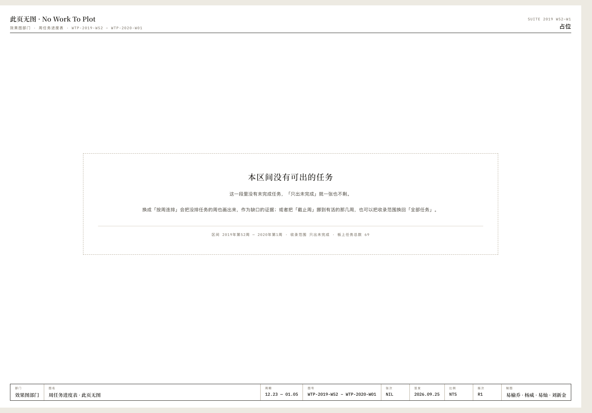 | **占位页**：页眉「此页无图 · No Work To Plot」+ 右侧「占位」，图面正中虚线框写清为什么没图（这一段里没有未完成任务…），图签栏张次 `NIL`。纸面 1512×1047 一格未缩 |
| 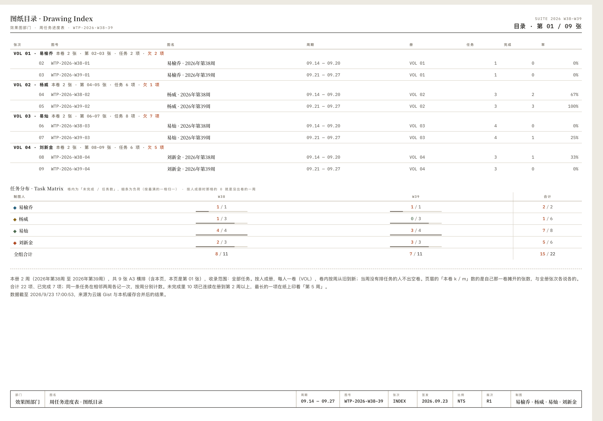 | **图纸目录**（按人成册两周，9 张）：张次 `02…09`（目录页自己占第 01 张，见决策 13）、`WTP-2026-W38-01` 图号、`VOL 01…04` 卷号，张次 `INDEX`。**卷与卷之间那一行现在是一条卷小计**（`VOL 02 · 杨威 本卷 2 张 · 第 04–05 张 · 任务 6 项 · 欠 1 项`，决策 18），它替掉了原来那道「换卷加重线」；这一张图每一轮都重拍，所以图注跟着当前版面走，要看小计的字面观感请直接看下面最后一张表的裁条 |
| 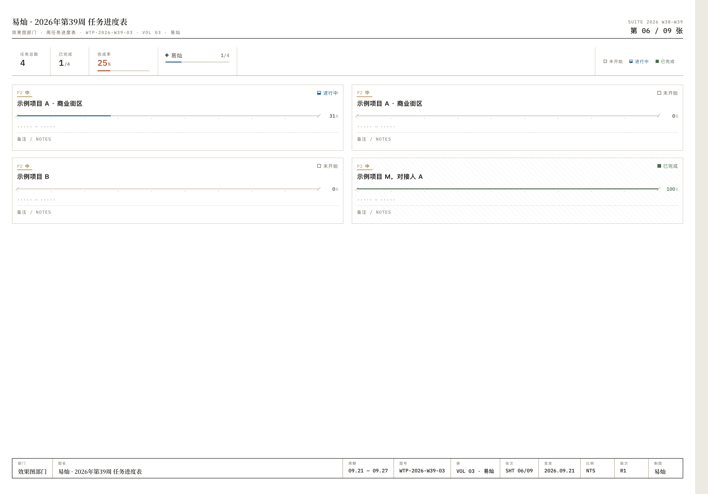 | **一卷的内页**：一个人一周的卡片走多列流（`sparse` 两列），页眉右侧「第 06 / 09 张」，图签栏带 `册` 一格 |
| 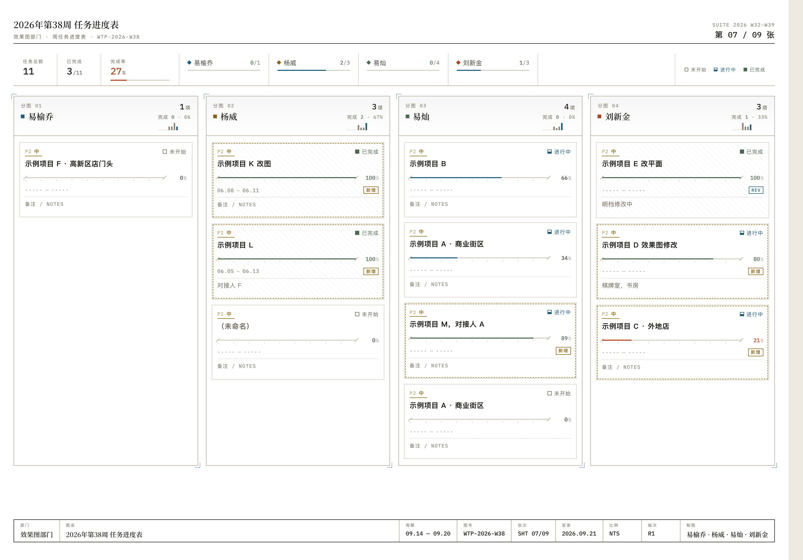 | **按周连排最满的一张**：四人四列通栏、每列一个 `分图 01…04` 图框带角裁切标记、图签栏贴住纸的下边线 |
| 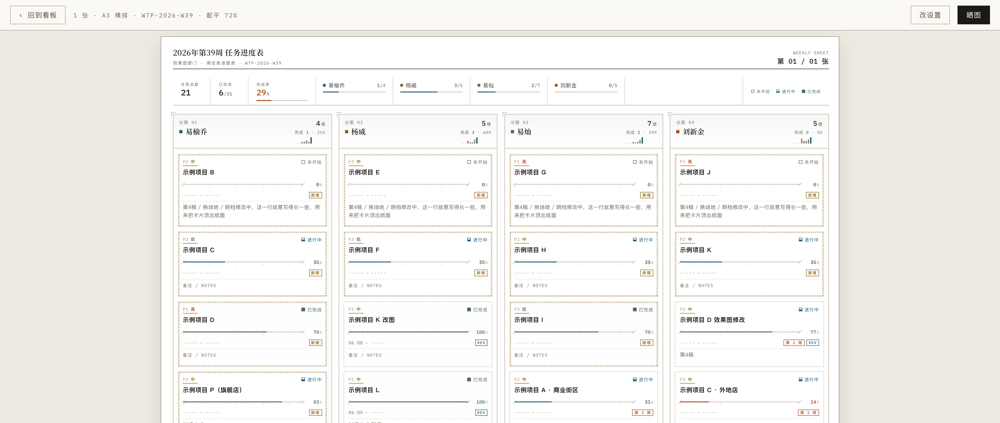 | **配平读数**：预览条 `1 张 · A3 横排 · WTP-2026-W39 · 配平 72%`，下面整张纸等比缩到 72%（21 项 / 自然高 1450px）。这条只在非 `?sheet` 路径拍得到，原因见「测量陷阱」第 9 条。**（第八轮原地标注：这一张现在读 1455px / `--fc` 0.7189，涨的 5px 是那枚新徽标的版面代价，逐卡归因见下面第 10 条与决策 21；1450 / 0.7213 是它当时那份的读数，图注留着不改史）** **（第十二轮原地标注：这一例从 1 张变成 2 张，所以这一格现在拍的是「预览条 + 那两张纸的开头」**。facts 现读 `pages 2`、`cards [19, 2]`（19 + 2 = 21，「21 项」那一格未变）、`natH [1145, 1047]`、`fc [0.8907, 1.0000]`、`minFit 0.8907`，预览条那一句现读 `2 张 · A3 横排 · WTP-2026-W39 · 续排 1 张 → 2 张 · 图面配平 89%`（标签从「配平」改叫「图面配平」是决策 22 之后的事，那一格本轮是从图上读出来的、不是拿 facts 拼的）。**上面那句「整张纸等比缩到 72%」从这一轮起要按纸说**：这一例第一张压到 `0.8907`、第二张 `1.0000` 一格未缩 —— 决策 25 把 `_budgetFor` 的除数换成 `COMFORT_FLOOR`(.8824) 之后，那张 1455px 的纸再也装不下 21 项，于是它开始换纸而不是继续压字。1455 / 0.7189（第八轮）与 README 那格里现读的 0.6639（第九轮）都是它当时那一份的读数，留着不改史；紧接的前一版（第十一轮 facts）读的是 `pages 1` / `natH [1455]` / `fc [0.6639]` / 摘要「1 张 · A3 横排 · WTP-2026-W39 · 图面配平 66%」——**「66%」与「89%」之间差的就是那一次换除数）** |
| 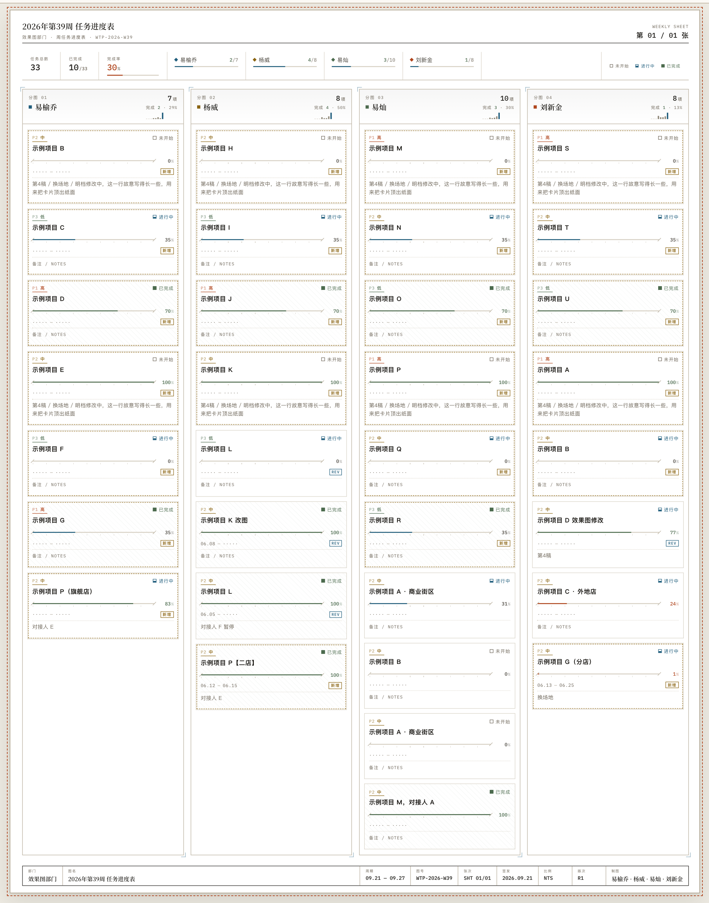 | **压到下限仍超纸面（09-21 的历史状态，只当样式本体留着）**：33 项、自然高 1935px，`fc` 卡在 `0.66` 不再压，纸外一圈锈色虚线（`.is-spill`），读数写「1 张压到下限仍超纸面 · 出纸会续页」。**同一例今天走续排，出的是下面那两张完整纸（第十二轮原地标注：现在是三张 —— 决策 25 把 `_budgetFor` 的除数从 `FIT_FLOOR` .66 换成 `COMFORT_FLOOR` .8824 之后，尾巴上多出一张只剩一枚卡的纸，见下面 09-24 那一批那一张），`.is-spill` 不再点亮**；这张图留着是因为要看那圈铁锈虚线长什么样，`shoot.py` 已不再重拍它（facts 里也没有它的记录了，别去 `sheet-facts.json` 找） |

| 图 | 看什么 |
| --- | --- |
| 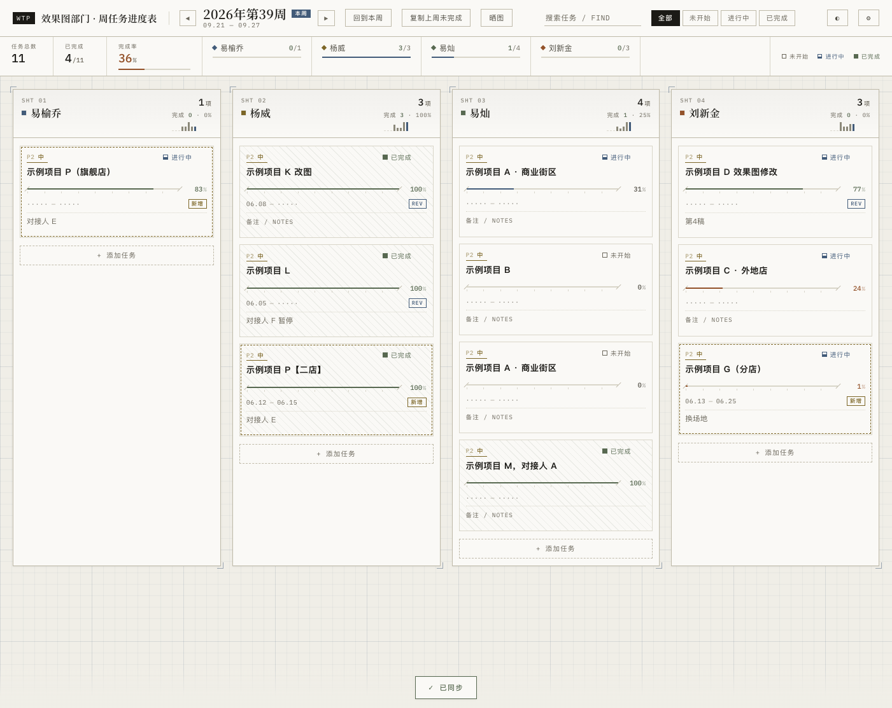 | 日览配色整体版面：图签头、统计条、四条人列、已完成卡片上的 45° 剖面线、`新增` 卡片的内侧虚线（修订云线轻量版） |
| 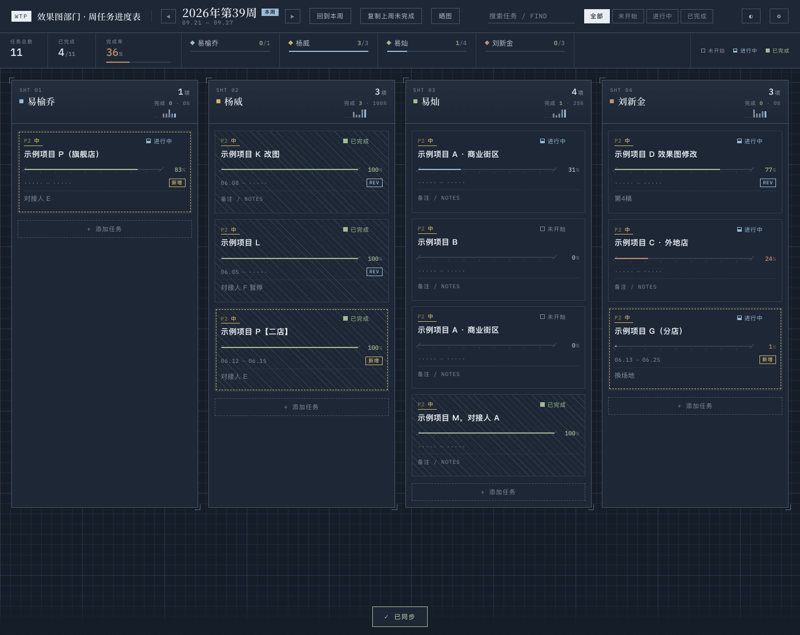 | 蓝图夜览同一版面；`SHT 01…04` 图幅号、列头负荷迷你格、尺寸线进度条在深色下的读法 |
| 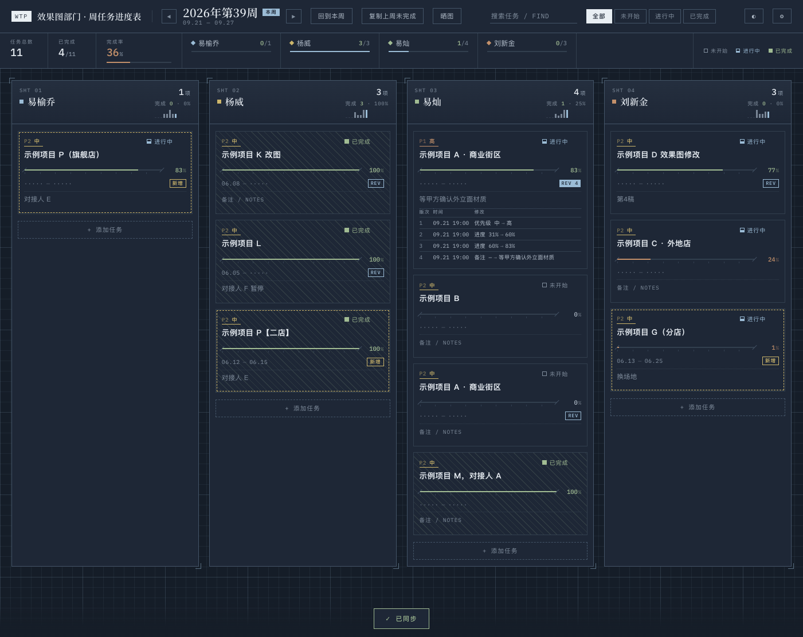 | 修订表展开态（版次 / 时间 / 修改 三栏，四行真实变更：优先级、两次进度、备注），`REV 4` 徽标与 `P1 高` 一起看 |
| 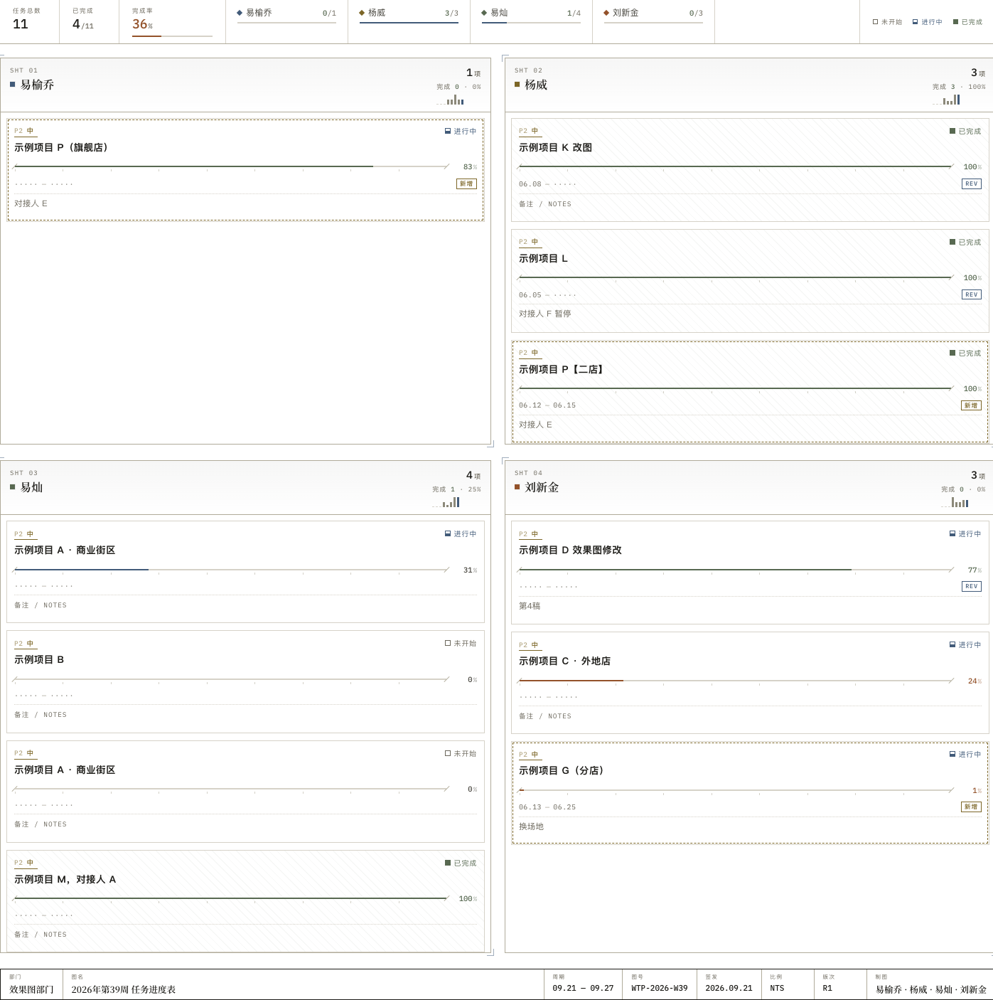 | **已过期**：拍的是 `744ccd2` 的旧晒图版面（2×2 图幅 + 底部单块图签）。现在的出图是四列通栏 + 每张纸各自带图签，还多了目录页与连排/分册两种排法，看上面那批 |
| 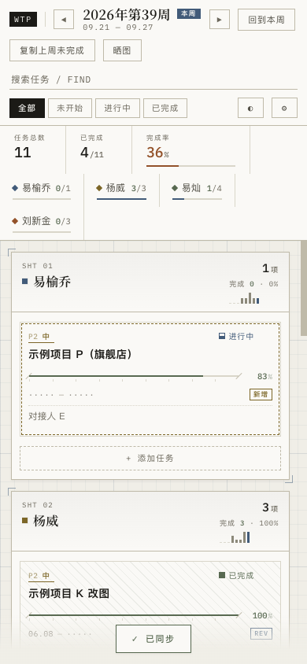 | 390×844 真实手机版面（同源 iframe 拍的，见 `.preview/mobile-frame.html`）：工具栏换行、人列纵向堆叠、`scrollWidth` 390 = 视口宽，无横向溢出 |

23:00 那批（补齐「还欠着的」里留档那条）：

| 图 | 看什么 |
| --- | --- |
| 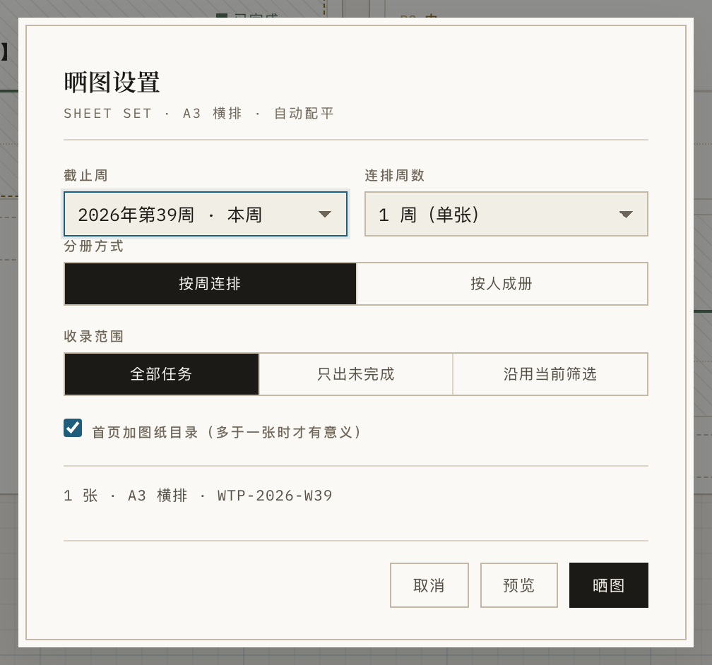 | **晒图设置对话框**五格：截止周 / 连排周数（下拉 8 档）/ 分册方式（按周连排 · 按人成册）/ 收录范围（全部 · 只出未完成 · 沿用当前筛选）/ 目录开关，底部摘要 `1 张 · A3 横排 · WTP-2026-W39`。由 `SheetSet.openDialog()` 直接唤起，不用点顶栏 |
| 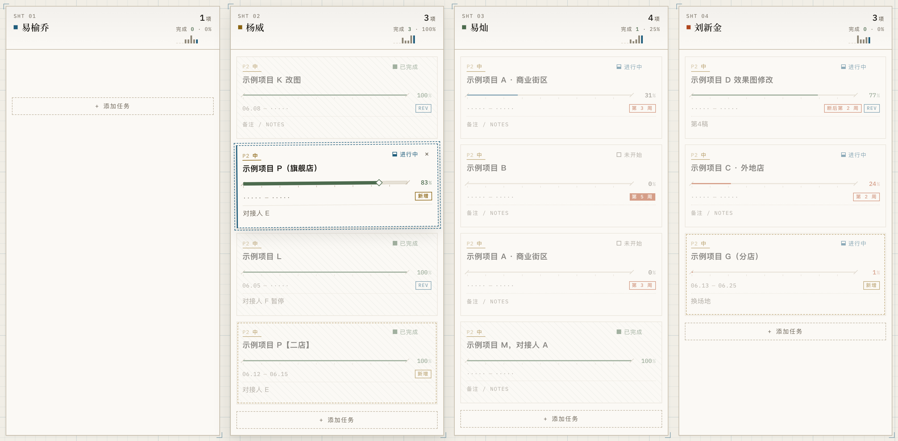 | **拖拽进行中**（CAD 选择集的读法）：`示例项目 P（旗舰店）` 正被拖进另一列，卡片抬起微旋（computed `matrix(0.999962,-0.00872654,…)`），同列兄弟淡到 `opacity:0.5`。真指针事件造的态，见「测量陷阱」第 14 条 |
|  | **手机整页长版面** 390×2696：四条人列纵向堆叠（列顶 320 / 624 / 1240 / 2004）、11 张卡、统计条与页脚全在里面，`scrollWidth` 390 = 视口宽。悬浮保存条是拍摄装置注入隐藏的，产品上它只在待存时出现（「测量陷阱」第 13 条）。**（第八轮原地标注：这一张现在是 390×2703、第四条列顶 2010，那 7px 属于卡上那枚 `第 N 周`；2696 / 2004 是它当时那份的读数，见下面第 10 条）** |

同一晚最后一批三张——**跨页续排本体**（`shoot.py` 的 STRESS 类，33 项 / 30 项合成密度，读数取 `docs/sheet-facts.json` 里对应那三条）：

| 图 | 看什么 |
| --- | --- |
| 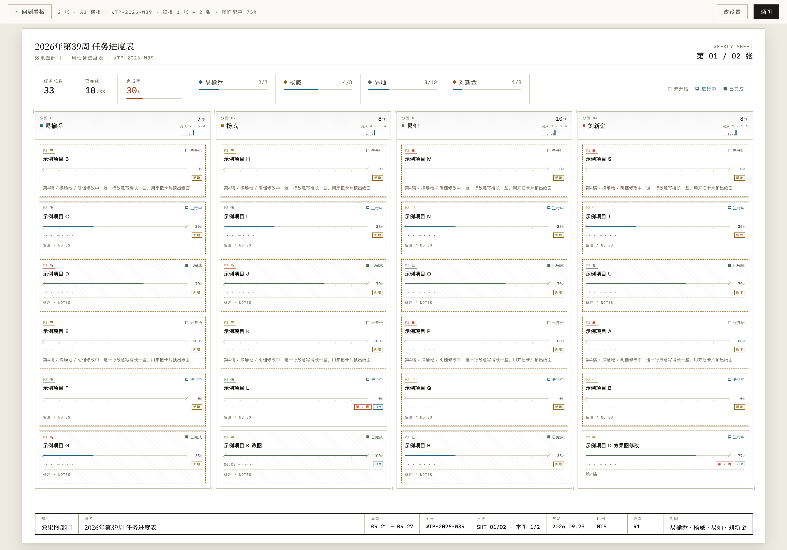 | **一张图的前半页**：单周 33 项竖切，四列各吃到装不下为止（本页 28 张卡）。页眉「第 01 / 02 张」、图签 `SHT 01/02 · 本图 1/2`，**图名不带「· 续」**（第一页不是续页）。预览条 `2 张 · A3 横排 · WTP-2026-W39 · 续排 1 张 → 2 张 · 配平 71%`，自然高 1474px 配到 `0.7096`（这条走 JS `preview()`，与 `?sheet` 那条量的 1440 / 73% 不是一回事，见「测量陷阱」第 23 条）**（第十二轮原地标注：这一例摊成三张了，所以「前半页」后面还有一张**。现读页眉「第 01 / 03 张」、图签 `SHT 01/03 · 本图 1/3`、本页 **16 张卡**（`cards [16, 16, 1]`、`natH [1047, 1128, 1047]`、`fc [1.0000, 0.9079, 1.0000]`），预览条现读 `3 张 · A3 横排 · WTP-2026-W39 · 续排 1 张 → 3 张 · 图面配平 91%`；这一张自己 `natH` 1047 = `visH` 1047、`--fc` **1.0000**，四根列头都吃了卡（`column-body.empty` 0 根）。**「前半页 / 后半页」那个两分法本轮起不成立了**：换三张的原因是决策 25 换掉的除数，不是种子换了（同一份 STRESS 6/5/6/5、同一个 33 项）；28 张卡 / `01 / 02` / 71% / 1474px / `0.7096` 是 09-22 拍它那天的读数，紧接的前一版（第十一轮那份 facts）读的是 `[24, 9]` / 1318px / `0.7480` / 「图面配平 75%」——两代都留着。第三张的证据在下面 09-24 那一批那一张）** |
| 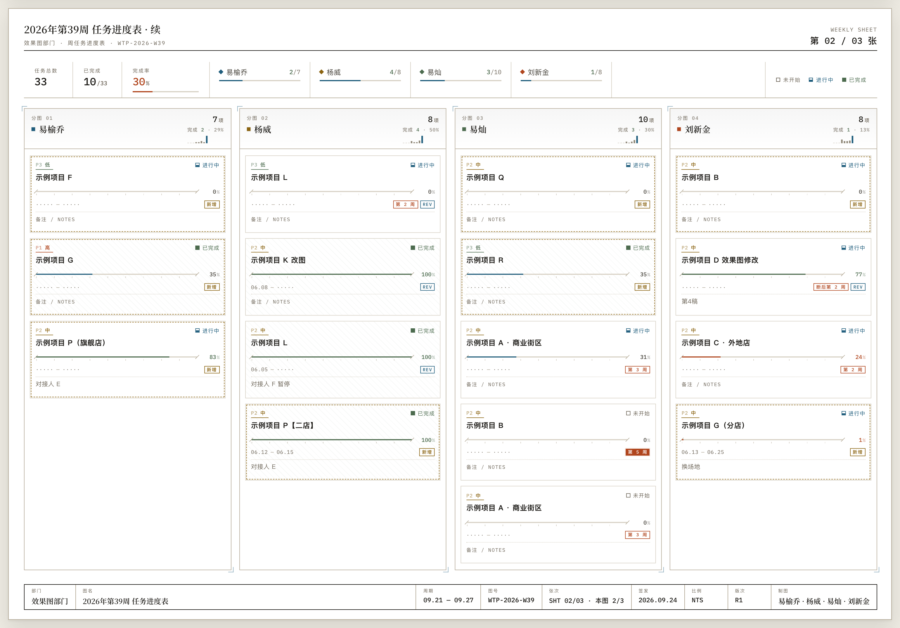 | **同一张图的后半页**：剩下的 5 张卡从列头下沿重新起排（四列 0+1+3+1），**自带页眉、自带图签、自带配平**（`fc=1`，纸面一格未缩），图名后缀「· 续」、图签 `SHT 02/02 · 本图 2/2`、图号与前半页同一枚。易榆乔那一列在这页被搬空，框里印的是**「本张无余项 / NOTHING FURTHER」**——不是「待补充」，那半截卡躺在前一张纸上，叫人来补是假话（决策 13）；同一列头上「7 项 / 完成 2 · 29%」**照旧按整周算**，与前半页同一口径。这张是「每一半都是一张完整的纸」那句话的证据——没有半张纸、没有跑到第二页的图签栏 **（第十二轮原地标注：本轮这张是**中间那张**，不是「后半页」，而上面两句本轮各改一处口径**。现读页眉「第 02 / 03 张」、图签 `SHT 02/03 · 本图 2/3`、本页 **16 张卡**、`--fc` **0.9079**（`natH` 1128 > 纸 1047，这一张本轮**被压了一格**）—— 那句「自带配平（`fc=1`）、纸面一格未缩」从这一轮起落在**第 03 张**上（`natH` 1047 = `visH` 1047、`fc` 1.0000）。更要紧的是：**「本张无余项 / NOTHING FURTHER」这一档本轮不在这张纸上** —— 四根列都吃了卡（列身高 437 / 579 / 720 / 579，`.column-body.empty` **0** 根），`probe_r12_lastpage.py` 逐张读的第 02 张那一格是「（无）」，那三个字挪到了第 03 张的三根空列上。**别把这一段当对家读回去**：易榆乔那一列「被搬空」在两张摊法下是真的（**第十一轮那份 facts 读的是 `cards [24, 9]`、`natH [1318, 1047]`、`fc [0.7480, 1.0000]`、摘要「图面配平 75%」**），而三张摊法下这张一枚空列都没有；上面那句「剩下的 5 张卡」与 28 张卡又是**更早**（09-22 拍它那天，图框还跟着一起缩的时候）的读数 —— 三个数分属两轮，本轮只报三张那份。三张摊法的账见下面 09-24 那一批那一张）** |
| 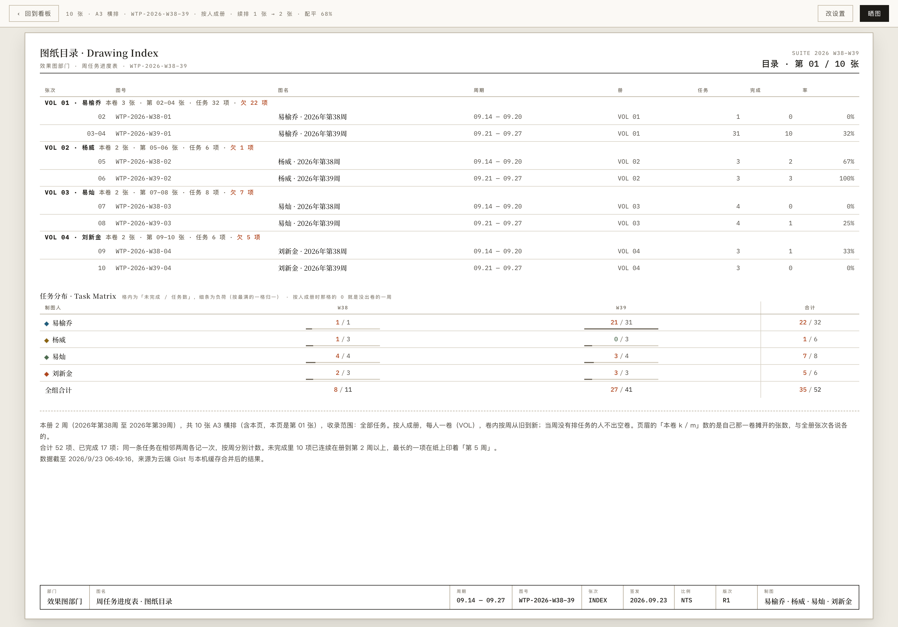 | **目录页上的张次区间**：按人成册灌到一人 30 项 → 那一卷的张次写成 `03–04`（en-dash），其余各卷仍是单值；整册 `10 张 · A3 横排 · WTP-2026-W38–39 · 按人成册 · 续排 1 张 → 2 张 · 配平 68%`，被切开那条自然高 1544px、`fc=0.6774`。分册那条切分走的是二分试排（`_sliceFlow`），跟上面四列竖切不是同一条路。**这张的目录页脚下面也躺着第二张表**（灌到 52 项那一版），右下角 `35 / 52` **（第十二轮原地标注：这一册从 10 张涨到 11 张，被切开的那一卷由「两张」变成「三张」**。facts 现读 `pages 11`、`cards [0, 1, 15, 15, 1, 3, 3, 4, 4, 3, 3]`、`natH` 里**两格 1061**、`fc` 里**两格 0.9812**、`minFit 0.9812`，摘要 `11 张 · A3 横排 · WTP-2026-W38–39 · 按人成册 · 续排 1 张 → 3 张 · 图面配平 98%`；四条卷小计全带区间（`第 02–05 / 06–07 / 08–09 / 10–11 张`），第一行是 `VOL 01 · 易榆乔 本卷 4 张 · 第 02–05 张 · 任务 32 项 · 欠 22 项`，目录里被切开那一行的张次现读 `03–05`（这一格与 `volsums` 那两格是**两处不同的东西**：`volsums` 是卷小计那句、`heads` 才是页眉，图里那一列只能看图读，来路写在 `why` 里）。**上一版（第十一轮 facts）读的是** `pages 10` / `cards [0, 1, 21, 10, 3, …]` / 第三张 `natH 1383` / `fc [0.7054]` / 摘要「10 张 … 续排 1 张 → 2 张 · 图面配平 71%」/ `VOL 01 … 本卷 3 张 · 第 02–04 张`。上面 68% / 1544px / `0.6774` 与 `03–04` 是 09-22 那天那份的读数，留着不改史。**没重数的那一格照实说**：「其余各卷仍是单值」本轮没有再数一遍目录表那一列，别拿卷小计的四条区间当它的对家。横表自己没动：`rows 5 / cols 4 / bars 8 / h 191 / corner 35/52` 五格与上一版逐字相同）** |

09-22 深夜那批一张——**目录页第二张表**（`shoot.py` 的 URL 类，真实打码数据、没灌合成任务，读数取 `sheet-facts.json` 里 `2026-09-22-sheet-task-matrix.png` 那条）：

| 图 | 看什么 |
| --- | --- |
| 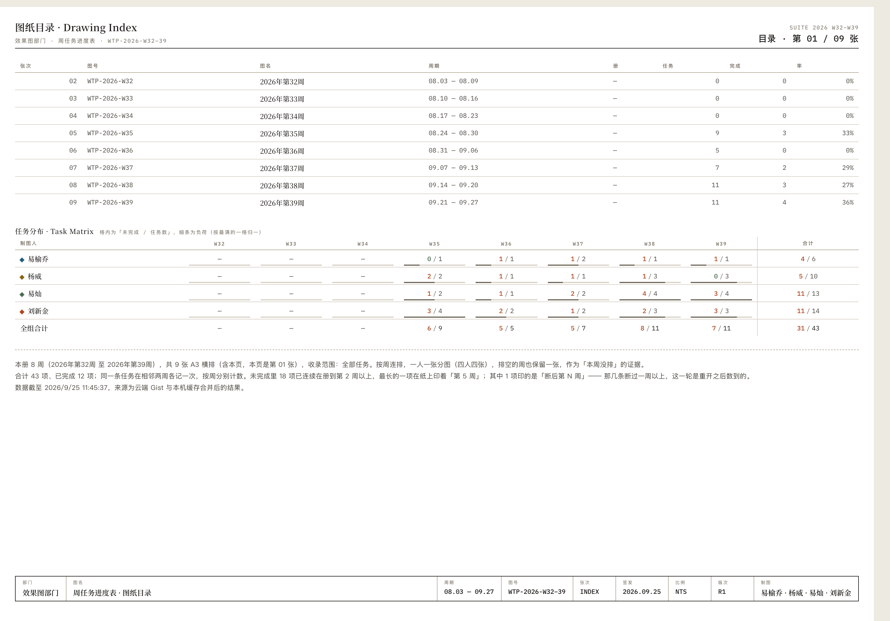 | **目录页现在有两张表**：上面那张按「张」（`01…09` + 图号 + `INDEX`），下面这张按「人 × 周」——表头 `任务分布 · Task Matrix`，四行制图人 + 一道「全组合计」行，八列周 + 一列「合计」，格内「未完成 / 任务数」（铁锈色 = 还欠着，草绿 = 欠 0，`—` = 那周那人压根没排），格底一道 2px 负荷条按**全表最满的一格**（4 项）归一，合计那一列与合计那一行都不画条。右下角 `31 / 43` 与页脚那句「合计 43 项、已完成 12 项」是同一笔账。整块 191px 高、吃的是目录页原本那一大片白：纸的 `--nat` 仍是 1047px、`--fc` 1.0000，九张纸还是九张。**挑八周那一册拍是因为列数最多、横表在这张纸上最挤** |

2026-09-22 那批三张——**同一批排法换系统 WebKit 出一遍**（打码种子，跑法见上面那条 WebKit 命令块）。每张图是一例排法的全部纸，逐格标了「第 NN 张 · 提取出的字数 · ASCII 图号 · 张次 · 图签栏判定」，页脚写着这条通道证明什么、不证明什么。**续排上线后这三张重出过一遍**（图注里补了每页的 `SHT n/N`，被切开那一册也从 1 格变成 2 格）：

| 图 | 看什么 |
| --- | --- |
| 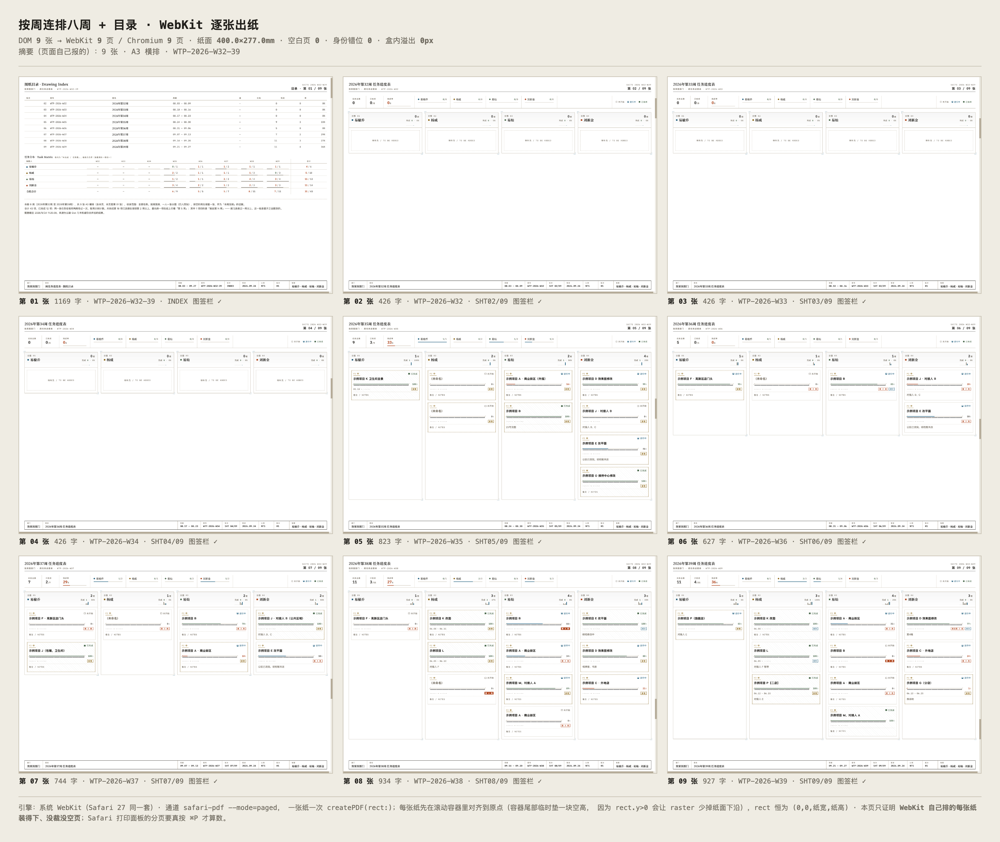 | **按周连排八周 + 目录，WebKit 出 9 张**：DOM 9 张 → WebKit 9 页 → Chromium 9 页三账对齐，纸面 400.0×277.0mm（= 1512×1047 CSS px，与 Chromium 那批 420×297mm 差的就是 `@page` 那 10mm 页边），0 空白页、0 身份错位、0 盒内溢出，九张纸的图签栏逐格 `ok`，`shtChain` 从 `INDEX` 到 `SHT 09/09` 连号。目录页中间那片白**两个引擎一样**（`.preview/blank_band.py` 量的：72dpi 出图、灰度阈值 200、只算首末墨迹之间的空白带）：八周那册最大一条 **305px（Chromium）/ 323px（WebKit）CSS px**，两周那册 **227 / 243**（**这两个数是本轮重量的**：这里早先记的是 289 / 307，那是横表与小计都还没进来时的读数，同一个量具同一份代码现在读出来就是 227 / 243 —— 见决策 18 的回归那一段；**八周那格照旧 305 / 323 一字未变**，它不画小计，正好当这一格的对照组）。两册的引擎差分别是 **+18 / +16px**，早先那句「差的就是 0.787 缩放取整那半格」**本轮撤回归因**：一条能同时给出 18 和 16 的解释要先说明这 2px 从哪来，而 `blank_band.py` 读的是出纸之后的像素、`matrix_diff.py` 量的是屏上布局，两把尺子不在同一套坐标里，**这笔现在记成「未归因」**，别当已闭合的账读 —— 索引表本来就短，图签栏照旧钉在纸的下边线，不是 WebKit 少画了东西。**上一轮同一处记的是 536 / 539 与 608 / 612**，那是横表进来之前、用一套没落进脚本的临时量法量的，只当方向（白被横表吃掉了），别拿它跟本轮这几个数比大小；这一项从本轮起由 `blank_band.py` 接管，方法写在文件头 |
| 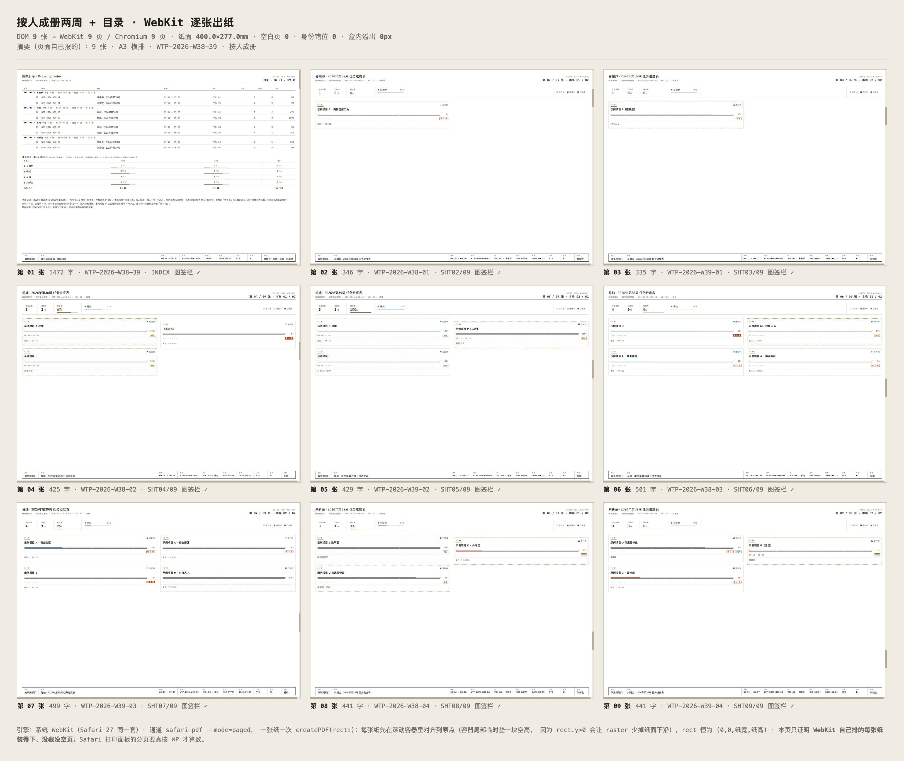 | **按人成册两周 + 目录，WebKit 出 9 张**：`WTP-2026-W38–39`，卷内页与 `VOL` 目录都在；这一例是「一个人一周 = 一卷、每卷纸数不等」那条路径，逐张同样装得下。同一代码路径的**加重版**（一人灌 30 项 → 那张纸被切成两页）在另一例里：`dom/webkit/chromium = 5/5/5`、`shtChain` = `SHT01/05 … SHT05/05` 连号、0 空白、0 出界 |
| 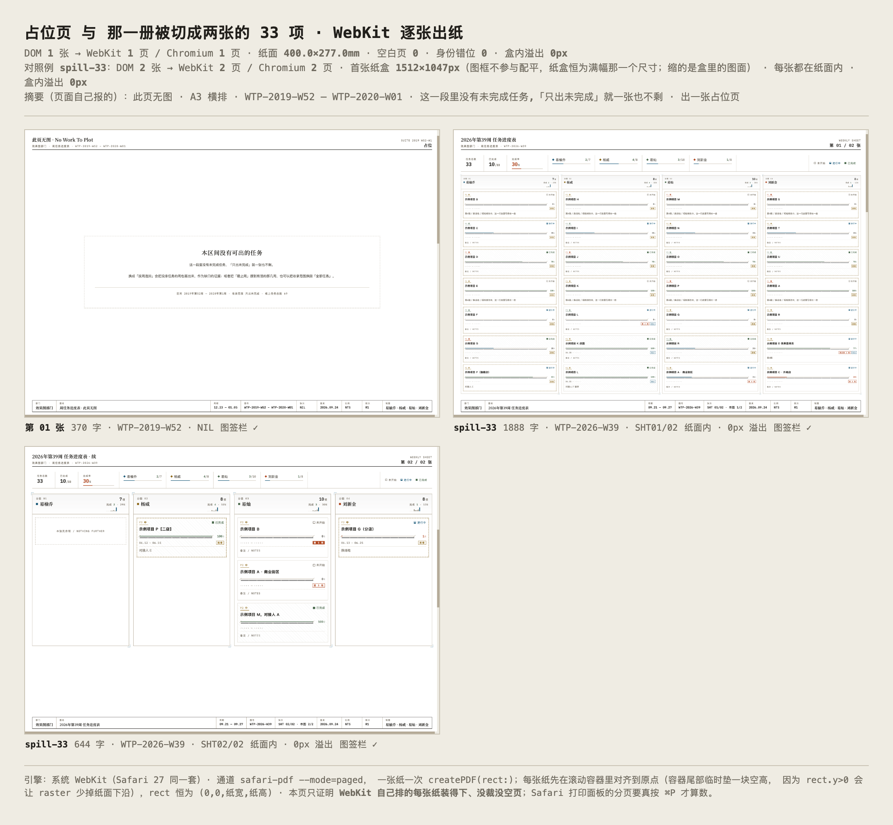 | **左：占位页**（`此页无图`、图签栏图号是一段区间 `WTP-2019-W52 – WTP-2020-W01`、张次 `NIL`）——WebKit 画得出这一页，说明「零张纸也要有一张纸可打」那条决策跨引擎成立。**右：33 项那一册被切开后的两张**（`SHT01/02` + `SHT02/02`，各 33 项里的 28 + 5 张卡）——**这一格以前是「一张纸 + 纸面外 849px + 通道截掉 51px」，现在两页都 0 出界、0 截断**。首张的 MediaBox 是 1101×1046pt，那是**被配平缩过的纸盒**，不是 A3（「测量陷阱」第 22 条）；第二张回到 1512×1047。两个引擎量的自然高差 4px（1440 / 1436），按第 23 条只当量具差，不当版面差 |

09-23 凌晨那批第一张——**页眉那一条裁图**（卷内张次，`shoot.py` 的 URL 类 + 新加的 `band` 裁法，读数取 `sheet-facts.json` 里 `2026-09-23-sheet-vol-header.png` 那条）：

| 图 | 看什么 |
| --- | --- |
| 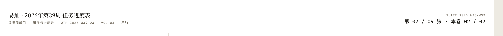 | **一张纸的上面那一条**（按人成册两周 + 目录，裁到**第 07 张**纸的页眉 —— `shoot.py` 那个 job 写的 `"paper": 6` 是 0 基下标，纸上印的张次是 07，别拿数组下标当页眉读数）：右侧 `第 07 / 09 张 · 本卷 02 / 02` —— 前半句是**装订位置**（这张在整册第几张），后半句是**卷内位置**（副行末尾 `VOL 03 · 易灿` 那一卷摊开是两张，这一张是它的第二张；同一册里杨威是 `VOL 02`、第 04–05 张），两个分母各说各的、互不改写。**为什么要裁条**：整页缩进文档表格之后，页眉那 15px 等宽字在图上是一团墨，「本卷」到底印没印、有没有跟左边那块撞行，肉眼在这张表里读不出来 —— 于是 `shoot.py` 多了一种 `band` 裁法（只要纸**上面那一条**：112 CSS px，2 倍图出片就是 3080×224）。**同一件事在 `sheet-facts.json` 里还有第二处证据**：本轮新增的 `heads` 那一格把**整册每张纸的页眉逐张抄进读数**（这一册九条：`目录 · 第 01 / 09 张`、`第 02 / 09 张 · 本卷 01 / 02`…`第 09 / 09 张 · 本卷 02 / 02`），因为卷内号对不对要看的是**整卷连不连号**，单看留档那一张永远查不出漏号 |

09-23 凌晨那批第二张——**目录页那一条裁图**（卷小计，`shoot.py` 的 URL 类 + 同一个 `band` 裁法，`"paper": 0, "band": 300`，读数取 `sheet-facts.json` 里 `2026-09-23-sheet-toc-volsum.png` 那条）：

| 图 | 看什么 |
| --- | --- |
| 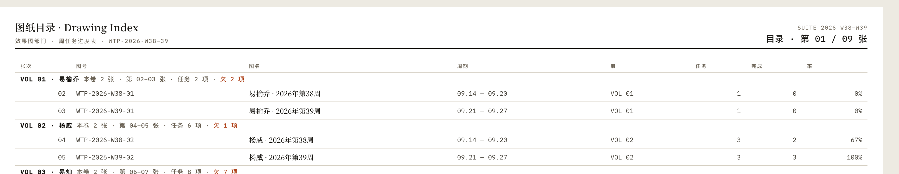 | **目录页的上面那一条**（300 CSS px，出片 3080×600）：页眉 `图纸目录 · Drawing Index` + 表头那一行 + `VOL 01 · 易榆乔 本卷 2 张 · 第 02–03 张 · 任务 2 项 · 欠 2 项` 与它下面那两行、`VOL 02 · 杨威 本卷 2 张 · 第 04–05 张 · 任务 6 项 · 欠 1 项` 与它的两行，第三条小计刚露头。**为什么裁条而不是整页**：小计那句是 10.5px 等宽字，整页缩进文档表格之后与上面那道表头线糊成一团，「欠 2 项」到底是不是铁锈红、`VOL 01` 有没有跟「本卷」撞成一串，肉眼在这张表里读不出来。**这一条要看的是三件事**：① 小计那一行的 `张次` 那一格是**空的**，数据行仍然从 `02` 排到 `09`，一条都没被污染（`<th>` 而不是 `<td>` 的那条理由，见决策 18）；② 第一条小计紧贴表头那条下线、**上面没有第二道杠**（`tr.toc-vol:first-child th{border-top:none}`），第二条往上才是它自带的那道 1.5px；③ 「欠 N 项」是铁锈红、`VOL nn · 姓名` 里只有姓名转黑加粗，其余保持 `--ink-3` 灰 —— 一行里三种字重，靠的是「姓名是要认的，数字是要核的，标签是背景」。**同一件事在 `sheet-facts.json` 里有第二处证据**：本轮新增的 `volsums` 那一格把**每卷小计整句**抄进读数（11 条出图记录里 5 条非空，四卷各一条），因为小计对不对要看的是**四卷加起来等不等于全册**，单看留档那一张查不出漏了哪一卷。**`欠 0 项` 那一档（草绿）本轮没有纸面证据** —— 那 5 条非空读数分属**两册**，两册里没有一卷是零欠项（见「还欠着的」。**这句下一轮就不成立了**：09-23 上午那两张裁条里，草绿那一档第一次印在纸上，见下面那张表） |

09-23 上午（本轮）那批两张——**同一条目录裁带的两种边界**，`shoot.py` 里第一次有 job 自带 `base`：这两张不是拿打码种子拍的，是拿 `.preview/make_fixture_seed.py` 造的两颗 fixture 拍的（`preview-1vol.html` / `preview-zerodebt.html`）：

| 图 | 看什么 |
| --- | --- |
| 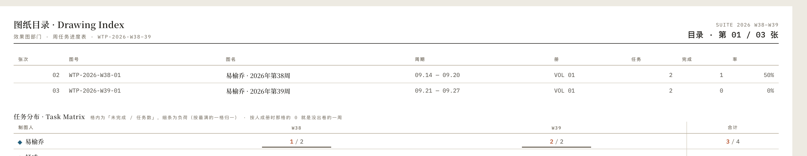 | **一册只有一卷、却有目录页**（同一道 `band:300` 裁法，`pages` 3）：页眉照旧印 `VOL 01 · 易榆乔` 那一格图签，但目录上**一条小计都不许有**、页眉右侧**不许有「本卷 k / m」**、脚注**不许解释那个不存在的格子**——三道闸同时关着，而索引表张次仍然从 `02` 起（目录页占第 01 张那条规矩不受影响）。**这一张是那道闸反方向的第一次纸面证据**：决策 17 的 ⑤ 与决策 18 的「不许有小计」此前只有半边，理由是「构造不出来」，本轮查清缺的是数据不是代码。**为什么要拍到这一格才算数**：`volumes.length > 1` 写反成 `>= 1` 时，日常四卷的册子照样对（四卷都是 `>1`），只有这一册会当场冒出四条小计——**没这张图，那三处写反可以一路活到用户手上** |
| 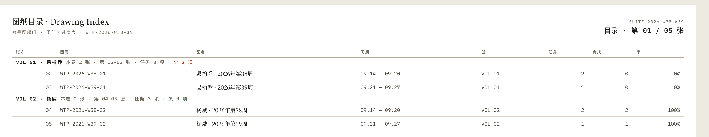 | **整卷零欠项那一册**（`pages` 5，两条小计）：`VOL 01 · 易榆乔 … 任务 3 项 · 欠 3 项` 铁锈红，`VOL 02 · 杨威 … 任务 3 项 · 欠 0 项` **草绿**——两档并排才看得出配色分得开。**这一格是「欠 0 项」那一档第一次印到纸上**，此前的纸面证据只有横表那个 `0 / 3` 格。断言不写死 hex：判的是「这一格的计算色**等于这一作用域解出来的 `--sage`，且不等于 `--rust`**」——纸面与屏上两套主题下同一个令牌是两种值，写死等于把断言绑在一种主题上（第 20 条）。为什么以前造不出来，这一轮顺手算清了：小计算的是**一整卷** = 一个人 × 册子里**所有**周，打码种子里没有哪个人在 `W38` 与 `W39` 两周里把名下每一项都做完（四卷实测欠 2 / 1 / 7 / 5）——「一个人 × 一个周」欠 0 是有的（横表里杨威 W39 那格就是 `0 / 3`，它早就绿了），那是另一格 |

本轮（第八轮）那批四张——**那枚 `第 N 周` 的纸面证据**，四张全走第三颗 fixture（`http://127.0.0.1:8899/preview-tenure.html?sheet&from=2026-W39&count=5&mode=weeks&toc=1`，6 张纸、`cards` = `[0,3,4,5,6,5]`、`WTP-2026-W35–39`、逐张 `--nat` 1047 / `--fc` 1.0000）：

**（第十轮就地标注，不改史**：下面这四张**已经在这轮被重拍过一遍**，`count` 从 5 改成 **6**（fixture 添了第六条链 TF「断后连四周」，而 TF 的断口与起头落在 `W34` / `W35`，五周窗口从 W35 起、纸上只看得见结果看不见断口），于是那一册变成 **7 张纸**、`cards` = `[0,1,3,5,6,7,6]`、`WTP-2026-W34–39`，**逐张 `--nat` 1047 / `--fc` 1.0000 这一格一字未变**。四张各自的 `paper` / `band` / `need` / `need_re` 全部由 `.preview/probe_r10_look.py` 重量后改写，改了什么写在**各行末的「第十轮」那一段**里；张数不变（重拍不加图），像素变了（`shots_diff` 对 `HEAD`：两张尺寸不同、一张整页 0.122%、一张脚注那一带 2.06%）。**为什么这四张不能留着旧数**：它们的 `need_re` 里钉着「`未完成里 11 项…`」，而添了第六条链之后**那句话在任何一颗种子上都再也印不出来**（fixture 现读 14 项；`docs/sheet-facts.json` 整本扫下来，「未完成里 N 项」这一格今天只有 **10 / 14 / 18** 三个值，11 出现 **0** 次）—— 留着的后果是「留档与它自己的判据互相打脸」，第 34 条那道 `need` 闸当场就会红。原文照留，因为「四张全走 `count=5`」这件事本身就是第八轮的读数。）

| 图 | 看什么 |
| --- | --- |
| 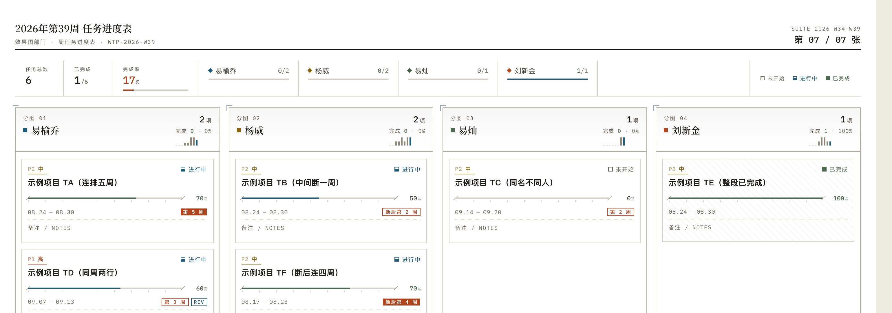 | **卡下沿那一条**（本周那张纸 = 第 06 张，`"paper": 5, "band": 600`，出片 3080×1200）：同一张纸上 TA 那行「第 5 周」**整枚反白**（`--rust` 底、`--paper-raised` 字），TD 那行「第 3 周」**描边**并排一枚 `REV`（在册与改过同槽，谁也没挤掉谁），TB / TC 各一枚「第 2 周」描边，刘新金那一列（整段已完成）**一枚都不印** —— 反白那枚是本组唯一的新颜色。**这张为什么重拍一遍才敢说**：第一版框写在 `band: 250`，出来的是一张**只有页眉、统计块和四个列头的空条**，一枚徽标都没有，而 `EXIT` 是 0（「测量陷阱」第 34 条，`need` 闸因此诞生） —— **第十轮重拍**：`paper` 5 → **6**、`band` 600 → **542**，`need` 从（在册 5 / 反白 2 / REV 1）不变，`need_re` 多钉两句「断后第 4 周」×1 与「断后第 2 周」×1 —— 这一张现在是**唯一一张同一页上「反白 + 前缀」同时出现**的留档（TF 那枚「断后第 4 周」是反白的，第八轮没有这一档）。出片 3080×1084。 |
|  | **判据的另一半在上一张纸上**（第 05 张，`"paper": 4, "band": 745`，出片 3080×1490）：TB / TC 刚起头那两行印的是 `新增`（琥珀描边 + 整张卡一圈虚线云线）而**不是**「第 1 周」，同一张纸上 TD 已印「第 2 周」、TA 印着反白的「第 4 周」—— 首周与在册两枚徽标怎么分工，只有这一张拍得下来（带子要到 745 才不腰斩 TD 那两条同周行；`"paper": 4` 是 0 基下标，纸上印的是 05） —— **第十轮重拍，而且换的是拍哪一周**：旧那张拍 W38（`paper` 4、`band` 745，判「TB / TC 起头那两行印 `新增`」），新那张拍 **W36**（`paper` **3**、`band` **542**）—— 因为 TF 这条断链的**重开那一周**正好落在 W36，判据从「首周不印」升级成「**断过之后的首周也不印**」：纸上 TF 那行印的是 `新增` 而不是「断后第 1 周」。`need` =（在册 2 / 新增 2），出片 3080×1084。 |
| 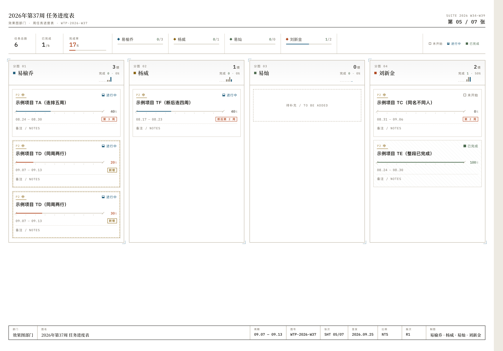 | **整页观感**（第 04 张，不裁条，出片 3080×2150）：一条链从「不印」走到「第 2 周」「第 3 周」，同一列里 TD 那两行刚起头、印的是 `新增`，刘新金那一列整段已完成一枚都不印。**徽标混进整张纸的密度里长什么样，只有整页看得出观感**，裁条看不出来 —— **第十轮重拍**：`paper` 3 → **4**（同一周 W37 往后挪一格），整页不裁；`need` =（在册 3 / 新增 2）之外多钉一句「断后第 2 周」×1 —— 这一张是**整页密度**里看那枚带前缀的徽标，与下面 `broken-row` 那张「只留三枚在册」的干净框互为对照。出片 3080×2150 未变。 |
| 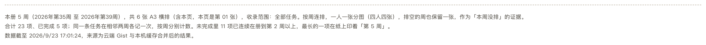 | **目录页脚注那一句整句**（`"sel": "#print-stack .toc-note"`，出片 2960×192）：`未完成里 11 项已连续在册到第 2 周以上，最长的一项在纸上印着「第 5 周」` —— 两个数都要能在册子里一枚一枚数出来，`verify_tenure.py` 判的就是「脚注说 11 项 == 数出来 11 枚」与「最长 5 周 == 页面外另算的那个最大值」。**同一句的另一支也第一次留进读数**：单卷与零欠项那两册的脚注写的是「未完成里没有一条排到第 2 周。」（`n=0`，见下面 facts 那段） —— **第十轮重拍**：纸没换（`sel` 定位），换的是**句里那两个数** —— `未完成里 11 项` → **14 项**，并多出半句「其中 **4** 项印的是『断后第 N 周』」，`need_re` 从两句变**三句**。出片仍是 **2960×192** —— 这一张是按 `sel` 量元素自己的框，脚注整段多出一行也没把框撑高（框的就是那一个元素，元素高由它自己的行数定，本轮从两行长句变成三行长句而框高未变，说明**旧图里本来就还留着一行余量**；这一格只报读数、不作解释，第 44 条）。 |

第九轮那条尾巴（同日午后稍晚）那批一张——**反白那一档第一次印在「没被压的真数据纸」上**（`shoot.py` 的 URL 类，打码主种子，`"paper": 7, "band": 698`，出片 3080×1396 / 296,599 字节）：

| 图 | 看什么 |
| --- | --- |
| 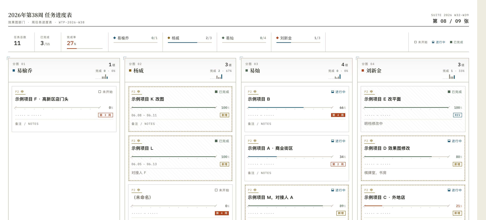 | **按周连排八周那册的第 08 / 09 张（2026年第38周）上面 698 CSS px**：卡 11 张、在册 5 枚，其中**两枚反白**（杨威「第 4 周」底在 672.2px、易灿「第 4 周」顶在 345.7px）并排**两枚描边**（易榆乔「第 3 周」、易灿「第 2 周」），第五枚在册（易灿「第 2 周」底在 828.1px）在框外。**这一张要证的只有一件事：这一档是整尺寸落纸的** —— 那一册九张纸 `--fc` 全 `1.0000`（`sheet-facts.json` 里 `2026-09-21-sheet-weeks-suite.png` 那行九格一字不差），8.5px × 1.0000 → 落纸 **2.249mm = 6.38pt**，`rgb(176,69,29)` 底 / `rgb(255,255,255)` 字 = **5.65:1**（门槛 4.5），与第八轮那三张 fixture 图同一档 —— 而它**不是** fixture、**不是** STRESS 灌出来的，是打码主种子里真实存在的一条四周期链。**为什么非真数据不可**：此前反白只有 fixture 那三处纸面证据，而 fixture 的任务分布是编的（第 20 条造它是为了造判据边界），「四周一条链」在真实板子上长什么样、混在 11 张卡的密度里读不读得出来，只有这一张答得了。**为什么不扩带子收进第五枚**：从 698 扩到 854 要多吞 156px 的一行卡，带子就从「两枚反白 + 两枚描边」变成「整页上半截」，而这一档的观感不需要更多样本 —— 反白与描边**并排**才是它要看的东西。**`need` 闸第二次挡下拍错的裁条**（第一次是它出生那一轮那张空条，第 34 条），而且这次挡的是**新写的那道**：第一版 `band` 照探针原话写 684，跑出来只有一枚反白、`EXIT` 非零 —— 探针报的是**纸面坐标**（最下沿一枚底在 672.2），`shoot.py` 的 clip 原点却是**纸顶 − PAD(14)**，所以 `band: N` 只盖到纸顶起 `N − 14` px，684 那一版实际盖到 670（第 48 条）。**观感复核做在两处**：整条缩小看（反白与描边在整张纸的密度里仍分得开：一枚实心一枚空心，没跟旁边的 `新增` / `已完成` / `未开始` / `REV` 撞色撞行），以及两块 2 倍放大（反白与描边同一行并排那一段、列头到反白那一段），字口都是干净的。**探针 `.preview/probe_r9_longbadge.py`** 三例 19 张纸 / 33 枚在册 / 7 枚反白，**逐枚现算 mm 与比值**（不抄文档，第 45、46 条那条规矩），并与 facts 对账：`weeks-suite` 与 `volume-page` 两册各 `tenure.long=3`、`pages=9` 相同 ✓，第三例（单周不裁）没有同册可查，脚本明说「**不是同一册（张数不同），这一遍没有对账对象**」而不是硬凑一个数 |

第十轮这批两张——**「断过」这件事第一次有纸面证据**（一张走 fixture、一张走打码主种子，两张都是 `"band": 386`、出片 **3080×772**，`paper` / `band` / `need` / `need_re` 四个数全部来自 `.preview/probe_r10_look.py` 那条「带子刻度」，先量后改）：

| 图 | 看什么 |
| --- | --- |
|  | **fixture 第 05 / 07 张（2026年第37周）上面 386 CSS px，框里只留三枚在册徽标**（`"paper": 4`，`need` =（在册 3），`need_re` = 「断后第 2 周」×1 与「第 2 周」×**2** —— 那个 2 是**一枚带前缀 + 一枚不带**，正则数「第 2 周」时前缀那枚也算命中，判据写死成 2 而不是 1，否则「前缀丢了」这一档就数不出来）。易榆乔「第 3 周」/ 杨威「**断后**第 2 周」/ 刘新金「第 2 周」，**三枚同为描边、同 8.5px、同一档铁锈红，唯一的区别就是前面多了两个字**；易灿那一列当周是空的（纸上印「待补充 / TO BE ADDED」），所以框里连一枚对照都不给它。**这一张要判的是「分不分得开」，所以它不许有别的东西来抢**：没有 `新增`、没有 `REV`、没有第二行卡 —— 上一张能拍到这些的是整页的 `tenure-ramp`（同一周 W37），那一张密度真、但判不了这一刀。**观感复核结论**：三枚都在**同一行**（y 345.7–360.4）、同为描边、同 8.5px、同一档铁锈红、落纸同为 2.249mm / 比值 5.65:1，**唯一的区别就是前面多了两个字** —— 而这一格量得出「分得开」：探针报「第 3 周」宽 47.0px（x 310.7–357.7）、「断后第 2 周」宽 **66.0px**（x 660.4–726.4），**差 19.0px ≈ 两个字**，缩小看整条带子中间那枚明显长一截，**不用认字也分得开**；放大到 2 倍逐字看，「断后」与后面「第 2 周」字口、字距一致，没有挤到卡边（三枚离卡右缘各剩 **11.00px**，与 `verify_tenure.py` 那条「离卡右缘还剩 N px 余量」同一把尺） |
|  | **打码主种子、按周连排八周 + 目录那册的第 09 / 09 张（2026年第39周）上面 386 CSS px**（`"paper": 8`，`need` =（在册 2），`need_re` = 「断后第 2 周」×1 与「第 3 周」×1）：框里那一行四枚徽标、四种说法一次拍齐（全部由 `.preview/probe_r10_chip_owners.py` 现数，不从上版印象里抄）：易榆乔 `新增`（示例项目 P（旗舰店））、杨威 `REV`（示例项目 K 改图）、易灿「第 3 周」（示例项目 A · 商业街区，x 1048.3–1095.2、卡右余 **11.00px**）、刘新金「**断后**第 2 周」+ `REV`（示例项目 D 效果图修改，x 1366.1–1432.1、卡右余 **42.86px**）—— 四枚同在一行 y 345.7–360.4，在册那两枚同 8.5px、同 1.0000、落纸 2.249mm、比值 5.65:1。这一张要证的是「**真数据里也有这一档，而且它旁边就带着不带前缀的对照**」。**为什么非真数据不可**：fixture 那一枚是编出来踩判据边界的（第 20 条），「一个人断过、重开之后排到第 2 周」在真实板子上长什么样、混在 11 张卡的密度里读不读得出来，只有这一张答得了。**这一格此前是「有数没图」**：facts 里那一册 `tenure.n=18`、`long=3`、`texts[0]` 就是「断后第 2 周」，而那一册在册徽标的纸面证据此前只有**第 08 张那两张**（整页的 `weeks-suite` 与裁条 `longbadge-real`，两者都 `"paper": 7`），**第 09 张从没进过任何一个框**。**`why` 里那句「断在哪一周」本轮纠了两次**：`broken-real` 第一版写「上一周 W38 那一格是空的」—— 拿种子（经 `build.py` 的 +14 周平移）现算是 **W35 在册、W36 与 W37 两格空着、W38 重开那周印「新增」、本周才是重开之后数到的第 2 周**，W38 恰恰是在册那一周，写「它空着」等于把 `streak=2` 的来源说反；另一条是 `tenure-ramp` 的「断口在上一页 W35」，fixture 那册 W35 是**第 03 张**、在 第 05 张 的**往前两页**。**规矩**：`why` 不是注释，它会随 `rows.append({…, "why": job["why"], …})` 一起进 `docs/sheet-facts.json` 入库，所以里面每一个「哪一周」的断言都要拿种子算一遍；两条都改的是 `shoot.py` 本体而不是 JSON —— 为了这两句话把 `shoot.py` **整跑了一遍**（`--only` 不覆写 facts，半新半旧最容易骗过下一轮，第 9 条那条规矩）。**同一行还挂着 `新增` 与两枚 `REV`** —— 它们与「断后」并排不撞色（`REV` 蓝、在册铁锈红、`新增` 琥珀），密度是真的，不是摆出来的。**放弃的那两个候选**：按人成册八周那册 `paper=12 band=297` 量出来**同页只有它一枚在册徽标**（探针那一格印「同页对照枚 无」），拍下来等于拍一枚孤零零的字，判不了「分不分得开」；把「同页对照枚」印成一格，就是为了让这种候选在抄进 `shoot.py` 之前先死掉。**量具自己也现验了一次**：`probe_r10_chip_owners.py` 那句「对账 刻度 386→十2 新1 REV2」在两次变异里都判「不一致」并退出非零 —— 框收到 `LIM=200` 时框内计数**全空**、放到 `LIM=1000` 时涨成 `十5 新3 REV3`（正是探针报的**整张纸**那一行），一窄一宽两头都挡得住，才可以说那句对账不是摆设 |

09-24（第十二轮）那批一张——**三张摊法的尾张**（`shoot.py` 第 24 条 job，STRESS 类，与上面 `continuation-1` / `-2` 是同一例 6/5/6/5；先量后改，量具 `.preview/probe_r12_lastpage.py`）：

| 图 | 看什么 |
| --- | --- |
| 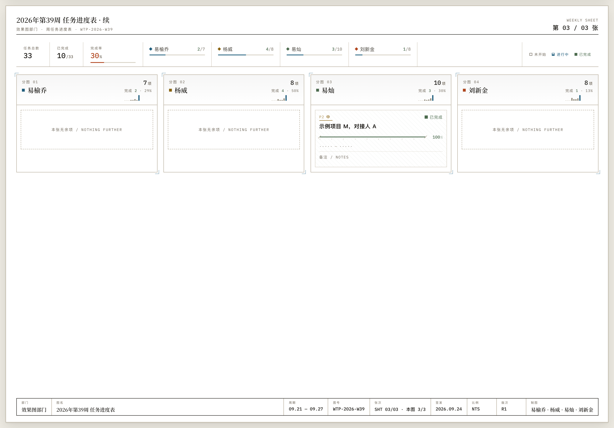 | **同一例的第三张纸 = 尾张**（`"paper": 2, "belowBar": true`，裁框 x30–1570 / y433–1508、高 1075 CSS px，出片 3080×2150 / 221,242 字节）：**这张纸上只剩一枚卡**（`示例项目 M，对接人 A`），可它仍是完整的一张纸 —— 页眉「第 03 / 03 张」、图签 `SHT 03/03 · 本图 3/3`、图名带「· 续」、四根列头都在、`--fc` 1.0000 一格未压。**为什么要添这一张**：决策 25 之前这一例只摊两张，「装不下的那张按卡切开，每一段都是完整的一张纸」（决策 12）这句话最极端的那一段（**只剩一枚卡的一张纸**）压根不存在；换了除数之后它出现了，而留档里一张都没拍到 —— 那一句在尾张上到底还成立不成立，此前只能靠推理。**三根空列各印「本张无余项 / NOTHING FURTHER」**（`.column-body.empty` 3 根，四根列身高 99 / 99 / 168 / 99）—— 那三个字**不在 DOM 文本里**，是 `index.html:270` 的 `::after` 生成的，所以 `shoot.py` 的 `need_re` 那道正则闸**照不到它**（`text_in_box` 走 `querySelectorAll('*')`、只收自带文本节点的元素，`shoot.py:568`），要证它只能读 computed style，判据 L6 就是这么来的；这张 job 的 `need` 只钉得住（卡 1 枚、列头 4 根），`need_re` 钉的是页眉「第 03 / 03 张」与图签「SHT 03/03 · 本图 3/3」两句。**尾张的代价是一整截空白**：成品图上最长一条纯白带数出来是 **563 CSS px**（1126 设备 px，图内 y 874–2000），同例前两张各是 **14 / 28**；这截空白在 DOM 里哪儿都不是一个元素（列只到列身那么高，「列下沿→图面下沿」读 544、「图面→图签」读 23、「图签→纸底」读 17，三段各是各的，合起来 584 也不是那 563；**DOM 侧 544 + 23 = 567 与像素那 563 差的那 4px 本轮没归因**，只当两把尺子的量具差），所以判据 L7 只能数像素，而且那把尺子必须自报「贴边吗」——带子要是从图的第一行或最后一行起算，量到的就是纸外那圈桌面底色而不是纸上的白，那句话就成了假话（`.preview/blank_band.py` 是另一把尺子、量的是 PDF 位图，两边读数不许互相引用）。**判据与变异**：`.preview/probe_r12_lastpage.py` 七条全绿（L1 逐张卡数**逐格等于** `[16, 16, 1]` 且与 facts 那一行同格、L2 尾张是完整的纸、L3 裁框内恰好 1 枚卡 + 4 根列头 + 框高 > 1000、L4 `--fc` 1.0000 且 `natH[3] == visH[3]`、L5「· 续」只在第 02、03 张、L6 三根空列的 `::after`、L7 那条白带 ≥ 400 而前两张 ≤ 60 且三条都不贴边），`.preview/mut_lastpage.py` 九颗变异全部被抓出、每颗红在指名下那条上（**第 2 颗把 `==` 放宽成 `>=` 时真量那趟是绿的，只有 `--selftest` 那一趟抓得住** —— 那四档合成读数单独存在就是为了这一颗）。**一笔外溢**：这条 job 一添进 `shoot.py`，`probe_r12_sign.py` 的 S2 当场红（几何说 10 张含图签栏那一格、像素只承认 9 张 —— 因为新图在 HEAD 基线里压根不存在），归因、修法与「豁免要走名单、不许靠缺图」记「测量陷阱」第 76 条；那张新图自己的日期格归 S7 那条豁免边界管 |

拍摄时统一注入 `transition:none;animation:none`（理由见上面「测量陷阱」第 1 条）。每轮的版面数字（张数、每页卡数、自然高、`fc`、`spill`、摘要原文、纸面/条底色、目录横表的行列与条数、**整册页眉逐张的读数**、**每卷小计整句**、**整册那枚 `第 N 周` 的逐枚文本与配色档**、**每张纸配完平之后实际占的高 `visH`**）随图落在 `docs/sheet-facts.json`，比逐张肉眼读图可靠；**二十三条记录**（第九轮那条尾巴 +1 行：`2026-09-23-sheet-longbadge-real.png`；**第十轮 +2 行：`…-sheet-broken-row.png` 与 `…-sheet-broken-real.png`**；**第十二轮就地追记：现读二十四条**，+1 行是 `2026-09-24-sheet-continuation-3.png`，HEAD 那 23 行一行没丢）里 `net` 全 0、`stressLeft` 全 0（压力任务不会漏进留档），其中 `heads` / `volsums` / `tenure` 三格**键各在 20 行上**（**这一格尾巴之前写的是「各有 17 条」，涨的那一条就是尾巴新添的那一行；第十轮再 +2 → 20**；**第十二轮再 +1 → 现读 21**（`matrix` 与 `minFit` / `spillPages` 那三格也同在 21 行上；`heads` / `tenure` / `minFit` 三者非空都是 21，`volsums` 非空仍是 6，`matrix` 非空仍是 16，`spillPages` 非零仍是 0 —— 全部现数）；缺的三行都是屏幕上那三张：对话框 / 拖拽 / 手机长版面，纸上没有页眉。要说清「17 / 18 / 20」数的是**带这个键的行**，不是「非空」的行 —— `heads` 与 `tenure` 两者相同，`volsums` 却只有 6 行非空，见下面那一格），`matrix` 16 条非空；`volsums` 那格 **6 条非空**（只有 persons 模式且多于一卷的册子才该有，单卷那一册带**空数组**，那正是它该有的样子）；`tenure` 那格按**整册**数（同一枚徽标会被同一册的多张留档重复计一次，**别把 147 这个和当全册唯一数**；**尾巴那一行给这个和 +18 → 它读 165；第十轮给这个和 +44 → 现读 209**（`+44` 的账要拆开写才不会像抄的：四张 fixture 留档各 `11 → 14`，四笔 `+3` 合 `+12`；新添的两行各带整册数 `14` 与 `18`，合 `+32`；`12 + 32 = 44` ✓，这一格只能现数）**；第十二轮给这个和 +6 → 现读 215**，而那 `+6` **只来自新添的那一行**：`2026-09-24-sheet-continuation-3.png` 自己那册 `n = 6`，与 HEAD 共有的 **23 行**逐行比 `tenure.n`，**一行都没动**（这一句是脚本现算的：`[k for k in HEAD if n_head != n_cur]` 为空集），所以这一轮的 `+6` 里没有一笔来自「同一册被多拍一张」—— 与上面那句「别把 147 当唯一数」相反的方向：本轮新添那一张正是**同一册的第三次拍摄**（`continuation-1` / `-2` / `-3` 三条 job 的 `stress` 都是 `[6,5,6,5]`、`cfg` 一字不差，只是 `paper` 分别取 0 / 1 / 2，现读三行的 `tenure.n` 各为 **6 / 6 / 6**，所以这一个和里那册已经计了 **18** 枚；`fit-strip` 是**另一个例**（`stress [3,2,3,2]`，`n = 5`），别把它算进那三次里），而这一格把「别拿它当唯一数」这句话变得比原先更硬**：`longbadge-real` 与 `weeks-suite` 是**同一册的两次拍摄**，那 18 枚一模一样地又被计了一遍；本轮 `broken-real` 是**那一册的第三次拍摄**，那 18 枚又原样记了一次 —— 同一个和里现在既有跨册的重复、也有同册的重复（那一册被拍三张、`n` 记三次，**209 里有 54 枚来自同一册**）），三条 `n=0` 分别来自占位页（那一册没有目录脚注，`note` 是空串）与第七轮那两颗 fixture —— 后两条顺带把脚注那句的**另一支**第一次留进读数：`未完成里没有一条排到第 2 周。`。**`visH` 那一格是第九轮新添的，20 条全有、值恒 1047**（**第十轮就地标注**：尾巴那一次是 18 条，本轮两张新图又 +2；131 个格子逐格查过，仍是 `1047` 一个值；**第十二轮就地标注**：现读 **21 条带 `visH` 键 / 138 个格子**，逐格再查仍是 `1047` 一个值 —— 多出的 7 格里有 3 格来自新添那张尾张（它自己那册三张纸 `[1047,1047,1047]`），另外 **4 格**是共有行里**张数长了的那四行各贡献一格**（`visH` 的长度就是 `pages`，逐行现数：`fit-strip` 1→2、`continuation-1` 2→3、`continuation-2` 2→3、`toc-range` 10→11，`1+1+1+1 = 4` ✓，其余 19 行一格没多），`131 → 138` 这一笔是**整表格子数**不是行数，别和上面那句「键在 21 行」混着读） —— 它是 `.sheet-page` **配完平之后**实际占的高，与本轮改了定义的 `natH`（**中和掉 `--fc` / 图面 `width` / 图签 `margin-top` / `flex` 四样外挂再量的自然高**）分家：`natH 1383` 与 `visH 1047` 同一行并存，正是「这张纸自然要多占 336px，但配完之后一格不多」这句话的数。**「恒 1047」要连着第 39 条一起读**：这一格是那条跨引擎减法的另一侧，所以它恒 1047 里有一半是构造；它**能证的**是「没有一张纸配完平还超出纸高」（真溢出时它会 >1047，仪表自检造的那张就是），**不能证的**是「两个引擎量到的自然高一致」。**这一格与 `natH` 的分工本身就是第 40 条的落点**。**「`stressLeft` 全 0」这一句本轮纠过一次口径**：这一格只由 `shoot.py` 的 dialog / drag / mobile 三条分支写（**恰好就是没有页眉的那三条**），出图那 20 条**压根没有这个键** —— 所以「全 0」是「写了的那三条都是 0」，不是「二十三条每条都核过有没有残留合成卡」（**第十轮就地标注**：那 20 条里有两条是本轮新添的。**第十二轮就地标注**：`stressLeft` 这个键到今天仍然只在 dialog / dragging / mobile 那 3 行上（现数 `sum('stressLeft' in r)` = 3，与第十轮那一遍一字未变 —— 本轮新添的尾张是出图那一类，压根不写这个键），而「出图那 20 条」这一格现在是 **21 条**）。与第 19 条那格 `volsums` 不承重是同一族：**报「某个量在全表上都成立」之前，先数有几行真的带这个字段**（拿 `r.get(k)` 的假值去冒充「测过并且是 0」，是这条规矩的反面）。**同一把尺子本轮量 facts 对 HEAD 的差，先数了几行真的带变化**：`git show HEAD:docs/sheet-facts.json` 与现版对比，20 行里 **17 行有差异**（缺的三行正是 dialog / dragging / mobile 那三张屏上图），**拆开是三类**：17 行全带的 `visH`（HEAD 那三行结构上压根没这个键）、**13 行只带 `tenure.note` 一处**（逐字段断言过 `others == ['note']`，而那 13 句里**没有一句含「配平」** —— 差别只是脚注末尾那句「数据截至 …」的时分秒 `06:49 → 13:07`）、**只有 4 行带真读数变化**（`fit-strip` / `continuation-1` / `continuation-2` / `toc-range`，动的是 `fc` / `minFit` / `natH` / `cards` / `summary`）。**规矩**：「facts 有 N 行变了」这句必须当场说清是**哪些字段**变的，否则一条时钟造成的 17 行会盖掉真正那 4 行（第 30、33 条同一族在 JSON 上的版本）。**（尾巴之后按同一把尺子重数：现版 21 行，HEAD 那 20 行一行没丢，共同的 20 行里仍是 17 行有差异，上面那三堆分组一字未变；但「13 行只带 `tenure.note` 一处」这句要补两笔 —— 那 13 行里有一行（`toc-range`）**同时**带着真读数变化，而「17 − 4 减出来的那 13 行」里另有一行（`nil-page`）连时钟都没有（占位页没有那句脚注）。两个 13 不是同一批，见「测量陷阱」第 50 条。）**第十轮按同一把尺子重数了一遍，这一遍的分组比上两轮都干净**（基线是 `git show HEAD:docs/sheet-facts.json` 那 21 行，现版 23 行，HEAD 那 21 行一行没丢）：共同的 21 行里 **17 行有差异、4 行逐字节相同**（相同那四行 = 屏上那三张 + `nil-page`，占位页既没有在册徽标、也没有带时钟的那句脚注，**它是全表唯一一张「结构上就不可能漂」的整页图**）。17 行拆两层：**4 行是整行换了一遍** —— fixture 那四张 `tenure-*`，`count` 5 → 6 之后 `pages` / `cards` / `fc` / `natH` / `visH` / `heads` / `matrix` / `summary` / `why` / `tenure` **十个字段全动**（本轮改 `shoot.py` 那四张 job 的窗口，动的就是这十格）；**13 行只动 `tenure` 一格**，而这一格再按子键拆是 **8 + 3 + 2**：**8 行 `texts` 与 `note` 同时动**（`note` 里去掉时钟之后仍多着本轮那半句「其中 k 项印的是「断后第 N 周」…」，逐行判过，不是时钟），**3 行只动 `texts`**（`fit-strip` / `continuation-1` / `continuation-2` —— 那三例压根没有目录页，`note` 是空串，它们动的是纸上徽标文本本身），**只有 2 行是纯时钟**（`single-vol` / `toc-zerodebt`，那两册 `tenure.n = 0`，一枚徽标都没有，能动的只剩句尾时间）。**这一遍把上一轮那条规矩落实成了它想要的形状**：上一轮那句「13 行只带 `tenure.note` 一处」在这轮如果照抄，就会把 **11 行真读数**说成时钟 —— 判据是「去掉 `数据截至 …` 那一段之后再比 `note`」，脚本现算，不回忆。

**版面读数是确定的，图不是逐字节确定的**——每一轮都要拿 `ImageChops.difference().getbbox()` 把改过的图与上一版逐张对一遍（这件事从本轮起由 `.preview/shots_diff.py` 接管，方法写在文件头：阈值 >128 记**强**（换了墨）、>0 记**弱**（抗锯齿抖了一下），差异按 6 设备像素一段报**行段**），差异要分得清类别、指得清来路：

1. `sheet-nil-page.png` 只差 **192px²**，位置在右下角：目录/纸面页脚那句**生成时间**（`22:15:41` → `23:00:57` → `23:17:25` → 本轮）。
2. `fit-strip` / `toc-volumes` / `volume-page` / `weeks-suite` 四张的差异带分别是**纸的右半条**（bbox 从 `x≈2053`、`x≈2266` 起）与**整页**：右半条那三张是**张次口径改口的像素证据**——上一版同一批纸印的是 `SHT 01/09 … SHT 08/09`（分母把目录页算进去了，分图却没给它让号，**装订位置上第 09 张从来不存在**），现在目录页占第 01 张、分图从 `SHT 02/09` 排到 `SHT 09/09`；目录那张（`toc-volumes`）的 bbox 从 `x≈212` 就开始，因为目录表的 `张次` 那一列整体 +1，右边那半条还是图签栏（见决策 13）。`fit-strip` 整页都在动则是另一件事：它的**配平值本身变了**（`0.7221` → `0.7213`），整张纸像素级平移——那是决策 12 里第 4 条顺带修复的后果。
3. 三张 WebKit 拼图整张重出（`nil-spill` 高度 1800 → 2270：被切开那一册从 1 格变 2 格），图注每格补了 `SHT n/N`。本轮为让拼图与仓库里那份 HTML 同源，又原样重出过一遍（读数一字未变）。
4. **本轮（横表）单独用 `.preview/matrix_diff.py` 量了它自己的像素足迹**，因为仓库里能比的上一版基线（HEAD）是**续排之前**的，直接跟它 diff 会把三件事混在一条差异带里说不清归谁。这个脚本同一个 URL 拍两遍（第二遍把 `.toc-matrix` 注成 `display:none`，注入必须放在**最后一次导航之后**，早注会不生效——脚本里那条 `offsetHeight 必须为 0` 的硬失败就是抓这个的），差异只剩：**八周册 148813 像素（2.25%）、两周册 125420（1.89%）**，差异带 `x 52–2972`、`y 776–1354` / `808–1386`（2 倍图）。**这两个数每次跑都会漂几十像素**（本轮三次：125502 / 125520 / 125420 与 148659 / 148715 / 148813）——差在说明文字末尾那句「数据截至 …」的时间戳上，所以它是「量级」不是「定值」，要写就得把漂量一起写。**索引表的底边两遍都是 365 / 381px**——上面那张表一格未动，这就是「另起一张表而不是给旧表加列」那句话的像素证据。差异带高 578 设备像素（= 289 CSS px），比横表自己那 191px 高出一截，多出来的不是噪声：脚本同时量了 `.toc-note` 的顶边，两遍是 `605 → 388`（八周）与 `621 → 404`（两周），**都是 217px**（横表自己 191px + 它那 `margin-top: 7mm` ≈ 26.5px，合 217.5 → 取整 217）——那段说明文字被横表整个往下推了一格，移动前后各画一遍，留下的正是这条带子的下半截。**同一批数在纸张上限那一轮之后又跑了两次**：`148702 / 125397`，以及最终代码那一次 `148913 / 125543`，都仍在漂的那几十像素里，`191px` 与 `217px` 两个读数一字未变。**卷内这一轮定稿后又跑了一次**：`148857 / 139320` —— 八周那册照旧在漂的那几十像素里（148913 → 148857），**两周那册却一次跳了 +13777**，这一跳不是噪声：脚注首行末尾多出那半句（142 字对 107 字），而横表把整段说明往下推了 217px，两遍之间这段说明里每一个有墨的像素都算差异，字多了墨自然就多。控制组就在同一轮里：目录页 `--nat=1047px / --fc=1.0000`、索引表底边 381 / 365、横表自身 191px、下推 217px 四个读数一字未动，脚注也仍是三行 76px；而 weeks 那册的脚注本来就不提「本卷」（同一道闸关着），它就没跳。**两册之间只差那道闸的开关**，这是本轮归因最干净的一条。

   **第八轮那一遍 `matrix_diff.py` 又跑了它一次，两处读数变了，原话照留**：八周册 191px / 索引表底边 365 / 下推 217 三项一字未动；两周册的**下推读成 218**（说明文字顶边 `686 → 468`），索引表底边也从这一句的 381 跳到 **445**。所以本条目上面那句「**都是 217px**」不再成立 —— 它是**两册各取一边**（合起来 191px + `margin-top: 7mm` ≈ 217.5，正压在取整分界上），我当初按其中一册写成了「都是」。**这两格都没归因**，而且第二格差得有点多：今天单独量过 `tr.toc-vol` 那一族，把两周册那 4 行卷小计摘掉（`display:none`）后 `.toc-index` 底边 491 → 411、`offsetHeight` 343 → 262，**4 行值 81px**（每行 21px），而八周册 `tr.toc-vol` 是 0 行、`.toc-index` 底边正好读到 411 —— 可见「卷小计把索引表撑高」是真的，但 381 + 81 = 462 ≠ 445，**还差 17px 没着落**（那张表是**一张纸一行**，跨这几轮行数本身被续排改过，要归因得先把两遍的行数对出来，本轮没对）。**规矩**：跨轮引一个「没动」的读数，要么当遍重跑、要么写清是哪一版的哪一遍；「大致对得上」不是归因，把 81 与 64 摆在一起才是。**另两处同批纠的**：`probe_r8_cost.py` 那句「四张各挂两条 `need`」其实只有三张（第 34 条已补，第四张改挂 `need_re`）、第 36 条那两个数的括号标注顺序写反了、回归「唯一非 0 的是第 11 步」实为第 10 步（`head_geom.py cmp`）。这四条全部由一次**独立复核**（子代理只读审计）抓到，再逐条自己重跑一遍确认 —— 复核报的第五件是「persons 那册」在同文档里指两版配置，已在文首与决策 21 各加限定。

5. **纸张上限那一轮（决策 15）没有新增一笔版面账**：它加的是「够不着的保险」，不是像素。三条证据：① `shoot.py` 全量重跑后 `docs/sheet-facts.json` 与上一版 **`cmp` 逐字节相同**（12 条记录、`net` / `stressLeft` 全 0），三张 WebKit 拼图重出后 26 页图签栏逐格 `ok`；② 那几句新文案（「续排后超出上限…」「已超上限…」「其中续排顶出…」）**在构造上进不了纸** —— `summaryText()` 只有两个落点（`#pv-set` 在 `#sheet-preview-bar` 里、`#sh-summary` 在 `#sheet-overlay` 里），而 `@media print` 那一行把这两个盒子连同 `#toolbar` 一起 `display:none !important`；③ 上限那条分支在日常五例里一次都没触发（`pdf_sheet.py` 仍 `9/9/9/1/2/5`，摘要与上一版逐字相同）。**这一轮补上了「图没变」那一眼**：开工前先把 `docs/screenshots/` 拷了一份当基线（`/tmp/shots-2026-09-22/`），对完最终代码再逐张 `cmp` + `ImageChops` 量回去 —— 二十一张里 **18 张逐字节相同**，剩下三张（`sheet-toc-volumes` / `sheet-task-matrix` / `sheet-toc-range`）各差 **2329 / 2347 / 2347 像素**（占全图 0.035% / 0.035% / 0.033%），差异带都是同一形状的一条：**22–23 行高、位于页脚**，裁出来看就是那句生成时间（`… 23:50:10，来源为云端 Gist 与本机缓存合并后的结果。`）换了几个数字 —— 第 1 类，不是版面。也就是说这一轮**没有任何一张纸的像素因为上限那条改动而改变**，这句话现在是量出来的，不是推出来的。**规矩照旧**：下一轮开工前先 `cp -R weekly-tracker/docs/screenshots /tmp/shots-<日期>`（`/tmp` 重启即失，别把它当存档），别用「读数没变」顶替「图没变」。

6. **对话框张数那一轮（决策 16）也没有新增一笔版面账**，而且这一轮连「够不着的保险」都不算——它改的是**屏上那一行**，纸面一个字都不该动。量的还是同一份基线（`/tmp/shots-2026-09-22/screenshots`，23:32 那份，也就是决策 15 报告里用的同一份），所以这一栏记的是**两轮叠加**对像素的影响，归因靠上一第 5 条已经拆过的那三个数。二十一张里 **10 张逐字节相同**（含 `sheet-dialog` 与 `sheet-fit-strip` —— 对话框那张图本轮没动，正是「日常那一册对话框说的数一字未变」的像素证据），11 张有差异，逐张按强弱（`ImageChops.difference` 取通道最大值，>128 记强、>0 记弱）与**行段**分开：① 八张 Chromium 出图各差 **15–38 个强像素**（弱 57–79），差异带全是 **8–13 像素高、10–12 像素宽的一小截**，落在右下角图签那句日期上（`6.09.22` → `6.09.23`，裁出来放大看过，就是那一位数字）；② 其中三张目录页图（`toc-volumes` / `task-matrix` / `toc-range`）多一条 **22–23 像素高、x 263–940 的横带**，强像素涨到 2460–2577 —— 那条带是纸上的「数据截至 2026-09-22 23:25:10，来源为云端 Gist 与本机缓存合并后的结果。」整句换了时间（本轮 00:02:30），上一第 5 条量的同一处当时是 2329 / 2347 / 2347，多出来的一两百像素就是午夜这一次翻牌；③ 三张 WebKit 拼图从「逐字节相同」变成 **强差 4 / 19 / 25**（弱 662–25886），差异带是 2–3 像素高、几乎通宽的细线（拼图格之间那条 hairline 与图注下划线）加图注里同一句「数据截至 …23:25:52 → …00:04:49」，裁出来逐字对过：`NTS`、`R1`、四人名单、`2026年第38周` 一字未变。三类都不是版面。**没有任何一处差异落在卡片、页眉、图签栏或横表的格子上** —— 这句话本轮同样是量出来的。`docs/sheet-facts.json` 十二条与上一版 `cmp` 逐字节相同。

7. **卷内张次那一轮（决策 17）第一次有了「图确实动了」的一笔账**，而且是**该动的动了、不该动的一张没动**。基线是开工前拷的 `/tmp/shots_r12`（21 张，即决策 16 报告里用的那一份的同一批图），量法是本轮刚落成的 `.preview/shots_diff.py`：二十二张里 **15 张逐字节相同**、**6 张有差异**、**新增 1 张**（就是上面那张页眉裁条）。六张差异按来路分开：① `sheet-volume-page`（一卷的内页，正是这张纸要印「本卷」）强 **3334** / 弱 1676，差异带**只有一条**：`x 2476–2970, y 119–149`（2 倍图，= 页眉右侧那 15px 高等宽字）—— 上下两半裁出来对过，上一版是 `第 07 / 09 张`，这一版是 `第 07 / 09 张 · 本卷 02 / 02`，**一行、没折行、没跟左边那块撞**；② `sheet-toc-volumes` 强 **5863** / 弱 7533，两条带：`y 1284–1301`（目录脚注多出那句「页眉的『本卷 k / m』数的是自己那一卷摊开的张数，与全册张次各说各的。」——那句话挤在脚注首行的尾巴上、**没有多出一行**（见第 17 条那次「量错过一次又改口」的记录），但首行后半截的每个字都平移了，所以留下的是一条横带而不是一个词）与 `y 1368–1385`（「数据截至 …00:02:15 → …00:59:36」）；③ `sheet-toc-range` 强 **14667** / 弱 16570，同一族（那张的说明文字通栏更宽，所以 bbox 从 `x 142` 起、带子也更长）；④ `sheet-task-matrix` 强 **302** / 弱 3817，**只有一条** `x 319–852, y 1332–1355` —— 就是那句时间戳（`00:02:30 → 00:59:54`），这一张跑的是 **weeks 模式**，页眉一个字都不该多，**它就是没多**；⑤ `webkit-suite-persons2` 强 **3794** / 弱 9384，四条带（`y 282–293` 在 `x 1947–3163`、`672–677` 在 `775–1029`、`1062–1067` 与 `1836–1847` 在 `895–3162`）—— 全在缩略图的**右半截**：那是各张纸页眉的 `第 04 / 09 张 · 本卷 01 / 02`（裁出来上下对过），也就是**系统 WebKit 真的把这一格画出来了**，不是只有 Chromium 那份；`775–1029` 那一小条落在目录那张缩略图上 —— 脚注首行末尾多了字、整行重排（**没有多出一行**），缩略图里跟着变的正是这一块；⑥ `webkit-suite-weeks8` 强 **6** / 弱 114，一小块 `x 166–187, y 688–695`（22×7 设备像素）—— 图注里那句「数据截至 …00:04:45 → …00:58:23」的一位数字，这一例也是 weeks 模式。**归因干净的证据**：两张 weeks 模式的图（④）里没有任何一条带子落在页眉，四张 persons 模式的图（①②③⑤）全都有。`docs/sheet-facts.json` 十三条与上一版**不再逐字节相同**（本轮故意往里加了 `heads`），加进去的那一格读数是上面那段九条页眉。

   同一轮的**页眉版面代价**是另一笔账，量具是 `.preview/head_geom.py`（五册 × 每张纸记 左块宽 / 右块宽 / 行高 / 纸的自然高 / `--fc`）：改之前 `save` 基线、改之后 `cmp`，结论 **0 格 FAIL**，唯一变化的那一列是 `右块宽 120 → 248`（页眉右侧那块自己变宽，它左边本来就有九百多像素空白，**挤的是留白不是内容**）；五册里任何一张纸的**行高、自然高、配平值一字未动**，weeks 那两册的页眉逐张读数与基线相同。这一条是「先量后改」的正面样本：页眉这种地方加字，风险不在出不了纸，在**把左边的图名挤到折行**——折一行了 `--nat` 就会动，`--nat` 一动配平就动，那就是第 5、6 两条里那种「读数没变但图变了」的反面。


8. **卷小计那一轮（决策 18）是第 7 条那种账的放大版：该动的动了，不该动的一张没动**。基线是开工前拷的 `/tmp/shots-r13`（22 张），量具仍是 `.preview/shots_diff.py`：**二十三张里 16 张逐字节相同、6 张有差异、新增 1 张**（就是上面那条目录裁条）。六张按来路分开：① `sheet-toc-volumes`（persons 两周册的目录页）强 **110,964**（1.676%）/ 弱 260,192，差异带 `x 52–2972, y 220–1516`；② `sheet-toc-range`（同一例灌 30 项）强 **102,867**（1.436%）/ 弱 268,778，带 `x 142–3062, y 314–1650` —— 这两张是**本轮要的东西**：目录页上从第一条小计起，下面每一行都往下挪 80 CSS px（160 设备像素），横表与三段说明文字跟着平移，所以整页下半截都是差异。**六段最粗的带子读不出「谁挪到哪」**：脚本只报强像素最多的六段（`top[:6]`），列出来的是 `y 1284–1301` 与 `1416–1433` 这类**说明文字的行**，两条相差 132 设备像素看着像「挪了 66px」，与量的 80px 对不上 —— 把两段各自上下留 30px 裁出来肉眼对过才看清：那是**旧图的第三行**与**新图的第二行**，同一行前后差 160 设备像素 = 80 CSS px，与 `probe_volbreak_cost.py` 报的「距纸顶」`353 → 433`（+80）一字不差 —— `vol_footprint.py` 那一路报的是版面坐标：索引表 `262 → 343`、表底边下移 81px。那 1px 是两把尺子各读各的（一个走 rect、一个走 offset），不是两个现象。**规矩**：行段是「哪里墨最多」，不是「哪里挪了多少」，要归因就得裁出来看；③ `sheet-task-matrix` 强 **258**（0.004%）/ 弱 541，一条 `83×18` 设备像素的小块（`x 299–382, y 1333–1351`）—— 就是纸面那句「数据截至 …」的一位数字，这一张跑的是 **weeks 模式**，一条小计都不该画，**它就是没画**（本轮的对照组，与第 7 条④同一形状）；④ `webkit-suite-persons2` 强 **7,817** / 弱 73,670，六条带全在**目录那一格缩略图**里（`x 79–1061, y 329–987`）—— 上下裁出来对过：上一版只有 `02…09` 八行，这一版多了四条 `VOL nn · 姓名 本卷 2 张 · 第 02–03 张 · 任务 2 项 · 欠 2 项`，连「欠 N 项」那截铁锈红都在，**系统 WebKit 真的把小计画出来了**；同一格图注自己也算了账：`第 01 张 1129 字` → `1431 字`（+302）。**这 302 字不等于四句小计的字面数**（纸面上那四句含空格 190 字、去掉空格 118 字 —— 前者在 `docs/sheet-facts.json` 的 `volsums` 里，后者是 `probe_volbreak_cost.py` 新加的 `volChars`），所以把两版那一页的 PDF 文字逐行 diff 了一遍（`pypdf.extract_text()`；旧版就是回归第 11 步留下的 `out/safari-paged/persons-2-p01 3.pdf`）。**先说清这里有几把尺子**：图注那两个数走的是 `safari_paged.py` 的口径（pypdf 提取再过一遍 `norm()`），现算正是 **1129 → 1431**，与图注一字不差；同一对文件不过 `norm()` 是 1131 → 1433；`pdf-render` 那个 Swift 工具数出来是 1137 → 1439 —— **三个数说的是同一页，差别只在各自怎么数空白**，别把它们当成三个现象。逐行 diff 的结论：**多出来的行只有四行**，就是那四句小计（75 / 74 / 74 / 75 字），整页另一处不同只剩脚注「数据截至 …」里的一位秒数。之所以四行读出 298 字，是提取器把行首那段 `<b>VOL nn · </b>` 重复了四遍（`VOL 01 · VOL 01 · VOL 01 · VOL 01 · 易榆乔 本卷 2 张 …`，纸面 41 字的一句被读成 74~75 字）。**规矩**：「一整页多少字」是整页的账，别拿它给某一行字定性，要归因就多打一遍逐行 diff；⑤ `webkit-suite-weeks8` 强 **76** / 弱 1,250，一小块 `x 159–341, y 687–696` —— 图注里那句时间戳的一位数字，weeks 模式，与第 7 条⑥同一处；⑥ `webkit-nil-spill` **强 0** / 弱 43,237（`x 1142–2133, y 402–1195`）—— **一格墨都没换**，四万余个弱像素全是拼图格之间那条 hairline 与抗锯齿，这一例是占位页与被切开的那一册，两者都没有目录页，**它该是 0，它就是 0**。`docs/sheet-facts.json` 十四行与上一版**不再逐字节相同**（本轮故意加了 `volsums` 那一格），非空的 5 条读数是上面那两句的四卷各一条。

   **这笔账要在整条回归之后量，而且要把漂移一起写**。上面这六个数是回归**之后**重量的：回归第 12 步 `safari_contact.py` 会把那三张 WebKit 拼图原样重出一遍，图注里那句「数据截至 …」跟着换时间，于是 ④ 从 弱 73,670 变 73,686、⑤ 从 强 73 / 弱 1,240 变 **76 / 1,250**，而 ①②③ 一字未动（`shoot.py` 不在回归里，那四张没人重拍）。**同一张图每跑一次量具就漂一点**这件事，写一个数不写漂移量等于给下一轮埋雷（第 4 条里那三笔「每次跑都漂几十像素」是同一族）。规矩：**留档 diff 排在回归之后**，或者在报数时写明它是回归的第几步之后的状态。

9. **第七轮（决策 19、20）没有新增一笔版面账，但它是第一次拿「代码没动」当命题去证的**。基线是开工前拷的 `/tmp/shots-r19-base`（23 张），量具仍是 `.preview/shots_diff.py`：**二十五张里 20 张逐字节相同、3 张有差异、新增 2 张、缺失 0 张**。新增那两张就是上面那两张 fixture 裁条，它们不进「同不同」的账（基线里没有）。三条差异各落在纸面那句「数据截至 …」那一行上：`sheet-toc-volumes` 的 bbox `x 299–381, y 1495–1513`（82×18）强 **156** / 弱 420，`sheet-task-matrix` 的 `x 299–852, y 1331–1354`（553×23）强 **2,750** / 弱 4,009，`sheet-toc-range` 的 `x 389–942, y 1627–1650`（553×23）强 **2,750** / 弱 4,009。**这三笔数字是收尾那一遍的，中间那一遍量出来是 770 / 1,584 / 1,584** —— 同一份代码、同一颗种子、隔十分钟，bbox 从 553×23 缩到 82×18、强像素差一个数量级，**变的只有「哪几位数字翻了」**。所以这一类差异能复现的只有「哪三张」和「差在哪一行」，**量级不可复现，别拿强弱像素数当回归基线**（第 4 条那一族又多一个样本；我一开始还把这三条写成了同一条带，照 `toc-range` 的坐标抄的，回去数坐标才发现同一类差异**不必**在同一位置）。反过来，本轮最值钱的读数是这一条：**四张 `band` 裁条（单卷、零欠项、卷小计、页眉）在两遍整跑之间逐字节相同，`docs/sheet-facts.json` 也逐字节相同** —— 裁条把「数据截至」那行裁在框外，于是它是这套留档里**唯一能逐字节比对的稳定基线**，整页那批永远做不到。**往后要留可比的基线，就留裁条那一族。****这一轮真正长出来的规矩是那条对照**：「图没动」不能只拿基线差值证，因为时间戳那一格每跑一遍就换，所以同一份代码、同一个 job 隔几分钟**重拍一次**当对照 —— 与全量那遍差 **902 强 / 3,680 弱**，基线 vs 这张重拍差 **251 强 / 3,649 弱**，三者同一条带、数量级随变了几位摆。**只有当「重拍自己」和「重拍对基线」落在同一条带、同一量级时，才可以说那三条差异是时钟**；不然我手里只有「差了 1,584 个像素」这一句话，它既能解释成时钟也能解释成版面动了。**这一步顺带推翻了我自己当时的一个读图结论**：把那条带从两张图里各裁一条叠起来看，我读成「图签 `审图` 那一格变成了 `审核`」，而 `_tbCells()` 那十格里（部门 / 图名 / 周期 / 图号 / 册 / 张次 / 签发 / 比例 / 版次 / 制图）**既没有「审图」也没有「审核」，`审` 字在 `index.html` 里出现 0 次**，密列剖面显示的是一条**整行平移**（38 个密列、1–17px 的游程）而不是两格换字 —— 十来像素的纸面小字，肉眼读出的是期望不是像素（「测量陷阱」第 33 条）。**这一轮的留档最后是被整跑覆盖过的**：中途那次对照重拍（`--only`）改写过一张已入库的图，收尾时没有拿 `/tmp` 快照去拼回去，而是**把 `shoot.py` 整跑了一遍**，让 25 张与 `sheet-facts.json` 出自同一遍、同一个时刻附近 —— 因为「这张是哪一遍的」这种账，靠 `/tmp` 里三份快照的 mtime 已经对不清了（本轮实测：`/tmp/shots-r19` 与 `/tmp/shots-r19-base` 那两张 `toc-range` 逐字节相同，而仓库里那张和两者都不同）。**规矩**：留档要么整跑、要么不跑；`--only` 是调试口子，用它出过要入库的图，就得再整跑一遍收尾（`--only` 不覆写 `sheet-facts.json`，所以半张新半张旧的读数最容易骗过下一轮）。

10. **第八轮（决策 21）第一次是「卡面」动了一格，所以这一笔账的归因比前几轮细一层**。基线是开工前拷的 `/tmp/r20-base/screenshots`（25 张，第七轮那份最终产物），量具仍是 `.preview/shots_diff.py`：**基线 25 / 当前 29，逐字节相同 11、有差异 14、新增 4、缺失 0**。十四张按来路分四堆：① **纸上真印了徽标**的五张 —— `fit-strip` 强 **79,114**（1.823%，`bbox 454,98–2746,1356` 整张纸）是**两件事叠在一起**：徽标本身 + 自然高 `1450 → 1455` 把配平从 `0.7213` 推到 `0.7189`，整张纸像素级缩放（与第 2 条那一格同一族），而 `volume-page` 强 **20,630** / `weeks-suite` 强 **28,913** / `continuation-1` 强 **1,542** / `continuation-2` 强 **15,102** 的差异带都落在**纸面中下部**（`y` 分别在 756–827、990–1451、1560–2009、930–1313，即列身里卡片行那一带），与 facts 里那几册各读到 10 / 18 / 6 / 6 枚徽标同向 —— **这一堆我只做到「与读数同向」，没逐张裁出来对字**（第 33 条那条「要归因就得裁出来看」本轮只在 ② 那三张上做过，因为那三张有整句脚注可以对）；② **目录脚注多了整句**的三张 —— `toc-volumes` 强 **3,580**、`task-matrix` 强 **5,997**、`toc-range` 强 **6,054**，三条的差异带全在说明文字那几行（`y 1452–1516` / `1290–1354` / `1586–1650`），`sheet-facts.json` 里能一字不差读出来：那句现在是 `未完成里 10 项已连续在册到第 2 周以上，最长的一项在纸上印着「第 5 周」。`（weeks 那册是 18 项），后面照旧跟着换时间戳；③ **看板那一侧**的两张 —— `mobile-board-long` **尺寸不同**（2696 → 2703，就是那 7px），`board-dragging` 强 **820** 而弱 **155,339**：强/弱 ≈ 1∶190，这是**整段往下挪了两像素**的形状，不是某个词换掉的形状（第 33 条那条「看形状」的规矩第一次用在归因上）；④ **三张 WebKit 拼图**（`nil-spill` 强 2,132 / `persons2` 9,256 / `weeks8` 9,872）由回归第 12 步重出，缩略图里那些卡多了徽标、图注里那句时间戳换了时间 —— 与第 7、8 两条同一族。**唯一「该动却没动」的一张**：`sheet-dialog` 强 **0** / 弱 4,021 —— 对话框那一轮（决策 16）之后它第二次交出「一个字都没换」的读数，本轮改的是卡面，**摘要那一行确实不该动**。**十一张逐字节相同里要分清两类**，别把它们都读成「没变」：四张是**上一轮那四道 `band` 裁条**（单卷 / 零欠项 / 卷小计 / 页眉）—— 第 33 条立的那条规矩**第二次成立**（裁条把「数据截至」那行裁在框外，所以它们是能逐字节比对的稳定基线），而本轮它们该不动（新徽标在卡上，不在这四条带子里），**它就是没动**；还有一张 `sheet-nil-page` 也是重拍的，占位页没有卡也没有脚注，强 0 是它的正确答案。**剩下六张本轮根本没重拍**：`paper-board` / `blueprint-board` / `blueprint-revision-table` / `mobile-390` 是 19:00 那批看板图（`shoot.py` 早就不出它们了），`print-sheet-a3` / `fit-spill` 是两张只当历史样式留着的。**所以「看板没变」这一句本轮说不出来** —— 看板那侧本轮明明动了（③ 那两张），只是那四张老看板图不在拍摄清单里，它们的相同是「没人碰它」不是「它没变」。`docs/sheet-facts.json` **16 → 20 行**，16 条共有读数里版面字段只动了第 35–36 条那两格（`fit-strip` 与 `mobile-board-long`），其余十四张的变化全部来自新添的 `tenure` 一格（`null` → 有数），**这条分界是本轮归因的主证据**：上一轮立的「裁条可比」规矩 + 本轮「只有两格版面读数动了」这两条加起来，才让 14 张差异不是一团模糊。**量具自己的两笔账**：`probe_r8_cost.py` 的绝对值漂移（第 36 条，同码两遍 `natH` 1453/1448 与 1455/1450，差值恒 +5）、`head_geom.py cmp` 本轮**单独重跑那次没跑成**（`Page.goto` 在 `wait_until="load"` 上 30s 超时，第一册第一条导航就没过去 —— 与 `probe_r8_cost.py` 本轮踩过的是同一格，改 `domcontentloaded` 就过；这条超时**没进 `regress_r14.sh`**，那一遍里它是正常跑完的，见「怎么验证」那条注）。

11. **第九轮（决策 22）是第一次「该动的只有被压的那几张，其余一张都不该动」，而留档正好把这句话量出来了**。基线是开工前拷的 `/tmp/shots_r9base/docs/screenshots`（29 张，第八轮那份最终产物。**路径要指到 `…/docs/screenshots`** —— 当时拷的是 `docs` 整层，指到 `/tmp/shots_r9base` 量具会报「基线 0 张 / 新增 29」，那个数一眼假，所以它没骗过我，只是白跑一遍）。量具仍是 `.preview/shots_diff.py`，**排在整条回归之后量的**（第 30 条那条规矩第三次执行：中途那一遍读的是 **22 同 / 7 差**，回归第 12 步 `safari_contact.py` 重出三张拼图之后才变成下面的数。**步号本轮纠一次：那一格是回归的最后一格，在 `regress_r9fs.sh` 里是第 21 步** —— 落稿时把「第 12 步」照抄了过来，而 12 号其实是 `matrix_diff.py`。抄来的来源是第 30 条那句「`regress_r14.sh` 第 12 步」，那一句在它自己的脚本里仍然是对的（r14 那份只有十二条 `run`，`safari_contact.py` 正好压尾），错的是拿**别人那一轮的步号**当本轮的：**同一族规矩，这一格只能现数**，见第 47 条与本节末段那条尾巴。尾巴这一遍（第 12 条）量的就是同一个装置，所以它引的步号是现数出来的 21。）。收尾这一遍：**基线 29 / 当前 29，逐字节相同 19、有差异 10、新增 0、缺失 0**。

   **先把 19 张「相同」拆成两类**（第八轮那条教训：别把「没人碰它」读成「没变」）。`shoot.py` 本轮的清单是 20 个 job，加三张 WebKit 拼图共 **23 张真的重拍过**，19 张相同里 **13 张属于这一批**，另外 6 张（`paper-board` / `blueprint-board` / `blueprint-revision-table` / `mobile-390` / `print-sheet-a3` / `sheet-fit-spill`）**压根不在拍摄清单里**，它们的相同是「没人碰」。13 张里最值钱的是三张 fixture 图（`tenure-ramp` 是**整页**、`tenure-strip`、`tenure-firstweek`）与四道 `band` 裁条（`single-vol` / `toc-volsum` / `toc-zerodebt` / `vol-header`，**连续第三轮逐字节相同**）—— facts 里那些册每张都读到 `fc=1.0000`，**没被压的纸本轮一个像素都不该动，它就是没动**，而且这一轮不止裁条没动，**整页级的 `tenure-ramp` 也没动**。另一格第八轮说不出口的话这轮说得出：**看板那侧真的没变** —— `board-dragging` 与 `mobile-board-long` 都在拍摄清单里、都逐字节相同（上一轮恰恰是它两张在动）。

   十张差异按来路分六堆：① **本轮要的东西**：`fit-strip` 强 **117,482**（2.707%，`bbox 32,41–3168,1356` 整张纸）—— facts 里它只有 `fc 0.7189 → 0.6639` 一格在动，`natH 1455`、卡数、张数一字未变，**动的就是缩放系数本身与它下面那圈不再跟着缩的字**，两件事叠在同一张纸上（与第 2 条那一族同一形状）；`continuation-1/2` 是同一册的两张，facts 读到 `cards [28,5] → [24,9]`、`natH [1474,1047] → [1318,1047]`、`fc [0.7096,1.0] → [0.7480,1.0]`（切口前移，第一张少 4 张卡），`continuation-2` 强 **52,223**（0.789%）bbox 整页 —— 把 `y 540–600` 那条带上下裁出来对过（第 33 条那把尺子）：**四列的 x 位置一格未动，动的是每列里第几张卡**，与切口前移同向。② **`continuation-1` 报的是「尺寸不同」（3200×2234 → 3200×2238）**：那 +2 设备像素（1 CSS px）落在**预览条自己那条高度**上 —— 裁顶部 115 设备像素上下叠看，条里的字一个像素没挪、条的下沿低了 2px，文字从 `配平 71%` 变成 `图面配平 75%` 却没换行。**这一格本轮没归因**，只把量级写清：它是亚像素取整那一档，别顺手写成「就是那句改口把条撑高了」。③ **`toc-range` 的两条带，一条是读数、一条是时钟**：`bbox (375,41)–(1227,1650)` 把两条不相干的带子装进了同一个框（`shots_diff` 只报最粗的六段，所以必须自己裁）。`y 42–53` 那条是**屏上预览条**（这张挂 `withBar`），整句从 `… 配平 68%` 变成 `… 图面配平 71%`，与 facts 里那册被压那张 `fc 0.6774 → 0.7054` 一字对得上（68 与 71 就是同一个数取整）—— **所以它不是时钟，是本轮的读数**；`y 1626–1649` 那条高 23 设备像素才是纸面那句「数据截至 …」。同一张的 facts 还读到 `cards [0,1,24,7,…] → [0,1,21,10,…]`、`natH 1544 → 1383`，可**这些变化一个像素都没进这张图** —— 这张拍的是目录页（`paper 0`，`fc=1.0000`），被压的是第 03 张。**「facts 动了」与「图动了」不是一回事，这一张是最干净的样本。**④ **两张纯时钟**：`toc-volumes` 强 **2,949**、`task-matrix` 强 **706**，bbox 都是 `x 285–852` 高 23；各裁一条上下对过，两句分别是 `数据截至 2026/9/23 06:48:53 → 13:07:41` 与 `06:49:16 → 13:08:05`，通栏其余一字未变。⑤ **第五道裁条本轮也差在时钟上，而它不在那四道 `band` 裁条里**：`tenure-note` 强 **2,671**（0.470%）bbox 高 23，裁出来看 `未完成里 11 项已连续在册到第 2 周以上…` 那一句上下两版逐字相同，动的是它下面那行 `数据截至 … 08:26:12 → 13:08:13`。**这条要收窄第 33 条末尾那句「往后要留可比的基线，就留裁条那一族」**：那道裁条框的是 `#print-stack .toc-note` **整块**（`sel` 型），时钟本来就印在这块里，所以它天生不稳定 —— 能当基线的是 **`band` 那一族**（带子按坐标切，能把时钟切在框外），`sel` 型框整块的裁条照样带着时钟。⑥ **两张 WebKit 拼图图注里那位秒数**：`persons2` 强 **64**、`weeks8` 强 **13**（bbox 都在 `x 154–341`、高 8~9 设备像素）。**这两个数与中途那一遍不同**（91 / 69）—— 收尾这次又重出了一遍拼图，于是又漂一次；正是第 4、9 两条那族「强弱像素数不可当回归基线」，能复现的只有**哪两张、差在哪一行**。

   **`webkit-nil-spill` 报「尺寸不同」（2270 → 2042，净 −228 设备像素；改图注之前那一遍是 2006，净 −264），这一条是本轮归因最费事也最值的一笔**，而且**先归错了一次**：一开始拿 `THUMB_W=500` 去算缩略图高度，只能凑出 130px 的一档、剩下对不上，正准备写「未归因」。改换一把尺子——**量图上的横线自己**（按 `--hair` 色 `#c9c3b4` 逐行扫通栏的 `.rule` 与每张缩略图的上下边框）：左列缩略图两版都在 `y 284–997`（714 设备像素 = 357 CSS px）**一字未动**，动的是**第二行的起点** `1332 → 1068`，**Δ = 264 设备像素 = 132 CSS px**。这正好是两种纸盒按列宽 515 CSS px（`(1106−60−16)/2`）缩放的高度差：`515×1046/1101 = 489.4` 对 `515×1047/1512 = 356.8`，**差 132.6**。也就是说**只有「被切开那一册的第一张」所在的那一行塌了** —— 第八轮那张纸的 WebKit 纸盒是被配平缩过的 1101×1046，第九轮起盒恒为 1512×1047；占位页和那张纸的**续页**本来就没被压，所以另两格不动（与 `sheetCssPx` 只记首张的口径一致）。**归因归到底的那一步**：塌行是 264，量到的净高却是 228，缺的 36 设备像素（18 CSS px = `.sub` 那行 12px/1.5 的一整行）来自**同一次改动里被改掉的图注文案** —— 原来那句「被切开那张按配平缩过，**纸盒就是缩后的自己**」在本轮已经成了假话（它旁边印的 `1512×1047` 正好是反证），本轮把它改成「图框不参与配平，纸盒恒为满幅那一个尺寸；缩的是盒里的图面」，多出来的字让头部那行**折了一次行**，`−264 + 36 = −228` 与量到的数对上。**规矩两条**：①「尺寸不同」这一类要先怀疑是不是自己刚写的句子把行折出来了，再去算版面的账；② **改了事实要回头改印它的那句话**（第 39 条「改了读数的算法必须回头改读它的算式」的镜像），而且这次顺手把判据钉进 `safari_contact.py`：任何一例 `sheetCssPx[0] != [1512, 1047]` 当场 `sys.exit`，收尾那一遍读到 `· 纸盒 1512×1047 全例一致 ✓`、26 页图签栏逐格 `ok`。**这条假话是看图看出来的**，不是 diff 数出来的 —— `shots_diff` 对它只说了一句「尺寸不同」（第 33 条那条「要归因就得裁出来看」本轮第一次用在**拼图自己那几行说明文字**上）。

   `docs/sheet-facts.json` 仍是 **20 行**、`net` 全 0，与 HEAD 逐字段对下来 **17 行有差异**：17 行全部只因为新添的 `visH` 一格（`null → 有数`），其中**只有 4 行带真读数变化**（`fit-strip` 的 `fc`；`continuation-1/2` 的 `cards`+`natH`+`fc`；`toc-range` 的 `cards`+`natH`+`fc`），其余 13 行的变化全在 `tenure.note` 那句「数据截至」里 —— 与上面第 ⑤ 条同一族。**本轮一张留档都没新增**（理由见本节开头那段：改的是缩放的分配，被压那一册的图上一轮已被判不能当观感证据），所以「新增 0 / 缺失 0」这一格是它该有的样子。**（尾巴那一遍之后这一格重数过一次，账没翻、只长了一格，而且顺手把上面那句数精确了一下）**：20 → **21 行**，HEAD 那 20 行**一行没丢**，共同的 20 行里仍是 **17 行有差异**，且**分组与上面那句逐字吻合** —— 只多一句时钟的 12 行（`toc-volumes` / `volume-page` / `weeks-suite` / `task-matrix` / `single-vol` / `tenure-firstweek` / `tenure-note` / `tenure-ramp` / `tenure-strip` / `toc-volsum` / `toc-zerodebt` / `vol-header`），带真读数的 4 行是 `continuation-1`、`continuation-2`、`fit-strip`、`toc-range`（后者还同时带动时钟），新添的是第 21 行、HEAD 里根本没有它。**要精确的那一下**：上面写「其余 13 行的变化全在 `tenure.note`」，17 − 4 = 13 这一步减法没错，但那 13 行里有 **1 行连时钟都没有** —— `nil-page` 那一行从 HEAD 到现在只多了 `visH` 一格，因为占位页没有「本册共几张、跨周几枚」那句脚注，时钟本来就印在那句里。**又一例第 47 条**：分组数出来是 12 + 1，写成一句「其余 13 行全在时钟上」就把那个「1」抹平了；往后这类「除 A 之外全在 B」的句子，落笔后要按组分一遍，别只按减法分。**还有一个更隐蔽的：这一格里出现了两个「13」，它们不是同一批行**。上面那句「其余 13 行的变化全在 `tenure.note`」是 **17 − 4 减出来的**（含 `nil-page`、不含 `toc-range`）；上面那段 facts 读法（本节倒数第二段）那句「13 行只带 `tenure.note`」数的是**真的动了 `tenure` 那一格的行**（含 `toc-range`、不含 `nil-page`）。两句都是 13，纯属这两批行的个数恰好相等，读起来就像在说同一批 —— 分开列一遍才发现差两行。**新规矩（第 50 条）**：同一个文档里同一个数出现两次，要么证明它们是同一批，要么各带一份名单。**另外两格要防的坑**：① 现数用的脚本留在 `/tmp/facts_head_diff.py`，跑法是从**仓库上一级**起，别在 `weekly-tracker/` 里拿仓库相对路径去 `open()` —— 本轮踩过：`git show HEAD:` 成功了、`open()` 却 `FileNotFoundError`，两边用的是同一个字符串；② `sheet-facts.json` 那些行**键叫 `job`，不叫 `name`**（`shoot.py` 里那 21 个 job 的 `"name"` 就是文件名），第一次拿 `"name"` 过滤会得到一份空表，空表看起来像「没有差异」，那是最坏的一种错。

12. **第九轮那条尾巴（task #23）只添一张图，而它顺手把「整跑一遍能不能复现」这件事复现了一次**。先按第 9 条那条规矩收的尾：这张图是用 `--only longbadge-real` 出的，而**用它出过要入库的图就得再整跑一遍**，所以下面这些数出自**一次全量 `shoot.py`**（`SHOOT_EXIT=0`，**21 个 job 全跑** —— 现数的：`grep -o '"name": "' .preview/shoot.py | wc -l` = 21（**别把 `grep -c '"name"'` 当同一件事**：那一读是 **32**，多出的 11 处是 `job["name"]` 这类代码引用，第 49 条(b) 同族的「问法问错了就查不出」）、拍摄日志里 `· ` 21 行；**尾巴那一支排在第 18 位**（`2026-09-23-sheet-longbadge-real.png`，紧跟 `tenure-note` 之后、`dialog` 之前）—— 落稿这一格原话写的是「尾巴那一支正是第 21 个」，**把总数当成了位次**：job 总数从 20 涨到 21 是真的，它自己在清单里却坐在中间，两个数差 3 位（复核的现成命令：`grep -n '"name": "' .preview/shoot.py` 出 21 行带行号，第 18 行是 `L376 …longbadge-real.png`）；新 job 那两道 `need` 各 ✓）。基线仍是 `/tmp/shots_r9base/docs/screenshots`（29 张，第八轮那份最终产物），量具仍是 `.preview/shots_diff.py`，**这笔账排在整条回归之后现量**（第 30 条第四次执行：16:59 与 17:02 先量过两遍，那两遍的「同名清单 + 十九个同字」与下面一字不差，但回归第 21 步 `safari_contact.py` 在 17:11 把三张 WebKit 拼图重出之后，其中两张的强弱数又换了一档 —— 所以那两遍本轮只当「同一次出图量两遍」的重复性用，别当图的复现）：**基线 29 / 当前 30，逐字节相同 19、有差异 10、新增 1、缺失 0** —— 与第 11 条那一遍**同一形状、同一批文件名**（十张差异一个没多一个没少），只有「新增」从 0 变 1，就是那张反白裁条（3080×1396 / 296,599 字节）。**十张里动的只有四张，而且四张全是时钟那一族**：`toc-volumes` 强 2,949 → **2,719**、`task-matrix` 706 → **2,897**、`toc-range` 1,017 → **3,208**、`tenure-note` 2,671 → **2,670**，四张的 bbox 与第 11 条记的**一字不差**（**四份 bbox 各不相同，别并成一句**：`toc-volumes` `285,1493–852,1516`、`task-matrix` `285,1331–848,1354`（右沿 848 不是 852，那张是 weeks 模式、通栏窄一格）、`tenure-note` `253,141–816,164`，而 `toc-range` 是 `375,41–1227,1650` —— 高 1609 而不是 23，因为它那**一个框装着两条不相干的带子**（顶上 `y 42–53` 是屏上预览条、底下 `y 1626–1649` 才是纸面那句时钟），第 11 条 ③ 已经拆过，本轮只是复述那个拆法。这也是「bbox 一字不差」与「bbox 是同一条带」两句话的分别：前者是复现，后者是归因），变的只是纸面那句「数据截至 …13:07 → …**17:00:53 – 17:01:24**」里翻了哪几位数字（四张各读各的秒，取自 facts 那四行 `tenure.note`）。**剩下六张里只有四张的强弱数一字未变**（`fit-strip` 117,482、`continuation-2` 52,223、两张「尺寸不同」的 `continuation-1` / `webkit-nil-spill` —— 后者也在回归第 21 步被重出过一遍，它报的仍是「尺寸不同」，2270 → 2042 那一格没再动）。**变的就是那两张没进拍摄清单的 WebKit 拼图：`persons2` 66 → 101、`weeks8` 78 → 70。** 这一格要连着四个数一起看才算说清：同一个 bbox（`154,741–341,749` 与 `154,687–340,696`，也就是图注里那位秒数那一行），今天下午对同一份基线出过四次图，读数依次是 **91 / 69**（第九轮中途那遍，第 11 条记着）→ **64 / 13**（第九轮收尾）→ **66 / 78**（尾巴这次整跑之后、回归之前）→ **101 / 70**（回归第 21 步重出之后）。**四次出图、四档数，一个数都没复现，复现的只有「哪两张、差在图注那一行」。** 这是第 4、9 两条那族「强弱像素数不可当回归基线」第一次攒到**四个样本**，比上一轮那句「与中途那一遍不同」硬：上一轮是两个样本，中间那两个（66 / 78）还是**同一次出图、相隔三分钟的两次测量**，所以它们相等只证明量具重复，不证明图可复现 —— 把这两件事分开的办法只有一个：**比文件字节，不比强弱数**（本轮那十九个「逐字节相同」走的就是前者）。顺带一句形状：三张 WebKit 拼图**全都在差异那一堆里**（一张「尺寸不同」、两张图注秒数），所以回归第 21 步重出的那三张**没有一张落在十九个同字里** —— 这条整跑之后现量的账，跟回归之前量的是同一批 27 张，那 19 + 8 一个字节没被回归碰过。**这里要说清哪一句是量到的、哪一句只是数相同**：`差异` 那十个文件名与第 11 条那一遍**一个不多一个不少**，所以 `相同` 那十九个也是同一批 —— 那十九张里有整页级的 `weeks-suite` / `volume-page` / `tenure-ramp`（不只是裁条），它们在 13:07 与 17:01 **两次整跑里各重拍一遍，两次都逐字节等于第八轮基线**，「可复现」这一句在这十九张上是量出来的；而 `fit-strip` / `continuation-2` 与基线本来就有差，本轮只做到「差多少」两遍一字不差（那是**差值相同**，不是**图相同**，中间那份没留副本可比）。**这就是第 9 条那条「往后要留可比的基线，就留不带时钟的那一族」第一次从裁条扩到整页图**：不是整页图天生不稳，是**纸面那一行「数据截至」**让它不稳，框里没有那一行的整页图照样稳。**`docs/sheet-facts.json` 20 → 21 行**，与整跑前那份快照（`/tmp/facts_before_r9tail.json`）逐字段比：**变化的行 13 条，全部只动在 `tenure` 一格**（`note` 末尾那句时间戳），`pages` / `fc` / `natH` / `visH` / `cards` / `heads` / `volsums` / `matrix` / `summary` / `net` / `spill` **一行都没动** —— 也就是说第九轮那份读数表在四个小时、一次全量重拍之后**逐格复现**，这一句本轮是量出来的（上一轮那句「重跑一次 facts 逐字节一致，本轮没有重验」因此补上了第二遍）。**新那一格要提前给下一轮排雷**：`2026-09-23-sheet-longbadge-real.png` 与 `2026-09-21-sheet-weeks-suite.png` 是**同一册的两次拍摄**（一张整页、一条裁条），所以它的 facts 行读数一字不差（`pages` 9、`fc` 全 1.0000、`cards` `[0,0,0,0,9,5,7,11,11]`、`heads` 九格张次、`natH`=`visH` 全 1047、`tenure.n` 18 / `long` 3 / `news` 21 / `revs` 5；**「一字不差」这句要按字段说才算数**：两行共 21 个同名字段，**18 个逐字节全同**，不同的只有 `job`、`why` 两格身份字段与 `tenure.note` 里那 21 秒（`17:01:05` 对 `17:01:26`，同一遍整跑里前后两次拍摄））—— **facts 的行数从此不等于册数**，拿行数当「测了几种排法」会多数一册。而 `long=3` 这一格正是第 8 轮那条「有数没图」里的那个「数」：它与这张图的「框内两枚反白」不矛盾（第三枚反白在第 09 张上，不在这条带子里），对账关系写在探针里，探针判的是**整册**、`need` 闸判的是**框内**。**最后一格是这一遍自己的账，而且它在本轮翻过一次面**：整跑之后我给新 job 那句**注释**改过一次口（`shoot.py` 第 372–373 行，「整张纸被压到 0.6639」→「图面被压到，而那枚徽标恰好长在图面里」），当时以为撞上了第 24 条（回归正在跑，而那两步 `import shoot`）。第一次「自证清白」拿了两条 mtime（`shoot.py` 17:08:37 vs `preview-anon.html` 17:08:54）就写下「改动落在整条回归开始之前 17 秒」——**那个锚点认错了**：`preview-anon.html` 那一格不是第 1 步写的，是第 8 步 `mut_tenure.py` 收尾那句 `finally`（先还原 `index.html`、mtime **17:08:53**，再重搭台面、**17:08:54**），也就是说**回归那一刻正在跑第 6–8 步，我确实改在了它跑动之中**。这一遍的账仍然干净，但要分清干净在哪一句：① 改动全在 `#` 行里（现在还在），语义零变化，任何时刻 `import shoot` 看到的都是同一份程序；② 真正常规读 `shoot.py` 的第 12、13 步在那之后才开始，看到的是改完的那份，它们的 `EXIT=0` 直接可信；③ **说不出来的是第 7、8 步里那些各自 `import shoot` 的子进程** —— 一半在改前、一半在改后，本轮没测出分界线，只能靠 ① 兜住。完整那段记在「测量陷阱」第 49 条，它记的不是这次侥幸，是**一条 mtime 只有在你同时知道"它是谁写的"时才是证据**（我第一次拿它给自己开的清白，比那条自责错得更值得记）。

**蓝图主题下纸面仍然是白的，这是设计不是 bug**：`#print-stack` 就地覆盖了一整套纸面令牌（打印机给不出深蓝底，屏上预览与出纸因此同一份观感）。实测：`theme=blueprint` 时预览条 `rgb(19,40,55)`、纸面 `rgb(255,255,255)`。**别去读 `body` 上的 `--paper-raised`**，它照样是 `#132837`，读了会以为图拍错了。

13. **第十轮第一次把「断后」这笔账算到系统 WebKit 头上**，而且是**两条互不相干的路各证一遍**：① 像素 —— 三张拼图（量具与上面同一把，基线同样是 `git archive HEAD` 那一份），这三张在回归**之前**与 HEAD 逐字节相同，回归第 12 步 `safari_contact.py` 把它们用改过的 `index.html` 原样重出一遍之后就变了 —— 变在哪三处，逐张裁出来上下对过（上 = HEAD、下 = 当前）；② **文本层** —— `.preview/probe_r10_webkit_text.py` 拿 pypdf 抽 `safari_paged.py` 那批 WebKit 真出的 PDF，直接找那串字。**② 是本轮 WebKit 侧最硬的一笔**：它不靠肉眼认像素，它报得出册名、页码、张次和上下文。
   - `webkit-suite-persons2` 强 **545** / 弱 **3,142**（20:34 那一遍读的是弱 3,126），bbox `(154, 727, 2610, 2545)`（上一遍是 `158`，左边那 4px 是拼图自己的边），最粗的两段是 `y 726–749`（强 167 + 105）与 `972–983`。裁出来看清了：**目录那一格缩略图里的脚注首行末尾多出那半句** ——「…最长的一项在纸上印着「第 5 周」**；其中 1 项印的是「断后第 N 周」—— 那几条断过一周以上，这一轮是重开之后数到的。**」，另一段是图注那句「数据截至 2026/9/23 17:11:03 → 19:32:03 → **21:2x**（收尾那一遍的时钟）**。**与 Chromium 侧对账**：这一册（按人成册两周）在 `sheet-facts.json` 里的 `tenure.note` 与 WebKit 画出来的那一句**一字不差**（`未完成里 10 项…其中 1 项…`）。
   - `webkit-suite-weeks8` 强 **393** / 弱 **3,196**（20:34 那一遍读 `327 / 3,046`，**同一份代码、同一把尺子，两遍差 66 个强像素** —— 动的还是那行时钟），同一处、同一族，只是那一册读的是 `18 项 / 最长第 5 周 / 其中 1 项` —— 与 `weeks-suite`、`task-matrix` 两条 facts 的 `tenure.n=18`、`long=3` 同册同数 ✓。**这三张里唯一两遍一字未动的是 `nil-spill` 那 12 个强像素**，因为它那两处都不是时钟（一枚徽标 + 图注字数），所以「本轮归因最干净的一笔」正是最稳的一笔。
   - `webkit-nil-spill` 强 **12** / 弱 203，bbox `(1287, 868, 2089, 1067)`，**两处都不是脚注**：① 被切开那一册第 01/02 张上**一枚徽标自己变宽** —— HEAD 那枚印「第 2 周」，当前那枚印「**断后**第 2 周」，6 倍放大上下对过，那枚红框整体变宽、宽出来的正是「断后」两个字的位置（这一格没有单独量宽度，缩略图里量不出 8.5px 的字，Chromium 侧那一刀量到的是 47.0px → 66.0px，见上面第 12 批 `broken-row` 那一行）；② 图注那一格的字数跟着算到 `1886 字 → 1888 字`，**+2 字正好是「断后」那两个字符** —— 一条链上两个互不相干的量具（逐像素差值、pypdf 提取字数）在同一处对上，这是本轮归因最干净的一笔。
   **② 文本层那一路（`.preview/probe_r10_webkit_text.py`，读的是 21:23 那批 PDF）**：扫 `out/safari-paged/` 里 31 份 PDF / 52 页（自动跳过 iCloud 冲突副本「xxx 2.pdf」），**徽标「断后第 N 周」命中 8 处、去重后 4 处**（同一页在「逐张那份」与「整册那份」里各出现一次），四处分别是：`weeks-8` 第 09 / 09 张、`persons-2` 第 09 / 09 张、`spill-persons` 第 05 / 05 张、`spill-33` 第 01 / 02 张；**脚注那句「其中 K 项印的是「断后第 N 周」」命中 4 处 = 两册 × 逐张/整册两份**（`weeks-8` 与 `persons-2` 的目录页）。每处上下文里都带着**同一行的「谁、哪条任务、第几周」**（未归一那版长这样：`制图 刘新⾦ … 示例项⽬ D 效果图修改 77 … 断后第 2 周 第4稿 … REV`）—— 也就是 WebKit 不只是画了字，它把这三件事排在了同一行里。第一处张次 `第 09 / 09 张` 与 Chromium 侧 `broken-real` 那张**同一页**（下标 8），两条路在此对上。**两条现学的规矩**：⑴ 去重键**必须含册名** —— 第一版只用「张次 + 尾串」，`weeks-8` 与 `persons-2` 同为第 09 / 09 张被并成一处、读成 3 处，是那条「至少四处且分属四册」的判据把它揪出来的；⑵ WebKit 那批 PDF 的文本层里部分汉字落成 **CJK 兼容字形**（上面那行里的「⽬」「⾦」是 U+2F9C / U+2F9E，不是 U+76EE / U+91D1），所以匹配前先过一次 NFKC，**别拿逐字节相等当判据**（第 26 条那一族）。**三颗变异各红 3 / 1 / 1 条**：`drop-badge`（丢掉徽标命中）红在「至少一枚」「同一页」「至少四处」三条上、`drop-footnote` 红在脚注那条、`wrong-paper`（把期望张次改成第 08 / 09 张）红在「同一页」那条 —— 三条判据都在把关，没有一条恒真。
   **为什么这一笔要单列**：第十轮的判据此前只有 Chromium 一侧的纸面证据，而「Safari 会不会把这两个字画出来」是这台机器上唯一还没被证过的引擎缺口（`:has()`、`@media print`、分页之外的那一半）。这一条与第 7 条⑤（页眉「本卷 k / m」）、第 8 条④（卷小计）同一族 —— **系统 WebKit 真的画出来了，不是只有 Chromium 那份**。**但它的证据边界要说清**：这三张来自 `--mode=contact` 的**缩略拼图**，不是 ⌘P 那条路，所以它证的是「WebKit 排版会带上这两个字」，证不了「Safari 打印面板怎么分页」（那一眼仍然欠着，见「还欠着的」第 1 条①）。**规矩**：报「N 张逐字节相同」必须写明它是回归第几步之后的状态（第 30 条），本轮同一份代码两个读数都对 —— `19 相同 / 11 差异`（回归前）与 `16 / 14`（回归后）。
14. **第十一轮（决策 24）一张留档都没新增，而它是第一次拿「带结构」而不是「强弱数」当「版面一格未动」的证据的**。基线是开工前拷的 `/tmp/shots-r11-base`（32 张 + 一份 facts）。**收尾时把那份基线整个重建了一遍**：`git -C weekly-tracker archive HEAD docs/screenshots | tar -x -C /tmp/shots-r11-base2 --strip-components=2`（从仓库上一级跑，现数 32 张），拿重建那份重跑同一把尺子，读数与 00:06 那一遍**逐字节相同**（`LINE=6 SAME=26`、`EXIT=0`）—— 于是「这笔账只活在 `/tmp` 那份拷贝里」这个隐患本轮排掉了（上面命令块里那条 `BASE=/tmp/shots-r11-base2 …` 就是它）。**这一批的外溢要说一句**：批次号从十二涨到十三这件事惊动了 README 末尾那一格（它在报「第几轮之后 / 分几批 / facts 几条」三个数），那一格因此改了 1 增 / 1 删，账记在「测量陷阱」第 68 条。**这一轮先把基线的来路验了再算账**（上面命令块里那条「基线必须是 HEAD 那一份（`git archive`）」此前只写在跑法里、没验过）：另导一份 `git archive HEAD docs/screenshots` 到 `/tmp/shots_head_r11` 与它 `diff -rq` → **32 张 PNG 一行差异都没有**，只多一句 `Only in /tmp/shots-r11-base: sheet-facts.json`（那份 facts 是拷基线时顺手带的，它另有对账，见下面第三段）。所以本轮这笔账不掺第十轮的。量具 `.preview/shots_diff.py` 排在**回归第 23 步 `safari_contact.py` 之后、`shoot.py` 整跑之后**量的（第 30 条那条规矩第五次执行；本轮 `grep -c '^run '` 现数 = **23 步**，`safari_contact.py` 正是最后一步）：**基线 32 / 当前 32，逐字节相同 26、有差异 6、新增 0、缺失 0**。**这一行之后又被同一晚的第三遍作废过一次**：01:02:09–10 重出三张拼图、且跨了午夜，于是拿再导一次的 `/tmp/shots-r11-base3`（现数 32 张）对同一把尺子，改读 **相同 25 / 有差异 7 / 新增 0 / 缺失 0，`LINE=4  MULTI=3  SAME=25`、`EXIT=1`**。
   **六张的强弱数本轮一个都不当证据**（`toc-volumes` 强 2,724 / `task-matrix` 156 / `toc-range` 229 / `webkit-persons2` 10 / `webkit-weeks8` 67 / `tenure-note` 918 —— 第 4、9、11 条那族：同一份代码每跑一遍就漂）。当证据的是本轮新写的 `.preview/shots_outband.py`：逐行扫差异、把有墨的行并成「带」，判**几条带、每条几行高**。读数是六张**各一条带**：Chromium 那四张高 **22~23 设备像素**（`y1493–1515` / `y1331–1352` / `y1627–1649` / `y141–163`），两张 WebKit 拼图高 **8~9 像素**（`y741–748` / `y687–695`，图注里那一位秒数），分类计数 **`LINE=6  SAME=26`**、`EXIT=0`。「一页纸上一行字的高」就是时钟的形状；版面挪一行会读成 `TALL`、两处不相干的改动会读成 `MULTI`。**第三遍回归之后同一把尺子改读 `LINE=4  MULTI=3  SAME=25`、`EXIT=1`，而 `MULTI` 那三条逐条摊开仍然全是时钟**：两张九格拼图各 4 条带 = 纸面那句「数据截至 …」1 条（墨 3,828 / 3,928，5× 裁图上读到 `09/23 21:23:35` → `09/24 01:01:50`）+ 图签栏「签发 2026.09.23」→「2026.09.24」按拼图三行并成 3 条（`y925–931` / `y1705–1711` / `y2483–2489`，墨 234~273）；三格那张 2 条带共 3 位日期（`NIL` / `1/2` / `2/2` 各一枚，墨 105~210）。**日期位的形状**：6 列宽 × 7 行高、非零字节 70~90、灰差 ≥128 的只有 5~12 个像素 —— 正好一位数字的量。**归因用的是本轮新添的 `.preview/shots_band_look.py`**（上面那把尺子只报「几条带、多高」，它把每条带按差异列切开、上下两块 3× 放大存图，并报段数与段宽），裁出的图在 `/tmp/r11_bands/`。**这一支量具自己挨六档变异**（`python3 .preview/shots_outband.py --selftest`：一模一样 → SAME、同一行换字 → LINE、**同一行之外另起一处 → MULTI**、整段挪位（80px 高的一条带）→ TALL、尺寸不同 → SIZES、把 `line_max` 收到 2 → LINE 那一档必须翻成 TALL —— 判据不承重就是假的），六档全过；它出生时挡下的那两次错（「包络之外逐字节比 = 0」那条**恒真式**、自证夹具里两枚墨完全重合读成一处）记「测量陷阱」第 64 条。
   **文本层那条独立的锚是这一轮最硬的一笔**：`docs/sheet-facts.json` 与基线 `cmp` 不同（两边**同长**，49,376 字节 / 36,627 字符），把里面 **16 处** `数据截至 2026/9/23 HH:MM:SS` 用正则换成同一个占位之后**与基线逐字节相同**，`json.loads` 之后 **23 行结构也相同** —— 也就是说**纸面文字本轮只变了那 16 处秒数，别的一个字符都没有**。这一条不靠像素、不靠强弱，而且它给上面那把尺子**提供了对家**：会变的字只可能落在那一句所在的行上，所以「六条带、每条一行高」不是自证，是被独立约束过的。肉眼那一遍照做（第 33 条）：六条带各裁上下两块叠成一张对比图（`/tmp/r11_diff_crops.png`），动的都是纸面那句 `数据截至 2026/9/23 …，来源为云端 Gist 与本机缓存合并后的结果。`（基线 20:32:xx → 本轮 23:48:xx），通栏其余一字未变；出处是 `index.html:2988` 那句 `new Date().toLocaleString('zh-CN', { hour12: false })` —— **它是墙上时钟，不是版面**。
   26 张「相同」照第 10 条那条教训拆两类：`shoot.py` 现数 **23 个 job**（`grep -o '"name": "' .preview/shoot.py | wc -l` = 23）+ 3 张 WebKit 拼图 = **26 张真的重拍过**，其中 **20 张逐字节等于基线**（19 张 Chromium + `webkit-nil-spill`；**这一格是第三遍回归之前的状态 —— 跨了午夜之后 `webkit-nil-spill` 也被重出、签发日期翻一位，于是变成 19 张 = 19 张 Chromium、拼图一张不剩**），另外 6 张（`paper-board` / `blueprint-board` / `blueprint-revision-table` / `mobile-390` / `print-sheet-a3` / `sheet-fit-spill`）**不在拍摄清单里**，它们的相同是「没人碰」不是「它没变」。**本轮一张都不该新增、一格都不该动**这句是有理由的：改的是 `fit()` 的 bail 分支与归还那两句（决策 24），而那条分支在 `@media print` 下不可达（`body` 是 `display: block`，:1114），出纸那 23 行读数一格不参与 ——**「本轮改的代码不参与出纸」这一句在留档这一侧就是量出来的**：`LINE=6 / SAME=26 / EXIT=0`（第三遍之后 `LINE=4 / MULTI=3 / SAME=25 / EXIT=1`，`MULTI` 三条逐条摊开仍是一位数字宽的日期位 —— **`EXIT` 从 0 变 1 不是版面坏了，是那把尺子「一条一行高 = 时钟」的形状判据对多格拼图不成立**，见第 69 条）。版面读数那一格照抄回归第 11 步 `audit_sheet_type.py`：`落纸 0.6724：23 类（图框 0 / 图面 23），最矮 1.423mm（4.03pt）= 图面 th@8 / 中位 1.690mm / 最高 2.846mm` ——与 `regress_r9tail`(17:11) / `regress_r9fs` / `regress_r10_close` / 本轮 **四遍一字未变**（「测量陷阱」第 63 条那次「差一位」的对账拿的正是这一行）。

15. **第十二轮（决策 25）新增那一张留档，添它的理由不是「有了新构件」，是「旧命题最极端的那次实例此前一张证据都没有」**。基线是开工前从 `git archive HEAD`（`1bd296e`，第十一轮之后）导出的 `/tmp/shots-r12-head`，现数 **32 张** —— **这一句的来路本轮补验了一遍**（第十一轮给上一轮的基线做过同一件事，规矩是「基线必须是 HEAD 那一份」不能只写在跑法里）：另导一份到 `/tmp/shots-r12-verify` 与它 `diff -rq`，输出 **0 行、退码 0**（`/tmp/r12_base_verify.txt`，两边各 32 张）。收尾那两把尺子的读数：`shots_diff.py` → **基线 32 / 当前 33：逐字节相同 18、有差异 14、新增 1、基线里有而现在没有 0**（`/tmp/r12_diff_final.txt`）；`shots_outband.py` → **`LINE=7  MULTI=7  SAME=18`、`EXIT=1`**（`/tmp/r12_outband_final.txt`；`EXIT=1` 本轮是**正当的** —— 决策 25 换的就是「什么时候换纸」那个除数，版面本来就该动，`MULTI` 那七条正是它）。
    **14 张有差异逐条归因**（每一张都验过「那一格区域内 ＋ 区域外 ＝ 全图不同字节」这笔加法，`probe_r12_sign.py` 第二遍；强弱数每跑一遍就漂，第 4、9、11 条那族，所以**当证据的是带结构与那笔加法，不是强弱本身**）：**只翻「签发」那一格 4 张**（`nil-page` 459 / `volume-page` 444 / `weeks-suite` 459 / `tenure-ramp` 459，全在设备 `y2040–2061`、一条 17px 带，框外 0 字节 —— 第 74 条那颗日粒度时钟，与本轮改动无关）；**两颗时钟一起翻 2 张**（`toc-volumes` 10,566+459=11,025 / `task-matrix` 11,100+459=11,559，多出来那条 23px 带是纸面那句「数据截至 …」）；**只翻「数据截至」1 张**（`tenure-note` 13,945 @ `y141–163` —— 它走 `sel`、框只框住脚注那一块，「签发」那格天生在框外，就是第 74 条 ② 改掉那句过头话之后剩下的那个形状）；**真版面 4 张**（`fit-strip` 2,663,039 / `continuation-1` 3,902,971 / `continuation-2` 2,763,136 / `toc-range` 95,906 分 16 条带）；**WebKit 3 张**（`suite-persons2` 3,725、`suite-weeks8` 3,824 各一条 8~9px 带 = 图注里那位秒数；`nil-spill` 1,327,372 分 4 条带 —— **这一格初稿写的是「= 三行『签发』日期 ＋ 纸面那句」，逐条看图之后作废**：那四条带里没有一条是「签发」，拼图左半那格 nil 占位页是**零差异**，四条带全在 `spill-33` 那两张纸身上，逐条读数见下面第 15 条 ③ 段）。
    **18 张相同照第 10 条那条教训拆两类**：`shoot.py` 现数 **24 个 job** ＋ 回归最后一步重出的 **3 张 WebKit 拼图** ＝ 今天动过 **27 张**，其中 **12 张逐字节等于基线**（9 条裁条 `broken-real` / `broken-row` / `longbadge-real` / `single-vol` / `tenure-firstweek` / `tenure-strip` / `toc-volsum` / `toc-zerodebt` / `vol-header`，加 `dialog` / `board-dragging` / `mobile-board-long`）—— 那九条不是运气，是第 74 条 ② 逐条数过「框停在图签栏上面」的那一批，本轮再数一遍仍然成立；另外 **6 张压根不在拍摄清单里**（`paper-board` / `blueprint-board` / `blueprint-revision-table` / `mobile-390` / `print-sheet-a3` / `sheet-fit-spill`），它们的相同是「没人碰」不是「它没变」。
    **① 上面那笔归因本轮补了一个独立对家：拿今天这份 build 原样再拍一遍**（`.preview/probe_r12_reshoot.py`，r12 那一族里第十一支探针，`ls .preview/probe_r12_*.py | wc -l` 现数 11）。动机是那一笔账的软处：「两条带 = 两颗时钟」这句话此前只用**形状**（一条一行高）与**位置**（正好那两格框）在证，而形状与位置都是同一把尺子读出来的 —— 缺一个不依赖它的对家。这一支把 `shoot.OUT_DIR` 指到 `/tmp/shots-r12-run2/shots`，挑十张 job 重拍，两趟之间**唯一的自变量是时间**。三条杠杠：G1 重拍前后各存一份留档目录（33 张）+ `docs/sheet-facts.json` 的 md5 清单，逐行比对**完全相同** ⇒ 产品文件一个字节没碰；G2 十张全部拍出且外框尺寸与留档那张相同（尺寸不同这一趟就不作数）；G3 把「两趟之间的带」与「基线 vs 今天的带」并排摊。读数：**十张里六张逐字节相同**（`fit-strip` / `continuation-1` / `continuation-2` / `nil-page` / `volume-page` / `tenure-ramp`），**四张动了，动的都只一条带、23 设备像素高、分类全是 `LINE`**（`toc-range` y1627–1649 墨 21,163 / `toc-volumes` y1493–1515 墨 19,134 / `task-matrix` y1331–1353 墨 21,163 / `tenure-note` y141–163 墨 20,090）。而**「签发」那 17px 带在两趟之间一条都没动** —— 两趟都在 09-24，日粒度那颗不动是必然。于是「两颗时钟周期不同」这件事在本轮之前是**推**出来的（一张图上有两条带、一条 17px 一条 23px，所以猜有两颗），这一轮起是**量**出来的：同一份代码重拍，23px 那条必翻、17px 那条不翻。**顺手再添两例强弱漂移**（第 4、9、11 条那一族）：`tenure-note` 同一条带基线 vs 今天读 13,945、两趟之间读 20,090；`toc-range` 那一条基线里 7,351、两趟之间 21,163 —— 带位置一字不差，墨数差一倍。**文本层同一趟也对了一遍**：重拍那趟的 facts（十行）与留档逐字段比，只有 `tenure` 一格动，`tenure` 内部只有 `note`，`note` 去掉那几个秒数之后十行全等；`pages` / `cards` / `fc` / `natH` / `visH` / `minFit` / `spill` / `heads` / `summary` / `volsums` / `matrix` / `why` 一字未变。**两件装置对账**：`probe_r12_clock.py` 用裁框几何算出「哪几张的框真盖得着那句『数据截至』」（五类 SEL 1 / NO_NOTE 5 / OFFPAPER 9 / BAND 3 / FULL 3 = 21 张，无重无漏），FULL ∪ SEL 恰好四张；DOM 里带着那句的有 16 张，而**像素两趟之间只动了 4 张，就是那四张**（`volume-page` / `tenure-ramp` 两张是 OFFPAPER：文本翻了、图里没那句话，所以像素不动）。K6 六条判据全绿、退码 0（`/tmp/r12_clock_pix.txt`）。**这一支还顺手照出 K6 自己一个 bug**：它原先拿 `/tmp/pdfs-before-r12c.txt` 那份快照作对家，取数域是整个 `docs/screenshots/`，而回归最后两步会重出三张 WebKit 拼图（名字里没有 `sheet-`），于是 K6 的消息构造器 `n.split("sheet-")[1]` 先崩 `IndexError` —— **判据连红都没红成，是量具自己躺的**。修法是取数域收窄到 `shoot.JOBS` 那 21 张 + 一个对最难看名字也成立的短标 + 对家可用 `--pix <目录>` 指走（本轮就是这么走的），账在**「测量陷阱」第 78 条**。**（第二遍及一处装置改动，就地追记，不改上面那四个数）**：上面那句「挑十张 job 重拍」与「G2 十张全部拍出」**当时对不上装置自己的名单** —— `DEFAULT` 里只有九项，第十张 `2026-09-23-sheet-tenure-note.png` 是第一遍量完拿 `--jobs` 临时添进那一趟的，临时目录 `/tmp/shots-r12-run2/shots` 里因此有十份文件（现数 `ls | wc -l` = 10），而唯一落盘的那份 stdout（`/tmp/r12_reshoot.txt`）末尾印的是「✓ **九张**重拍完成」、`G3` 那一栏也只列了九行 —— 也就是说 `tenure-note` 那条 23px 带当时是拿 `shots_outband.py` 单张对过之后**由我读进文档的，仪器没有记着它**。本轮把它补进 `DEFAULT`（`--list | wc -l` 现数 **10**，与它自己文件头那句「十张」一致）整跑第二遍：`/tmp/r12_reshoot2.txt`，**退码 0**、G1/G2 全过，上面那四个数**一字不改地复现** —— 十张里六张逐字节相同（同样那六个名字），动的还是那四张，每张仍只一条带、仍 **23 设备像素**、带位置与第一遍完全相同（`toc-range` y1627–1649 / `toc-volumes` y1493–1515 / `task-matrix` y1331–1353 / `tenure-note` y141–163），「签发」那 17px 带在两趟之间照旧一条没动。**第二遍顺手把「墨数只当量级」那条规矩钉得更实**：同一条带今天有了三个读数 —— `toc-range` 那条 7,351（基线 vs 今天）／21,163（第一遍同 build）／15,132（第二遍），`tenure-note` 13,945／20,090／14,547，`toc-volumes` 10,566／19,134／21,136，`task-matrix` 11,100／21,163／15,132，**位置三遍全同、墨数三遍全不同**。这一格为什么值得写满：如果只做第一遍，文档里那句「十张」是一句仪器不支持的话，下一轮任何人都无法重放出第十张 —— 账在**「测量陷阱」第 80 条**（与第 78 条互为反号：那边是取数域**宽过**它能命名的集合，这边是**窄过**）。
    **② `continuation-2` 的第四条带（y2134–2149，16px，墨 144,246）单独记，因为它和上面四张不是一个性质**。上面那三张 `MULTI` 里多出来的带都是「一行字」的量级（几百到一万字节），这一条是**整幅 3080 列、每一像素恰好 −1（第 2134–2143 行）/ −2（第 2144–2149 行）**的一层偏移，肉眼看是空白。逐行量：纸底那条深色边框在 HEAD 与本轮**都在第 2120–2121 行**（G 通道 170），它下面那层 206→224 的渐隐到第 2133 行之前两边逐像素相同，从 2134 起本轮整幅低一档 —— 也就是**纸没挪，纸下面那层渐隐挪了半档**。① 段那把对家给了它一个明确的归类：**同 build 两趟之间这一条不出现**（`continuation-2` 逐字节相同），所以它不是抖动，是 HEAD→本轮的真差异，归在「真版面」那一格成立。**但它的机制本轮没归因**：挂在哪个声明上没找出来，两个候选（随 `--fc` 一起缩的纸下阴影采样 / 纸下面那层背景元素的高度变了）没有分开，第十二轮不结，记进**「还欠着的」第 7 条 ①**（那里连「下一步怎么分」一起写了）。
    **③ `webkit-nil-spill` 那四条带逐条摊**（一次性量具 `/tmp/ns_bands.py`，外框两边都是 2212×2042；拼图是 `safari_contact.py` 的 `cols: 2` 两列三格：左上 nil 占位页、右上与左下是 `spill-33` 那两张纸）：**y432–976（545px，墨 855,247）= `spill-33` 第一页那张缩略图整张重画**，差异列 x1139–2135（右半那格）、四段各 247~248 设备像素宽（那是四根列的位置）；**y1049–1066（18px，墨 1,458）= 那一页图注里的字数**，看图读的是 **「1888 字」→「1474 字」**，39 设备像素宽、一段；**y1218–1761（544px，墨 445,999）= 第二页缩略图整张重画**，列 x77–1073（左半那格）；**y1831–1854（24px，墨 24,668）= 第二页图注「644 字」→「1034 字」** —— 那一位**多了一个数字**，整行往右挪一格，所以读成 24 段、跨 656 列，而不是只有一段。**加法照了**：全图非零像素 446,223 = 两格缩略图 285,558 + 151,951 + 两行图注 8,714，**nil 那一格（x77–1073、y432–976）逐字节 0**，四条带之外整图为 0。**为什么它归在「真版面」而不是「时钟」**：这一例的 `--fc` 从 0.7480 变成 0.9079（预算 1461.57 → 1153.57），两张纸上的卡重新切了一遍，所以缩略图整张重画、图注那个字数跟着变；**张数一张没变** —— WebKit 那侧现读 `webkitPages` 2 = `domPapers` 2、`blankPages` 0、`shtChain` ['SHT01/02','SHT02/02']、预算 1153.5748、`fc` [0.9079, 0.9086]。也就是说决策 25 落在 WebKit 这一侧的读数形态是「**同样的两张纸，里面的东西换了**」，而它此前被写成三行日期，是把它当 Chromium 那批的时钟看了。
    **新增那一张**是 `2026-09-24-sheet-continuation-3.png`（第 24 条 job）：决策 25 把续排预算的除数换成 `.8824` 之后，`continuation` 那一例从两张摊成三张、卡数 `[24,9]` → `[16,16,1]`，**尾巴上那张纸只剩一枚卡**，而决策 12 那句「每一段都是完整的一张纸」此前只在前两段上拍过 —— 最极端的一次实例没证据。先量（`.preview/probe_r12_lastpage.py`）再落：三张纸逐张卡数 `[16,16,1]` 与 facts 那行逐格相同、尾张页眉 `第 03 / 03 张` 与图签 `SHT 03/03 · 本图 3/3` 都在、裁框（`paper: 2` + `belowBar`，y433–1508 高 1075）内恰好 1 枚卡 4 根列头、`--fc` 1.0000、带「· 续」的是第 02/03 张 —— **L1–L5 五条全过之后才落的这一格**。落完看图又照出两句只写在 `why` 里没处证的话，装置长到 **7 条**：**L6** 证三根空列各印「本张无余项 / NOTHING FURTHER」（`::after` 生成的字，`need_re` 那道闸照不到，见第 77 条）、**L7** 数成品图上那条纯白带 **563 CSS px**（同例前两张各 14 / 28；DOM 那一侧「列下沿→图面下沿 544 ＋ 图面→图签 23」读 **567**，与像素那 563 差的 4px **本轮没归因**，只当两把尺子的量具差）。守门人 `.preview/mut_lastpage.py` 九颗全部被抓、每颗红在指名下、跑完台面与开头逐字节相同（第 2 颗特殊：**比较器放宽成 `>=` 在真量那一趟照不出来**，只有 `--selftest` 那档合成读数 `[8,8,1]` 抓得住 —— 所以这一支的自测不是装饰，是它那条判据的唯一证人）。
    **这一张的外溢记两笔**：① 它让 `probe_r12_sign.py` 的 `S2` 先红一次，装置因此学会说「这张基线里没有」并长出 `S7`，账在**「测量陷阱」第 76 条**；② 批次号从十三涨到十四这件事又惊动了 README 末尾那一格与本节开头那句口径（第 68 条那一族，两个数一起改口），facts 从 **23 行变 24 行**。
    **全表 `minFit` 这一格本轮现数了一遍**（`docs/sheet-facts.json` 与 `git show HEAD:docs/sheet-facts.json` 同一把尺子两遍）：带 `minFit` 那格的行为 **20 → 21**（多的那一行就是尾张），**最小三档从 `0.6639` / `0.7054` / `0.7480` 变成 `0.8907` / `0.9079` / `0.9079`**，最大仍是 `1.0000`，`spill` 非零两边都是 **0 行**。也就是说决策 25 那句「压到底也要读得清」落在留档这一侧的读数，就是这一串：全表最压的那一档抬了 **+0.2268**，而没有任何一张纸因此标上溢出。README 里那句「出图时字会跟着纸缩（配平 66%–100%）」按日常口径改口成 **88%–100%**，`.66` 那一档只剩「切无可切」的兜底（`verify_comfort.py` 例 I 现场造的那张 4000px 的墙），已就地标注。
    **④ 「facts 从 23 行变 24 行」这一句按本节开头那条规矩落到字段**（`docs/sheet-facts.json` 24 行 vs `git show HEAD:docs/sheet-facts.json` 23 行，按 `job` 键逐行逐字段比，再把字符串里那句 `数据截至 …HH:MM:SS` 换成占位跑第二遍）：**共有 23 行、HEAD 一行没丢、新行 1 行**（`2026-09-24-sheet-continuation-3.png`）。**逐字段完全相同的 4 行**：`board-dragging` / `mobile-board-long` / `sheet-dialog` / `sheet-nil-page`。**纯时钟造成的 15 行**：差异字段**只有 `tenure` 一格**，而 `tenure` 内部**只有 `note`**，`note` 去掉秒数之后 15 行逐字符全等（两边那 15 条 note 的总字数都是 **4,179**，一个字符没多）—— 也就是说那 15 行今天只翻了三组数字。**去秒数之后仍有差异的 4 行**：`fit-strip` / `continuation-1` / `continuation-2` 各 **9 格**（`pages` `cards` `natH` `visH` `fc` `minFit` `heads` `summary` `why`），`toc-range` **12 格**（那 9 格再加 `tenure` 与 `volsums` —— 它的张数从 10 涨到 11，脚注里那句「共 10 张」与四行卷小计跟着改口）。**其中 `why` 那一格不算读数**：它是我在 `shoot.py` 里给自己写的说明文字，本轮就地追记所以两边不同 —— 报「facts 有 19 行变了」如果不落到字段，就会把这 4 格说明文字和 15 行时钟一起当成版面。**四行的字段计数现读**：`cards` / `fc` / `heads` / `minFit` / `natH` / `pages` / `summary` / `visH` / `why` 各在 **4** 行上，`tenure` / `volsums` 各在 **1** 行上。


## 还欠着的

1. **引擎缺口这轮又补了一半，但最想要的那一眼还欠着**。WebKit（系统 WebKit，Safari 27 同一套）已经逐张出过纸并跟 Chromium 对完账（见「关键决策」第 11 条与那三张留档图），续排与任务分布横表之后五例三账全等（`9/9/9`、`9/9/9`、`1/1/1`、`2/2/2`、`5/5/5`，本轮对最终代码重跑过），`:has()` 在 WebKit 下也是绿的（五种排法各跑一遍：5/5、1/1、0/0、0/0、3/3）。**还差三样**（第三样是第九轮添的；**第十二轮之后是五样** —— ④⑤ 在本条末尾）：① **Safari 打印面板的分页**——这台机器零打印机，无头那条路是死的（「测量陷阱」第 18 条），只能由人真按一次 ⌘P → 「存储为 PDF」，五份产物丢进 `.preview/out/safari-manual/` 再跑 `safari_manual_intake.py`。**这一眼现在比上一轮更值**：`--mode=paged` 是「一张纸一次捕获」，它按构造就证明不了 Safari 会不会把九张纸分成九页、也不会把一张**超预算的纸**自己劈成两半（「超预算」那个数从第九轮起是数据页 **1461.57** / 目录与占位页 **1503.68**，原来那个全局 `1586` 已随 `_budgetFor()` 删掉 —— 这一格原文写的是旧数，照改口处理，不改史；**第十二轮起这两个数又是旧的**：`COMFORT_FLOOR` .8824 之下现读 **1153.57** / **1163.68**（同一把尺子、换了除数）。**这一格那五份 PDF 的账本轮一点没变**：真种子那三种排法逐张 `fc` 仍是 1.0000、张数一张没多（决策 25 要点 ①），变的只有**应力档** —— 同一批灌卡在 .8824 之下比在 .66 之下多切出五例续页，所以「纸自己会不会被 Safari 再劈一刀」这句话，往后若要按 ⌘P 验，值得按的是那些灌满的册子而不是今天这份板子）；续排上线后册子里多了「一张图两张纸」这种形态，正是需要人眼确认「纸面没被 Safari 再切一刀」的地方。② **iOS 真机**一次没跑过，手机上看板那条已经用 390×844 同源 iframe 量过，出图那条只有纸面尺寸推导，没有真机证据。③ **跨引擎「这张纸自然高多少」这一格从今天起没有仪器**：第九轮把 `natH` 改成中和之后的值（第 40 条）之后，`safari_paged.py` 那一列「WebKit − Chromium」两侧不再是同一个量，改成 `visH` 之后它接近恒等式；WebKit 那条通道目前只读得到 `offsetWidth/Height`，要恢复这条对账得先给那条通道加一套**中和手段**（把 `--fc` 摁回 1、清掉图签栏那圈负 margin 再量）—— 没有它，「同一张纸在两家引擎里长多高」这个问题在**被压过**的那张纸上无人能答。今天不觉得疼，因为真数据 110 张纸一张没被压（第 2 条），疼的是忙的那半条曲线。**（第十四轮就地追记：这一样只还了一半。** `safari_pdf.swift` 的探针从今天起对每张 `.sheet-paper` 走 `getComputedStyle` 读 `--fc` 与 `--nat`，`safari_paged.py` 存进 `out/safari-paged-facts.json` 的 `fc` / `natCss` 两栏，并与 Chromium `geom[].fc` 逐张相减（首读数见决策 27：27 张里 25 张 `+0.0000`，`spill-33` `+0.0043`/`+0.0054`，`spill-persons` 前两张 `+0.0024`）。**但 ③ 那句话问的不是「被压到几成」而是「不压的话自然多高」** —— 新读到的 WebKit `--nat` 恒为 1047（= 纸盒），与 Chromium 那个内容自然高（1128 / 1127 / 1061 / 1047）**不同名、不许相减**（第 78 条），所以「中和手段」那一半仍然欠着，且它现在多了一个更具体的形状：`fit()` 里那个 `--fc` 的**分母到底是谁**（Chromium 记的 `nat` / `budget` / `visual` 三个数现算都对不上 `fc`，见第 95 条）。①② 两样本轮未动。）

   **④（第十二轮添）字面级的证人还没有**：`fontgate` 数的是「登记了几面」，`document.fonts.status` 数的是「还在不在飞」，两样都**不回答**「纸上这一格画的到底是思源宋体还是替代字」。要正面量得走 CDP `CSS.getPlatformFontsForNode` 读节点实际用的字面（`probe_r12_settle.py` 的 S6/S7 已经把「飞没飞完」接住了，见测量陷阱第 72 条）。
   **⑤（第十二轮添）「⌘P 落在字还没落地那一窗里」是一格未证的暴露**：产品里「字落地之后再量一遍配平」只挂在 `preview()` 末尾那句异步 `fonts.ready.then(fit)`（`index.html` :3259–3263），`printNow()` 与 `beforeprint` 那两条路都没有自愈 —— 理论上用户在网络字落地前按下 ⌘P，纸就照替代字的度量配平。**没量过那一例**（要掐时间：加载后立刻按 ⌘P 与等两秒再按，比两版 PDF 的逐张 `--fc`），所以它记成「未证的暴露」而不是缺陷，也不许反过来写成「没有问题」。
2. **纸上印着「REV / 新增」这件事要用户拍板**（本轮数出来的，不是猜的）：线上那份九张纸的册子里，`7` 个光板 `REV` 徽标加 `21` 个 `新增` 虚线框一起印在纸上，而**这 69 条任务的历史记录全是空的**——本轮直接对云端那份 JSON 数过一遍，`history` 这个字段是**69 条全部缺席**（不是空数组），周范围只到 `2026-W21–W29`（`W30` 往后一条没有），按状态 `未开始 20 / 进行中 32 / 已完成 17`，按人 10 / 14 / 19 / 26 条。`delta` 是跨周实时比出来的（`_deltaMap` / `DELTA_FIELDS`，不落盘），本周内没编辑过就写「跨周变更，本周内暂无编辑」。屏幕上看这两个标记是「这条有故事」，晒到图上就成了「上周动过、这周又动过」，而修订表展开是空的。三条路：纸上整条不印（屏上保留）、只印 `新增` 不印裸 `REV`、或给 `REV` 补一个「跨周变化了什么」的最小摘要。**没定之前不动代码**，因为这条是观感判断不是缺陷。**（第八轮之后这一格的形状变了，但新添的那枚不在这笔债里，要说清楚）**：本轮纸上多了第三枚徽标 `第 N 周`，它**故意挑的是不依赖 `history` 的那一类判据** —— 它只数「同一个人、同一个任务名，连续几周各有一行」，那件事**全在行里**，纸上的每一个数都能在册子里一枚一枚数出来（`verify_tenure.py` 判的就是这个，包括脚注那两个数）。所以它**不会**复现「晒到图上说这条有故事、展开修订表却是空的」那个毛病；等拍板的仍然只是 `REV`（它比的是四个字段与上一周不同，展开却什么都没有）与 `新增` 那两枚。**代价是：从本轮起那三条出路每一条都得再多答一句「`REV` 到底怎么办」**，因为纸上现在是三枚并排，只印 `新增` 不印裸 `REV` 那一档比从前更像样子了，而第三枚的排版空间（`+2px` / 每张卡）已经花掉了。
3. **harness 的依赖没纳管**：`shoot.py` / `verify_sheet.py` / `pdf_sheet.py` / `audit_sheet_contrast.py` 要 `pip3 install --user playwright pypdf` + `python3 -m playwright install chromium`（约 120MB，装在 `~/Library/Caches/ms-playwright`）；WebKit 那条还要 CLT 的 `swiftc -O` 编两个工具（`safari-pdf` / `pdf-render`，SDK 27 那套冲突见内存里的硬件备忘）。本轮新添的两个量具都挂在老依赖上、没有新要求：`matrix_diff.py` 走 `import shoot` 复用同一套视口与无动效注入（所以它只多一条「8899 上要有服务器在跑」），`blank_band.py` 只调 `pdf-render` + PIL。**卷内那一轮又添两个，同样零新依赖**：`head_geom.py` 走同一套 playwright（它需要 8899 上的 `preview-anon.html`），`shots_diff.py` 只要 PIL + 一份上一轮拷走的 `docs/screenshots/`（`/tmp` 那份重启即失，所以它是「开工前记得拷」而不是「装点什么」）。**卷小计这一轮再添两个，还是零新依赖**：`vol_footprint.py` 与 `matrix_diff.py` 同一套装置（`import shoot` + playwright + PIL，四册各拍两遍），`probe_volbreak_cost.py` 是一次性探针（同样只要 playwright，留着是因为它量出的那个数被写进了决策 18，下次想复核不必重写），`probe_28.py` 是同一族的第二件（它把「测量陷阱」第 28 条从一段回忆变成一条命令就能重跑的读数）。**第七轮再添五件，还是零新依赖**：`make_fixture_seed.py`（只用 stdlib + 调 `build.py`）、`verify_volgate.py` 与 `probe_sparsity.py`、`probe_f3.py`（同一套 playwright，都要 8899 上起着服务）、`mut_volgate.py`（连 playwright 都不 import，它 `subprocess` 调 `verify_volgate.py`）。**第八轮再添三件，仍然零新依赖**：`verify_tenure.py`（同一套 playwright + 打码版与三颗 fixture）、`mut_tenure.py`（同样只 `subprocess` 调上一位）、`probe_r8_cost.py`（`import shoot` 复用同一套视口与无动效注入，跟 `matrix_diff.py` 一字不差）。**第九轮再添十二件，还是零新依赖**：八支「先量后改」的探针（`probe_r9_frame` / `fcsweep` / `dose` / `width` / `look` / `aged` / `ab` / `pair`）、一支判据（`verify_framescale.py`）、一支守门人（`mut_framescale.py`，只 `subprocess` 不调浏览器）、一支按键自检（`mut_ab_key.py`）、一支纸面字号审计（`audit_sheet_type.py`）—— 全部 import 只有 `playwright.sync_api` 与 stdlib，都要 8899 上起着服务、跑打码版 `preview-anon.html`（`probe_r9_ab.py` 例外：它还要一份 `git show HEAD:…` 导出的旧 HTML，那份是临时产物、别提交，而且 `HEAD` 一挪它就是另一份 —— 每一轮重跑前要重新导一遍，否则 A/B 比的是「两个上一轮」。）这一轮**唯一的新“依赖”是一份基线换了地方**：页眉基线从 `/tmp/head_base_r13.json`（重启即失）搬进 `.preview/baselines/head_r9.json`，因为「拿旧基线比新代码、每一格要能说出是哪一轮改的」这句话要有落点。另记一件：`.preview/probe_r9_pair.py` 从落稿这一遍起自己印 `fc*`（跟着名字逐行印），并在「缺格 / 归类反了」两种情况下退非零，外加一条**只印不退**的 mm 反算警示（第 45、46 条），所以它的读数从此是**装置印出来的**而不是文档里手算的。**第九轮那条尾巴再添一件，仍然零新依赖**：`probe_r9_longbadge.py`（import 只有 `playwright.sync_api` 与 stdlib，跑打码版主种子、要 8899 上起着服务）—— 它把「反白那一档落纸几毫米、比值多少、在哪张纸哪个位置」从文档里的手算变成装置印的，并且**替文档算 `band`**（`shoot.py` 那张新裁条的 `"band": 698` 就是它给的，含那 14px 的 clip 原点差，见第 48 条）。三颗 fixture 种子 `seed-1vol.json` / `seed-zerodebt.json` / `seed-tenure.json` 与它们的 preview 也落在 `.preview/`，**跟真种子一样不进仓库** —— 顺带说一句它们其实**不含**任何真名（人名只从 `C.MEMBERS` 那四个假名里取，本轮这颗连项目名都是 `TA`…`TE` 五个字母），所以将来若要纳管 harness，这三颗是零风险的起点，`seed.json` 与 `seed-anon.json` 之外没有第四颗要犹豫。`.preview/` 整个目录仍在仓库外，换机器要重建（本轮已经见过一次 iCloud 搬目录，而且工作树里现在躺着 `PROGRESS 2.md` … `PROGRESS 12.md`（十一份）+ `README 2.md` / `README 3.md` + `index 2.html` / `index 3.html` **十五份**冲突副本（**第九轮收尾照分解式重数：18 份** —— 多的正是 `README 4.md` 与 `index 4.html` / `index 5.html` 那三份，`PROGRESS` 那十一份反倒没再涨；那一串分解式本文另一格已改口，这里按「不悄悄改史」把 15 留在原地）（**本轮收尾 `git status --porcelain` 现数的：上一轮记的是七份，这一轮不是多一份、是翻倍** —— 「这一格只能现数不能照抄」这句第三次应验，而它给出的答案是「它涨得不讲道理，所以任何一轮抄来的数下一轮都必然是错的」），`.preview/` 里连 `verify_sheet 2.py` / `verify_sheet 3.py` 都被复制出来了——**那是 iCloud 的副本不是内容，别提交**）。要不要纳管，用户明确说这轮先改功能。
4. **团队配 Token**：另外三位同事各刷一次页面，然后各自在 ⚙ 设置里贴 Token 点「保存并同步」（每台浏览器单独配，Token 不共享）。本轮补一条实测：Token 只管**写**，读不需要凭据（见开头「云端那份数据的可读性」那行）——所以「同事打开页面看得到板子」并不等于「他那台的改动会上云」，没配的那台改了东西传不上去、只留在本机 localStorage（具体报三类失败文案里的哪一类，本轮没测）。
5. 未排期的候选方向（四条轨道里「出图模式」这两轮落地，剩下的）：
   - 负荷条只有任务数，没有工时维度；
   - 修订表按任务卡展开，还没有按周汇总的全局修订页；
   - ~~配平只到「提示续页」，没有真正的跨页续排~~ —— **2026-09-22 夜里落地**（决策 12、13）。留下的三个尾巴：① ~~`MAX_PAGES: 16` 压的是**请求周数**，续排发生在它之后，所以极端情况下实际纸张数能超过 16（日常板子碰不到：真实最满的一周 11 项，25 项才撞下限）~~ —— **2026-09-22 深夜落地**（决策 15）：切完纸按实际纸张复核，超了从最旧的周起丢整周重排，只剩一周则照出并明说超限，`.preview/cap_papers.py` 六例 66 条断言守着；② **目录页自己续排**那条分支在界面上不可达（最多 12 行，离 1586px 远），只能在 `_sliceGroups` 的性质检查上证，见「怎么验证」；③ ~~**对话框那行的「N 张」还是逻辑页数**，没算续排~~ —— **2026-09-23 凌晨落地**（决策 16：抽 `planPapers()` 给 `build()` 与 `updateSummary()` 共用，五册数值差值全 0、占位页那一册另判）。原文留着，因为它记的是当时的判断：`updateSummary()` 走的是 `plan()`，`plan.total` 要到 `build()` 里 `_paginate` 之后才被改写成物理纸张数。`.preview/summary_gap_probe.py` 灌上 33 条合成任务量了一遍（决策 15 第六例的同一套装置）：四周连排+目录说 **5** 张、真铺 **6** 张；八周那册 **9** 说 vs **10** 真；连两周带目录都是 **3** 说 vs **4** 真 —— 只要册子里有一张被切开就说少了，与周数无关。**日常板子说不到谎**（最满的一周 11 项，切不开），但这条和刚修的那两句同族：都是「摘要先替代码许了个愿」。两条候选修法都算过代价：(a) 让 `updateSummary()` 也走一遍 `_paginate` —— 最准，可是每拧一下旋钮就量一次整册（单册实测 `build()` 12–53ms，且那一下是同步的，落在 `change` 事件里会明显发滞）；(b) 把话术改成不承诺张数（「约 N 张」或干脆挪到出图之后再报）—— 便宜，代价是日常那几册本来报得准，从此也跟着变糊。**倾向 (a) 加一层缓存**（`cfg` 与上一遍相同就复用已知的切口），没做的原因是这轮的主账是上限，先记下不动代码；
   - ~~目录页只列到「张」，没有按人汇总的横表（谁在哪周有几项没完成）~~ —— **2026-09-22 深夜落地**（决策 14）：`任务分布 · Task Matrix`，4 人 × N 周 + 合计列 + 全组合计行。留一条口径尾巴要说清楚：那里的「未完成」= `status !== '已完成'`，板上三个状态（`未开始 / 进行中 / 已完成`，`C.STATUSES`）里前两个一律算欠着——横表回答「还欠几项」，不回答「动到哪一步了」，后者仍然是分图与修订表的活；
   - 墓碑连「谁删的」都不记，若要图纸级的签核链得先给墓碑加字段；
   - **`第 N 周` 这一轮落地之后新添的三条尾巴（第八轮，记在这儿防手滑）**：① **「断过链」在纸上读起来跟「连着第 2 周」一模一样** —— fixture 里 TB 那五周是「不印 → 第 2 周 →（断一周）→ `新增` → 第 2 周」，两枚「第 2 周」在纸上是同一句话，断过这件事只有点开卡片或看横表才知道。要分开得再添一枚记号，本轮**故意没动**：第三枚刚站稳，而多一枚的代价是每张卡再 `+0~2px`（行高律已经吃掉过一轮）。② 在册只回答「第几周」，**没有「这项累计动过几次」**：`REV n` 那个 `n` 是本周相对上一周的字段差，跨周不累计；负荷条与任务分布横表也还认不出「压在谁身上第几周」，那是同一枚徽标的另一半价值。③ **反白那一档（`>= 4`）只有一处纸面证据**：`tenure-strip` 那枚「第 5 周」（fixture、未缩放）；打码主种子那册 facts 里 `long=3` 有数没图，`fit-strip` 里那一枚反白的虽然印着，可整张纸被配平缩到 `--fc` 0.7189，纸面小字糊成一团。**下一轮若要动这枚徽标的配色，先补一张不打折的整尺寸证据**，别拿缩放图判观感（第 33 条同一族）；**（第九轮就地改一句**：`fit-strip` 那一格本轮读 `--fc` **0.6639** 不是 0.7189（`natH` 1455 未动，是切口前的图面系数变了），而且「整张纸被缩」这个说法从本轮起不成立 —— 缩的只有图面，页眉 / 统计条 / 图签那三格恒为满幅（决策 22）。这一格因此**更难**不是更容易：徽标在图面里，照样跟着缩，而它旁边的图框文字反倒变清楚了。task #23 那条「补一张 `fc=1.0000` 的整尺寸证据」的优先级没降。）** **（第九轮那条尾巴把这一格闭合了，2026-09-23 午后稍晚）**：`docs/screenshots/2026-09-23-sheet-longbadge-real.png` 拍的就是这一句里「有数没图」的那一册 —— 打码主种子、按周连排八周 + 目录、第 08 / 09 张（2026年第38周），九张纸 `--fc` 全 `1.0000`，框内**两枚反白并排两枚描边**，8.5px → 落纸 **2.249mm / 6.38pt**、比值 **5.65:1**，三个数由 `.preview/probe_r9_longbadge.py` 现算而不是从本文抄过去（见「版面留档」第 11 批）。于是反白那一档的纸面证据从一处变成四处（三处 fixture + 一处真数据），而**「只有 fixture 撑得起这一档」这句话从今天起不成立**。三条尾巴里这一条是补证据、不是改判据，所以产品代码一个字没动；**① 那条仍然开着**，而且它现在更值得做：反白站稳之后，纸上读得清「第 4 周」，却照样读不出「这条断过」—— 判据的可见性已经补齐，语义的可见性还没有。**（第十轮把 ① 闭合了，2026-09-23 傍晚，就地追记、不改上面那两段的说法）**：纸上从此分得开 —— 断过再重开的那条印「**断后第 N 周**」，一直连着的照旧印「第 N 周」，**同一枚、同一色、同一字号，只差前面两个字**（做法与九个候选的代价表见「关键决策」第 23 条）。纸面证据添两张：`broken-row`（fixture 第 05 / 07 张上面那条 386px，框内三枚同为描边、同 8.5px、同一档铁锈红，唯一区别就是前面那两个字 —— 判「分不分得开」时不许有别的东西来抢）与 `broken-real`（打码主种子八周那册第 09 / 09 张，同一行里易灿「第 3 周」与刘新金「断后第 2 周」并排）。**这一轮还顺手把「Safari 认不认这两个字」那一半补上了**：`webkit-nil-spill` 那 **12 个强像素**是系统 WebKit 画出来的「断后第 2 周」（逐条来路见「版面留档」第 13 条）—— 但那条通道是 `createPDF(rect:)` 一张纸一次，**不等于真 ⌘P**，所以本节第 1 条那笔账照旧开着。三条尾巴里现在只剩 **②（跨周不累计「这项动过几次」）没动**，而它比 ① 更像下一件事：① 改的是「同一枚徽标怎么说」，② 要新添一个数、还得先答「这个数给谁看」。
   - **图框不参与配平这一轮（决策 22）新添的三条尾巴，都记在这儿防手滑**：① **图框与图面的字号关系在四个对上翻了面**（`probe_r9_pair.py`，撞下限那一例 `fc = 0.6724`）：**分数 / 项数** 图框 2.78mm（旧 1.87）vs 图面 2.67、阈值 **0.7000**；**人名** 图框统计条那枚 3.17mm（旧 2.13）vs 图面列头那枚 2.85、阈值 **0.7500** —— 这一对最刺：**同一个人名在一张纸上以两个字号各印一次，且从此上面那枚比下面那枚大**（第八轮是反过来的）；**图签小标 → 卡内日期** 1.98 vs 1.78、阈值 **0.7500**（与人名同值）；**图签格值 → 卡内项目名** 3.31 vs 2.40、阈值 **0.9259**，也就是**四对里最早翻的那一个：`fc` 一掉到 0.93 以下纸上第一处层级就换边**。第五对页眉张次 → 列头「分图 nn」是 **1.6667 > 1，恒不翻面**。**「今天看不见」是量出来的不是推的**（第 2 条那 110 张纸 `fc` 全 1.0000、被压 0 张），所以它是观感备忘不是缺陷 —— 但它给了一条硬约束：**往后别顺手给图框加字号**。阈值就是 `图框字号 ÷ 图面字号`，分子抬一下，那四个数全体往上走，翻面就从「只有 stress 排法看得见」走进「有一点点挤就看得见」—— 而且它已经不算远了：**新代码那支剂量表的第二档（每人灌 1 项、一册 4 张卡）就读 `fc 0.9097`，已经在 0.9259 之下**。真要动它，得先回答「同一个人名的两处谁该大」，那是设计决定不是 bug；② **反白那一档（`>= 4` 周）要不要带进负荷柱与任务分布横表** —— `probe_r9_aged.py` 量过：`currentWeek` 往前 8 周 × 4 人 = 32 格里有账的 20 格，`>= 4` 只命中 **4 格 4 项**（其中还欠着的 3 格 3 项），另有 15 格有卡但在柱窗口之外。**信号极稀**，本轮不动它；如果以后要动，先想清楚「四格里三项本来就欠着」这件事是不是够理由，而不是「反正代码顺手」；③ **被压那两档的图面最矮是 1.422mm（4.03pt，`th@8`「版次」）**，比第八轮同一格的纸面最小字还小一档 —— 这是「图面独自吃下整份缩放」的**必然结果**（决策 22 明说这是一次再分配，不是免费），所以若哪天有人抱怨忙册读不清，**先看清要动的是图面字号阶梯还是那个 0.66 下限**，别拿「图框变清楚了」当成整页都变清楚了（`audit_sheet_type.py` 那三档分账就是为这一格准备的：落纸 1.0000 一档 59 类里图框 19 / 图面 40）。
   - ~~**卷内张次这一轮落地之后新冒出来的一条，记在这儿防手滑**：`fit()` 在够不着真 DOM 时会 bail-out 成 `return { worst: 1, spill: 0, skipped: true }`，而 `this.minFit` / `this.spillPages` 留着上一册的读数~~ —— **2026-09-23 深夜落地（决策 24）**：bail 分支里当场把那两格清成 `null` / `0`，摘要两句假话随之闭嘴；而**量的时候多出来第二笔**（当时没预见到）：那句 `classList.remove('sheet-preview')` 是无条件的，走 bail 时会把**应用自己的**预览层一并摘走（整屏空白、纸还在 DOM 里量不到矩形），修法是先问 `had` 再决定还不还。判据 `.preview/verify_fitbail.py` 二十二条 + `.preview/mut_fitbail.py` 七颗变异，两条都记进「测量陷阱」第 58、59 条。**原文留着**，因为它记着当时的判断是对的（「下一次往『不看纸面却要报配平』的方向加东西，这条会立刻从不可达变成假话」）—— 那件事今天仍然没做，而它现在踩不到那两格了。
   - 卷内那个数目前**只按人成卷**：按周连排模式没有「卷」这个概念（`plan.volumes` 是空表，页眉因此不印），如果以后要按项目、按对接人分册，`_paginate` 末尾那段聚合得先参数化，不能像现在这样硬按 `p.sheet.person` 分组。
   - **脚注那条判据（决策 17 的 ⑤）只钉住了一半**：「有多卷 → 必须解释」是断言住的，反方向「单卷 + 有目录 → 不许解释」**构造不出来** —— `withToc` 要 `sheets.length > 1`，而单卷意味着只有一人有活，`stress` 又只灌最后一周，所以那一例压根没有目录页（实测 `count=1/2/3` 三种都是 total=2、无「目录 ·」那张）。要补它得先有一颗「同一个人连续两周各有活、其他三人那两周全空」的种子，**这是数据的账不是代码的账**，别为了断言去动产品里那道闸。**决策 18 的小计撞在同一块空白上**（同一道闸、同一个位置），所以那条「不许有小计」的判据同样只有半边。**（第七轮，2026-09-23 上午：这一条与下面那条都关闭了 —— 判断「缺的是种子不是代码」是对的，错的是「造不出来」。`.preview/make_fixture_seed.py` 造的那颗单卷 fixture 就是这里说的「同一个人连续两周各有活、其他三人那两周全空」，`verify_volgate.py` 头六条判的就是它（先证明它**有**目录页：`withToc` 真、`volumes` 长度 1、纸 3 张；再咬三处闸全关：小计 0 条 / 页眉无「本卷」/ 脚注不解释；反向钉住图签 `VOL 01` 必须还在、索引表张次仍从 `02` 起），纸面证据是 `2026-09-23-sheet-single-vol.png`。四个变异里把 `> 1` 写成 `>= 1` 那一处只在这一册上 FAIL —— 日常四卷的册子对写反的闸照样「对」，这就是为什么这张图非拍不可。原文照留，因为「别为了断言去动产品里那道闸」这句今天仍然算数。）**
   - **卷小计那句里的 `欠 0 项`（草绿 `<i class="ok">`）本轮没有纸面证据**：有 `volsums` 的那 5 条读数其实只覆盖**两册**（按人成册两周那册的四张留档共用同一份 + 灌 30 项那册的一张），两册里**没有一卷是零欠项**（ persons-2 那册四卷欠 2 / 1 / 7 / 5，灌 30 项那册欠 22 / 1 / 7 / 5），所以那一档配色只在横表的 `0 / 3` 格上被像素证过，纸上的小计行从来没绿过。断言是有的（`verify_sheet.py` 判「欠 N 项」的 N 与下面几行之和相等，N=0 也在同一句正则里），**缺的是观感**。为什么造不出来，这一轮顺手算清了：留档那两册里**「一个人 × 一个周」欠 0 是有的**（横表里杨威 W39 那一格就是 `0 / 3`，它已经绿了），但小计算的是**一整卷** = 一个人 × 册子里**所有**周，杨威在这两册里各成一卷、两卷都写 `任务 6 项 · 欠 1 项`，照样报红。所以要一张印着草绿 `欠 0 项` 的小计，得让某个人在 `W38` 与 `W39` **两周里把他名下每一项都做完** —— 打码种子里没有这种人（四卷实测欠 2 / 1 / 7 / 5）。这条与「蓝图主题下的占位页拍不出来」是同一类：不是缺陷，是**留档没覆盖到的那一格**，改配色之前得先造得出那张纸。**（第七轮，2026-09-23 上午：那张纸造出来了 —— 同一支 `make_fixture_seed.py` 的第二颗 fixture 就是「某个人在册子里每一周都把名下项目做完」，`sheet-facts.json` 里那句 `VOL 02 · 杨威 本卷 2 张 · 第 04–05 张 · 任务 3 项 · 欠 0 项` 是它的第一条读数，纸面证据 `2026-09-23-sheet-toc-zerodebt.png`：同一张纸上 `VOL 01 … 欠 3 项` 仍是铁锈红，两档并排才看得出配色分得开。断言不写死 hex，判的是「计算色等于这一作用域解出来的 `--sage` 且不等于 `--rust`」，见第 20 条。上面那段「为什么造不出来」的算账（小计算的是**一整卷** = 一个人 × 所有周，而「一个人 × 一个周」欠 0 早就有）留着，因为它就是那颗 fixture 的配方。）**

6. **第十二轮新添的一笔：全篇的「开页装置」绝大多数没接那道字体闸**（这一格只能现数，`grep` 数于 2026-09-24 夜，**去掉 iCloud 冲突副本**之后）：`.preview/*.py` 里**开页的脚本 54 支**，`require_fonts` 只出现在 **6 支**里 —— `preflight_fonts.py`（闸自己）、`shoot.py`（进仓库的那 23 颗 job）、`verify_comfort.py`（本轮那 461 条）、`probe_r12_door.py`、`probe_r12_settle.py`、`probe_r12_tocrows.py`。剩下 **48 支**分三档，疼的程度不一样：
   - **16 支在回归里跑**（`ab_print_path` / `audit_sheet_contrast` / `audit_sheet_type` / `cap_papers` / `head_geom` / `matrix_diff` / `mut_ab_key` / `pdf_sheet` / `probe_r9_ab` / `safari_contact` / `summary_gap_probe` / `verify_fitbail` / `verify_framescale` / `verify_sheet` / `verify_tenure` / `vol_footprint`）—— 它们被第 3 步那道闸**间接**罩着，可那罩的是「这一晚这台机器的远程样式表到没到」，**不罩「这一步自己开的那一页」**；而且**单独调用时谁都罩不到它们**（本轮就有过一次：`verify_comfort` 单跑绿、整跑红）。要不要每支各接一道，成本是每支开页多等几百毫秒，收益是「单独跑也报得出来」——**没定**。
   - **32 支是一次性探针与真站冒烟**，闸一道没接。绝大多数只往 `/tmp` 写（`shots_r12_ladder.py` 那张叠图就是），不进仓库，风险在「读数被抄进文档」那几支身上。
   - **读数已经进了仓库文档、而量它的时候没有闸**的那几支才是这笔账的正主：`probe_r9_longbadge.py`（「版面留档」第 11 批那三个数：8.5px → **2.249mm / 6.38pt**、比值 **5.65:1**，以及 `shoot.py` 里那个 `band`）与所有给 `shoot.JOBS` 供 `paper` / `band` / `need` 的探针（`probe_r10_look.py` 一族，`shoot.py` :350–351 明写「三个数全部来自探针」）。**要分清楚**：`mm / pt / 比值` 三格来自 CSS 声明与 `MM = 0.2646` 的换算，**不随字体动**；随字体动的是 `band`（裁切位置）与「哪几张纸 `fc = 1.0000`」—— 而 `band` 错了就是**框不住那枚徽标**，那正是这一格的全部用途。**下一轮开工第一件事**：给这两支接上 `require_fonts` 复量一遍，与文档逐位相同就不改，不同就照改口处理（第 68 条：文档里那句「已记」本身也是读数）。
   - **（第十二轮收尾那一遍重数，就地追记、不改上面三个数）**同一族 `grep`（去掉 iCloud 冲突副本后 `ls *.py`，命中 `new_page` 的 **58** 支、命中 `sync_playwright` 的也是 **58** 支 —— 这个数在两种判法上不动，所以「开页」这一格不是被正则的宽窄推出来的）现数 **58 支**开页脚本，名字里出现 `require_fonts` 的落在 **8 个文件**：`fontgate.py` 是闸自己（函数定义在那儿 :72），所以**直接调用**的是 **7 支** —— `preflight_fonts.py`、`shoot.py`、`verify_comfort.py`、`probe_r12_clock.py`、`probe_r12_door.py`、`probe_r12_settle.py`、`probe_r12_tocrows.py`。**这一遍比上一遍多读出一格结构**：`probe_r12_lastpage.py` 与 `probe_r12_sign.py` 各 `import fontgate` 却**不自己调用**，它们开页走的是 `probe_r12_clock.open_job`，那道闸在里面（`:121` STRESS 路 / `:131` URL 路）—— 所以「接没接闸」这个问题从今天起不能只 `grep require_fonts` 一支一支问，**得连着它借谁的 `open_job` 那一路一起问**（上一遍那 54 / 6 里，这一族三支的 mtime 排在最后：06:31 `lastpage`、06:39 `clock` 与 `sign` —— **mtime 只说最后落笔、不说出生**，所以本文只报「这一遍多了一支借闸的结构」，不报「那 4 支是几时生的」）。上面那句「`shoot.py` 进仓库的那 23 颗 job」跟着改口成 **24 颗**（尾张那张）。**仍然欠着的没动**：`probe_r9_longbadge.py` 与 `probe_r10_look.py` 那一族到今天还没接上 `require_fonts`（现数 `grep` 两支都不含它），所以本条末句那句「下一轮开工第一件事」里的「下一轮」从今天起是**第十三轮**，而这笔债在第十二轮里一格没还。
   - **（第十三轮就地追记，同一判法、同一正则往下推，上面那几个数一个不动）**那笔债本轮还了它点名的那两支：`probe_r9_longbadge.py` 与 `probe_r10_look.py` 现在各走 `fontgate.arm_or_gate(pg, label, arm)` 两臂（到场臂过 `require_fonts`、断连臂 `route.abort()` 掉那两个域并当场印「这一臂的读数不许抄」），头行各带 `臂 live FACES=305` / `臂 dead FACES=2`，断连臂的结论句从「能直接抄进 `shoot.py` 的候选」改口成「**不许抄进 `shoot.py`**，只用来与到场臂对差」。现数同一判法（`ls .preview/*.py` 去冲突副本、命中 `new_page`）：**开页 62 支**（上一遍 58，多的 4 支全是本轮新探针）、`require_fonts` / `arm_or_gate` 落在 **9 支**（上一遍 7，多的正是这两支）、**20 支借别人的 `open_job` 过闸**、**33 支没过** —— 33 支再数一遍是有档次的：**11 支在回归名单里**（被整条第 3 步那道 `gate` 罩在进程外，罩的是「这一晚这台机器」不是「它自己开的那一页」）、**1 支走 WebKit**（`safari_contact`，本闸只管 Chromium；`safari_paged` 不 `new_page`，压根不在 62 里）、**3 支开线上页**（`live_smoke_sheet` / `live_smoke_tenure` / `live_pdf_pages`，字由真浏览器自己取，本地闸无从插手）、**2 支是本轮那两臂探针**（`probe_r13_where1px` / `probe_r13_board2px`，各自断言 live ≥ 下限且 dead < 下限，等于一道自带双向的闸）、其余 **16 支是历史一次性量具**。**「要不要每支各接一道」这件事仍然没定**，本条从「绝大多数没接」推进到「33 支里 11 支有罩、4 支不适用、2 支自带证人、16 支是旧账」。守门人是新写的 `.preview/mut_fontwire.py`：五颗变异 + 三档对照全部按指名的方式红/绿，跑完 `fontgate.py` 与 `probe_r10_look.py` 与开头逐字节相同（详见决策 26 末段）。
   - **（第十三轮复量到的那一格，本条末句那句「随字体动的是 `band`」从今天起有刻度了）**到场臂五格候选裁条 `386 / 297 / 386 / 542 / 542`，断连臂 `385 / 296 / 385 / 541 / 541` —— **每格恰短 1 CSS px**，而框内枚数、`need` 名单、逐张 `fc = 1.0000`、纸面张次、以及**每一枚徽标自己的高宽与 x 区间两臂一字不差**。那 1px 不在徽标身上：两臂 DOM 按文档序配对（`probe_r13_where1px.py`）数到 25 个元素的**高**各 −1.00（页眉 `.sheet-head` / `.sh-title`、四格 `.ph-left` 与 `.person-name`、图签 `.tb` 全家），而容器 `.sheet-board` 反过来 +2.00，其子树 85 个元素里 **Δbot > 0 的只有 board 自己**（`grow=1`）—— 是 flex 把上面几行各省下的 1px 吞进了容器。**所以「`band` 错了就是框不住那枚徽标」这句要加一个限定**：错的是**替代字那一臂的 `band`**，它的余量只有 1 CSS px，抄进 `shoot.py` 就会把每格裁条整体上抬 1px —— 而本轮已经确认，这个「抄」现在在装置层面被印在结论句里拦着，不再只靠人记得。
   - **（第十四轮就地追记：上面那几格一个数字不动，但其中「借道 20」那一格从今天起换了名字）**同一判法再数一遍（`ls .preview/*.py` 去掉 iCloud 冲突副本 → **98 支**，自身含 `new_page(` → **62 支**，文件里出现 `require_fonts` / `arm_or_gate` → **11 个**，其中 `fontgate.py` 是闸自己、`mut_fontwire.py` 是守门人（只在字符串里引用那两个名字，不开页），所以**开页而接闸的仍是 9 支** —— 这三个数与第十三轮一字不差；本轮新写的 `mut_fcgate.py` 现数 `grep -c new_page` = **0**，也不开页，所以「装置名单一格没动」这句本轮成立）。**复现不出来的是第三档**：那句「另有 **20** 支借别人的 `open_job` 过闸」——按**机制**数（自身源码里真出现 `open_job(` 调用、且自身无闸）只有 **4 支**：`probe_r12_lastpage` / `probe_r12_sign` / `probe_r13_shadowband` / `probe_r13_whitegap`；按**语法**数（自身开页 ＋ `import shoot` 或 `import probe_r12_clock` ＋ 自身无闸）恰好 **20 支**。**20 这个数只有后一条数法给得出来，而闸不在它命名的那件事上**：那 20 支里 **16 支自己 `new_page`、一道闸也不接**（它们 import 的是 `shoot` 里的装配与盒子工具，不是那条已过闸的 `open_job`）。于是「没过闸」的真数从今天起是 **49 = 62 − 9 − 4**，上一遍那个 33 = 62 − 9 − 20 少减了 16 支。**49 的档次分解**（减法与加法各走一遍，走到同一个数：62 − 9 − 4 = 49；16 + 3 + 2 + 28 = 49）：**16 支在回归名单里**、被第 3 步那道 `gate` 罩在进程外（= 上一遍那 11 支 ＋ `matrix_diff` / `verify_fitbail` / `verify_tenure` / `vol_footprint` / `safari_contact` 五支 —— 它们一直藏在那 20 支里，所以那道进程外的罩本轮第一次算到它们头上）、**3 支开线上页**（`live_pdf_pages` / `live_smoke_sheet` / `live_smoke_tenure`，字由真浏览器自己取，本地闸无从插手）、**2 支自带双臂证人**（`probe_r13_where1px` / `probe_r13_board2px`：走 `block_fonts` ＋ `font_faces`，regex 照不到 `require_fonts` 是因为它们**用不着**到场闸 —— 要的是一边 ≥ 下限、一边 < 下限）、**28 支历史一次性量具**。**两档重合必须说清**：`safari_contact` 既在那 16 支里、又是上一遍单列的那一档「走 WebKit 的 1 支」，所以本遍不再单列它（11 + 1 + 3 + 2 + 16 = 33 里它是独立一格，今天并进那 16 支了 —— 第 86 条那一族：同一个名字可以落两档，报分解时要说清按哪一条判）。**「要不要每支各接一道」这件事仍然没定，只是它的对象从 33 变成 49**。那一档为什么被算错、以及「名字要落在机制上而不是语法上」这条规矩，写在「测量陷阱」第 **99** 条。

7. **第十二轮留下的两格「量到了但没归因」，下一轮开工要先问的就是这两格**。① **`continuation-2` 纸底那条整幅 ±1 的带**（y2134–2149，16 设备像素，墨 144,246；见「版面留档」第 15 条 ② 段）：已经排除抖动（同 build 两趟之间不出现），已经定位到「纸底边框第 2120–2121 行两边同处、它下面那层 206→224 的渐隐从 2134 起整幅低一档」，**但挂在哪个声明上没找出来**，两个候选（随 `--fc` 一起缩的纸下阴影采样 / 纸下面那层背景元素高度变了）没分开。**下一步怎么分**：拿 `probe_r12_reshoot.py` 那一套装置，把同一例在 `--fc` = 1.0000 与 0.9079 两档下各出一张同框裁图（`stress` 调小到不触发续排、再用 `?fc=` 或 fixture 摁住配平），看那条带跟不跟 `--fc` 走 —— 跟就是阴影，不跟就是那层背景。**为什么值得做**：它是这套留档里目前唯一一条「真差异但说不出是谁」的带，而留档这一侧的规矩是每条带都要有名字。② **尾张那 4px**（成品像素 563 vs DOM 反算 567，见第 77 条末与第 15 条那格）：负 margin 那条候选已被现数排除（这一张 `gap` 恰等于 CSS 钉死的 `6mm`，净贡献 0），剩下的候选是两把尺子的取样差（`white_row_band()` 的「整行极差 ≤3」容差与图边那圈桌面底色），**本轮没做这个实验**，只把 4px 留在原地当未归因。两格共同点：**都不影响任何一张纸的读数与张数**，欠的是「我能不能说出这一条带是谁画的」这一句话本身。

   **（第十三轮就地改口：这两格都归上了名字，上面那段原文一个字不动，改的是它末尾那句「没归因」）**① **`continuation-2` 纸底那条带 = 下一张纸的顶边阴影探进了裁框下沿**。装置 `.preview/probe_r13_shadowband.py`（六臂，A0 与已入库那张逐字节相同 ⇒ 复现成立），判据是「哪一档能逐字复现 `y2134–2149 墨 144,246`」，**五档里只有 A5（摘掉目标纸之后的所有纸）复现**，A1 挪裁框 0.30px / A2 关纸的阴影 / A3 关那层背景 / A4 摁 `--fc`=1.0000 全是反例 —— 所以那两条候选（「阴影被重新采样」「那层背景高度变了」）**同时作废**，真实成因是「**本例从两张纸变成三张纸**」：目标纸 CSS 69→1116、裁框 55.0→1130.0（下沿只留 14.0 CSS px），下一张的上沿在 1138（本体在框外），它的阴影上探到 1120.0、探进框内 10.0 CSS px，那条带正从 1122.0 起。规矩与那颗自带变异（`R13_SKIP_SURGERY=1` → 退 1）写在「测量陷阱」第 81 条。**这一格没有去改 `PAD` 重拍**：那会把十四批留档的像素账翻新，换来的只是让一条已经有名字的带消失。② **尾张那 4px = `.column::after` 那枚 10×10、`bottom:-5px / right:-5px`、opacity 0.5 的裁切标记**画的 8 个设备行（图内 y866–873）。装置 `.preview/probe_r13_whitegap.py`（五段，尺子 `import` `probe_r12_lastpage.white_row_band` 本身）：容差 3→40 带子一码没长（1126 设备 px = **563 CSS px**、y874–2000、**不贴边**）⇒ 本条末句那句「两把尺子的取样差」与「图边那圈桌面底色」**由现数各自否掉**；四档因果 T0 原样 874 ／ T1 只藏标记 866 ／ T2 只抹列下边框 874 ／ T3 两个都藏 866，带下沿四档恒 y2000、`FACES` 恒 305、裁框原点恒 y433.00；三档带顶**全部命中由 CSSOM 换算出来的预测**（不是抄来的常数），而 DOM 那一侧现数 `1433.00 − 864.92 = 568.08 CSS px`，与 563 的差是 **5.08**（上面那句「差 4px」数的是标记那 4 CSS px，剩下 1.08 是列那 1px 下边框 ＋ 0.08 的格心取整）。守门人 `R13_MUT=before` 退 **1** 且自己改口成「这一格仍留在未归因」。方法那一条（期望值必须算出来）与那支吞掉 `getComputedStyle` 第二参数的箭头函数，写在「测量陷阱」第 82、83 条。**两格都归完 ⇒ 本条从今往后只剩「未做的实验」那一族**（第 5 条那些候选方向与上面 ①② 那两格不是一类东西），下一轮开工不必再来问这两格。

   **（同一轮收尾那一遍又量出一格，上面那句「两格都归完」照旧算数 —— 它说的是第十二轮那两格，不是「从此不再出现新的未归因」）**收尾回归的第 25、26 步重出那三张 WebKit 拼图，其中一张与 `HEAD` 差在 8 个簇上，**量到了、排除了三条、机制没说出口**，它记成下面第 8 条。这件事本身比那一格更要紧：**「归因」不是一个轮次能关掉的账**，第十二轮那两格是在它自己的收尾回归里被量出来的，这一格也是在它把上一格关掉的同一遍回归里冒出来的。

8. **第十三轮收尾量出来的新的一格「有数没机制」：`2026-09-22-webkit-nil-spill.png` 与 `HEAD` 之间那 8 个簇**。① **它是什么形状**（全部现读，量具是一次性的 `/tmp/r13_bandcrops.py` ＋ 两把留档尺子，见「版面留档」末段）：全图 2212×2042 只有 **6 行**有差（y595/598/599、y884/887/888），**8 个簇**、每页 4 个、两页同 x（1340 / 1591 / 1840 / 2091）= `spill-33` 那两页每列卡片右上角那枚蓝色「进行中」徽标里**小方框的下沿**；每簇宽 **5–7 列**（四簇分别 6/5/7/6 与 6/6/7/6）、纵向只落在 **3 行**里（y595 与 y598–599；第二页那一对是 y884 与 y887–888），**最大通道差 17/255**；那条带里逐行求墨 **8890 → 8831（Δ −59，−0.66%）**，y598 一行就占 −52，**其余每行 Δ 恰为 0**（没有任何一行变多 ⇒ **不是平移**，是同一位置的墨浅了一档）。② **它不是什么**（三条排除，各有对家）：**不是产品代码**（`git diff --numstat HEAD -- index.html` 空、`index.html` 与 `HEAD` 逐字节相同）；**不是 Chromium 那侧的版面**（`docs/sheet-facts.json` 与 `HEAD` 逐字节相同，那 16 处「数据截至」一格没变 —— 因为 `shoot.py` 这一遍没跑）；**不是运行间噪声**（把第 25、26 步原样再跑一遍，11:17 与 11:25 两遍这一张**逐字节相同** `bb4d5959c9122d6f0c4dbf5102030d67`，而那两例印钟的**不同**）。③ **欠的那句话**：为什么同一枚徽标的下沿在两遍之间浅了 52 个灰度单位、而在档案（08:17 那一遍）与今天（11:17 那一遍）之间不同 —— 候选有「`fc` 第四位小数不同」「卡片高度差零点几 px 把徽标推到不同的格心上」「系统 WebKit 那侧的次像素取整随 PDF 生成时刻的某个状态走」，**三条都没被数出来过，所以本条不挑一条写**。④ **下一轮要问的第一句**：`safari_paged.py` 那一侧的逐张 `fc` 与纸盒读数有没有版本档案可比 —— 今天它只往 `.preview/out/` 写、不进仓库，所以**这条通道没有自己的历史基线**（与第 28 条那笔「读数真、仪器没了」同一族）。**它不影响任何一张纸**：五例三账、26 页图签栏逐格 `ok`、纸盒 `1512×1047` 全例一致（回归第 25、26 步原话），欠的还是「我能不能说出这一档灰是谁画的」那句话本身。

   **（第十四轮就地收口本条，并更正上面那一段里的四处读数 —— 原文一个字不改；那一档灰从今天起有名字：同一枚徽标下面每按一次打印掷的两枚骰子）** 机制与全部数字在**决策 27**，这里只登记「本条从今天的哪一处起不再是未归因」以及**上面那段原文里今天复现不出来的四处**：① **那 8 簇不在两页上，全在同一张纸上** —— 原话「8 个簇、每页 4 个、两页同 x（1340 / 1591 / 1840 / 2091）」里「每页 / 两页」那两句不成立：8 簇 = `spill-33` **第 01 张**里 4 列 × 2 行卡片各一枚「进行中」徽标的下沿，第 02 张那一格今天与每次重出都是 **0 格差异**（列沿 8 对与行号 8 对各自独立最小二乘：s = 0.6788 / t_x = 1123.7 与 s = 0.6790 / t_y = 321.3，两轴倍率差 0.0002，16 个预测点残差 ≤ 0.6 px）。② **「不是运行间噪声」那一句的证据不成立** —— 原话拿「11:17 与 11:25 两遍逐字节相同 `bb4d5959…`」当反证，而今天 12:53 那遍重出的是 `784e6014d8565cff3ebdd9afb28ba14b`，**正是 09-22 那一遍的字节**：那张图有两个可复现状态，两遍相同只证明骰子连两次落在同一面（第 90 条）。③ **墨那一句的数与形状都不对** —— 原话「那条带里逐行求墨 8890 → 8831（Δ −59，−0.66%），y598 一行就占 −52，**其余每行 Δ 恰为 0**」，今天四种取数域（整行 / 带 x1340–2096 / 只那 4 段列区间 / 只那 105 格）一律给 **Δ −429**，逐行 **−13 / −218 / −17 / 0 / −180 / −1**，没有「其余每行为 0」这一说；而「不是平移」那个结论**仍然成立**，只是它的证据换成另一把尺：那 8 行**每行的格数（亮度 < 250）两侧逐行相等**（第 97 条）。④ **「浅了 52 个灰度单位」这一档今天拆成两枚可各自复现的骰子** —— 原话那三条候选（「`fc` 第四位小数不同」「卡片高度差零点几 px」「系统 WebKit 的次像素取整随 PDF 生成时刻的某个状态走」）里**第一条被正面排除**（`fc` 三份独立档案 0.9122 / 0.9140 一字不差），第二条被排除（每行格数不变、几何一动没动），第三条**今天有了机制、且名字不叫「随时刻走」**：那枚 1×6 窄条（p01 里 obj 251，跨遍号不稳 → 认形状 + 像素 md5，第 91 条）**每遍重新签发一次**，签的是两件事 —— 对象字典里有没有 `/Interpolate true`（单独影响 **185 格 / 6 行 / max|Δ| 21**，两侧同一形状各复现一次；其余 17 枚 flag 惰性：全关 → **0 格**），以及这枚窄条自己那 18 个采样点是纯的还是 ±1 抖的（flag 拉平后残差 **82 格 / 6 行 / max|Δ| 1**，两条独立路径同数）；两枚都掷的净效果 **223 格 / 8 行 / max|Δ| 21 = 185 + 38**。**这一格从今天起是「有数、有机制、可反着做」**（把 flag 点回去 / 抹回去，像素按预测复现），欠的只剩一句：**这两枚骰子没有历史基线** —— 那 22 份 `spill-33*.pdf` 快照数得出「带 flag 的枚数分布 [1, 2, 4, 5]、0 份为零」，数不出谁跑的、哪一版跑的（第 94 条），要它就得把跑这一遍时的 `index.html` md5 与时刻写进 facts。**它仍然不影响任何一张纸**，而本轮的回归把这句话重证了一遍（决策 27 末段四条排除各有对家）。

